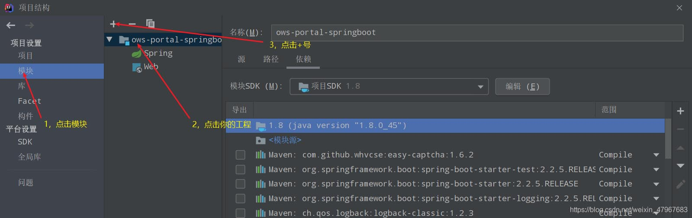

# Springboot 中application.yml和bootStrap.yml 的加载顺序

 转载

[guochunyang2004](https://blog.51cto.com/guochunyang)2022-11-14 22:23:50

***文章标签\*[bootstrap](https://blog.51cto.com/topic/bootstrap.html)[spring](https://blog.51cto.com/topic/spring-1.html)[配置文件](https://blog.51cto.com/topic/peizhiwenjian.html)*****文章分类\*[运维](https://blog.51cto.com/nav/ops)*****阅读数\**\*1627\****


\1. 若application.yml 和bootStrap.yml 在同一目录下，则bootStrap.yml 的加载顺序要高于application.yml,即bootStrap.yml 会优先被加载。

  原理：bootstrap.yml 用于应用程序上下文的引导阶段。

​       bootstrap.yml 由父Spring ApplicationContext加载。
​      •bootstrap.yml 可以理解成系统级别的一些参数配置，这些参数一般是不会变动的。
​      •application.yml 可以用来定义应用级别的，如果搭配 spring-cloud-config 使用 application.yml 里面定义的文件可以实现动态替换。
​      使用Spring Cloud Config Server时，应在 bootstrap.yml 中指定：
?
spring.application.name
spring.cloud.config.server.git.uri
\2. 不同位置的配置文件的加载顺序：

  在不指定要被加载文件时，默认的加载顺序：由里向外加载，所以最外层的最后被加载，会覆盖里层的属性（参考官网介绍）

SpringApplication will load properties from application.properties files in the following locations and add them to the Spring Environment: 

A /config subdirectory of the current directory.  //位于与jar包同级目录下的config文件夹，
The current directory               //位于与jar包同级目录下
A classpath /config package     //idea 环境下，resource文件夹下的config文件夹
The classpath root                //idea 环境下，resource文件夹下 （1->4, 外->里）
The list is ordered by precedence (properties defined in locations higher in the list override those defined in lower locations).

\3. 可以通过属性指定加载某一文件：

 java -jar myproject.jar --spring.config.location=classpath:/default.properties,classpath:/override.properties
当通过spring.config.location 指定一个配置文件时，配置文件的搜索顺序如下：

file:./custom-config/
classpath:custom-config/
file:./config/
file:./
classpath:/config/
classpath:/
最下层的优先加载，所以最上层的属性会覆盖下层的属性；

\4. 如果使用spring-cloud-config时，项目内部的resource下有bootstrap.yml文件，并且在bootstrap.yml 里配置spring.application.name, git.url,spring.active.profies. 将项目打成jar包，放到服务器上，与jar包并列的位置，有start.sh脚本， 

a. 在start 脚本里指定了配置文件：spring.config.location=./bootstrap.yml, 则配置文件的加载顺序将为：

\1. cloud-config 仓库里指定的yml 配置；

\2. ./bootstrap.yml

\3. classpath:/bootstrap.yml

\4. 外部application.yml

\5. 内部application.yml

b. 在start 脚本里指定了配置文件：spring.config.location=./application.yml, 则配置文件的加载顺序将为：

\1. cloud-config 仓库里指定的yml 配置；

\2. ./application.yml

\3.  classpath:/application.yml

\4. ./bootstrap.yml

\5. classpath:/bootstrap.yml

所以，不管是jar包内还是jar运行的同级目录下，只要包含bootstrap.yml ，且为云配置，则云配置文件会覆盖其他配置文件；


# Springboot中application.yml、application.properties和bootStrap.yml的加载顺序

 原创

[编程的世界你不懂](https://blog.51cto.com/u_11990719)2022-11-26 22:42:30博主文章分类：[springboot](https://blog.51cto.com/u_11990719/category128)©著作权

***文章标签\*[bootstrap](https://blog.51cto.com/topic/bootstrap.html)[spring](https://blog.51cto.com/topic/spring-1.html)[配置文件](https://blog.51cto.com/topic/peizhiwenjian.html)*****文章分类\*[运维](https://blog.51cto.com/nav/ops)*****阅读数\**\*191\****

一、SpringApplication位于项目根目录，所以所有得代码要和SpringApplication所在目录平级或下一级

二、以jar包发布springboot项目时，默认会先使用jar包跟目录下的application.properties来作为项目配置文件。
如果在不同的目录中存在多个配置文件，它的读取顺序是：
1、config/application.properties（项目根目录中config目录下）
2、config/application.yml
3、application.properties（项目根目录下）
4、application.yml
5、resources/config/application.properties（项目resources目录中config目录下）
6、resources/config/application.yml
7、resources/application.properties（项目的resources目录下）
8、resources/application.yml
注：
1、如果同一个目录下，有application.yml也有application.properties，默认先读取application.properties。
2、如果同一个配置属性，在多个配置文件都配置了，默认使用第1个读取到的，后面读取的不覆盖前面读取到的。
3、创建SpringBoot项目时，一般的配置文件放置在“项目的resources目录下”​​​​​
4、先后加载顺序：若application 和bootstrap 在同一目录下：bootstrap先加载 application后加载

三、 若application.yml 和bootStrap.yml 在同⼀⽬录下，则bootStrap.yml 的加载顺序要⾼于application.yml,即bootStrap.yml 会优先被加载。
原理：
bootstrap.yml ⽤于应⽤程序上下⽂的引导阶段。
bootstrap.yml 由⽗Spring ApplicationContext加载。
•bootstrap.yml 可以理解成系统级别的⼀些参数配置，这些参数⼀般是不会变动的。
•application.yml 可以⽤来定义应⽤级别的，如果搭配 spring-cloud-config 使⽤ application.yml ⾥⾯定义的⽂件可以实现动态替换。


# springboot如何查找配置文件路径的顺序和其优先级别

时间：2022-08-29*|*作者：艾尚波*|*点击：173次


##### 目录

- [查找配置文件路径的顺序和其优先级别](http://www.zhano.cn/Java/67111.html#_label0)

- - [一、springboot查找配置文件路径的顺序和其优先级别](http://www.zhano.cn/Java/67111.html#_lab2_0_0)
  - [二、同路径下](http://www.zhano.cn/Java/67111.html#_lab2_0_1)

- [springboot配置文件不生效的原因](http://www.zhano.cn/Java/67111.html#_label1)


## 查找配置文件路径的顺序和其优先级别

提示：以下是本篇文章正文内容，下面案例仅供参考


### 一、springboot查找配置文件路径的顺序和其优先级别

在项目类，有四个地方系统会自动扫描：

1.file:/config/

2.file:/

3.classPath:/config/

4.classPath:/

1)其文件生效优先级别，从上到下，即如果在不同路径有相同属性，会优先选择上面的路径属性（1>2>3>4）

2)路径扫描顺序和其优先级别相反（4>3>2>1）,后面的会覆盖前面的，并且所有路径都会扫描，形成互补。


### 二、同路径下

**application.properties(application.yml)、bootstrap.properties(bootstrap.yml)加载顺序及优先级别**

**1.application和bootstrap比较(前缀比较)**

提示：bootstrap类型文件是在多服务项目时，引入了springcloud相关配置才会生效，springboot并不会自动扫描bootstrap文件，只会扫描application文件，所以两者的比较只有在spingcloud多服务项目中才有意义。

1)先后加载顺序：若application 和bootstrap 在同一目录下：bootstrap先加载 application后加载

2）优先级问题：Bootstrap 属性有高优先级，默认情况下，它们不会被本地配置覆盖。（这个是网上和官方的说法，但经过本人的测试，发现application 会覆盖bootstrap，我的理解是不是所有的bootstrap属性都比application优先，只有涉及底层系统相关配置才会比较高 ，有不同看法的老哥欢迎探讨）

3）区别：bootstrap 和 application 都可以用来配置参数。

bootstrap 用来程序引导时执行，应用于更加早期配置信息读取。可以理解成系统级别的一些参数配置，这些参数一般是不会变动的。一旦bootstrap被加载，则内容不会被覆盖。

application.yml 可以用来定义应用级别的， 应用程序特有配置信息，可以用来配置后续各个模块中需使用的公共参数等。

4）bootstrap典型的应用场景（经典三点）

- 1.当使用 Spring Cloud Config Server 配置中心时，这时需要在 bootstrap.yml 指定 spring.applicatio配置文件中n.name 和 spring.cloud.config.server.git.uri，添加连接到配置中心的配置属性来加载外部配置中心的配置信息
- 2.一些固定的不能被覆盖的属性
- 3.一些加密/解密的场景

**2. .properties和.yml比较(后缀比较)**

1）加载顺序

.yml先于.properties

2)优先级别

.properties优先于.yml，因为.properties后加载会覆盖.yml

3）区别

- 1.yml拥有天然的树状结构，properties是键值对；
- 2.在properties文件中是以”.”进行分割的， 在.yml中是用”:”进行分割；
- 3.在.yml中缩进一定不能使用TAB，否则会报很奇怪的错误；；
- 4.yml比.properties对中文对支持更友好。
- 5.yml是跨语言的:可以在包括JAVA，go，python等大量的语言中使用，比如做云计算使用go和java的时候，可以通过配置中心使用同一份配置！
- 6.在自定义配置文件时，只能使用properties，因为spring只有@PropertiesSource注解可以引入自定义注解，对yml没有支持

小结：在同级目录下，优先级别application>bootstrap,.properties>,yml，前缀大于后缀，文件路径大于文件名称


## springboot配置文件不生效的原因

1、将打包方式改为jar 。

```
<``packaging``>jar</``packaging``>
```

2、可能是yml文件缩近格式不对，仔细检查一下就行了。

3、还有就是你的根本就不是boot项目，application.yml没有叶子标志

1.点开项目结构


2.打开模块一次点击



3.


4.重构项目

