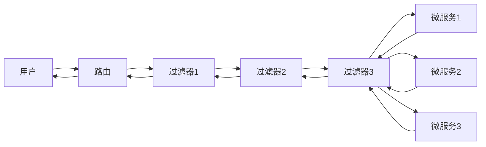

## Gateway入门

### 1. 网关的作用

1. 身份认证和权限校验
2. 服务路由（根据请求转到指定的服务）和负载均衡（选择合适的服务实例）
3. 请求限流

### 2. 搭建网关服务

#### 2.1 创建网关服务模块gateway

#### 2.2 引入依赖

```xml
<dependencies>
    <dependency>
        <groupId>org.springframework.cloud</groupId>
        <artifactId>spring-cloud-starter-gateway</artifactId>
    </dependency>
    <dependency>
        <groupId>com.alibaba.cloud</groupId>
        <artifactId>spring-cloud-starter-alibaba-nacos-discovery</artifactId>
    </dependency>
    <dependency>
        <groupId>org.springframework.cloud</groupId>
        <artifactId>spring-cloud-starter-loadbalancer</artifactId>
    </dependency>
</dependencies>
```

#### 2.3 服务注册及配置路由

```yaml
server:
  port: 30000

spring:
  application:
    name: gateway

  cloud:
    nacos:
      discovery:
        service: ${spring.application.name}
        username: nacos
        password: nacos
        server-addr: 127.0.0.1:8848

    gateway:
      routes:
        - id: route-user
          uri: lb://user
          predicates:
            - Path=/user/**

        - id: router-order
          uri: lb://order
          predicates:
            - Path=/order/**
```

routes说明

id：唯一标识，可以自定义

url：lb://service-name 通过服务名访问服务，实现负载均衡，依赖loadbalancer， 也可以通过设置

```yaml
uri:http://127.0.0.1:30001
```

的方式设置固定转发到指定的服务器上。

predicates: 断言，满足条件才会转发请求。如：-Path=/order/** 以/order开头的请求将换发给order服务

多个路由规则会自上而下逐个比较各个路由规则，如果路由规则包含多个断言，则每个断言都必须匹配该路由规则才会生效。没有找到匹配的路由规则将返回404

#### 2.4 启动类：

```java
@EnableDiscoveryClient
@SpringBootApplication
public class GatewayApplication {
    public static void main(String[] args) {
        SpringApplication.run(GatewayApplication.class, args);
    }
}
```

### 3. 路由断言工厂 Route Predicate Factory

配置文件中的predicate条件会有PredicateFactory处理，转变为路由判断条件。如Path=/user/**是根据请求路径进行匹配，这个规则的处理类是：

org.springframework.cloud.gateway.handler.predicate.PathRoutePredicateFactory

类似的断言工厂还有很多。参考：https://docs.spring.io/spring-cloud-gateway/docs/3.1.4/reference/html/#gateway-request-predicates-factories

| 名称                   | 说明                                                | 示例                                                         |
| ---------------------- | --------------------------------------------------- | ------------------------------------------------------------ |
| After                  | 在某个时间点之后                                    | \- After=2020-01-01T18:00:00.000+08:00[Asia/Shanghai]        |
| Before                 | 在某个时间点之前的请求                              | \- Before=2030-01-01T18:00:00.000+08:00[Asia/Shanghai]       |
| Between                | 在两个时间点之间的请求                              | \- Between=2030-01-01T09:00:00.000+08:00[Asia/Shanghai], 2030-01-01T18:00:00.000+08:00[Asia/Shanghai] |
| Cookie                 | 包含某些cookie的请求                                | \- Cookie=chocolate, ch.p                                    |
| Header                 | 包含某些header的请求                                | \- Header=X-Request-Id, \d+                                  |
| Host                   | 请求必须是访问某个host（域名）                      | \- Host=\**.somehost.org,**.anotherhost.org                  |
| Method                 | 请求方式必须是指定的方式                            | \- Method=GET,POST                                           |
| Path                   | 请求路径必须符合指定规则                            | \- Path=/red/{segment},/blue/{segment}                       |
| Query                  | 请求参数必须包含指定参数                            | \- Query=green                                               |
| RemoteAddr             | 请求者的ip必须在指定范围内                          | \- RemoteAddr=192.168.1.1/24                                 |
| Weight                 | 权重处理                                            | \- Weight=group1, 8                                          |
| XForwarded Remote Addr | header包含了X-Forwarded-For，并且ip必须在指定范围内 | \- XForwardedRemoteAddr=192.168.1.1/24                       |

### 4. 过滤器 Filter

#### 4.1 网关过滤器 Gateway Filter

可以对进入网关的请求和微服务返回的相应做处理

请求流程：



参考文档：

https://docs.spring.io/spring-cloud-gateway/docs/3.1.4/reference/html/#gatewayfilter-factories

| 名称                          | 说明 | 示例                                                         |
| ----------------------------- | ---- | ------------------------------------------------------------ |
| AddRequestHeader              |      | - AddRequestHeader=X-Request-red, blue                       |
| AddRequestParameter           |      | - AddRequestParameter=red, blue                              |
| AddResponseHeader             |      | - AddResponseHeader=X-Response-Red, Blue                     |
| DedupeResponseHeader          |      | \- DedupeResponseHeader=Access-Control-Allow-Credentials Access-Control-Allow-Origin |
| CircuitBreaker                |      | \- CircuitBreaker=myCircuitBreaker                           |
| FallbackHeaders               |      | filters: <br /> - name: FallbackHeaders<br />   args:<br />       executionExceptionTypeHeaderName: Test-Header |
| MapRequestHeader              |      | \- MapRequestHeader=Blue, X-Request-Red                      |
| PrefixPath                    |      | \- PrefixPath=/mypath                                        |
| PreserveHostHeader            |      | \- PreserveHostHeader                                        |
| RequestRateLimiter            |      |                                                              |
| RedirectTo                    |      | \- RedirectTo=302, https://acme.org                          |
| RemoveRequestHeader           |      | \- RemoveRequestHeader=X-Request-Foo                         |
| RemoveResponseHeader          |      | \- RemoveResponseHeader=X-Response-Foo                       |
| RemoveRequestParameter        |      | \- RemoveRequestParameter=red                                |
| RequestHeaderSize             |      | \- RequestHeaderSize=1000B                                   |
| RewritePath                   |      | \- RewritePath=/red/?(?<segment>.*), /$\{segment}            |
| RewriteLocationResponseHeader |      | \- RewriteLocationResponseHeader=AS_IN_REQUEST, Location, ,  |
| RewriteResponseHeader         |      | \- RewriteResponseHeader=X-Response-Red, , password=[^&]+, password=*** |
| SaveSession                   |      | \- SaveSession                                               |
| SecureHeaders                 |      |                                                              |
| SetPath                       |      | predicates:<br />  - Path=/red/{segment}<br />filters:<br />  - SetPath=/{segment} |
| SetRequestHeader              |      | predicates:<br />        - Host: {segment}.myhost.org<br />filters:<br />        - SetRequestHeader=foo, bar-{segment} |
| SetResponseHeader             |      | \- SetResponseHeader=X-Response-Red, Blue                    |
| SetStatus                     |      | \- SetStatus=401                                             |
| StripPrefix                   |      | \- StripPrefix=2                                             |
| Retry                         |      |                                                              |
| RequestSize                   |      | filters:<br />        - name: RequestSize<br />          args:<br />            maxSize: 5000000 |
| SetRequestHostHeader          |      | filters:<br />        - name: SetRequestHostHeader<br />          args:<br />            host: example.org |
| ModifyRequestBody             |      |                                                              |
| ModifyResponseBody            |      |                                                              |
| Token Relay                   |      |                                                              |
| CacheRequestBody              |      |                                                              |
| JSONToGRPC                    |      |                                                              |

#### 4.2 默认过滤器 Default Filter

所有的请求都会通过该过滤器，在配置文件中设置

```yaml
gateway:
	default-filters:
		- AddResponseHeader=X-Response-Default-Red, Default-Blue
```


完整的配置示例：

配置示例：

```yaml
spring:
  application:
    name: gateway

  cloud:
    nacos:
      discovery:
        service: ${spring.application.name}
        username: nacos
        password: nacos
        server-addr: 127.0.0.1:8848

    gateway:
      routes:
        - id: route-user
          uri: lb://user
          predicates:
            - Path=/user/**

        - id: router-order
          uri: lb://order
          predicates:
            - Path=/order/**
            - Before=2030-01-01T18:00:00.000+08:00[Asia/Shanghai]
          filters:
            - AddRequestHeader=GatewayMsg, FromGateway
      default-filters:
        - AddRequestHeader=GatewayDefaultMsg, this call through Gateway
```

#### 4.3. 全局过滤器 GlobalFilter

作用于一切进入网关的请求和微服务的响应，与GatewayFilter作用一样，区别是GatewayFilter通过配置定义，处理逻辑固定，GlobalFilter通过代码实现处理逻辑。示例：

```java
@Component
@Order(1)
public class AuthorizeFilter implements GlobalFilter, Ordered {
    @Override
    public Mono<Void> filter(ServerWebExchange exchange, GatewayFilterChain chain) {
        ServerHttpRequest request = exchange.getRequest();
        MultiValueMap<String, String> queryParams = request.getQueryParams();
        String authorization = queryParams.getFirst("authorization");

        if (StringUtils.equals(authorization, "admin")) {
            return chain.filter(exchange);
        }

        ServerHttpResponse response = exchange.getResponse();
        response.setStatusCode(HttpStatus.UNAUTHORIZED);
        return response.setComplete();
    }

    @Override
    public int getOrder() {
        return 1;
    }
}
```

@Order(1)和实现接口Ordered，在getOrder方法中返回1的作用是一样的，选择一个即可。order取值越小，优先级越高。

GatewayFilterChain是过滤器链，调用chain.filter(exchange);将请求放行，交给下一个过滤器处理。调用response.setComplete将会拦截请求并立即返回。


#### 4.4 过滤器的排序

请求进入网关会通过3类过滤器， GatewayFilter,DefaultFilter和GlobalFilter，网关会将这3种过滤器整合成一个过滤器链，请求经过路由后，会再经过过滤器链处理。其中路由过滤器和DefaultFilter的实现是一样的，只是配置的位置不一样和作用范围不一样，比如：

```yaml
gateway:
      routes:
        - id: router-order
          uri: lb://order
          predicates:
            - Path=/order/**
          filters:
            - AddRequestHeader=GatewayMsg, FromGateway
      default-filters:
        - AddRequestHeader=GatewayDefaultMsg, this call through Gateway
```

这里有两个AddRequestHeader过滤器，都是通过 org.springframework.cloud.gateway.filter.factory.AddRequestHeaderGatewayFilterFactory 读取配置文件，生成的。

```java
public class AddRequestHeaderGatewayFilterFactory extends AbstractNameValueGatewayFilterFactory {
	@Override
	public GatewayFilter apply(NameValueConfig config) {
		return new GatewayFilter() {
            // ...
        };
	}
}
```

其他功能的过滤器也是同理。


在 org.springframework.cloud.gateway.handler.FilteringWebHandler类中有

```java
public class FilteringWebHandler implements WebHandler {
	//...
	private static List<GatewayFilter> loadFilters(List<GlobalFilter> filters) {
		return filters.stream().map(filter -> {
			GatewayFilterAdapter gatewayFilter = new GatewayFilterAdapter(filter);
			if (filter instanceof Ordered) {
				int order = ((Ordered) filter).getOrder();
				return new OrderedGatewayFilter(gatewayFilter, order);
			}
			return gatewayFilter;
		}).collect(Collectors.toList());
	}
	// ...
	private static class GatewayFilterAdapter implements GatewayFilter {

		private final GlobalFilter delegate;

		GatewayFilterAdapter(GlobalFilter delegate) {
			this.delegate = delegate;
		}
		// ...
	}
}
```

将GlobalFilter通过GatewayFilterAdapter转化为GatewayFilter的实现，并将所有的GlobalFilter组成List\<GatewayFilter>

路由过滤器和DefaultFilter的Order按照声明顺序从1开始累加，GlobalFilter可以指定。这样很容易出现三种过滤器Order一致的情况，所有的过滤器首先按照Order排序，Order一致则按照  DefaultFilter --> 路由过滤器 --> GlobalFilter 的顺序执行。


参考：

org.springframework.cloud.gateway.route.RouteDefinitionRouteLocator

org.springframework.cloud.gateway.handler.FilteringWebHandler


### 6. 跨域问题处理

#### 6.1 跨域问题

浏览器有一个安全机制即**同源策略**，所谓同源就是两个资源具有相同的协议（protocol），主机（host）端口号（port）。浏览器不允许客户端脚本访问非同源的资源，如果客户端发起这样的请求就产生了跨域问题。

比如：

域名不同： www.taobao.com 与 www.taobao.org    www.jd.com 与 miaosha.jd.com

域名相同，端口不同: localhost:8080 localhost:8081

**跨域发生的场景：**
 前后端数据联调的时候，前端服务在A域名下，而后端API 服务在B域名下，从A发ajax请求到B就发生了跨域。

浏览器禁止请求的发起者与服务端发生跨域的ajax请求，请求会被浏览器拦截。


#### 6.2 网关处理跨域问题

网关的跨域问题处理采用CORS方案，并且只需要做简单的配置即可：

```
spring:
  cloud:
    gateway:
      globalcors:
        # 解决option请求被拦截的问题
        add-to-simple-url-handler-mapping: true
        
        # org.springframework.web.cors.CorsConfiguration
        cors-configurations:
          # 对于 /** ，即任意请求
          '[/**]':
              # 允许下列网站进行跨域请求
              allowedOrigins:
                - "http://localhost:8090"
                - "http://www.leyou.com"

              # 允许的跨域ajax的请求方式
              allowedMethods:
                - "GET"
                - "POST"
                - "DELETE"
                - "PUT"
                - "OPTIONS"

              # 允许在请求头中携带的信息
              allowedHeaders: "*"

              #是否允许携带Cookie
              allowCredentials: true

              # 跨域检测的有效期
              maxAge: 360000
```


cors-configurations 配置参考org.springframework.web.cors.CorsConfiguration

参考官方文档:

https://docs.spring.io/spring-cloud-gateway/docs/3.1.4/reference/html/#cors-configuration


### 7. 参考文档

https://docs.spring.io/spring-cloud-gateway/docs/3.1.4/reference/html/
