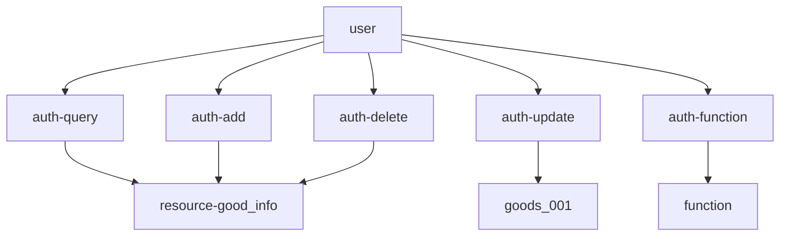
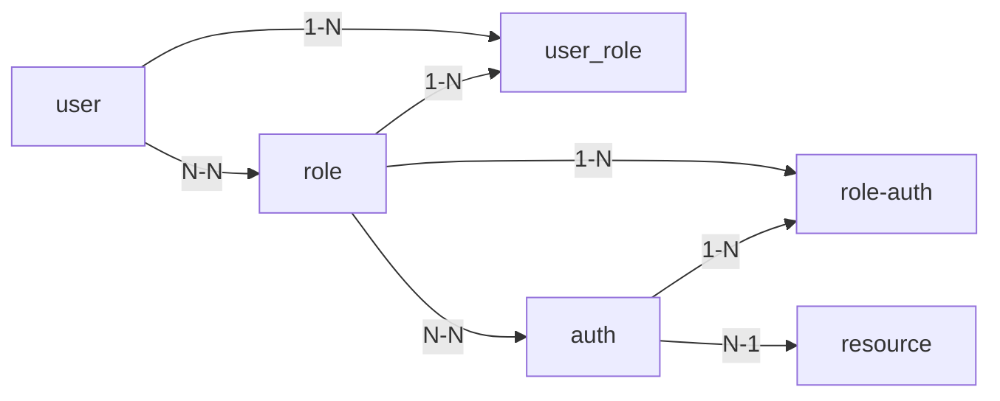
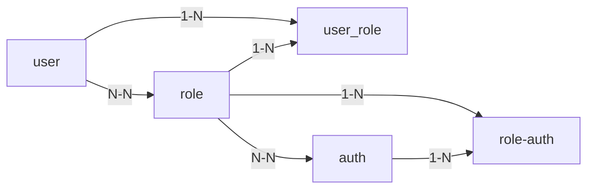

# Spring Security OAuth2.0认证授权


## 1. 基本概念  

### 1.1 认证  

**认证**：判断一个用户的身份是否合法的过程。在初次使用系统前需要注册成为系统用户，然后输入账号和密码即可登录系统，输入账号和密码登录系统的过程就是认证。  常用认证方式：用户名密码，二维码登录，手机短信登录，指纹认证等。

系统为什么要认证？

认证是为了保护系统的隐私数据与资源，用户的身份合法方可访问该系统的资源。


#### 1.2 会话

用户认证（登录）后，为了避免每次操作都进行认证（每个请求都再认证很影响性能），一旦认证通过就创建一个会话，可以将用户的基本信息保存在会话中，直到用户退出会话（登出）。有了会话用户在使用系统的功能时就不需要再次认证了，除非是一些比较敏感的，比如要支付了，就需要再次输入支付密码进行二次认证。一般情况下只需要认证一次，在会话退出之前，是不需要再次认证的。


会话就是系统为了保持当前用户登录状态所提供的机制。常见的方式有基于session的方式和基于token的方式。


##### 1.2.1  基于session的方式

1. 客户端：发起首次请求（用户名+密码）发送至服务器
2. 服务器：接收客户端的登录请求，认证（验证用户名+密码）后创建一个session对象，保存到session容器中，session对象有一个唯一标识sessionId
3. 服务器：将2中创建的session对象的sessionId返回给客户端
4. 客户端：接收到3中服务器返回的sessionId后保存到本地（cookie）
5. 客户端：后续的请求中会携带4中保存的sessionId发送至服务端
6. 服务端：接收到客户端的请求后，读取sessionId，在session容器中进行根据sessionId查找session对象（包含用户的基本信息）


##### 1.2.2 基于Token的方式

1. 客户端：发起首次请求（用户名+密码）发送至服务器
2. 服务器：接收客户端的登录请求，认证用户身份（验证用户名+密码），**根据用户信息使用特定算法创建一个token**，注意：**服务端不需要保存token**
3. 服务器：将2中创建的token返回给客户端
4. 客户端：接收到3中服务器返回的token后**保存到本地任意存储介质**，可以是浏览器的localStorage或者客户端文件等。
5. 客户端：后续的请求中会携带4中保存的token发送至服务端
6. 服务端：接收到客户端的请求后，读取token，**根据生成token的算法进行解析并校验token**获取当前用户的信息。


基于token的方式问题：

1. 什么时候token失效？
2. 客户端1登录后离线期间，客户端2登录同一账号并且更新用户信息，然后客户端1再次连线发起请求，客户端1中的token保存的用户信息如何同步最新数据？


#### 1.3 授权

根据用户的权限来控制用户使用资源的过程就是授权。拥有资源的访问权限则正常访问，没有权限则拒绝访问。


##### 1.3.1 授权的数据模型

如何进行授权即如何对用户访问资源进行控制，授权可以简单理解为 who 对 what 进行 how 的操作。

who 即主体（subject），主体一般指用户，也可以是程序，系统资源的访问者。

what 即资源（resource），如商品信息，订单信息，系统菜单，页面，按钮，代码方法。系统菜单，页面，按钮，代码方法属于**系统功能资源**，对于web系统，每个系统功能资源通常对应一个url。商品信息，订单信息属于**实体资源（数据资源）**，实体资源由**资源类型**和**资源实例**组成，如商品信息为资源类型，商品编号为001的商品为资源实例。


主体、资源、权限关系：




主体，资源，权限相关的数据模型如下：

主体（用户id， 账号， 密码，...）

资源（资源id， 资源名称，访问地址）

权限（权限id, 权限标识,权限名称，资源id）

角色（角色id， 角色名称）

角色和权限关系（角色id，权限id）

主体（用户）和角色关系（用户id，角色id）


主体（用户）、资源、权限关系如下图：




通常开发中将资源和权限合并为一张表, 如下：

资源（资源id， 资源名称，访问地址）

权限（权限id, 权限标识,权限名称，资源id）

合并为：

权限（权限id, 权限标识,权限名称，资源名称，访问地址）


修改后的数据模型如下：





### 1.4 RBAC

##### 1.4.1 基于角色的访问控制

Role-Based-Access-Control 是按照角色进行授权，例如：主体如果是总经理可以查询企业的运营报表，查询员工工资，伪代码示例：

```java
if(subject.hasRole("ceo")){
	querySalary();
}
```

如果需求变更，总经理和部门经理都可以查看员工工资，那么代码就需要进行修改，如下：

```java
if(subject.hasRole("ceo")||subject.hasRole("department-manager")){
	querySalary();
}
```

基于角色的权限控制系统可扩展性差。


##### 1.4.2 基于资源的访问控制

Resource-Based-Access-Control 是按照资源进行授权。查询工资权限可以定义为一个资源标识为query-salary，伪代码如下：

```java
if(subject.hasPermission("query-salary")){
    querySalary();
}
```

访问资源所需的角色变化不需要更改代码，系统可扩展性强。


### 2. 基于session的认证

### 2.1 认证流程

1. 客户端：发起首次请求（用户名+密码）发送至服务器
2. 服务器：接收客户端的登录请求，认证（验证用户名+密码）后创建一个session对象，保存到session容器中，session对象有一个唯一标识sessionId
3. 服务器：将2中创建的session对象的sessionId返回给客户端
4. 客户端：接收到3中服务器返回的sessionId后保存到本地（cookie）
5. 客户端：后续的请求中会携带4中保存的sessionId发送至服务端
6. 服务端：接收到客户端的请求后，读取sessionId，在session容器中进行根据sessionId查找session对象（包含用户的基本信息）

当用户退出系统或者session过期销毁时，客户端保存的sessionId也会失效。

基于session的认证机制由servlet规范定制，servlet容器已实现，用户通过HttpSession的操作方法即可实现。


