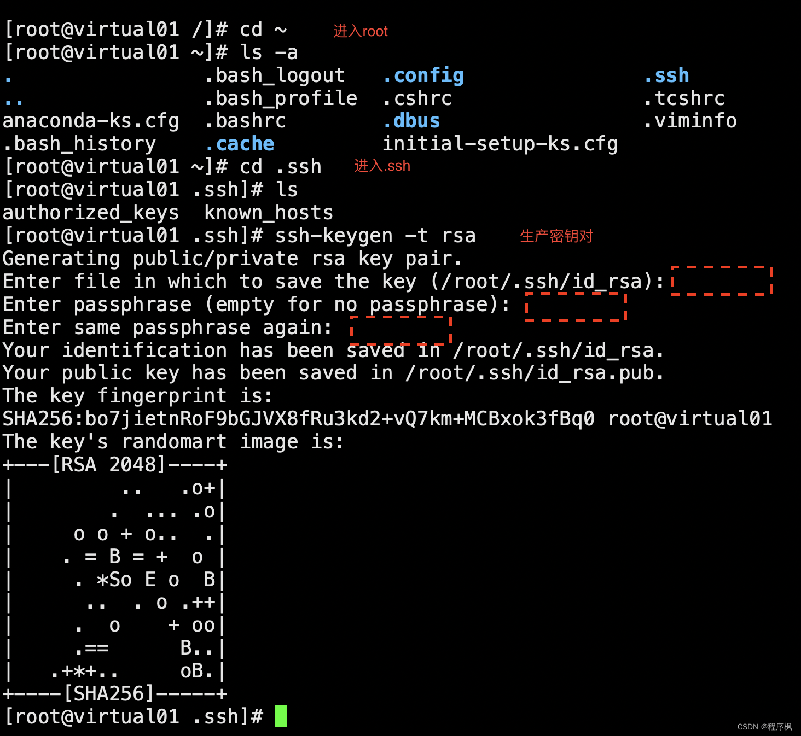

## SSH远程登录设置免密登录


集群的各个服务器之间，可以相互信任，设置免密登录。免密登录的实质其实就是数据加密解密，校验通过，即可登录。


①使用 

```bash
ssh-key-gen
```

 命令生成A服务器的密钥对（一对密钥，公钥A和私钥A）；

②将A服务器的公钥A拷贝给另外一台服务器B保存起来，这个过程也叫做授权；
③授权完成后，A服务器再访问B服务器，会携带着用私钥A加密过的数据；
④B服务器接收到请求数据后，使用公钥A解密；
⑤B服务器将解密成功的信息通过公钥A加密后返回给A服务器；
⑥A服务器接收到数据后，用私钥A解密，解密成功，即“对暗号”成功，登录成功。 

免密登录设置步骤：
比如有A、B、C三台服务器，相互登录都免密。

（1）生产密钥对
        先进入A服务器的root目录，使用cd ~命令即可进入root目录，在root目录下找到.ssh目录，.ssh目录是隐藏的，使用ls -a就可以看到，然后使用

```
ssh-keygen -t rsa
```

命令生成密钥对。


（2）授权
        授权的过程其实就是将A服务器的公钥分别给自己、B、C都拷贝一份。使用命令

```bash
ssh-copy-id 192.168.0.151
```

如果配置了域名 ( /etc/hosts ) 也可以使用

```bash
ssh-copy-id k8s-master01
```

期间需要输入密码。


B、C服务器的授权用上面相同方法即可。

然后就可以使用ssh免密登录，其实就是2个步骤，第一生成秘钥，第二授权