## SSH免密登录配置

免密登录命令：

1 进入.ssh目录

```
cd ~/.ssh
```

2 生成一对密钥

```bash
ssh-keygen -t rsa
```

3 发送公钥

```bash
ssh-copy-id 192.168.xx.xxx
```

4 免密登录测试

```bash
ssh 192.168.xx.xxx
```


一、免密登录原理

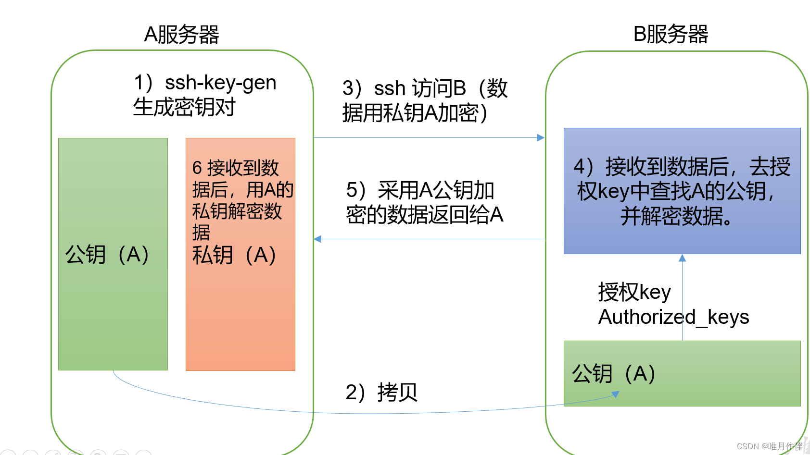

   免密登录原理通过RSA公开密钥算法的一种应用。RSA是公开密钥密码体制的一种使用不同的加密密钥与解密密钥，“由已知加密密钥推导出解密密钥在计算上是不可行的”密码体制(非对称加密) 。在公开密钥密码体制中，加密密钥（即公开密钥）PK是公开信息，而解密密钥（即秘密密钥）SK是需要保密的。加密算法E和解密算法D也都是公开的。虽然解密密钥SK是由公开密钥PK决定的。

   通俗的来说就是同时生成公钥和私钥，私钥自己保存，公钥发给其他人。


二、配置ssh
1.查看 .ssh目录
直接去home目录找是找不到的，.ssh文件隐藏起来了。得用ll -a 查看全部文件（包括隐藏文件）

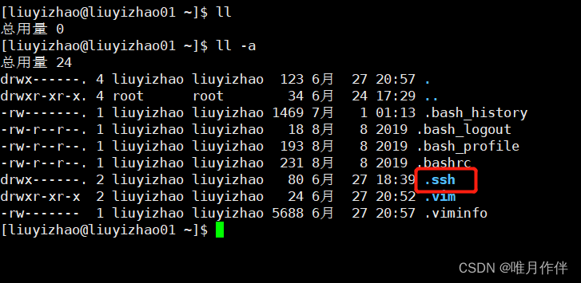

2.进入.ssh目录
进入.ssh目录，可以发现什么都没有，如果有则是之前连接过其他机器；

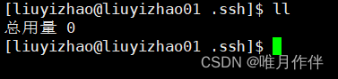

3.ssh连接102
这个时候我们去连接需要输入yes及密码才可以；

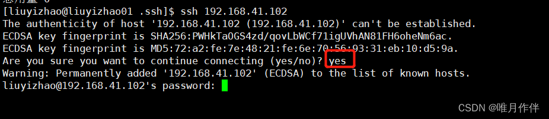


4.生成密钥
生成一对密钥，使用rsa通用密钥算法，这时需要有三次回车；

```bash
ssh-keygen -t rsa
```

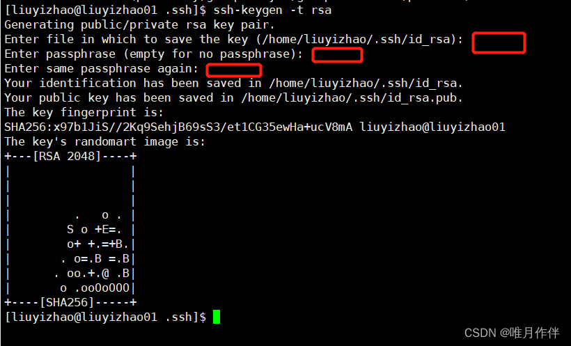

5.生成后文件介绍
这时出现几个文件，id_rsa.pub(publilc)公钥，id_rsa私钥，known_hosts是上几步输入ssh 192.168.41.102 产生的文件；

| known_hosts     | 记录ssh访问过计算机的公钥（public key）      |
| --------------- | -------------------------------------------- |
| id_rsa          | 生成的私钥                                   |
| id_rsa.pub      | 生成的公钥                                   |
| authorized_keys | 存放授权过的无密登录服务器公钥（后面会提到） |

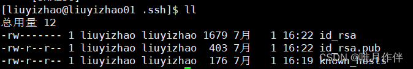


6.cat查看id_rsa.pub文件
查看id_rsa.pub文件，公钥有所属的主机和用户，这时你可以将公钥发给其他人；

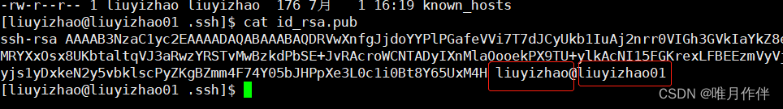


7.101给自己发送公钥 
发送公钥 ，先给自己发一份，再给其他机器发送。输入yes及密码，密码隐藏看不到，直接输入就可以，如果输错则重复输入三遍，如果三遍都错误，则删除.ssh下所有文件重新生成；

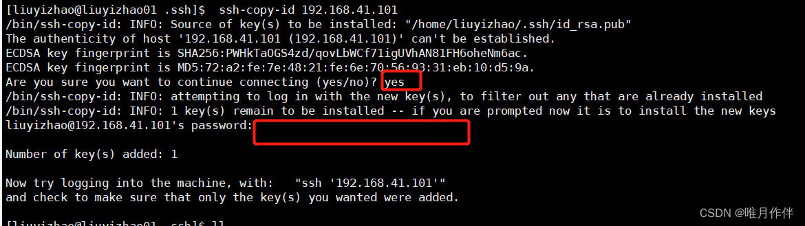


8.查看 authorized_keys文件
这时生成了 authorized_keys 文件，文件与id_rsa.pub内容相同；

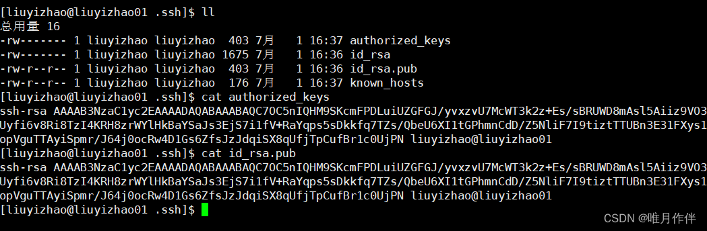


9.101发送公钥去102
命令 ssh-copy-id 192.168.41.102 ，从 101 发送公钥到 102 ；

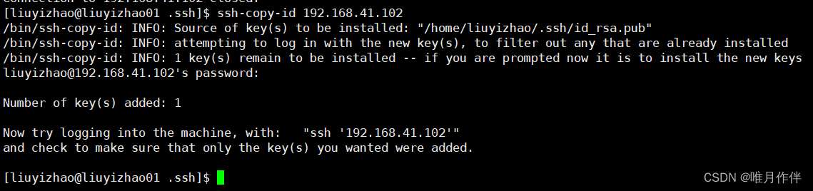


10.ssh 效果展示
命令 ssh 连接其他机器，发现不需要密码；

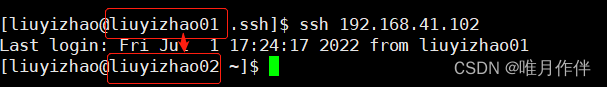


11.退出102
exit 退出102；

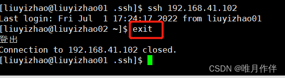


12.在102上配置免密登录
这时我们配置了101=>101、101=>102的免密登录，同时要在102上配置免密登录，并且我们需要对102=>101、102=>102也配置免密登录，102机器中存在101发过来的公钥 authorized_keys；

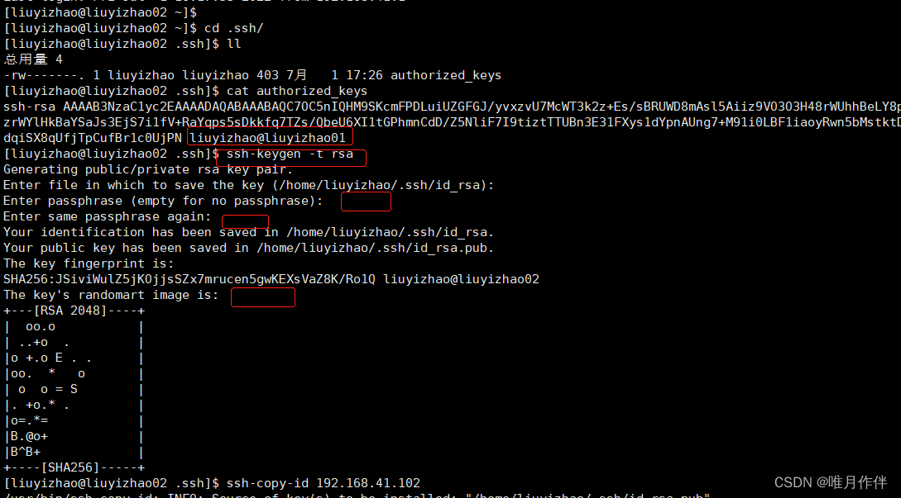

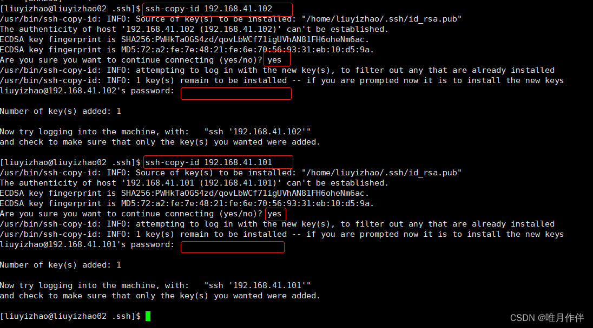


13.结果
这时我们配置102=>102、102=>101的免密登录就配置好了。

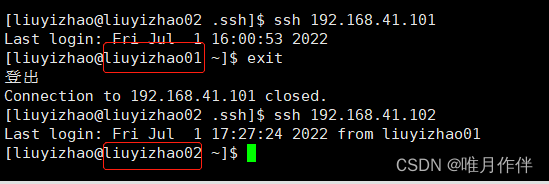

