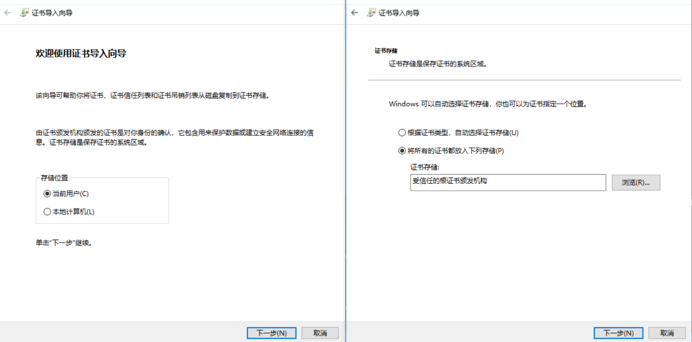

# 如何安装和信任自签名证书

2021/11/11·4 分钟阅读时长

如何在不同的操作系统、应用程序、容器 Docker 以及 Java 和 NodeJS 等运行环境中信任自签名证书？本文包含了全面的操作指引和经过检验的快速有效的方法。本篇是“自签名证书与安全”系列之二，记录个人最佳实践。

如何信任自签名证书？以下详细列出了常见的环境与应用中的详细操作方法。

首先可以划分为以下三种情况：

1. 大多数应用会直接信任系统的根证书列表，所以如果有权限的话把根证书安装到操作系统证书存储中就行；
2. 某些应用或环境则使用特定的根证书存储，需要安装到对应的位置。
3. 直接在应用中指定要信任的证书。这通常是在专门的配置文件、命令行参数或直接在源代码中，不在本文讨论范围。

忽略浏览器等应用的证书警告，通过配置文件选项、命令行参数或环境变量等忽略证书验证，这些方法显著降低了安全性，不建议使用。

## 根证书存储的位置[#](https://kompost.cn/posts/install-and-trust-self-signed-cert/#根证书存储的位置)

在客户端安装自签名根证书到对应的根证书存储，则相应的客户端应用会信任由该自签名根证书颁发的 SSL 证书。常见系统和应用如下：

- Windows 根证书存储分“本地计算机”（系统）和“当前用户”，通常存储在注册表中。

- Linux 主要发行版系统根证书存储位置速查表：

  - [wget](https://kompost.cn/) 命令包含硬编码路径，需要注意

  | 操作系统               | 路径                                                         |
  | ---------------------- | ------------------------------------------------------------ |
  | Debian/Ubuntu/Gentoo   | /etc/ssl/certs/ca-certificates.crt                           |
  | Fedora/CentOS/RHEL 7.x | /etc/pki/ca-trust/extracted/pem/tls-ca-bundle.pem            |
  | Fedora/CentOS/RHEL 6.x | /etc/pki/tls/certs/ca-bundle.crt                             |
  | Alpine Linux <=3.11    | /etc/ssl/cert.pem                                            |
  | Alpine Linux >=3.12    | /etc/ssl/certs/ca-certificates.crt (/etc/ssl/cert.pem 是符号链接) |
  | OpenSUSE/SLES          | /var/lib/ca-certificates/ca-bundle.pem /etc/ssl/ca-bundle.pem |

- Java 环境有特定的可信根证书存储，不同版本也存在一些区别。但都通过 keytool 来管理。

- NodeJS 官方建议使用环境变量 `NODE_EXTRA_CA_CERTS` 来指定额外的根证书。

- [Firefox](https://kompost.cn/) 浏览器有自己的可信根证书列表

## 如何安装根证书[#](https://kompost.cn/posts/install-and-trust-self-signed-cert/#如何安装根证书)

如果采用了“[如何快速生成自签名 SSL 证书](https://kompost.cn//posts/gen-self-signed-ssl-cert/)”中的工具来生成自签名根证书，[mkcert](https://kompost.cn//posts/gen-self-signed-ssl-cert/#mkcert) 或 [step](https://kompost.cn//posts/gen-self-signed-ssl-cert/#stepca) 命令行工具支持前述部分场景的自动安装。

任何时候都可以参考以下说明手动安装：

### 系统证书存储[#](https://kompost.cn/posts/install-and-trust-self-signed-cert/#系统证书存储)

Edge\Chrome 浏览器等很多应用自动信任操作系统的证书列表（需要注意 Chrome 维护着额外的证书黑名单）。

#### macOS[#](https://kompost.cn/posts/install-and-trust-self-signed-cert/#macos)

```bash
# 安装 root_ca.crt
sudo security add-trusted-cert -d -r trustRoot -k /Library/Keychains/System.keychain ~/root_ca.crt

# 删除指定的证书
sudo security delete-certificate -c "<name of existing certificate>"
```

#### Linux[#](https://kompost.cn/posts/install-and-trust-self-signed-cert/#linux)

- 不同发行版，更新根证书存储的命令不一样，用来保存私有证书的路径也不一样

- 先复制自签名 CA 证书到特定路径，再运行命令更新根证书存储

  Debian/Ubuntu/Gentoo

  ```bash
  # Debian/Ubuntu/Gentoo
  # - 安装
  sudo cp root_ca.crt /usr/local/share/ca-certificates/root_ca.crt
  # update-ca-certificates 会添加 /etc/ca-certificates.conf 配置文件中指定的证书
  #   另外所有 /usr/local/share/ca-certificates/*.crt 会被列为隐式信任
  sudo update-ca-certificates
  
  # - 删除
  sudo rm /usr/local/share/ca-certificates/root_ca.crt
  sudo update-ca-certificates --fresh
  ```

  CentOS/Fedora/RHEL

  Alpine

  OpenSUSE/SLES

#### Windows[#](https://kompost.cn/posts/install-and-trust-self-signed-cert/#windows)

1. 在根证书文件点鼠标右键，选择“安装证书”
2. 选择“当前用户”或者“本地计算机”，下一步
3. “将所有的证书都放入下列存储”，“浏览”，“受信任的根证书颁发机构”，“确定”，下一步
4. 完成，“是”，确定





### 其他应用或环境[#](https://kompost.cn/posts/install-and-trust-self-signed-cert/#其他应用或环境)

#### NodeJS[#](https://kompost.cn/posts/install-and-trust-self-signed-cert/#nodejs)

[官方文档](https://nodejs.org/dist/latest-v16.x/docs/api/all.html#cli_node_extra_ca_certsfile)提示可以设置环境变量 `NODE_EXTRA_CA_CERTS` 指向要附加的根证书文件。例如 alpine 系统环境下（参考 [Docker](https://kompost.cn/) 例子）：`export NODE_EXTRA_CA_CERTS=/etc/ssl/certs/ca-cert-root_ca.pem`

注意：命令中的 ca-cert-root_ca.pem 是由安装 root_ca.crt 时由`update-ca-certificates` 生成，Node 环境变量只需要指定附加的证书。请修改为你自己的文件名。文档中还提示了两种环境变量无效的情况，一是 node 作为 setuid root 运行或拥有 Linux 文件 capabilities；二是仅启动时读取，运行时用 process.env 修改没有影响。


#### Java[#](https://kompost.cn/posts/install-and-trust-self-signed-cert/#java)

Java 的 keystore 通常存储在 `$JAVA_HOME/lib/security/cacerts` 中。keytool 命令行不指定 `-keystore` 参数时，有可能存储于 `~/.keystore` 中。

使用 keytool 命令行导入自签名 CA 证书（Oracle JDK 或 OpenJDK 的 keytool 参数可能有点差别，具体参数可以查看帮助）：

```
keytool -importcert -file root_ca.crt -alias root_ca -keystore cacerts -storepass changeit -noprompt
```

#### Firefox[#](https://kompost.cn/posts/install-and-trust-self-signed-cert/#firefox)

“选项”->隐私与安全->证书->查看证书->证书颁发机构->导入

#### wget[#](https://kompost.cn/posts/install-and-trust-self-signed-cert/#wget)

wget 默认使用 /etc/ssl/cert.pem 作为根证书存储文件。如果该文件不存在，或者与更新的根证书存储内容不同步，可以手动创建符号链接。

例如 Alpine 3.11及更低版本，在安装新证书后需要：

```bash
rm /etc/ssl/cert.pem
ln -s /etc/ssl/certs/ca-certificates.crt /etc/ssl/cert.pem
```

注：其它发行版文件路径参考[路径速查](https://kompost.cn/)

### Docker[#](https://kompost.cn/posts/install-and-trust-self-signed-cert/#docker)

容器环境实际上对应前面的某个操作系统和（或）应用。根据需要可以选择两种信任自签名证书的方式：

#### 方式一：挂载[#](https://kompost.cn/posts/install-and-trust-self-signed-cert/#方式一挂载)

把主机系统里的根证书存储文件挂载到容器系统里的对应位置（Windows 下仅支持 Docker 使用 WSL2 引擎）：

1. 首先在 docker 的主机系统上安装自签名证书，参考前面不同操作系统的安装方法。
2. 然后把主机系统上的根证书存储挂载到容器中。挂载时源文件路径即主机系统的证书存储路径，目标路径为目标容器系统对应的路径。具体参考前面的[路径速查](https://kompost.cn/)。

例如以主机系统为 CentOS 7，容器镜像系统为 alpine，只读挂载：

```bash
docker run --rm -it \
  --volume /etc/pki/ca-trust/extracted/pem/tls-ca-bundle.pem:/etc/ssl/certs/ca-certificates.crt:ro \
  alpine:3.12  -d
```

#### 方式二：安装[#](https://kompost.cn/posts/install-and-trust-self-signed-cert/#方式二安装)

直接在容器里安装配置证书。例如以下 Dockerfile，安装了自签名 CA 证书到系统存储，同时也配置了 nodjs 环境的附加证书环境变量：

```dockerfile
FROM node:12-alpine

RUN apk update && \
  apk add --no-cache tzdata ca-certificates

COPY root_ca.crt /usr/local/share/ca-certificates/
RUN update-ca-certificates && \
  test ! -L /etc/ssl/cert.pem && ln -s /etc/ssl/certs/ca-certificates.crt /etc/ssl/cert.pem 
# ca-cert-root_ca.pem 是由 root_ca.crt 生成，Node 环境变量只需要指定附加的证书
ENV NODE_EXTRA_CA_CERTS=/etc/ssl/certs/ca-cert-root_ca.pem
```

## 总结[#](https://kompost.cn/posts/install-and-trust-self-signed-cert/#总结)

本文列出了常见操作系统和运行环境下安装和信任自签名证书的方法，可以从索引目录中快速查找参考。存在错漏或没有覆盖到的地方欢迎在评论中指正。