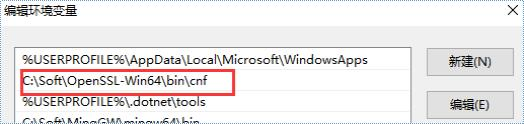

# 使用open SSL生成局域网IP地址证书


我们通常会为网站启用SSL数据传输加密，以保证传输过程中信息的安全。但是在局域网内就很少这么用。

不过在某些特殊情况下，用户内网访问多可文档管理系统时也会想要启用SSL传输加密功能。但用户只有IP，既没有域名也无法申请SSL证书，为此，多可提供了一种免费可行的方式，即**通过openSSL生成免费证书**。证书生成后，再在多可系统里启用并绑定证书，就可以在内网实现SSL传输加密功能了。

请注意，此方法生成证书后，浏览器会提示证书不安全，但不影响使用。

生成证书并启用SSL功能的具体方式如下：

**1.\**下载安装\**\**openSSL\****

openSSL官网地址为 http://www.openssl.org/

安装完成后结构如下：


**2.\**增加系统环境变量\****

打开Windows高级系统设置，增加系统变量，增加**OPENSSL_CONF**变量，具体路径问安装文件夹的 bin\openssl.cfg

如下：


增加openSSL的 bin\cnf路径到用户变量中，如下：



设置完成后最好重启机器使环境变量生效。

**3.\**建立证书申请文件\****

用记事本生成一个域名申请文件，格式如下：


```properties
[req]
default_bits=2048
default_keyfile = privkey.pem
distinguished_name = req_distinguished_name
encrypt_key = no
default_md  = sha256
req_extensions = req_ext

[req_distinguished_name]
commonName_default=192.168.1.50
commonName_max=64
organizationName_default = gongsi Co.,Ltd.
organizationalUnitName_default = DM
localityName_default = Beijing
stateOrProvinceName_default = Haidian District
countryName_default = CN
```


**4.\**打开窗口命令\****


进入openssl安装路径的bin子文件夹

**5.\**生成根证书KEY\****

openssl genrsa -out LocalRootCA.key 2048


生成文件如下：


**6.\**生成根证书\****

```bash
openssl req -sha256-new -nodes -x509-days 3650-key LocalRootCA.key -out LocalRootCA.crt -subj "/CN=LocalRootCA"
```


生成文件如下：


**7.\**生成服务端域名私钥\****

```bash
openssl genrsa -out 192_168_1_50.key 2048
```


8.**创建请求文件**

```bash
openssl req -new -sha256-key 192_168_1_50.key -out 192_168_1_50.csr -subj "/CN=192.168.1.50"
```

其中192.168.1.50为申请的IP地址或者域名，和证书申请文件中的地址要统一


生成文件如下：


**9.\**生成证书并用根证书签名\****

```bash
openssl x509-req -in 192_168_1_50.csr -CA LocalRootCA.crt -CAkey LocalRootCA.key -CAcreateserial -days 7120-out 192_168_1_50.crt -extfile 192_168_1_50.ini
```


生成文件如下：


**10.\**如果需要导出pfx\****（可以选择，非必须步骤）

```bash
openssl pkcs12-export -out 192_168_1_50.pfx -inkey 192_168_1_50.key -in 192_168_1_50.crt
```


中间提示输入密码，设置您的密码，配置web服务器证书时需要。这个密码可以为空。

生成文件如下：


**11.\**用生成的证书设置多可服务器参数\****

如下：


完成设置后保存，重启服务后就可以使用HTTPS访问此IP或者域名。

系统可能会提示证书不安全，忽略即可。