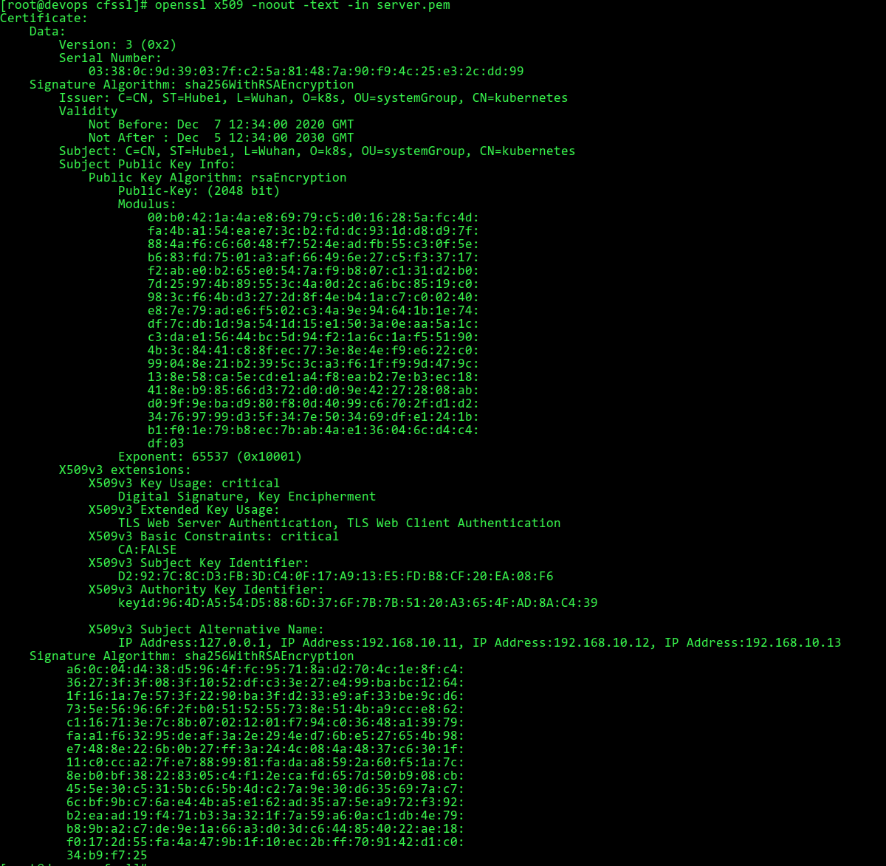

# SSL证书介绍并使用openssl和cfssl生成SSL证书

# 1 SSL/TLS基本概念

  **SSL：** Secure Socket Layer（安全套接层协议）的缩写，可以在Internet上提供秘密性传输。它是在上世纪90年代中期，由Netscape公司设计，目前已有3.0版本。为啥要发明 SSL 这个协议呢？因为原先互联网上使用的 HTTP 协议是明文的，内容是不加密的，这样就很可能在内容传播的时候被别人监听到，对于安全性要求较高的场合，必须要加密，https就是带加密的http协议。SSL协议的发明，就解决这些问题。目前SSL有1.0，2.0，3.0。

  **TLS：** Transport Layer Security（传输层安全协议）。是 SSL的标准化，相当于SSL的升级，可以把SSL看作是windows7，而TLS看作是windows10。很多时候我们把这两者并列称呼 SSL/TLS，因为这两者可以视作同一个东西的不同阶段。HTTPS 协议，说白了就是“HTTP 协议”和“SSL/TLS 协议”的组合。可以把 HTTPS 大致理解为—“HTTP over SSL”或“HTTP over TLS”。目前TLS有1.0，1.1，1.2，其中1.0基于SSL 3.0，修改不大。

  **SSL证书：** SSL安全协议主要用来提供对用户和服务器的认证；对传送的数据进行加密和隐藏；确保数据在传送中不被改变，即数据的完整性。SSL证书通过在客户端浏览器和Web服务器之间建立一条SSL安全通道，由于SSL技术已建立到所有主要的浏览器和WEB服务器程序中，因此，仅需安装服务器证书就可以激活该功能了。通过它可以激活SSL协议，实现数据信息在客户端和服务器之间的加密传输，可以防止数据信息的泄露。保证了双方传递信息的安全性，而且用户可以通过服务器证书验证他所访问的网站是否是真实可靠。

# 2 证书相关

## 2.1 证书申请文件

  **私钥：** 私钥是一个算法名称加上密码串，用来加解密用的文件或者字符串。
 
  **公钥：** 公钥也是一个算法名称加上密码串，一般不会单独给别人，而是嵌在证书里面一起给别人。
 
  **密钥：** 用来加解密用的文件或者字符串。密钥在非对称加密的领域里，指的是私钥和公钥，他们总是成对出现，其主要作用是加密和解密。常用的加密强度是2048bit。
 
  **CA：** certificate authority，认证证书的第三方机构，专门用自己的私钥给别人进行签名的单位或者机构
 
  **申请（签名）文件：** 在公钥的基础上加上一些申请人的属性信息，比如域名、名称、国家、地区以及证书适用于什么场景等信息，然后带上进行的签名，发给CA（私下安全的方式发送），带上自己签名的目的是为了防止别人篡改文件。
 
  **证书文件：** 证书由公钥加上描述信息，然后经过私钥签名之后得到。一般都是一个人的私钥给另一个人的公钥签名，如果是自己的私钥给自己的公钥签名，就叫自签名。
 
  **签名过程：** CA收到申请文件后，会走核实流程，确保申请人确实是证书中描述的申请人，防止别人冒充申请者申请证书，核实通过后，会用CA的私钥对申请文件进行签名，签名后的证书包含申请者的基本信息，CA的基本信息，证书的使用年限，申请人的公钥，签名用到的摘要算法，CA的签名。
 

## 2.2 证书文件格式

**证书的编码格式**
  PEM：是Privacy Enhanced Mail的简称，通常用于数字证书认证机构（Certificate Authorities，CA），扩展名为.pem， .crt,，.cer， .key。内容为Base64编码的ASCII码文件，有类似“-----BEGIN CERTIFICATE-----“和 “-----END CERTIFICATE-----“的头尾标记。服务器认证证书，中级认证证书和私钥都可以储存为PEM格式（认证证书其实就是公钥）。Apache和nginx等类似的服务器使用PEM格式证书。
 
  DER：是Distinguished Encoding Rules的简称，与PEM不同之处在于其使用二进制而不是Base64编码的ASCII。扩展名为.der，但也经常使用.cer用作扩展名，所有类型的认证证书和私钥都可以存储为DER格式。Java和Windows服务器使用DER格式证书。
 
证书签名请求CSR
  CSR：是Certificate Signing Request的简称，它是向CA机构申请数字证书时使用的请求文件。在生成请求文件前，我们需要准备一对对称密钥。私钥信息自己保存，请求中会附上公钥信息以及国家，城市，域名，Email等信息，CSR中还会附上签名信息。当我们准备好CSR文件后就可以提交给CA机构，等待他们给我们签名，签好名后我们会收到crt文件，即证书。
 
  CSR并不是证书，而是向权威证书颁发机构获得签名证书的申请。把CSR交给权威证书颁发机构，权威证书颁发机构对此进行签名。保留好CSR，当权威证书颁发机构颁发的证书过期的时候，还可以用同样的CSR来申请新的证书，key保持不变。
 
**证书文件扩展名**
  CRT：表示证书，常见于linux系统，可能是PEM编码和DER编码，大多数是PEM编码。
 
  CER：表示证书，常见于Windows系统，可能是PEM编码和DER编码，大多数是DER编码。
 
  KEY：存放一个公钥或者私钥，编码可能是PEM或者DER。查看KEY的办法:openssl rsa -in test.key -text -noout
 
CSR：Certificate Signing Request，证书签名请求，核心内容是一个公钥，在生成这个申请的时候，同时也会生成一个私钥。
 
  PFX/P12：predecessor of PKCS#12，常用语windows IIS。
 
  JKS：即Java Key Storage，这是Java的专利。
 
**证书转换**
  PEM转为DER：openssl x509 -in cert.crt -outform der -out cert.der
 
  DER转为PEM：openssl x509 -in cert.crt -inform der -outform pem -out cert.pem
 
  查看DER格式证书的信息：openssl x509 -in certificate.der -inform der -text -noout
 

# 3 openssl

## 3.1 介绍

  openssl 是目前最流行的 SSL 密码库工具，采用C语言开发，其提供了一个通用、健壮、功能完备的工具套件，用以支持SSL/TLS 协议的实现。openssl提供的功能相当强大和全面，囊括了主要的密码算法、常用的密钥和证书封装管理功能以及SSL协议，并提供了丰富的应用程序供测试或其它目的使用。openssl支持Linux、Windows、BSD、Mac等平台具有广泛的适用性。
 

## 3.2 加密以及证书管理

### 3.2.1 对称加密

**加密**

```
[root@devops openssl]# vim aaa
linux
[root@devops openssl]# openssl enc -aes-256-ecb -a -in aaa -out bbb -k 1234
[root@devops openssl]# ls
aaa  bbb
[root@devops openssl]# cat bbb 
U2FsdGVkX1/a6xPMGCtW1caekUrFFoe1sGgomoVRWYU=
```

-a：表示使用base64
-k：表示加密密码


**解密**

```
[root@devops openssl]# openssl enc -aes-256-ecb -d -a -in bbb -out ccc -k 1234
[root@devops openssl]# cat ccc 
linux
```

 

-d：表示解密，解密后的文件ccc与aaa内容一致

### 3.2.2 非对称加密

**生成密钥**

```
[root@devops openssl]# openssl genrsa -out rainbowhhy_private.key 2048
[root@devops openssl]# ls
rainbowhhy_private.key
```

 

**提取公钥**

```
[root@devops openssl]# openssl rsa -in rainbowhhy_private.key -pubout > rainbowhhy_public.key
writing RSA key
[root@devops openssl]# ls
rainbowhhy_private.key  rainbowhhy_public.key
```

 

**生成密钥（加密）**

```
[root@devops openssl]# openssl genrsa -aes256 -passout pass:1234 -out rainbowhhy2_private.key 2048
```

 

**提取公钥（加密）**

```
[root@devops openssl]# openssl rsa -in rainbowhhy2_private.key -passin pass:1234 -pubout -out rainbowhhy2_public.key
 
```

### 3.2.3 证书管理

#### 3.2.3.1 生成CA证书

**生成私钥**

```
[root@devops openssl]# openssl genrsa -out ca.key 2048
```

 

**生成自签证书**

```
[root@devops openssl]# openssl req -new -nodes -x509 -key ca.key -days 365 -out ca.crt -subj "/C=CN/ST=Hubei/L=Wuhan/O=k8s/OU=systemGroup/CN=kubernetesEA:admin@com"
```

 

req：证书请求子命令
-new：生成证书请求命令
-x509：直接输出证书
-key：指定私钥文件
-nodes：私钥不加密
-subj：证书拥有着信息
C：Country ，单位所在国家，为两位数的国家缩写，如： CN 就是中国
ST：State/Province ，单位所在州或省
L：Locality ，单位所在城市 / 或县区
O：Organization ，网站的单位名称
OU：Organization Unit，部门名称，也常常用于显示其他证书相关信息，如证书类型，证书产品名称或身份验证类型或验证内容等
CN：Common Name ，网站的域名;
EA：Email Address ，邮箱地址
 
同时生成私钥和自签证书

```
[root@devops openssl]# openssl req -newkey rsa:2048 -nodes -keyout ca.key -x509 -days 3650 -out ca.crt -subj "/C=CN/ST=Hubei/L=Wuhan/O=k8s/OU=systemGroup/CN=kubernetes"
[root@devops openssl]# ls
ca.crt  ca.key
```

 

#### 3.2.3.2 生成CSR和CA签名

**生成私钥**

```
[root@devops openssl]# openssl genrsa -out ca.key 2048
```

 

**生成csr**

```
[root@devops openssl]# openssl req -new -key ca.key -out ca.csr -subj "/C=CN/ST=Hubei/L=Wuhan/O=k8s/OU=systemGroup/CN=kubernetes"
[root@devops openssl]# ls
ca.csr  ca.key
[root@devops openssl]# openssl req -text -noout -in ca.csr
```

 

**生成证书**
使用 CA 证书及CA密钥 对请求签发证书进行签发，生成 x509证书

```
[root@devops openssl]# openssl x509 -req -days 3650 -in ca.csr -CA ca.crt -CAkey ca.key -CAcreateserial -out ca.pem
[root@devops openssl]# ls
ca.crt  ca.csr  ca.key  ca.pem  ca.srl
```

 

# 4 cfssl

## 4.1 介绍

cfssl是 CloudFlare 公司开源的一款PKI/TLS工具，提供了命令行工具和一个 HTTP API 服务器用于签名，验证并且捆绑TLS证书的 HTTP API 服务。 使用Go语言编写。

## 4.2 cfssl安装

**下载工具包**

```
[root@devops cfssl]# wget https://pkg.cfssl.org/R1.2/cfssl_linux-amd64
[root@devops cfssl]# wget https://pkg.cfssl.org/R1.2/cfssljson_linux-amd64
[root@devops cfssl]# wget https://pkg.cfssl.org/R1.2/cfssl-certinfo_linux-amd64
[root@devops cfssl]# chmod +x cfssl*
[root@devops cfssl]# mv cfssl_linux-amd64 /usr/local/bin/cfssl_linux
[root@devops cfssl]# mv cfssljson_linux-amd64 /usr/local/bin/cfssljson
[root@devops cfssl]# mv cfssl-certinfo_linux-amd64 /usr/local/bin/cfssl-certinfo
```

 

**命令**
生成证书需要使用子命令gencert
gencert：生成新的key和签名证书
可选参数：
-ca：指明ca的证书
-ca-key：指明私钥文件
-config：指明请求证书的json文件
-profile：与-config中的profile对应，是指根据config中的profile段来生成证书的相关信息

## 4.3 管理证书

### 4.3.1 配置CA认证

**配置证书请求文件**

```
[root@devops cfssl]# cfssl print-defaults csr > ca-csr.json
[root@devops cfssl]# vim ca-csr.json 
{
  "CN": "kubernetes",
  "key": {
      "algo": "rsa",
      "size": 2048
  },
  "names": [
    {
      "C": "CN",
      "ST": "Hubei",
      "L": "Wuhan",
      "O": "k8s",
      "OU": "systemGroup"
    }
  ],
  "ca": {
          "expiry": "87600h"
  }
}
[root@devops cfssl]# ls
ca-csr.json
```

CN： Common Name，浏览器使用该字段验证网站是否合法，一般写的是域名，浏览器使用该字段验证网站是否合法

C：Country， 国家

ST：State，州，省

L： Locality，地区，城市

O：Organization Name，组织名称，公司名称

OU：Organization Unit Name，组织单位名称，公司部门

**生成CA证书**

```
[root@devops cfssl]# cfssl gencert -initca ca-csr.json  | cfssljson -bare ca
[root@devops cfssl]# ls
ca.csr  ca-csr.json  ca-key.pem  ca.pem
生成了ca.csr, ca-key.pem, ca.pem 三个文件
```

 

### 4.3.1 配置服务证书

**配置服务证书生成策略**

```
[root@devops cfssl]# cfssl print-defaults config > ca-config.json
[root@devops cfssl]# vim ca-config.json 
{
  "signing": {
      "default": {
          "expiry": "87600h"
        },
      "profiles": {
          "kubernetes": {
              "usages": [
                  "signing",
                  "key encipherment",
                  "server auth",
                  "client auth"
              ],
              "expiry": "87600h"
          }
      }
  }
}
```

默认策略，指定了证书的有效期是一年(8760h)

profile可以设置多个，这里指定kubernetes策略，指定了证书的用途

signing, 表示该证书可用于签名其它证书；生成的 ca.pem 证书中 CA=TRUE

server auth：表示 client 可以用该 CA 对 server 提供的证书进行验证

client auth：表示 server 可以用该 CA 对 client 提供的证书进行验证


**配置请求服务器csr文件**

```
[root@devops cfssl]# vim server-csr.json
{
  "CN": "kubernetes",
  "hosts": [
    "127.0.0.1",
    "192.168.10.11",
    "192.168.10.12",
    "192.168.10.13"
  ],
  "key": {
    "algo": "rsa",
    "size": 2048
  },
  "names": [{
    "C": "CN",
    "ST": "Hubei",
    "L": "Wuhan",
    "O": "k8s",
    "OU": "systemGroup"
  }]
}
[root@devops cfssl]# ls
ca-config.json  ca.csr  ca-csr.json  ca-key.pem  ca.pem  server-csr.json
```


**生成证书**

```
[root@devops cfssl]# cfssl gencert -ca=ca.pem -ca-key=ca-key.pem -config=ca-config.json -profile=kubernetes server-csr.json | cfssljson -bare server
[root@devops cfssl]# ls
ca-config.json  ca.csr  ca-csr.json  ca-key.pem  ca.pem  server.csr  server-csr.json  server-key.pem  server.pem
```

 

**查看证书**

```
[root@devops cfssl]# cfssl certinfo -cert server.pem
[root@devops cfssl]# cfssl certinfo -csr server.csr
[root@devops cfssl]# cfssl-certinfo -cert server.pem
[root@devops cfssl]# openssl x509 -noout -text -in server.pem
```

 

 

 