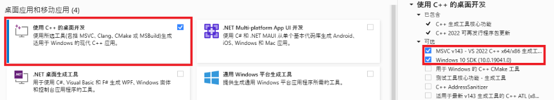
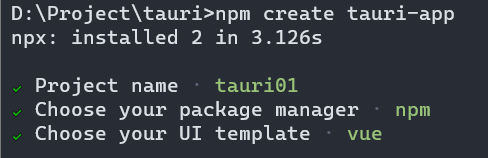
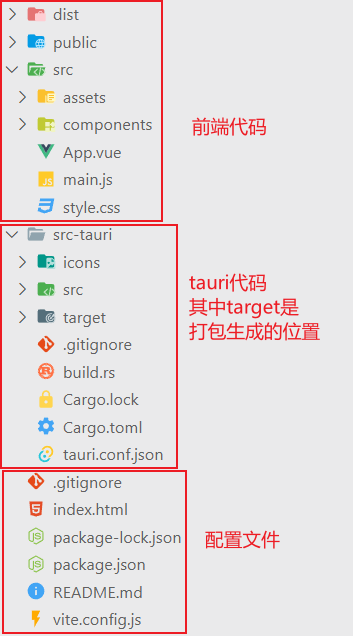

# 桌面端程序开发-Tauri入门

文章被收录于专栏：[码客](https://cloud.tencent.com/developer/column/82090)


## 前言

官方文档

[https://tauri.app/zh-cn/v1/guides/](https://cloud.tencent.com/developer/tools/blog-entry?target=https://tauri.app/zh-cn/v1/guides/&source=article&objectId=2234248)

Vite文档

[https://cn.vitejs.dev/guide/](https://cloud.tencent.com/developer/tools/blog-entry?target=https://cn.vitejs.dev/guide/&source=article&objectId=2234248)

## 环境安装

[https://tauri.app/zh-cn/v1/guides/getting-started/prerequisites/](https://cloud.tencent.com/developer/tools/blog-entry?target=https://tauri.app/zh-cn/v1/guides/getting-started/prerequisites/&source=article&objectId=2234248)

### Microsoft Visual Studio C++ 生成工具

您需要安装 Microsoft C++ 生成工具。 

最简单的方法是下载 [Visual Studio 2022 生成工具](https://cloud.tencent.com/developer/tools/blog-entry?target=https://visualstudio.microsoft.com/visual-cpp-build-tools/&source=article&objectId=2234248)。 进行安装选择时，请勾选 “C++ 生成工具” 和 Windows 10 SDK。



### WebView2

备注

>  Windows 11 已预装了 WebView2。 

Tauri 需要 WebView2 才能在 Windows 上呈现网页内容，所以您必须先安装 WebView2。 最简单的方法是从[微软网站](https://cloud.tencent.com/developer/tools/blog-entry?target=https://developer.microsoft.com/zh-cn/microsoft-edge/webview2/%23download-section&source=article&objectId=2234248)下载和运行常青版引导程序。

### Rust

Tauri 需要 WebView2 才能在 Windows 上呈现网页内容，所以您必须先安装 WebView2。 最简单的方法是从[微软网站](https://cloud.tencent.com/developer/tools/blog-entry?target=https://developer.microsoft.com/zh-cn/microsoft-edge/webview2/%23download-section&source=article&objectId=2234248)下载和运行常青版引导程序。

最后，请前往 [https://www.rust-lang.org/zh-CN/tools/install](https://cloud.tencent.com/developer/tools/blog-entry?target=https://www.rust-lang.org/tools/install&source=article&objectId=2234248) 来安装 `rustup` (Rust 安装程序)。 请注意，为了使更改生效，您必须重新启动终端，在某些情况下需要重新启动 Windows 本身。

或者，您可以在 PowerShell 中使用 `winget` 命令安装程序：

代码语言：javascript

复制

```javascript
winget install --id Rustlang.Rustup
```

查看版本

代码语言：javascript

复制

```javascript
rustc --version
```

#### 问题

**crates.io index失败**

解决方法

使用Rust crates.io 索引镜像

编辑 `~/.cargo/config` 文件，添加以下内容：

Windows下路径类似于

代码语言：javascript

复制

```javascript
C:\Users\Administrator\.cargo\config
```

config文件默认没有新建即可。

代码语言：javascript

复制

```javascript
[source.crates-io]
replace-with = 'tuna'

[source.tuna]
registry = "https://mirrors.tuna.tsinghua.edu.cn/git/crates.io-index.git"
```

该镜像可加快 cargo 读取软件包索引的速度。

### NodeJS

Vite 需要 Node.js 版本 **14.18+，16+**

[https://vitejs.cn/vite3-cn/guide/](https://cloud.tencent.com/developer/tools/blog-entry?target=https://vitejs.cn/vite3-cn/guide/&source=article&objectId=2234248)

NodeJS版本切换

[https://cloud.tencent.com/developer/article/2020819](https://cloud.tencent.com/developer/article/2020819?from_column=20421&from=20421)

代码语言：javascript

复制

```javascript
nvm list
nvm install 16.16.0
nvm use 16.16.0

node -v
npm -v
```

## 创建项目

进入我们要创建项目的目录

执行创建的命令

代码语言：javascript

复制

```javascript
npm create tauri-app
```

设置项目初始化配置



运行

代码语言：javascript

复制

```javascript
cd tauri01
npm install
npm run tauri dev
```

## 目录结构



## 打包

修改 `tauri.config.json` 中 `tauri.bundle.identifier` ，这是一个唯一标识，可以为软件的名称。

控制台执行命令：

代码语言：javascript

复制

```javascript
npm run tauri build
```

这个命令会先编译前端项目，相当于先执行 `npm run build` 编译出前端静态文件到 `dist`

然后回编译 `rust` 组件，最后生成一个 `msi` 安装文件

### 问题

打包时`wix311-binaries.zip`无法下载

[https://github.com/wixtoolset/wix3/releases/download/wix3112rtm/wix311-binaries.zip](https://cloud.tencent.com/developer/tools/blog-entry?target=https://github.com/wixtoolset/wix3/releases/download/wix3112rtm/wix311-binaries.zip&source=article&objectId=2234248)

将这个文件单独下载来，再放到下面目录：

代码语言：javascript

复制

```javascript
C:\Users\Administrator\AppData\Local\tauri\WixTools
```

没有 **tauri** 的话创建一个，再创建一个 **WixTools** 文件夹。

 将 **wix311-binaries** 解压到 **WixTools** 下即可。

注意`WixTools`下直接是文件，不要再有文件夹

比如解压后其中的一个文件路径:

代码语言：javascript

复制

```javascript
C:\Users\Administrator\AppData\Local\tauri\WixTools\candle.exe
```

## 多窗口

[https://tauri.app/zh-cn/v1/guides/features/multiwindow](https://cloud.tencent.com/developer/tools/blog-entry?target=https://tauri.app/zh-cn/v1/guides/features/multiwindow&source=article&objectId=2234248)

### 静态窗口

代码语言：javascript

复制

```javascript
{
  "tauri": {
    "windows": [
      {
        "fullscreen": false,
        "height": 600,
        "resizable": true,
        "title": "tauri01",
        "width": 800
      },
      {
        "label": "about",
        "fullscreen": false,
        "height": 600,
        "resizable": false,
        "title": "about",
        "width": 800,
        "url": "about.html"
      }
    ]
  }
}
```

注意

>  `label`是一定要设置的，它是窗口的唯一标识，不能重复。 

### JS中创建窗口

使用 Tauri API，可以通过导入 [WebviewWindow](https://cloud.tencent.com/developer/tools/blog-entry?target=https://tauri.app/zh-cn/v1/api/js/window%23webviewwindow&source=article&objectId=2234248) 类轻松地在运行时创建一个窗口。

代码语言：javascript

复制

```javascript
import { WebviewWindow } from '@tauri-apps/api/window'
const webview = new WebviewWindow('theUniqueLabel', {
  url: 'path/to/page.html',
})
// since the webview window is created asynchronously,
// Tauri emits the `tauri://created` and `tauri://error` to notify you of the creation response
webview.once('tauri://created', function () {
  // webview window successfully created
})
webview.once('tauri://error', function (e) {
  // an error occurred during webview window creation
})
```

### 在 Rust 中创建窗口

窗口可以在运行时使用 [WindowBuilder](https://cloud.tencent.com/developer/tools/blog-entry?target=https://docs.rs/tauri/1.0.0/tauri/window/struct.WindowBuilder.html&source=article&objectId=2234248) 结构体创建。

要创建一个窗口，必须有一个正在运行的 [App](https://cloud.tencent.com/developer/tools/blog-entry?target=https://docs.rs/tauri/1.0.0/tauri/struct.App.html&source=article&objectId=2234248) 的实例或一个 [AppHandle](https://cloud.tencent.com/developer/tools/blog-entry?target=https://docs.rs/tauri/1.0.0/tauri/struct.AppHandle.html&source=article&objectId=2234248)。

#### 使用App实例创建

[App](https://cloud.tencent.com/developer/tools/blog-entry?target=https://docs.rs/tauri/1.0.0/tauri/struct.App.html&source=article&objectId=2234248) 实例可以在安装钩子中获取，也可以在调用 [Builder::build](https://cloud.tencent.com/developer/tools/blog-entry?target=https://docs.rs/tauri/1.0.0/tauri/struct.Builder.html%23method.build&source=article&objectId=2234248) 之后获取。

代码语言：javascript

复制

```javascript
tauri::Builder::default()
  .setup(|app| {
    let docs_window = tauri::WindowBuilder::new(
      app,
      "external", /* the unique window label */
      tauri::WindowUrl::External("https://tauri.app/".parse().unwrap())
    ).build()?;
    let local_window = tauri::WindowBuilder::new(
      app,
      "local",
      tauri::WindowUrl::App("index.html".into())
    ).build()?;
    Ok(())
  })
```

使用设置钩子确保静态窗口和 Tauri 插件已初始化。 或

者，可以在构建 [App](https://cloud.tencent.com/developer/tools/blog-entry?target=https://docs.rs/tauri/1.0.0/tauri/struct.App.html&source=article&objectId=2234248) 后创建一个窗口：

代码语言：javascript

复制

```javascript
let app = tauri::Builder::default()
  .build(tauri::generate_context!())
  .expect("error while building tauri application");

let docs_window = tauri::WindowBuilder::new(
  &app,
  "external", /* the unique window label */
  tauri::WindowUrl::External("https://tauri.app/".parse().unwrap())
).build().expect("failed to build window");

let local_window = tauri::WindowBuilder::new(
  &app,
  "local",
  tauri::WindowUrl::App("index.html".into())
).build()?;
```

当无法将值的所有权移动到设置闭包时，此方法非常有用。

#### 使用AppHandle实例创建

[AppHandle](https://cloud.tencent.com/developer/tools/blog-entry?target=https://docs.rs/tauri/1.0.0/tauri/struct.AppHandle.html&source=article&objectId=2234248) 实例可以使用 `App::handle` 函数获得，也可以直接注入 Tauri 命令。

代码语言：javascript

复制

```javascript
tauri::Builder::default()
  .setup(|app| {
    let handle = app.handle();
    std::thread::spawn(move || {
      let local_window = tauri::WindowBuilder::new(
        &handle,
        "local",
        tauri::WindowUrl::App("index.html".into())
      ).build()?;
    });
    Ok(())
  })
```

方法中创建

代码语言：javascript

复制

```javascript
#[tauri::command]
async fn open_docs(handle: tauri::AppHandle) {
  let docs_window = tauri::WindowBuilder::new(
    &handle,
    "external", /* the unique window label */
    tauri::WindowUrl::External("https://tauri.app/".parse().unwrap())
  ).build().unwrap();
}
```

注意

>  当在 Tauri 命令中创建窗口时，确保命令函数是 `async`，以避免导致的 windows 死锁。 

### 添加HTML页面

如果使用的Vite，可以参考下面的网址进行配置。

[https://cn.vitejs.dev/guide/build.html#multi-page-app](https://cloud.tencent.com/developer/tools/blog-entry?target=https://cn.vitejs.dev/guide/build.html%23multi-page-app&source=article&objectId=2234248)

### 运行时访问窗口

可以使用它的标签和 Rust 上的 [get_window](https://cloud.tencent.com/developer/tools/blog-entry?target=https://docs.rs/tauri/1.0.0/tauri/trait.Manager.html%23method.get_window&source=article&objectId=2234248) 方法或。

代码语言：javascript

复制

```javascript
use tauri::Manager;
tauri::Builder::default()
  .setup(|app| {
    let main_window = app.get_window("main").unwrap();
    Ok(())
  })
```

注意，必须导入 [tauri::Manager](https://cloud.tencent.com/developer/tools/blog-entry?target=https://docs.rs/tauri/1.0.0/tauri/trait.Manager.html&source=article&objectId=2234248) 才能在 [App](https://cloud.tencent.com/developer/tools/blog-entry?target=https://docs.rs/tauri/1.0.0/tauri/struct.App.html&source=article&objectId=2234248) 或 [AppHandle](https://cloud.tencent.com/developer/tools/blog-entry?target=https://docs.rs/tauri/1.0.0/tauri/struct.AppHandle.html&source=article&objectId=2234248) 实例上使用 [get_window](https://cloud.tencent.com/developer/tools/blog-entry?target=https://docs.rs/tauri/1.0.0/tauri/trait.Manager.html%23method.get_window&source=article&objectId=2234248) 方法。

JavaScript 上的 [WebviewWindow.getByLabel](https://cloud.tencent.com/developer/tools/blog-entry?target=https://tauri.app/zh-cn/v1/api/js/window%23getbylabel&source=article&objectId=2234248) 查询窗口实例。

代码语言：javascript

复制

```javascript
import { WebviewWindow } from '@tauri-apps/api/window'
const mainWindow = WebviewWindow.getByLabel('main')
```

## 页面调用Rust方法

在 `src-tauri/src/main.rs` 中加入前端要调用的方法：

代码语言：javascript

复制

```javascript
#[tauri::command]
fn my_custom_command() {
  println!("I was invoked from JS!");
}

// Also in main.rs
fn main() {
  tauri::Builder::default()
    // This is where you pass in your commands
    .invoke_handler(tauri::generate_handler![my_custom_command])
    .run(tauri::generate_context!())
    .expect("failed to run app");
}
```

前端调用，可以写在前端的某个事件调用方法里：

代码语言：javascript

复制

```javascript
// When using the Tauri API npm package:
import { invoke } from '@tauri-apps/api/tauri'

// Invoke the command
invoke('my_custom_command')
```

传参数和返回参数：

代码语言：javascript

复制

```javascript
#[tauri::command]
fn my_custom_command(invoke_message: String) -> String {
  println!("I was invoked from JS, with this message: {}", invoke_message);
  invoke_message
}
```

**注意：**

>  rust定义参数的时候使用下划线，js调用的时候使用驼峰命名。 

示例

代码语言：javascript

复制

```javascript
invoke('my_custom_command', { invokeMessage: 'Hello!' }).then((message) => console.log(message))
```

`invoke`返回的是`Promise` ，可以使用 `async/await`用同步的方式写。

## 事件系统

前端触发并监听方法：

代码语言：javascript

复制

```javascript
import { invoke } from "@tauri-apps/api/tauri";
import { listen } from '@tauri-apps/api/event'

const unlisten = async () => {
  await invoke('init_process'); // 调用rust任务
  await listen('my-event', event => { // 监听事件
    console.log(event)
  })
}
</script>
<template>
  <button @click="unlisten">开启事件监听</button>
</template>
```

rust 发送事件方法：

代码语言：javascript

复制

```javascript
use tauri::Window;
use std::{thread, time};

#[derive(Clone, serde::Serialize)]
struct Payload {
  message: String,
}

#[tauri::command]
fn init_process(window: Window) {
  std::thread::spawn(move || {
    loop { // 循环触发
      window.emit("my-event", Payload { message: "Tauri is awesome!".into() }).unwrap(); // 前端自动解析为对象
      thread::sleep(time::Duration::from_millis(1000)); // 每隔一秒执行
    }
  });
}

fn main() {
    tauri::Builder::default()
        .invoke_handler(tauri::generate_handler![init_process])
        .run(tauri::generate_context!())
        .expect("error while running tauri application");
}
```

## HTTP请求

使用 tauri 访问HTTP请求需要在`tauri.conf.json`设置白名单：

代码语言：javascript

复制

```javascript
{
  "tauri": {
    "allowlist": {
      "http": {
        "all": true, // enable all http APIs
        "request": true // enable HTTP request API
      }
    }
  }
}
```

但是这样写不安全，建议仅将您使用的 API 列入白名单，以获得最佳的安装包大小和安全性。

代码语言：javascript

复制

```javascript
{
  "tauri": {
    "allowlist": {
      "http": {
        "scope": ["https://api.github.com/repos/tauri-apps/*"]
      }
    }
  }
}
```

前端使用：

代码语言：javascript

复制

```javascript
import { fetch } from '@tauri-apps/api/http';
const response = await fetch('http://localhost:3003/users/2', {
  method: 'GET',
  timeout: 30,
  responseType: 2  // 1-JSON 2-Text 3-Binary
});
```

## 文件系统

代码语言：javascript

复制

```javascript
{
  "tauri": {
    "allowlist": {
      "fs": {
        "scope": ["$APPDATA/databases/*"]
      }
    }
  }
}
```

此作用域配置仅允许访问 APPDATA目录的数据库文件夹中的文件，注意[数据库](https://cloud.tencent.com/solution/database?from_column=20065&from=20065)文件夹中的文件，注意  APPDATA 变量的使用。

该值在运行时注入，解析为应用程序数据目录。可用的变量是：

- $APPCONFIG => C:\Users\psvmc\AppData\Roaming\cn.psvmc.tauri01\
- $APPDATA => C:\Users\psvmc\AppData\Roaming\cn.psvmc.tauri01\
- $APPLOCALDATA => C:\Users\psvmc\AppData\Local\cn.psvmc.tauri01\
- $APPCACHE => C:\Users\psvmc\AppData\Local\cn.psvmc.tauri01\
- $APPLOG => C:\Users\psvmc\AppData\Roaming\cn.psvmc.tauri01\logs\
- $AUDIO => C:\Users\psvmc\Music\
- $CACHE => C:\Users\psvmc\AppData\Local\
- $CONFIG => C:\Users\psvmc\AppData\Roaming\
- $DATA => C:\Users\psvmc\AppData\Roaming\
- $LOCALDATA => C:\Users\psvmc\AppData\Local\
- $DESKTOP => C:\Users\psvmc\Desktop\
- $DOCUMENT => C:\Users\psvmc\Documents\
- $DOWNLOAD => C:\Users\psvmc\Downloads\
- $EXE,
- $FONT,
- $HOME => C:\Users\psvmc\
- $PICTURE => C:\Users\psvmc\Pictures\
- $PUBLIC => C:\Users\Public\
- $RUNTIME,
- $TEMPLATE => C:\Users\psvmc\AppData\Roaming\Microsoft\Windows\Templates\
- $VIDEO => C:\Users\psvmc\Videos\
- $RESOURCE => D:\Project\tauri\tauri01\src-tauri\target\debug\
- $TEMP

代码语言：javascript

复制

```javascript
import { copyFile,createDir, BaseDirectory } from '@tauri-apps/api/fs';

// Copy the `$APPCONFIG/app.conf` file to `$APPCONFIG/app.conf.bk`
await copyFile('app.conf', 'app.conf.bk', { dir: BaseDirectory.AppConfig });
// Create the `$APPDATA/users` directory
await createDir('users', { dir: BaseDirectory.AppData, recursive: true });
```

## 对话框

添加 `tauri.allowlist.dialog` 到 `tauri.conf.json`

代码语言：javascript

复制

```javascript
{
  "tauri": {
    "allowlist": {
      "dialog": {
        "all": true, // enable all dialog APIs
        "open": true, // enable file open API
        "save": true // enable file save API
      }
    }
  }
}

import { ask } from '@tauri-apps/api/dialog';
const yes = await ask('Are you sure?', 'Tauri');
const yes2 = await ask('This action cannot be reverted. Are you sure?', { title: 'Tauri', type: 'warning' });
```

## 窗口配置

可用配置项

[https://tauri.app/v1/api/config#windowconfig](https://cloud.tencent.com/developer/tools/blog-entry?target=https://tauri.app/v1/api/config%23windowconfig&source=article&objectId=2234248)

### 基本配置

`tauri.config.json` 中关于窗口的**主要**配置：

代码语言：javascript

复制

```javascript
{
  "tauri": {
    "windows": [
      {
      	"center": true, // 窗口显示在屏幕中间
      	"x": 100, // 窗口显示x坐标
      	"y": 100, // 窗口显示y坐标
        "fullscreen": false, // 是否全屏
        "height": 600, // 窗口高度
        "width": 800, // 窗口宽度
        "resizable": true, // 是否可以resize
        "title": "Tauri App", // 窗口标题
        "decorations": true // 是否显示边框和状态栏
      }
    ]
  }
}
```

### 窗口透明

Tauri 应用的背景分三层：

- 第一层是 `window`
- 第二层是 `webview`
- 第三层是 `html`

#### tauri.conf.json 配置

在官方文档 [`tauri.conf.json` 窗口配置](https://cloud.tencent.com/developer/tools/blog-entry?target=https://tauri.app/v1/api/config%23windowconfig&source=article&objectId=2234248)中有 `transparent` 字段，设置为 `true` 启用透明度。（默认为 `false`，不启用）

注意：在 macOS 上，需要从 `tauri.conf.json > tauri > macOSPrivateApi` 启用 `macos-private-api` ，默认为 `false`，不启用。

（警告：[在 macOS 上使用私有 API 的应用程序会被 App Store 拒绝](https://cloud.tencent.com/developer/tools/blog-entry?target=https://developer.apple.com/forums/thread/64443&source=article&objectId=2234248)）

`macOSPrivateApi` 设置为 `true` 时：

- 启用透明背景 API
- 将 `fullScreenEnabled` 首选项设置为 `true`

代码语言：javascript

复制

```javascript
{
  "tauri": {
    "macOSPrivateApi": true,
    "windows": [
      {
        "width": 800,
        "height": 600,
        "resizable": true,
        "fullscreen": false,
        "title": "Oh My Box",
        "transparent": true
      }
    ]
  }
}
```

#### html 配置

窗口配置中的 `transparent` 是开启第一层（window）和第二层（webview）的透明度。

如果透明度未生效，请检查 html 是否设置了不透明背景色，将其修改为 `RGBA` 或 `transparent`。也可以通过 css 文件设置 body 样式。

代码语言：javascript

复制

```javascript
<!DOCTYPE html>
<html>
  <body style="background-color: rgba(87,87,87,0.5);">
    <div id="root"></div>
  </body>
</html>
```

### 鼠标穿透

#### 依赖

在 `cargo.toml` 中添加

代码语言：javascript

复制

```javascript
windows = { version = "0.43.0", features = [
    "Win32_Foundation",
    "Win32_UI_WindowsAndMessaging",
] }
```

#### 代码

初始化窗口时通过 `setup` 传闭包拿到 `window` 进行操作。只支持 Windows。

代码语言：javascript

复制

```javascript
tauri::Builder::default()
    .setup(|app| {
        let window = app.get_window("main").unwrap();
        #[cfg(windows)]
        {
            use windows::Win32::Foundation::HWND;
            let hwnd = window.hwnd().unwrap().0;
            let hwnd = HWND(hwnd);
            unsafe {
                let mut style_ex = WINDOW_EX_STYLE(GetWindowLongW(hwnd, GWL_EXSTYLE) as u32);
                style_ex |= WS_EX_APPWINDOW // for taskbar
                | WS_EX_COMPOSITED
                | WS_EX_LAYERED
                | WS_EX_TRANSPARENT
                | WS_EX_TOPMOST;
                use windows::Win32::UI::WindowsAndMessaging::*;
                let nindex = GWL_EXSTYLE;
                let _pre_val = SetWindowLongA(hwnd, nindex, style_ex.0 as i32);
            }
        }
        Ok(())
    })
    .invoke_handler(tauri::generate_handler![...])
    .run(tauri::generate_context!())
    .expect("error while running tauri application");
```

官方的实现目前[还没有进入](https://cloud.tencent.com/developer/tools/blog-entry?target=https://github.com/tauri-apps/tauri/issues/2090&source=article&objectId=2234248) tauri，只能先凑合用用。