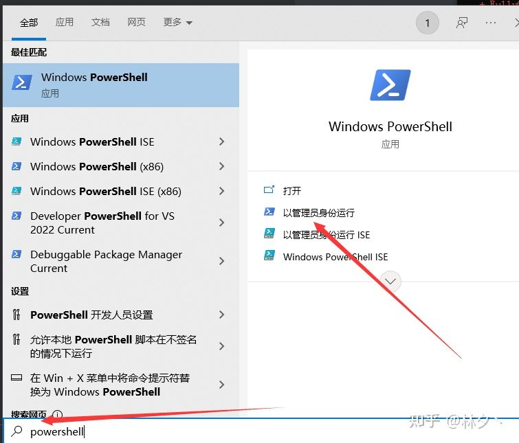
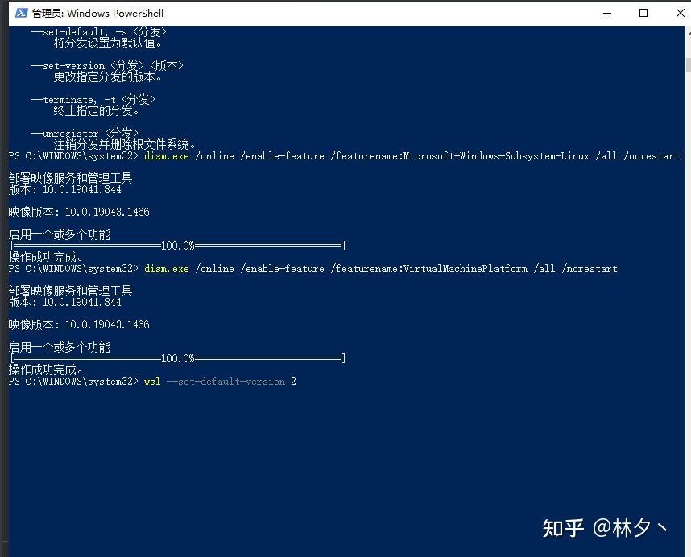
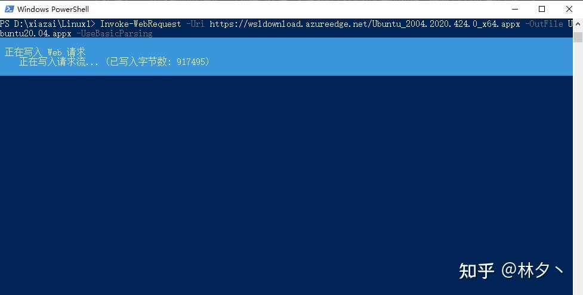
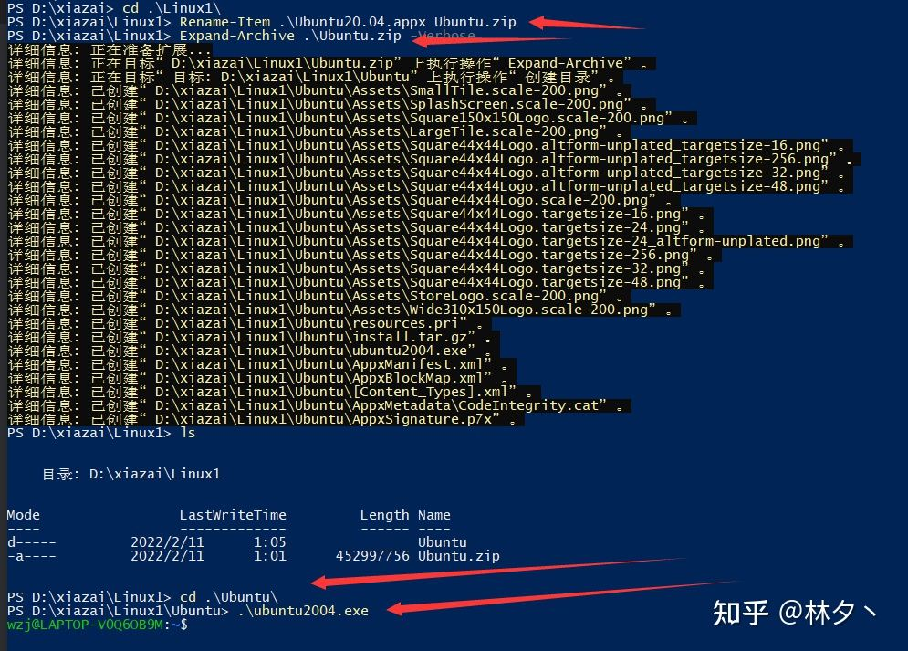
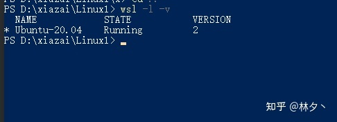
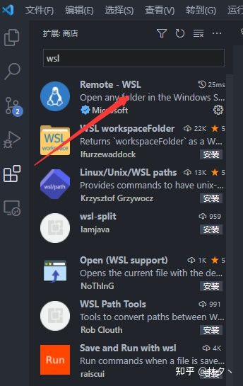
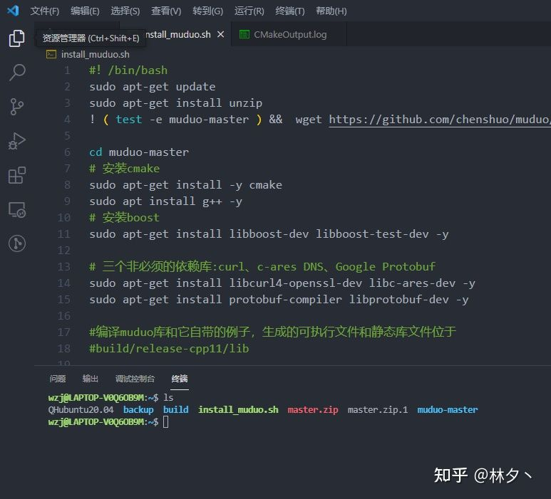
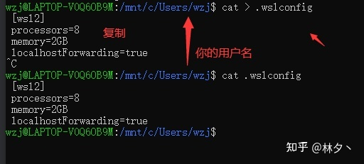

# Windows10/11 三步安装wsl2 Ubuntu20.04（任意盘）


如果你是Windows用户的话，觉得使用Linux很不方便，那么这篇文章可以给你提供一个还算舒适的Windows10下Linux开发的环境，并且不需要多高的配置，也可以很顺畅的使用。（我的笔记本只有8G内存都是完全OK的）。

wsl2 是什么？ 简单点说，就是可以在Windows上用Linux，并且支持docker

**一般内存有16及以上是最好了，我的8G的笔记本只能说是运行地凑合，但是效率我觉得用起来还是比VMware要高，所以对于想用Linux的Windows用户来说wsl2是一个不错的选择！**

**本文从0开始在Windows10上安装wsl2，并提供更换清华源的脚本。且连上了vscode，操作都比较简单，基本上复制命令执行+重启+复制命令执行执行即可**

### powershell

在搜索栏搜 powershell，管理员身份打开。

 



 

### wsl安装

输入下面四条命令

```bash
wsl --install
dism.exe /online /enable-feature /featurename:Microsoft-Windows-Subsystem-Linux /all /norestart
dism.exe /online /enable-feature /featurename:VirtualMachinePlatform /all /norestart
wsl --set-default-version 2
```

**然后重启重启电脑！！！！wsl的安装就完成了。**

**在 win10（11） 2022.3 之后，重启会打开新的 Ubuntu 的页面，直接输入新 user 和 passwd 即可。也就是说自动安装了 Ubuntu 20.04 在 c 盘了，可以直接用了。如果需要 安装别的分发，或者是想将 Ubuntu 20.04 安装在 D 盘的可以继续往下看。（但是得卸载掉 Ubuntu 20.04）**



win10（11） 2022.3 之后，直接跳过这一步。

下载 Linux 内核更新包 （这一步是将wsl1 更新到 wsl2 [比较 WSL 2 和 WSL 1](https://link.zhihu.com/?target=https%3A//docs.microsoft.com/zh-cn/windows/wsl/compare-versions)）

1. 下载最新包：
2. [适用于 x64 计算机的 WSL2 Linux 内核更新包](https://link.zhihu.com/?target=https%3A//wslstorestorage.blob.core.windows.net/wslblob/wsl_update_x64.msi)
3. 运行上一步中下载的更新包。 （双击以运行 - 系统将提示你提供提升的权限，选择“是”以批准此安装。）

```powershell
（ 新手可不用管这个。ps：这里如果在powershell用wget（bash可以成功）下载，状态码什么都是200OK的，且数据大小也对，但是就是没文件，我不知道是什么原因，如果您能解决的话，请告诉我一下） 
wget https://wslstorestorage.blob.core.windows.net/wslblob/wsl_update_x64.msi
```

### Ubuntu20.04（C盘）

安装在 C 盘安装比较简单，直接在 Windows 应用商店 下载 Ubuntu 20.04 安装即可。

### ubuntu20.04（D盘）

下面是将 Ubuntu20.04 安装在D盘的部分：

首先先在你喜欢的盘创建一个文件夹，比如D:\Linux 我比较喜欢D盘，因为这样即便是重装系统我也不用重新装软件。

然后进到这个文件夹 下载ubuntu20.04

```dart
Invoke-WebRequest -Uri https://wsldownload.azureedge.net/Ubuntu_2004.2020.424.0_x64.appx -OutFile Ubuntu20.04.appx -UseBasicParsing
```

我演示用的是d:\xiazai\linux1,等他下载完即可，**文件有4G多，等一会是正常的**

 



 

然后执行下面四条命令。如下图

```powershell
Rename-Item .\Ubuntu20.04.appx Ubuntu.zip
Expand-Archive .\Ubuntu.zip -Verbose
cd .\Ubuntu\
.\ubuntu2004.exe
```

 



 

这个图我是直接进了wsl，因为我已经安装过了。**你们第一次安装的话会弹出一个黑框框等几分钟这样，然后输你想要的入用户名和密码就行**

当然这个时候可能会报错，什么样的错误都可能，我以前遇到过很多次！

我发现最好的方法就是，按照这个文章上**开头的那几步重新执行一遍**（确保没有遗漏），**然后重启，一定要重启！重启！！之后再尝试，一般就解决了。**

最后可以在powershell里面 , 看看自己安装的版本

```undefined
wsl -l -v
```

 



 

### 换源

因为我们国内访问外网比较慢，所以我一般是会换成清华源，另外请注意，**wsl的Ubuntu证书是过期的，如果你想手动还源的话请记得先更新证书**

**不过我已经写好脚本了**

直接在Linux里执行,即可换成清华源

```bash
wget https://gitee.com/lin-xi-269/tools/raw/master/os/QHubuntu20.04 && bash QHubuntu20.04
```

### vscode + wsl

下载这个插件即可



 

**效果大概就像这样，很是方便**

 



 

[官方参考文章](https://link.zhihu.com/?target=https%3A//code.visualstudio.com/docs/remote/wsl)

### 内存控制

内存大的朋友请直接跳过~

比较简单的方法就是,如下图，我的笔记本是8G的，所以只设置2G内存了，与我而言也够用了。

 



 

```ini
[wsl2]
 processors=8
 memory=2GB
 localhostForwarding=true
```

还有2种方法，可以参考下面这篇文章

[限制wsl2占用过多内存](https://zhuanlan.zhihu.com/p/345645621)

### 参考文章：

[安装WSL](https://link.zhihu.com/?target=https%3A//docs.microsoft.com/zh-cn/windows/wsl/install)

[旧版 WSL 的手动安装步骤](https://link.zhihu.com/?target=https%3A//docs.microsoft.com/zh-cn/windows/wsl/install-manual)

[WSL2安装ubuntu 20.04和更改默认安装位置](https://link.zhihu.com/?target=https%3A//blogs.oopswow.com/2021/01/06/WSL2-install-ubuntu20-and-change-the-default-installation-driver/)

分类: [工具/插件 开发与使用](https://www.cnblogs.com/lidabo/category/431643.html)