# 虚拟机中的网络模式

[toc]

以virtualbox为例，总结如下：

| 网络模式                     | 虚拟机<=>虚拟机 | 虚拟机=>宿主    | 宿主=>虚拟机 | 虚拟机=>互联网 | 互联网=>虚拟机 |
| ---------------------------- | --------------- | --------------- | ------------ | -------------- | -------------- |
| 网络地址转换（NAT）          | ×               | √               | ×            | √              | ×              |
| NAT网络                      | √               | √               | ×            | √              | ×              |
| 桥接模式（Bridged Adapter）  | √               | √               | √            | √              | √              |
| 内部网络（Internal Network） | √               | ×               | ×            | ×              | ×              |
| 仅主机（Host-Only）          | √               | √（官方说可以） | √            | ×              | ×              |


### 1 NAT

大部分家庭网络会用到NAT， 假如为一台计算机申请到了一个公网ip（假设时110.76.40.240）。 由于有公网ip，这台计算机可以访问公网的服务器、计算机，公网中的其他计算机也可以通过公网ip访问这个计算机。如果本地网络中有多台设备、计算机也要上网，并且需要与公网服务能相互访问，那么就需要使用NAT功能。让路由器使用这个公网ip，内网的设备使用不同的ip地址（192.168.1.10，192.168.1.11，192.168.1.12 等）。当私有网络中的设备访问公网时，NAT网络就把私有地址（比如 192.168.1.10）转化为公网ip（110.76.40.240），并且使用不同的端口进行标识，并且保存这个端口映射关系。

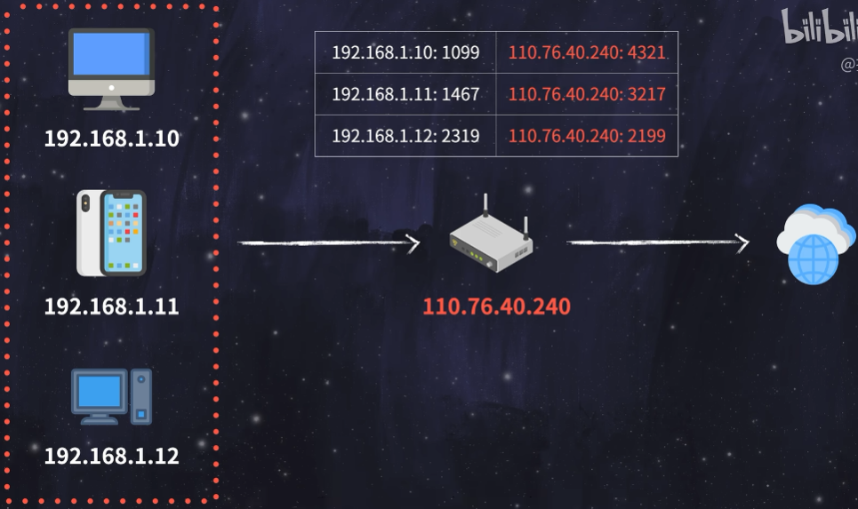

当数据返回时再把访问公网ip的数据根据端口和上面保存端口映射关系将数据转发给指定的内网设备的私有地址及端口。私有地址是特定范围的，比如 192.168.xx.xx ，私有地址是不能被公共网络直接访问的。Virtualbox的默认访问模式就是NAT，Virtualbox创建虚拟机的时候会自动创建一个NAT网络，在网络中自动创建一个DHCP服务器。DHCP和网关在这个虚拟网络中的默认IP是 10.0.2.2 。

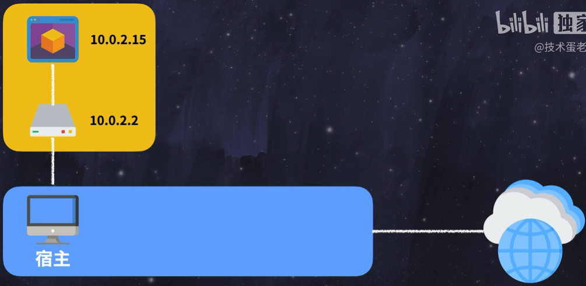

因为是NAT网络，会给虚拟机分配一个内网IP，这里默认是10.0.2.15 。每创建一个虚拟机，都会再创建一个虚拟网络，DHCP，和分配同样的IP地址

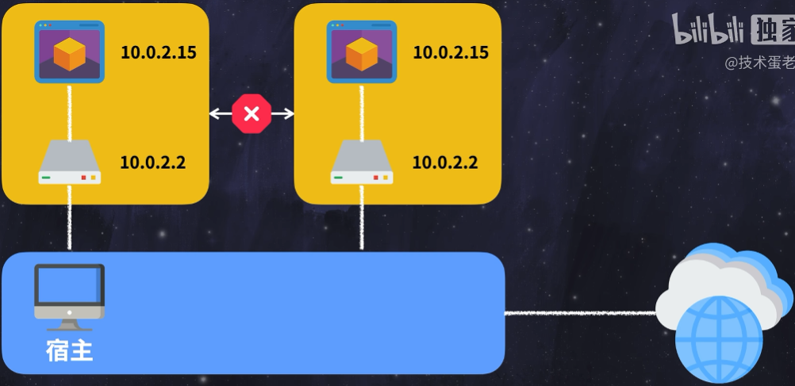

各个虚拟机都是在独立的网络里。这些虚拟机之间不能直接相互访问（不涉及端口转发这些操作）。这些虚拟机是可以正常上网的，虚拟机发送网络数据包时经过虚拟网络的网关时，软件（如virtualbox）会对数据包进行改写，使得数据包就像是在宿主环境中生成的一样。再由宿主机环境经过自身所在的NAT网络转换发送给互联网。简单理解为这里存在2层NAT。

实测：创建两台虚拟机，使用NAT

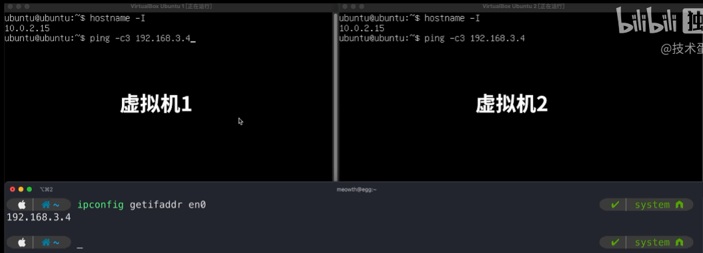

可以看到两台虚拟机的IP都是 10.0.2.15 ，两台虚拟机之间无法互ping，下面测试ping宿主，这里ping的是宿主NAT中的私有IP。

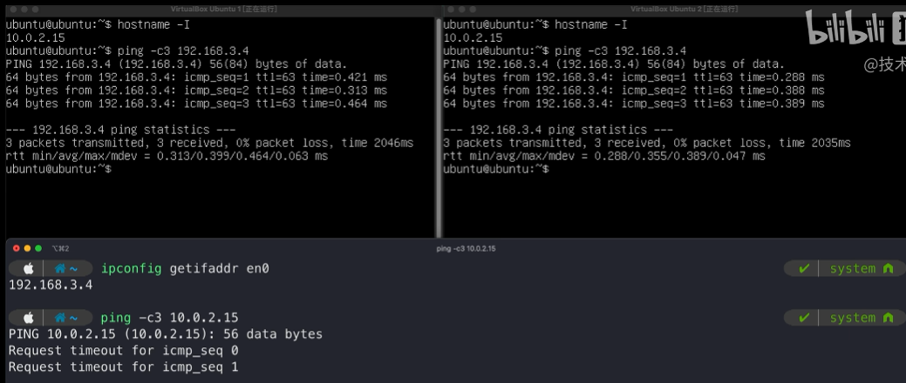

可以看到虚拟机是可以ping通宿主的，但是宿主不能ping通虚拟机。可以理解为对于虚拟机来说，宿主在虚拟机所在的私有网络的外面，相当于在公网。公网是不能访问内部私有网络的ip的。NAT正常是只出进的。再测试联网能力，ping baidu.com

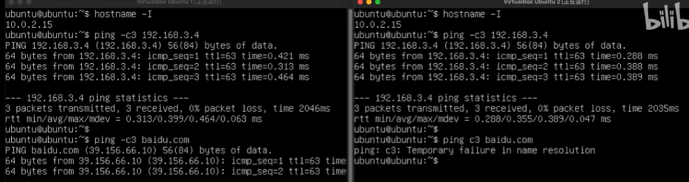

联网能力是没有问题的。总结：

| 网络模式            | 虚拟机<=>虚拟机 | 虚拟机=>宿主 | 宿主=>虚拟机 | 虚拟机=>互联网 | 互联网=>虚拟机 |
| ------------------- | --------------- | ------------ | ------------ | -------------- | -------------- |
| 网络地址转换（NAT） | ×               | √            | ×            | √              | ×              |

NAT模式下，虚拟机可以访问宿主机和互联网那个，但是宿主机和局域网里的设备正常情况下不能访问虚拟机，互联网上的设备就更不能访问了。


### 2 NAT网络

NAT网络就是在NAT模式下，让虚拟机之间可以互通，软件（如virtualbox）在虚拟机前面加了一台虚拟的交换机，虚拟DHCP服务器为网络分配IP地址。网关和DHCP的地址与之前的NAT不一样，网关默认为 10.0.2.1，DHCP为10.0.2.3 ，由于此时虚拟机处于同一个私有网络，虚拟机之间可以互通了。

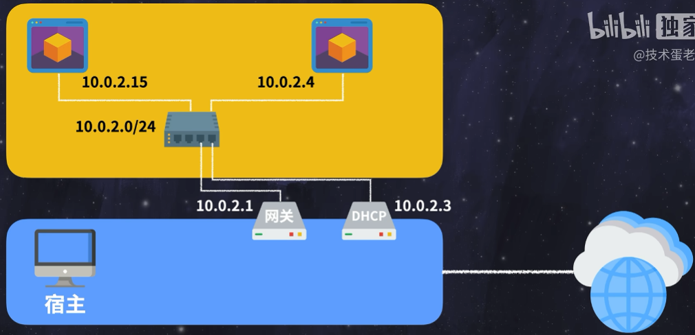

这个模式在软件（如virtualbox）中，要先创建NAT网络，配置好名字，网络掩码和DHCP。设置完成后再在虚拟机中的网络模式中选择刚创建的NAT网络的名字即可。注意虚拟机的MAC地址要不能重复（重复的话，后面DHCP握手会出问题），为每一个虚拟机刷新MAC地址即可。

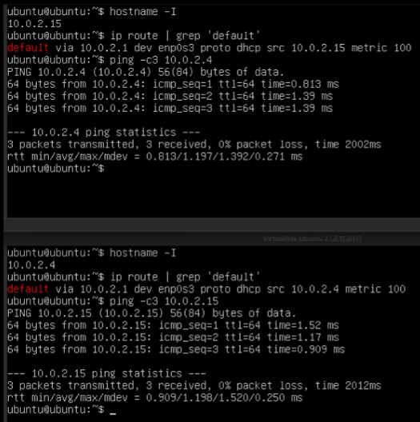

查看网关地址，可以看到两台虚拟机的网关地址是一样的，都是 10.0.2.1 ，互相ping也是没有问题的。

下面是NAT网络和NAT的区别：

| 网络模式            | 虚拟机<=>虚拟机 | 虚拟机=>宿主 | 宿主=>虚拟机 | 虚拟机=>互联网 | 互联网=>虚拟机 |
| ------------------- | --------------- | ------------ | ------------ | -------------- | -------------- |
| 网络地址转换（NAT） | ×               | √            | ×            | √              | ×              |
| NAT网络             | √               | √            | ×            | √              | ×              |

可以看到NAT网络与NAT的主要区别就是虚拟机是否可以互通。


### 3 桥接

桥接模式简单理解就是把虚拟机放在宿主机所在的局域网内，这些虚拟机与宿主时平级的。宿主从哪个dhcp服务器获取ip，虚拟机也会找同一个dhcp获取IP地址，所以会消耗宿主所在局域网的ip。


配置方式很简单，在软件（如virtualbox）中连接方式选择桥接网络，网卡选择当前宿主机联网所使用的网卡即可。注意MAC地址要唯一，可以在设置中刷新mac地址。

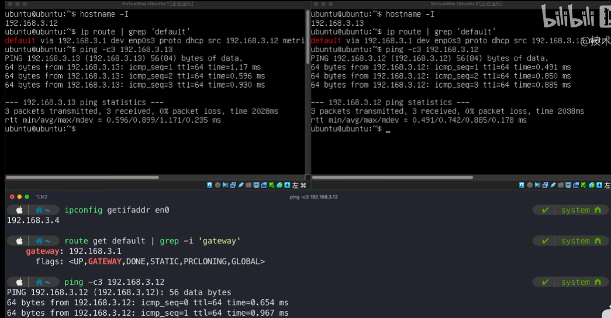

可以看到虚拟和宿主的网关都是一样的，虚拟机之间可以互ping，虚拟机与宿主之间也可以互ping，因为虚拟机与宿主都在同一个网络内了。

总结如下：

| 网络模式            | 虚拟机<=>虚拟机 | 虚拟机=>宿主 | 宿主=>虚拟机 | 虚拟机=>互联网 | 互联网=>虚拟机 |
| ------------------- | --------------- | ------------ | ------------ | -------------- | -------------- |
| 网络地址转换（NAT） | ×               | √            | ×            | √              | ×              |
| NAT网络             | √               | √            | ×            | √              | ×              |
| 桥接模式            | √               | √            | √            | √              | √              |


### 4 内部网络

内部网络中虚拟机不能访问宿主，也不能访问网络，相当于是在一个单独的网络环境内，虚拟机与宿主机之前分割开了。虚拟机之间可以互相ping通，因为虚拟机都是在同一个虚拟网络内。

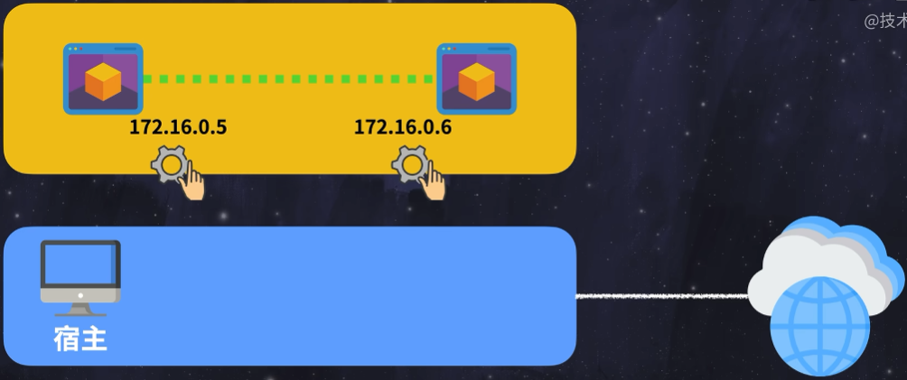

在这个模式下，virtualbox 默认不提供dhcp服务器，需要手动设置静态ip地址。为了不让虚拟机启动时一直卡在dhcp服务获取ip的流程，可以提前设置虚拟机的ip设置。

```bash
vi /etc/netplan/00-installer-config.yaml
```

```bash
network:
  ethernets:
    enp0s3:
      dhcp4: true
      addresses: [172.16.0.5/24]
      optional: true
  version: 2
```

设置 `network.ethernets.enp0s3.optional` 为 `true` 即可。然后再回到软件（virtualbox）中选择网络模式为内部网络。有一个默认名字的内部网络，所有的虚拟都选择这个网络即可，但是不同的虚拟机要设置不同的ip地址。网络测试：

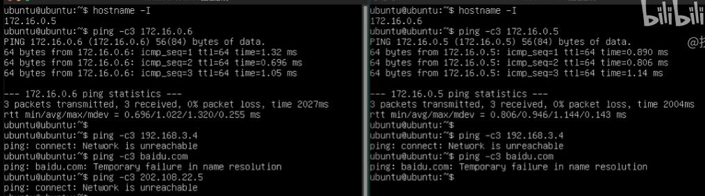

可以互相ping通，但是不能访问宿主，更不能访问互联网。

总结如下：

| 网络模式            | 虚拟机<=>虚拟机 | 虚拟机=>宿主 | 宿主=>虚拟机 | 虚拟机=>互联网 | 互联网=>虚拟机 |
| ------------------- | --------------- | ------------ | ------------ | -------------- | -------------- |
| 网络地址转换（NAT） | ×               | √            | ×            | √              | ×              |
| NAT网络             | √               | √            | ×            | √              | ×              |
| 桥接模式            | √               | √            | √            | √              | √              |
| 内部网络            | √               | ×            | ×            | ×              | ×              |

内部网络仅能让多台虚拟机互通，是一个隔离的环境。


### 5 仅主机

与内网络很类似，也是一个隔离的网络，虚拟机之间可以互通，但是依然不能访问网络，虽然后dhcp服务器分配地址，但是不能直接访问宿主所在局域网的私有地址，没有设置网关，但是可以访问虚拟网卡的地址。

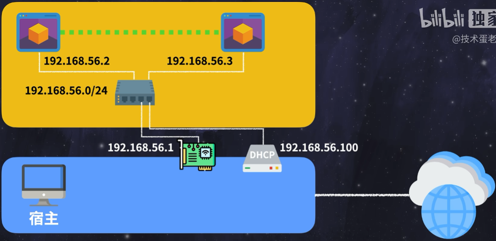

宿主可以访问虚拟机，但是宿主以外的设备都不能被访问虚拟机，也不能被虚拟机访问。

使用这个模式前要想NAT网络那样先创建一个仅主机网络，设置名字，掩码和地址范围。然后就可以为虚拟机设置网络模式了，连接方式选择仅主机，名称选择方才创建网络的名字即可。

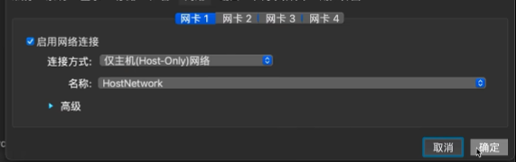

网络测试：

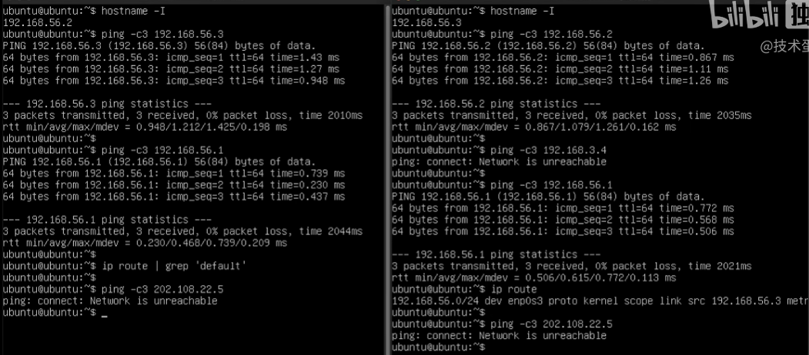

可以看到

1 虚拟机分配了ip地址

2 虚拟机之间可以相互访问

3 虚拟机不能ping通宿主机的ip地址

4 虚拟机可以ping通虚拟网卡的地址

5 虚拟机无法访问外部网络


宿主ping虚拟机测试：

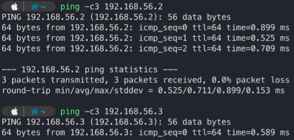

可以看到宿主是可以访问虚拟机的，

仅主机模式是隔离的网络，但是没有完全隔离，里面无法访问外面，外面可以访问里面。

总结如下：

| 网络模式                     | 虚拟机<=>虚拟机 | 虚拟机=>宿主    | 宿主=>虚拟机 | 虚拟机=>互联网 | 互联网=>虚拟机 |
| ---------------------------- | --------------- | --------------- | ------------ | -------------- | -------------- |
| 网络地址转换（NAT）          | ×               | √               | ×            | √              | ×              |
| NAT网络                      | √               | √               | ×            | √              | ×              |
| 桥接模式（Bridged Adapter）  | √               | √               | √            | √              | √              |
| 内部网络（Internal Network） | √               | ×               | ×            | ×              | ×              |
| 仅主机（Host-Only）          | √               | √（官方说可以） | √            | ×              | ×              |


