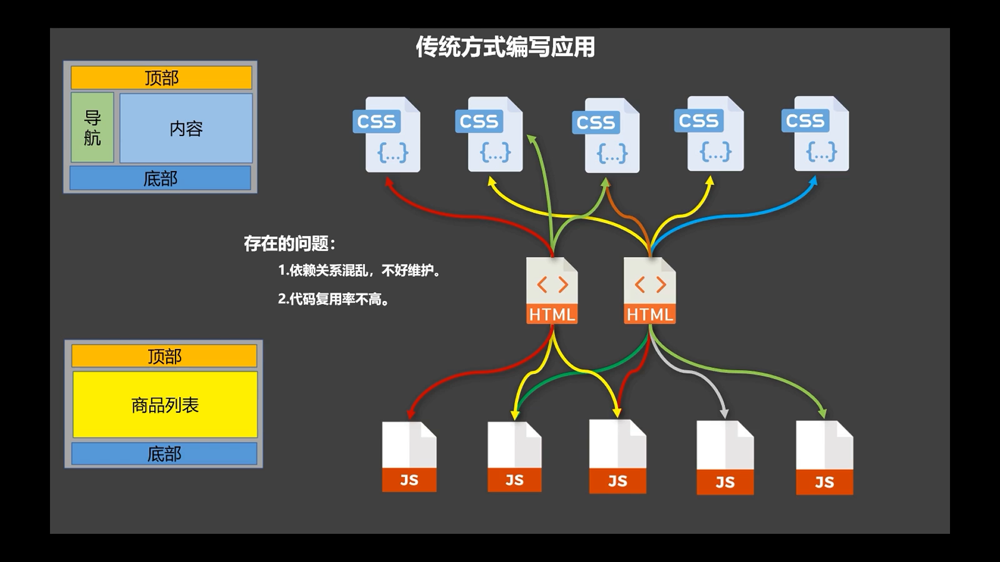
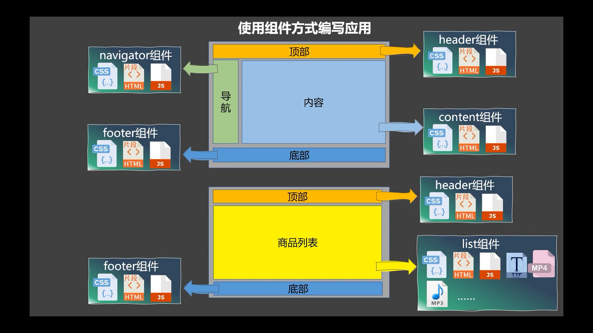
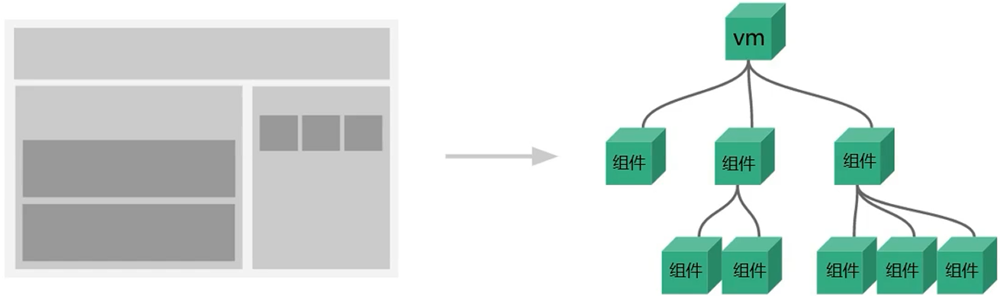
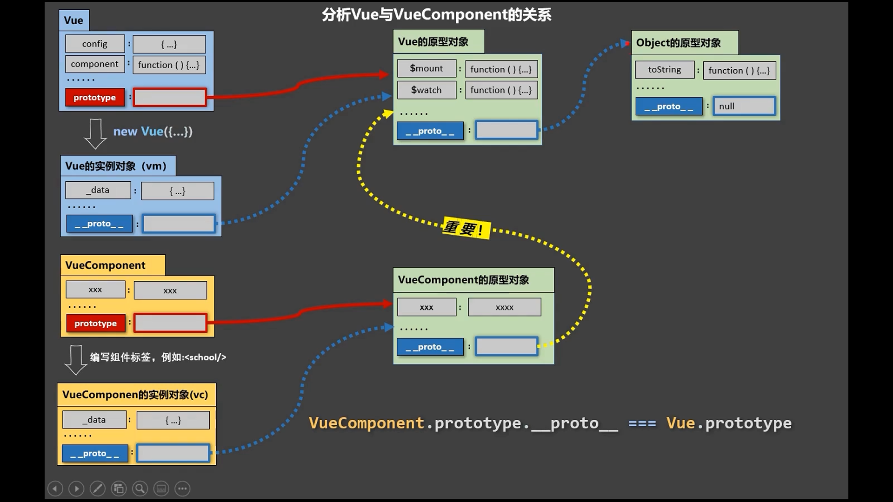

# vue组件化编程


传统方式编写的应用:



主要是 html 的部分没有复用


使用组件方式编写应用



注意:下面的 header组件和 footer组件是复用了上面的, 而不是复制

组件化的应用编写方式体现了: 封装



组件的定义:

实现应用中**局部**功能**代码**和**资源**的集合

代码: html js css

资源: img / font / mp3 / mp4 ...


## 1 模块与组件、模块化与组件化  

1 模块

理解: 向外提供特定功能的 js 程序, 一般就是一个 js 文件

为什么: js 文件很多很复杂

作用: 复用 js, 简化 js 的编写, 提高 js 运行效率


2 组件

理解: 用来实现局部(特定)功能效果的代码集合(html/css/js/image…..)

为什么: 一个界面的功能很复杂

作用: 复用编码, 简化项目编码, 提高运行效率  


3 模块化  

当应用中的 js 都以模块来编写的, 那这个应用就是一个模块化的应用。  


4 组件化  

当应用中的功能都是多组件的方式来编写的, 那这个应用就是一个组件化的应用,。  


非单文件组件

 一个文件( a.hml )包含有n个组件


单文件组件

 一个文件( a.vue )只包含有1个组件


## 2 非单文件组件

1 模板编写没有提示

2 没有构建过程, 无法将 ES6 转换成 ES5

3 不支持组件的 CSS

4 真正开发中几乎不用


### 基本使用

1 定义组件

2 注册组件

3 使用组件


Vue中使用组件的三大步骤：


#### 一、定义组件

使用 `Vue.extend(options)` 创建，其中 `options` 和 `new Vue( options )` 时传入的那个 `options` 几乎一样，但也有点区别；

区别如下：

1 `el`不要写，为什么？ ——— 最终所有的组件都要经过一个`vm`的管理，由`vm`中的`el`决定服务哪个容器。

2 `data`必须写成函数，为什么？ ———— 避免组件被复用时，数据存在引用关系。

备注：使用`template`可以配置组件结构。

示例:

```javascript
const school = Vue.extend({
    template:`
        <div class="demo">
            <h2>学校名称：{{schoolName}}</h2>
            <h2>学校地址：{{address}}</h2>
            <button @click="showName">点我提示学校名</button>	
        </div>
    `,
    // el:'#root', //组件定义时，一定不要写el配置项，因为最终所有的组件都要被一个vm管理，由vm决定服务于哪个容器。
    data(){
        return {
            schoolName:'尚硅谷',
            address:'北京昌平'
        }
    },
    methods: {
        showName(){
            alert(this.schoolName)
        }
    },
})
```


#### 二、注册组件

1 局部注册

靠 `new Vue()` 的时候传入`components`选项

```javascript
//创建vm
new Vue({
    el:'#root',
    data:{
        msg:'你好啊！'
    },
    //第二步：注册组件（局部注册）
    components:{
        school,
        student
    }
})
```

这里components中的 `school`是 `school:school` 的简写, 注册组件时, key是什么, 在 template 中标签就要写什么, value 是组件对象


2 全局注册组件

靠 `Vue.component('组件名',组件)`

```javascript
//第二步：全局注册组件
Vue.component('hello',hello)
```


#### 三、使用组件

写组件标签

```html
<body>
    <div id="root">
        <hello></hello>
        <hr>
        <h1>{{msg}}</h1>
        <hr>
        <!-- 第三步：编写组件标签 -->
        <school></school>
        <hr>
        <!-- 第三步：编写组件标签 -->
        <student></student>
    </div>

    <div id="root2">
        <hello></hello>
    </div>
</body>
```


完整示例

```html
<!DOCTYPE html>
<html>
	<head>
		<meta charset="UTF-8" />
		<title>基本使用</title>
		<script type="text/javascript" src="../js/vue.js"></script>
	</head>
	<body>
		<div id="root">
			<hello></hello>
			<hr>
			<h1>{{msg}}</h1>
			<hr>
			<!-- 第三步：编写组件标签 -->
			<school></school>
			<hr>
			<!-- 第三步：编写组件标签 -->
			<student></student>
		</div>

		<div id="root2">
			<hello></hello>
		</div>
	</body>

	<script type="text/javascript">
		Vue.config.productionTip = false

		//第一步：创建school组件
		const school = Vue.extend({
			template:`
				<div class="demo">
					<h2>学校名称：{{schoolName}}</h2>
					<h2>学校地址：{{address}}</h2>
					<button @click="showName">点我提示学校名</button>	
				</div>
			`,
			// el:'#root', //组件定义时，一定不要写el配置项，因为最终所有的组件都要被一个vm管理，由vm决定服务于哪个容器。
			data(){
				return {
					schoolName:'尚硅谷',
					address:'北京昌平'
				}
			},
			methods: {
				showName(){
					alert(this.schoolName)
				}
			},
		})

		//第一步：创建student组件
		const student = Vue.extend({
			template:`
				<div>
					<h2>学生姓名：{{studentName}}</h2>
					<h2>学生年龄：{{age}}</h2>
				</div>
			`,
			data(){
				return {
					studentName:'张三',
					age:18
				}
			}
		})
		
		//第一步：创建hello组件
		const hello = Vue.extend({
			template:`
				<div>	
					<h2>你好啊！{{name}}</h2>
				</div>
			`,
			data(){
				return {
					name:'Tom'
				}
			}
		})
		
		//第二步：全局注册组件
		Vue.component('hello',hello)

		//创建vm
		new Vue({
			el:'#root',
			data:{
				msg:'你好啊！'
			},
			//第二步：注册组件（局部注册）
			components:{
				school,
				student
			}
		})

		new Vue({
			el:'#root2',
		})
	</script>
</html>
```


### 注意点

几个注意点


#### 1 关于组件名:

一个单词组成：
第一种写法(首字母小写)：school
第二种写法(首字母大写)：School


多个单词组成：
第一种写法(kebab-case命名)：my-school
第二种写法(CamelCase命名)：MySchool (需要Vue脚手架支持)


备注：
(1) 组件名尽可能回避HTML中已有的元素名称，例如：h2、H2都不行。
(2) 可以使用name配置项指定组件在开发者工具中呈现的名字。


#### 2 关于组件标签

第一种写法：

```html
<school></school>
```


第二种写法：

自闭合标签

```html
<school/>
```


备注：不用使用脚手架时，`<school/>`会导致后续组件不能渲染。


#### 3 一个简写方式

```javascript
const school = Vue.extend(options)
```

 可简写为：

```javascript
const school = options
```

示例:

```javascript
//定义组件
const school = {
    name:'atguigu',
    template:`
        <div>
            <h2>学校名称：{{name}}</h2>	
            <h2>学校地址：{{address}}</h2>	
        </div>
    `,
    data(){
        return {
            name:'尚硅谷',
            address:'北京'
        }
    }
}
```


完整示例:

```html
<!DOCTYPE html>
<html>
	<head>
		<meta charset="UTF-8" />
		<title>几个注意点</title>
		<script type="text/javascript" src="../js/vue.js"></script>
	</head>
	<body>
		<div id="root">
			<h1>{{msg}}</h1>
			<school></school>
		</div>
	</body>

	<script type="text/javascript">
		Vue.config.productionTip = false
		
		//定义组件
		const s = Vue.extend({
            // 这里定义了组件名, 那么在开发者工具中就会显示这个名字(首字母大写)
			name:'atguigu',
			template:`
				<div>
					<h2>学校名称：{{name}}</h2>	
					<h2>学校地址：{{address}}</h2>	
				</div>
			`,
			data(){
				return {
					name:'尚硅谷',
					address:'北京'
				}
			}
		})

		new Vue({
			el:'#root',
			data:{
				msg:'欢迎学习Vue!'
			},
			components:{
                // 注册组件时, key是什么, 在 template 中标签就要写什么
                // value 是组件对象
				school:s
			}
		})
	</script>
</html>
```


### 组件的嵌套

```html
<!DOCTYPE html>
<html>
	<head>
		<meta charset="UTF-8" />
		<title>组件的嵌套</title>
		<!-- 引入Vue -->
		<script type="text/javascript" src="../js/vue.js"></script>
	</head>
	<body>
		<!-- 准备好一个容器-->
		<div id="root">
			
		</div>
	</body>

	<script type="text/javascript">
		Vue.config.productionTip = false //阻止 vue 在启动时生成生产提示。

		//定义student组件
		const student = Vue.extend({
			name:'student',
			template:`
				<div>
					<h2>学生姓名：{{name}}</h2>	
					<h2>学生年龄：{{age}}</h2>	
				</div>
			`,
			data(){
				return {
					name:'尚硅谷',
					age:18
				}
			}
		})
		
		//定义school组件
		const school = Vue.extend({
			name:'school',
			template:`
				<div>
					<h2>学校名称：{{name}}</h2>	
					<h2>学校地址：{{address}}</h2>	
					<student></student>
				</div>
			`,
			data(){
				return {
					name:'尚硅谷',
					address:'北京'
				}
			},
			//注册组件（局部）
			components:{
				student
			}
		})

		//定义hello组件
		const hello = Vue.extend({
			template:`<h1>{{msg}}</h1>`,
			data(){
				return {
					msg:'欢迎来到尚硅谷学习！'
				}
			}
		})
		
		//定义app组件
		const app = Vue.extend({
			template:`
				<div>	
					<hello></hello>
					<school></school>
				</div>
			`,
			components:{
				school,
				hello
			}
		})

		//创建vm
		new Vue({
			template:'<app></app>',
			el:'#root',
			//注册组件（局部）
			components:{app}
		})
	</script>
</html>
```


### VueComponent

关于 VueComponent

1 school 组件本质是一个名为 `VueComponent` 的构造函数，且不是程序员定义的，是 `Vue.extend` 生成的。


2 我们只需要写`<school/>`或 `<school></school>` ，Vue解析时会帮我们创建school组件的实例对象，
即Vue帮我们执行的：`new VueComponent(options)`


3 特别注意：每次调用 `Vue.extend`，返回的都是一个全新的 `VueComponent` ！！！！


4 关于this指向：

(1) 组件配置中：
data函数、methods中的函数、watch中的函数、computed中的函数 它们的this均是【VueComponent实例对象 简称 vc 】。

(2) new Vue(options)配置中：
data函数、methods中的函数、watch中的函数、computed中的函数 它们的this均是【Vue实例对象, 简称 vm 】。


5 VueComponent的实例对象，以后简称vc（也可称之为：组件实例对象）。
Vue的实例对象，以后简称vm。


```html
<!DOCTYPE html>
<html>
	<head>
		<meta charset="UTF-8" />
		<title>VueComponent</title>
		<script type="text/javascript" src="../js/vue.js"></script>
	</head>
	<body>
		<div id="root">
			<school></school>
			<hello></hello>
		</div>
	</body>

	<script type="text/javascript">
		Vue.config.productionTip = false
		
		//定义school组件
		const school = Vue.extend({
			name:'school',
			template:`
				<div>
					<h2>学校名称：{{name}}</h2>	
					<h2>学校地址：{{address}}</h2>	
					<button @click="showName">点我提示学校名</button>
				</div>
			`,
			data(){
				return {
					name:'尚硅谷',
					address:'北京'
				}
			},
			methods: {
				showName(){
					console.log('showName',this)
				}
			},
		})

		const test = Vue.extend({
			template:`<span>atguigu</span>`
		})

		//定义hello组件
		const hello = Vue.extend({
			template:`
				<div>
					<h2>{{msg}}</h2>
					<test></test>	
				</div>
			`,
			data(){
				return {
					msg:'你好啊！'
				}
			},
			components:{test}
		})


		// console.log('@',school)
		// console.log('#',hello)

		//创建vm
		const vm = new Vue({
			el:'#root',
			components:{school,hello}
		})
	</script>
</html>
```


### 一个重要的内置关系

1 一个重要的内置关系：VueComponent.prototype.__proto__ === Vue.prototype
2 为什么要有这个关系：让组件实例对象（vc）可以访问到 Vue原型上的属性、方法。





关于 prototype

```javascript
//定义一个构造函数
function Demo(){
    this.a = 1
    this.b = 2
}
//创建一个Demo的实例对象
const d = new Demo()
console.log(Demo.prototype) //显示原型属性
console.log(d.__proto__) 	//隐式原型属性
console.log(Demo.prototype === d.__proto__)
//程序员通过显示原型属性操作原型对象，追加一个x属性，值为99
Demo.prototype.x = 99
console.log('@',d) 
```


示例 :

```html
<!DOCTYPE html>
<html>
	<head>
		<meta charset="UTF-8" />
		<title>一个重要的内置关系</title>
		<!-- 引入Vue -->
		<script type="text/javascript" src="../js/vue.js"></script>
	</head>
	<body>
		<div id="root">
			<school></school>
		</div>
	</body>

	<script type="text/javascript">
		Vue.config.productionTip = false //阻止 vue 在启动时生成生产提示。
		Vue.prototype.x = 99

		//定义school组件
		const school = Vue.extend({
			name:'school',
			template:`
				<div>
					<h2>学校名称：{{name}}</h2>	
					<h2>学校地址：{{address}}</h2>	
					<button @click="showX">点我输出x</button>
				</div>
			`,
			data(){
				return {
					name:'尚硅谷',
					address:'北京'
				}
			},
			methods: {
				showX(){
					console.log(this.x)
				}
			},
		})

		//创建一个vm
		const vm = new Vue({
			el:'#root',
			data:{
				msg:'你好'
			},
			components:{school}
		})

		
		

	</script>
</html>
```


## 3 单文件组件

### 1 组成

一个`.vue` 文件的组成(3 个部分)


#### 1 模板页面

页面结构

```html
<template>
	页面模板
</template>
```


#### 2 JS 模块对象  

脚本

```html
<script>
    export default {
        name: "xxx"
        data() {
            return {}
        },
        methods: {},
        computed: {},
        components: {}
    } 
</script>
```


#### 3 样式

```css
<style>样式定义</style>
```


#### 4 示例

```vue
<template>
	<! -- 页面模板 -->
</template>
<script>
    export default {
        data() {
            return {}
        },
        methods: {},
        computed: {},
        components: {}
    } 
</script>
<style>
    /* 样式定义 */
</style>
```


### 完整示例

#### index.html

```
<!DOCTYPE html>
<html>
<head>
    <meta charset="UTF-8"/>
    <title>练习一下单文件组件的语法</title>
</head>
<body>
    <!-- 准备一个容器 -->
    <div id="root"></div>
    <script type="text/javascript" src="../js/vue.js"></script>
    <script type="text/javascript" src="./main.js"></script>
</body>
</html>
```


#### main.js

入口文件

```javascript
import App from './App.vue'

new Vue({
	el:'#root',
	template:`<App></App>`,
	components:{App},
})
```


#### App.vue

汇总所有子组件的组件

```vue
<template>
	<div>
		<School></School>
		<Student></Student>
	</div>
</template>

<script>
	//引入组件
	import School from './School.vue'
	import Student from './Student.vue'

	export default {
		name:'App',
		components:{
			School,
			Student
		}
	}
</script>
```


#### School.vue

```vue
<template>
	<div class="demo">
		<h2>学校名称：{{name}}</h2>
		<h2>学校地址：{{address}}</h2>
		<button @click="showName">点我提示学校名</button>	
	</div>
</template>

<script>
	 export default {
		name:'School',
		data(){
			return {
				name:'尚硅谷',
				address:'北京昌平'
			}
		},
		methods: {
			showName(){
				alert(this.name)
			}
		},
	}
</script>

<style>
	.demo{
		background-color: orange;
	}
</style>
```


#### Student.vue

```vue
<template>
	<div>
		<h2>学生姓名：{{name}}</h2>
		<h2>学生年龄：{{age}}</h2>
	</div>
</template>

<script>
	 export default {
		name:'Student',
		data(){
			return {
				name:'张三',
				age:18
			}
		}
	}
</script>
```

