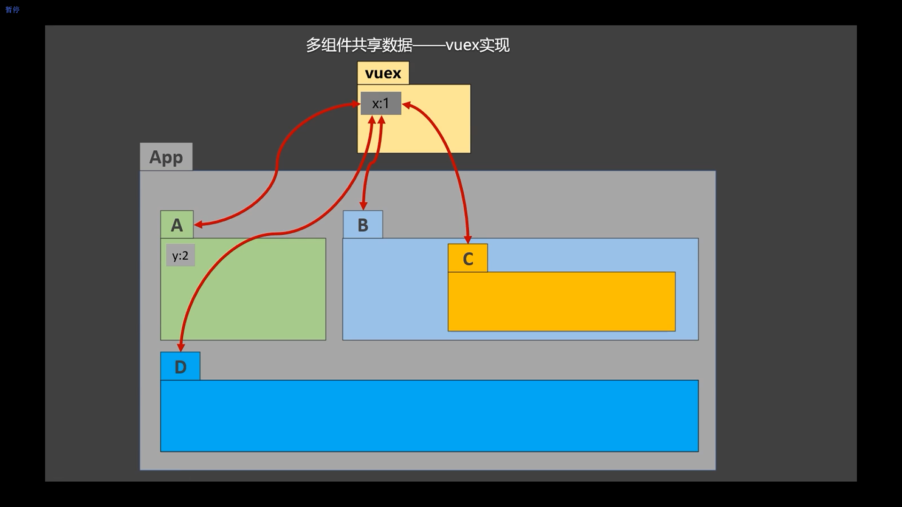

# vuex

## 1 概念

在Vue中实现集中式状态（数据）管理的一个Vue插件，对vue应用中多个组件的共享状态进行集中式的管理（读/写），也是一种组件间通信的方式，且适用于任意组件间通信。

Github 地址: https://github.com/vuejs/vuex


## 2 何时使用？

多个组件依赖于同一状态

来自不同组件的行为需要变更同一状态


使用全局组件:


使用 vuex




## 3 原理


图中没有体现的重要对象 **store**


Vue Components: 负责展示数据以及响应用户的交互

可以调用 $store.dispatch() 和 $store.commit() 将事件交给 Actions (有业务逻辑 ) 和 Mutations( 没有业务逻辑, 直接修改数据 )


Actions: 接收组件通过 $store.dispatch() 传递过来的数据, 根据业务逻辑调用 web-api 或者其他处理, 处理完成后,如果还需要修改数据, 则通过 commit 将要做的修改提交到 Mutations


Mutations: 接收通过 $store.commit() 方法传过来的事件, 根据事件的类型和参数对 state 进行修改


State: 保存数据, 保存的数据是响应式数据, 修改了 State中的数据组件的页面会直接刷新, 通过 $store.state 访问数据


## 4 使用 vuex

### 1 安装

```shell
npm install vuex@3
```

默认安装的是vuex最新版 ( 4.x.x ), 适配 vue3 ,不能在 vue2 中使用, vue2 中要使用 vuex 3.x.x 版本


### 2 引入

main.js

```javascript
import Vue from 'vue'
import Vuex from 'vuex'
// ...

Vue.use(Vuex)
```

当use了 Vuex 后, 在创建 vm 对象时就可以传入一个 store 配置项了


### 3 搭建vuex环境

创建文件：```src/store/index.js```

```js
//引入Vue核心库
import Vue from 'vue'
//引入Vuex
import Vuex from 'vuex'
//应用Vuex插件
Vue.use(Vuex)

//准备actions对象——响应组件中用户的动作
const actions = {}
//准备mutations对象——修改state中的数据
const mutations = {}
//准备state对象——保存具体的数据
const state = {}

//创建并暴露store
export default new Vuex.Store({
	actions,
	mutations,
	state
})
```


在```main.js```中创建vm时传入```store```配置项

```js
......
//引入store
import store from './store'
......

//创建vm
new Vue({
	el:'#app',
	render: h => h(App),
	store
})
```


###    4 基本使用

store中包含4部分 


#### state

用于存储数据

```javascript
//准备state——用于存储数据
const state = {
	sum:0 //当前的和
}
```

组件中读取vuex中的数据：```$store.state.sum```


读取state数据

方式一：直接读取

```javascript
this.$store.state.personAbout.list
```

方式二：借助mapState读取：

```js
...mapState('countAbout',['sum','school','subject']),
```


#### actions

用于响应组件中的动作

值为一个对象，包含多个响应用户动作的回调函数

通过 commit( )来触发 mutation 中函数的调用, 间接更新 state


如何触发 actions 中的回调？
在组件中使用: $store.dispatch('对应的 action 回调名') 触发

组件中修改vuex中的数据：```$store.dispatch('action中的方法名',数据)``` 

可以包含异步代码（定时器, ajax 等等）

```javascript
//准备actions——用于响应组件中的动作
const actions = {
	/* jia(context,value){
		console.log('actions中的jia被调用了')
		context.commit('JIA',value)
	},
	jian(context,value){
		console.log('actions中的jian被调用了')
		context.commit('JIAN',value)
	}, */
	jiaOdd(context,value){
		console.log('actions中的jiaOdd被调用了')
		if(context.state.sum % 2){
			context.commit('JIA',value)
		}
	},
	jiaWait(context,value){
		console.log('actions中的jiaWait被调用了')
		setTimeout(()=>{
			context.commit('JIA',value)
		},500)
	}
}
```

调用dispatch

方式一：直接调用 dispatch

```javascript
this.$store.dispatch('personAbout/addPersonWang',person)
```

方式二：借助mapActions

```javascript
...mapActions('countAbout',{incrementOdd:'jiaOdd',incrementWait:'jiaWait'})
```


#### mutations

用于操作数据（state）

值是一个对象，包含多个直接更新 state 的方法

谁能调用 mutations 中的方法？如何调用？
在 action 中使用：commit('对应的 mutations 方法名') 触发3. mutations 中方法的特点：不能写异步代码、只能单纯的操作 state

```$store.commit('mutations中的方法名',数据)```

备注：若没有网络请求或其他业务逻辑，组件中也可以越过actions，即不写```dispatch```，直接编写```commit```

```javascript
//准备mutations——用于操作数据（state）
const mutations = {
	JIA(state,value){
		console.log('mutations中的JIA被调用了')
		state.sum += value
	},
	JIAN(state,value){
		console.log('mutations中的JIAN被调用了')
		state.sum -= value
	}
}
```

调用commit

方式一：直接调用commit

```javascript
this.$store.commit('personAbout/ADD_PERSON',person)
```

方式二：借助mapMutations：

```javascript
...mapMutations('countAbout',{increment:'JIA',decrement:'JIAN'}),
```


#### getters

当state中的数据需要经过加工后再使用时，可以使用getters加工。类似于 vue 的 computed 计算属性

值为一个对象，包含多个用于返回数据的函数

如何使用？—— $store.getters.xxx

```javascript
const getters = {
    bigSum(state){
        return state.sum * 10
    }
}
```


读取getters数据

方式一：直接读取

```javascript
this.$store.getters['personAbout/firstPersonName']
```

方式二：借助mapGetters读取

```javascript
...mapGetters('countAbout',['bigSum'])
```


完整示例:

src/store/index.js

初始化数据、配置```actions```、配置```mutations```，操作文件```store.js```

```js
//该文件用于创建Vuex中最为核心的store
import Vue from 'vue'
//引入Vuex
import Vuex from 'vuex'
//应用Vuex插件
Vue.use(Vuex)

//准备actions——用于响应组件中的动作
const actions = {
	/* jia(context,value){
		console.log('actions中的jia被调用了')
		context.commit('JIA',value)
	},
	jian(context,value){
		console.log('actions中的jian被调用了')
		context.commit('JIAN',value)
	}, */
	jiaOdd(context,value){
		console.log('actions中的jiaOdd被调用了')
		if(context.state.sum % 2){
			context.commit('JIA',value)
		}
	},
	jiaWait(context,value){
		console.log('actions中的jiaWait被调用了')
		setTimeout(()=>{
			context.commit('JIA',value)
		},500)
	}
}
//准备mutations——用于操作数据（state）
const mutations = {
	JIA(state,value){
		console.log('mutations中的JIA被调用了')
		state.sum += value
	},
	JIAN(state,value){
		console.log('mutations中的JIAN被调用了')
		state.sum -= value
	}
}
//准备state——用于存储数据
const state = {
	sum:0, //当前的和
	school:'尚硅谷',
	subject:'前端'
}
//准备getters——用于将state中的数据进行加工
const getters = {
	bigSum(state){
		return state.sum*10
	}
}

//创建并暴露store
export default new Vuex.Store({
	actions,
	mutations,
	state,
	getters
})
```


src/components/Count.vue

```vue
<template>
	<div>
		<h1>当前求和为：{{$store.state.sum}}</h1>
		<h3>当前求和放大10倍为：{{$store.getters.bigSum}}</h3>
		<select v-model.number="n">
			<option value="1">1</option>
			<option value="2">2</option>
			<option value="3">3</option>
		</select>
		<button @click="increment">+</button>
		<button @click="decrement">-</button>
		<button @click="incrementOdd">当前求和为奇数再加</button>
		<button @click="incrementWait">等一等再加</button>
	</div>
</template>

<script>
	export default {
		name:'Count',
		data() {
			return {
				n:1, //用户选择的数字
			}
		},
		methods: {
			increment(){
				this.$store.commit('JIA',this.n)
			},
			decrement(){
				this.$store.commit('JIAN',this.n)
			},
			incrementOdd(){
				this.$store.dispatch('jiaOdd',this.n)
			},
			incrementWait(){
				this.$store.dispatch('jiaWait',this.n)
			},
		},
		mounted() {
			console.log('Count',this.$store)
		},
	}
</script>

<style lang="css">
	button{
		margin-left: 5px;
	}
</style>
```


src/main.js

```javascript
//引入Vue
import Vue from 'vue'
//引入App
import App from './App.vue'
//引入插件
import vueResource from 'vue-resource'
//引入store
import store from './store'

//关闭Vue的生产提示
Vue.config.productionTip = false
//使用插件
Vue.use(vueResource)

//创建vm
new Vue({
	el:'#app',
	render: h => h(App),
	store,
	beforeCreate() {
		Vue.prototype.$bus = this
	}
})
```


### 5 map方法

现在完整的 store/index.js

```javascript
//该文件用于创建Vuex中最为核心的store
import Vue from 'vue'
//引入Vuex
import Vuex from 'vuex'
//应用Vuex插件
Vue.use(Vuex)

//准备actions——用于响应组件中的动作
const actions = {
	/* jia(context,value){
		console.log('actions中的jia被调用了')
		context.commit('JIA',value)
	},
	jian(context,value){
		console.log('actions中的jian被调用了')
		context.commit('JIAN',value)
	}, */
	jiaOdd(context,value){
		console.log('actions中的jiaOdd被调用了')
		if(context.state.sum % 2){
			context.commit('JIA',value)
		}
	},
	jiaWait(context,value){
		console.log('actions中的jiaWait被调用了')
		setTimeout(()=>{
			context.commit('JIA',value)
		},500)
	}
}
//准备mutations——用于操作数据（state）
const mutations = {
	JIA(state,value){
		console.log('mutations中的JIA被调用了')
		state.sum += value
	},
	JIAN(state,value){
		console.log('mutations中的JIAN被调用了')
		state.sum -= value
	}
}
//准备state——用于存储数据
const state = {
	sum:0, //当前的和
	school:'尚硅谷',
	subject:'前端'
}
//准备getters——用于将state中的数据进行加工
const getters = {
	bigSum(state){
		return state.sum*10
	}
}

//创建并暴露store
export default new Vuex.Store({
	actions,
	mutations,
	state,
	getters
})
```


map方法是在组件中调用, 用于快速生成方法的


#### 1 mapState

用于映射```state```中的数据为**计算属性**


##### 手动实现

```javascript
computed:{
    sum(){
        return this.$store.state.sum
    },
    school(){
        return this.$store.state.school
    },
    subject(){
        return this.$store.state.subject
    }
}
```


##### 对象写法

借助mapState生成计算属性：sum、school、subject,  参数为配置对象

配置对象的 key 多为组件中计算属性的名字, value 为 store 中 state 的属性名

```javascript
computed: {
     ...mapState({sum:'sum',school:'school',subject:'subject'})
}
```


##### 数组写法

借助mapState生成计算属性：sum、school、subject, 参数为字符串数组

数组中的每一个字符串作为组件的计算属性的名字, 同时这个计算属性的值也指向 store 中 state 的同名的属性

```javascript
computed: { 
	...mapState(['sum','school','subject'])
}
```


#### 2 mapGetters

用于映射```getters```中的属性 / 方法为**计算属性**

##### 手动实现

```javascript
computed:{
	bigSum(){
        return this.$store.getters.bigSum
    }
}
```


##### 对象写法

借助 `mapGetters` 生成计算属性, 参数为配置对象

配置对象的 key 多为组件中计算属性的名字, value 为 store 中 getters的属性名(方法名)

```javascript
computed: {
    ...mapGetters({bigSum:'bigSum'})
}
```


##### 数组写法

借助 `mapGetters` 生成计算属性, 参数为字符串数组

数组中的每一个字符串作为组件的计算属性的名字, 同时这个计算属性的值也指向 store 中 getters 的同名的属性 ( 方法 )

```javascript
computed: {
    ...mapGetters(['bigSum'])
}
```


#### 3 mapActions

用于帮助我们生成与```actions```对话的方法，即：包含```$store.dispatch(xxx)```的函数

##### 手动实现

```javascript
methods: {
    incrementOdd(){
        this.$store.dispatch('jiaOdd',this.n)
    },
    incrementWait(){
        this.$store.dispatch('jiaWait',this.n)
    }
}
```


##### 对象形式

靠mapActions生成：incrementOdd、incrementWait, 参数为配置对象

配置对象的key作为组件中的方法名, 值为 store 中 actions 的属性 / 方法名

```javascript
methods:{
    ...mapActions({incrementOdd:'jiaOdd',incrementWait:'jiaWait'})
}
```


##### 数组形式

靠mapActions生成：incrementOdd、incrementWait（）,参数为字符串数组

数组中字符串作为组件中的方法名, 同时指向store 中 actions 的属性 / 方法名

```
methods:{
    ...mapActions(['jiaOdd','jiaWait'])
}
```


#### 4 mapMutations

用于帮助我们生成与```mutations```对话的方法，即：包含```$store.commit(xxx)```的函数

##### 手动实现

```javascript
methods: {
    increment(){
        this.$store.commit('JIA',this.n)
    },
    decrement(){
        this.$store.commit('JIAN',this.n)
    }
}
```


##### 对象形式

靠 `mapActions` 生成：increment、decrement, 参数为配置对象

配置对象的key作为组件中的方法名, 值为 store 中 mutations 的属性 / 方法名

```javascript
methods:{
    ...mapMutations({increment:'JIA',decrement:'JIAN'})
}
```


靠 `mapMutations` 生成：JIA、JIAN（数组形式）

数组中字符串作为组件中的方法名, 同时指向store 中 mutations 的属性 / 方法名

```javascript
methods:{
    ...mapMutations(['JIA','JIAN'])
}
```

备注：mapActions 与 mapMutations 使用时，若需要传递参数需要：在模板中绑定事件时传递好参数，否则参数是事件对象。


### 6 模块化

#### 1 目的

让代码更好维护，让多种数据分类更加明确


#### 2 实现

##### 1 单模块

修改 `store.js`

将各个模块的 state mutations actions getters 放在各自的配置对象内, 注意配置对象需要再声明一个属性: `namespaced:true`开启**命名空间**

```javascript
const countAbout = {
  namespaced:true,//开启命名空间
  state:{x:1},
  mutations: { ... },
  actions: { ... },
  getters: {
    bigSum(state){
       return state.sum * 10
    }
  }
}

const personAbout = {
  namespaced:true,//开启命名空间
  state:{ ... },
  mutations: { ... },
  actions: { ... }
}

const store = new Vuex.Store({
  modules: {
    countAbout,
    personAbout
  }
})
```

开启命名空间后，组件中读取 state getters mutations actions 的方式需要相应的调整


##### 2 多模块

当项目更加复杂, store中维护的各个不同业务模块的数据太多时, 就需要根据业务, 将各个数据封装成独立的 module

要求:

1 包含多个 module

2 一个 module 是一个 store 的配置对象

3 与一个组件（包含有共享数据）对应


src/store/count.js

```javascript
//求和相关的配置
export default {
	namespaced:true,
	actions:{
		jiaOdd(context,value){
			console.log('actions中的jiaOdd被调用了')
			if(context.state.sum % 2){
				context.commit('JIA',value)
			}
		},
		jiaWait(context,value){
			console.log('actions中的jiaWait被调用了')
			setTimeout(()=>{
				context.commit('JIA',value)
			},500)
		}
	},
	mutations:{
		JIA(state,value){
			console.log('mutations中的JIA被调用了')
			state.sum += value
		},
		JIAN(state,value){
			console.log('mutations中的JIAN被调用了')
			state.sum -= value
		},
	},
	state:{
		sum:0, //当前的和
		school:'尚硅谷',
		subject:'前端',
	},
	getters:{
		bigSum(state){
			return state.sum*10
		}
	},
}
```


src/store/person.js

```javascript
//人员管理相关的配置
import axios from 'axios'
import { nanoid } from 'nanoid'
export default {
	namespaced:true,
	actions:{
		addPersonWang(context,value){
			if(value.name.indexOf('王') === 0){
				context.commit('ADD_PERSON',value)
			}else{
				alert('添加的人必须姓王！')
			}
		},
		addPersonServer(context){
			axios.get('https://api.uixsj.cn/hitokoto/get?type=social').then(
				response => {
					context.commit('ADD_PERSON',{id:nanoid(),name:response.data})
				},
				error => {
					alert(error.message)
				}
			)
		}
	},
	mutations:{
		ADD_PERSON(state,value){
			console.log('mutations中的ADD_PERSON被调用了')
			state.personList.unshift(value)
		}
	},
	state:{
		personList:[
			{id:'001',name:'张三'}
		]
	},
	getters:{
		firstPersonName(state){
			return state.personList[0].name
		}
	},
}
```


src/store/index.js

```javascript
//该文件用于创建Vuex中最为核心的store
import Vue from 'vue'
//引入Vuex
import Vuex from 'vuex'
import countOptions from './count'
import personOptions from './person'
//应用Vuex插件
Vue.use(Vuex)

//创建并暴露store
export default new Vuex.Store({
	modules:{
		countAbout:countOptions,
		personAbout:personOptions
	}
})
```

