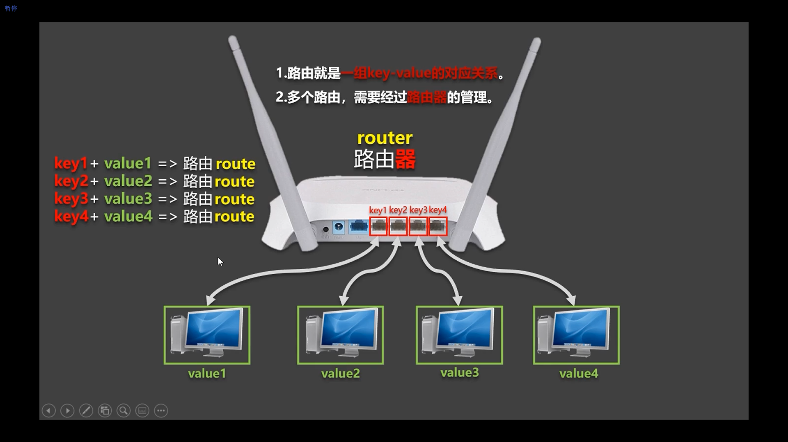
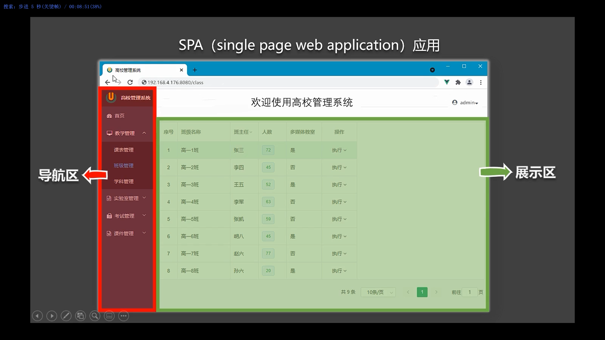
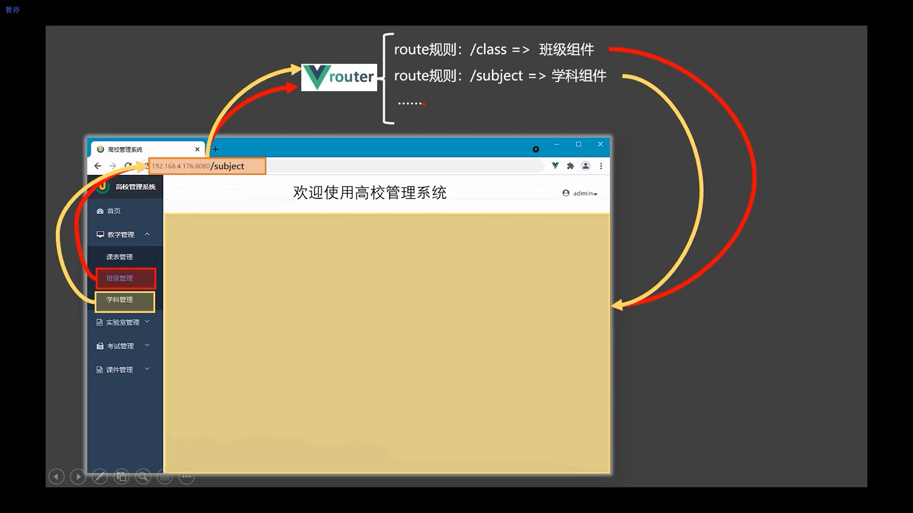

# router

## 1 router 的理解

### 1 什么是路由?

一个路由就是一组映射关系（key - value）



什么是路由?

一个路由就是一组映射关系（key - value）

key 为路径, value 可能是 function 或 component


路由分类

后端路由：

理解：value 是 function, 用于处理客户端提交的请求。

工作过程：服务器接收到一个请求时, 根据请求路径找到匹配的函数
来处理请求, 返回响应数据。


前端路由：

理解：value 是 component，用于展示页面内容。

工作过程：当浏览器的路径改变时, 对应的组件就会显示。


### 2 vue中的路由是要实现什么功能?

vue 的一个插件库，专门用来实现 SPA 应用


### 3 对 SPA 应用的理解

单页 Web 应用（single page web application，SPA）。

整个应用只有一个完整的页面。

点击页面中的导航链接不会刷新页面，只会做页面的局部更新。

数据需要通过 ajax 请求获取。




3 路由的理解




## vue-router

vue-router 是一个 vue 的插件库


### 1 安装

```shell
npm install vue-router@3
```

默认安装的是最新版 vue-router 4 只能在 vue3 中使用, 要在 vue2 中使用 vue-router, 需要使用 vue-router@3


### 2 引入

main.js

```javascript
//引入Vue
import Vue from 'vue'
//引入App
import App from './App.vue'
//引入VueRouter
import VueRouter from 'vue-router'
//引入路由器
import router from './router'

//关闭Vue的生产提示
Vue.config.productionTip = false
//应用插件
Vue.use(VueRouter)

//创建vm
new Vue({
	el:'#app',
	render: h => h(App),
	router:router
})
```

引入了 vue-router 插件后就可以使用新的配置项 router


router 配置项

src/router/index.js

```javascript
// 该文件专门用于创建整个应用的路由器
import VueRouter from 'vue-router'
//引入组件
import About from '../components/About'
import Home from '../components/Home'


//创建并暴露一个路由器
export default new VueRouter({
	routes:[
		{
			path:'/about',
			component:About
		},
		{
			path:'/home',
			component:Home
		}
	]
})
```


router-link

使用 router-link 标签定义跳转 

```vue
<router-link class="list-group-item" active-class="active" to="/about">About</router-link>
```

router-link 最终会被 vue 编译为 a 标签

to 属性定义要跳转的url地址的路径 "/about" 跳转路径 "/#/about"

active-class 被点击激活后添加的 class 属性


router-view

使用 router-view 标签定义路由组件显示的位置

```vue
<!-- 指定组件的呈现位置 -->
<router-view></router-view>
```


App.vue

```vue
<template>
  <div>
    <div class="row">
      <div class="col-xs-offset-2 col-xs-8">
        <div class="page-header"><h2>Vue Router Demo</h2></div>
      </div>
    </div>
    <div class="row">
      <div class="col-xs-2 col-xs-offset-2">
        <div class="list-group">
		  <!-- 原始html中我们使用a标签实现页面的跳转 -->
          <!-- <a class="list-group-item active" href="./about.html">About</a> -->
          <!-- <a class="list-group-item" href="./home.html">Home</a> -->

          <!-- Vue中借助router-link标签实现路由的切换 -->
          <router-link class="list-group-item" active-class="active" to="/about">About</router-link>
          <router-link class="list-group-item" active-class="active" to="/home">Home</router-link>
        </div>
      </div>
      <div class="col-xs-6">
        <div class="panel">
          <div class="panel-body">
						<!-- 指定组件的呈现位置 -->
            <router-view></router-view>
          </div>
        </div>
      </div>
    </div>
  </div>
</template>

<script>
	export default {
		name:'App',
	}
</script>
```


### 3 使用

不需要路由, 通过标签, 如:`<Banner />` , 引入的组件称为一般组件

需要路由进行切换展示的组件称为路由组件


开发中

一般组件放在 /src/components 目录

路由组件放在 /src/pages 目录


#### 1 基本路由

1 效果

2 总结: 编写使用路由的 3 步

1 定义路由组件


#### 2 注册路由

3 使用路由


3 嵌套（多级）路由  


4 路由传参


5 编程式路由导航


相关 API：

this.$router.push(path): 相当于点击路由链接(可以返回到当前路由界面)

this.$router.replace(path): 用新路由替换当前路由(不可以返回到当前路由界面)

this.$router.back(): 请求(返回)上一个记录路由

this.$router.go(-1): 请求(返回)上一个记录路由

this.$router.go(1): 请求下一个记录路由


## 路由

1 理解： 一个路由（route）就是一组映射关系（key - value），多个路由需要路由器（router）进行管理。

2 前端路由：key是路径，value是组件。

### 1 基本使用

1安装vue-router，命令：```npm i vue-router```

2应用插件：```Vue.use(VueRouter)```

3 编写router配置项:

```js
//引入VueRouter
import VueRouter from 'vue-router'
//引入Luyou 组件
import About from '../components/About'
import Home from '../components/Home'

//创建router实例对象，去管理一组一组的路由规则
const router = new VueRouter({
	routes:[
		{
			path:'/about',
			component:About
		},
		{
			path:'/home',
			component:Home
		}
	]
})

//暴露router
export default router
```

1 实现切换（active-class可配置高亮样式）

```vue
<router-link active-class="active" to="/about">About</router-link>
```

2 指定展示位置

```vue
<router-view></router-view>
```


### 2 几个注意点

1 路由组件通常存放在```pages```文件夹，一般组件通常存放在```components```文件夹。

2 通过切换，“隐藏”了的路由组件，默认是被销毁掉的，需要的时候再去挂载。

3 每个组件都有自己的```$route```属性，里面存储着自己的路由信息。

3 整个应用只有一个router，可以通过组件的```$router```属性获取到。


### 3 多级路由（多级路由）

1 配置路由规则，使用children配置项：

```js
routes:[
	{
		path:'/about',
		component:About,
	},
	{
		path:'/home',
		component:Home,
		children:[ //通过children配置子级路由
			{
				path:'news', //此处一定不要写：/news
				component:News
			},
			{
				path:'message',//此处一定不要写：/message
				component:Message
			}
		]
	}
]
```

2 跳转（要写完整路径）：

```vue
<router-link to="/home/news">News</router-link>
```


### 4 路由的query参数

1 传递参数

```vue
<!-- 跳转并携带query参数，to的字符串写法 -->
<router-link :to="/home/message/detail?id=666&title=你好">跳转</router-link>
<!-- 使用模版字符串 -->
<router-link :to=`/home/message/detail?id={{msg.id}}&title={{msg.title}}`>跳转</router-link>
				
<!-- 跳转并携带query参数，to的对象写法 -->
<router-link :to="{
        path:'/home/message/detail',
        query:{
          id:666,
          title:'你好'
        }
    }">
    跳转
</router-link>

<router-link :to="{
        path:'/home/message/detail',
        query:{
          id:msg.id,
          title:msg.title
        }
    }">
    跳转
</router-link>
```

2 接收参数：

```js
$route.query.id
$route.query.title
```

### 5 命名路由

1 作用：可以简化路由的跳转。

2 如何使用

1 给路由命名：

```js
{
	path:'/demo',
	component:Demo,
	children:[
		{
			path:'test',
			component:Test,
			children:[
				{
                    name:'hello' //给路由命名
					path:'welcome',
					component:Hello,
				}
			]
		}
	]
}
```

2 简化跳转：

```vue
<!--简化前，需要写完整的路径 -->
<router-link to="/demo/test/welcome">跳转</router-link>

<!--简化后，直接通过名字跳转 -->
<router-link :to="{name:'hello'}">跳转</router-link>

<!--简化写法配合传递参数 -->
<router-link 
	:to="{
		name:'hello',
		query:{
		   id:666,
            title:'你好'
		}
	}"
>跳转</router-link>
```

### 6 路由的params参数

1 配置路由，声明接收params参数

```js
{
	path:'/home',
	component:Home,
	children:[
		{
			path:'news',
			component:News
		},
		{
			component:Message,
			children:[
				{
					name:'xiangqing',
					path:'detail/:id/:title', //使用占位符声明接收params参数
					component:Detail
				}
			]
		}
	]
}
```

2 传递参数

```vue
<!-- 跳转并携带params参数，to的字符串写法 -->
<router-link :to="/home/message/detail/666/你好">跳转</router-link>
				
<!-- 跳转并携带params参数，to的对象写法 -->
<router-link 
	:to="{
		name:'xiangqing',
		params:{
		   id:666,
            title:'你好'
		}
	}"
>跳转</router-link>
```

特别注意：路由携带params参数时，若使用to的对象写法，则不能使用path配置项，必须使用name配置！

1 接收参数：

```js
$route.params.id
$route.params.title
```


### 7 路由的props配置

	作用：让路由组件更方便的收到参数

```js
{
	name:'xiangqing',
	path:'detail/:id',
	component:Detail,

	//第一种写法：props值为对象，该对象中所有的key-value的组合最终都会通过props传给Detail组件
	// props:{a:900}

	//第二种写法：props值为布尔值，布尔值为true，则把路由收到的所有params参数通过props传给Detail组件, 注意:不会接受 query 参数
	// props:true
	
	//第三种写法：props值为函数，该函数返回的对象中每一组key-value都会通过props传给Detail组件
	props(route){
		return {
			id:route.query.id,
			title:route.query.title
		}
	}
}
```


### 8 ```<router-link>```的replace属性

1 作用：控制路由跳转时操作浏览器历史记录的模式

2 浏览器的历史记录有两种写入方式：分别为```push```和```replace```，

```push```是追加历史记录，

```replace```是替换当前记录。路由跳转时候默认为```push```


3 如何开启```replace```模式

```vue
<router-link :replace="true" .......>News</router-link>
```

简写:

```vue
<router-link replace .......>News</router-link>
```


### 9 编程式路由导航

1 作用：不借助```<router-link> ```实现路由跳转，让路由跳转更加灵活

2 具体编码：

```js
//$router的两个API
this.$router.push({
	name:'xiangqing',
		params:{
			id:xxx,
			title:xxx
		}
})

this.$router.replace({
	name:'xiangqing',
		params:{
			id:xxx,
			title:xxx
		}
})
this.$router.forward() //前进
this.$router.back() //后退

this.$router.go(3) //可前进也可后退 正数等价于连续n次 forward , 负数等价于 连续 n 次 backward
```


### 10 缓存路由组件

1 作用：让不展示的路由组件保持挂载，不被销毁。

2 具体编码：

keep-alive 中包裹的所有组件都会被缓存

```vue
<keep-alive> 
    <router-view></router-view>
</keep-alive>
```


指定要被缓存的组件, 使用 include指定组件名, 组件名就是组件配置的 name 属性

单个

```vue
<keep-alive include="News"> 
    <router-view></router-view>
</keep-alive>
```

多个

注意使用 v-bind 简写 `:include`

```vue
<keep-alive :include="['News', 'Message']"> 
    <router-view></router-view>
</keep-alive>
```


### 11 两个新的生命周期钩子

1 作用：路由组件所独有的两个钩子，用于捕获路由组件的激活状态。

2 具体名字：

1 ```activated```路由组件被激活时触发。

2 ```deactivated```路由组件失活时触发。


### 12 路由守卫

1 作用：对路由进行权限控制

2 分类：全局守卫、独享守卫、组件内守卫

#### 1 全局守卫

全局前置守卫：初始化时执行、每次路由切换前执行

to: 即将跳转的路由

from: 来源路由地址

next: 方法, 如果确定可以跳转, 那么调用next() 即可放行, 如果不调用next() 方法, 那么页面不会跳转

```javascript
router.beforeEach((to,from,next)=>{
	console.log('beforeEach',to,from)
	if(to.meta.isAuth){ //判断当前路由是否需要进行权限控制
		if(localStorage.getItem('school') === 'atguigu'){ //权限控制的具体规则
			next() //放行
		}else{
			alert('暂无权限查看')
			// next({name:'guanyu'})
		}
	}else{
		next() //放行
	}
})
```


全局后置守卫：初始化时执行、每次路由切换后执行

to: 即将跳转的路由

from: 来源路由地址

后置路由执行时, 页面是已经确认要跳转的, 所以没有next()方法, 在这个方法里可以做一些对页面的处理

```javascript
router.afterEach((to,from)=>{
	console.log('afterEach',to,from)
	if(to.meta.title){ 
		document.title = to.meta.title //修改网页的title
	}else{
		document.title = 'vue_test'
	}
})
```


在路由配置中, vue-router 提供了 meta 字段, 用于配置路由的元信息, 也就是自定义信息

```javascript
routes:[
	{
		path:'/about',
		component:About,
		meta:{
			isAuth: true
		}
	}
]
```


#### 2 独享守卫

```js
routes:[
	{
		path:'/about',
		component:About,
		meta:{
			isAuth: true
		},
        beforeEnter(to,from,next){
            console.log('beforeEnter',to,from)
            if(to.meta.isAuth){ //判断当前路由是否需要进行权限控制
                if(localStorage.getItem('school') === 'atguigu'){
                    next()
                }else{
                    alert('暂无权限查看')
                    // next({name:'guanyu'})
                }
            }else{
                next()
            }
        }
	}
]
```

注意: 独享守卫只有前置守卫, 没有后置守卫, 可以与全局后置守卫一起使用


#### 3 组件内守卫

进入守卫

通过路由规则，进入该组件时被调用

About.vue

```javascript
beforeRouteEnter (to, from, next) {
}
```


离开守卫

通过路由规则，离开该组件时被调用

About.vue

```javascript
beforeRouteLeave (to, from, next) {
}
```


组件内守卫的调用时机与全局守卫的前置后卫/后置守卫调用时机是不一样的

Home -> About  全局的前置守卫/后置守卫都会调用, About上设置的进入守卫会被调用, 但是离开守卫不会被调用

如果 About 不是通过路由(  `<router-link>` 标签或者 $router.push() / $router.replace() ), 而是直接渲染到页面上的, 也不会触发组件内守卫


### 13 路由器的两种工作模式

1 对于一个url来说，什么是hash值？—— #及其后面的内容就是hash值。

2 hash值不会包含在 HTTP 请求中，即：hash值不会带给服务器。


3 hash模式：

1 地址中永远带着#号，不美观 。

2 若以后将地址通过第三方手机app分享，若app校验严格，则地址会被标记为不合法。

3 兼容性较好。


4 history模式：

1 地址干净，美观 。

2 兼容性和hash模式相比略差。

3 应用部署上线时需要后端人员支持，解决刷新页面服务端404的问题。

nodejs 上有 connect-history-api-fallback 专门用于解决这个问题


```shell
npm install connect-history-api-fallback
```


server.js

```javascript
const express = require('express')
const history = require('connect-history-api-fallback')

const app = express()
// 必须在应用加载静态资源之前设置
app.use(history)
app.use(express.static(__dirname+'static'))
```


重启服务器

```shell
node server
```


