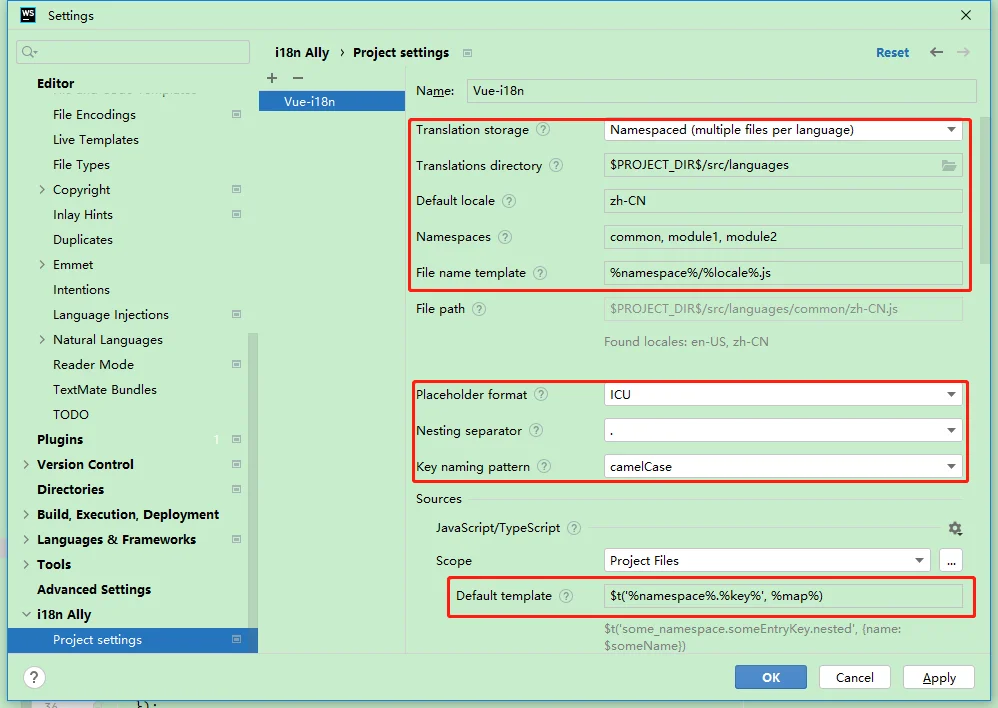

# 使用Vue-i18n实现项目国际化

# 简单介绍

Vue-i18n是一款与Vue高度集成的国际化插件，可以为页面提供多语言和本地化支持，下面是官方的中文文档和npm地址

- [Vue-i18n中文文档](https://kazupon.github.io/vue-i18n/zh/)
- [Vue-i18n npm](https://www.npmjs.com/package/vue-i18n)

# 依赖安装

对于Vue3项目，直接上最新版即可，或者指定目前的版本9

```bash
npm i vue-i18n -S
npm i vue-i18n@9 -S
```


对于Vue2项目，需要使用版本8

```bash
npm i vue-i18n -S
```


# 目录结构及相关代码

可以先对Vue-i18n插件进行进一步封装，采用如下的目录结构：

```
i18n:.
│  i18n.js
│  languages.js
│  modules.js
│
├─common
│      en-US.js
│      zh-CN.js
│
├─moudle1
│      en-US.js
│      zh-CN.js
│
└─moudle2
       en-US.js
       zh-CN.js
```

1. `i18n.js`是Vue-i18n进一步封装后的插件，用于指定默认的配置和自动引入支持的语言及语言包命名空间

2. `languages.js`是支持的语言列表

3. `modules.js`是语言包的命名空间，用于扫描common、module1、moudle2等语言包目录并引入语言包

4. 目录`common`用于放置一些通用、频繁使用的语言包翻译

5. 目录

   ```
   module1
   ```

   、

   ```
   module2
   ```

   等可以放置一些业务相关的语言包翻译

   ## languages.js

   在`languages.js`内，列出项目支持的语言列表，`code`为语言包文件名称，`name`为语言名称

   ```javascript
   export const languages = [
   {
       code: "zh-CN",
       name: "简体中文"
   },
   {
       code: "en-US",
       name: "English"
   },
   ]
   ```

   

   ## modules.js

   在`modules.js`内，列出项目语言包的命名空间，避免业务翻译上的冲突及后期维护的繁琐

   ```javascript
   export const modules = [
   "common",
   "module1",
   "module2"
   ]
   ```

   

   ## i18n.js

   在`i18n.js`内，对Vue-i18n插件进一步封装，在`module.js`列举的命名空间目录内扫描`languages.js`中列举支持的语言包翻译，并进行一些默认的配置

   ```javascript
   import Vue from "vue";
   import VueI18n from "vue-i18n";
   import { languages } from "@/i18n/languages";
   import { modules } from "@/i18n/modules";
   Vue.use(VueI18n);
   function getMessages(modules, languages) {
   let messages = {};
   languages.forEach(lang => {
       messages[lang.code] = {};
   });
   // 遍历模块，将内容添加到 messages.语言.上
   modules.forEach(moduleName => {
       languages.forEach(async lang => {
           // 加 try ... catch 防止语言文件缺失 import 报 error，影响执行
           try {
               let { default: obj } = await import("./" + `${moduleName}/${lang.code}.js`);
               // { en: { base: { } }, zh-CN: { base: {} }}
               !messages[lang.code][moduleName] && (messages[lang.code][moduleName] = {});
               Object.assign(messages[lang.code][moduleName], obj);
           } catch (e) {
               console.log(e.message);
           }
       });
   });
   return messages;
   }
   let messages = getMessages(modules, languages);
   const i18n = new VueI18n({
   locale: "zh-CN", // 设置默认语言环境
   messages
   });
   export default i18n;
   ```

   

# 语言包翻译规则

封装后的国际化插件根据不同的模块作为语言包的命名空间的划分，避免单个语言包过于臃肿，同时也能够避免一些翻译内容在不同模块之间的冲突

命名空间主要分为通用命名空间，如`common`目录，对于通用命名空间应该放置一些通用、频繁使用的翻译内容，同时要求简洁和语境兼容，保证通用命名空间内的内容适用于不同场景

以下是部分`common`目录下语言包的翻译例子，大致采用如下的格式：
`zh_CN.js`：

```javascript
export default {
    "add": "新增",
    "edit": "编辑",
    "delete": "删除",
    "copy": "复制",
    "hour": "{n} 小时",
    "pageTotalNum": "共 {total} 条"
}
```


`en_US.js`：

```javascript
export default {
    "add": "Add",
    "edit": "Edit",
    "delete": "Delete",
    "copy": "Copy",
    "hour": "0 hour | 1 hour | {n} hours",
    "pageTotalNum": "{total} in total"
}
```


- 每个翻译标识key都对应翻译内容value
- 可以利用占位符{xx}代替变化的翻译内容
- 对于使用复数的形式，需要使用`|`管道对复数进行划分

# 使用方式

在定义好i18n插件及语言包后，需要在`main.js`中将其引入，并添加到Vue实例上

```javascript
import i18n from "./i18n/i18n"
new Vue({
  i18n, // Here
  router,
  store,
  render: (h) => h(App),
}).$mount("#app");
```


## 常规使用

引入后，即可使用Vue实例上的`$i18n`取到i18n插件的实例，同时也有一些`$t`、`$tc`等方法用于替换待国际化处理的字符串

对于无需参数的简单使用，例如需要显示"新增"或"Add"，可以通过`$t('common.add')`替换

对于需要参数时，例如显示列表记录的总条数，可以通过`$t('common.pageTotalNum', {total: allNum})`替换，其中`allNum`为存放总条数内容的变量，最后展示的格式为"共 3 条"或"3 in total"

对于考虑复数的情况，则需要使用`$tc`方法，例如展示小时数，可以通过`$tc('common.hour', hourNum)`替换，其中`hourNum`为存放小时数的变量，当`hourNum = 0`时展示"0 小时"或"0 hour"，`hourNum = 1`时展示"1 小时"或"1 hour"，`hourNum`大于1时（如3）则展示`hourNum = 3`时展示"3 小时"或"3 hours"

## 切换语言环境

可以通过`navigator.language`获取浏览器的语言环境，以设置系统默认展示的语言；同时并提供下拉框，让用户可以自行切换系统语言

通过修改i18n插件实例上的`locale`变量，修改所使用的语言包达到切换动态切换语言环境的目的

```javascript
this.$i18n.locale = 'zh-CN'
```


对于使用Element-UI、Ant Design Vue等组件库的项目，还需要自行切换组件库所使用的的默认语言

## 无翻译时展示原文

对于部分动态文本可能不在语言包内，直接使用`$t`展示的内容则会包含命名空间，例如"menu.homePage"的格式

为了处理无翻译时展示原文的情况，可以使用`$te`方法，用于判断是否有该内容的翻译，返回类型为布尔值，通过三元运算有翻译则展示翻译内容，无翻译则展示文本

```javascript
$te(`menu.${menuInfo.menuName}`) ? $t(`menu.${menuInfo.menuName}`) : menuInfo.menuName
```


你也可以为其封装为一个util方法使用，避免写过长的三元运算

```javascript
import i18n from "@/i18n/i18n";
/**
   * 国际化翻译方法封装，若无翻译则显示原文
   * @param key
   * @param val
   * @returns {VueI18n.TranslateResult|*}
   */
t(key, val) {
    return i18n.te(key) ? i18n.t(key) : val;
}
```


# 相关插件

使用VSCode、WebStorm等IDE开发前端项目国际化功能时，也可以在IDE的插件插件市场找到一些可用的国际化插件，用于对语言包翻译标记的智能提示、自动翻译原文、在翻译方法旁展示原文内容等

在这里展示的是WebStorm上i18n Ally的相关配置，需要配置以下的参数使插件能够支持封装后的语言包格式


## 发布者