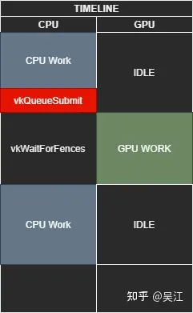
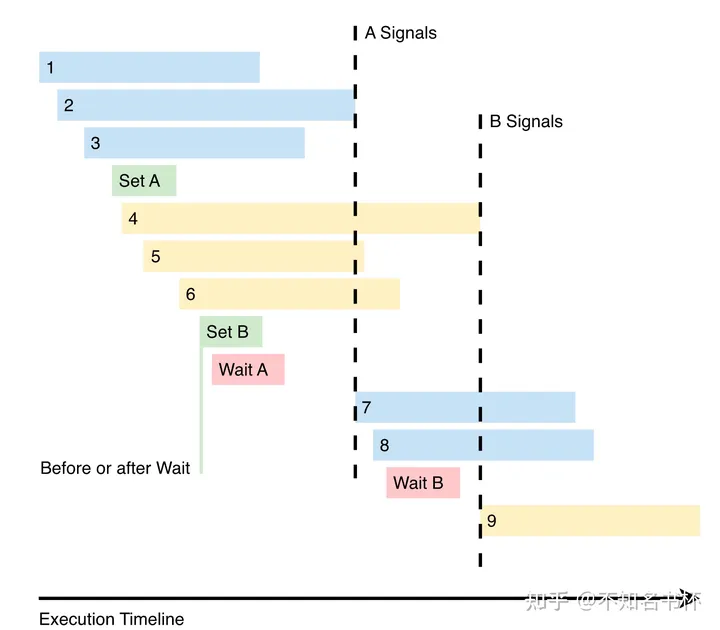

# Vulkan中的同步与缓存控制


# 1.Introduction

## 1.1 Vulkan同步机制的重要性

相比OpenGL,Vulkan是更加Low Level的API,这给了开发者更多的自由去控制资源。Vulkan能通过并行地运行多项任务，给我们更大的控制能力去操纵渲染过程，以便最大化地使用CPU和GPU的资源。Vulkan是显示地并行的，并且就是为了多线程而设计的。相比之下，OpenGL在设计之初没有考虑多线程。

典型场景： 比如，GPU和CPU可以相互独立地运行当前帧和下一帧中各种各样的片元与顶点操作。**通过说明某些操作需要去等待其他操作以及某些操作不需要等其他操作，Vulkan可以以最大的效率和最小的等待时间去渲染场景**。

通过让CPU和GPU核心在正确协调的调度下一同工作，我们可以让资源尽量少的空置，以此挤压出用户系统中的大部分的性能。这里的关键就是，确保所有并行的任务仅仅在需要的时候进行等待，并且，当任务必须等待的时候，其只去等待必要的时间长度。因此需要高效的同步机制。

对于同一个资源的访问之间的同步是vulkan应负责的内容之一，vulkan中一共提供了如下四种同步机制：

1. Fence
2. Semaphore
3. Event
4. Barrier

用以同步host/device之间，queues之间，queue submissions之间，以及一个单独的command buffer的commands之间的同步。

为了更好的理解同步的工作机制，我们需要从2个维度来分析同步：**队列间(across multiple queues)同步和\**队列内(within a signle queue)同步\****。

## 1.2队列(queue)间同步和队列(queue)内同步

vulkan中的commands是提交给队列(queue)的，因此队列内和队列见的同步机制会有所不同。

### 1.2.1 队列间同步

Vulkan API提供了2个选择来保证队列间同步：semaphores（信号量） and fences（栅栏）

请注意，Vulkan 1.2 引入了时间线信号量，这是未来信号量的新且首选的方法。 它们尚未在移动设备上广泛使用，因此我们将首先讨论原始方法，然后看看新的时间线信号量设计如何能够取代这两个原始选项。

### 1.2.2 队列内同步

Vulkan可以让开发者把command buffers发送给一个队列(queue)来执行图形操作，这个过程被设计为线程友好(thread-friendly)的。因此我们**可以在任意线程内通过command buffers提交(submit)工作，这些工作最终提交到同一个GPU queue中**。这使得我们可以充分利用CPU的所有core来并行工作，比如计算三角形和加载texture。

需要注意的是，提交到同一个Queue中的commands可能来自于不同的command buffer（并且既可以来自于同一个thread，也可以来自不同的thread）**。Queue中的Commands开始执行(start)的顺序是可以被保证的(这个顺序就是command被插入到Queue中的顺序)，但是执行完毕的顺序无法被保证。**因此，我们需要队列内(in-queue)同步工具来解决内部command的依赖问题(比如command A的start依赖于command B的complete)，这些工具就是**pipeline barriers， events和subpass dependencies**。

 

# 2.Fence

## 2.1Fence概述

首先我们介绍最简单的Fence。一句话总结，Fence提供了一种粗粒度的，从Device向Host单向传递信息的机制，即GPU -> CPU。**是为了GPU-to-CPU的同步而设计的。**

栅栏可以附加到队列提交，并允许应用程序使用 vkGetFenceStatus 检查栅栏状态或使用 vkWaitForFences 等待队列完成。

Host可以使用Fence来查询通过vkQueueSubmit/vkQueueBindSparse所提交的操作是否完成。简言之，在vkQueueSubmit/vkQueueBindSparse的时候，可以附加带上一个Fence对象。之后就可以使用这个对象来查询之前提交的状态了。

**栅栏提供与信号量相同的隐式内存保证（即保证相应的内存可以被正确的读取，而不是由于在cache中导致读取/写入不正确），如果我们想在交换缓冲区中呈现下一帧，我们可以使用栅栏来知道何时交换并开始下一帧的渲染。**



 

example:

```
VkResult vkQueueSubmit(
    VkQueue                                     queue,
    uint32_t                                    submitCount,
    const VkSubmitInfo*                         pSubmits,
    VkFence                                     fence);
```

其中，最后一个参数可以是一个有效的fence对象，当然，也可以指定为VK_NULL_HANDLE，标明不需要Fence。有趣的是，在vkQueueSubmit的时候，如果给定一个有效的fence对象，但是不提交任何信息，即submitCount为0，那么同样也可以算作一次成功的提交，等待之前所有提交到queue的任务都完成后，这个fence也就signaled了。这种使用方式提供了一种机制，可以让我们查询一个queue现在到底忙不忙(即提交后直接查询这个fence的状态，如果是signaled，证明不忙；如果unsignaled，证明之前提交的任务还没有完成)。

Fence本身只有两种状态，unsignaled或者signaled，大致可以认为fence是触发态还是未触发态。当使用vkCreateFence创建fence对象的时候，如果在标志位上填充了VkFenceCreateFlagBits的VK_FENCE_CREATE_SIGNALED_BIT，那么创建出来的fence就是signaled状态，否则都是unsignaled状态的。销毁一个fence对象需要使用vkDestroyFence。

伴随着vkQueueSubmit/vkQueueBindSparse一起提交的fence对象，可以使用vkGetFenceStatus来查询fence的状态。注意vkGetFenceStatus是非阻塞的，如果fence处于signaled状态，这个API返回VK_SUCCESS，否则，立即返回VK_NOT_READY。

当然，fence被触发到signaled状态，必须存在一种方法，将之转回到unsignaled状态，这个功能由vkResetFences完成，这个API一次可以将多个fence对象转到unsignaled状态。这个API结合VK_FENCE_CREATE_SIGNALED_BIT位，可以达到一种类似于C中do {} while;的效果，即loop的代码有着一致的表现：loop开始之前，所有的fence都创建位signaled状态，每次loop开始的时候，所用到的fence都由这个API转到unsignaled状态，伴随着submit提交过去。

等待一个fence，除了使用vkGetFenceStatus轮询之外，还有一个API vkWaitForFences提供了阻塞式地查询方法。这个API可以等待一组fence对象，直到其中至少一个，或者所有的fence都处于signaled状态，或者超时（时间限制由参数给出），才会返回。如果超时的时间设置为0，则这个API简单地看一下是否满足前两个条件，然后根据情况选择返回VK_SUCCESS，或者（虽然没有任何等待）VK_TIMEOUT。

简而言之，对于一个fence对象，Device会将其从unsignaled转到signaled状态，告诉Host一些工作已经完成。所以fence使用在Host/Device之间的，且是一种比较粗粒度的同步机制。

## 2.2.Fence实例

```
void executeQueue( VkCommandBuffer cmd )
{
    const VkCommandBuffer cmds[] = { cmd };
    VkFenceCreateInfo fenceInfo;
    VkFence drawFence;
    fenceInfo.sType = VK_STRUCTURE_TYPE_FENCE_CREATE_INFO;
    fenceInfo.pNext = nullptr;
    fenceInfo.flags = 0;
    vkCreateFence( gDevice, &fenceInfo, nullptr, &drawFence );

    VkPipelineStageFlags pipeStageFlags = VK_PIPELINE_STAGE_BOTTOM_OF_PIPE_BIT;
    VkSubmitInfo submitInfo[1] = {};
    submitInfo[0].sType = VK_STRUCTURE_TYPE_SUBMIT_INFO;
    submitInfo[0].pNext = nullptr;
    submitInfo[0].waitSemaphoreCount = 0;
    submitInfo[0].pWaitSemaphores = nullptr;
    submitInfo[0].pWaitDstStageMask = &pipeStageFlags;
    submitInfo[0].commandBufferCount = 1;
    submitInfo[0].pCommandBuffers = cmds;
    submitInfo[0].signalSemaphoreCount = 0;
    submitInfo[0].pSignalSemaphores = nullptr;

    HR( vkQueueSubmit( gQueue, 1, submitInfo, drawFence ) );

    VkResult res;
    do {
        res = vkWaitForFences( gDevice, 1, &drawFence, VK_TRUE, 100000000 );
    } while( res == VK_TIMEOUT );

    vkDestroyFence( gDevice, drawFence, nullptr );
}
```

 

 

# 3.Semaphore

## 3.1.VkSemaphore概述

VkSemaphore用以同步不同的queue之间，或者同一个queue不同的submission之间的执行顺序。即GPU -> GPU。

类似于fence，semaphore也有signaled和unsignaled的状态之分。然而由于在queue之间或者内部做同步都是device自己控制，所以一个semaphore的初始状态也就不重要了。所以，vkCreateSemaphore(3)就简单地不用任何额外参数创建一个semaphore对象，然后vkDestroySemaphore(3)可以用来销毁一个semaphore对象。不同于fence,没有重置或者等待semaphore的api，因为semaphore只对device有效。

**理解和使用信号量的关键是认识到它们仅用于 GPU 任务之间的同步，尤其是跨多个队列的同步，而不是用于 GPU 和 CPU 任务之间的同步。**

如果多个命令忙于跨内核和线程处理其任务，则信号量就像一个命令团队已完成的公告。 仅当批处理中的所有命令完成后，才会发出信号量。 它们**提供隐式内存保证，因此我们可以访问信号量后面的任何内存，而无需考虑在它们之间添加内存屏障**。

在device上使用semaphore的最典型的场景，就是通过vkQueueSubmit提交command buffer时候，所需要的参数由VkSubmitInfo()提交

```
typedef struct VkSubmitInfo {
    VkStructureType                sType;
    const void*                    pNext;
    uint32_t                       waitSemaphoreCount;
    const VkSemaphore*             pWaitSemaphores;
    const VkPipelineStageFlags*    pWaitDstStageMask;
    uint32_t                       commandBufferCount;
    const VkCommandBuffer*         pCommandBuffers;
    uint32_t                       signalSemaphoreCount;
    const VkSemaphore*             pSignalSemaphores;
} VkSubmitInfo;
```

通过不同的参数搭配，可以达到如下效果：所提交的command buffer将在执行到每个semaphore等待阶段时候，检查并等待每个对应的wait semaphore数组中的semaphore是否被signal, 且等到command buffer执行完毕以后，将所有signal semaphore数组中的semaphore都signal起来。

通过这种方式，实际上提供了一种非常灵活的同步queue之间或者queue内部不同command buffer之间的方法，通过组合使用semaphore，AP可以显式地指明不同command buffer之间的资源依赖关系，从而可以让driver在遵守这个依赖关系的前提下，最大程度地并行化，以提高GPU的利用效率。

基本逻辑：

一些 Vulkan 操作（如 VkQueueSubmit）支持 Signal 或 Wait 信标。

如果将其设置为 Signal a semaphore，这意味着该操作将在执行时立即“锁定”该信标，并在执行完成后解锁。

如果将其设置为 Wait on a semaphore，则表示操作将等到该信标解锁后才开始执行。

## 3.2.VkSemaphore实例

伪代码：

```
VkSemaphore Task1Semaphore;
VkSemaphore Task2Semaphore;

VkOperationInfo OpAlphaInfo;
// Operation Alpha will signal the semaphore 1
OpAlphaInfo.signalSemaphore = Task1Semaphore;

VkDoSomething(OpAlphaInfo);

VkOperationInfo OpBetaInfo;

// Operation Beta signals semaphore 2, and waits on semaphore 1
OpBetaInfo.signalSemaphore = Task2Semaphore;
OpBetaInfo.waitSemaphore = Task1Semaphore;

VkDoSomething(OpBetaInfo);

VkOperationInfo OpGammaInfo;
//Operation gamma waits on semaphore 2
OpGammaInfo.waitSemaphore = Task2Semaphore;

VkDoSomething(OpGammaInfo);
```

##  3.3 Timeline Semaphore

新的时间线信号量方法具有多种优势，因为它非常灵活，并且可以作为信号量和栅栏的超集，同时允许 GPU 和 CPU 之间双向发送信号。 我们不仅可以在 CPU 上等待来自应用程序的信号量，甚至可以向 GPU 发送信号量！ 虽然栅栏仅在粗队列提交级别工作，但时间线信号量具有更细的粒度以提供更大的灵活性。

它的工作方式非常聪明：它使用一个整数计数器，每个信号量在完成时发出信号以递增，作为信号时间线。

我们可以把它想象成体育场的人群一起编排一波浪潮，一排排的人站起来又坐下来，将动作按顺序传递给下一个人，而不必具体告诉坐在他们旁边的人。 每个人都已经知道他们在体育场中的位置（时间线），并且当波浪接近时，他们意识到轮到他们了。 这非常很酷。

# 4. Pipeline Barriers

Pipeline Barriers指定要等待哪些数据或渲染管道（rendering pipeline）的哪些阶段(stage)，以及要阻塞哪些阶段(stage)，直到完成先前命令中的其他指定阶段。

这些Barriers仅适用于 GPU，这意味着我们无法检查 CPU 上运行的应用程序何时执行了Pipeline Barriers。 如果我们需要向 CPU 上的application发回信号，可以通过使用fence或者event。

Barriers有两种类型：

- Execution barriers
- Memory barriers

**我们可以在一次调用中创建一个Execution barrier，或者一个Execution barrie和多个一种或多种类型的Memory barriers**。

pipeline barriers的函数如下：

```
void vkCmdPipelineBarrier(
   VkCommandBuffer                             commandBuffer,
   VkPipelineStageFlags                        srcStageMask,
   VkPipelineStageFlags                        dstStageMask,
   VkDependencyFlags                           dependencyFlags,
   uint32_t                                    memoryBarrierCount,
   const VkMemoryBarrier*                      pMemoryBarriers,
   uint32_t                                    bufferMemoryBarrierCount,
   const VkBufferMemoryBarrier*                pBufferMemoryBarriers,
   uint32_t                                    imageMemoryBarrierCount,
   const VkImageMemoryBarrier*                 pImageMemoryBarriers);
```

该函数就是个vulkan command，如同其他vk command一样（比如VkCmdDraw），需要被加入到command buffer中。

## 4.1 Execution barriers

当我们想要控制命令流并使用Pipeline Barriers强制执行顺序时，我们可以在 Vulkan commands之间插入barriers，并指定先决管道阶段(prerequisite pipeline stages)，在这些阶段(stage)中，之前的命令需要完成才能继续前进。 我们还可以指定在该barriers之前应暂停的管道阶段(pipeline stages)。

这些选项是使用 vkCmdPipelineBarrier 的 srcStageMask 和 dstStageMask 参数设置的。 由于它们是位标志，因此我们可以在这些掩码中指定多个阶段。

**简而言之，barriers就是把一次调用中的vulkan commands给一分为二，前半部分完成之后，后半部分才可以执行。**而StageMask则用来增加一些灵活性，比如我们可能只需要前半部分某些特定操作（比如mesh shader stage工作完成）完成，后半部分某些操作就可以执行了。

关于StageMask，下面是一些例子：

```
VK_PIPELINE_STAGE_NONE specifies no stages of execution.

VK_PIPELINE_STAGE_DRAW_INDIRECT_BIT specifies the stage of the pipeline where VkDrawIndirect* / VkDispatchIndirect* / VkTraceRaysIndirect* data structures are consumed. This stage also includes reading commands written by vkCmdExecuteGeneratedCommandsNV.

VK_PIPELINE_STAGE_TASK_SHADER_BIT_EXT specifies the task shader stage.

VK_PIPELINE_STAGE_MESH_SHADER_BIT_EXT specifies the mesh shader stage.
```

 

## 4.2 Memory barriers

**为了提高底层性能，Vulkan 在 CPU 和 GPU 核心上的快速 L1/L2 缓存与相对较慢的主 RAM 内存之间使用了一系列缓存机制。**

**当一个core写入内存（例如，写入渲染目标）时，更新可能仍然只存在于cache中，而准备好使用它的另一个core不可用或不可见。Memory barriers是我们可以用来确保刷新缓存（flush cache）的工具，使得在barriers之前执行的commands的内存写入(memory write)可用于待处理的barriers之后的commands；同时也是我们可以用来使缓存失效(invalidate cache)的工具，以便执行barriers之后的commands的core可以看到最新的数据。**

除了为execution barriers指定的管道阶段掩码之外，memory barriers还指定要等待的内存访问类型以及在指定管道阶段被阻止的访问类型。 下面的每个内存屏障都包含一个源访问掩码 (srcAccessMask) 和一个目标访问掩码 (dstAccessMask)，以指定先前命令中的源阶段（srcStage）进行的source access（通常是写入）对于以下命令中的目标阶段进行的目标访问可用且可见。 后续命令。

与execution barriers相反，这些访问掩码仅适用于阶段掩码中设置的精确阶段，并且不会扩展到逻辑上较早和较晚的阶段。

我们可以使用三种类型的memory barriers：global, buffer, and image。 其中每一个都定义了将确保可用的访问（the source access by the source stage ）以及这些访问将可见的阶段和访问类型（the destination access by the destination stage）。

- **全局内存屏障通过 pMemoryBarriers 参数添加并应用于所有内存对象。**
- **缓冲内存屏障是通过 pBufferMemoryBarriers 参数添加的，并且仅适用于绑定到 VkBuffer 对象的设备内存。**
- **图像内存屏障是通过 pImageMemoryBarriers 参数添加的，并且仅适用于绑定到 VkImage 对象的设备内存。**

下面是三种memory barriers的示例：

```
typedef struct VkMemoryBarrier {
   VkStructureType sType;
   const void* pNext;
   VkAccessFlags srcAccessMask;
   VkAccessFlags dstAccessMask;
} VkMemoryBarrier;


typedef struct VkBufferMemoryBarrier {
   VkStructureType sType;
   const void* pNext;
   VkAccessFlags srcAccessMask;
   VkAccessFlags dstAccessMask;
   uint32_t srcQueueFamilyIndex;
   uint32_t dstQueueFamilyIndex;
   VkBuffer buffer;
   VkDeviceSize offset;
   VkDeviceSize size;
} VkBufferMemoryBarrier;


typedef struct VkImageMemoryBarrier {
   VkStructureType sType;
   const void* pNext;
   VkAccessFlags srcAccessMask;
   VkAccessFlags dstAccessMask;
   VkImageLayout oldLayout;
   VkImageLayout newLayout;
   uint32_t srcQueueFamilyIndex;
   uint32_t dstQueueFamilyIndex;
   VkImage image;
   VkImageSubresourceRange subresourceRange;
} VkImageMemoryBarrier;
```

我们可以看到，VkBufferMemoryBarrier 和 VkImageMemoryBarrier使用的时候，需要各自绑定一个VkBuffer 和 VkImage。

# 5. Event

Vulkan 中的另一个同步工具是event，它使用源阶段掩码和目标阶段掩码，就像管道屏障一样，当我们需要指定和运行并行计算时，它非常有用。 **events 和 pipeline barriers之间的主要区别在于events 发生在两个部分中**。 第一部分是使用 vkCmdSetEvent 设置event，第二部分是使用 vkCmdWaitEvents 等待event。**Event将 vkCmdSetEvent 调用之前发生的执行和内存访问与 vkCmdWaitEvents 调用之后发生的执行和内存访问同步； vkCmdSetEvent 和 vkCmdWaitEvents 之间发生的命令不受该事件的影响**。 event可以从 GPU 命令缓冲区中设置，也可以从CPU设置。

**简而言之，Event通过vkCmdSetEvent和vkCmdWaitEvent把一次调用中的commands调用一分为三，vkCmdSetEvent前的commands执行完毕后，vkCmdWaitEvent后的commands才可以执行。但vkCmdSetEvent和vkCmdWaitEvent之间的commands不受影响。同样的，StageMask用来增加一些灵活性。**

Event的工作图示，符合我们刚刚说的工作原理。



 

 

示例代码：

```
// Three dispatches that don’t have conflicting resource accesses

vkCmdDispatch( 1 );
vkCmdDispatch( 2 );
vkCmdDispatch( 3 );

// 4, 5, and 6 don’t share resources with 1, 2, and 3
// No reason for them to be blocked, so set an event to wait for later

vkCmdSetEvent( A, srcStageMask = COMPUTE );
vkCmdDispatch( 4 );
vkCmdDispatch( 5 );
vkCmdDispatch( 6 );

// 7 and 8 don’t use the same resources as 4, 5, and 6.  So use an event
vkCmdSetEvent( B, srcStageMask = COMPUTE );

// 7 and 8 need the results of 1, 2, and 3

// So we’ll wait for them by waiting on A
vkCmdWaitEvents( A, dstStageMask = COMPUTE );
vkCmdDispatch( 7 );

vkCmdDispatch( 8 );
// 9 uses the same resources as 4, 5, and 6 so we wait.

// Also assumed is that 9 needs nothing from 7 and 8
vkCmdWaitEvents( B, dstStageMask = COMPUTE );

vkCmdDispatch( 9 );
```

 

## 参考链接

- Understanding Vulkan Synchronization: https://www.khronos.org/blog/understanding-vulkan-synchronization
- Vulkan Guide学习（1.5）: https://zhuanlan.zhihu.com/p/451194569
- vulkan中的同步和缓存控制之一，fence和semaphore: https://zhuanlan.zhihu.com/p/24817959
- C++ (Cpp) vkCreateFence示例: https://cpp.hotexamples.com/zh/examples/-/-/vkCreateFence/cpp-vkcreatefence-function-examples.html

标签: [vulkan](https://www.cnblogs.com/ArsenalfanInECNU/tag/vulkan/) , [线程同步](https://www.cnblogs.com/ArsenalfanInECNU/tag/线程同步/) , [fence](https://www.cnblogs.com/ArsenalfanInECNU/tag/fence/)