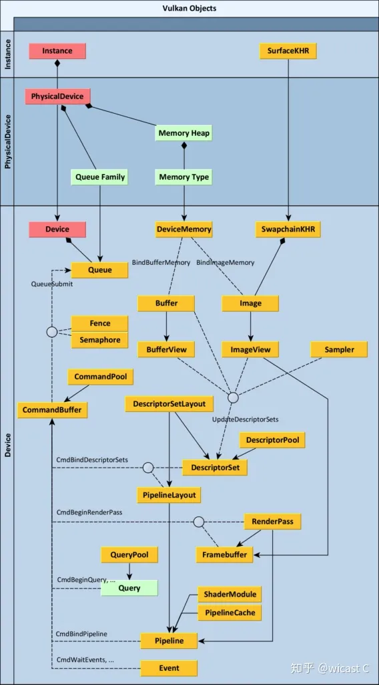
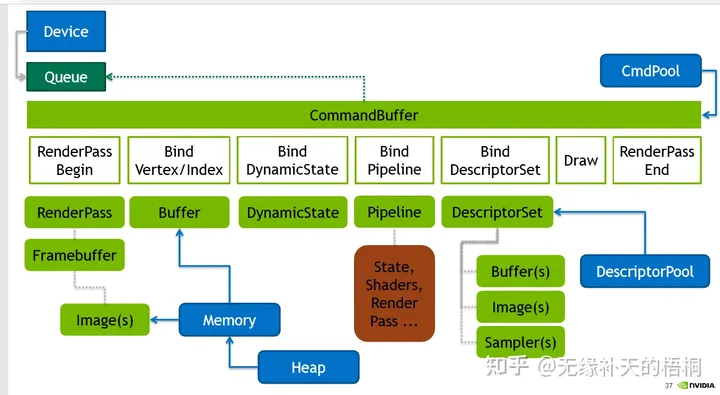

# Vulkan入门

https://www.cnblogs.com/ArsenalfanInECNU/p/18096919

要理解 vulkan 我觉得最重要的是，得先理清vulkan的那些对象的作用以及各自的关联性。本身这些对象距离实际使用的上层概念有一定距离，而各自关系又是比较复杂，只有吃透这一部分才能顺畅地去使用。

在amd那边有张叫 understanding vulkan objects

 

 

在说 Queue 和 Command 前，这里就要先说到 Mantle 世代 api （都是从Mantle 演变而来我们就叫他们 Mantle 世代好了）对于上世代 api 的第一大区别了：这一代的api将图形绘制命令分成了 **Record** 和 **Submit**，vulkan 中对应了 command buffer 和 queue，凡是vkCmd开头的调用都是录制命令，vkQueue 开头的都是提交（vkQueuePresentKHR 可以理解为特殊的提交）。

**Queue**：队列这个东西是从 Mantle 世代的api出现的，可以看作是对硬件执行流水线的抽象，通过提交任务执行图形计算，简单理解的话就是提交的内容对应某一个 queue 上只能依顺序执行（gpu 的并行其实并不是像很多人想的像多线程那样fire多少个 task 他就自动并行，就vulkan来讲提交的任务在一个 queue 上是按一定规则排列的）。

**QueueFamily与Queue**：翻译过来应该叫做队列家族，每个Family里会有若干queue，常见的 Family 为三种：Graphic，Compute和 Transfer。Graphic一般是全能的啥都能做，内含的queue数量也是最多；Compute不支持Graphic相关功能；Transfer可以专门用于上传数据。这种分法不是绝对的，要看具体硬件提供的queueFamily数量和支持的功能。vulkan 里的对单个queue 是禁止同一时间有多个线程进行操作的，所以申请多个 queue 能做到多个线程做submit。

**Command**：录制使用的对象是command pool和[command buffer](https://www.zhihu.com/search?q=command buffer&search_source=Entity&hybrid_search_source=Entity&hybrid_search_extra={"sourceType":"answer"%2C"sourceId":1632072443})，为啥这么设计现在可以先不管。录制本质上就是一个类似 push_back 的工作，每次调 vkCmd 就往 command buffer 塞内容进去，至于这个 command buffer 在cpu还是gpu这个完全取决于硬件和驱动实现，对vk程序员是透明的。录制结束之后就可以提交给queue执行了，所以理论上是这个时候gpu才开始真正执行。分成录制和提交的原因就是为了多线程。在vk里大家说的多线程渲染其实基本可以理解为多线程录制，多线程提交其实不太常见，也不好写，而且有更好的方案（往command [buffer录制](https://www.zhihu.com/search?q=buffer录制&search_source=Entity&hybrid_search_source=Entity&hybrid_search_extra={"sourceType":"answer"%2C"sourceId":1632072443})并不是直接就能多线程操作的，有很多限制，vk里有一个叫 secondary command buffer的东西可以直接用于多线程录制，不需要任何额外同步）。

 

**Buffer**：Vulkan主要有两种 Buffer 和 Image，Buffer一般用于vertex、index以及uniform，Image用于[位图](https://www.zhihu.com/search?q=位图&search_source=Entity&hybrid_search_source=Entity&hybrid_search_extra={"sourceType":"answer"%2C"sourceId":1632072443})数据，也就是贴图。而Buffer要真正使用起来还得配备一个 VkDeviceMemory，下面会说。

1. **Mesh**：这个比较好理解，vertex、index各自对应一个buffer对象和一个memory对象组成一个Mesh，tutorial里也算写的很清楚。
2. **Texture**：VkImage 除了 VkDeviceMemory 还需要 VkImageView 和 VkImageSampler，VkImageView 相当于一个 accessor，具体操作都需要操作这个accessor，所以基本上VkImage和VkImageView就是个强绑定关系。VkImageSampler是采样器，anisotropy、mips等在这里设置，可以多个图共享一个采样器。
3. **Uniform**：类似Mesh，只不过这个Buffer对应的**结构体一定一定要注意[内存对齐](https://www.zhihu.com/search?q=内存对齐&search_source=Entity&hybrid_search_source=Entity&hybrid_search_extra={"sourceType":"answer"%2C"sourceId":1632072443})的问题！！！**不同编译器不同平台编出来的内存对齐模式都可能不一样，而vulkan对传过来的数据是有对齐要求的，这个问题我吃过药，tutorial那一章最后写过，当时给我跳过去了，结果shader里拿到的数据怎么都不对，更要命的是这个问题是[validation layer](https://www.zhihu.com/search?q=validation layer&search_source=Entity&hybrid_search_source=Entity&hybrid_search_extra={"sourceType":"answer"%2C"sourceId":1632072443})无法检查出来的！

**Memory**：这里就是第二大不同了，以前的 OpenGL 创建一个Texture就能直接上传数据直接用了，uniform都是api直接传输的。到了vulkan里gpu的内存也放给程序员来管理了，VkDeviceMemory 这个对象就是代表你分配的显存。这和 c/c++自己手写内存分配器是差不多一个意思了，你可以定制很多更高级的分配策略，而且vulkan非常不鼓励小分配，vulkan的分配次数每个设备都是有上限的，就是为了让你做 suballocation。而这个活有现成的 vulkan memory allocator可以拿来直接用。

**Synchronization**：

1. vulkan不光让你自己管理内存，同步也需要手工做，cpu提交之后如何知道gpu完成任务了呢，所以有fence充当cpu和gpu之间的同步工具，cpu通过等待fence知道gpu完成任务。
2. Semaphores 用于两个提交直接建立依赖，submit和present这两个提交如果没有semaphores，用fence监听submit再通知submit肯定是低效的，所以两次submit之间通过semaphores直接在gpu内部建立依赖。
3. [barrier](https://www.zhihu.com/search?q=barrier&search_source=Entity&hybrid_search_source=Entity&hybrid_search_extra={"sourceType":"answer"%2C"sourceId":1632072443})是做啥的呢，vulkan上传上去的数据相当于都有一个状态（usage，access mask，VkImageLayout等），这个状态首先可以给gpu提供更多的优化信息，其次在操作数据时由于gpu直接操作的数据是先在一个缓存里，在另一个阶段读取这个数据的时候可能不是同一套核心的寄存器，这时候就会发生缓存不一致的问题，所以插入一个barrier就能告诉gpu这段写完下个阶段你得先同步缓存。
4. event不太常用
5. subpass dependency这个其实也提供了barrier类似的功能，是 subpass 专用的功能，subpass 算是 vulkan 特有的功能，renderpass 必须包含至少一个 [subpass](https://www.zhihu.com/search?q=subpass&search_source=Entity&hybrid_search_source=Entity&hybrid_search_extra={"sourceType":"answer"%2C"sourceId":1632072443})，当它只有一个的时候，dependency 建议留空，vk会补上默认值，自己写其实容易写错，tutorial 里其实就写的有问题。

**Pipeline**：VkPipeline 定义的是管线状态，[隐藏面剔除](https://www.zhihu.com/search?q=隐藏面剔除&search_source=Entity&hybrid_search_source=Entity&hybrid_search_extra={"sourceType":"answer"%2C"sourceId":1632072443})啊，混合啊都是在这里设置的，而这里最重要的一个状态就是shader是在这里进行绑定的。一旦[pipeline](https://www.zhihu.com/search?q=pipeline&search_source=Entity&hybrid_search_source=Entity&hybrid_search_extra={"sourceType":"answer"%2C"sourceId":1632072443})创建好了就不能改了，你要换shader就得换个新的pipeline。而 Compute Shader需要再独立的一个 Compute Pipeline，类型一样VkPipeline，但创建方法不同。提一嘴pipeline cache，这个东西就是用来加速shader加载的，因为shader即使是spirv这样底层的代码了，执行对应gpu的shader代码还是需要一趟编译变为gpu专用的最优内容为了节约这个编译时间就搞出了[pipeline cache](https://www.zhihu.com/search?q=pipeline cache&search_source=Entity&hybrid_search_source=Entity&hybrid_search_extra={"sourceType":"answer"%2C"sourceId":1632072443})。

**FrameBuffer**：这个差不多就是 OpenGL 里的 attachment 了，只不过 FrameBuffer 通过引用各种 ImageView 打包成一个集合，FrameBuffer 就是一堆 View 的集合。从 SwapChain 获得的Image 再创建 ImageView 放到 FrameBuffer 里，就能给 gpu 用了。

**RenderPass**：最初学vulkan最让我迷惑的部分就是RenderPass了，扣了很久的文档和代码才理解，vulkan的RenderPass 本质上描述的是一次渲染我需要的绘制的目标是长什么样的。创建RenderPass时参数里填写的pAttachments其实不是真正的attachment，而是attachment的描述，比如第一个attachment是color，第二个是depth，而 RenderPass 通过 FrameBuffer 才能绑定真正的Image（vkRenderPassBeginInfo里绑定），位置一一对应。这里说一下创建时候为啥也得给一个 FrameBuffer，主要是可以限定这个 RenderPass 不要乱来，能在一创建就能保证和某个 FrameBuffer 相容。之后的渲染流程中只要符合 [vk](https://www.zhihu.com/search?q=vk&search_source=Entity&hybrid_search_source=Entity&hybrid_search_extra={"sourceType":"answer"%2C"sourceId":1632072443}) 定义的 *Render Pass Compatibility 的* FrameBuffer ，这个FrameBuffer 就能拿来绑定。

**Descriptor**：shader 里读取数据在 vulkan 里除了 vertex 数据（*layout(location = n) in* 的形式）剩下最常见的就是 uniform 了，要传输[uniform](https://www.zhihu.com/search?q=uniform&search_source=Entity&hybrid_search_source=Entity&hybrid_search_extra={"sourceType":"answer"%2C"sourceId":1632072443})就得通过 DescriptorSet 或 PushConstraint。

先说Descriptor：VkDescriptorSet 的作用是引用用于作为 uniform 的 buffer 数据，主要是 VkBuffer 和 VkImage 两种，VkDescriptorSet 类似 command buffer 需要从一个 DescriptorPool 分配出来，然后通过 vkUpdateDescriptorSets() 方法绑定对应的对象。有了一个 VkDescriptorSet 之后也不能直接用，还需要一个 VkDescriptorSetLayout 来规范约束你这里多少个set，每个set里有多少buffer和image。vulkan支持一个shader用多个descriptorSet读取数据（*layout(set=m,binding = n* ) 形式），VkDescriptorSetLayout 本身只是个 layout，不存储具体的 set，set 需要在渲染时绑定。有了 VkDescriptorSetLayout 还不够，还需要一个VkPipelineLayout ，主要时因为有 PushConstraint，把前面的 VkDescriptorSetLayout 和 PushConstraint 合一块就是 VkPipelineLayout 了。同时注意 VkPipelineLayout 在创建VkPipeline 时也需要给出，也就是说 Pipeline里的 shader 也需要遵守这个 Layout。而PushConstraint 专门用于小数据传输，性能好但容量也小，直接存储在 command buffer 里的，而不是 VkBuffer，所以也不需要每次更新去 map memory然后 [memcpy](https://www.zhihu.com/search?q=memcpy&search_source=Entity&hybrid_search_source=Entity&hybrid_search_extra={"sourceType":"answer"%2C"sourceId":1632072443})。当然可以不用 PushConstraint 

大致描述一下渲染步骤的主体就是以下这几步：

1. vkAcquireNextImageKHR —— 从 SwapChains 获取下一个可以绘制到屏幕的Image
2. vkResetCommandPool/vkResetCommandBuffer —— 清除上一次录制的 CommandBuffer，可以不清但一般每帧的内容都可能发生变化一般都是要清理的。
3. vkBeginCommandBuffer —— 开始录制
4. vkCmdBeginRenderPass —— 启用一个RenderPass，这里就连同绑定了一个 FrameBuffer
5. vkCmdBindPipeline —— 绑定Pipeline，想要换shader就得在这里做
6. vkCmdBindDescriptorSets —— 绑定 DescriptorSets，可以一次绑多个Set，也可以多次绑定多个Set，同时需要给出 PipeLineLayout
7. vkCmdBindVertexBuffers&vkCmdBindIndexBuffer —— 没啥好多说的了，绑模型
8. vkCmdDrawIndexed —— 最关键的绘制命令，这里可以根据显卡的特性支持情况换更高级的绘制命令比如indirect，相应的数据绑定也需要改。
9. vkCmdEndRenderPass —— 结束 RenderPass
10. vkEndCommandBuffer —— 结束 CommandBuffer
11. vkQueueSubmit —— 提交执行渲染任务
12. vkQueuePresentKHR —— 呈现渲染数据，这时候调用可能 vkQueueSubmit 还没执行完，但 Semaphores 会帮我们打点好。

 

 

推荐几个我自己觉得不错的repo和读物：

[https://github.com/KhronosGroup/Vulkan-Samplesgithub.com/KhronosGroup/Vulkan-Samples](https://github.com/KhronosGroup/Vulkan-Samples)

[https://github.com/SaschaWillems/Vulkangithub.com/SaschaWillems/Vulkan](https://github.com/SaschaWillems/Vulkan)

[NVIDIA DesignWorks Samplesgithub.com/nvpro-samples](https://github.com/nvpro-samples)

这个是nVidia的sample仓库，很多vk开头的都是vulkan的例子

[Writing an efficient Vulkan rendererzeux.io/2020/02/27/writing-an-efficient-vulkan-renderer/](https://zeux.io/2020/02/27/writing-an-efficient-vulkan-renderer/)

这篇是教的[最佳实践](https://www.zhihu.com/search?q=最佳实践&search_source=Entity&hybrid_search_source=Entity&hybrid_search_extra={"sourceType":"answer"%2C"sourceId":1632072443})，各种对象如何用给出了很多可行方案，值得参考。

[2017 DevU - 04 - Syncronizationwww.youtube.com/watch?v=YkJ4hKCPjm0&t=2225s](https://www.youtube.com/watch?v=YkJ4hKCPjm0&t=2225s)

vulkan同步是个难点，这里可以看看这个演讲帮助理解。

RenderDoc 之类的工具玩熟对 debug 是有很大帮助的，这种工具你要行当里混肯定要多玩。我曾经犯过一个很蠢的问题，渲染出来一片黑， Validation Layer 无任何报错。本来想试试[RenderDoc debug pixel](https://www.zhihu.com/search?q=RenderDoc debug pixel&search_source=Entity&hybrid_search_source=Entity&hybrid_search_extra={"sourceType":"answer"%2C"sourceId":1632072443})，结果怎么也不能调试。后来发现改代码的时候物体位置也改了，默认开始相机里就是啥都没有……自然 debug pixel 没用。RenderDoc 有个功能叫 [overlay](https://www.zhihu.com/search?q=overlay&search_source=Entity&hybrid_search_source=Entity&hybrid_search_extra={"sourceType":"answer"%2C"sourceId":1632072443})，随便用一个就能直接看出我这画面是真的啥都没画的还是画失败了。

官方的[spec](https://www.zhihu.com/search?q=spec&search_source=Entity&hybrid_search_source=Entity&hybrid_search_extra={"sourceType":"answer"%2C"sourceId":1632072443})算是一个终极参考，远比市面上的书来的靠谱，书上说的再细致也比不过spec来到可靠，啃书一样是吃力不如直接看spec来的明确。

遇到问题实在不能解决的时候，[k组](https://www.zhihu.com/search?q=k组&search_source=Entity&hybrid_search_source=Entity&hybrid_search_extra={"sourceType":"answer"%2C"sourceId":1632072443})的官方论坛是给非常好的提问地点，还是有活人在那里解答问题的，此外[reddit](https://www.zhihu.com/search?q=reddit&search_source=Entity&hybrid_search_source=Entity&hybrid_search_extra={"sourceType":"answer"%2C"sourceId":1632072443})的vulkan版也是不错的选择，不过国内的社区我其实就不怎么了解了。英语不好的话只能自己想办法了。[https://community.khronos.org/c/vulkan/24community.khronos.org/c/vulkan/24](https://community.khronos.org/c/vulkan/24)

闫老师说过：你要学习的是图形学，不是一个API，这一点就很重要。Vulkan是很轻薄很底层的API，这就意味着如果你没有完整的着手开发过一套上层的渲染，就根本不知道怎么去封装效率最高，怎么去封装看起来既简洁又优雅，甚至可能就只能画个三角形就不知道怎么做了。所以我的建议是，先使用一个现有的渲染框架实现一套管线。

我本人学习DirectX 12到完成基础组件的封装大概只用了一个月，其中有绝大多数时间其实是在熟悉DX那堆很“Windows”风格的奇葩调用上，而Vulkan就不会有这样的问题，因为在此之前我已经使用Unity那套比较傻瓜式的API开发一套完整的上层管线了，比较清楚在工程中会遇到哪些可能的方向，所以接下来的底层开发就是有bear来，在简洁性和优雅性上也能够做到一个可以接受的程度。

通过对上层的学习，敲定了封装的形态以后，就要考虑自己这套封装怎么做才能够让性能最大化，毕竟是底层开发，如果说优美和简洁的重要性是第一位，那么性能最大化则永远是排在第0位的（既然题干说在工作，那么我就假设是做工程项目了）。C++讲究zero overhead abstraction，而vulkan就非常能够实现这一点，vulkan在设计上几乎没有CPU端的状态记录，因此可以做到完美的多线程渲染模式，但是这就要求我们用最高的性能去自己追踪管线的状态，譬如资源的读写状态，各种Pass，RenderTarget的状态，这些其实就和图形学没什么关系了，就回到数据结构和多线程开发等传统的计算机科学领域了，而恰恰是这个部分可能需要进行反复的推敲

所以有人有这样的习惯：接到需求不直接往渲染器里写，而是先在Unity里快速实现验证一下，搞清思路，搞清哪些地方是可以预见的可以针对优化的性能短板，然后再在渲染器中实现完整版，因为我非常明白，API只不过是一个夹在图形开发者和硬件厂商之间的搬砖工，它只需要安静的完成自己搬砖的职责就可以了，其他的无论是管线封装也好，图形实现也罢，大多数也都是和API没什么关系的，纠结于API的学习收益并不会很大。

 

 

 

 

标签: [vulkan](https://www.cnblogs.com/ArsenalfanInECNU/tag/vulkan/)