# Vulkan下多线程渲染设计

https://blog.csdn.net/leonwei/article/details/128265453

1 Vulkan 视角下的多线程渲染
首先我们需要从vulkan api的顶层框架上来看一下，它在哪些地方可以让我们并行。

Vulkan API的基本框架
Vulkan不同于Gles只有一个（不被API暴露出来的）单一链条的cmdbuffer处理，它最大的特点是允许多个、多种类型的cmdbuffer同时在多个设备和线程上被处理

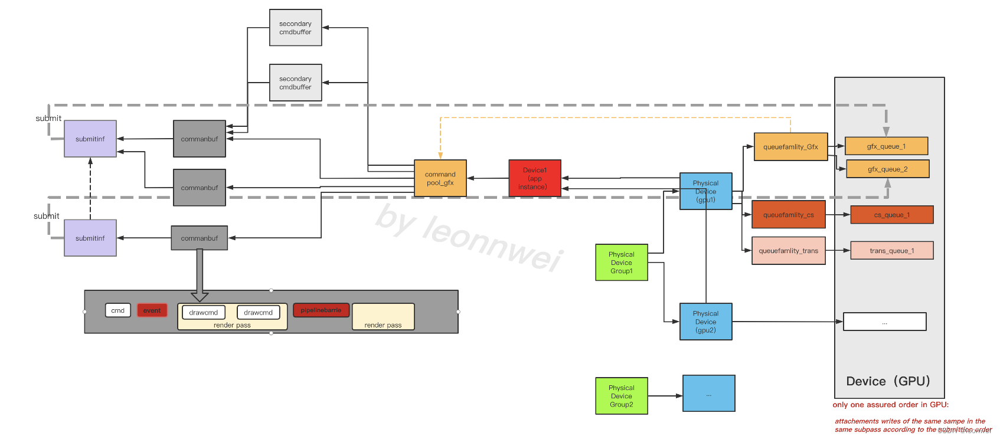

上图可以看到vk拥有多个physical device（或gpu，当然也可以是支持的其他处理器），只要是同一个physical device group中的physical device，就可以联合起来一起来创建出一个device（就是你的app 实例），而每个physical device上又有多个queue，这些queue属于三种queuefamily（gfx，cs，translate），每个queuefamily Qn都可以创建一个command pool Pn，每个Pn又可以创建一些cmdbuffer，这些cmdbuffer可以独自被处理，独自被提交给Qn的任意一个queue上。cmdbuffer是vk显示暴露的数据结构，它是cpu同gpu传输信息的桥梁，cpu将渲染指令记录到cmdbuffer上，然后通过提交给queue交由gpu执行。在一个cmdbuffer内部又包含了renderpass，指令被记录在renderpass里面或外面，记录在renderpass里面的指令还可以被封装成次级cmdbuffer，即secondarycmdbuffer的形式被主cmdbuffer执行。。。

总的来说，vulkan里面有并行的GPU设备，并行的queue，并行的cmdbuffer。

那么哪些阶段可以被并行执行？

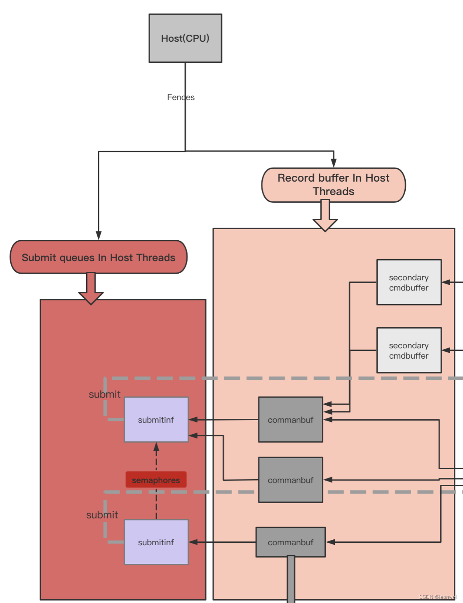

Cpu一侧有两个主要的可被并行处理的阶段：

1 Cmdbuffer的Record：所有vkcmd***类型的API都可以认为在进行cmdbuffer的record。我们可以拆解出多个独立的cmdbuffer，由不同的RHI线程进行api调用。（这其实是一般游戏的主要瓶颈，即drawcall数量瓶颈）
2 Cmdbuffer的submit：不同的cmdbuffer可以被提交到各自单独的queue中。可以根据设备提供的queue的数量，创建多个queue，在不同的rhi线程中将不同的cmdbuffer submit到不同的queue。（在实际项目中submit占用的时间非常短，少于1ms，且多数情况一帧只需要提交1次，做这个优化性价比不高）
3 将cmdbuffer的record和submit并行，submit和record两个步骤又可以在不同线程执行，cmdbuffer在当前帧record，在下一帧submit。（同样因为submit不是瓶颈，且又需要延迟一帧渲染，性价比不高）
4 为Translate，Gfx，CS独立各自单独的queue和cmdbuffer，这样，图形drawcall，cs的dispatch，图形资源的准备这三种不同工作将在不同的线程上处理，减少drawcall被其他工作block的机会。（这个是有意义的，ue新版本有async compute shader，实际上就是使用了同gfx不同的cs queue，至于translate，则可以将很多非dc性质的api调用同dc的分离，提高dc的吞吐效率，这个在gles也可以模拟实现，可以见https://km.woa.com/group/24861/articles/show/489959，只不过vk下可以往一个单独的queue去提交。）

本文主要讨论cmdbuffer的并行record，他用来解决大量drawcall的api瓶颈。
结构如下，我们在多个线程调用api填充cmdbuffer，全部cmdbuffer准备好后从一个线程进行最终的submit。

 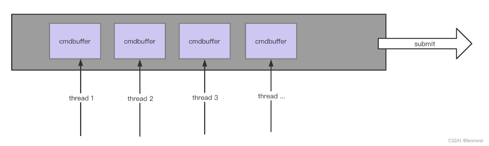

关于并行粒度
讨论这个问题前我们需要了解vulkan API的一些设计限制。Vulkan有如下的API规范：

一个renderpass必须被包含在同一个cmdbuffer中 （即renderpass不能跨越cmdbuffer）

这意味着我们不能将一个renderpass中的drawcall拆分到多个cmdbuffer中，而移动端游戏为了带宽的最小化，都是尽量减少合并renderpass的，既然这样是不是意味着在控制带宽（renderpass数量）和并行drawcall之间难以兼得？

不是的，vulkan考虑了这个问题，并引入secondarycommandbuffer的概念来解决这个问题，下面会详细讲述。

我们的设计支持两种类型的并行。

1 整个pass级别的并行（本文称为Async Pass）
每个cmdbuffer里面封装1个或几个renderpass，renderpass完整的嵌入在一个cmdbuffer里面。如下图，每个thread上的cmdbuffer上有完整的renderpass，每个renderpass并行的调用API。因为renderpass之间相互隔离，它的实现最为简单，每个thread上就是正常的启动，结束一个pass和drawcall。

 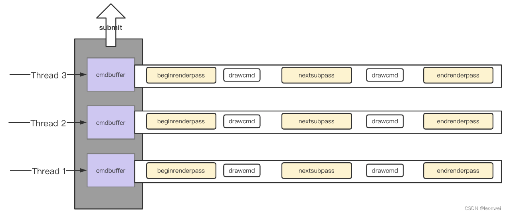

但是当一个renderpass里面的drawcall太多时，我们就必须实现drawcall级别的并行了。

2 支持draw call级别的并行（本文称为Async Drawcall）

正如前面提到的vulkan API限制renderpass不能跨越cmdbuffer，所以需要依靠secondary command buffer支持。

Secondary command buffer是中特殊的command buffer：

它内部不能执行renderpass相关的操作，只能执行drawcall相关的API。
它不能直接submmit给queue，只能被正常的command buffer（或称为primary command buffer）通过vkexecutecmdbuffer的形式执行
Vkexecutecmdbuffer必须在该primary commandbuffer结束记录状态前（vkendcommandbuffer）执行
这种级别的并行实现上就显得比较复杂，如下图，对thread1上的renderpass中的300个drawcall进行等分拆分到3个线程上。1.1-1.3的线程上都使用的secondary cmd buffer，他们填充好后，交给1线程的primary cmdbuffer execute，最后1线程才能执行endcmdbuffer。

但是这是不是说1线程要依赖1.1-1.3三个线程执行完才能继续下去？为了解决这个问题，可以在1线程上创建多个primary cmdbuffer，只有内嵌了secondary cmd buffer的那个primary cmdbuffer才需要等待，每当1线程上的一个primary cmd buffer (n)需要内嵌secondary cmd buffer时，就再重新开辟一个新的primary cmd buffer (n+1)即可，这样1线程上后续的dc在primary cmd buffer (n+1)上记录，primary cmd buffer (n)则负责等待它的所有secondary thread完成再end，我们最终在提交的时候只要保证在提交列表中primary cmd buffer (n)在primary cmd buffer (n+1)之前即可保证渲染顺序。

 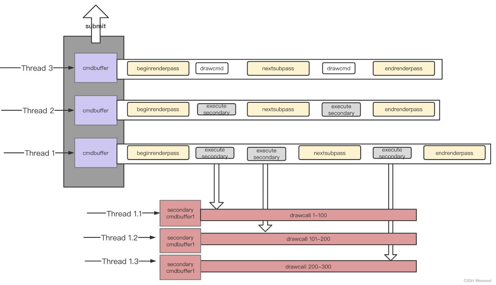

基于secondary cmdbuffer，可以将drawcall的并行拆到最细，理论上所有的drawcall都可以并行，只需要在最终submit之前保证所有thread的工作完成即可。

2 UE4现有的多线程渲染框架与改造目标
现有的UE4多线程渲染框架
逻辑，渲染指令生成和API调用三大任务分开

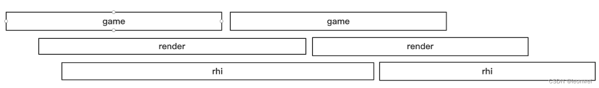

项目引擎之前在UE4现有版本加入了auxiliary rhi机制
将资源生成类型的任务放到一个单独的rhi线程，允许与小核，减少资源准备类api对drawcall 类api的block

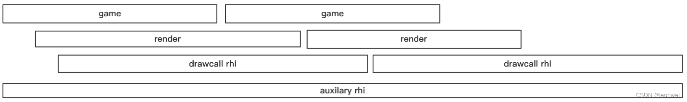

现在新的目标是，在vulkan下将drawcall类API并行处理：
依然保留主rhi（main rhi thread），用来进行那些不适合拆分到子线程的api以及做最终的submit和present。
对于相对独立，无法前后复用的pass，做并行的async render pass处理
对于其他pass，如果体量较大，将其中的部分分拆出来做async draw call 处理
为了能够异步的填充rhi command，每个rhi thread也要对应一个单独的render thread，即render thread 本身也被拆开并行

移动端对于线程数目的考量：
我们常说对于移动端不要肆意的使用多线程优化，因为最好的android设备也就4个大核，所以前面我们描绘的架构虽然可以让你拥有无限多的线程，任意分拆drawcall，但那是脱离实际的完美情况。

因为考虑到已经存在的game，main render，main rhi3个大线程，所以最终我们手机上实际上只会增多一个异步的rhi线程（本文称task rhi thread）和一个异步的render 线程（本文称task render thread），更多的异步线程数量测试上都会导致效率变差。也就是说我们其实只是给原有单链条的渲染API增加了一条新路，变成两条而已。

最终版本移动端的vulkan多线程渲染框架如下

 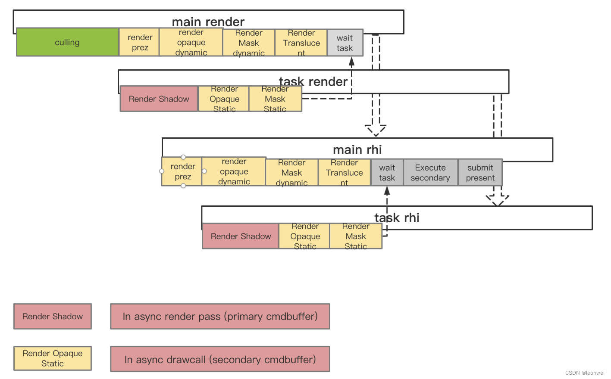

在上图中，实时的csm shadow作为async pass放在了task上（因为他永远是单独的pass，是的因为drawcall变的廉价，甚至可以尝试不用csm shadow cache～），而static mesh部分因为原本就有可能同其他部分共用pass而被作为async drawcall放在task上。

 

3 render thread 和rhi thread改造的更多细节
vk的secondary command buffer相关机制支持：
secondary command buffer的创建：和primary 不一样，创建时需要一个特殊的flag，需要为它维护一个单独的cmdbuffer pool

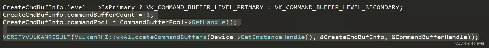

secondary command buffer的begin，这里涉及到vulkan的如下设计规范：
      

secondary cmdbuffer在begin的时候就要传入它所被嵌入的renderpass

和primary cmdbuffer不一样的是，secondary cmd buffer在begin的时候需要指定它所在的renderpass，这意味着虽然primary和secondary是在各自独立的线程记录，但是renderpass这个信息是api record的时候唯一必备的外部信息（事实上文档上说如果能提供primary的framebuffer则更有利于优化，不提供也可），而在目前ue的框架下，renderpass是有可能在primary的cmd beginrenderpass时才创建的，所以secondary cmd buffer的执行至少要在primary command buffer的begin pass 执行之后执行，这是一个同步点。但是如果我们有了rendergraph之类的，能够在一帧开始前就先验的知道这帧要用到的所有renderpass，这里面就不需要这个等待了。

此外Secondary command buffer begin的时候还需要设置begin flag为renderpass_continue_bit,(表示它作为一个secondary buffer，完全在另一个cmdbuffer的pass内执行

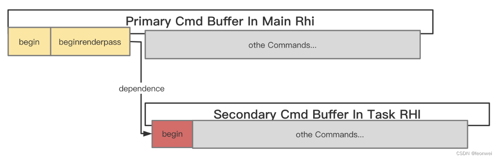

secondary command buffer内部的渲染状态，这里涉及到vulkan的如下设计规范：
secondary cmdbuffer内部不能感知包含它的primarycmdbuffer的渲染状态

vulkan并没有在官方文档很明显的地方提到这个问题，只在一些角落暗示过，实际上它意味着你在primary cmdbuffer级别里面设置的各种渲染状态，如shader，stencil什么的，对于它里面包含的secondary cmdbuffer是无效的，你必须在secondary cmdbuffer里面重新设置过。

  这要求你在record一个secondary cmd buffer的时候要能在程序中获取到它所处的primary 的一些外部渲染环境，设置进去，在程序实现的时候这可能是要特别小心的。

需要灵活支持一个 renderpass是subpass_content_secondary还是subpass_content_inline状态，这是非常麻烦的一个改造。这里又涉及到vulkan的一个设计规范：
Vulkan的renderpass在一个subpass之内只能处于以下两种模式之一：要么里面完全只能执行secondary cmdbuffer（所有非vkexecutesecondary的api皆为非法），要么里面完全不能执行secondary cmd buffer。

看下面的这个图，第一种情况是ok的，subpass之内都是统一的内容状态，但是第二种是不行的，因为它杂糅了普通drawcall和secondaryexecute 

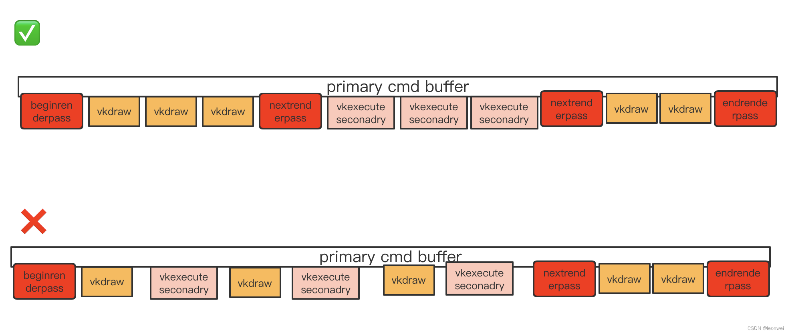

这是非常麻烦的一个点，为什么这样说？

通常我们移动端游戏为了减少render pass的切换，需要尽量复用一个renderpass，而一个大的renderpass它可能只是部分drawcall需要被拆出来到task rhi上异步执行，那就不可避免的出现这种“杂糅”状况。

为了解决这种杂糅，一种是如上图第一种形式插入更多的nextsubpass，用subpass做篱笆将不同种类分开，但是这是有损gpu性能的，我们不能确定硬件在切subpass的时候对于相同的rt情况下是否有优化，有可能将产生rt内容的load/store。另一种是如下图所示，只要一个renderpass中有任何一个drawcall被拆出来放到taskrhi上，那么整个renderpass的所有drawcall都需要被拆成secondary cmd buffer的形式在，只是说有个secondary cmd buffer在task上异步填充，有的依然在当前primary的main rhi上填充。

 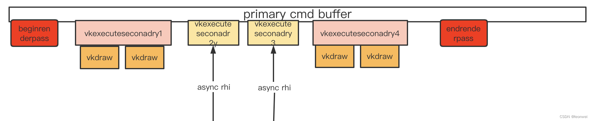

从上面这个图能够看出来，pass内部全都是vkexecutesecondary了，注意这里不意味着secondary4 要等待异步线程吧secondary 2和3处理完，他们依然是并行的，你只需要记住在4前面还有个2和3，只需要在最终submmit的之前end这个pass，在endpass的时候按照1 2 3 4的顺序执行这个execute就可以的。

带有async drawcall的renderpass的end

对于内嵌了secondary的renderpass在end的时候有个新的问题，因为executesecondary必须要发生在endpass之前，而mainrhi想endpass的时候task rhi可能还没有执行完，这会导致asyn rhi对main rhi的阻塞，因为main rhi还有后续的renderpass要begin。

一种解决方案是，此时重新begin一个新的primary cmd buffer，用于begin后续的renderpass，而之前的那个primary cmd buffer会等待它的secondary都执行完。这意味着我们的设计思路是：所有的renderpass都会延迟到最终submmit之前才进行帧的endpass（endpass前要按顺序execute secondary），每当一个renderpass被要求endpass的时候，如果他内含secondary，就马上启动一个新的的primary cmd buffer记录后续renderpass。

 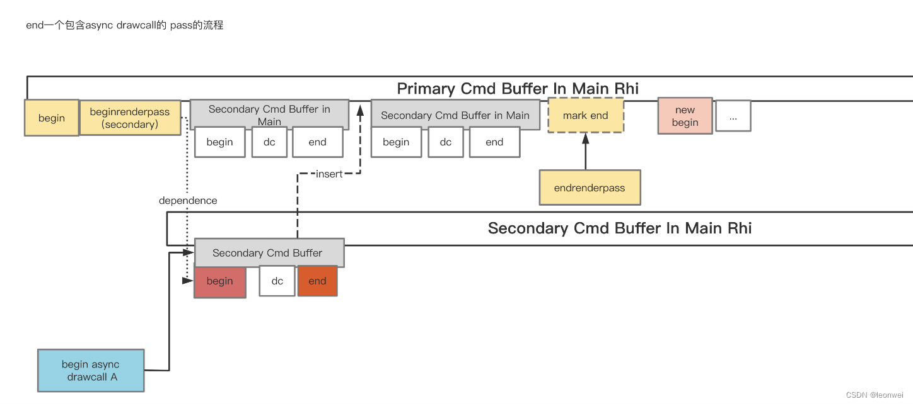

如上面图所示endpass只是加了一个mark，后面会开启新的primary cmd buffer，我们知道一次submit的时候可以submit多个primay cmd buffer，你只需要保证他们在submitinfo中的列表顺序就能保证他们的渲染顺序。

这样原本ue4中submmit的一个单一的primary cmd buffer可能被碎解成多个，因此vkcmdbuffer的结构也需要做些改造，里面增加了previous cmd buffer的数组，此外因为primary cmdbuffer还可能包含一些secondary cmd buffer，所以还增加了一个children 数组。

改造后的结构是如下：

 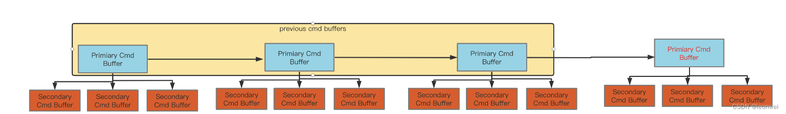

Primary Cmd buffer的Submmit提交，提交是最终的一步操作，也是整个结构唯一需要同步等待所有线程工作完成的地方，在main rhi上对于每个primary cmd buffer，依次调用vkexecutecmdbuffer执行它的每个secondary cmd buffer（这个执行顺序很重要，它就是gpu的处理顺序），再执行相应的nextsubpass，endpass，endcmdbuffer这操作，当然primary cmdbuffer要按照渲染顺序放入submitinfo中。
Thread-safe
首先考虑到任何renderthread上的逻辑都有可能被在异步执行，所以一些不thread-safe的渲染线程代码都要改造，例如去掉一些单例的使用。

Task render和main Render 之间的关系
在每帧render结束前，main render会等待task render执行完毕，所以要合适的分配main 和task的任务，尽量让main的工作量稍多一些。

4 其他问题
负载均衡
我们需要很好的平衡main 和task 两个渲染线程间的任务量，让main的任务稍多与task一点点，最好的方式是基于frame graph预先知道当前帧需要绘制哪些东西，才能做到最佳的负载均衡

GPU负载同HSR失效

我们发现在一些Adreno设备上，当使用secondary command buffer进行多线程提交时，gpu时间会大大增长，很像是硬件的深度筛选（即adreno的LRZ技术）失效，导致了更多的overdraw。

通过翻阅官方文档，确实找到了官方的说法，在文档https://blogs.igalia.com/dpiliaiev/adreno-lrz/和https://developer.qualcomm.com/sites/default/files/docs/adreno-gpu/developer-guide/gpu/overview.html#lrz中都有明确提到：

 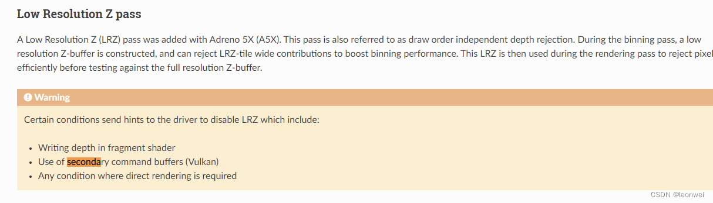

在sdp 855及以下的设备上，因为lrz机制基于的ztest方向跟踪是在cpu一侧做的，并行的api提交会让他紊乱，这样会导致lrz失效，进而gpu不能准确找到每个pixel最靠前的primitive进行渲染，出现更多的overdraw。而865以后因为在gpu上进行跟踪，所以解决了这个问题。但是我们的实际测试数据发现一些865 870的设备依然存在这个问题，保险起见，secondary cmd buffer只能运行在888及以上的设备上，这真的是一个令人悲伤的事情，说明硬件的发展还没有很好的为vulkan做好优化啊。

但是好消息是mali的所有设备不存在这个问题！～～

5 性能分析

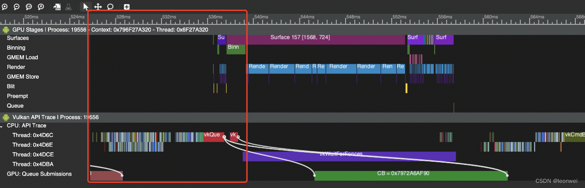

从android的trace上可以看到有两条并行提交的队列，相比只有一条提交队列，总的渲染的cpu耗时被大大缩减，在我们项目中大部分情况下rhi线程的时间被缩短30%左右，有意思的一点是在大部分设备上，gpu的耗时也略微减少，目前还不能很好的解释。

6.结语
Vulkan作为现代的图形API，有着更加强大复杂的特性，同gles相比，更像是C++对比lua，它可以使我们从更底层的视角去看待图形编程，自己掌握多线程，内存分配，同步等，我们就不能像应用古老的gles一样去搭建渲染框架，那样就只是用着vulkan的皮囊而没有发挥它真正的威力，不过这对编程人员是没有那么友好的，且移动端的前人经验不多，就需要深入分析vulkan的文档，多尝试，另外vulkan作为一个追求性能的api，不太在api层次做校验，这导致对api的调用极易引起gpu的device lost，必须擅用它的validation layer及时发现潜在的问题。