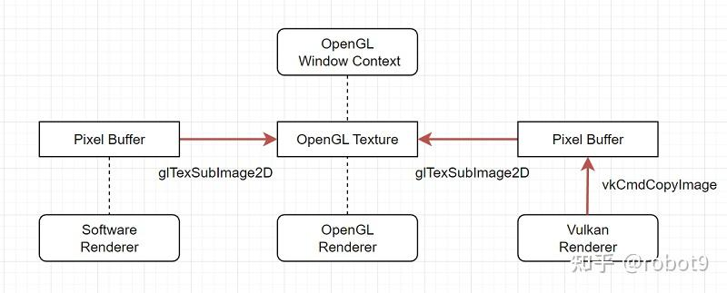
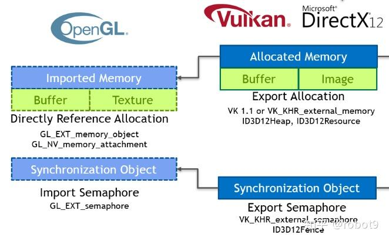
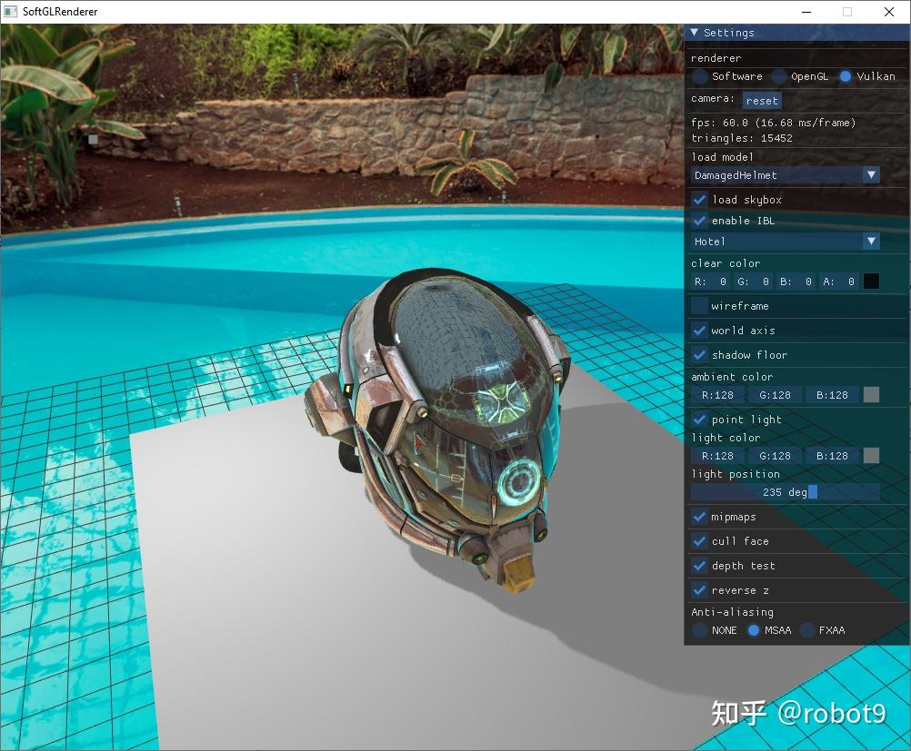

# Vulkan & OpenGL 纹理共享与同步

前段时间给之前写的[软件渲染器](https://www.zhihu.com/question/24786878/answer/2484332048)增加了 OpenGL 和 Vulkan 版本，用于对照渲染结果，并且希望能做到实时切换，即运行过程中切换不同的渲染器(Software/OpenGL/Vulkan)，项目的窗口渲染上屏是使用 OpenGL 实现，整体的结构大致如下图：





软件渲染器的结果(pixel buffer)在 CPU 端，通过 `glTexSubImage2D` 上传到 OpenGL 纹理，OpenGL 渲染器则是直接将 Color Attachment 作为纹理，不需要额外操作，而 Vulkan 渲染器则先通过 `vkCmdCopyImage` 将渲染结果 copy 到一个 host visible 的 vkImage，然后 map 到 CPU 端的 [pixel buffer](https://zhida.zhihu.com/search?content_id=226109146&content_type=Article&match_order=2&q=pixel+buffer&zhida_source=entity)，再通过 `glTexSubImage2D` 上传，如图中的红色箭头都是耗时操作，那么既然 Vulkan 纹理数据本身就在 GPU 端，有没有办法不饶回 CPU 端，而是直接提交给 OpenGL 呢？或者 Vulkan 与 OpenGL 双方共享同一份纹理数据，一边读一边写？

答案是肯定的，目前可以通过扩展来实现 Vulkan 与 OpenGL 的纹理共享，这里参考 [gl_vk_simple_interop](https://link.zhihu.com/?target=https%3A//github.com/nvpro-samples/gl_vk_simple_interop) 来实现，主要分为纹理共享和同步两部分:





## 纹理共享

纹理共享主要通过这两个扩展来实现：

- Vulkan [VK_KHR_external_memory](https://link.zhihu.com/?target=https%3A//registry.khronos.org/vulkan/specs/1.3-extensions/man/html/VK_KHR_external_memory.html)
- OpenGL [GL_EXT_memory_object](https://link.zhihu.com/?target=https%3A//registry.khronos.org/OpenGL/extensions/EXT/EXT_external_objects.txt)

首先我们定义数据结构：

```cpp
struct SharedMemory {
  Handle handle = INVALID_HANDLE_VALUE;
  VkDeviceSize allocationSize = 0;
  VkDeviceMemory vkRef = VK_NULL_HANDLE;
  GLuint glRef = 0;
  GLuint glAttachedTexture = 0;
};
```

其中 handle 是两个 Context 间用于共享的数据结构，如 Windows 的 HANDLE 或者 Posix 的 FD，接下来在 Vulkan 中创建纹理(vkImage & vkMemory)的时候添加扩展支持：

```cpp
// create vkImage
VkExternalMemoryImageCreateInfo extMemoryImageCreateInfo{};
extMemoryImageCreateInfo.sType = VK_STRUCTURE_TYPE_EXTERNAL_MEMORY_IMAGE_CREATE_INFO;
extMemoryImageCreateInfo.handleTypes = VK_EXTERNAL_MEMORY_HANDLE_TYPE;

VkImageCreateInfo imageInfo{};
imageInfo.sType = VK_STRUCTURE_TYPE_IMAGE_CREATE_INFO;
imageInfo.pNext = &extMemoryImageCreateInfo;

// create vkMemory
VkExportMemoryAllocateInfo exportMemoryAllocateInfo{};
exportMemoryAllocateInfo.sType = VK_STRUCTURE_TYPE_EXPORT_MEMORY_ALLOCATE_INFO;
exportMemoryAllocateInfo.handleTypes = VK_EXTERNAL_MEMORY_HANDLE_TYPE;

VkMemoryAllocateInfo memAllocInfo{};
memAllocInfo.sType = VK_STRUCTURE_TYPE_MEMORY_ALLOCATE_INFO;
memAllocInfo.pNext = &exportMemoryAllocateInfo;
```

可以看到是通过 pNext 指针来添加扩展支持，接下来从创建好的 vkMemory 对象中获取共享用的 handle

```cpp
VkMemoryGetHandleInfo memoryGetInfo{};
memoryGetInfo.sType = VK_STRUCTURE_TYPE_MEMORY_GET_HANDLE_INFO;
memoryGetInfo.memory = memory;
memoryGetInfo.handleType = VK_EXTERNAL_MEMORY_HANDLE_TYPE;
VK_CHECK(vkGetMemoryHandle(device_, &memoryGetInfo, &sharedMemory_.handle));
```

拿到 handle 后，就可以给到 OpenGL 进行 Memory Object 的创建

```cpp
GL_CHECK(glCreateMemoryObjectsEXT(1, &sharedMemory_.glRef));
GL_CHECK(glImportMemory(sharedMemory_.glRef, sharedMemory_.allocationSize, GL_HANDLE_TYPE, sharedMemory_.handle));
```

最后，我们将 OpenGL 的 Memory Object 设置到 Texture

```cpp
GL_CHECK(glTextureStorageMem2DEXT(texture, levels, internalFormat, width, height, sharedMemory_.glRef, 0));
```

到此，我们就完成了纹理共享的全过程，当然共享的 Memory 除了用于纹理，也可以用于 Buffer 对象，不过本项目暂时没有用到，这里就不展开了。

## 同步

通过上面的 Memory 共享，Vulkan 和 OpenGL 两端的纹理实际上是同一份存储(显存)，如果一边读一边写，就需要有个同步机制来保证数据的一致性：

```text
  +------------+                             +------------+
  | GL Context | signal               wait   | GL Context |
  +------------+     |                  ^    +------------+
                     v  +-----------+   |                  
                   wait |Vk Context | signal               
                        +-----------+
```

正好，这了又有另一个扩展来实现：

- Vulkan [VK_KHR_external_semaphore](https://link.zhihu.com/?target=https%3A//registry.khronos.org/vulkan/specs/1.3-extensions/man/html/VK_KHR_external_semaphore.html)
- OpenGL [GL_EXT_semaphore](https://link.zhihu.com/?target=https%3A//registry.khronos.org/OpenGL/extensions/EXT/EXT_external_objects.txt)

整体逻辑和前面的纹理共享类似，首先定义数据结构：

```cpp
struct SharedSemaphore {
  Handle handle = INVALID_HANDLE_VALUE;
  VkSemaphore vkRef = VK_NULL_HANDLE;
  GLuint glRef = 0;
};
```

然后是 Vulkan 端创建 Semaphore，并获取 handle，再 OpenGL 端创建 Semaphore，并通过 handle import 过来：

```cpp
// create vulkan object
VkExportSemaphoreCreateInfo exportSemaphoreCreateInfo{};
exportSemaphoreCreateInfo.sType = VK_STRUCTURE_TYPE_EXPORT_SEMAPHORE_CREATE_INFO;
exportSemaphoreCreateInfo.handleTypes = VK_EXTERNAL_SEMAPHORE_HANDLE_TYPE;

VkSemaphoreCreateInfo semaphoreCreateInfo{};
semaphoreCreateInfo.sType = VK_STRUCTURE_TYPE_SEMAPHORE_CREATE_INFO;
semaphoreCreateInfo.pNext = &exportSemaphoreCreateInfo;

VK_CHECK(vkCreateSemaphore(device_, &semaphoreCreateInfo, nullptr, &glReady_.vkRef));
VK_CHECK(vkCreateSemaphore(device_, &semaphoreCreateInfo, nullptr, &glComplete_.vkRef));

VkSemaphoreGetHandleInfo semaphoreGetInfo{};
semaphoreGetInfo.sType = VK_STRUCTURE_TYPE_SEMAPHORE_GET_HANDLE_INFO;
semaphoreGetInfo.handleType = VK_EXTERNAL_SEMAPHORE_HANDLE_TYPE;

// get handle
semaphoreGetInfo.semaphore = glReady_.vkRef;
VK_CHECK(vkGetSemaphoreHandle(device_, &semaphoreGetInfo, &glReady_.handle));
semaphoreGetInfo.semaphore = glComplete_.vkRef;
VK_CHECK(vkGetSemaphoreHandle(device_, &semaphoreGetInfo, &glComplete_.handle));

// create opengl object
GL_CHECK(glGenSemaphoresEXT(1, &glReady_.glRef));
GL_CHECK(glImportSemaphore(glReady_.glRef, GL_HANDLE_TYPE, glReady_.handle));

GL_CHECK(glGenSemaphoresEXT(1, &glComplete_.glRef));
GL_CHECK(glImportSemaphore(glComplete_.glRef, GL_HANDLE_TYPE, glComplete_.handle));
```

然后 Vulkan 端的 Semaphore 还是标准用法，在 `vkQueueSubmit` 的时候设置 wait/signal，OpenGL 端 Semaphore 的使用如下：

```cpp
void waitGLReady() {
  GLenum srcLayout = GL_LAYOUT_COLOR_ATTACHMENT_EXT;
  GL_CHECK(glWaitSemaphoreEXT(glReady_.glRef, 0, nullptr, 1, &sharedMemory_.glAttachedTexture, &srcLayout));
}

void signalGLComplete() {
  GLenum dstLayout = GL_LAYOUT_SHADER_READ_ONLY_EXT;
  GL_CHECK(glSignalSemaphoreEXT(glComplete_.glRef, 0, nullptr, 1, &sharedMemory_.glAttachedTexture, &dstLayout));
  GL_CHECK(glFlush());
}
```

这里的 layout 可以根据实际需要进行选择，本项目是 Vulkan 端作为 Color Attachment 写，OpenGL 端作为 Sampler 读。

## 效果

经过这一番纹理共享改造，切换到 Vulkan 渲染器也能稳稳 60fps 了 (之前走 CPU 端的方式 < 50fps)




完整的代码详见 Github ：

[SoftGLRendergithub.com/keith2018/SoftGLRender](https://link.zhihu.com/?target=https%3A//github.com/keith2018/SoftGLRender)

实现逻辑主要在 [VKGLInterop](https://link.zhihu.com/?target=https%3A//github.com/keith2018/SoftGLRender/blob/master/src/Render/Vulkan/VKGLInterop.h) 这个类，欢迎 star ~