# 初探Vulkan

本文致力于帮助对比Vulkan和传统图形API之间的各方面差异，帮助大家识别现代图形API的优缺点所在。

## 什么是Vulkan？

Vulkan是Khronos在2016年的GDC上提出的新一代的图形API。它提供对现代 GPU 的更强的控制以及跨平台访问，这些现代GPU用于从PC和Console到手机等各种设备(Window/Linux/Android，在Apple上可以通过MoltenVk将Vulkan转译为Metal代码，也就是说Vulkan基本全平台通行)。然而Vulkan诞生的最重要的理由是性能，更具体的说是**优化驱动程序和应用程序渲染逻辑中的CPU侧负载。**

Vulkan是显式控制的API也就是说几乎所有的事情开发者都需要亲自负责，但是也提供更强的控制能力。驱动程序只用于接收API调用传递过来的指令和数据，并将它们进行转换成硬件可以理解的命令。但是在传统图形API(例如OpenGL)里驱动程序会跟踪大量对象的状态，自动管理内存和同步以及在程序运行时进行状态检查。这对开发人员非常友好，驱动开发表示负重前行。但是这种模式显然会消耗宝贵的[CPU性能](https://zhida.zhihu.com/search?content_id=211384031&content_type=Article&match_order=1&q=CPU性能&zhida_source=entity)。Vulkan解决这个问题的方案是将状态跟踪、同步和内存管理交给了开发者，同时将状态正确性检验交给各种不同的Layer(比如Synchronization Validation和Validation Layer)进行完成，而要想使用这些Layer必须手动启用。这些Layer在正常情况下不会在Vulkan正式版本中应用程序里运行，仅在Debug版本使用。

由于这些原因Vulkan难以使用并且在一定程度上很不稳定。需要做大量的前置工作来保证Vulkan运行正常(比如900行代码画一个三角形)，并且API的错误使用经常会导致渲染错乱甚至Crash，而在传统图形API里你通常会提前收到用于帮助解决问题的错误消息但代价是性能的损耗。但是Vulkan提供了对设备的更多控制能力、清晰的线程模型以及比传统图形API高得多的性能。

## Vulkan设计思想

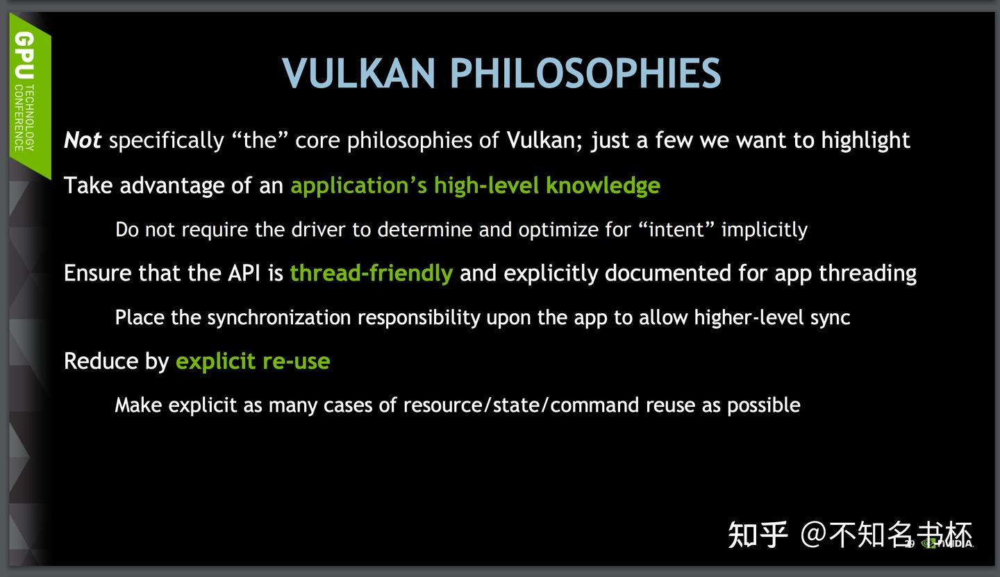

Vulkan的设计思想简单来说就是以下几点：

- **强调开发者自己控制一切**: Vulkan不会在驱动程序中做隐式的优化"意图"，反而是让开发者有更大空间去发挥。开发者可以自由的调度渲染流程和管理同步以及内存分配和释放。这些开发者都需要手动完成并且优化因为开发者本身就有这更上层的信息来判断怎么完成优化，而不是像传统图形API一样在驱动程序当中通过开发者调用API模式来揣测并且推断相关操作的[优化方法](https://zhida.zhihu.com/search?content_id=211384031&content_type=Article&match_order=1&q=优化方法&zhida_source=entity)。
- **多线程友好**: Vulkan是对多线程友好的图形API，利用好现在的普遍的多核CPU来避免传统图形API的单线程模型造成的CPU瓶颈问题。抛弃传统图形API中依赖绑定到基于单个线程上的Context概念。而现代图形API(Vulkan,Metal,Dx12)全部是通过Command Buffer来录制Command并通过Queue向GPU提交命令，可以多个线程同时提交录制好Command的Command Buffer，同时将同步丢给开发者自己处理，开发者拥有更高层次的信息以判断更好的同步时机。
- **强调复用，**在Vulkan中大多数组件都可以复用比如资源(Buffer或者Image)或者Command以及[描述符](https://zhida.zhihu.com/search?content_id=211384031&content_type=Article&match_order=1&q=描述符&zhida_source=entity)等等。

## Vulkan和传统图形API的对比

这有一张表是对于Vulkan和OpenGL ES的对比图，如下所示

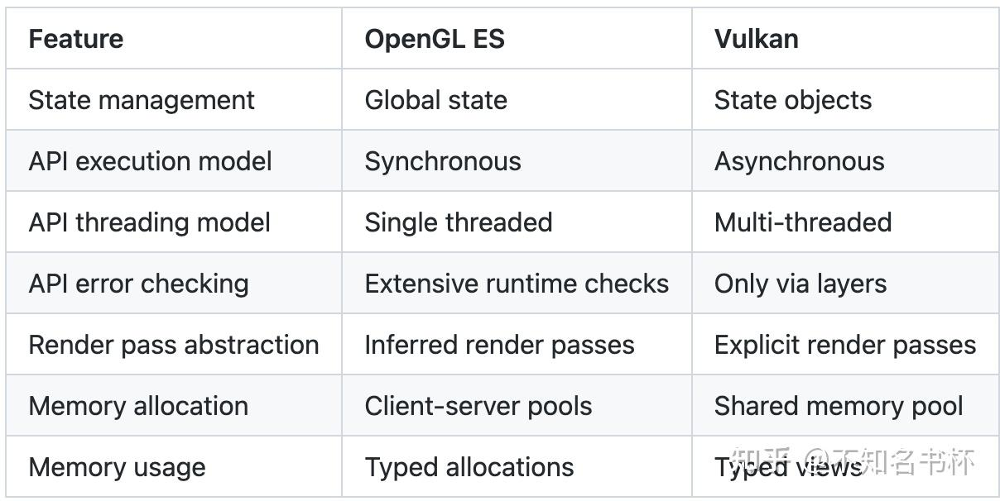

下面两张图也是很好的对比了Vulkan和OpenGL的差异，可以看出驱动程序在OpenGL和Vulkan的对比，Vulkan的驱动程序明显”薄”了不少。

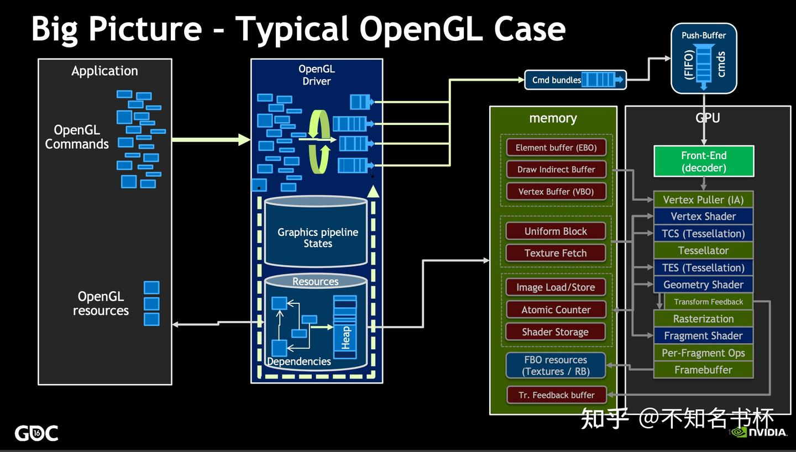

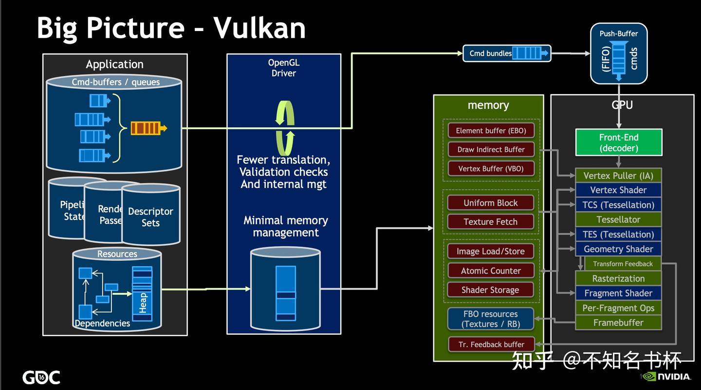

### State Management

传统图形API使用单一[全局状态](https://zhida.zhihu.com/search?content_id=211384031&content_type=Article&match_order=1&q=全局状态&zhida_source=entity)，而Vulkan则是使用基于对象的状态，可以从下面这两点提现出来。

### Descriptor

并且必须为每个DrawCall重新设置渲染状态以及资源绑定，所使用的[状态组合](https://zhida.zhihu.com/search?content_id=211384031&content_type=Article&match_order=1&q=状态组合&zhida_source=entity)只有在绘制时才知道，这意味着一些优化很难应用。并且还隐含一个问题，那就是当场景特别复杂的时候(几何多，材质复杂)。这个设置渲染状态以及资源绑定的过程所需要的时间也就不能忽略，但是场景复杂，大量几何，材质复杂等正是现代高质量渲染所必须面对的，如下所示。

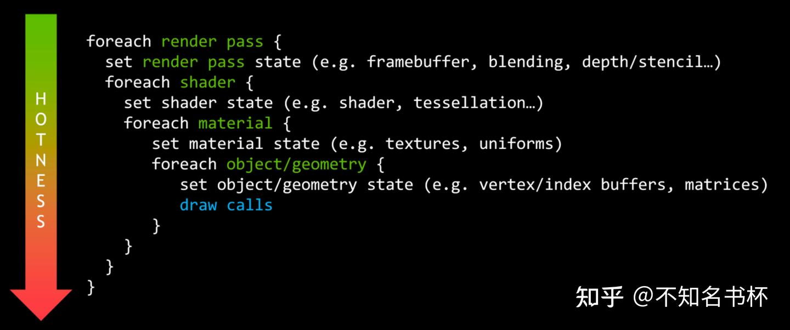

Vulkan使用描述符(Descriptor)方案来完成资源绑定，允许应用程序提前预打包已使用资源状态的组合。可以降低运行时成本主要是减少各种检验成本，显着降低了图形驱动程序的CPU开销。代价是要求预先确定它需要的状态以便构建状态对象并从减少的开销中受益。传统图形API将不得不在改变着色器时检查所有的资源绑定，而对哪些是被覆盖的，哪些是需要保留的，因为它没有足够信息可以用来判断并做出优化。

### Pipeline

Vulkan在这方面设计理念还可以在Pipeline创建当中体现。Pipeline包含了传统图形API中大部分的状态和属性。只不过Pipeline是需要事先创建好的，这样所有的状态组合的验证和编译都可以在创建Pipeline的时候完成，编译好后的Pipeline对象结合了所有相关状态，允许更可预测地应用基于Shader的优化，从而降低运行时成本。并且驱动程序只需要少量的切换开销即可将预先创建的Pipeline绑定到GPU中。运行时不会再因为这些操作有任何性能上的浪费。

这种提前构建的方式有着性能的优势但是不够灵活，可能只是需要修改一个属性却需要创建一个新的Pipeline。但是Vulkan也为Pipeline 提供了一些Dynamic State，这些状态仍然可以被动态改变，无需付出重新创建Pipeline的成本。这也为Pipeline提供了一定的灵活性。

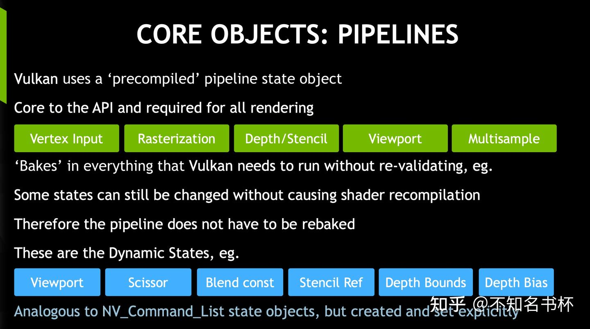

### 使用方式不同

状态管理的不同会造成API使用方式的不同，在之前OpenGL的使用中都是全局状态，每一次的API调用你都需要知道将要设置的OpenGL状态，所有的状态都由OpenGL的VM进行管理，因此在使用OpenGL时需要时刻将VM的状态熟记于心。不然很容易出错但是可以不考虑底层硬件的设计或复杂性。但是在Vulkan中是通过Pipeline来完成，但是Pipeline的创建需要相当繁琐的参数设置，而且你都得理解这些参数的意义。从使用方式来看很难说哪种更好。

### API execution model

对于之前传统图形API(比如OpenGL)，OpenGL是一种同步(Synchronous)模型去执行的，这意味着 API 调用必须表现得好像所有先前的API调用都已被处理。实际上没有任何GPU是以[同步模型](https://zhida.zhihu.com/search?content_id=211384031&content_type=Article&match_order=1&q=同步模型&zhida_source=entity)的方式去执行Command而是全部都是异步执行的。同步模型是由驱动程序维护的精心制作的假象，厚重的驱动程序在为你负重前行。为了保持这种错觉，驱动程序必须跟踪Queue中的每个渲染Command读取或写入了哪些资源确保所有Command以合法顺序运行以避免渲染结果错乱，并确保需要数据资源的API调用被阻塞并等待资源是安全可用才可继续运行。

那么这种同步模型带来了什么问题呢？第一是某些耗时的操作触发时机并不稳定并且全部由驱动来确定，比如当切换了一个Pipeline时触发一个耗时的Shader编译操作或者加载资源等等，这些操作什么时候会去做，是不是已经做完了？这些对于开发者来说都一无所知并且全部由驱动决定。简单来说就是开发者无法精细的控制当前渲染过程中的所有状态，虽然每个图形API提供了获取当前状态接口，但几乎所有的官方文档中都建议不要频繁调用这些接口以避免由于获取状态导致额外的调用开销。可能造成的结果就是CPU卡顿，但是却不知道卡顿是发生在什么时候，可能会发现切换一个Pipeline或者是加载一个资源卡顿就出现了。并且由于每个厂商的GPU处理这些工作的方式都不一样，在不同的GPU上可能会有不同的表现，想专门优化的话都会被这些拦路虎(黑盒)拦住而无从下手。

Vulkan使用异步(ASynchronous)渲染模型，首先是符合GPU的工作方式的。Vulkan通过Command Buffer来Record Commmand之后就塞入Queue，使用显式调度依赖关系来控制渲染任务执行顺序以及CPU和GPU之间的同步以及依赖关系管理等，通过精心调控的同步可以提高渲染Command执行的整体并行度。 减少Pipeline的气泡并提高整体性能。并且结合了之前的关于提前创建Pipeline对象以并绑定。在渲染时可以切换不同的Pipeline而只需要很小的开销而无需像传统 API 那样校验Pipeline状态有效性以及动态合并一些状态，从而降低了Draw Call开销，并且可以大幅增加每帧可以调用的DrawCall上限。

这些更改的影响是显着降低了图形驱动程序的CPU开销，但代价是要求程序员自己管理Command之间的执行依赖和内存依赖来保证渲染结果的正确，加重了开发者的心智负担。

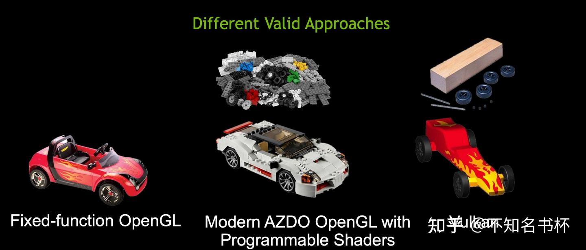

这一张图更加能够体现OpenGL和AZDO(Approaching Zero Driver Overhead) OpenGL以及Vulkan的区别和特点。OpenGL就像一个预先已经组装好的玩具车，开箱即用，没有太多定制的空间。到了AZDO OpenGL就像一个乐高一样。你可以自由的去建造并且配有大量有用的预制件。Vulkan只有最基础的配件，你必须自己先雕刻成你想要的样子，自由度相当的高。

这很符合上面说的说的内容，在OpenGL中驱动程序帮助我们做了很多的东西，但同时也带来了很多限制。虽然对于十分的易用，但是没有定制的空间。而Vulkan是将之前OpenGL在驱动程序中做的那些操作，更多的开放给开发者自己来管理。包括内存管理以及CPU和GPU之间的同步管理等等。这给了开发者极大的定制空间，并且解放驱动程序CPU侧的开销性能更好。

### API threading model

传统的图形API对多线程并不友好，并且传统图形API都包含一个Context概念。Context包括当前Pipeline中的所有状态包括Shader以及Render Target等。在OpenGL中Context和单一线程是绑定的所有需要作用于Context的操作例如改变渲染状态/绑定Shader/调用Draw Call等都只能在单一线程上进行。如下所示可以看到只有一个线程在完成CPU侧的渲染前的处理(渲染状态设置，状态绑定，DrawCall提交等等)，其他的线程都在看戏(类似Window11的大小核调度，一核有难，八方围观)，这造成了渲染中的CPU侧的瓶颈以及GPU占用率低下的问题。

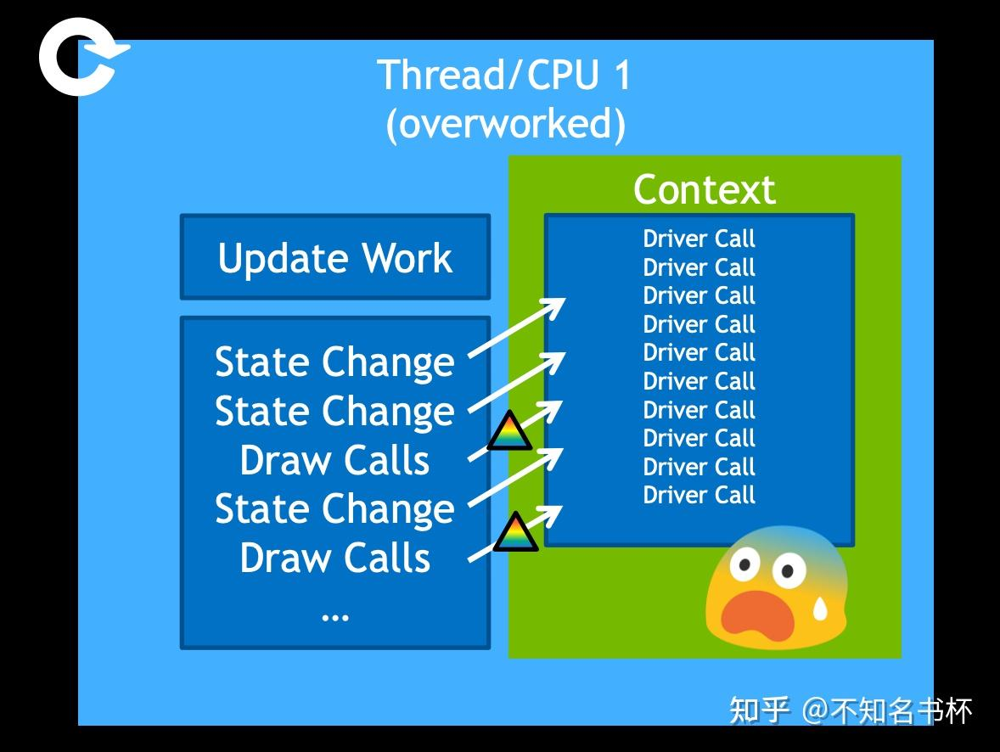

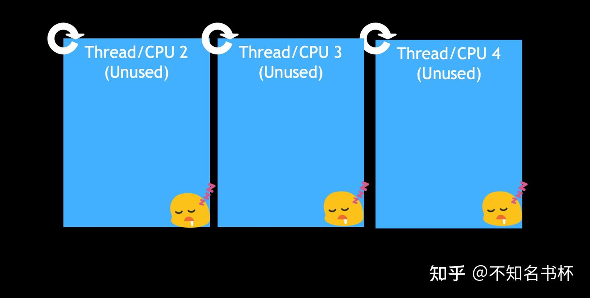

但是现在[多核系统](https://zhida.zhihu.com/search?content_id=211384031&content_type=Article&match_order=1&q=多核系统&zhida_source=entity)可谓是相当的普遍。但是传统图形API却不能利用这多核资源。当发现是主要是CPU瓶颈的时候，通过CPU多线程应该可以很好的解决性能瓶颈问题。所以Vulkan的设计理念首先就是对于多线程友好，充分发挥多线程的优势以减少CPU侧的压力并且可以充分压榨GPU的性能(狠狠压榨GPU，塞满他！！)，于是设计出了Command Buffer概念并且抛弃了Context以及渲染线程等概念。在Vulkan中必须开发者自己管理Command Buffer并且每个线程都可以通过Command Buffer来完成Record Command操作(也就是多线程录制)，并以适当的粒度提交执行给Queue中让GPU开始执行以避免浪费GPU的性能，如下图所示。但是单线程的Vulkan渲染器的速度仍然可以明显快于传统图形API(但主要需要精细的内存管理以及同步做到的)，但通过利用系统中的许多核心进行Record Coomand，可以获得峰值效率和最小延迟。

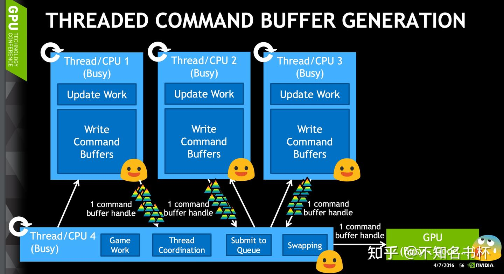

尤其是在复杂场景的情况下，这也是Vulkan相比传统图形API最能体现性能提高的情况。那就是并行的在不同线程上生成场景不同部分的Command Buffer，不用任何线程间的Synchronization。最后不同的线程可以将Command Buffer的传给主线程然后由主线程将它们提交给Queue，也可以直接写入子线程中的直接提交给Queue。这样的模式达到了计算资源利用的最大化，多个[CPU核](https://zhida.zhihu.com/search?content_id=211384031&content_type=Article&match_order=1&q=CPU核&zhida_source=entity)都参与了场景的渲染，并且有大量的渲染任务同时递交给GPU最大化了GPU的吞吐量。

### API error checking

传统图形API为了体现易用性的设计哲学，在驱动程序中往往都带有非常复杂的逻辑，但是进行运行时的校验也是驱动来保证的以保证渲染正确。同时为了便于调试，图形 API 的获取错误接口(glGetError)也需要正确的返回错误，但也增加了 CPU 开销。许多错误是由编程错误导致的，但是这些错误只会在开发过程中发生并且在运行时无法有效处理，但运行时检查仍然必须进行，这增加了所有应用程序的驱动程序开销。

Vulkan 是围绕最小化驱动开销的理念设计的，这一目标的表现之一就是API中默认的错误检查非常有限。即使是将参数设置为不正确的值或将空指针传递给所需的参数这样简单的错误通常也不会被明确处理而会导致崩溃或[未定义行为](https://zhida.zhihu.com/search?content_id=211384031&content_type=Article&match_order=1&q=未定义行为&zhida_source=entity)。因为Vulkan要求你对你所做的一切都要非常明确的控制。然而这并不意味着这些错误检查不能被添加到API中。Vulkan 提供了一个框架允许在应用程序和本机 Vulkan 驱动程序之间插入Validation Layers。Validation Layers可以实现错误检查和其他调试功能，并且具有可以在不需要时将其删除的主要优点。 这些更改的影响是减少驱动程序 CPU 负载但代价是使许多错误无法检测到除非使用Validation layers。

### RenderPass abstraction

传统图形API大都没有RenderPass的概念，因此驱动程序必须在运行中推断出哪些渲染命令构成一个单独的RenderPass。该任务需要一些处理时间并且依赖于可能不准确的[启发式方法](https://zhida.zhihu.com/search?content_id=211384031&content_type=Article&match_order=1&q=启发式方法&zhida_source=entity)。

Vulkan是围绕RendPass概念构建的，旨在让应用程序将一帧的高层结构传递给驱动程序更加明确渲染执行的步骤。并且Tile Base架构的GPU驱动程序可以使用这些信息来确定何时将数据进入或者离开On-Chip内存并且判断是否需要将数据放置到内存或者是丢弃Tile内的全部内容，甚至做一些其他事情比如用于binding大小的内存分配和其他内部操作。

### Memory allocation

传统图形API(比如OpenGL)使用Client-Server内存模型。该模型明确划分了可在客户端(CPU)和服务器(GPU)上可以访问的资源，并提供了在两者之间移动数据的函数。这有两个主要的副作用：首先开发者不能直接分配或管理GPU侧资源的内存。驱动程序将使用内部的内存分配器单独管理所有的GPU资源，并且驱动程序不知道任何可以利用来降低内存成本的上层信息。其次在CPU和GPU之间同步是有代价的，特别是在API的同步渲染模型和GPU异步处理现实之间存在冲突的情况下。

Vulkan是为现代GPU设计的，并假定CPU和GPU可见的内存设备之间存在某种程度的硬件支持的内存一致性。这使得API能够让应用程序更直接地控制内存资源比如分配/更新数据。对内存一致性的支持允许Buffer在应用[地址空间](https://zhida.zhihu.com/search?content_id=211384031&content_type=Article&match_order=1&q=地址空间&zhida_source=entity)中保持持久的映射，避免了传统图形API为注入手动一致性操作而需要的[连续映射](https://zhida.zhihu.com/search?content_id=211384031&content_type=Article&match_order=1&q=连续映射&zhida_source=entity)-解映射周期。这些更改的影响是减少驱动程序的CPU开销并让开发者更好地控制内存管理。并且可以进一步减少CPU负载，例如通过将具有相同生命周期的对象分组到一个分配中并跟踪它，而不是单独跟踪它们。

根据Vulkan的设计思想。当然对于内存管理这块Vulkan会把这部分的控制权交由开发者，让开发者自己来管理。更加依赖于程序员自身的资源理解，来做到更好的优化。所有的内存的分配和释放控制权全部在开发者。这些变化的影响是降低了驱动程序的CPU负载，使开发者对内存管理有更多的控制。应可以进一步减少CPU负载，例如将具有相同生命周期的对象分组到一个分配中并进行跟踪，而不是单独跟踪它们。

Vulkan甚至允许将一个Buffer内的不同区域划分给格式或者用途不同的子Buffer，例如Index/Vertex Buffer可以共享同一个Buffer，只要在绑定的时候指定不同的offset即可。这也是最优的做法，它既减少了内存分配的次数也减少了Buffer绑定次数。这种做法也符合了Vulkan关于资源复用的设计思想。如下图所示：

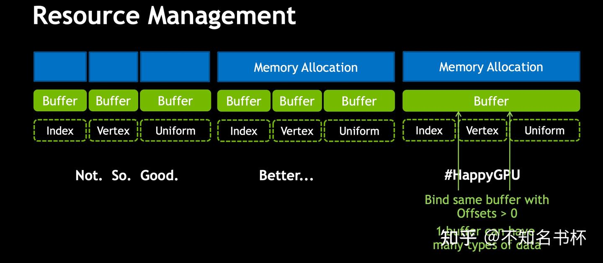

至于如何组合这些资源和对应的布局，那就是需要开发者自己去处理并且找到最好的数据/资源布局以及相应的更新/绑定频率。不需要像传统图形API那种在驱动中的启发式优化。开发者自身也最清楚这些数据/资源的更新频率。永远都能比[驱动分析](https://zhida.zhihu.com/search?content_id=211384031&content_type=Article&match_order=1&q=驱动分析&zhida_source=entity)的结果更加准确以到达更高的性能。所以将这个任务交给开发者本身其实也是非常合理的。**最好的内存分配者就是你自己！！**

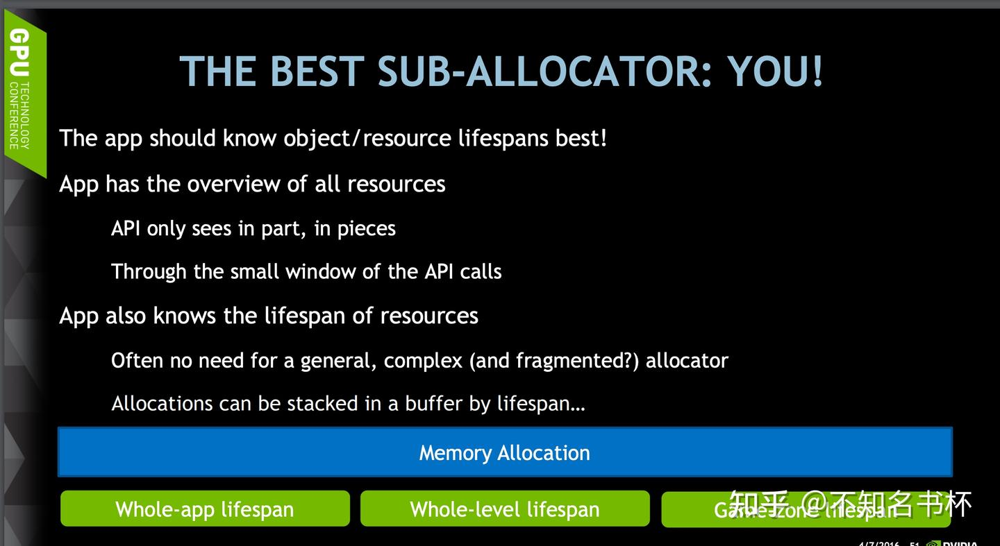

### Memory usage

传统图形API还有一个问题存在，那就是传统图形API的逻辑资源与支持它的物理内存紧密结合起来。这在使用上非常简单，但意味着很多中间存储(例如FrameBuffer的Attachment)只用于一个帧内。而Vulkan将资源的概念如Image或者Buffer与支持它的物理内存分开。并且由于开发者可以精准的控制资源[堆内存](https://zhida.zhihu.com/search?content_id=211384031&content_type=Article&match_order=1&q=堆内存&zhida_source=entity)的分配。可以通过使用Memory Alias能力(在同一堆空间中创建不同的资源,对一块内存进行复用)，这使得在渲染过程中的不同时间节点上为多个不同的资源重复使用相同的物理内存，从而更有效的使用有限的 GPU 内存资源。

### Shader Compilation

传统图形API(OpenGL/ES) 则采用了另一种方式，将 Shader 编译交给驱动程序完成，这样就会导致每次编译时带来的不必要的[语法分析](https://zhida.zhihu.com/search?content_id=211384031&content_type=Article&match_order=1&q=语法分析&zhida_source=entity)以及校验开销。但是现代图形API全部都提供了它们的[预编译](https://zhida.zhihu.com/search?content_id=211384031&content_type=Article&match_order=1&q=预编译&zhida_source=entity)Shader方案。Vulkan提出了SPIR-V 标准并且可将 GLSL/HLSL 编译为SPIR-V格式。使用字节码格式的优势在于 GPU 供应商编写的将Shader代码转换为本机代码的编译器的复杂性要低得多。过去表明对于像 GLSL 这样的人类可读语法，一些 GPU 供应商对标准的解释相当灵活可能在不同的平台兼容性会有问题。使用像 SPIR-V 这样的简单字节码格式有望避免该问题，并且能够减少传统图形API当中的检验开销等等具有更好的性能。

还有一个问题还是上面提到的关于Shader编译时机的改变(Shader编译是一个相当的耗时的操作)，在传统图形API中对于这个Shader编译是没有明确的时机的，完全是驱动程序决定。但是在Vulkan当中Shader编译的明确时机就是在创建Pipeline时。这可以让开发者更加明确的控制Shader编译时机。

## 能从Vulkan获得什么？

Vulkan 是一个相当底层API，它为开发者开放了更多的能力，但作为代价，它也将很多责任推给了开发者以正确的方式做事。在使用Vulkan之前值得考虑一下它带来的好处以及您必须付出的代价。并不总是适合每个项目的正确选择。使用 Vulkan 时要记住的最重要的一点是，它不一定会给您带来性能提升。 使用的GPU 硬件是相同的，Vulkan能够提供的渲染功能几乎与传统的图形API相同。如果您的应用程序受到 GPU 渲染性能的限制，那么 Vulkan 不太可能为您提供更多性能上的提升。

### 优点

Vulkan 带来的最大优势是减少了驱动程序和应用程序渲染逻辑中的CPU侧负载。这是通过简化 API 接口和对于多线程支持来实现的。这可以提高 遇到CPU侧瓶颈的应用程序的性能，并提高整体系统能效。 第二个优点是由于中间内存资源的帧内回收，减少了应用程序的内存占用。虽然这在高端设备中很少出现问题，但它可以在带有较小 RAM 的大众市场设备中有更好的效果。

### 缺点

Vulkan的优点有时同样会变成缺点，虽然减少了CPU侧的负载。但是需要去管理在传统图形API当中被隐藏起来的细节，包括内存分配、同步管理等等。开发者需要负责的东西更多了。虽然这可以实现高度的控制，但是同样在不当的编程下变成一种负优化。还值得注意的是较薄的抽象级别意味着 Vulkan 可以对底层 GPU 硬件的差异更加敏感从而降低了一定的可移植性，因为驱动程序无法帮助隐藏硬件差异。

### 挑战

可以看到现代图形 API 是更加显式的控制能力并且对于开发者相当的透明，最终目的是最大化提高渲染性能。但是如果要使用现代图形API想压榨出所有的性能也并非易事。简单的移植现有的程序有时候并不能够提高效率有时候反而降低性能(比如错误的同步反而会导致GPU停顿降低性能)。这也是Vulkan给开发者提出的难题。

首先是开发者思维的转变，没有驱动程序为咱们做那么多事情啦。对于开发者的要求也更高。但是这一切的付出都值得。在Vulkan和现代GPU的发展的情况下，才能够发挥出更大的价值，挖掘出更多的可能。从上面我可以看到Vulkan将之前在驱动程序层面工作量交付给开发者去完成，也就是某种意思上开发者承担了部分驱动程序的开发，那么这些工作量也就是挑战所在。

- **堆内存管理**，随着Vulkan向开发者开放GPU内存的控制权。精细控制内存预算和跟踪内存分配和使用，甚至还要根据不同使用场景来定制内存管理策略。可以充分利用这个内存完成复用以减少整体的内存需要，并且由于精细的控制可以减少GPU[内存碎片](https://zhida.zhihu.com/search?content_id=211384031&content_type=Article&match_order=1&q=内存碎片&zhida_source=entity)的产生。
- **CPU和GPU之间的同步**，现代图形API都是多线程友好，能够充分利用CPU的多核架构解放CPU侧的瓶颈。也就是将CPU和GPU之间同步重担从驱动程序放到开发者身上。需要使用[同步原语](https://zhida.zhihu.com/search?content_id=211384031&content_type=Article&match_order=1&q=同步原语&zhida_source=entity)来帮助精细的控制来完成执行依赖或者内存依赖，而Vulkan在同步原语的类型是最多的，控制粒度也是最精细。这需要开发者丰富的多线程编程经验。
- **Vulkan对象管理**，比如Pipeline对象的管理，之前说了Pipeline包含大部分状态，每一个Pipeline都需要提早创建好。那么这个Pipeline管理是一个大问题，假如Shader变体较多，这很有可能会造成内存浪费的问题。还有一个问题是如何降低创建Pipeline的耗时问题，即时创建Pipeline的话会触发Shader编译等等问题，这都会造成一定的卡顿问题。
- **资源绑定**，在复杂场景当中资源绑定同样是占用一部分性能，怎么合理的管理描述符是一个重要部分。合理的使用描述符可以大大减少资源绑定的次数，减少CPU的侧的负载。

还有很多其他的方面的比如Command Buffer如何复杂均衡以及RenderPass的各种参数设置等等。这些对于开发者来说都是不小的挑战。

### 总结

Vulkan 是一个底层 API，它赋予开发者高度的控制权和责任感，并通过非常低的 CPU 开销通过提供对 GPU 硬件和图形资源的访问。很好地使用它的应用程序可以受益于减少 CPU 负载和内存占用，减少因更厚的驱动程序抽象对应用程序进行第二次猜测而导致的故障。需要注意的是Vulkan 很少提升 GPU 渲染性能，毕竟使用GPU硬件是相同的。如果你的程序的瓶颈是在GPU或者项目在CPU侧很难多线程并行化的话，那么Vulkan也很难帮助你在效率上有所提升。

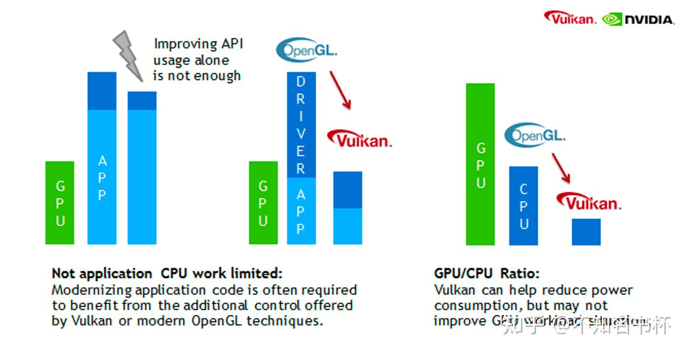

并且从传统的图形API移植到现代图形API的成本也是不小的，收益和工作量的对比如下所示：

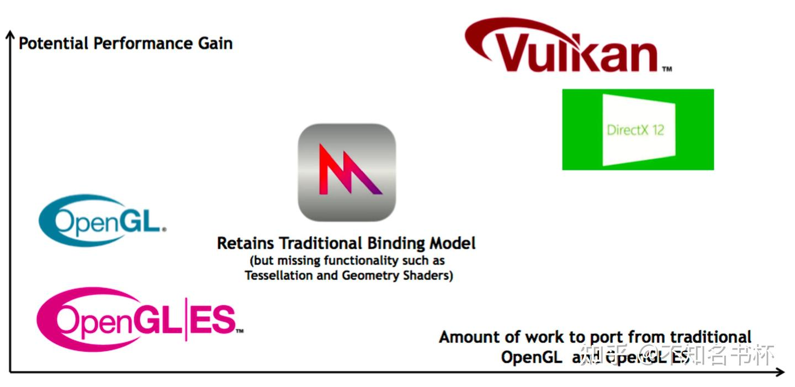

可以用下面这一张图，来表明什么时机适合使用Vulkan

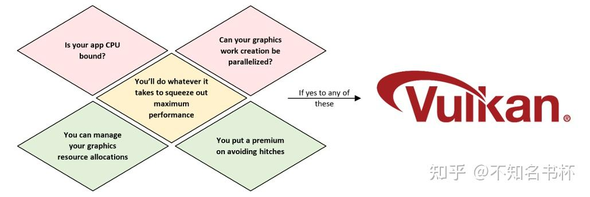

## References

https://zhuanlan.zhihu.com/p/20712354

[http://behindthepixels.io/assets/files/High-performance, Low-Overhead Rendering with OpenGL and Vulkan - Edward Liu.pdf](https://link.zhihu.com/?target=http%3A//behindthepixels.io/assets/files/High-performance%2C%20Low-Overhead%20Rendering%20with%20OpenGL%20and%20Vulkan%20-%20Edward%20Liu.pdf)

[https://developer.download.nvidia.com/gameworks/events/GDC2016/mschott_lbishop_gl_vulkan.pdf](https://link.zhihu.com/?target=https%3A//developer.download.nvidia.com/gameworks/events/GDC2016/mschott_lbishop_gl_vulkan.pdf)

[https://developer.download.nvidia.com/gameworks/events/GDC2016/Vulkan_Essentials_GDC16_tlorach.pdf](https://link.zhihu.com/?target=https%3A//developer.download.nvidia.com/gameworks/events/GDC2016/Vulkan_Essentials_GDC16_tlorach.pdf)

[https://github.com/KhronosGroup/Vulkan-Guide/blob/master/chapters/what_is_vulkan.adoc](https://link.zhihu.com/?target=https%3A//github.com/KhronosGroup/Vulkan-Guide/blob/master/chapters/what_is_vulkan.adoc)

[https://github.com/KhronosGroup](https://link.zhihu.com/?target=https%3A//github.com/KhronosGroup/Vulkan-Samples/blob/master/samples/vulkan_basics.md%23what-to-expect)