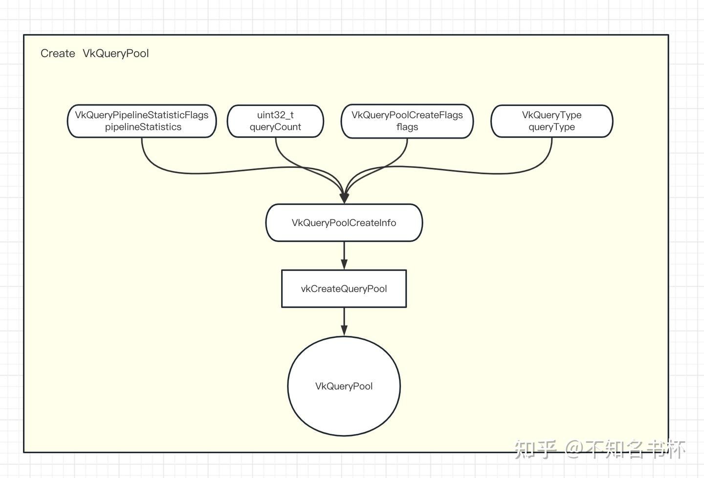
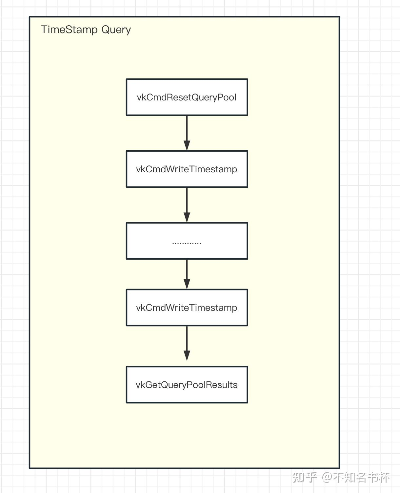
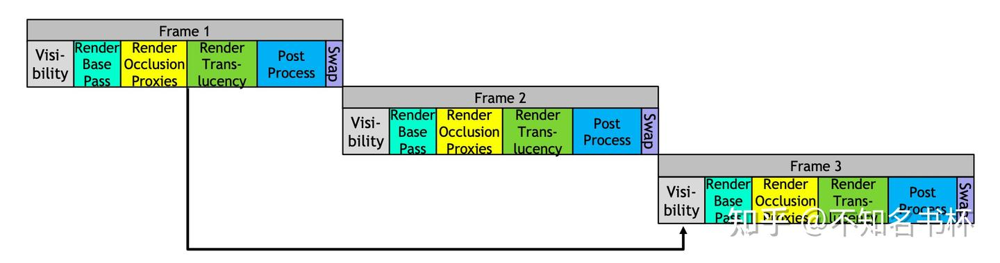
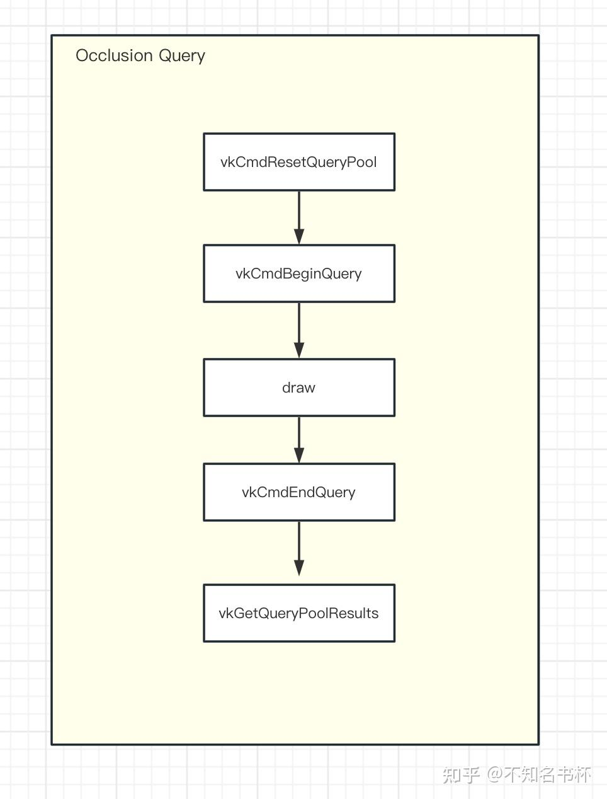
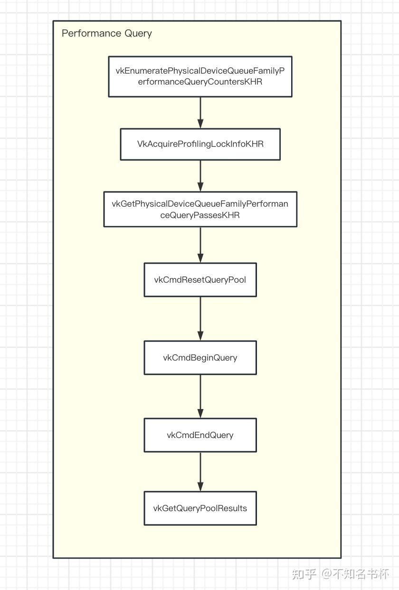
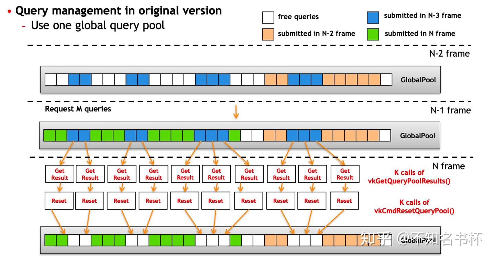
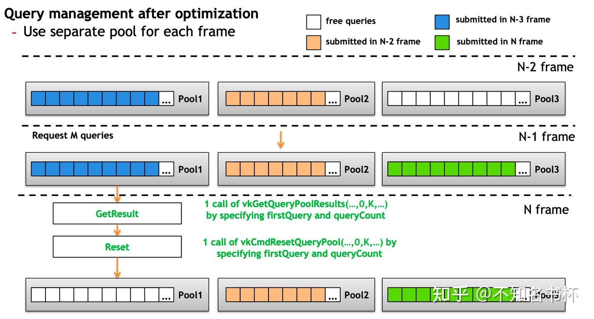

# 理解 Vulkan GPU Query

## 前言

本文致力于Vulkan中GPU Query的学习和使用，希望能够帮助到大家。如果有错误的地方也请多多指正。本文涉及到的概念如下所示：

- Query Pool
- TimeStamp Query
- Occlusion Queries
- Pipeline Statistics Query
- Performance Query

## 为什么需要GPU Query？

在渲染性能优化中，一个好的Profile的作用是不言而喻的。经常需要Profile来帮助我们寻找当时的渲染性能的瓶颈在哪，通过Profile可以掌握到GPU内部状态和数据并根据这些来完成性能优化和改进。现在当然已经有了很多好用的Profile包括RenderDoc或者是NV的Nsight以及AMD的Radeon Tool和Intel的Intel GPA这些都是很好的Profile基本囊括了所有的平台。这些Profile的功能都是特别强大的，但是每一个Profile都有各自使用的平台限制同时还有这很大的学习成本。往往是在不同硬件、不同平台下需要使用不同的工具，这些工具使用步骤繁琐效率很低而且不容易做到精准定位[性能瓶颈](https://zhida.zhihu.com/search?content_id=227719847&content_type=Article&match_order=1&q=性能瓶颈&zhida_source=entity)。于是瞄准了Vulkan中提供的GPU Query的能力，让引擎自身有一定Profile能力。虽然GPU Query的数据精度不够但是也能够看到GPU中大致负载是怎么样的。总的来说GPU Query可以作为一个辅助手段。如果是需要特别详细的数据建议还是使用各个平台的Profile，功能更加强大并且数据更加准确。

## 什么是GPU Query？

在Vulkan有时候会想知道本次DrawCall花了多少时间，但是CPU和GPU是[异构硬件](https://zhida.zhihu.com/search?content_id=227719847&content_type=Article&match_order=1&q=异构硬件&zhida_source=entity)，两者可以相互并行完成各自的任务无需等待，如果在CPU侧将std::Chrono::some_clock::now()放在DrawCall前后，它总是会给你一个接近零的时间。所以在CPU统计一次DrawCall的开销是无法代表实际在GPU中的运行时间的，对于现代图形API更是如此。在实际开发中会需要一些GPU状态数据(比如各种着色器的运行次数还有带宽多少等等)，幸运的是Vulkan向开发者开放了一些获取GPU状态的能力。这也就是GPU Query其中包含了有多种不同的类型。主要分为以下几种：

- TimeStamp Query: 通过在一个某个函数调用前后写入一个TimeStamp，然后通过计算其两个TimeStamp之间的差值得到本次函数调用开销。
- Occlusion Query：会跟踪通过一组Draw Command的通过Fragment Test的Sample数量。因此Occlusion Queries只适用于支持图形操作的Queue。应用程序可以使用这些结果来影响未来的渲染决策(比如一些物体可以不渲染等等)。(在每个Fragment中，Coverage Value为1的每个Smaple点，如果能通过所有的Fragment Test(包括Scissor、Exclusive Scissor、Sample Mask、Alpha To Coverage,、Depth/Stencil Test)Occlusion Query的 Sample计数器就会增加1。)
- Pipeline Statistics Query：可以让应用程序对一组指定的VkPipeline计数器进行采样。当开启Pipeline Statistics Query时这些计数器可以为一组Draw/Dispatch递增。因此Pipeline Statistics Query在支持图形或计算的Queue上是可用的。可以借助Pipeline Statistics Query来统计比如Vertex/Tessellation/Fragment Shader的调用次数等等，这些数据都有助于我们定位性能问题。
- Performance Query：可以为应用程序提供了一种机制以获得关于Command Buffer、RenderPass和其他Command执行的[性能计数器](https://zhida.zhihu.com/search?content_id=227719847&content_type=Article&match_order=1&q=性能计数器&zhida_source=entity)。

关于GPU Query的具体使用，大都离不开下面这些步骤：

- 创建对应不同类型Query的QueryPool。
- GPU Query操作(比如TimeStamp Query的vkCmdWriteTimestamp，Pipeline Statistics Query和 Occlusion Query的 vkCmdBeginQuery/vkCmdEndQuery等等)。
- 获取GPU Query的结果(通过vkGetQueryPoolResults)。

接下来会对不同类型的GPU Query也按照这个步骤进行操作。

## 创建Query Pool

来讲一下这些不同类型的GPU Query共同的地方，它们首先都需要一个Query Pool。所有的GPU Query都是通过Query Pool来管理的。每个Query Pool是由特定数量的特定类型的GPU Query组成的。

Query Pool需要通过vkCreateQueryPool创建，同时需要填充VkQueryPoolCreateInfo结构体。VkQueryPoolCreateInfo字段作用如下所示：

- flags是一个VkQueryPoolCreateFlags类型的字段，暂时没有什么功能，该字段可以忽略。

- queryType是一个VkQueryType类型的字段，用于指定该Query Pool用于什么类型的GPU Query。如下所示：

- - VK_QUERY_TYPE_OCCLUSION用于Occlusion Query。
  - VK_QUERY_TYPE_TIMESTAMP用于TimeStamp Query。
  - VK_QUERY_TYPE_PIPELINE_STATISTICS用于Pipeline Statistics Query。
  - VK_QUERY_TYPE_PERFORMANCE_QUERY_KHR用于Performance Query。

- queryCount是一个uint32_t类型的字段用于指定该Query Pool管理的Query数量。

- pipelineStatistics是一个VkQueryPipelineStatisticFlagBits类型的字段，用于指定该Query Pool中的Pipeline Statistics Query需要累加的计数器。

- - 假如设置为VK_QUERY_PIPELINE_STATISTIC_VERTEX_SHADER_INVOCATIONS_BIT则会根据Vertex Shader调用次数累加该计数器。

如果queryType没有设置为VK_QUERY_TYPE_PIPELINE_STATISTICS，则pipelineStatistics字段会被忽略。

```cpp
typedef struct VkQueryPoolCreateInfo {
    VkStructureType                  sType;
    const void*                      pNext;
    VkQueryPoolCreateFlags           flags;
    VkQueryType                      queryType;
    uint32_t                         queryCount;
    VkQueryPipelineStatisticFlags    pipelineStatistics;
} VkQueryPoolCreateInfo;
```



## 重置Query Pool

Vulkan 中的 Query 是有状态的，存储在 Query Pool 中的每个 Query 都有可用和不可用两种状态，开始GPU Query之前必须将 Query 设置为不可用状态，当查询结束时会自动将 Query 设置为可用状态并更新查询结果，因此获取查询结果时则 Query 必须为可用状态。可以通过vkCmdResetQueryPool和vkResetQueryPool来重置，主要区别是一个是前者是在Command Buffer中通过GPU重置，后者是CPU侧的重置。vkCmdResetQueryPool所需参数如下所示：

- commandBuffer是一个VkCommandBuffer字段，该Command将被记录到其中。
- queryPool指定需要被重置的Query Pool。
- firstQuery指定需要被重置的Query的起始索引
- firstQuery指定需要被重置的Query的终点索引

当vkCmdResetQueryPool执行时会将索引为[firstQuery, firstQuery + queryCount - 1]的Query的状态设置为不可用。vkCmdResetQueryPool同样指定了两条Query 之间的依赖关系，第一个同步范围包括Query Pool中所有的firstQuery和queryCount之间在Submission Order中较早出现的Query Command。第二个同步范围包括QueryPool中所有中由firstQuery和queryCount之间的在提交顺序中较晚出现的Query Command。这个命令的操作发生在第一同步范围之后，在第二同步范围之前发生。

```cpp
void vkCmdResetQueryPool(
    VkCommandBuffer                             commandBuffer,
    VkQueryPool                                 queryPool,
    uint32_t                                    firstQuery,
    uint32_t                                    queryCount);
```

想要能够使用vkCmdResetQueryPool还需要一个开启对应Extension(VK_EXT_host_query_reset)，因为Vulkan1.0或者1.1版本需要手动开启，但是Vulkan1.2这个扩展就被纳入Core中，无需手动开启。

同时还需要开启hostQueryReset这个Feature才可以使用哦，如下所示:

```cpp
// Get the extension feature
VkPhysicalDeviceFeatures2KHR physical_device_features{VK_STRUCTURE_TYPE_PHYSICAL_DEVICE_FEATURES_2_KHR};
VkPhysicalDeviceHostQueryResetFeaturesEXT  extension{VK_STRUCTURE_TYPE_PHYSICAL_DEVICE_HOST_QUERY_RESET_FEATURES_EXT};
physical_device_features.pNext = &extension;
vkGetPhysicalDeviceFeatures2KHR(physical_device,&physical_device_features);
physical_device_features.hostQueryReset = VK_TRUE;
```

在这里就完成所有的前置步骤啦，可以愉快的使用vkCmdResetQueryPool(不是很愉快！Vulkan真繁琐)。

## TimeStamp Query

### 前置条件检查

在使用TimeStamp Query之前需要查询GPU该是否支持TimeStamp Query(并不是所有的硬件都支持)，可通过VkPhysicalDeviceProperties::timestampPeriod来判断。如下所示：

```cpp
// 通过vkGetPhysicalDeviceProperties查询该GPU属性。
VkPhysicalDeviceProperties properties;
vkGetPhysicalDeviceProperties(physical_device, &properties);
// 在这里只需要判断timestampPeriod是否大于零即可。
if (properties.timestampPeriod == 0)
{
    throw std::runtime_error{"The selected device does not support timestamp queries!"};
}
```

接下来是该Queue是否支持TimeStamp Query能力。可以通过VkPhysicalDeviceLimits::timestampComputeAndGraphics字段检测Graphics/Computer Queue是否支持TimeStamp Query。并且在Timestamp Query的结果是存在有效位数的，这个有效位数由所在的 Queue 的 VkQueueFamilyProperties :: timestampValidBits确定，如果该 Queue 支持TimeStamp Query，该数值的有效范围是36到64位或者如果为0则表示不支持TimeStamp Query。如下所示：

```cpp
VkPhysicalDeviceProperties properties;
vkGetPhysicalDeviceProperties(physical_device, &properties);
VkPhysicalDeviceLimits device_limits = properties.limits;
if (!device_limits.timestampComputeAndGraphics)
{
    // 通过检测该Queue是否支持TimeStamp Query，通过timestampValidBits来判断。
    uint32_t queue_family_properties_count = 0;
    vkGetPhysicalDeviceQueueFamilyProperties(physical_device, &queue_family_properties_count, nullptr);
    queue_family_properties = std::vector<VkQueueFamilyProperties>(queue_family_properties_count);
    vkGetPhysicalDeviceQueueFamilyProperties(physical_device, &queue_family_properties_count, queue_family_properties.data());
    if (graphics_queue_family_properties.timestampValidBits == 0)
    {
        throw std::runtime_error{"The selected graphics queue family does not support timestamp queries!"};
    }
}
```

完成这些之后，那么就开始使用TimeStamp Query啦(前置操作真多，Vulkan传统)。

### 使用TimeStamp Query

与获得CPU侧的TimeStamp可以立即查询不同。对于GPU的TimeStamp则需要在Command Buffer内告诉需要何时/何地写入TimeStamp之后再获取相应的结果。这是通过在Command Buffer内用vkCmdWriteTimestamp完成的。这个函数将让GPU为某个Pipeline Stage执行之后写入一个TimeStamp，并将该值写入内存。所需参数如下所示：

- commandBuffer是一个VkCommandBuffer字段，该Command将被记录到其中。
- pipelineStage是一个VkPipelineStageFlagBits值，指定对应的PipelineStage，TimeStamp将在这个阶段被写入。
- queryPool指定对应的Query Pool。
- query会对应到某个Query的索引，该Query将包含TimeStamp数据。

```cpp
void vkCmdWriteTimestamp(
    VkCommandBuffer                             commandBuffer,
    VkPipelineStageFlagBits                     pipelineStage,
    VkQueryPool                                 queryPool,
    uint32_t                                    query);
```

当vkCmdWriteTimestamp被提交到Queue时，它定义了对在它之前提交的Command的执行依赖并将TimeStamp写入Query Pool。第一个同步范围包括所有在Submission Order中较早出现的Command。该同步范围仅限于对pipelineStage指定的Pipeline Stage的操作。第二个同步范围只包括写入TimeStamp的操作。当TimeStamp被写入时，Query被设置为可用状态。如果TimeStamp是由提交给不同Queue的Command写入的，那么这次获取到的TimeStamp和其他Queue的TimeStamp作比较是没有意义的。

调用这个函数需要注意的是Pipeline Stage参数。在GPU中使用TimeStamp Query与在CPU上用高性能计时器等进行计时的方式有很大不同。理论上可以在这里使用任何Pipeline Stage，但是GPU的并行的工作方式(乱序或者重叠)会导致很多Pipeline Stage的组合和顺序都不会产生有意义的数据。因此虽然直接一个接一个地为顶点和[片段着色器](https://zhida.zhihu.com/search?content_id=227719847&content_type=Article&match_order=1&q=片段着色器&zhida_source=entity)阶段写入TimeStamp来统计不同阶段的耗时可能听起来很合理，但是通常不会得到有意义的数据。所以在真正的实践当中一般只使用Pipeline的顶部和底部阶段(TOP_OF_PIPE_BIT和BOTTOM_OF_PIPE_BIT)。这种组合在大多数GPU上可以得到适当的近似结果。还需要注意的如果 Vulkan 的实现没有检测到指定Pipeline Stage 完成并且锁定计时器，则可以按 Stage 的逻辑顺序任意后续Pipeline Stage执行完成以上操作。

所以在真正的实践如下所示，统计这次DrawCall的大致调用时间。首先调用vkCmdWriteTimestamp并且Pipeline Stage设置为TOP_OF_PIPE_BIT，它告诉GPU在所有先前的Command被GPU的[命令处理器](https://zhida.zhihu.com/search?content_id=227719847&content_type=Article&match_order=1&q=命令处理器&zhida_source=entity)处理完后才写入TimeStamp。这可以确保我们在开始DrawCall之前得到一个TimeStamp，这将是计算时间差的基础。接着在塞入所有的DrawCall之后，调用vkCmdWriteTimestamp并且Pipeline Stage设置为BOTTOM_OF_PIPE_BIT，告诉GPU在所有工作完成后才写入TimeStamp。

```cpp
vkCmdWriteTimestamp(commandbuffer, VK_PIPELINE_STAGE_TOP_OF_PIPE_BIT, timestamps_query_pool, 0);
// Do some work
for (int i = 0; i < draw_call_count; i++) {
    vkCmdDraw(...);
}
vkCmdWriteTimestamp(commandbuffer, VK_PIPELINE_STAGE_BOTTOM_OF_PIPE_BIT, timestamps_query_pool, 1);
```

### 获取结果

当已经完成了TimeStamp的写入，现在应该去获取到写入的数据啦。在这里有两种途径可以获取到对应的数据:

- 使用vkCmdCopyQueryPoolResults将结果复制到的一个VkBuffer中。
- 在Command Buffer执行完毕后，使用vkGetQueryPoolResults获取结果。

这两个函数的调用方式都大同小异，在这里主要就是使用vkGetQueryPoolResults来讲解。vkGetQueryPoolResults所需参数如下所示：

- queryPool指定该次Query结果存储在哪个Query Pool里面。
- firstQuery本次需要获取数据Query的索引。
- queryCount代表本次要读取的Query数量。
- dataSize是pData所指向的Buffer的字节大小。
- pData是一个指向Buffer的指针，本次查询的结果将被写入其中。
- stride是pData中各个Query结果之间的步长，以字节为单位。
- flags是一个VkQueryResultFlagBits，该字段指定如何和何时返回结果。

```cpp
VkResult vkGetQueryPoolResults(
    VkDevice                                    device,
    VkQueryPool                                 queryPool,
    uint32_t                                    firstQuery,
    uint32_t                                    queryCount,
    size_t                                      dataSize,
    void*                                       pData,
    VkDeviceSize                                stride,
    VkQueryResultFlags                          flags);
```

在这里不同的flags参数很重要，需要理解不同的flag将会有什么效果。

### VK_QUERY_RESULT_64_BIT

首先是VK_QUERY_RESULT_64_BIT，使用了VK_QUERY_RESULT_64_BIT则告诉Vulkan我们希望得到的是64位的数据，如果没有这个参数将只能得到32位的值，一般来说需要的都是[纳秒级](https://zhida.zhihu.com/search?content_id=227719847&content_type=Article&match_order=1&q=纳秒级&zhida_source=entity)，假如使用的是32位的话的最大值是4294967295。假设即使第一次查询是0ns，也只能测量两个TimeStamp之间的4294967295纳秒也就是0.43秒。当然第一次查询会在0和uint32_t::max()之间的某个地方，如果测量比较耗时的工作很可能会遇到整数溢出，最后的结果会是错误的。所以一般推荐都保持设置为VK_QUERY_RESULT_64_BIT。

### VK_QUERY_RESULT_WAIT_BIT

在提交vkCmdWriteTimestamp的时候，在GPU中不知道什么时候开始执行也不知道什么时候完成执行。所以不能随意找个时间点的去读取TimeStamp数据，为了保证TimeStamp数据是可用一般会设置为VK_QUERY_RESULT_WAIT_BIT。VK_QUERY_RESULT_WAIT_BIT会等待所有TimeStamp数据可用。因此当使用这个flag时，在调用vkGetQueryPoolResults后写入TimeStamp的值被保证是可用的。这对想要立即访问结果的情况来说是好的，但在其他情况下可能会带来不必要的停顿。因为CPU会等待直到所有的Query全部写入。在CPU上发射一个单一的比较耗时调度并等待其完成是非常容易的。但在像游戏的主循环中这个性能损耗还是过大的，所以一般都不会设置为VK_QUERY_RESULT_WAIT_BIT。

### VK_QUERY_RESULT_WITH_AVAILABILITY_BIT

为了避免VK_QUERY_RESULT_WAIT_BIT可能会导致CPU侧停顿的问题，新的解决方案出现了那就是VK_QUERY_RESULT_WITH_AVAILABILITY_BIT。这将让轮询Query结果的可用性并推迟写入新的TimeStamp，直到Query结果是可用的。这应该是实践中的首选方式。使用这个flag还会在每个Query结果中插入一个额外的之代表其Query的可用性。如果该值不为零则该结果是可用的。然后在再次写入TimeStamp之前检查上次Query的可用性，如果不可用则不写入。这样避免了CPU的停顿，但是这个方案可能会错过一些帧的数据没统计上。

### 实际使用

### VK_QUERY_RESULT_64_BIT & VK_QUERY_RESULT_WAIT_BIT

```cpp
// Commoand完成提交即可开始查询
vkQueueSubmit();
std::vector<uint64_t> time_stamps(2);
vkGetQueryPoolResults(
    device->get_handle(),
    timestamps_query_pool,
    0,
    count,
    time_stamps.size() * sizeof(uint64_t),
    time_stamps.data(),
    sizeof(uint64_t),
    VK_QUERY_RESULT_64_BIT | VK_QUERY_RESULT_WAIT_BIT);
```

在这里就是等待写入TimeStamp全部执行完成后，CPU侧才继续往下执行。

### VK_QUERY_RESULT_64_BIT & VK_QUERY_RESULT_WITH_AVAILABILITY_BIT

```cpp
std::array<uint64_t, max_frames_in_flight * 2> time_stamp_with_availibility{};
vkBeginCommandBuffer(command_buffer, &command_buffer_begin_info);

// 检测上次的Query是否可用，Query可用才可以写入新的时间戳
if (time_stamp_with_availibility[current_frame * 2 + 1] != 0) {
    vkCmdWriteTimestamp(command_buffer, VK_PIPELINE_STAGE_TOP_OF_PIPE_BIT, query_pool_timestamps, 0);
}
.......
vkEndCommandBuffer(command_buffer);

vkGetQueryPoolResults(
    device,
    query_pool_timestamps,
    0,
    1,
    2 * sizeof(uint64_t),
    &time_stamp_with_availibility[Current_frame * max_frames_in_flight],
    2 * sizeof(uint64_t),
    VK_QUERY_RESULT_64_BIT | VK_QUERY_RESULT_WITH_AVAILABILITY_BIT);        

if (time_stamp_with_availibility[current_frame * 2 + 1] != 0) {
    std::cout << "Timestamp = " << time_stamp_with_availibility[current_frame * 2] << "\n";
}
```

在每帧写入之前判断Query是否可用再确定是否要写入TimeStamp。在这里还需要注意一个点，如果使用VK_QUERY_RESULT_WITH_AVAILABILITY_BIT则会添加一个Query可用值，如果没有VK_QUERY_RESULT_64_BIT则可用值也是32位，和Query结果的位数是保持一致的。

### 单位转换

到目前为止已经可以拿到真正的Query结果，还有一个步骤那就是对数据进行处理以便用于最后的展示。Query结果实际上并不是真正的时间值，而是一个"刻度"数。为了得到实际的时间值还需要做一个转换。这是通过VkPhysicalDeviceLimits::timestampPeriod字段来完成的。它包含了一个TimeStamp Query值增加1刻度所需的纳秒数。如下所示：

```cpp
// 通过vkGetPhysicalDeviceProperties查询该GPU属性。
VkPhysicalDeviceProperties properties;
vkGetPhysicalDeviceProperties(physical_device, &properties);
VkPhysicalDeviceLimits device_limits = properties.limits;
// 计算出最后的纳秒数
float delta_in_ns = float(time_stamps[1] - time_stamps[0]) * device_limits.timestampPeriod;
```

### 整体流程



## Occlusion Query

简单来说Occlusion Query可以通过查询前几帧的信息来影响本帧渲染决策，可以用来决定是否要渲染一些几何图形。所以在使用Occlusion Query，需要增加一帧额外的延迟，以确保能够获取正确的结果。如下图所示：



### 前置条件检查

对于Occlusion Query来说应该PC和移动端全部是支持的。但是有一个occlusionQueryPrecise字段会控制在Occlusion Query中会返回实际通过的Sample数量。这种类型的Query可以在vkCmdBeginQuery的flags参数中启用VK_QUERY_CONTROL_PRECISE_BIT。如果不支持这个功能，那么当有任何Sample通过时该Occlusion Query只会返回一个布尔值。

### 开始查询

接下来看看如何完成Occlusion Query吧，和上面的TimeStamp Query不同这里需要的使用到是vkCmdBeginQuery和vkCmdEndQuery。Occlusion Query只会对在指定Command Buffer内vkCmdBeginQuery和vkCmdEndQuery之间记录的Command有效果，可以对一组DrawCall进行查询。

vkCmdBeginQuery和vkCmdEndQuery所需参数如下:

- commandBuffer指定完成该Record Command的Command Buffer。
- queryPool指定该次Query结果存储在哪个Query Pool里面。
- query指定本次开启的Query的索引。

vkCmdBeginQuery和vkCmdEndQuery的参数基本一致但是只有一个VkQueryControlFlags字段flag有所不同，如果开启了occlusionQueryPrecise能力，并且在vkCmdBeginQuery的调用中flag参数设置为VK_QUERY_CONTROL_PRECISE_BIT。本次Occlusion Query便会返回具体的Sample Count而不是一个布尔值。

```cpp
void vkCmdBeginQuery(
    VkCommandBuffer                             commandBuffer,
    VkQueryPool                                 queryPool,
    uint32_t                                    query,
    VkQueryControlFlags                         flags);

void vkCmdEndQuery(
    VkCommandBuffer                             commandBuffer,
    VkQueryPool                                 queryPool,
    uint32_t                                    query);
```

具体来看下面这个Occlusion Query的例子。

```cpp
{
    // Occluder first
    draw(command_buffer);
    // Teapot
    vkCmdBeginQuery(command_buffer, queryPool, 0, VK_FLAGS_NONE);
    draw(command_buffer);
    vkCmdEndQuery(drawCmdBuffers[i], queryPool, 0);
    // Sphere
    vkCmdBeginQuery(dcommand_buffer, queryPool, 1, VK_FLAGS_NONE);
    draw(command_buffer);
    vkCmdEndQuery(command_buffer, queryPool, 1);
}
```

这里有一个点需要注意，调用vkCmdBeginQuery和vkCmdBeginQuery必须在RenderPass实例的同一个SubPass内开始和结束或者必须在RenderPass实例之外开始和结束（即包含整个RenderPass实例）。

### 获取结果

和上面TimeStamp Query基本保持一致，不再重复赘述。

### 整体流程



## Pipeline Statistics Query

### 前置条件检查

Pipeline Statistics Query并不是所有的机型都会支持，所以需要先检测该机型是否支持该能力。可以通过VkPhysicalDeviceFeatures::pipelineStatisticsQuery字段来判断该机型是否支持Pipeline Statistics Query。

```cpp
VkPhysicalDeviceProperties properties;
vkGetPhysicalDeviceProperties(physical_device, &properties);
if(!properties.pipelineStatisticsQuery){
        throw std::runtime_error{"The selected device does not support Pipeline Statistics Query!"};
}
```

### 使用

Pipeline Statistics Query的使用和Occlusion Query大致相同，但是有一个特殊的点。在创建QueryPool的时候需要在VkQueryPoolCreateInfo中设置pipelineStatistics字段，这个字段代表需要查询的是不同的Pipeline Stage的调用次数。比如下面这个QueryPool就是查询顶点着色器和[曲面细分](https://zhida.zhihu.com/search?content_id=227719847&content_type=Article&match_order=1&q=曲面细分&zhida_source=entity)着色器的调用次数。

```cpp
VkQueryPoolCreateInfo query_pool_info = {};
query_pool_info.sType = VK_STRUCTURE_TYPE_QUERY_POOL_CREATE_INFO;
query_pool_info.queryType = VK_QUERY_TYPE_PIPELINE_STATISTICS;
query_pool_info.pipelineStatistics =
    VK_QUERY_PIPELINE_STATISTIC_VERTEX_SHADER_INVOCATIONS_BIT |
    VK_QUERY_PIPELINE_STATISTIC_TESSELLATION_EVALUATION_SHADER_INVOCATIONS_BIT;
query_pool_info.queryCount = 2;
vkCreateQueryPool(get_device().get_handle(), &query_pool_info, NULL, &query_pool);
```

通过调用vkCmdBeginQuery和vkCmdEndQuery分别代表开始和结束一个Pipeline Statistics Query。当一个Pipeline Statistics Query开始时，所有的计数器被设置为零。如果一个计数器是在不支持相应操作的Command Buffer上发出的，那么在本次Query会被设置为可用后，但是该计数器的值就无法定义。必须启用至少一个与记录Command Buffer上支持的操作相关的计数器。Pipeline Statistics Query和Occlusion Query使用方式基本一致，如下所示：

```cpp
vkCmdBeginQuery(command_buffer, queryPool, 0, VK_FLAGS_NONE);
    draw(command_buffer);
    vkCmdEndQuery(drawCmdBuffers[i], queryPool, 0);
```

### 获取结果

和上面TimeStamp Query基本保持一致，不再重复赘述。

### 整体流程

和Occlusion Query基本一致不再重复。

## Performance Query

### 前置条件检查

首先是想要使用Performance Query必须开启VK_KHR_performance_query这个扩展，这是最前置的一个条件，其次还需要查询硬件是否有Performance Query这个功能，可以通过以下方式来查询：

```text
VkPhysicalDevicePerformanceQueryFeaturesKHR perf_query_features{};
perf_query_features.sType = VK_STRUCTURE_TYPE_PHYSICAL_DEVICE_PERFORMANCE_QUERY_FEATURES_KHR;

VkPhysicalDeviceFeatures2KHR device_features{};
device_features.sType = VK_STRUCTURE_TYPE_PHYSICAL_DEVICE_FEATURES_2_KHR;
device_features.pNext = &perf_query_features;

// 使用vkGetPhysicalDeviceFeatures2来查询，表明VK_KHR_get_physical_device_properties2是VK_KHR_performance_query的前提。
vkGetPhysicalDeviceFeatures2(physical_device, &device_features);
// 判断performanceCounterQueryPools是否为true
if (!perf_query_features.performanceCounterQueryPools)
{
	return false;
}
```

首先可以通过调用 vkEnumeratePhysicalDeviceQueueFamilyPerformanceQueryCountersKHR 查询可用的Performance Query计数器有多少个，如果为零则不支持Performance Query。 并且通过该接口可以获取到Performance Query计数器的具体信息，如下所示：

```cpp
uint32_t count = 0;
    vkEnumeratePhysicalDeviceQueueFamilyPerformanceQueryCountersKHR(physical_device,queue_family_index, &count,
                                                          nullptr, nullptr);

    if (count == 0)
    {
        throw std::runtime_error{"The selected physical_device does not support Performance Query!"};
    }

    std::vector<VkPerformanceCounterKHR>            counters(count);
    std::vector<VkPerformanceCounterDescriptionKHR> descs(count);

    for (uint32_t i = 0; i < count; i++)
    {
        counters[i].sType = VK_STRUCTURE_TYPE_PERFORMANCE_COUNTER_KHR;
        counters[i].pNext = nullptr;
        descs[i].sType    = VK_STRUCTURE_TYPE_PERFORMANCE_COUNTER_DESCRIPTION_KHR;
        descs[i].pNext    = nullptr;
    }
    // 获取到所有的Performance Query计数器信息
    vkEnumeratePhysicalDeviceQueueFamilyPerformanceQueryCountersKHR(physical_device,queue_family_index, &count,
                                                          counters.data(), descs.data());
```

在这里还有一个问题，那就是关于Performance Query计数器描述VkPerformanceCounterDescriptionKHR结构体中包含一个flags参数。假如该flag参数为VK_PERFORMANCE_COUNTER_DESCRIPTION_PERFORMANCE_IMPACTING_KHR，则表明该Performance Query计数器会十分损耗性能。可以选择避免统计该数据，并且通过descs的信息可以筛选出所需要的统计数据然后获取到对应的计数器的索引。以便在后续的创建Performance Query Pool指定对应的计数器。

关于Performance Query还有一个特殊的前置需要，那就是Profiling Lock。如果要记录和提交一个包含Performance Query的Command Buffer就一定需要Profiling Lock。其中VkAcquireProfilingLockInfoKHR::timeout表示如果Profiling Lock不可用则该函数会等待多长时间，单位是纳秒。

```cpp
VkAcquireProfilingLockInfoKHR info{};
info.sType   = VK_STRUCTURE_TYPE_ACQUIRE_PROFILING_LOCK_INFO_KHR;
info.timeout = 2000000000; // 消耗2s
if (vkAcquireProfilingLockKHR(device.get_handle(), &info) != VK_SUCCESS)
{
            throw std::runtime_error{"The selected device does not support ProfilingLock!"};
}
```

### 创建Performance Query Pool

在上面通过vkEnumeratePhysicalDeviceQueueFamilyPerformanceQueryCountersKHR获取到所有的计数器描述后，可以筛选出想要的计数器。现在建立一个Query Pool来收集这些计数器的数据。在这里首先需要检查这些计数器是否可以一次性收集，如果需要多次收集会对性能产生很大的影响。首先需要填充VkQueryPoolPerformanceCreateInfoKHR结构体。如下所示：

- queueFamilyIndex是用于创建这个Performance Query Pool的Query Family Index。
- counterIndexCount是pCounterIndices数组的长度。
- pCounterIndices是指向vkEnumeratePhysicalDeviceQueueFamilyPerformanceQueryCountersKHR::pCounters的索引数组的指针，以便确定在这个Performance Query Pool中启用的计数器是哪些。

```cpp
typedef struct VkQueryPoolPerformanceCreateInfoKHR {
    VkStructureType    sType;
    const void*        pNext;
    uint32_t           queueFamilyIndex;
    uint32_t           counterIndexCount;
    const uint32_t*    pCounterIndices;
} VkQueryPoolPerformanceCreateInfoKHR;
```

之后通过vkGetPhysicalDeviceQueueFamilyPerformanceQueryPassesKHR来查询是否这些计数器可以一次性统计完毕。

```cpp
uint32_t passes_needed;
vkGetPhysicalDeviceQueueFamilyPerformanceQueryPassesKHR(physical_device, perf_query_create_info,&passes_needed);
if (passes_needed != 1)
{
    // Needs more than one pass, remove all our supported stats
    throw std::runtime_error{"Requested Vulkan stats require multiple passes, we won't collect them"};
}
```

接下来就可以真正创建QueryPool啦，在这里需要将VkQueryPoolPerformanceCreateInfoKHR传入到VkQueryPoolCreateInfo的pNext当中。

```cpp
VkQueryPoolCreateInfo pool_create_info{};
pool_create_info.sType      = VK_STRUCTURE_TYPE_QUERY_POOL_CREATE_INFO;
pool_create_info.pNext      = &perf_create_info;
pool_create_info.queryType  = VK_QUERY_TYPE_PERFORMANCE_QUERY_KHR;
......
VkQueryPool query_pool;
vkCreateQueryPool(device, &pool_create_info, nullptr, &query_pool)
```

到这里使用Performance Query 的Query Pool就已经创建完毕啦，可以开始使用Performance Query啦！

### 使用

在这里还是通过vkCmdBeginQuery和vkCmdEndQuery来完成Performance Query和前面的Query基本一致，不过Performance Query有一些特殊的点需要注意。在这里Performance Query并不需要在每次调用vkCmdBeginQuery之前调用一次vkCmdResetQueryPool(也就是重置Query Pool)。这对于Performance Query是无效的。

并且在调用vkCmdEndQuery之前还添加一个PipelineBarrier，保证其前一个Command 完全执行完毕，但也不用担心后续的Command会被堵塞，这是设置的Pipeline Stage是BOTTOM_OF_PIPE_BIT。如下所示：

```cpp
vkCmdBeginQuery(command_buffer, query_pool, ....);
.....
draw()
.....
vkCmdPipelineBarrier(command_buffer,
                             VK_PIPELINE_STAGE_BOTTOM_OF_PIPE_BIT,
                             VK_PIPELINE_STAGE_BOTTOM_OF_PIPE_BIT,
                             0, 0, nullptr, 0, nullptr, 0, nullptr);
vkCmdEndQuery(command_buffer, query_pool, ...);
```

在这里就确定了Performance Query的统计数据范围啦！

### 获取结果

接下来是获取Performance Query的结果，Performance Query的结果以一个VkPerformanceCounterResultKHR数组的形式返回，其中包含与Query中的每个计数器相关的数据，其存储顺序与创建Performance Query时在pCounterIndices中提供的计数器顺序一致。

```cpp
VkDeviceSize stride = sizeof(VkPerformanceCounterResultKHR) * counter_indices.size();
std::vector<VkPerformanceCounterResultKHR> results(counter_indices.size());
vkGetQueryPoolResults(device, query_pool,0,1,results.size() * sizeof(VkPerformanceCounterResultKHR),
                                         results.data(), stride, VK_QUERY_RESULT_WAIT_BIT)
```

到此为止Performance Query的结果也获取到啦！可以通过之前获取到的计数器信息也就是VkPerformanceCounterKHR::storage字段来确定计数器中数据的位数，然后完成解析。

```cpp
VkPerformanceCounterResultKHR result;
VkPerformanceCounterStorageKHR stroage;
switch (storage)
    {
        case VK_PERFORMANCE_COUNTER_STORAGE_INT32_KHR:
            return static_cast<double>(result.int32);
        case VK_PERFORMANCE_COUNTER_STORAGE_INT64_KHR:
            return static_cast<double>(result.int64);
        case VK_PERFORMANCE_COUNTER_STORAGE_UINT32_KHR:
            return static_cast<double>(result.uint32);
        case VK_PERFORMANCE_COUNTER_STORAGE_UINT64_KHR:
            return static_cast<double>(result.uint64);
        case VK_PERFORMANCE_COUNTER_STORAGE_FLOAT32_KHR:
            return static_cast<double>(result.float32);
        case VK_PERFORMANCE_COUNTER_STORAGE_FLOAT64_KHR:
            return (result.float64);
        default:
            assert(0);
            return 0.0;
    }
```

### 整体流程



## GPU Query 优化

### 避免使用全局Query Pool

可能在实践中会使用一个全局的Query Pool，然后多帧都在同一个Query Pool中操作(比如写入TimeStamp，Occlusion Query之类的)，这样会造成频繁的调用vkGetQueryPoolResults和vkResetQueryPool这些接口，如下所示，可以看出使用一个全局Query Pool会导致多次调用，性能不佳。



所以推荐的方案是每帧都单独持有一个Query Pool，因为每帧的GPU Query可以很明确的通过一次性获取到多个Query的结果，这样的处理方式可以大大减少vkGetQueryPoolResults和vkResetQueryPool的调用次数。如下所示：



## GPU Query 支持情况

Occlusin Query 基本是全覆盖的情况，这个功能在很早就已经出现了，PC和移动端都可以正常使用。

TimeStamp Query在PC端基本全覆盖，在移动端覆盖率70%的覆盖率，使用需谨慎。

Pipeline Statistics Query在PC端基本全覆盖，在移动端覆盖率30%的覆盖率，在移动端基本不可用状态。

Performance Query 在PC段的覆盖率很低，在移动端完全不支持。

## 总结

在本文中介绍了GPU Query的基础概念以及几种不同的类型的Query的使用方式，这能够让Vulkan本身具有一定的分析性能的能力，虽然并不够准确的，但是能够体现出一定的性能情况。这对于分析性能瓶颈时有帮助的，并且不同的机型能够支持的GPU Query并不一样，需要做好各种前置条件的检测。最后希望这些能够帮助到大伙。就这样，咱们下一篇见！！

## References

[游戏引擎随笔 0x18：现代图形 API 的 GPU Query](https://zhuanlan.zhihu.com/p/349808392)

[How to use Vulkan Timestamp Queries. | Here should be the blog Title](https://link.zhihu.com/?target=https%3A//nikitablack.github.io/post/how_to_use_vulkan_timestamp_queries/)

[Vulkan-Samples/samples/api/timestamp_queries at main · KhronosGroup/Vulkan-Samples](https://link.zhihu.com/?target=https%3A//github.com/KhronosGroup/Vulkan-Samples/tree/main/samples/api/timestamp_queries)

[A Year in a Fortnite | Samsung Developers](https://link.zhihu.com/?target=https%3A//developer.samsung.com/galaxy-gamedev/gamedev-blog/fortnite.html)

编辑于 2023-05-14 20:43・IP 属地广东

### 