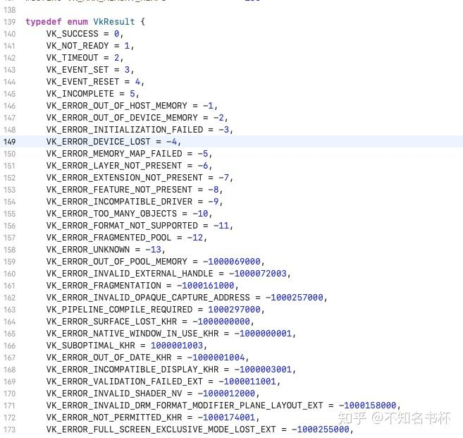
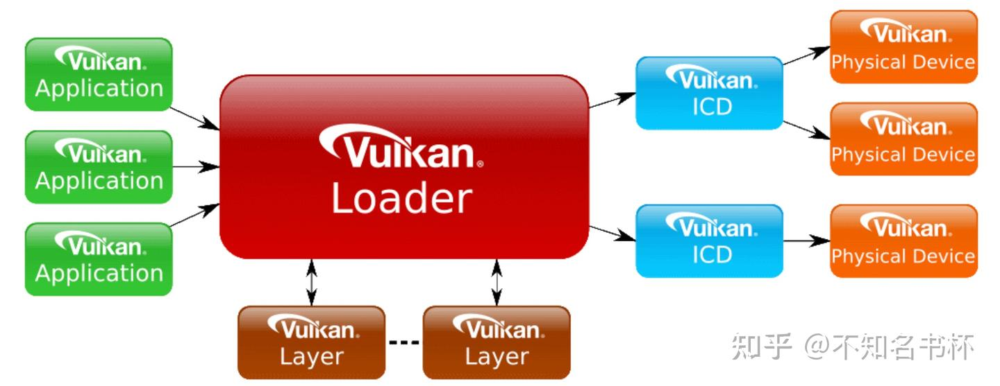

# Vulkan 三角形之旅

> 这里是记录笔者Vulkan的学习记录，参照该教程[Introduction - Vulkan Tutorial](https://link.zhihu.com/?target=https%3A//vulkan-tutorial.com/Introduction)。如果你想识别Vulkan相比于之前的传统图形API有什么区别和优势的话，欢迎看我的另外一篇文章[初探Vulkan](https://zhuanlan.zhihu.com/p/554631289)。相信应该能够帮助你识别Vulkan的优势所在。

## OverView

笔者这里是使用Mac来进行Vulkan的学习。简单来说Vulkan如果想要在Mac上运行的话，就必须要使用MoltenVK来完成。在Mac上Vulkan代码本质上还是会转化为Metal代码在Mac、IOS以及tvOS上运行的。关于这个怎么安装编译的，我们不必在意，安装Mac版本的Vulkan SDK就可以了。SDK会帮助你解决。并且在这里我们引入了计算线性代数的GLM库以及创建窗口的GLFW库。需要的东西并不多，关于这个环境配置问题可以参考上面原教程中的操作。

在Vulkan当中的画一个三角形流程可以分为如下:

- 创建一个 VkInstance
- 选择支持的硬件设备（VkPhysicalDevice）
- 创建用于Draw和Presentation的VkDevice 和 VkQueue
- 创建窗口(window)、窗口表面(window surface)和[交换链](https://zhida.zhihu.com/search?content_id=211498870&content_type=Article&match_order=1&q=交换链&zhida_source=entity) (Swap Chain)
- 将Swap Chain Image 包装到 VkImageView
- 创建一个指定Render Target和用途的RenderPass
- 为RenderPass创建FrameBuffer
- 设置PipeLine
- 为每个可能的Swap Chain Image分配并记录带有绘制命令的Command Buffer
- 通过从Swap Chain获取图像在上面绘制，提交正确的Commander Buffer，并将绘制完的图像返回到Swap Chain去显示。

这么多步骤这是仅仅为了画一个三角形，其中如果你对于[渲染管线](https://zhida.zhihu.com/search?content_id=211498870&content_type=Article&match_order=1&q=渲染管线&zhida_source=entity)不熟悉或者没用其他现代图形API的话，建议还是去了解了解，不然再Vulkan许多的配置会让人一知半解，这边建议如果有Mac的话。可以先上手Metal，比较易用。可以后面再来挑战Vulkan

## Vulkan Api 风格

所有 Vulkan 函数、枚举和结构都在 vulkan.h 头文件中定义，该头文件包含在 LunarG 开发的 Vulkan SDK 中。可以自行去翻阅，函数具有小写的 vk 前缀，枚举和结构等类型具有 Vk 前缀，枚举值具有 VK_ 前缀。 Vulkan大量使用Struct来为传递参数而不是使用函数参数。[代码风格](https://zhida.zhihu.com/search?content_id=211498870&content_type=Article&match_order=1&q=代码风格&zhida_source=entity)结构如下所示

```cpp
VkXXXCreateInfo createInfo{};
createInfo.sType = VK_STRUCTURE_TYPE_XXX_CREATE_INFO;
createInfo.pNext = nullptr;
createInfo.foo = ...;
createInfo.bar = ...;

VkXXX object;
if (vkCreateXXX(&createInfo, nullptr, &object) != VK_SUCCESS) {
    std::cerr << "failed to create object" << std::endl;
    return false;
}

vkDestroyXXXX(object, nullptr);
```

Vulkan中的许多数据结构要求在**sType**成员中明确的指定类型。**pNext**成员可用于指向特定的扩展结构。我们在这里使用默认初始化，将其设置为nullptr。创建或销毁对象的函数将具有 VkAllocationCallbacks 参数，该参数允许您使用自定义分配器来分配驱动程序内存，在后续流程中也将保留 nullptr。几乎所有函数都返回一个 VkResult，它要么是 VK_SUCCESS，要么是错误代码。该规范描述了每个函数可以返回哪些错误代码以及它们的含义。大致如下所示：



## 创建Instance

Vulkan API使用vkInstance对象来存储所有每个应用的状态。应用程序必须在执行任何其他Vulkan 操作之前创建一个Vulkan Instance，基本的Vulkan架构看起来是这样的：



请注意，图中有一些Layer，这些Layer也通过Loader加载。Layer通常用于验证，通常是由驱动执行的错误检查。在Vulkan中，驱动程序比OpenGL等其他API要轻量得多，部分原因是它将功能验证委托给验证Validation Layer。Layer是可选的，每次应用程序创建一个Instance时都可以选择性地装载Layer。

Layer总的来说是增强 Vulkan 系统的可选组件。他们可以在从应用程序到硬件的过程中拦截、评估和修改现有的 Vulkan 功能。可以使用 `vkEnumerateInstanceLayerProperties` 从应用程序中查询Layer属性。

那么Vulkan中的Instance发挥了什么作用呢？在Vulkan中没有[全局状态](https://zhida.zhihu.com/search?content_id=211498870&content_type=Article&match_order=1&q=全局状态&zhida_source=entity)，所有每个应用的状态都存储在VkInstance对象中。创建一个VkInstance对象可以初始化Vulkan库，并允许应用程序将自身信息传递并去实现。

那么接下来咱们需要来创建一个Instance。那么首先我们该数据结构赋予自定义应用程序的信息。这些数据从技术角度是可选择的，但是它可以为驱动程序提供一些有用的信息来优化程序特殊的使用情景，比如驱动程序使用一些[图形引擎](https://zhida.zhihu.com/search?content_id=211498870&content_type=Article&match_order=1&q=图形引擎&zhida_source=entity)的特殊行为。这个数据结构称为**VkApplicationInfo。**

```cpp
// 该数据结构如下所示
typedef struct VkApplicationInfo {
    VkStructureType    sType;
    const void*        pNext;
    const char*        pApplicationName;
    uint32_t           applicationVersion;
    const char*        pEngineName;
    uint32_t           engineVersion;
    uint32_t           apiVersion;
} VkApplicationInfo;

// 我们的代码如下所示：
VkApplicationInfo appInfo{};
appInfo.sType = VK_STRUCTURE_TYPE_APPLICATION_INFO;
appInfo.pApplicationName = "Hello Triangle";
appInfo.applicationVersion = VK_MAKE_VERSION(1, 0, 0);
// 这里我们不使用什么引擎
appInfo.pEngineName = "No Engine";
appInfo.engineVersion = VK_MAKE_VERSION(1, 0, 0);
// 代表我们使用什么版本的vulkan
appInfo.apiVersion = VK_API_VERSION_1_0;
```

Vulkan中的大量信息通过结构体而不是函数参数传递，我们将填充一个结构体以提供足够的信息创建Instance。接下来创建新的结构体`VkInstanceCreateInfo`用于后续创建Instance，如下所示

```cpp
typedef struct VkInstanceCreateInfo {
    VkStructureType             sType;
    const void*                 pNext;
    VkInstanceCreateFlags       flags;
    const VkApplicationInfo*    pApplicationInfo;
    uint32_t                    enabledLayerCount;
    const char* const*          ppEnabledLayerNames;
    uint32_t                    enabledExtensionCount;
    const char* const*          ppEnabledExtensionNames;
} VkInstanceCreateInfo;

VkInstanceCreateInfo createInfo{};
createInfo.sType = VK_STRUCTURE_TYPE_INSTANCE_CREATE_INFO;
// 将上面的appInfo结构体传入(利用结构体传递参数)
createInfo.pApplicationInfo = &appInfo;
```

接下来的两个参数比较重要。它需要告知Vulkan驱动程序我们需要使用哪些全局的 Extensions和 Layers。这里的全局意味着它适用于整个程序，而不是特定的设备，

```cpp
// 这里面有关于一些在Mac上运行Vulkan的一些问题。 需要添加一些额外的Extensions，才能够运行
std::vector<const char*> getRequiredExtensions() {
      uint32_t glfwExtensionCount = 0;
      const char** glfwExtensions;
            // Vulakn对于平台特性是零API支持的(至少暂时这样)，这意味着需要一个扩展才能与不同平台的窗体系统进行交互。
            // GLFW有一个方便的内置函数，返回它有关的扩展信息。
      glfwExtensions = glfwGetRequiredInstanceExtensions(&glfwExtensionCount);

      std::vector<const char*> extensions(glfwExtensions, glfwExtensions + glfwExtensionCount);
      // 添加VK_EXT_debug_utils扩展，使用VK_EXT_DEBUG_UTILS_EXTENSION_NAME宏定义，避免拼写错误
      // 同样是为了在mac上运行 必须开启该这个 instance Extension
      extensions.push_back("VK_KHR_get_physical_device_properties2");
      return extensions;
 }
auto requiredExtensions = getRequiredExtensions();
requiredExtensions.emplace_back(VK_KHR_PORTABILITY_ENUMERATION_EXTENSION_NAME);
// 用于规避报错
createInfo.flags |= VK_INSTANCE_CREATE_ENUMERATE_PORTABILITY_BIT_KHR;
// 添加相应extension
createInfo.enabledExtensionCount = (uint32_t) requiredExtensions.size();
createInfo.ppEnabledExtensionNames = requiredExtensions.data();
```

我们现在已经指定了Vulkan创建一个Instance需要的一切信息，调用`vkCreateInstance`创建Instance。

```cpp
// 创建vkInstance 这里还是Vulkan一贯的风格。在这里会返回一个 VkResult 用于判断是否创建成功。
if (vkCreateInstance(&createInfo, nullptr, &instance) != VK_SUCCESS) {
    throw std::runtime_error("failed to create instance!");
}
// 注意如果需要销毁instance
// 可以调用 vkDestroyInstance(instance, nullptr)的方式
```

那么到了这里咱们的Instance就创建成功啦。

## 开启V**alidation Layers(一定要开启！！！)**

Vulkan API 是围绕最小驱动程序开销的想法设计的，该目标的表现之一是默认情况下 API 中的错误检查非常有限。即使像将枚举设置为不正确的值或将空指针传递给所需参数这样简单的错误通常也不会被显式处理，只会导致崩溃或未定义的行为。因为 Vulkan 要求您对所做的一切非常明确，所以很容易犯许多小错误，例如使用新的 GPU 功能并忘记在逻辑设备创建时请求它。 但是，这并不意味着不能将这些检查添加到 API。 Vulkan 为此引入了一个优雅的系统，称为**Validation Layers**。验证层是可选的组件，它们与 Vulkan 函数调用挂钩以应用额外的操作。**Validation Layers**中的常见操作是：

- 根据规范检查参数数值，最终确认是否存与预期不符的情况
- 跟踪对象的创建和销毁，以查找是否存在资源的泄漏
- 跟踪线程的[调用链](https://zhida.zhihu.com/search?content_id=211498870&content_type=Article&match_order=1&q=调用链&zhida_source=entity)，确认线程执行过程中的安全性
- 将每次函数调用所使用的参数记录到标准的输出中，进行初步的Vulkan概要分析

这些Validation Layers可以随意的堆叠到Vulkan驱动程序中，如果有必要，你甚至可以包含所有的debug功能。可以简单的开启Validation Layers的debug版本，并在release版本中完全禁止，从而为您提供理想的两个版本。

Vulkan没有内置任何Validation Layers，但是LunarG Vulkan SDK提供了一系列Layers用于检测常规的错误异常。他们是完全**OpenSource**的，所以你可以根据你需要的检测需求应用具体的Validation Layers。使用Validation Layers是最佳的方式避免你的应用程序在发生未知的行为时收到影响，甚至崩溃。

在之前的Vulkan版本中有两种不同类型的Validation Layers，分别应用于 Instance Specific 和 Device Specific。这个设计理念希望Instance Layer只会验证与全局Vulkan对象(例如Instance)有关的调用，而Device Specific Layer只是验证与特定GPU相关的调用。Device Specific层已经被废弃，这意味着Instance层的Validation Layers将应用所有的Vulkan调用。出于兼容性的考虑，[规范文档](https://zhida.zhihu.com/search?content_id=211498870&content_type=Article&match_order=1&q=规范文档&zhida_source=entity)仍然建议在Device Specific层开启Validation Layers，这在某些情景下是有必要的。我们将在Logic Device指定与Instance相同的Validation Layers,稍后会看到。

那么接下来让我们去开启Validation Layers吧。

```cpp
// 这是关于这个Validation Layers的扩展名
const std::vector<const char*> validationLayers = {
    "VK_LAYER_KHRONOS_validation"
};

// 首先通过C++中的自带宏定义，来判断是debug和release版本，用来判断是否开始Validation Layers
#ifdef NDEBUG
    const bool enableValidationLayers = false;
#else
    const bool enableValidationLayers = true;
#endif
```

随后我们需要做一个检查，检查Validation Layers是否可以使用。在这里可以看出Vulkan的编程风格。一般都是先传入一个int类型，获取到数量。然后再传入获取到全部的详细属性。

```cpp
bool checkValidationLayerSupport() {
        // 获取可用的layer数量
        uint32_t layerCount;
        vkEnumerateInstanceLayerProperties(&layerCount, nullptr);
        // 获取全部可用的layer
        std::vector<VkLayerProperties> availableLayers(layerCount);
        vkEnumerateInstanceLayerProperties(&layerCount, availableLayers.data());
        for (const char* layerName : validationLayers) {
            bool layerFound = false;
            for (const auto& layerProperties : availableLayers) {
                if (strcmp(layerName, layerProperties.layerName) == 0) {
                    layerFound = true;
                    break;
                }
            }
            if (!layerFound) {
                return false;
            }
        }

        return true;
    }
```

我们可以在创建Instance之前可以添加这个Validation Layer。并且在创建Instance还需要添加如下代码：

```cpp
// 在instance中开启ValidationLayer
if (enableValidationLayers) {
    createInfo.enabledLayerCount = static_cast<uint32_t>(validationLayers.size());
    createInfo.ppEnabledLayerNames = validationLayers.data();
} else {
    createInfo.enabledLayerCount = 0;
}
```

但是光是开启这个Validation Layer还不够，因为到现在没有任何途径将Debug信息回传给应用程序。要接受Debug消息，我们必须设置CallBack，需要**VK_EXT_debug_report**扩展。

```cpp
// 在上面的getRequiredExtensions中添加。
// 添加VK_EXT_debug_utils扩展，使用VK_EXT_DEBUG_UTILS_EXTENSION_NAME宏定义，避免拼写错误
if (enableValidationLayers) {
       extensions.push_back(VK_EXT_DEBUG_UTILS_EXTENSION_NAME);
}
```

那么接下来就应该看看咱们的CallBack是怎么样的了。

```cpp
// VKAPI_ATTR 和 VKAPI_CALL 确保函数具有正确的签名供 Vulkan 调用它。
static VKAPI_ATTR VkBool32 VKAPI_CALL debugCallback(
    VkDebugUtilsMessageSeverityFlagBitsEXT messageSeverity,
    VkDebugUtilsMessageTypeFlagsEXT messageType,
    const VkDebugUtilsMessengerCallbackDataEXT* pCallbackData,
    void* pUserData) {
    std::cerr << "validation layer: " << pCallbackData->pMessage << std::endl;
    return VK_FALSE;
}
```

**VkDebugReportFlagsEXT**共有以下含义

- VK_DEBUG_UTILS_MESSAGE_SEVERITY_VERBOSE_BIT_EXT：诊断信息 。
- VK_DEBUG_UTILS_MESSAGE_SEVERITY_INFO_BIT_EXT：信息性消息，如创建资源 。
- VK_DEBUG_UTILS_MESSAGE_SEVERITY_WARNING_BIT_EXT：关于行为的消息，不一定是错误，但很可能是应用程序中的错误 。
- VK_DEBUG_UTILS_MESSAGE_SEVERITY_ERROR_BIT_EXT：关于行为无效并可能导致崩溃的消息。这个可以用来排除一些不是特别重要的报错的问题。

**VkDebugUtilsMessageTypeFlagsEXT**含义如下

- VK_DEBUG_UTILS_MESSAGE_TYPE_GENERAL_BIT_EXT：发生了一些与规范或性能无关的事件
- VK_DEBUG_UTILS_MESSAGE_TYPE_VALIDATION_BIT_EXT：发生了违反规范或指示可能错误的事情
- VK_DEBUG_UTILS_MESSAGE_TYPE_PERFORMANCE_BIT_EXT：Vulkan 的潜在非最佳使用

最后的pCallbackData 参数是指包含消息本身详细信息的 VkDebugUtilsMessengerCallbackDataEXT 结构，其中最重要的成员是： pMessage: 调试消息，以空字符结尾的字符串。pObjects：与消息相关的 Vulkan 对象数组 objectCount：数组中的对象数。最后，pUserData 参数包含一个在回调设置期间指定的指针，并允许您将自己的数据传递给它。

CallBack返回一个布尔值，指示是否应该中止触发Validation Layer消息的 Vulkan 调用。如果CallBack返回 true，则调用会因 VK_ERROR_VALIDATION_FAILED_EXT 错误而中止。这通常仅用于测试Validation Layer本身，因此您应该始终返回 VK_FALSE。 现在剩下的就是告诉 Vulkan 我们要使用这个CallBack。也许有些令人惊讶，即使是 Vulkan 中的调试回调也是使用需要显式创建和销毁对象进行管理的。

那么已经了解这些参数的含义之后,那接下来咱们开始创建吧。

```cpp
// messageSeverity 字段允许您指定您希望调用回调的所有严重性类型。
// 我在这里指定了除 VK_DEBUG_UTILS_MESSAGE_SEVERITY_INFO_BIT_EXT 之外的所有类型，
// 以接收有关可能出现的问题的通知，同时省略详细的一般调试信息。 
// 同样，messageType 字段允许您过滤通知您的回调的消息类型。我只是在这里启用了所有类型。
// 如果它们对您没有用，您可以随时禁用它们。
// pfnUserCallback 字段指定了指向回调函数的指针。
void populateDebugMessengerCreateInfo(VkDebugUtilsMessengerCreateInfoEXT& createInfo) {
        createInfo = {};
        createInfo.sType = VK_STRUCTURE_TYPE_DEBUG_UTILS_MESSENGER_CREATE_INFO_EXT;
        createInfo.messageSeverity = VK_DEBUG_UTILS_MESSAGE_SEVERITY_VERBOSE_BIT_EXT | VK_DEBUG_UTILS_MESSAGE_SEVERITY_WARNING_BIT_EXT | VK_DEBUG_UTILS_MESSAGE_SEVERITY_ERROR_BIT_EXT;
        createInfo.messageType = VK_DEBUG_UTILS_MESSAGE_TYPE_GENERAL_BIT_EXT | VK_DEBUG_UTILS_MESSAGE_TYPE_VALIDATION_BIT_EXT | VK_DEBUG_UTILS_MESSAGE_TYPE_PERFORMANCE_BIT_EXT;
        createInfo.pfnUserCallback = debugCallback;
        createInfo.pUserData = nullptr; // Optional
    }

void setupDebugMessenger() {
    if (!enableValidationLayers) return;
    VkDebugUtilsMessengerCreateInfoEXT createInfo{};
    populateDebugMessengerCreateInfo(createInfo);

    // 创建DebugUtilsMessenger
    if (CreateDebugUtilsMessengerEXT(instance, &createInfo, nullptr, &debugMessenger) != VK_SUCCESS) {
        throw std::runtime_error("failed to set up debug messenger!");
    }
}
```

我们可以看到这个结构体应该被传递给 CreateDebugUtilsMessengerEXT 函数来创建，但这里好像不是咱们的vk开头的函数，这不对劲。这本因为使用vkCreateDebugUtilsMessengerEXT 函数来创建 。不幸的是，因为这个函数是一个扩展函数，所以它不会自动加载。我们必须使用 vkGetInstanceProcAddr 自己查找它的地址。

```cpp
// 需要通过vkCreateDebugUtilsMessengerEXT来创建，但是这个函数又是个扩展函数。必须检查一下
VkResult CreateDebugUtilsMessengerEXT(VkInstance instance, const VkDebugUtilsMessengerCreateInfoEXT* pCreateInfo, const VkAllocationCallbacks* pAllocator, VkDebugUtilsMessengerEXT* pDebugMessenger) {
    // 可通过vkGetInstanceProcAddr来查找是否有这个函数。
    auto func = (PFN_vkCreateDebugUtilsMessengerEXT) vkGetInstanceProcAddr(instance, "vkCreateDebugUtilsMessengerEXT");
    if (func != nullptr) {
        return func(instance, pCreateInfo, pAllocator, pDebugMessenger);
    } else {
        return VK_ERROR_EXTENSION_NOT_PRESENT;
    }
}
```

不仅是加载，同样需要使用vkDestroyDebugUtilsMessengerEXT 来销毁对象。与 vkCreateDebugUtilsMessengerEXT 类似，该函数通过vkGetInstanceProcAddr来寻找。

```cpp
// 销毁DebugUtilsMessengerEX对象
void DestroyDebugUtilsMessengerEXT(VkInstance instance, VkDebugUtilsMessengerEXT debugMessenger, const VkAllocationCallbacks* pAllocator) {
    auto func = (PFN_vkDestroyDebugUtilsMessengerEXT) vkGetInstanceProcAddr(instance, "vkDestroyDebugUtilsMessengerEXT");
    if (func != nullptr) {
        func(instance, debugMessenger, pAllocator);
    }
}
```

那么Validation Layers就已经开启完毕。但还有一个问题没能解决。可以看到我们在这里vkGetInstanceProcAddr是依赖Instance。那么Validation Layers是怎么验证到Instance的创建和销毁呢？但是在Vulkan Spec当中有提到了如何调试关于Instance创建和销毁的问题。

应用程序可以将一个VkDebugReportCallbackCreateInfoEXT 结构或 VkDebugUtilsMessengerCreateInfoEXT 结构链接到给定给vkCreateInstance的VkInstanceCreateInfo结构的pNext元素。

那我们将之前的在creatInstance当中修改部分代码，如下所示

```cpp
// 开启ValidationLayer
if (enableValidationLayers) {
    createInfo.enabledLayerCount = static_cast<uint32_t>(validationLayers.size());
    createInfo.ppEnabledLayerNames = validationLayers.data();
    populateDebugMessengerCreateInfo(debugCreateInfo);
    // 调用vkDestroyDebugUtilsMessengerEXT必须是在销毁instance之前。这使我们目前无法调试 vkCreateInstance 和 vkDestroyInstance 调用中的任何问题。
    // 您会发现有一种方法可以专门为这两个函数调用创建单独的调试工具信使。它要求您简单地将指针传递给 VkInstanceCreateInfo 的 pNext 扩展字段中的 VkDebugUtilsMessengerCreateInfoEXT 结构。
    createInfo.pNext = (VkDebugUtilsMessengerCreateInfoEXT*) &debugCreateInfo;
} else {
    createInfo.enabledLayerCount = 0;
    createInfo.pNext = nullptr;
}
```

到这里，我们就已经完成了关于Validation Layer的设置。这个是很重要的，因为Vulkan将之前隐藏在驱动程序的细节全部开放给开发者来使用。于是乎造成一个问题，很容易因为一些疏忽问题导致程序运行不起来。这个时候Validation Layer就很重要，能够保住 命。

## 获取物理设备和队列族(VkPhysicalDevice,QueueFamily)

在我们获取到Vulkan Instance之后，我们需要在系统中查找并选择一个支持我们所需功能的硬件设备。实际上，我们可以选择任意数量的硬件并同时使用他们。但在这里我们只选择一个。

最终我们选择的图形硬件存储在类成员**VkPhysicalDevice**句柄中。当**VkInstance**销毁时，这个对象将会被隐式销毁，所以并不需要做任何显式销毁的操作。

```cpp
VkPhysicalDevice physicalDevice = VK_NULL_HANDLE;

void pickPhysicalDevice() {
                // 关于获取硬件显卡列表的方式与获得扩展列表的方式类似。
                // 还是经典的Vulkan风格
        uint32_t deviceCount = 0;
        vkEnumeratePhysicalDevices(instance, &deviceCount, nullptr);
        if (deviceCount == 0) {
            throw std::runtime_error("failed to find GPUs with Vulkan support!");
        }
                // 创建一个数组获取所有的device
        std::vector<VkPhysicalDevice> devices(deviceCount);
        vkEnumeratePhysicalDevices(instance, &deviceCount, devices.data());
        for (const auto& device : devices) {
                        // 在isDeviceSuitable中检查是否满足我们的需求。这个后面再介绍。
            if (isDeviceSuitable(device)) {
                physicalDevice = device;
                break;
            }
        }
        if (physicalDevice == VK_NULL_HANDLE) {
            throw std::runtime_error("failed to find a suitable GPU!");
        }
    }
```

之前简要介绍过 Vulkan 中的几乎所有操作，从绘图到上传纹理，都需要将命令提交到Queue。有不同类型的Queue，它们源于不同的QueueFamilies，并且每个QueueFamilies仅允许命令子集。例如，可能有一个QueueFamilies只允许处理计算命令或一个只允许与内存传输相关的命令。 我们需要检查设备支持哪些类型QueueFamilies，以及其中哪一个支持我们想要使用的Command。为此，我们将添加一个新函数 findQueueFamilies 来查找我们需要的QueueFamilies。

```cpp
struct QueueFamilyIndices {
        // std::optional 是一个包装器，它不包含任何值，直到您为其赋值。
        // 在任何时候，您都可以通过调用其 has_value() 成员函数来查询它是否包含值。
    std::optional<uint32_t> graphicsFamily;

    bool isComplete() {
        return graphicsFamily.has_value();
    }
};

QueueFamilyIndices findQueueFamilies(VkPhysicalDevice device) {
        // 先获取到QueueFamily的个数
    QueueFamilyIndices indices;
    uint32_t queueFamilyCount = 0;
    vkGetPhysicalDeviceQueueFamilyProperties(device, &queueFamilyCount, nullptr);
        //  获取所有的QueueFamily
    std::vector<VkQueueFamilyProperties> queueFamilies(queueFamilyCount);
    vkGetPhysicalDeviceQueueFamilyProperties(device, &queueFamilyCount, queueFamilies.data());
    int i = 0;
    for (const auto& queueFamily : queueFamilies) {
                // 判断这个queueFamily是否支持图形功能。
        if (queueFamily.queueFlags & VK_QUEUE_GRAPHICS_BIT) {
            indices.graphicsFamily = i;
        }
        if (indices.isComplete()) {
               break;
        }
        i++;
    }
    return indices;
}

// 并且我们后续将这个isDeviceSuitable 改成如下格式。
bool isDeviceSuitable(VkPhysicalDevice device) {
    QueueFamilyIndices indices = findQueueFamilies(device);
    return indices.graphicsFamily.has_value();
}
```

那么在这里我们将寻找到了我们所需的物理设备，那么后续就是设置咱们的逻辑设备(Logic Device)的环节啦。

