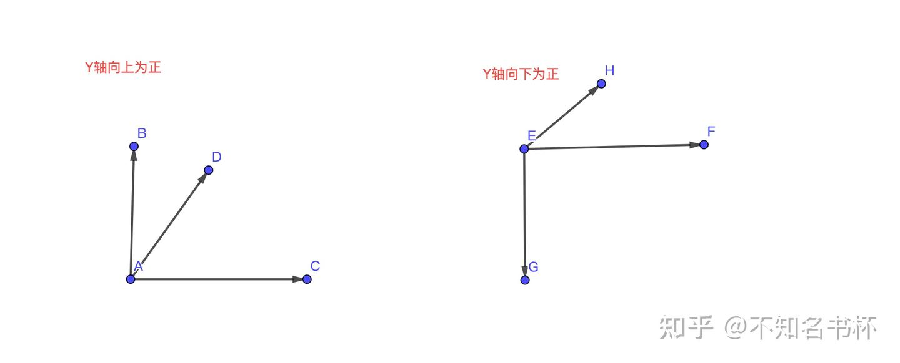
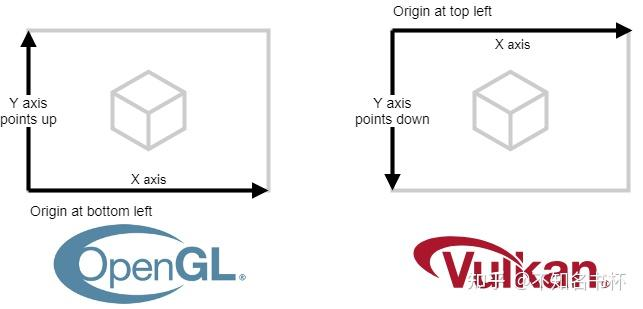
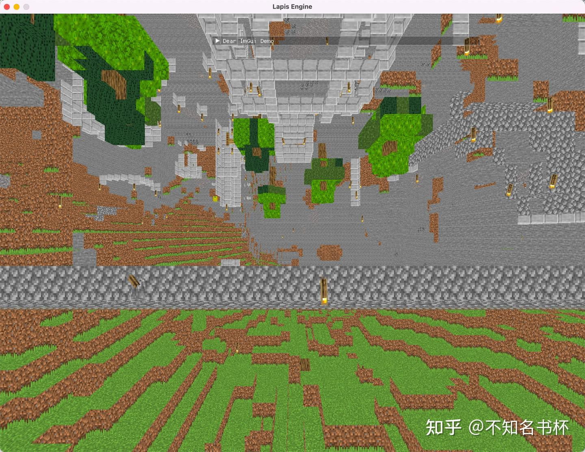
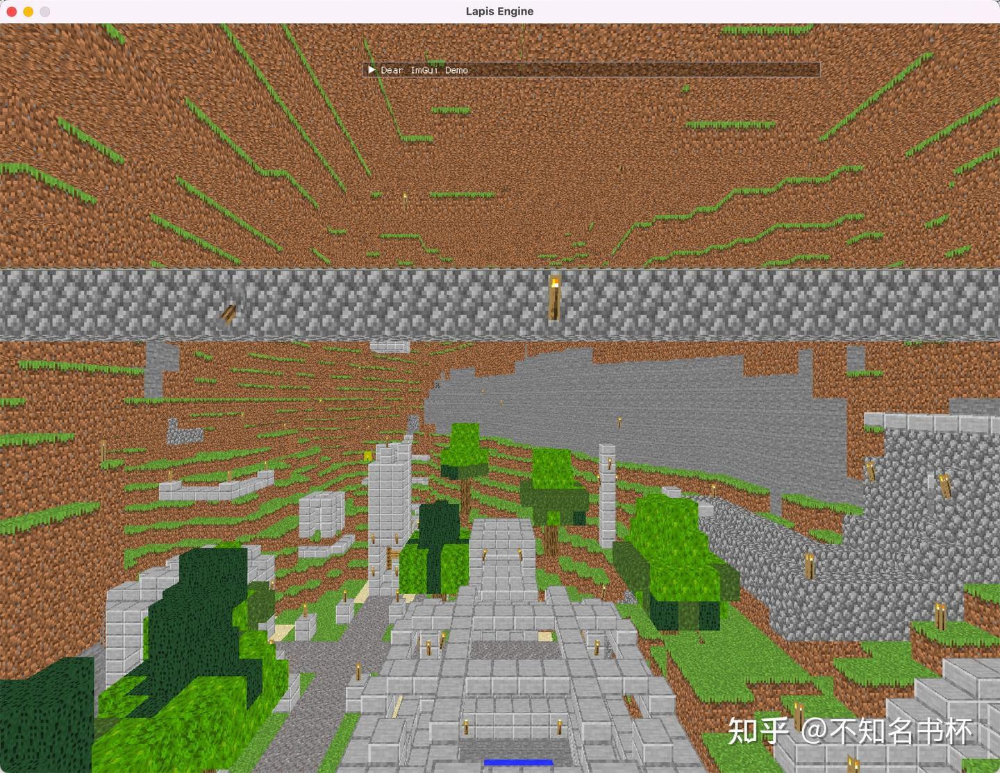

# Vulkan 坐标系差异解决方案

## 介绍

本文致力于比较各图形API坐标系差异，以及该差异造成的问题和在使用Vulkan面对该问题的解决方案。

## 不同图形API差异

首先在这里不会讨论各个图形API中[世界坐标系](https://zhida.zhihu.com/search?content_id=215703488&content_type=Article&match_order=1&q=世界坐标系&zhida_source=entity)和视线坐标系。因为这些坐标系是和硬件无关的。全部可以自己来决定，只要自己选择一种方案即可。在这里我们主要讨论NDC，FrameBuffer，Texture坐标系。

### NDC

在顶点完成了MVP转换并且透视除法之后就会来到NDC(Normalized device coordinate),无论在引擎中的坐标系是如何，在经历MVP变换之后，最终我们都需要统一到一个统一的坐标系下，也就是NDC空间，这个坐标系也可以理解为应用程序与GPU的接口。NDC空间的作用是为了实现屏幕坐标的转换的和硬件无关。方便后续我们将坐标映射到屏幕上。下面是各大图形API之间在NDC空间的差异。

- OpenGL, OpenGL ES and WebGL: Y轴向上为正，(-1,-1)在左下角。
- D3D12 和 Metal: 和OpenGL相同，Y轴向上为正，(-1,-1)在左下角。
- Vulkan：Y轴向下为正，(-1,-1)在左上角。

可以参考下面的我的灵魂绘图。这里就代表了图形API在NDC空间上的不同。在这里可以看出Vulkan在NDC空间的定义上与其他大部分图形API的不同。



### FrameBuffer

坐标在NDC空间当中完成视口变换(ViewPort)后就会到FrameBuffer中的坐标系中。

- OpenGL, OpenGL ES and WebGL: Y轴向上为正，原点(0,0)在左下角。
- D3D12 和 Metal: 和OpenGL相同，Y轴向下为正，原点(0,0)在左上角。
- Vulkan：Y轴向下为正，原点(0,0)在左上角。

可以用如下这个图来代表其差异:



### Texture

接下来就是纹理坐标在各大图形API中的不同

- OpenGL, OpenGL ES and WebGL: Y轴向上为正，原点(0,0)在左下角。
- D3D12 和 Metal: 和OpenGL相同，Y轴向下为正，原点(0,0)在左上角。
- Vulkan：Y轴向下为正，原点(0,0)在左上角。

## 差异带来的问题

### NDC

首先我们来看一个使用Vulkan渲染的场景,开启了如下功能:

- 顶点数据的Y值以Y轴向上为正
- 启用背面剔除(Back Culling)
- 设置三角形缠绕顺序为逆时针则为正面。

结果如下所示:



接下来是正常的渲染场景:



在上下的对比就可以很容易的判断出问题在哪:

- 渲染出的图像是翻过来的
- 剔除的是前面而不是背面

这就是NDC的手性的变换带来的问题。可以说Vulkan的NDC空间的方案确实特立独行。但是也有一定的合理性。那就是和后续FrameBuffer坐标是保持了一致性的。这会有一定的好处。当然关于NDC空间造成问题的解决方案会在后面总结。

### FrameBuffer

**OpenGL**

OpenGL虽然和其他的图形API不太一致，但是它是自洽的。在NDC和FrameBuffer中都保持了一致性，OpenGL的每一个原点都在图像的左下角，所以+Y轴总是向上的。但是每个窗口(Window)都是以+Y轴朝下。所以是OpenGL在最后展现图像时，为我们做了一个翻转。

**Metal**

Metal的做法是在NDC中+Y朝上，但在FrameBuffer中+Y朝下，FrameBuffer原点在左上方。 所以在在Metal中，会在视口转换(ViewPort Transform)有一个内置的Y flip，但是你无法在API层面上控制。但是在这里也是符合窗口坐标系的。一切都渲染正常。不过在你做一些屏幕空间在转换到视线空间的操作时，你需要注意+Y朝下这一点。

### Texture

在纹理坐标的使用中，需要注意纹理坐标的原点在哪。在这里可能需要进行多一步的处理。如下所示：

```cpp
uv.y = 1 - uv.y
```

## Vulkan NDC差异解决方案

介绍完各个API在坐标系差异带来的问题后，我们最后还是回归主题。如何去解决在Vulkan中NDC手性不一致带来的问题，分为下面三个方案。

- 在Shader中翻转
- 翻转投影矩阵
- 使用Vulkan的扩展,可以设置ViewPort为负数，并且设置ViewPort的Y值，便可完成翻转。

### 方案一

第一个方案在shader中翻转，我们可以考虑在顶点Shader里面进行翻转，在顶点Shader里面，我们只需要对顶点输入的时候做一次转换，将顶点坐标以及附带的矢量(法线之类)一起翻转，然后将包装之后的属性提供出来使用。如下所示：

```cpp
gl_Position.y = -gl_Position.y;
```

该方案缺点:

- 在集成不同的图形API中比较麻烦,并且不了解的人会一头雾水。
- 在做一些屏幕空间算法的时候，比如从屏幕[空间转换](https://zhida.zhihu.com/search?content_id=215703488&content_type=Article&match_order=1&q=空间转换&zhida_source=entity)为视线空间，还需要再翻转一次才能够计算正确。

### 方案二

翻转投影矩阵，我们可以让我们的投影矩阵Projection Matrix进行垂直翻转，处理也很简单，Y轴缩放乘以-1即可。

```cpp
pro[1][1] *= -1;
```

该方案缺点:

- 三角形剔除问题，因为我们进行了垂直翻转，那么我们的三角形缠绕顺序就变了，以前是顺时针的现在就变成了逆时针。然而背面剔除需要根据此为判断，因为相应的背面剔除设置也需要修改。
- 顶点属性问题，投影矩阵的翻转是只针对顶点坐标，但是对于法线等顶点属性是没有翻转的。那么跟顶点相关的向量属性也要一并翻转。这种方式处理起来就异常麻烦了，可能整个引擎架构都需要随之调整。

### 方案三

就是使用Vulkan提供的VK_KHR_maintenance1扩展。在这个在Vulkan 1.1就已经纳入核心规范中了，如果是Vulkan1.0则需要显式启用。需要做的修改如下所示:

```cpp
forwardPipeLine.viewport.x = 0.0f;
forwardPipeLine.viewport.y = swapchainExtent.height;
forwardPipeLine.viewport.width = (float)swapchainExtent.width;
forwardPipeLine.viewport.height = -(float)swapchainExtent.height;
```

这个方案也是在上面正常渲染使用的方案。可以使用Vulkan和OpenGL、Metal、DirectX,保持一致。在处理跨平台的问题上更加得心应手。并且如果你也有一些常用的库，比如模型解析库，解析出来的模型坐标系已经是跟左手细对应上了，结果现在解析出来放到Vulkan里面却发现模型翻转了。只是[静态模型](https://zhida.zhihu.com/search?content_id=215703488&content_type=Article&match_order=1&q=静态模型&zhida_source=entity)其实还好处理，关键麻烦的是我们还有[骨骼动画](https://zhida.zhihu.com/search?content_id=215703488&content_type=Article&match_order=1&q=骨骼动画&zhida_source=entity)，还涉及到骨骼是不是需要翻转，翻转了之后能不能用等等问题。所以使用这个扩展也可以减少各种库迁移的问题。

## References

[https://github.com/gpuweb/gpuweb/issues/416](https://link.zhihu.com/?target=https%3A//github.com/gpuweb/gpuweb/issues/416)

[VulkanDemos/NDC.md at master · BobLChen/VulkanDemos](https://link.zhihu.com/?target=https%3A//github.com/BobLChen/VulkanDemos/blob/master/examples/2_Triangle/NDC.md)

[Vulkan集成：图形API坐标系对比及解决方案](https://zhuanlan.zhihu.com/p/339295068)

[https://www.saschawillems.de/blog/2019/03/29/flipping-the-vulkan-viewport/](https://link.zhihu.com/?target=https%3A//www.saschawillems.de/blog/2019/03/29/flipping-the-vulkan-viewport/)

[Keeping the Blue Side Up: Coordinate Conventions for OpenGL, Metal and Vulkan](https://link.zhihu.com/?target=http%3A//hacksoflife.blogspot.com/2019/04/keeping-blue-side-up-coordinate.html)