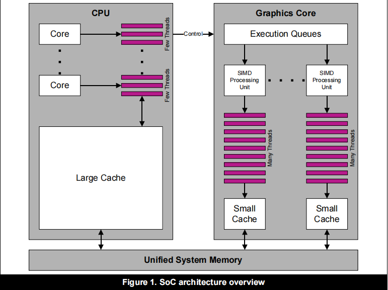
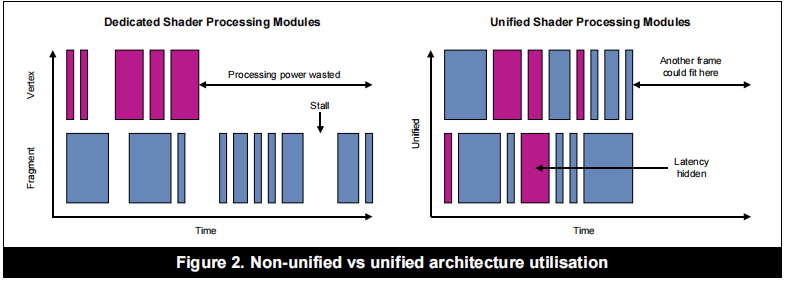
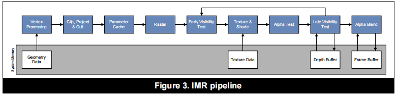
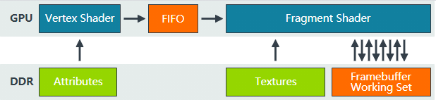
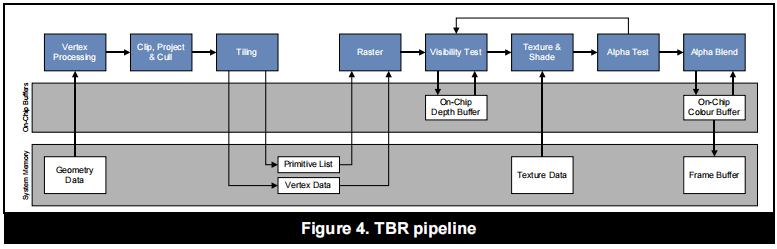
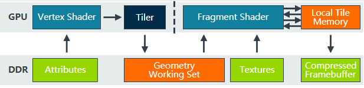
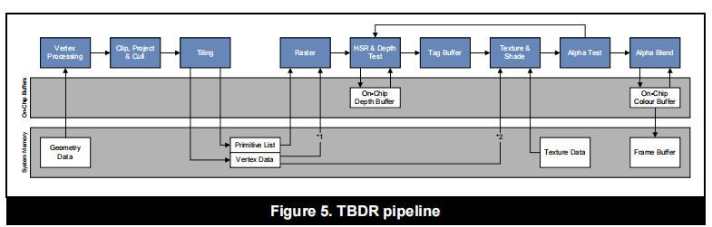

# Tile-Based Rendering学习笔记

## **现代移动端图形[体系结构](https://zhida.zhihu.com/search?content_id=175622381&content_type=Article&match_order=1&q=体系结构&zhida_source=entity)的概述**

现代SoC通常会同时集成CPU和GPU。

CPU被用于处理需要低内存延迟的序列、大量分支的数据集，其晶体管用于流控制和数据缓存。

GPU为处理大型，未分支的数据集，如3D渲染。晶体管专用于寄存器和[算术逻辑单元](https://zhida.zhihu.com/search?content_id=175622381&content_type=Article&match_order=1&q=算术逻辑单元&zhida_source=entity)，而不是数据缓存和[流控制](https://zhida.zhihu.com/search?content_id=175622381&content_type=Article&match_order=2&q=流控制&zhida_source=entity)。




## **GPU的统一着色器架构和非统一着色器结构**

在早期的GPU，顶点着色器和像素着色器的硬件结构是独立的，它们各有各的寄存器、运算单元等部件。然而独立的VS与PS势必会造成相对的不平衡，例如一个模型在较远位置时对VS的需求较多而PS的需求较少，在近处时相反，不平衡就势必会造成性能的冗余，为了解决VS和PS之间的不平衡，引入了统一[着色器架构](https://zhida.zhihu.com/search?content_id=175622381&content_type=Article&match_order=2&q=着色器架构&zhida_source=entity)（Unified shader Architecture）。此架构的GPU的VS和PS用的都是相同的Core。也就是，同一个Core既可以是VS又可以是PS。，下图展示了与非统一架构相比，统一着色器架构在性能和能耗商的优势




## **GPU的Immediate架构**

桌面GPU的架构一般被称为是Immediate架构。Immediate架构将渲染处理为一个严格的指令流，在每个Draw Call中对每一个图元按顺序执行顶点与[片段着色器](https://zhida.zhihu.com/search?content_id=175622381&content_type=Article&match_order=1&q=片段着色器&zhida_source=entity)。，每个对象一经提交就会立即穿过整个管线，在处理下一个对象之前进行转换、[光栅化](https://zhida.zhihu.com/search?content_id=175622381&content_type=Article&match_order=1&q=光栅化&zhida_source=entity)和着色。这种架构的弊端是很明显的，先进行绘制的对象可能被后边的对象覆盖，导致”Overdraw“的发生，为了避免这种现象，现代的immediate架构都会使用Early-Z技术对场景内的对象进行排序来减少Overdraw的发生。

忽略并行处理和管线，下列伪代码为这种架构的[high-level](https://zhida.zhihu.com/search?content_id=175622381&content_type=Article&match_order=1&q=high-level&zhida_source=entity)示例：

```python
for draw in renderPass:
    for primitive in draw:
        for vertex in primitive:
            execute_vertex_shader(vertex)
        if primitive not culled:
            for fragment in primitive:
                execute_fragment_shader(fragment)
```

下图为IMR pipline的流程图：




下

图展示了GPU数据流与内存的交互



## **Immediate架构的优点**

[顶点着色器](https://zhida.zhihu.com/search?content_id=175622381&content_type=Article&match_order=2&q=顶点着色器&zhida_source=entity)和其他几何相关的着色器的输出可以存在如上图所示的FIFO缓存区中，直到管线的下一个阶段（PS）准备好使用这些数据。我们可以看到在VS->PS的过程中GPU使用[内存带宽](https://zhida.zhihu.com/search?content_id=175622381&content_type=Article&match_order=1&q=内存带宽&zhida_source=entity)的时候很少，这也是该架构的优点。

## **Immediate架构的缺点**

正如上文所言，Immediate架构在VS->PS的过程中对内存带宽的使用很少，但是在PS->Framebuffer的过程中却反之。流中的每一个三角形都有可能覆盖屏幕的任何一个部分，这也就意味着Framebuffer Working Set（帧缓冲区[工作集](https://zhida.zhihu.com/search?content_id=175622381&content_type=Article&match_order=1&q=工作集&zhida_source=entity)）必须是整个[framebuffer](https://zhida.zhihu.com/search?content_id=175622381&content_type=Article&match_order=1&q=framebuffer&zhida_source=entity)的大小。例如一个1440p的设备，使用32位来表示颜色，32位来表示深度/模板缓冲区，那么FWS的大小极为30MB，这么大的FWS当然无法保存在[on-chip](https://zhida.zhihu.com/search?content_id=175622381&content_type=Article&match_order=1&q=on-chip&zhida_source=entity)上，那么只能存储在内存中，那么每一次进行深度/模板测试的时候GPU就必须对内存进行一次读写操作，由于每个片段有多个读-修改-写操作，因此在这个阶段内存带宽的负载是非常高的。

## **GPU的Tile-Based架构**

所谓Tile，就是将几何数据转换成小矩形区域的过程。光栅化和片段处理在每Tile的过程中进行。Tile-Based Rendering的目的是在最大限度地减少fragment shading期间GPU 需要的外部内存访问量,从而来节省内存带宽。TBR将屏幕分成小块，并在将每个小图块写入内存之前对每个小图块进行片段着色。为了实现这一点，GPU 必须预先知道哪些几何体属于这个tile.因此，TBR将每个渲染通道拆分为两个处理通道：

- 第一遍执行所有与几何相关的处理，并生成该tile专属的Primitive list，指示哪些[图元](https://zhida.zhihu.com/search?content_id=175622381&content_type=Article&match_order=2&q=图元&zhida_source=entity)在tile内。
- 第二遍逐tile进行光栅化并且进行Fragment shading，并在完成后将其写回内存。

以下为TBR的伪代码：

```python
python
# Pass one
for draw in renderPass:
    for primitive in draw:
        for vertex in primitive:
            execute_vertex_shader(vertex)
        if primitive not culled:
            append_tile_list(primitive)

# Pass two
for tile in renderPass:
    for primitive in tile:
        for fragment in primitive:
            execute_fragment_shader(fragment)
```

下图展示了TBR的基本流程




下图显示了TBR的硬件数据流和与内存的交互：



## **TBR的优势**

1.**节省带宽**

**TBR**的主要优点是**tile**仅占Framebuffer的一小部分。因此，可以将tile的颜色、深度和模板的整个work set存储到与 GPU shader核心紧密耦合的[On-chip](https://zhida.zhihu.com/search?content_id=175622381&content_type=Article&match_order=1&q=On-chip&zhida_source=entity)中。因此，GPU 进行[深度测试](https://zhida.zhihu.com/search?content_id=175622381&content_type=Article&match_order=1&q=深度测试&zhida_source=entity)和混合透明片段所需的Framebuffer数据无就不必要从内存中重复多次进行读写了，从而提升性能，节省能耗。

此外，部分深度/模板缓冲区，只需要在着色过程中存在，无需写回内存，TBR可以选择Discard掉这部分内容来进一步减少带宽使用（调用 OpenGL ES 2.0 中的`glDiscardFramebufferEXT`、OpenGL ES 3.0 中的 `glInvalidateFramebuffer`或使用 Vulkan 中的render pass的 `storeOp` 来进行具体设置）

2.**方便了部分算法的实现**

TBR启用了一些算法，否则这些算法的计算成本太高或带宽使用过高。

tile足够小，于是可以在内存中本地存储足够多的sample，以实现MSAA。因此，硬件可以在tile写回内存期间将多个样本resolve，而无需单独的resolve pass。

传统的Defer-Rendering将使用多[渲染目标](https://zhida.zhihu.com/search?content_id=175622381&content_type=Article&match_order=1&q=渲染目标&zhida_source=entity) (MRT) 渲染来实现延迟照明，将每个像素的多个中间值写回主内存，然后在第二遍中重新读取它们。而在TBR中片段着色器以编程方式访问由先前片段存储在帧缓冲区中的值可以对Defer-Rendering进行优化。

## **TBR的问题与PowerVR的TBDR**

虽然TBR改进了IMR的设计，但是本质上其并没有解决OverDraw。渲染每个tile时，将按提交顺序处理几何图形。会被遮挡的片元依旧将被处理，从而导致冗余的颜色计算和纹理数据提取。Early-Z技术可以用来减少overdraw，但是与IMR一样，应用程序必须进行排序。

PowerVR在光栅化之后增加了一步叫做HSR(Hidden Surface Removal 隐藏表面消除)的步骤，其大致原理如下：

当一个像素通过了Early-Z准备执行PS进行绘制前，先不画，只记录标记这个像素归哪个图元来画。等到这个Tile上所有的图元都处理完了，最后再真正的开始绘制每个图元中被标记上能绘制的像素点。

由于所有操作都是在片上进行的，所以代价极小，最终实现零Overdraw。




