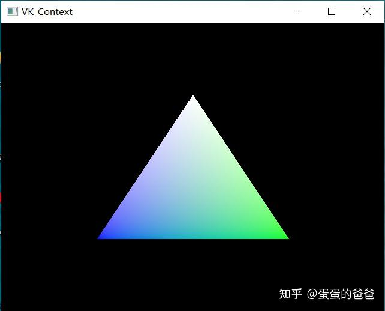

# Vulkan从入门到精通1

Vulkan是一个跨平台的2D和3D绘图应用程序接口（API），最早由[科纳斯](https://zhida.zhihu.com/search?content_id=183772641&content_type=Article&match_order=1&q=科纳斯&zhida_source=entity)组织在2015年游戏开发者大会（GDC）上发表。号称是glNext。旨在提供更低的CPU开销与更直接的GPU控制，其理念大致与[Direct3D 12](https://zhida.zhihu.com/search?content_id=183772641&content_type=Article&match_order=1&q=Direct3D+12&zhida_source=entity)和Mantle类似。

上周末花了2天时间看了下Vulkan，感觉这个不大好上手；如果3.0前的OpenGL上手难易程序是20，3.3以后OpenGL是30，Vulkan上手难易程度最少有100。难度主要体现在，很多之前图形API内部对Pipeline的操作现在都暴露给了用户，需要用户显式的设置管线。用户的控制粒度更细，程序能跑出更好的性能（另外一个原因是对数据的处理都在显存上进行）。以笔者的VivoBook15X + MMX330配置，绘制一个640x480窗口三角形帧率能达到1200左右。

通过浏览

[https://github.com/Overv/VulkanTutorial.gitgithub.com/Overv/VulkanTutorial.git](https://link.zhihu.com/?target=https%3A//github.com/Overv/VulkanTutorial.git)

上面的29讲，结合之前写mesa umd驱动，阅读[mesa](https://zhida.zhihu.com/search?content_id=183772641&content_type=Article&match_order=2&q=mesa&zhida_source=entity)源码，外加OpenGL经验算是对Vulka入了门。

Vulkan中的主要的概念

- Device 一个Device就代表着一个你系统中的物理GPU。它的功能除了让你可以选择用来渲染（或者计算）的GPU以外，主要功能就是为你提供其他GPU上的资源，例如所有要用到显存的资源
- Pipleline 一个Pipeline包含了传统API中大部分的状态和设定。只不过Pipeline是需要事先创建好的，这样所有的[状态组合](https://zhida.zhihu.com/search?content_id=183772641&content_type=Article&match_order=1&q=状态组合&zhida_source=entity)的验证和编译都可以在初始化的时候完成，运行时不会再因为这些操作有任何性能上的浪费。但正是因为这一点，如果你不同的Pass需要不同的状态，你需要预先创造多个不同的Pipeline。
- Buffer - Buffer是所有我们所熟悉的Vertex Buffer, Index Buffer, Uniform Buffer等等的统称。而且一个Buffer的用途非常多样。在Vulkan中需要特别注意Buffer是从什么类型的内存中分配的，有的类型CPU可以访问，有的则不行。有的类型会在CPU上被缓存。
- Image - Image在Vulkan中代表所有具有像素结构的数组，可以用于表示纹理，Render Target等等。和其他组件一样，Image也需要在创建的时候指定使用它的模式，例如Vulkan里有参数指定Image的内存Layout，可以是Linear，也可以是Tiled Linear便于纹理Filter。
- Command Buffer - Command Buffer就是渲染本身所需要的行为。在Vulkan里，没有任何API允许你直接的，立即的像GPU发出任何命令。所有的命令，包括渲染的Draw Call，计算的调用，甚至内存的操作例如资源的拷贝，都需要通过App自己创建的Command Buffer。Vulkan对于Command Buffer有特有的Flag，让程序制定这些Command只会被调用一次（例如某些资源的初始化），亦或者应该被缓存从而重复调用多次（例如渲染循环中的某个Pass）。另一个值得注意的是，为了让驱动能更加简易的优化这些Command的调用，没有任何渲染状态会在Command Buffer之间继承下来。每一个Command Buffer都需要显式的绑定它所需要的所有渲染状态，Shader，和Descriptor Set等等。这和传统API中，只要你不改某个状态，某个状态就一直不会变，这一点很不一样.
- Command Buffer Pool - Command Buffer Pool是一个需要注意的多线程相关的组件。它是Command Buffer的父亲组件，负责分配Command Buffer。Command Buffer相关的操作会对其对应的Command Buffer Pool里造成一定的工作，例如内存分配和释放等等。因为多个线程会并行的进行Command Buffer相关的操作，这个时候如果所有的Command Buffer都来自同一个Command Buffer Pool的话，这时Command Buffer Pool内的操作一定要在线程间被同步。
- Queue - 是Vulkan中唯一给GPU递交任务的渠道。Vulkan将Queue设计成了完全透明的对象，所以在驱动里没有任何其他的隐藏Queue，也不会有任何的Synchronization发生。在Vulkan中，给GPU递交任务不再依赖于任何所谓的绑定在单一线程上的Context，Queue的API极其简单，你向它递交任务（Command Buffer），然后如果有需要的话，你可以等待当前Queue中的任务完成。这些Synchronization操作是由Vulkan提供的各种同步组件完成的。例如Samaphore可以让你同步Queue内部的任务，程序无法干预。Fence和Event则可以让程序知道某个Queue中指定的任务已经完成。所有这些组件组合起来，使得基于Command Buffer和Queue递交任务的Vulkan非常易于编写[多线程程序](https://zhida.zhihu.com/search?content_id=183772641&content_type=Article&match_order=1&q=多线程程序&zhida_source=entity)。

从Vulkan程序工作流程看，步骤如下

1. 创建窗口
2. 实例化Vulkan Instance - 一个程序可以有多个
3. 创建 Surface
4. 查找物理驱动
5. 查找逻辑驱动
6. 创建管线缓存
7. 生成swap chain
8. 创建image view
9. 生成render pass
10. Frame Buffers
11. Command Pool
12. Command Buffer
13. 创建同步对象
14. 创建管线

渲染过程中的流程是

1. 重新创建管线 - 条件执行
2. 同步Fence - vkWaitForFences
3. 获取[交换链](https://zhida.zhihu.com/search?content_id=183772641&content_type=Article&match_order=1&q=交换链&zhida_source=entity)图像 - vkAcquireNextImageKHR
4. resetFence inFlightFences - 如何翻译?
5. 提交command - vkQueueSubmit
6. vkQueuePresentKHR -请求当前图像
7. 更新当前帧索引

笔者第一个出图的是一个三角形如下




主程序代码如下

```objective-c++
#include <iostream>
#include "VK_Context.h"

using namespace std;

const std::vector<VK_Vertex> vertices1 = {
    {{0.0f, -0.5f, 0.0f}, {1.0f, 1.0f, 1.0f, 1.0f}, {0.0f, 0.0f, 0.0f}, {0.0f, 0.0f}},
    {{0.5f, 0.5f, 0.0f}, {0.0f, 1.0f, 0.0f, 1.0f}, {0.0f, 0.0f, 0.0f}, {0.0f, 0.0f}},
    {{-0.5f, 0.5f, 0.0f}, {0.0f, 0.0f, 1.0f, 1.0f}, {0.0f, 0.0f, 0.0f}, {0.0f, 0.0f}}
};

VK_Context* context = nullptr;

int main()
{
    VK_ContextConfig config;
    config.debug = false;

    context = createVkContext(config);
    context->createWindow(640, 480, true);

    VK_Context::VK_Config vkConfig;
    context->initVulkan(vkConfig);

    auto shaderSet = context->createShaderSet();
    shaderSet->addShader("shader/vertex/vert.spv", VK_SHADER_STAGE_VERTEX_BIT);
    shaderSet->addShader("shader/vertex/frag.spv", VK_SHADER_STAGE_FRAGMENT_BIT);

    if(!shaderSet->isValid()) {
        std::cerr << "invalid shaderSet" << std::endl;
        shaderSet->release();
        context->release();
        return -1;
    }

    context->initPipeline(shaderSet);

    auto buffer = context->createBuffer(vertices1);
    context->addBuffer(buffer);

    context->createCommandBuffers();

    context->run();
    context->release();

    return 0;
}
```

笔者对Vulkan做了封装处理，全代码请访问

[https://github.com/ccsdu2004/vulkan-cpp-demogithub.com/ccsdu2004/vulkan-cpp-demo](https://link.zhihu.com/?target=https%3A//github.com/ccsdu2004/vulkan-cpp-demo)