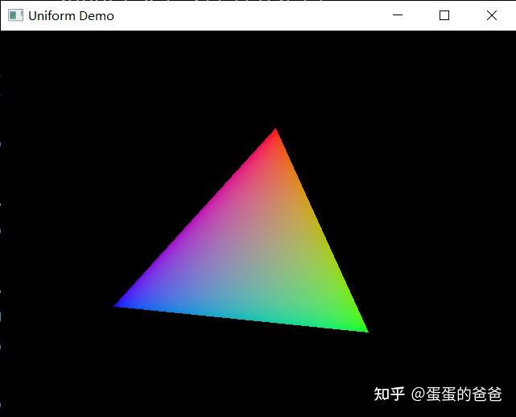

# Vulkan从入门到精通6-使用uniform让三角形动起来

上篇讲的是shader包装，本篇来聊聊uniform。

先放着色器程序 - 顶点

```glsl
#version 450
layout(location = 0) in vec3 position;
layout(location = 1) in vec4 color;
layout(location = 0) out vec4 fragColor;

layout(binding = 0) uniform UniformBufferObject {
    mat4 model;
} mvp;

void main() {
    gl_Position = mvp.model * vec4(position, 1.0);
    fragColor = color;
}
```

片段

```glsl
#version 450
layout(location = 0) in vec4 fragColor;
layout(location = 0) out vec4 outColor;

void main() {
    outColor = fragColor;
}
```

顶点着色起传入attribute次序类型和之前写的VK_Vertex一致。

如果把uniform封装下，那它需要对外提供以下几个功能

- uniform 大小
- uniform 值设置
- 更新uniform
- uniform和VkPipeline的绑定
- uniform随时更新，可能还需要一个供写uniform值的回调接口


创建完管线就可以引入uniform部分了，大致步骤是

1.根据交换链图形个数，生成N个VkDeviceMemory和VkBuffer，对初始化生成，代码是

```cpp
bool VK_ContextImpl::createBuffer(VkDeviceSize size, VkBufferUsageFlags usage, VkMemoryPropertyFlags properties, VkBuffer & buffer, VkDeviceMemory & bufferMemory)
{
    VkBufferCreateInfo bufferInfo{};
    bufferInfo.sType = VK_STRUCTURE_TYPE_BUFFER_CREATE_INFO;
    bufferInfo.size = size;
    bufferInfo.usage = usage;
    bufferInfo.sharingMode = VK_SHARING_MODE_EXCLUSIVE;
    bufferInfo.pNext = nullptr;

    if (vkCreateBuffer(device, &bufferInfo, nullptr, &buffer) != VK_SUCCESS) {
        std::cerr << "failed to create buffer!" << std::endl;
        return false;
    }

    VkMemoryRequirements memRequirements;
    vkGetBufferMemoryRequirements(device, buffer, &memRequirements);

    VkMemoryAllocateInfo allocInfo{};
    allocInfo.sType = VK_STRUCTURE_TYPE_MEMORY_ALLOCATE_INFO;
    allocInfo.allocationSize = memRequirements.size;
    allocInfo.memoryTypeIndex = findMemoryType(memRequirements.memoryTypeBits, properties);
    allocInfo.pNext = nullptr;

    if (vkAllocateMemory(device, &allocInfo, nullptr, &bufferMemory) != VK_SUCCESS) {
        std::cerr << "failed to allocate buffer memory!" << std::endl;
        return false;
    }

    vkBindBufferMemory(device, buffer, bufferMemory, 0);
    return true;
}
```

第一个传入参数size是uniform大小，如果是一个[mat4x4](https://zhida.zhihu.com/search?content_id=184997274&content_type=Article&match_order=1&q=mat4x4&zhida_source=entity)，则大小是sizeof(GLfloat)*16

2.创建command buffer前需要从VkDescriptorSetLayout和VkDescriptorPool构建N个VkDescriptorSet，之后逐个调用vkUpdateDescriptorSets更新VkWriteDescriptorSet。

```cpp
void VK_UniformBufferImpl::initDescriptorSets(VkDescriptorSetLayout descriptorSetLayout, VkDeviceSize swapImageChainSize, VkDescriptorPool descriptorPool)
{
    std::vector<VkDescriptorSetLayout> layouts(swapImageChainSize, descriptorSetLayout);
    VkDescriptorSetAllocateInfo allocInfo{};
    allocInfo.sType = VK_STRUCTURE_TYPE_DESCRIPTOR_SET_ALLOCATE_INFO;
    allocInfo.descriptorPool = descriptorPool;
    allocInfo.descriptorSetCount = swapImageChainSize;
    allocInfo.pSetLayouts = layouts.data();
    allocInfo.pNext = nullptr;

    descriptorSets.resize(swapImageChainSize);
    if (vkAllocateDescriptorSets(device, &allocInfo, descriptorSets.data()) != VK_SUCCESS) {
        std::cout << "failed to allocate descriptor sets!" << std::endl;
    }

    for (size_t i = 0; i < swapImageChainSize; i++) {
        VkDescriptorBufferInfo bufferInfo{};
        bufferInfo.buffer = uniformBuffers[i];
        bufferInfo.offset = 0;
        bufferInfo.range = bufferSize;

        std::array<VkWriteDescriptorSet, 1> descriptorWrites;
        descriptorWrites[0].sType = VK_STRUCTURE_TYPE_WRITE_DESCRIPTOR_SET;
        descriptorWrites[0].dstSet = descriptorSets[i];
        descriptorWrites[0].dstBinding = 0;
        descriptorWrites[0].dstArrayElement = 0;
        descriptorWrites[0].descriptorType = VK_DESCRIPTOR_TYPE_UNIFORM_BUFFER;
        descriptorWrites[0].descriptorCount = 1;
        descriptorWrites[0].pBufferInfo = &bufferInfo;
        descriptorWrites[0].pNext = nullptr;

        vkUpdateDescriptorSets(device, descriptorWrites.size(), descriptorWrites.data(), 0, nullptr);
    }
}
```

3. 创建command buffer过程中使用vkCmdBindDescriptorSets绑定描述符集

```cpp
vkCmdBindDescriptorSets(commandBuffer, VK_PIPELINE_BIND_POINT_GRAPHICS, pipelineLayout, 0, 1, &descriptorSets[index], 0, nullptr);
```

4.在渲染过程中更新uniform后使用VkDeviceMemory把用户uniform数据同步到GPU即可

```cpp
    void* gpuData;
    vkMapMemory(device, uniformBuffersMemory[index], 0, bufferSize, 0, &gpuData);
    memcpy(gpuData, userData, bufferSize);
    vkUnmapMemory(device, uniformBuffersMemory[index]);
```

5.最后别忘了清理Buffer和释放GPU内存。

```cpp
void VK_UniformBufferImpl::cleanup()
{
    for(size_t i = 0; i < uniformBuffers.size(); i++)
        vkDestroyBuffer(device, uniformBuffers[i], nullptr);

    for(size_t i = 0; i < uniformBuffers.size(); i++)
        vkFreeMemory(device, uniformBuffersMemory[i], nullptr);
}
```

最后封装的Uniform对外提供的接口如下

```cpp
class VK_UniformBuffer : public VK_Deleter
{
public:
    virtual void initDescriptorSets(VkDescriptorSetLayout descriptorSetLayout, VkDeviceSize swapImageChainSize, VkDescriptorPool pool) = 0;
    virtual void setWriteDataCallback(std::function<uint32_t(char*&, uint32_t)> cb) = 0;
    virtual void bindDescriptorSets(uint32_t index, VkCommandBuffer commandBuffer, VkPipelineLayout pipelineLayout) = 0;
    virtual void update(uint32_t index) = 0;
};
```

放一个例子截图



对应例子是

```cpp
const std::vector<VK_Vertex> vertices = {
    {{0.0f, -0.5f, 0.0f}, {1.0f, 0.0f, 0.0f, 0.5f}, {0.0f, 0.0f, 0.0f}, {0.0f, 0.0f}},
    {{0.5f, 0.5f, 0.0f}, {0.0f, 1.0f, 0.0f, 0.5f}, {0.0f, 0.0f, 0.0f}, {0.0f, 0.0f}},
    {{-0.5f, 0.5f, 0.0f}, {0.0f, 0.0f, 1.0f, 0.5f}, {0.0f, 0.0f, 0.0f}, {0.0f, 0.0f}}
};

const std::vector<uint16_t> indices = {
    0, 1, 2
};

VK_Context* context = nullptr;

uint32_t updateUniformBufferData(char* & data, uint32_t size)
{
    static auto startTime = std::chrono::high_resolution_clock::now();
    auto currentTime = std::chrono::high_resolution_clock::now();
    float time = std::chrono::duration<float, std::chrono::seconds::period>(currentTime - startTime).count();
    glm::mat4 model = glm::rotate(glm::mat4(1.0f), time * glm::radians(30.0f), glm::vec3(0.0f, 0.0f, 1.0f));
    memcpy(data, &model[0][0], size);
    return sizeof(model);
}

int main()
{
    VK_ContextConfig config;
    config.debug = true;
    config.name = "Uniform Demo";

    context = createVkContext(config);
    context->createWindow(640, 480, true);

    VK_Context::VK_Config vkConfig;
    context->initVulkan(vkConfig);

    auto shaderSet = context->createShaderSet();
    shaderSet->addShader("shader/mvp/vert.spv", VK_SHADER_STAGE_VERTEX_BIT);
    shaderSet->addShader("shader/mvp/frag.spv", VK_SHADER_STAGE_FRAGMENT_BIT);

    if(!shaderSet->isValid()) {
        std::cerr << "invalid shaderSet" << std::endl;
        shaderSet->release();
        context->release();
        return -1;
    }

    context->initPipeline(shaderSet);

    auto buffer = context->createVertexBuffer(vertices, indices);
    context->addBuffer(buffer);

    auto ubo = context->createUniformBuffer(sizeof(GLfloat) * 16);
    ubo->setWriteDataCallback(updateUniformBufferData);
    context->setUniformBuffer(ubo);

    context->createCommandBuffers();

    context->run();
    context->release();

    return 0;
}
```

相关的几个VulkanAPI

- vkAllocateDescriptorSets - 分配描述符集
- vkFreeDescriptorSets - 释放
- vkCmdBindDescriptorSets - 绑定
- vkUpdateDescriptorSets - 更新

代码仓库 -

[https://github.com/ccsdu2004github.com/ccsdu2004](https://link.zhihu.com/?target=https%3A//github.com/ccsdu2004)