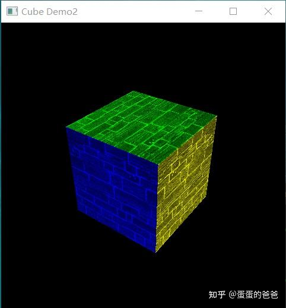

# Vulkan从入门到精通15-绘制一个立方体2

上篇绘制了一个立方体，在每面贴张纹理的基础上，每面再加上不同的颜色，就可以画出一个带颜色的立方体。

vert shader 如下

```glsl
#version 450

layout(binding = 0) uniform UniformBufferObject {
    mat4 model;
} ubo;

layout(location = 0) in vec3 inPosition;
layout(location = 1) in vec2 inTexCoord;
layout(location = 2) in vec4 inColor;
layout(location = 0) out vec2 fragTexCoord;
layout(location = 1) out vec4 outColor;

void main() {
    gl_Position = ubo.model * vec4(inPosition, 1.0);
    fragTexCoord = inTexCoord;
	outColor = inColor;
}
```

frag shader

```glsl
#version 450
layout(binding = 1) uniform sampler2D texSampler;
layout(location = 0) in vec2 fragTexCoord;
layout(location = 1) in vec4 inColor;
layout(location = 0) out vec4 outColor;

void main() {
    outColor = texture(texSampler, fragTexCoord)*inColor;
}
```

[主程序](https://zhida.zhihu.com/search?content_id=186893574&content_type=Article&match_order=1&q=主程序&zhida_source=entity)和上篇不同的是 增加了

```cpp
 shaderSet->appendAttributeDescription(2, sizeof (float) * 4);
```

以及下面这句

```cpp
auto buffer = context->createVertexBuffer(vertices, 9);
```

表明一个顶点有9个元素 - 3个位置信息2个[纹理坐标](https://zhida.zhihu.com/search?content_id=186893574&content_type=Article&match_order=1&q=纹理坐标&zhida_source=entity)以及4个颜色信息

出图如下




