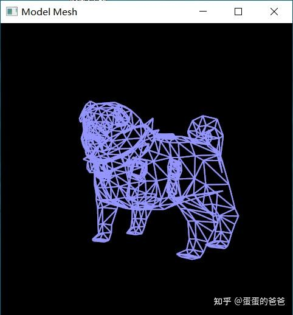

# Vulkan从入门到精通23-管线动态状态

本文来谈谈管线的。之前介绍过要改变管线状态，需要重新创建之。对于一些特别常见状态的变化，如果重新创建管线代价太大，所以引出了动态管线的概念。

创建管线前指定那些状态是动态的，创建管道后，就可以改变相应的状态，而不需要重建管线。

具体做法是创建管线时对应的 VkGraphicsPipelineCreateInfo的字段pDynamicState指定动态状态描述符。

此描述符相关函数是

```cpp
VkPipelineDynamicStateCreateInfo VK_ContextImpl::createDynamicStateCreateInfo(
    VkPipelineDynamicStateCreateFlags flags)
{
    VkPipelineDynamicStateCreateInfo pipelineDynamicStateCreateInfo{};
    pipelineDynamicStateCreateInfo.sType = VK_STRUCTURE_TYPE_PIPELINE_DYNAMIC_STATE_CREATE_INFO;
    pipelineDynamicStateCreateInfo.pDynamicStates = vkDynamicStates.data();
    pipelineDynamicStateCreateInfo.dynamicStateCount = static_cast<uint32_t>(vkDynamicStates.size());
    pipelineDynamicStateCreateInfo.flags = flags;
    return pipelineDynamicStateCreateInfo;
}
```

vkDynamicStates是动态状态数组指针

vulkan中动态状态具体有

```text
typedef enum VkDynamicState {
    VK_DYNAMIC_STATE_VIEWPORT = 0,
    VK_DYNAMIC_STATE_SCISSOR = 1,
    VK_DYNAMIC_STATE_LINE_WIDTH = 2,
    VK_DYNAMIC_STATE_DEPTH_BIAS = 3,
    VK_DYNAMIC_STATE_BLEND_CONSTANTS = 4,
    VK_DYNAMIC_STATE_DEPTH_BOUNDS = 5,
    VK_DYNAMIC_STATE_STENCIL_COMPARE_MASK = 6,
    VK_DYNAMIC_STATE_STENCIL_WRITE_MASK = 7,
    VK_DYNAMIC_STATE_STENCIL_REFERENCE = 8,
    VK_DYNAMIC_STATE_VIEWPORT_W_SCALING_NV = 1000087000,
    VK_DYNAMIC_STATE_DISCARD_RECTANGLE_EXT = 1000099000,
    VK_DYNAMIC_STATE_SAMPLE_LOCATIONS_EXT = 1000143000,
    VK_DYNAMIC_STATE_RAY_TRACING_PIPELINE_STACK_SIZE_KHR = 1000347000,
    VK_DYNAMIC_STATE_VIEWPORT_SHADING_RATE_PALETTE_NV = 1000164004,
    VK_DYNAMIC_STATE_VIEWPORT_COARSE_SAMPLE_ORDER_NV = 1000164006,
    VK_DYNAMIC_STATE_EXCLUSIVE_SCISSOR_NV = 1000205001,
    VK_DYNAMIC_STATE_FRAGMENT_SHADING_RATE_KHR = 1000226000,
    VK_DYNAMIC_STATE_LINE_STIPPLE_EXT = 1000259000,
    VK_DYNAMIC_STATE_CULL_MODE_EXT = 1000267000,
    VK_DYNAMIC_STATE_FRONT_FACE_EXT = 1000267001,
    VK_DYNAMIC_STATE_PRIMITIVE_TOPOLOGY_EXT = 1000267002,
    VK_DYNAMIC_STATE_VIEWPORT_WITH_COUNT_EXT = 1000267003,
    VK_DYNAMIC_STATE_SCISSOR_WITH_COUNT_EXT = 1000267004,
    VK_DYNAMIC_STATE_VERTEX_INPUT_BINDING_STRIDE_EXT = 1000267005,
    VK_DYNAMIC_STATE_DEPTH_TEST_ENABLE_EXT = 1000267006,
    VK_DYNAMIC_STATE_DEPTH_WRITE_ENABLE_EXT = 1000267007,
    VK_DYNAMIC_STATE_DEPTH_COMPARE_OP_EXT = 1000267008,
    VK_DYNAMIC_STATE_DEPTH_BOUNDS_TEST_ENABLE_EXT = 1000267009,
    VK_DYNAMIC_STATE_STENCIL_TEST_ENABLE_EXT = 1000267010,
    VK_DYNAMIC_STATE_STENCIL_OP_EXT = 1000267011,
    VK_DYNAMIC_STATE_VERTEX_INPUT_EXT = 1000352000,
    VK_DYNAMIC_STATE_PATCH_CONTROL_POINTS_EXT = 1000377000,
    VK_DYNAMIC_STATE_RASTERIZER_DISCARD_ENABLE_EXT = 1000377001,
    VK_DYNAMIC_STATE_DEPTH_BIAS_ENABLE_EXT = 1000377002,
    VK_DYNAMIC_STATE_LOGIC_OP_EXT = 1000377003,
    VK_DYNAMIC_STATE_PRIMITIVE_RESTART_ENABLE_EXT = 1000377004,
    VK_DYNAMIC_STATE_COLOR_WRITE_ENABLE_EXT = 1000381000,
    VK_DYNAMIC_STATE_MAX_ENUM = 0x7FFFFFFF
} VkDynamicState;
```

创建管线时指定状态后，之后在开始[命令缓存](https://zhida.zhihu.com/search?content_id=189281276&content_type=Article&match_order=1&q=命令缓存&zhida_source=entity)后就可以动态设置状态了，比如设置线宽 - vkCmdSetLineWidth。

在本项目里是通过引入VK_DynamicState来封装对动态状态的调用的

```cpp
class VK_DynamicStateImpl : public VK_DynamicState
{
public:
    void apply(VkCommandBuffer buffer);
    void release()override;
    void applyDynamicViewport(const VkViewport& viewport)override;
    void applyDynamicScissor(const VkRect2D& scissor)override;
    void applyDynamicLineWidth(float lineWidth)override;
    void applyDynamicDepthBias(float depthBiasConstantFactor, float depthBiasClamp, float depthBiasSlopeFactor)override;
    void applyDynamicBlendConstants(const float blendConstants[4])override;
    void applyDynamicDepthBounds(float minDepthBounds, float maxDepthBounds)override;
    void applyDynamicStencilCompareMask(VkStencilFaceFlags faceMask, uint32_t compareMask)override;
    void applyDynamicStencilWriteMask(VkStencilFaceFlags faceMask, uint32_t writeMask)override;
    void applyDynamicStencilReference(VkStencilFaceFlags faceMask, uint32_t reference)override;
private:
    std::optional<VkViewport> viewport;
    std::optional<VkRect2D> scissor;
    std::optional<float> lineWidth = 1.0f;
    std::optional<glm::vec3> depthBias;
    std::optional<glm::vec4> blendConstant;
    std::optional<glm::vec2> depthBounds;
    std::optional<std::tuple<VkStencilFaceFlags, uint32_t>> stencilCompareMask;
    std::optional<std::tuple<VkStencilFaceFlags, uint32_t>> stencilWriteMask;
    std::optional<std::tuple<VkStencilFaceFlags, uint32_t>> stencilReferenceMask;
};
```

实现

```cpp
#include <VK_DynamicStateImpl.h>

void VK_DynamicStateImpl::apply(VkCommandBuffer buffer)
{
    if(viewport.has_value())
        vkCmdSetViewport(buffer, 0, 1, &viewport.value());

    if(scissor.has_value())
        vkCmdSetScissor(buffer, 0, 1, &scissor.value());

    if(lineWidth.has_value())
        vkCmdSetLineWidth(buffer, lineWidth.value());

    if(depthBias.has_value()) {
        auto value = depthBias.value();
        vkCmdSetDepthBias(buffer, value[0], value[1], value[2]);
    }

    if(blendConstant.has_value()) {
        auto value = blendConstant.value();
        vkCmdSetBlendConstants(buffer, &value[0]);
    }

    if(depthBounds.has_value()) {
        auto value = depthBounds.value();
        vkCmdSetDepthBounds(buffer, value[0], value[1]);
    }

    if(stencilCompareMask.has_value()) {
        auto value = stencilCompareMask.value();
        vkCmdSetStencilCompareMask(buffer, std::get<0>(value), std::get<1>(value));
    }

    if(stencilWriteMask.has_value()) {
        auto value = stencilWriteMask.value();
        vkCmdSetStencilWriteMask(buffer, std::get<0>(value), std::get<1>(value));
    }

    if(stencilReferenceMask.has_value()) {
        auto value = stencilReferenceMask.value();
        vkCmdSetStencilReference(buffer, std::get<0>(value), std::get<1>(value));
    }
}

void VK_DynamicStateImpl::release()
{
    delete this;
}

void VK_DynamicStateImpl::applyDynamicViewport(const VkViewport &inputViewport)
{
    viewport = inputViewport;
}

void VK_DynamicStateImpl::applyDynamicScissor(const VkRect2D &inputScissor)
{
    scissor = inputScissor;
}

void VK_DynamicStateImpl::applyDynamicLineWidth(float inputLineWidth)
{
    lineWidth = inputLineWidth;
}

void VK_DynamicStateImpl::applyDynamicDepthBias(float depthBiasConstantFactor, float depthBiasClamp, float depthBiasSlopeFactor)
{
    depthBias = glm::vec3(depthBiasConstantFactor, depthBiasClamp, depthBiasSlopeFactor);
}

void VK_DynamicStateImpl::applyDynamicBlendConstants(const float inputBlendConstants[4])
{
    blendConstant = glm::vec4(inputBlendConstants[0], inputBlendConstants[2], inputBlendConstants[3], inputBlendConstants[3]);
}

void VK_DynamicStateImpl::applyDynamicDepthBounds(float minDepthBounds, float maxDepthBounds)
{
    depthBounds = glm::vec2(minDepthBounds, maxDepthBounds);
}

void VK_DynamicStateImpl::applyDynamicStencilCompareMask(VkStencilFaceFlags faceMask, uint32_t compareMask)
{
    stencilCompareMask = std::make_tuple(faceMask, compareMask);
}

void VK_DynamicStateImpl::applyDynamicStencilWriteMask(VkStencilFaceFlags faceMask, uint32_t writeMask)
{
    stencilWriteMask = std::make_tuple(faceMask, writeMask);
}

void VK_DynamicStateImpl::applyDynamicStencilReference(VkStencilFaceFlags faceMask, uint32_t reference)
{
    stencilReferenceMask = std::make_tuple(faceMask, reference);
}
```


createCommandBuffer中

```text
        if (vkBeginCommandBuffer(commandBuffers[i], &beginInfo) != VK_SUCCESS) {
            std::cerr << "failed to begin recording command buffer!" << std::endl;
        }

        ...

        vkDynamicState->apply(commandBuffers[i]);
```

具体程序代码如下，以model-mesh为基础

```cpp
#include <iostream>
#include <cstring>
#include <chrono>
#include <glm/mat4x4.hpp>
#include <glm/gtx/transform.hpp>
#include "VK_UniformBuffer.h"
#include "VK_Context.h"
#include "VK_Image.h"
#include "VK_Texture.h"
#include "VK_DynamicState.h"

using namespace std;

VK_Context *context = nullptr;

uint32_t updateUniformBufferData(char *&data, uint32_t size)
{
    static auto startTime = std::chrono::high_resolution_clock::now();
    auto currentTime = std::chrono::high_resolution_clock::now();
    float time = std::chrono::duration<float, std::chrono::seconds::period>(currentTime - startTime).count();
    glm::mat4 model = glm::rotate(glm::mat4(1.0f), glm::radians(90.0f), glm::vec3(1.0f, 0.0f, 0.0f));
    model *= glm::rotate(glm::mat4(1.0f), time * glm::radians(30.0f), glm::vec3(0.0f, 1.0f, 0.0f));
    auto view = glm::lookAt(glm::vec3(0.0f, 4.0f, 0.0f), glm::vec3(0.0f, 0.0f, 0.0f), glm::vec3(0.0f, 0.0f, 1.0f));
    auto proj = glm::perspective(glm::radians(45.0f),
                                 context->getSwapChainExtent().width / (float)context->getSwapChainExtent().height, 0.1f, 10.0f);
    proj[1][1] *= -1;

    model = proj * view * model;

    memcpy(data, &model[0][0], size);

    time = sin(time);

    memcpy(data + sizeof(float) * 16, (void *)&time, sizeof(float));

    return 17 * sizeof(float);
}

void onFrameSizeChanged(int width, int height)
{
    auto vp = VK_Viewports::createViewport(width, height);
    VK_Viewports vps;
    vps.addViewport(vp);
    context->setViewports(vps);
}

int main()
{
    VK_ContextConfig config;
    config.debug = false;
    config.name = "Model Mesh";

    context = createVkContext(config);
    context->createWindow(480, 480, true);
    context->setOnFrameSizeChanged(onFrameSizeChanged);

    VK_Context::VK_Config vkConfig;
    context->initVulkanDevice(vkConfig);

    auto shaderSet = context->createShaderSet();
    shaderSet->addShader("../shader/model-mesh/vert.spv", VK_SHADER_STAGE_VERTEX_BIT);
    shaderSet->addShader("../shader/model-mesh/frag.spv", VK_SHADER_STAGE_FRAGMENT_BIT);

    shaderSet->appendAttributeDescription(0, sizeof (float) * 3);
    shaderSet->appendAttributeDescription(1, sizeof (float) * 2);
    shaderSet->appendAttributeDescription(2, sizeof (float) * 3);

    VkDescriptorSetLayoutBinding uniformBinding = VK_ShaderSet::createDescriptorSetLayoutBinding(0,
            VK_DESCRIPTOR_TYPE_UNIFORM_BUFFER, VK_SHADER_STAGE_VERTEX_BIT);
    shaderSet->addDescriptorSetLayoutBinding(uniformBinding);

    if (!shaderSet->isValid()) {
        std::cerr << "invalid shaderSet" << std::endl;
        shaderSet->release();
        context->release();
        return -1;
    }

    auto ubo = context->createUniformBuffer(0, sizeof(float) * 17);
    ubo->setWriteDataCallback(updateUniformBufferData);
    context->addUniformBuffer(ubo);

    auto buffer = context->createVertexBuffer("../model/pug.obj", true);
    context->addBuffer(buffer);

    context->initVulkanContext(shaderSet);

    auto rasterCreateInfo = context->getPipelineRasterizationStateCreateInfo();
    rasterCreateInfo.polygonMode = VK_POLYGON_MODE_LINE;

    context->setPipelineRasterizationStateCreateInfo(rasterCreateInfo);

    context->addDynamicState(VK_DYNAMIC_STATE_LINE_WIDTH);
    context->initPipeline();

    context->getDynamicState()->applyDynamicLineWidth(2.0f);
    context->createCommandBuffers();

    context->run();
    context->release();

    return 0;
}
```

设置线宽为2.0f

程序截图如下




