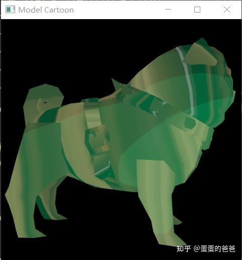

# Vulkan从入门到精通24-模型卡通化

本文是Vulkan从入门到精通第24篇，改下改下之前的小狗显示 模型[蛋蛋的爸爸：Vulkan从入门到精通21-显示模型](https://zhuanlan.zhihu.com/p/452630797)，让最终显示效果卡通化。

vs

```cpp
#version 450

layout (location = 0) in vec3 inPos;
layout (location = 1) in vec2 inCoord;
layout (location = 2) in vec3 inNormal;

layout (binding = 0) uniform UBO 
{
	mat4 projection;
	mat4 model;
	vec4 lightPos;
} ubo;

layout (location = 0) out vec3 outNormal;
layout (location = 1) out vec3 outColor;
layout (location = 2) out vec3 outLightVec;
layout (location = 3) out vec2 outCoord;

out gl_PerVertex
{
	vec4 gl_Position;
};

void main() 
{
	outColor = vec3(0.0, 0.6, 0.2);
	outCoord = inCoord;
	gl_Position = ubo.projection * ubo.model * vec4(inPos.xyz, 1.0);
	outNormal = mat3(ubo.model) * inNormal;
	vec4 pos = ubo.model * vec4(inPos, 1.0);
	vec3 lPos = mat3(ubo.model) * ubo.lightPos.xyz;
	outLightVec = lPos - pos.xyz;
}
```

fs

```cpp
#version 450

layout (binding = 1) uniform sampler2D samplerColorMap;
layout (binding = 2) uniform Time 
{
    float current;
} time;

layout (location = 0) in vec3 inNormal;
layout (location = 1) in vec3 inColor;
layout (location = 2) in vec3 inLightVec;
layout (location = 3) in vec2 inCoord;

layout (location = 0) out vec4 outFragColor;

void main() 
{
	vec3 color;
	vec3 N = normalize(inNormal);
	vec3 L = normalize(inLightVec);
	float intensity = dot(N,L);
	
	if(intensity > 0.95)
		color = inColor * 1.2;
	else if(intensity > 0.8)
		color = inColor * 1.0;
	else if(intensity > 0.6)
		color = inColor * 0.6;
    else if(intensity > 0.4)
		color = inColor * 0.4;
	else if(intensity > 0.25)
		color = inColor * 0.4;
	else
		color = inColor * 0.1;
		
	outFragColor = mix(texture(samplerColorMap,inCoord),vec4(color,1.0),time.current);
}
```

fs中增加了一个变量time用于显示卡通颜色和纹理的混合比重。

然后在代码修改为

```cpp
#include <iostream>
#include <cstring>
#include <chrono>
#include <glm/mat4x4.hpp>
#include <glm/gtx/transform.hpp>
#include "VK_UniformBuffer.h"
#include "VK_Context.h"
#include "VK_Image.h"
#include "VK_Texture.h"

using namespace std;

VK_Context *context = nullptr;

struct UBO {
    glm::mat4 projection;
    glm::mat4 model;
    glm::vec4 lightPos = glm::vec4(0.2f, 0.5f, 1.2f, 0.0f);
};

uint32_t updateUniformBufferData(char *&data, uint32_t size)
{
    assert(sizeof(UBO) == size);
    static auto startTime = std::chrono::high_resolution_clock::now();
    auto currentTime = std::chrono::high_resolution_clock::now();
    float time = std::chrono::duration<float, std::chrono::seconds::period>(currentTime - startTime).count();
    glm::mat4 model = glm::identity<glm::mat4>();
    model *= glm::scale(glm::vec3(1.5f, 1.5f, 1.5f));
    model *= glm::rotate(glm::mat4(1.0f), glm::radians(90.0f), glm::vec3(1.0f, 0.0f, 0.0f));
    model *= glm::rotate(glm::mat4(1.0f), time * glm::radians(30.0f), glm::vec3(0.0f, 1.0f, 0.0f));
    auto view = glm::lookAt(glm::vec3(0.0f, 4.0f, 0.0f), glm::vec3(0.0f, 0.0f, 0.0f), glm::vec3(0.0f, 0.0f, 1.0f));
    auto proj = glm::perspective(glm::radians(45.0f), context->getSwapChainExtent().width / (float)context->getSwapChainExtent().height, 0.1f, 10.0f);
    proj[1][1] *= -1;

    UBO ubo;
    ubo.projection = proj * view;
    ubo.model = model;
    memcpy(data, &ubo, sizeof(UBO));
    time = sin(time);
    return sizeof(UBO);
}

uint32_t updateUniformBufferData2(char *&data, uint32_t size)
{
    static auto startTime = std::chrono::high_resolution_clock::now();
    auto currentTime = std::chrono::high_resolution_clock::now();
    float time = std::chrono::duration<float, std::chrono::seconds::period>(currentTime - startTime).count();
    time = (std::cos(time) + 1.0) * 0.5;
    memcpy(data, &time, size);
    return size;
}

void onFrameSizeChanged(int width, int height)
{
    auto vp = VK_Viewports::createViewport(width, height);
    VK_Viewports vps;
    vps.addViewport(vp);
    context->setViewports(vps);
}

int main()
{
    VK_ContextConfig config;
    config.debug = false;
    config.name = "Model Cartoon";

    context = createVkContext(config);
    context->createWindow(480, 480, true);
    context->setOnFrameSizeChanged(onFrameSizeChanged);

    VK_Context::VK_Config vkConfig;
    context->initVulkanDevice(vkConfig);

    auto shaderSet = context->createShaderSet();
    shaderSet->addShader("../shader/model-toon/vert.spv", VK_SHADER_STAGE_VERTEX_BIT);
    shaderSet->addShader("../shader/model-toon/frag.spv", VK_SHADER_STAGE_FRAGMENT_BIT);

    shaderSet->appendAttributeDescription(0, sizeof (float) * 3);
    shaderSet->appendAttributeDescription(1, sizeof (float) * 2);
    shaderSet->appendAttributeDescription(2, sizeof (float) * 3);

    VkDescriptorSetLayoutBinding uniformBinding = VK_ShaderSet::createDescriptorSetLayoutBinding(0,
            VK_DESCRIPTOR_TYPE_UNIFORM_BUFFER, VK_SHADER_STAGE_VERTEX_BIT);
    shaderSet->addDescriptorSetLayoutBinding(uniformBinding);

    auto samplerBinding = VK_ShaderSet::createDescriptorSetLayoutBinding(1,
                          VK_DESCRIPTOR_TYPE_COMBINED_IMAGE_SAMPLER, VK_SHADER_STAGE_FRAGMENT_BIT);
    shaderSet->addDescriptorSetLayoutBinding(uniformBinding);
    auto samplerCreateInfo  = VK_Sampler::createSamplerCreateInfo();
    auto samplerPtr = context->createSampler(samplerCreateInfo);
    VkSampler sampler = samplerPtr->getSampler();
    samplerBinding.pImmutableSamplers = &sampler;

    shaderSet->addDescriptorSetLayoutBinding(samplerBinding);

    VkDescriptorSetLayoutBinding uniformBinding2 = VK_ShaderSet::createDescriptorSetLayoutBinding(2,
            VK_DESCRIPTOR_TYPE_UNIFORM_BUFFER, VK_SHADER_STAGE_FRAGMENT_BIT);
    shaderSet->addDescriptorSetLayoutBinding(uniformBinding2);

    if (!shaderSet->isValid()) {
        std::cerr << "invalid shaderSet" << std::endl;
        shaderSet->release();
        context->release();
        return -1;
    }

    auto ubo = context->createUniformBuffer(0, sizeof(UBO));
    ubo->setWriteDataCallback(updateUniformBufferData);
    context->addUniformBuffer(ubo);

    auto ubo2 = context->createUniformBuffer(2, sizeof(float));
    ubo2->setWriteDataCallback(updateUniformBufferData2);
    context->addUniformBuffer(ubo2);

    auto buffer = context->createVertexBuffer("../model/pug.obj", true);
    context->addBuffer(buffer);

    auto image = context->createImage("../model/PUG_TAN.tga");

    auto imageViewCreateInfo = VK_ImageView::createImageViewCreateInfo(image->getImage(),
                               VK_FORMAT_R8G8B8A8_SRGB);
    auto imageView = context->createImageView(imageViewCreateInfo);
    context->addImageView(imageView);

    context->initVulkanContext();

    auto rasterCreateInfo = context->getPipelineRasterizationStateCreateInfo();
    rasterCreateInfo.cullMode = VK_CULL_MODE_NONE;
    context->setPipelineRasterizationStateCreateInfo(rasterCreateInfo);

    auto depthStencilState = context->getPipelineDepthStencilStateCreateInfo();
    depthStencilState.stencilTestEnable = VK_TRUE;
    depthStencilState.back.compareOp = VK_COMPARE_OP_ALWAYS;
    depthStencilState.back.failOp = VK_STENCIL_OP_REPLACE;
    depthStencilState.back.depthFailOp = VK_STENCIL_OP_REPLACE;
    depthStencilState.back.passOp = VK_STENCIL_OP_REPLACE;
    depthStencilState.back.compareMask = 0xff;
    depthStencilState.back.writeMask = 0xff;
    depthStencilState.back.reference = 1;
    depthStencilState.front = depthStencilState.back;
    context->setPipelineDepthStencilStateCreateInfo(depthStencilState);

    context->initPipeline();
    context->createCommandBuffers();

    context->run();
    context->release();

    return 0;
}
```

updateUniformBufferData2 中把时间转变为0-1之间不断变换的数值并提交给显存

显示效果




代码仓库 -

[https://github.com/ccsdu2004/vulkan-cpp-demogithub.com/ccsdu2004/vulkan-cpp-demo](https://link.zhihu.com/?target=https%3A//github.com/ccsdu2004/vulkan-cpp-demo)

[GitHub - ccsdu2004/vulkan-cpp-demo: 基于cplusplus的vulkan程序开发例子](https://link.zhihu.com/?target=https%3A//github.com/ccsdu2004/vulkan-cpp-demo)

[https://github.com/ccsdu2004/vulkan-cpp-demogithub.com/ccsdu2004/vulkan-cpp-demo](https://link.zhihu.com/?target=https%3A//github.com/ccsdu2004/vulkan-cpp-demo)


在[蛋蛋的爸爸：Vulkan从入门到精通13-代码整合](https://zhuanlan.zhihu.com/p/441262929) 一文中我们大规模调整过一次代码结构，到当前，我们用vulkan可以*显示obj模型，无论是网格还是贴图模型，同时还支持设置深度模板缓存，多重采样，可以定制[光栅化](https://zhida.zhihu.com/search?content_id=189466620&content_type=Article&match_order=1&q=光栅化&zhida_source=entity)参数，还可以使用细分着色器，几何着色器；对于Shader我们可以自由的指定[顶点](https://zhida.zhihu.com/search?content_id=189466620&content_type=Article&match_order=1&q=顶点&zhida_source=entity)和uniform格式；另外还支持动态设置管线状态，甚至还支持自定义内存配置器*。但是还有一大推vulkan特性和细节没有涉及，比如程序对**多个管线的支持，对状态查询，[多线程](https://zhida.zhihu.com/search?content_id=189466620&content_type=Article&match_order=1&q=多线程&zhida_source=entity)下的[命令缓存](https://zhida.zhihu.com/search?content_id=189466620&content_type=Article&match_order=1&q=命令缓存&zhida_source=entity)，推送常量uniform，对立方体映射的支持，以及subpass，三维纹理，[离屏渲染](https://zhida.zhihu.com/search?content_id=189466620&content_type=Article&match_order=1&q=离屏渲染&zhida_source=entity)**等。后面再逐一介绍

