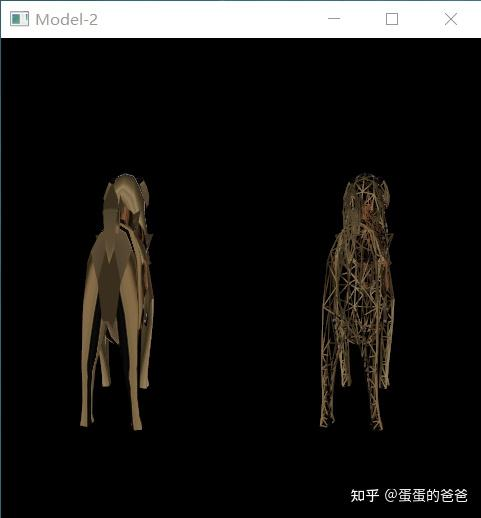

# Vulkan从入门到精通26-派生管线和多管线

重构完代码，我们就可以在一个程序中使用多个管线了。

VkPipeline主要有三个函数，一个是vkCreateGraphicsPipelines，一个是vkDestroyPipeline，还有一个是vkCmdBindPipeline。创建，销毁和绑定。

在渲染时首先绑定管线，然后就可以渲染各渲染对象了。

在创建管线时可以显式的指定此管线是否允许被派生，标志位是

```cpp
 pipelineCreateInfo.flags = VK_PIPELINE_CREATE_ALLOW_DERIVATIVES_BIT;
```

之后就是createInfo的填充和管线的创建。

创建完成后，对于派生管线，还是使用之前的createInfo。首先把flags置为0，然后重写需要调整的字段，比如要设置二个管线各对应一个单独的视口，则可以重设pViewportState。

然后设置以下二字段

```cpp
    pipelineCreateInfo.basePipelineHandle = parent->pipeline;
    pipelineCreateInfo.basePipelineIndex = -1;
```

basePipelineHandle指定基管线指针，basePipelineIndex索引设置为-1

下面看一个使用例子

```cpp
#include <iostream>
#include <cstring>
#include <chrono>
#include <glm/mat4x4.hpp>
#include <glm/gtx/transform.hpp>
#include "VK_UniformBuffer.h"
#include "VK_Context.h"
#include "VK_Image.h"
#include "VK_Texture.h"
#include "VK_Pipeline.h"
#include "VK_DynamicState.h"

using namespace std;

VK_Context *context = nullptr;
VK_Pipeline* pipeline = nullptr;
VK_Pipeline* pipeline2 = nullptr;

uint32_t updateUniformBufferData(char *&data, uint32_t size)
{
    static auto startTime = std::chrono::high_resolution_clock::now();
    auto currentTime = std::chrono::high_resolution_clock::now();
    float time = std::chrono::duration<float, std::chrono::seconds::period>(currentTime - startTime).count();
    glm::mat4 model = glm::rotate(glm::mat4(1.0f), glm::radians(90.0f), glm::vec3(1.0f, 0.0f, 0.0f));
    model *= glm::rotate(glm::mat4(1.0f), time * glm::radians(30.0f), glm::vec3(0.0f, 1.0f, 0.0f));
    auto view = glm::lookAt(glm::vec3(0.0f, 4.0f, 0.0f), glm::vec3(0.0f, 0.0f, 0.0f), glm::vec3(0.0f, 0.0f, 1.0f));
    auto proj = glm::perspective(glm::radians(45.0f), context->getSwapChainExtent().width / (float)context->getSwapChainExtent().height, 0.1f, 10.0f);
    proj[1][1] *= -1;

    model = proj * view * model;
    memcpy(data, &model[0][0], size);
    time = sin(time);
    memcpy(data + sizeof(float) * 16, (void *)&time, sizeof(float));
    return 17 * sizeof(float);
}

void onFrameSizeChanged(int width, int height)
{
    pipeline->getDynamicState()->applyDynamicViewport({0, 0, (float)width * 0.5f, (float)height, 0, 1});
    pipeline2->getDynamicState()->applyDynamicViewport({width * 0.5f, 0, (float)width * 0.5f, (float)height, 0, 1});
}

int main()
{
    VK_ContextConfig config;
    config.debug = true;
    config.name = "Model-2";

    context = createVkContext(config);
    context->createWindow(480, 480, true);
    context->setOnFrameSizeChanged(onFrameSizeChanged);

    VkPhysicalDeviceFeatures deviceFeatures{};
    deviceFeatures.fillModeNonSolid = VK_TRUE;
    context->setLogicalDeviceFeatures(deviceFeatures);

    VK_Context::VK_Config vkConfig;
    context->initVulkanDevice(vkConfig);

    auto shaderSet = context->createShaderSet();
    shaderSet->addShader("../shader/model/vert.spv", VK_SHADER_STAGE_VERTEX_BIT);
    shaderSet->addShader("../shader/model/frag.spv", VK_SHADER_STAGE_FRAGMENT_BIT);

    shaderSet->appendAttributeDescription(0, sizeof (float) * 3);
    shaderSet->appendAttributeDescription(1, sizeof (float) * 2);
    shaderSet->appendAttributeDescription(2, sizeof (float) * 3);

    VkDescriptorSetLayoutBinding uniformBinding = VK_ShaderSet::createDescriptorSetLayoutBinding(0,
            VK_DESCRIPTOR_TYPE_UNIFORM_BUFFER, VK_SHADER_STAGE_VERTEX_BIT);
    shaderSet->addDescriptorSetLayoutBinding(uniformBinding);

    auto samplerBinding = VK_ShaderSet::createDescriptorSetLayoutBinding(1,
                          VK_DESCRIPTOR_TYPE_COMBINED_IMAGE_SAMPLER, VK_SHADER_STAGE_FRAGMENT_BIT);
    auto samplerCreateInfo  = VK_Sampler::createSamplerCreateInfo();
    auto samplerPtr = context->createSampler(samplerCreateInfo);
    VkSampler sampler = samplerPtr->getSampler();
    samplerBinding.pImmutableSamplers = &sampler;

    shaderSet->addDescriptorSetLayoutBinding(samplerBinding);

    if (!shaderSet->isValid()) {
        std::cerr << "invalid shaderSet" << std::endl;
        shaderSet->release();
        context->release();
        return -1;
    }

    auto ubo = context->createUniformBuffer(0, sizeof(float) * 17);
    ubo->setWriteDataCallback(updateUniformBufferData);
    context->addUniformBuffer(ubo);

    auto buffer = context->createVertexBuffer("../model/pug.obj", true);
    context->addBuffer(buffer);

    auto image = context->createImage("../model/PUG_TAN.tga");

    auto imageViewCreateInfo = VK_ImageView::createImageViewCreateInfo(image->getImage(),
                               VK_FORMAT_R8G8B8A8_SRGB);
    auto imageView = context->createImageView(imageViewCreateInfo);
    context->addImageView(imageView);

    context->initVulkanContext();

    pipeline = context->createPipeline();
    auto rasterCreateInfo = pipeline->getRasterizationStateCreateInfo();
    rasterCreateInfo.cullMode = VK_CULL_MODE_NONE;
    pipeline->setRasterizationStateCreateInfo(rasterCreateInfo);
    pipeline->getDynamicState()->addDynamicState(VK_DYNAMIC_STATE_VIEWPORT);
    pipeline->create();
    pipeline->getDynamicState()->applyDynamicViewport({0, 0, 240, 480, 0, 1});
    pipeline->addRenderBuffer(buffer);

    pipeline2 = pipeline->fork();
    rasterCreateInfo = pipeline2->getRasterizationStateCreateInfo();
    rasterCreateInfo.cullMode = VK_CULL_MODE_NONE;
    rasterCreateInfo.polygonMode = VK_POLYGON_MODE_LINE;
    pipeline2->setRasterizationStateCreateInfo(rasterCreateInfo);
    pipeline2->getDynamicState()->addDynamicState(VK_DYNAMIC_STATE_VIEWPORT);
    pipeline2->create();
    pipeline2->getDynamicState()->applyDynamicViewport({240, 0, 240, 480, 0, 1});
    pipeline2->addRenderBuffer(buffer);

    context->createCommandBuffers();

    context->run();
    context->release();

    return 0;
}
```

使用

pipeline = context->*createPipeline*(); 创建管线后，可以使用pipeline->fork得到派生管线，之后操作就没区别了。

上面的例子显示的还是一个小狗模型，不过左边是正常模型，右边是[线框模型](https://zhida.zhihu.com/search?content_id=189832257&content_type=Article&match_order=1&q=线框模型&zhida_source=entity)，截图是



vulkan派生管线

对于非派生多管线，重复调用context->createPipeline()即可。

不过当前多个管线使用的都是一组shaderSet，后面可以修改下使用多个shaderSet

