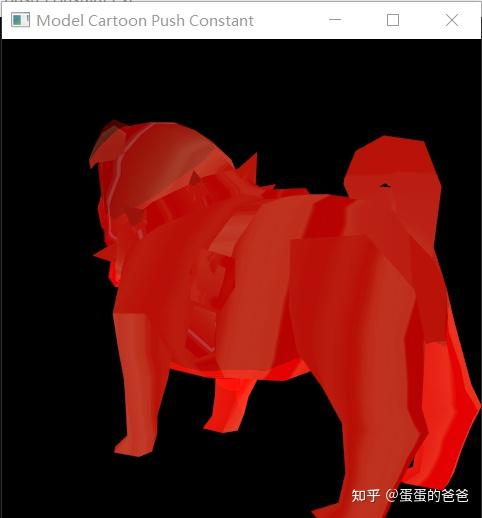

# Vulkan从入门到精通27-推送常量

在vulkan中使用uniform给shader传送数据。其实还有一种特殊的uniform - 推送常量（push constant）是一种着色器使用[uniform变量](https://zhida.zhihu.com/search?content_id=189836497&content_type=Article&match_order=1&q=uniform变量&zhida_source=entity)，可以像uniform块那样使用，但是并不需要存储在内存里，它由Vulkan自身持有和更新。**这些常量的新值可以被直接从[命令缓冲区](https://zhida.zhihu.com/search?content_id=189836497&content_type=Article&match_order=1&q=命令缓冲区&zhida_source=entity)推送到管线**。

推送常量逻辑上被视为管理资源的一部分，**因此和管线布局（用来创建管线对象）中其他资源一同声明。**

需要注意的是

- 一个管线里只有一个推送常量内存块可用
- 推送常量可以通过VkPhysicalDeviceLimits的字段maxPushConstantsSize来获知支持大小

推送常量是这样构造的，在创建管线布局时

```cpp
bool VK_ContextImpl::createPipleLayout()
{
    VkPipelineLayoutCreateInfo pipelineLayoutInfo{};
    pipelineLayoutInfo.sType = VK_STRUCTURE_TYPE_PIPELINE_LAYOUT_CREATE_INFO;
    pipelineLayoutInfo.pNext = nullptr;
    pipelineLayoutInfo.setLayoutCount = 1;
    pipelineLayoutInfo.pSetLayouts = &descriptorSetLayout;
    pipelineLayoutInfo.pushConstantRangeCount = pushConstantRange.size();
    pipelineLayoutInfo.pPushConstantRanges = pushConstantRange.data();

    if (vkCreatePipelineLayout(device, &pipelineLayoutInfo, getAllocation(), &pipelineLayout) != VK_SUCCESS) {
        std::cerr << "failed to create pipeline layout!" << std::endl;
        return false;
    }
    return true;
}
```

我们在ContextImpl中定义了二个成员变量

```cpp
    std::vector<VkPushConstantRange> pushConstantRange;
    std::vector<const char*> pushConstantData;
```

一个放置推送常量描述，一个放置数据

关联的vertex shader如下

```cpp
layout(push_constant) uniform PushConsts {
	vec3 color;
} pushConsts;
```

push_constant指定这是一个推送常量，使用方式为pushConsts.color。

然后在创建[命令缓存](https://zhida.zhihu.com/search?content_id=189836497&content_type=Article&match_order=1&q=命令缓存&zhida_source=entity)时即可使用此推送常量，如下

```cpp
        vkCmdBindDescriptorSets(commandBuffers[i], VK_PIPELINE_BIND_POINT_GRAPHICS, pipelineLayout, 0, 1,
                                &descriptorSets[i], 0,
                                nullptr);

        size_t index = 0;
        for(auto pushConst : pushConstantRange) {
            vkCmdPushConstants(
                commandBuffers[i],
                pipelineLayout,
                pushConst.stageFlags,
                pushConst.offset,
                pushConst.size,
                pushConstantData[index]);
            index ++;
        }
```

demo是在之前绘制卡通模型的基础上修改的，

在创建vulkan上下文之前，设置推送常量

```text
    float color[3] = {1, 0, 0};
    context->addPushConstant({VK_SHADER_STAGE_VERTEX_BIT, 0, sizeof(float) * 3}, (char*)color);
    context->initVulkanContext();
```

这里把颜色设置为红色。

最终程序展示如下



vulkan push constant

本文涉及vulkan函数 - vkCmdPushConstants

vkCmdPushConstants - Update the values of push constants

描述如下
*When a command buffer begins recording, all push constant values are undefined. Reads of undefined push constant values by the executing shader return undefined values. Push constant values **can** be updated incrementally, causing shader stages in `stageFlags` to read the new data from `pValues` for push constants modified by this command, while still reading the previous data for push constants not modified by this command. When a bound pipeline command is issued, the bound pipeline’s layout **must** be compatible with the layouts used to set the values of all push constants in the pipeline layout’s push constant ranges, as described in Pipeline Layout Compatibility. Binding a pipeline with a layout that is not compatible with the push constant layout does not disturb the push constant values.*