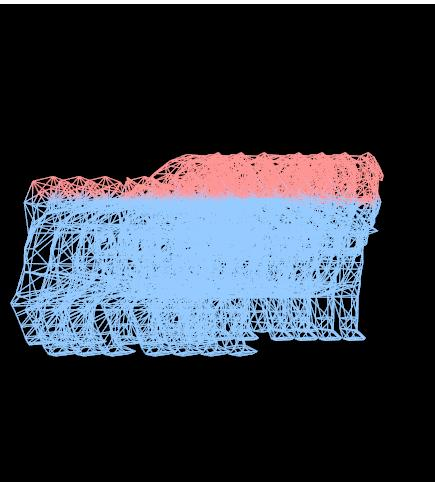

# Vulkan从入门到精通36-间接渲染

上篇聊的是窗口表面 VkSurfaceHKR，这篇聊聊间接渲染

针对一次渲染大量同一对象，在OpenGL中可以使用glDrawArrayInstance或glDrawElementInstance。

在vulkan要达到同样效果，可以使用indirecr draw。

对应的二个关键函数是

```cpp
VKAPI_ATTR void VKAPI_CALL vkCmdDrawIndirect(
    VkCommandBuffer                             commandBuffer,
    VkBuffer                                    buffer,
    VkDeviceSize                                offset,
    uint32_t                                    drawCount,
    uint32_t                                    stride);

VKAPI_ATTR void VKAPI_CALL vkCmdDrawIndexedIndirect(
    VkCommandBuffer                             commandBuffer,
    VkBuffer                                    buffer,
    VkDeviceSize                                offset,
    uint32_t                                    drawCount,
    uint32_t                                    stride);
```

用法要点是

1. 初始化逻辑设备时，显式指定multiDrawIndirect为VK_True
2. 初始化*VertexInputBindingDescription*时指定bind1或者其他bind数据格式为多实例数据格式，设定类型为*VK_VERTEX_INPUT_RATE_INSTANCE；同时设定对应VertexAttributeDescription内容*
3. *Shader VS参考增加如下，这里instance至改变了各个实例的位置，故只采用了一个vec3*

```text
layout(location = 3) in vec3 instancePos;
```

4. 创建对应的instance buffer大小为INSTANCE_COUNT*sizeof(vec3)，内容为实例位置数组内容，对应渲染还是为vkCmdBindVertexBuffers(command, bindID, 1, vertexBuffers, offsets);
5. 创建对应indirect buffer - 个数为INSTANCE_COUNT，每个元素大小为*sizeof*(glm::vec3),调用函数为 vkCmdDrawIndirect(command, buffer, 0, indirectCommands.size(), *sizeof*(VkDrawIndirectCommand));

下面放一个完整的示例代码

Shader VS

```cpp
#version 450
layout(location = 0) in vec3 inPosition;
layout(location = 1) in vec2 coord;
layout(location = 2) in vec3 inColor;
layout(location = 3) in vec3 instancePos;

layout(location = 0) out vec4 fragColor;
layout(binding = 0) uniform UniformBufferObject {
    mat4 model;
    float value;
} mvp;

void main() {
    gl_Position = mvp.model*vec4(inPosition, 1.0)+vec4(instancePos,1.0);

    if(inPosition.y > mvp.value)
    {
        fragColor = vec4(1.0,0.3,0.3,1.0);
    }
    else
    {
        fragColor = vec4(0.3,0.6,1.0,1.0);
    }
}
```

Demo代码

```cpp
#include <iostream>
#include <cstring>
#include <chrono>
#include <glm/mat4x4.hpp>
#include <glm/gtx/transform.hpp>
#include "VK_UniformBuffer.h"
#include "VK_Context.h"
#include "VK_Image.h"
#include "VK_Texture.h"
#include "VK_DynamicState.h"
#include "VK_Pipeline.h"

using namespace std;

VK_Context *context = nullptr;
VK_Pipeline *pipeline = nullptr;

uint32_t updateUniformBufferData(char *&data, uint32_t size)
{
    static auto startTime = std::chrono::high_resolution_clock::now();
    auto currentTime = std::chrono::high_resolution_clock::now();
    float time = std::chrono::duration<float, std::chrono::seconds::period>
                 (currentTime - startTime).count();
    glm::mat4 model = glm::rotate(glm::mat4(1.0f), glm::radians(90.0f), glm::vec3(1.0f, 0.0f, 0.0f));
    model *= glm::rotate(glm::mat4(1.0f), time * glm::radians(30.0f), glm::vec3(0.0f, 1.0f, 0.0f));
    auto view = glm::lookAt(glm::vec3(0.0f, 4.0f, 0.0f), glm::vec3(0.0f, 0.0f, 0.0f), glm::vec3(0.0f,
                            0.0f, 1.0f));
    auto proj = glm::perspective(glm::radians(45.0f),
                                 context->getSwapChainExtent().width / (float)context->getSwapChainExtent().height, 0.1f, 10.0f);
    proj[1][1] *= -1;

    model = proj * view * model;

    memcpy(data, &model[0][0], size);

    time = sin(time);

    memcpy(data + sizeof(float) * 16, (void *)&time, sizeof(float));

    return 17 * sizeof(float);
}

void onFrameSizeChanged(int width, int height)
{
    pipeline->getDynamicState()->applyDynamicViewport({0, 0, (float)width, (float)height, 0, 1});
}

#define INSTANCE_COUNT 7

int main()
{
    VK_ContextConfig config;
    config.debug = true;
    config.name = "Model IndirectDraw";

    context = createVkContext(config);
    context->createWindow(480, 480, true);
    context->setOnFrameSizeChanged(onFrameSizeChanged);

    VkPhysicalDeviceFeatures deviceFeatures{};
    deviceFeatures.multiDrawIndirect = VK_TRUE;
    deviceFeatures.fillModeNonSolid = VK_TRUE;
    deviceFeatures.drawIndirectFirstInstance = VK_TRUE;
    context->setLogicalDeviceFeatures(deviceFeatures);

    VK_Context::VK_Config vkConfig;
    context->initVulkanDevice(vkConfig);

    auto shaderSet = context->createShaderSet();
    shaderSet->addShader("../shader/model-instance/vert.spv", VK_SHADER_STAGE_VERTEX_BIT);
    shaderSet->addShader("../shader/model-instance/frag.spv", VK_SHADER_STAGE_FRAGMENT_BIT);

    shaderSet->appendVertexAttributeDescription(0, sizeof (float) * 3, VK_FORMAT_R32G32B32_SFLOAT, 0, 0);
    shaderSet->appendVertexAttributeDescription(1, sizeof (float) * 2, VK_FORMAT_R32G32_SFLOAT,
            sizeof(float) * 3, 0);
    shaderSet->appendVertexAttributeDescription(2, sizeof (float) * 3, VK_FORMAT_R32G32B32_SFLOAT,
            sizeof(float) * 5, 0);

    shaderSet->appendVertexAttributeDescription(3, sizeof(glm::vec3), VK_FORMAT_R32G32B32_SFLOAT,
            0, 1);

    shaderSet->appendVertexInputBindingDescription(8 * sizeof(float), 0, VK_VERTEX_INPUT_RATE_VERTEX);
    shaderSet->appendVertexInputBindingDescription(sizeof(glm::vec3), 1, VK_VERTEX_INPUT_RATE_INSTANCE);

    VkDescriptorSetLayoutBinding uniformBinding = VK_ShaderSet::createDescriptorSetLayoutBinding(0,
            VK_DESCRIPTOR_TYPE_UNIFORM_BUFFER, VK_SHADER_STAGE_VERTEX_BIT);
    shaderSet->addDescriptorSetLayoutBinding(uniformBinding);

    if (!shaderSet->isValid()) {
        std::cerr << "invalid shaderSet" << std::endl;
        shaderSet->release();
        context->release();
        return -1;
    }

    auto ubo = shaderSet->addUniformBuffer(0, sizeof(float) * 17);
    ubo->setWriteDataCallback(updateUniformBufferData);

    context->initVulkanContext();

    pipeline = context->createPipeline(shaderSet);

    auto rasterCreateInfo = pipeline->getRasterizationStateCreateInfo();
    rasterCreateInfo.polygonMode = VK_POLYGON_MODE_LINE;
    pipeline->setRasterizationStateCreateInfo(rasterCreateInfo);

    pipeline->create();

    std::vector<glm::vec3> instance(INSTANCE_COUNT);

    for (uint32_t i = 0; i < INSTANCE_COUNT; i++) {
        if (i > 0)
            instance[i].x = (i % 2 == 1) ? 0.5f * (i + 1) / 2 : -0.5f * (i + 1) / 2;
    }

    auto buffer = context->createVertexBuffer("../model/pug.obj", true, true);
    pipeline->addRenderBuffer(buffer);

    uint32_t count = buffer->getDataCount();

    buffer = context->createInstanceBuffer(INSTANCE_COUNT, sizeof(glm::vec3),
                                           (char *)instance.data(), 1);
    pipeline->addRenderBuffer(buffer);

    buffer = context->createIndirectBuffer(INSTANCE_COUNT, sizeof(glm::vec3), count);
    pipeline->addRenderBuffer(buffer);

    context->createCommandBuffers();

    context->run();
    context->release();

    return 0;
}
```

Instance实现

```cpp
void VK_InstanceBuffer::create(uint32_t count, uint32_t itemSize, const char *data, uint32_t bind)
{
    std::vector<char> items;
    std::copy(data, data + count * itemSize, std::back_inserter(items));
    createBufferData(items, buffer, bufferMemory);
    bindID = bind;
    this->count = count;
}


void VK_InstanceBuffer::render(VkCommandBuffer command)
{
    VkBuffer vertexBuffers[] = {buffer};
    VkDeviceSize offsets[] = {0};
    vkCmdBindVertexBuffers(command, bindID, 1, vertexBuffers, offsets);
}
```

IndirectBuffer，注意VkDrawIndiectCommand的参数填写

```cpp
void VK_IndirectBuffer::create(uint32_t instanceCount,
                               uint32_t oneInstanceSize, uint32_t vertexCount)
{
    for (uint32_t i = 0; i < instanceCount; i++) {
        VkDrawIndirectCommand indirectCmd{};
        indirectCmd.instanceCount = instanceCount;
        indirectCmd.firstInstance = i * instanceCount;
        indirectCmd.firstVertex = i * oneInstanceSize;
        indirectCmd.vertexCount = vertexCount;
        indirectCommands.push_back(indirectCmd);
    }


    createBufferData<VkDrawIndirectCommand>(indirectCommands, buffer, bufferMemory);
    count = instanceCount;
}


void VK_IndirectBuffer::render(VkCommandBuffer command)
{
    vkCmdDrawIndirect(command, buffer, 0, indirectCommands.size(), sizeof(VkDrawIndirectCommand));
}
```

这里没使用索引Indirect~

最终效果如下




vulkan indirect

