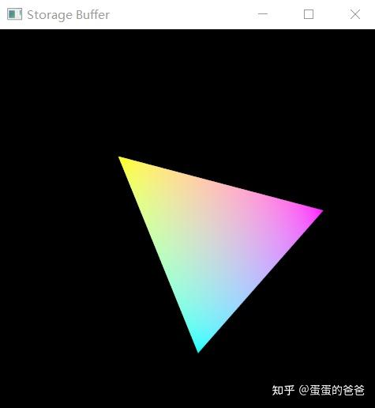

# Vulkan从入门到精通44-SSBO

之前我们讲过uniform buffer和texel buffer。和OpenGL一样，Vulkan也提供了SSBO。

先说着色器中的写法吧。

```text
#version 450
layout(location = 0) in vec3 position;
//layout(location = 1) in vec4 color;
layout(location = 0) out vec4 fragColor;

layout(binding = 0) uniform UniformBufferObject {
    mat4 model;
} mvp;

layout (set = 0, binding = 1) buffer PointBuffer
{
    vec3 color[];
} point_buffer;

void main() {
    gl_Position = mvp.model * vec4(position, 1.0);
    fragColor = vec4(point_buffer.color[gl_VertexIndex],1.0);
}
```

其中的PointerBuffer如下，就定义了一个SSBO。其binding为1

> layout (set = 0, binding = 1) buffer PointBuffer
> {
> vec3 color[];
> } point_buffer;

使用和uniform buffer是一样的。

------

然后再说代码调用吧。为方便期间，我把VK_UniformBuffer做了修改，定义成了纯虚对象，对外提供的都是[虚函数](https://zhida.zhihu.com/search?content_id=209372380&content_type=Article&match_order=1&q=虚函数&zhida_source=entity)，如下

```cpp
class VK_UniformBuffer : public VK_Deleter
{
public:
    virtual void initBuffer(uint32_t swapImageChainSize) = 0;
    [[nodiscard]] virtual VkWriteDescriptorSet createWriteDescriptorSet(uint32_t index,
                                                                        VkDescriptorSet descriptorSet)const = 0;
    virtual void clearBuffer() = 0;
    virtual void setWriteDataCallback(std::function<uint32_t(char *&, uint32_t)> cb) = 0;
    virtual void update(uint32_t index) = 0;
};
```

提供的接口分别是初始化缓冲、写描述符集、清理缓冲、写数据回调和更新缓冲5个函数。

原来的VK_UniformBuffer下调为其子类。

另外增加一个VK_StorageBuffer，定义如下

```cpp
class VK_StorageBuffer : public VK_UniformBuffer
{
    friend class VK_ContextImpl;
public:
    VK_StorageBuffer() = delete;
    VK_StorageBuffer(VK_ContextImpl *vkContext, uint32_t binding, uint32_t bufferSize);
    ~VK_StorageBuffer();
public:
    void initBuffer(uint32_t swapImageChainSize)override;

    [[nodiscard]] VkWriteDescriptorSet createWriteDescriptorSet(uint32_t index,
                                                                VkDescriptorSet descriptorSet)const override;

    void clearBuffer()override;
    void release()override;

    void setWriteDataCallback(std::function<uint32_t(char *&, uint32_t)> cb)override;
    void update(uint32_t index)override;
protected:
    VK_ContextImpl *context = nullptr;
    uint32_t bindingId = 0;
    uint32_t bufferSize = 0;

    std::function<uint32_t(char *&, uint32_t)> writeDataCallback;

    std::vector<char> bufferData;
    std::vector<VkBuffer> uniformBuffers;
    std::vector<VkDeviceMemory> uniformBuffersMemory;
    std::vector<VkDescriptorBufferInfo> bufferInfos;

    bool needClear = false;
};
```

成员和uniform没什么区别，再看实现吧。

```cpp
VK_StorageBuffer::VK_StorageBuffer(VK_ContextImpl *vkContext, uint32_t binding,
                                   uint32_t uboSize):
    context(vkContext),
    bindingId(binding),
    bufferSize(uboSize)
{
    bufferData.resize(bufferSize);
}

VK_StorageBuffer::~VK_StorageBuffer()
{
}

void VK_StorageBuffer::initBuffer(uint32_t swapImageChainSize)
{
    clearBuffer();

    uniformBuffers.resize(swapImageChainSize);
    uniformBuffersMemory.resize(swapImageChainSize);
    bufferInfos.resize(swapImageChainSize);

    for (size_t i = 0; i < swapImageChainSize; i++) {
        context->createBuffer(bufferSize,
                              VK_BUFFER_USAGE_STORAGE_BUFFER_BIT,
                              VK_MEMORY_PROPERTY_HOST_VISIBLE_BIT | VK_MEMORY_PROPERTY_HOST_COHERENT_BIT, uniformBuffers[i],
                              uniformBuffersMemory[i]);
        bufferInfos[i].buffer = uniformBuffers[i];
        bufferInfos[i].offset = 0;
        bufferInfos[i].range = bufferSize;
    }

    needClear = true;
}

VkWriteDescriptorSet VK_StorageBuffer::createWriteDescriptorSet(uint32_t index,
                                                                VkDescriptorSet descriptorSet) const
{
    assert(index < bufferInfos.size());
    VkWriteDescriptorSet descriptorWrite{};
    descriptorWrite.sType = VK_STRUCTURE_TYPE_WRITE_DESCRIPTOR_SET;
    descriptorWrite.dstSet = descriptorSet;
    descriptorWrite.dstBinding = bindingId;
    descriptorWrite.dstArrayElement = 0;
    descriptorWrite.descriptorType =
        VK_DESCRIPTOR_TYPE_STORAGE_BUFFER;
    descriptorWrite.descriptorCount = 1;
    descriptorWrite.pBufferInfo = &bufferInfos[index];
    return descriptorWrite;
}

void VK_StorageBuffer::release()
{
    clearBuffer();
    uniformBuffers.clear();
    uniformBuffersMemory.clear();
    delete this;
}

void VK_StorageBuffer::setWriteDataCallback(std::function<uint32_t (char *&, uint32_t)> cb)
{
    if (cb)
        writeDataCallback = cb;
}

void VK_StorageBuffer::update(uint32_t index)
{
    if (!writeDataCallback) {
        std::cerr << "please set write data callback function" << std::endl;
        return;
    }

    char *userData = bufferData.data();
    uint32_t size = writeDataCallback(userData, bufferData.size());
    if (size != bufferData.size()) {
        std::cerr << "write data callback size error" << std::endl;
        return;
    }

    void *gpuData = nullptr;
    vkMapMemory(context->getDevice(), uniformBuffersMemory[index], 0, bufferSize, 0, &gpuData);
    memcpy(gpuData, userData, bufferSize);
    vkUnmapMemory(context->getDevice(), uniformBuffersMemory[index]);
}

void VK_StorageBuffer::clearBuffer()
{
    for (size_t i = 0; i < uniformBuffers.size(); i++) {
        vkDestroyBuffer(context->getDevice(), uniformBuffers[i], context->getAllocation());
        uniformBuffers[i] = VK_NULL_HANDLE;
    }
    for (size_t i = 0; i < uniformBuffers.size(); i++) {
        vkFreeMemory(context->getDevice(), uniformBuffersMemory[i], context->getAllocation());
        uniformBuffersMemory[i] = nullptr;
    }
}
```

和uniform buffer的差异在于初始化buffer的时候这里设置的buffer use bit为*VK_BUFFER_USAGE_STORAGE_BUFFER_BIT，代表用途是ssbo。*

第二处区别是 - 在写描述符集时设置的描述符类型也是VK_BUFFER_USAGE_STORAGE_BUFFER_BIT。

------

测试代码为

```cpp
const std::vector<float> vertices = {
    0.0f, -0.5f, 0.0f,
    0.5f, 0.5f, 0.0f,
    -0.5f, 0.5f, 0.0f
};

const std::vector<uint32_t> indices = {
    0, 1, 2
};

VK_Context *context = nullptr;
VK_Pipeline *pipeline = nullptr;

uint32_t updateUniformBufferData(char *&data, uint32_t size)
{
    static auto startTime = std::chrono::high_resolution_clock::now();
    auto currentTime = std::chrono::high_resolution_clock::now();
    float time = std::chrono::duration<float, std::chrono::seconds::period>
                 (currentTime - startTime).count();
    glm::mat4 model = glm::rotate(glm::mat4(1.0f), time * glm::radians(30.0f), glm::vec3(0.0f, 0.0f,
                                  1.0f));
    memcpy(data, &model[0][0], size);
    return sizeof(model);
}

uint32_t updateStorageBufferData(char *&data, uint32_t size)
{
    float color[12] = {0};
    color[0] = 1.0f;
    color[1] = 1.0f;
    color[2] = 0.0f;
    color[3] = 0.0f;

    color[4] = 1.0f;
    color[5] = 0.0f;
    color[6] = 1.0f;
    color[7] = 0.0f;

    color[8] = 0.0f;
    color[9] = 1.0f;
    color[10] = 1.0f;
    color[11] = 0.0f;
    memcpy(data, color, size);
    return sizeof(float) * 12;
}

void onFrameSizeChanged(int width, int height)
{
    pipeline->getDynamicState()->applyDynamicViewport({0, 0, (float)width, (float)height, 0, 1});
}

void onMouseButtonCallback(int button, int action, int mods)
{
    (void)button;
    (void)mods;

    if (action)
        context->captureScreenShot();
}

int main()
{
    srand(time(0));

    VK_ContextConfig config;
    config.debug = true;
    config.name = "Storage Buffer";
    config.mouseCallback = onMouseButtonCallback;

    context = createVkContext(config);
    context->createWindow(480, 480, true);
    context->setOnFrameSizeChanged(onFrameSizeChanged);

    VK_Context::VK_Config vkConfig;
    context->initVulkanDevice(vkConfig);

    auto shaderSet = context->createShaderSet();
    shaderSet->addShader("../shader/storagebuffer/vert.spv", VK_SHADER_STAGE_VERTEX_BIT);
    shaderSet->addShader("../shader/storagebuffer/frag.spv", VK_SHADER_STAGE_FRAGMENT_BIT);

    shaderSet->appendVertexAttributeDescription(0, sizeof (float) * 3, VK_FORMAT_R32G32B32_SFLOAT, 0);


    shaderSet->appendVertexInputBindingDescription(3 * sizeof(float), 0, VK_VERTEX_INPUT_RATE_VERTEX);

    VkDescriptorSetLayoutBinding uniformBinding = VK_ShaderSet::createDescriptorSetLayoutBinding(0,
            VK_DESCRIPTOR_TYPE_UNIFORM_BUFFER, VK_SHADER_STAGE_VERTEX_BIT);
    shaderSet->addDescriptorSetLayoutBinding(uniformBinding);

    VkDescriptorSetLayoutBinding ssboBinding = VK_ShaderSet::createDescriptorSetLayoutBinding(1,
            VK_DESCRIPTOR_TYPE_STORAGE_BUFFER, VK_SHADER_STAGE_VERTEX_BIT);

    shaderSet->addDescriptorSetLayoutBinding(ssboBinding);

    if (!shaderSet->isValid()) {
        std::cerr << "invalid shaderSet" << std::endl;
        shaderSet->release();
        context->release();
        return -1;
    }

    auto uniformBuffer = shaderSet->addUniformBuffer(0, sizeof(float) * 16);
    uniformBuffer->setWriteDataCallback(updateUniformBufferData);

    auto storageBuffer = shaderSet->addStorageBuffer(1, sizeof(float) * 12);
    storageBuffer->setWriteDataCallback(updateStorageBufferData);

    context->initVulkanContext();
    pipeline = context->createPipeline(shaderSet);
    pipeline->getDynamicState()->addDynamicState(VK_DYNAMIC_STATE_VIEWPORT);
    pipeline->create();
    pipeline->getDynamicState()->applyDynamicViewport({0, 0, 480, 480, 0, 1});

    auto buffer = context->createVertexBuffer(vertices, 3, indices);
    pipeline->addRenderBuffer(buffer);

    context->createCommandBuffers();

    context->run();
    context->release();

    return 0;
}
```

显示效果是一个旋转的三角形



vulkan ssbo

截止当前我们已经写了uniform buffer、texel buffer 和storage buffer。后面还需要引入storage texel buffer、dynamic uniform buffer、dynamic storage buffer、input attachment等。

后面再单独讲下其差异吧。