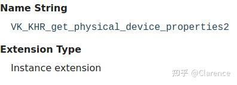

# Vulkan中的一些术语

Vulkan的核心特性之一就是可以运行在不同的平台和设备上，为了达到这个目的，vulkan支持查询各种设备信息，用户根据查询到的设备信息来决定程序需要的扩展是否支持。如果程序依赖的扩展设备不支持，那么，这个vulkan app将不能运行在这个平台/设备上。

可以从物理设备(physical device)中查询到的组件有下述几类

- Properties
- Feature
- Extensions
- Limits
- Formats

### Properties

Properties 是**只读的**可以被查询到的数据统一术语。

### Extension

经常会出现一种情况，开发者特别希望使用某些功能，但是这些功能在目前的版本是不支持的。Extension包含了一系列功能，可以用来拓展原有的vulkan API提供的功能。Extensions可以提供一些新的Vulkan Functions,enums,structs,or feature bits。注意，如果想使用某个extension，需要在create instance和create logic device流程中去enable，否则将会产生未知的错误。

extension分为两类，一类是instance extension 一类是 device extension。

简单的来说instance extension适用于instance级别的功能拓展，而device extension适用于device级别功能拓展。

在spec上有显著的标识(Extension Type)来告知用户这个extension是什么级别的。

例如



看出是Instance extension

可以通过

```text
        uint32_t extensionCount = 0;
        vkEnumerateInstanceExtensionProperties(nullptr, &extensionCount, nullptr);
        std::vector<VkExtensionProperties> extensions(extensionCount);
        vkEnumerateInstanceExtensionProperties(nullptr, &extensionCount, extensions.data());
```

来检查instance extension的支持情况，支持的字符串会存入extensions中

通过

```text
// Simple example
uint32_t count = 0;
vkEnumerateDeviceExtensionProperties(physicalDevice, nullptr, &count, nullptr);
std::vector<VkExtensionProperties> extensions(count);
vkEnumerateDeviceExtensionProperties(physicalDevice, nullptr, &count, extensions.data());

// Checking for support of VK_KHR_bind_memory2
for (uint32_t i = 0; i < count; i++) {
    if (strcmp(VK_KHR_BIND_MEMORY_2_EXTENSION_NAME, extensions[i].extensionName) == 0) {
        break; // VK_KHR_bind_memory2 is supported
    }
}
```

查询device extension的支持情况，注意这里要传入physical device，说明失去查找某个硬件设备的extension支持情况。

**如何使能需要的extension?**

在创建vkInstance和vkDevice的时候，都会有对应的extension插槽可供使用（ppEnabledExtensionNames）我们将需要使能的extension字符串输入到插槽中，则可顺利使能此扩展。

```text
// VK_KHR_get_physical_device_properties2 is required to use VK_KHR_driver_properties
// since it's an instance extension it needs to be enabled before at VkInstance creation time
std::vector<const char*> instance_extensions;
instance_extensions.push_back(VK_KHR_GET_PHYSICAL_DEVICE_PROPERTIES_2_EXTENSION_NAME);

VkInstanceCreateInfo instance_create_info  = {};
instance_create_info.enabledExtensionCount   = static_cast<uint32_t>(instance_extensions.size());
instance_create_info.ppEnabledExtensionNames = instance_extensions.data();
vkCreateInstance(&instance_create_info, nullptr, &myInstance));

// ...

std::vector<const char*> device_extensions;
device_extensions.push_back(VK_KHR_DRIVER_PROPERTIES_EXTENSION_NAME);

VkDeviceCreateInfo device_create_info      = {};
device_create_info.enabledExtensionCount   = static_cast<uint32_t>(device_extensions.size());
device_create_info.ppEnabledExtensionNames = device_extensions.data();
vkCreateDevice(physicalDevice, &device_create_info, nullptr, &myDevice);
```

**检查feature bit**

一个extension扩展，包含了许多feature，如果通过查询发现device/instance支持某个extension并不意味着，他一定支持所有的feature，因此，当我们发现设备支持某个扩展的时候，还要去进一步查询这个扩展是否支持我们需要的feature。

例如，当device支持VK_KHR_8bit_storage 扩展的时候，其对应的3个feature，并非一定全部支持。

**有两种使能feature的方式**

如果是使能vulkan core 1.0定义的feature，最简单的方式是在创建vkDevice的时候，VkDeviceCreateInfo 有一个插槽名为pEnabledFeature。可以首先使用vkGetPhysicalDeviceFeatures 来获取当前设备所支持的所有feature，然后，按照自己的需要将支持的feature中需要用到的feature子集，插入插槽完成enable feature。

```text
VkPhysicalDeviceFeatures features = {};
vkGetPhysicalDeviceFeatures(physical_device, &features);

// Logic if feature is not supported
if (features.robustBufferAccess == VK_FALSE) {
}

VkDeviceCreateInfo info = {};
info.pEnabledFeatures = &features;
```

如果，不希望去区分feature是否属于core 1.0，对于所有的feature，有一个统一的方式去使能，那就是传入VkDEviceCreateInbfo.pNext到VkDeviceCreateInfo 的next插槽，完成使能。

```text
VkPhysicalDeviceShaderDrawParametersFeatures ext_feature = {};

VkPhysicalDeviceFeatures2 physical_features2 = {};
physical_features2.pNext = &ext_feature;

vkGetPhysicalDeviceFeatures2(physical_device, &physical_features2);

// Logic if feature is not supported
if (ext_feature.shaderDrawParameters == VK_FALSE) {
}

VkDeviceCreateInfo info = {};
info.pNext = &physical_features2;
```

### 提升扩展包

当一个Vulkan的次要版本发布得到时候，许多extension将会被“提升（promoted）”，其对应的定义也可以在spec上查找到。提升的主要目标是扩展Vulkan的功能，Vulkan的工作小组已经决定将这个扩展广泛的进行支持，并且将会合入到core Vulkan spec中。简而言之，就是收编了这些extension到核心的vulkan spec中。

一个具体的例子，就是被其他扩展广泛使用的“VK_KHR_get_physical_device_properties2”扩展，如上文统一的使能feature流程所用的到函数（vkGetPhysicalDeviceFeatures2）所在扩展。在Vulkan 1.0，如果用户想去用"vkGetPhysicalDeviceFeatures2KHR" ，必须要先去查询是否支持“VK_KHR_get_physical_device_properties2”扩展。但是在Vulkan 1.1 ,就已经将此扩展收编，并且所有声称支持Vulkan 1.1的设备保证支持此扩展。

再举一个 "VK_KHR_8bit_storage"扩展的例子，在Vulkan 1.0里“textureCompressionASTC_LDR”这个feature不是要求一定支持的，用户想去使用这个feature，必须去通过上文的方法去查询设备是否支持此feature，在Vulkan 1.2之后“VK_KHR_8bit_storage”完全被收编提升(promoted)，所有的feature都可以通过“VkPhysicalDeviceVulkan12Features”函数去查询到。

### extension被提升后的行为变化

不同的extension被提升后，他的行为变化不尽相同，具体的需要要去看sepc的描述。(version appendix of spec)

### Feature

支持extension，并不意味着支持extension所有对应的feature。在创建vkDevice的时候支持的feature可以被查询并且使能。如上文所说，有些feature是被新的vulkan版本强制要求支持的。

### Limits

Limits are implementation-dependent minimums, maximums, and other device characteristics that an application may need to be aware of. Besides the list of all limits, some limits also have minimum/maximum required values guaranteed from a Vulkan implementation.

### Format

Vulkan provides many VkFormat that have multiple VkFormatFeatureFlags each holding a various VkFormatFeatureFlagBits bitmasks that can be queried.