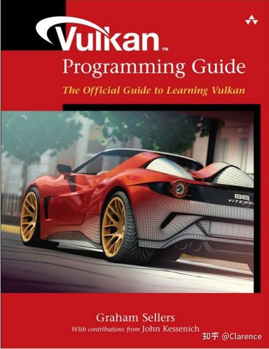

# Vulkan: 简明理解Instance Device and Queue 概念

## Vulkan

Vulkan是openGL的继承者，相比OpenGL，Vulkan是一个精确的API。如果说，OpenGL是自动挡的车，那么Vulkan就是手动挡的车。你见过职业赛车手会去使用自动挡的车吗？什么时候加速，什么时候减速，完全由驾驶员来决定，但是相对的，学习的成本会更高一些。

“天上不会掉下馅饼”，[方法论](https://zhida.zhihu.com/search?content_id=228951161&content_type=Article&match_order=1&q=方法论&zhida_source=entity)，无论在哪个领域都一样。

用自动档私家车和赛车来比喻OGL和Vulakn，实在是太贴切，以至于老外写的关于Vulakn的书都逃不开使用赛车作为封面。



这本书上Graham Sellers提到，Vulkan的野心不单单是成为一个卓越的图形API，他也有能力成为用来编程DSP设备的API标准，这个论断比较有意思，因此复述过来。

这篇文章，主要是阅读了《vulkan_programming_guide》的Overview of Vulkan ，做了一些读书笔记。关于Instance,Device,Queue，我的想法是通过一些浅显的中文表述，来彻底理解这些看似高深的概念。

## Instance

Instance是一最高等级的[抽象概念](https://zhida.zhihu.com/search?content_id=228951161&content_type=Article&match_order=1&q=抽象概念&zhida_source=entity)，我会把它理解为一个library，这个library和GPU是什么，没有什么关系，创建Instance object是运行任何vulkan APP的初始化代码的起点。他的主要作用有下述几个。

1. 告知需要使用哪些Instance Level的Extension，并确定是否使能
2. 告知是否需要使用[validation layer](https://zhida.zhihu.com/search?content_id=228951161&content_type=Article&match_order=1&q=validation+layer&zhida_source=entity)

有了上述信息之后，就可以创建一个instance Object。其中，你需要告诉使用哪些instance级别的extension，这里最常用的instance level extension就是glfwExtension了。如下述代码和注释

```text
        glfwExtensions = glfwGetRequiredInstanceExtensions(&glfwExtensionCount);
        /*
        * vulkan is a platform agnostic API,which means that you need an
        * extension to interface with the window system.
        * GLFW has a handy built-in function that returns the extension 
        * it need to do , as follow code
        */
        createInfo.enabledExtensionCount = glfwExtensionCount;
        createInfo.ppEnabledExtensionNames = glfwExtensions;
```

## Device

Device分为两种，Physical Device 以及 Logic Device。

显然，Physical Device是和具体的GPU设备一一对应的。当我们创建好instance，就可以通过这个instance查询当前的环境下存在哪些GPU[物理实体](https://zhida.zhihu.com/search?content_id=228951161&content_type=Article&match_order=1&q=物理实体&zhida_source=entity)可用。

通过vkEnumeratePhysicalDevices 根据 instance 信息查询可用physical device 实体

```text
        uint32_t deviceCount = 0;
        vkEnumeratePhysicalDevices(instance, &deviceCount, nullptr);

        if (deviceCount == 0) {
            throw std::runtime_error("failed to find GPUs with Vulkan support!");
        }

        std::vector<VkPhysicalDevice> devices(deviceCount);
        vkEnumeratePhysicalDevices(instance, &deviceCount, devices.data());
```

那么此时，我们将会查询到多个[physical device](https://zhida.zhihu.com/search?content_id=228951161&content_type=Article&match_order=2&q=physical+device&zhida_source=entity)，我们将会抉择接下来的vulkan APP将会使用哪一个device。

这里有几个判断依据

1. Queue的支持情况，Queue一般分为一下几种，图形（graphics），计算（compute），传输（transfer），显示(present)等，举个例子，并不是所有的GPU都支持present的功能，因为这类GPU完全可以是专业用做“[云渲染](https://zhida.zhihu.com/search?content_id=228951161&content_type=Article&match_order=1&q=云渲染&zhida_source=entity)”，他将渲染的结果通过网络的方式传给display设备，自身不需要实现present的功能。因此如果用户需要显示，需要在多个physical中查询其queue功能是否支持。通过下述函数可以查到支持信息

```text
        uint32_t queueFamilyCount = 0;
        vkGetPhysicalDeviceQueueFamilyProperties(device, &queueFamilyCount, nullptr);

        std::vector<VkQueueFamilyProperties> queueFamilies(queueFamilyCount);
        vkGetPhysicalDeviceQueueFamilyProperties(device, &queueFamilyCount, queueFamilies.data());
```

2. Device level Extension的支持情况，vulkan定义了许多Extension插件，不是所有的GPU厂商都完全支持这些插件，好比玩steam上的游戏，我会有选择的去买DLC一样，不是所有的GPU都支持所有的Extension。当你想用某个Extension的时候，首先需要去查询physical device是否支持这个extension。（最常用的Extension之一就是swap chain这个用来显示相关的extension）。通过下述函数可以查到支持信息

```text
       uint32_t extensionCount;
       vkEnumerateDeviceExtensionProperties(device, nullptr, &extensionCount, nullptr);

       std::vector<VkExtensionProperties> availableExtensions(extensionCount);
       vkEnumerateDeviceExtensionProperties(device, nullptr, &extensionCount, availableExtensions.data());
```


好了，到这里，我们通过instance，查到了许多physical device，通过一些函数，我们得到了这一大堆physical device 的 queue 支持情况，以及他们对应支持的extension信息，我们艰难的根据自己的需求选择了一个GPU。（当然，大多数人没得选，电脑上有一个GPU是大多数人的普遍情况）

接下来，会把你选择好的physical device 包装成一个Logic Device。

在包装的过程中会做如下几件事

1. 之前通过查询我们已经知道了选定的physical支持哪些queue类型，在create logic device的时候，把他创建出来
2. 同样，之前查到选定的physical支持哪些extension，在这里进行使能。
3. 同样需要在这里配置validation layer相关的信息
4. 最后，不要忘记通过logic device object将创建好的queue 句柄拿出来备用（vkGetDeviceQueue）

如下述精简代码

```text
        VkDeviceCreateInfo createInfo{};
        createInfo.sType = VK_STRUCTURE_TYPE_DEVICE_CREATE_INFO;

        /* create two queue family */
        createInfo.queueCreateInfoCount = static_cast<uint32_t>(queueCreateInfos.size());
        createInfo.pQueueCreateInfos = queueCreateInfos.data();

        createInfo.pEnabledFeatures = &deviceFeatures;

        createInfo.enabledExtensionCount = static_cast<uint32_t>(deviceExtensions.size());//todo list
        createInfo.ppEnabledExtensionNames = deviceExtensions.data();//todo list

        if (enableValidationLayers) {
            createInfo.enabledLayerCount = static_cast<uint32_t>(validationLayers.size());
            createInfo.ppEnabledLayerNames = validationLayers.data();
        }
        else {
            createInfo.enabledLayerCount = 0;
        }

        if (vkCreateDevice(physicalDevice, &createInfo, nullptr, &device) != VK_SUCCESS) {
            throw std::runtime_error("failed to create logical device!");
        }

        vkGetDeviceQueue(device, indices.graphicsFamily.value(), 0, &graphicsQueue);
```

当创建好了logic device，后面的大多数Vulkan API都会将其作为参数传入。

## Queue

Vulkan的编程方式是将许多指令堆在一起，放在Command buffer中，最后一口气提交给GPU。这里的“GPU”vulkan就把他抽象成了一个个Queue，最后的submit指令，就是往Queue中去submit的。

在查询physical device支持哪些queue的时候，会得到一个VkQueueFamilyProperties 类型的数组，里面存放的是支持的queue类型，每个VkQueueFamilyProperties 都包含queueFlags成员，对应枚举代码如下

```text
typedef enum VkQueueFlagBits {
    VK_QUEUE_GRAPHICS_BIT = 0x00000001,
    VK_QUEUE_COMPUTE_BIT = 0x00000002,
    VK_QUEUE_TRANSFER_BIT = 0x00000004,
    VK_QUEUE_SPARSE_BINDING_BIT = 0x00000008,
    VK_QUEUE_PROTECTED_BIT = 0x00000010,
#ifdef VK_ENABLE_BETA_EXTENSIONS
    VK_QUEUE_VIDEO_DECODE_BIT_KHR = 0x00000020,
#endif
#ifdef VK_ENABLE_BETA_EXTENSIONS
    VK_QUEUE_VIDEO_ENCODE_BIT_KHR = 0x00000040,
#endif
    VK_QUEUE_OPTICAL_FLOW_BIT_NV = 0x00000100,
    VK_QUEUE_FLAG_BITS_MAX_ENUM = 0x7FFFFFFF
} VkQueueFlagBits;
```

我们会去做检查，查看physical device支持的queue 支持哪些queue的功能。如果VkQueueFamilyProperties->queueFlags = VK_QUEUE_GRAPHICS_BIT | VK_QUEUE_COMPUTE_BIT | VK_QUEUE_TRANSFER_BIT

那么证明这个queue支持上述三种功能。

绝大多数的GPU支持的首个queueFamily的flag是包含 VK_QUEUE_GRAPHICS_BIT | VK_QUEUE_COMPUTE_BIT | VK_QUEUE_TRANSFER_BIT的。

我测PC使用的是RTX 3060 显示的就是 queueFamily[0]支持所有常规操作。

### 小结

回顾下初始化的基本流程，是如何串起来Instance device以及queue的。

1. 创建instance，传入validation layer，以及需要使用的instance level Extension信息
2. 使用instance查询当前系统支持的physcial device集合，查询每个physical device对queue的支持情况和device level extesion的支持情况，然后按需选择一个physical device
3. 把选择好的physical device 包装成一个logic device，在这个过程中传入需要使能的device level extension和feature，传入validation layer信息，传入需要创建的queue信息。创建好logic device之后，别忘了把在这个过程中创建好的queue object取回来备用。以后指令都会submit到这里创建的queue中。