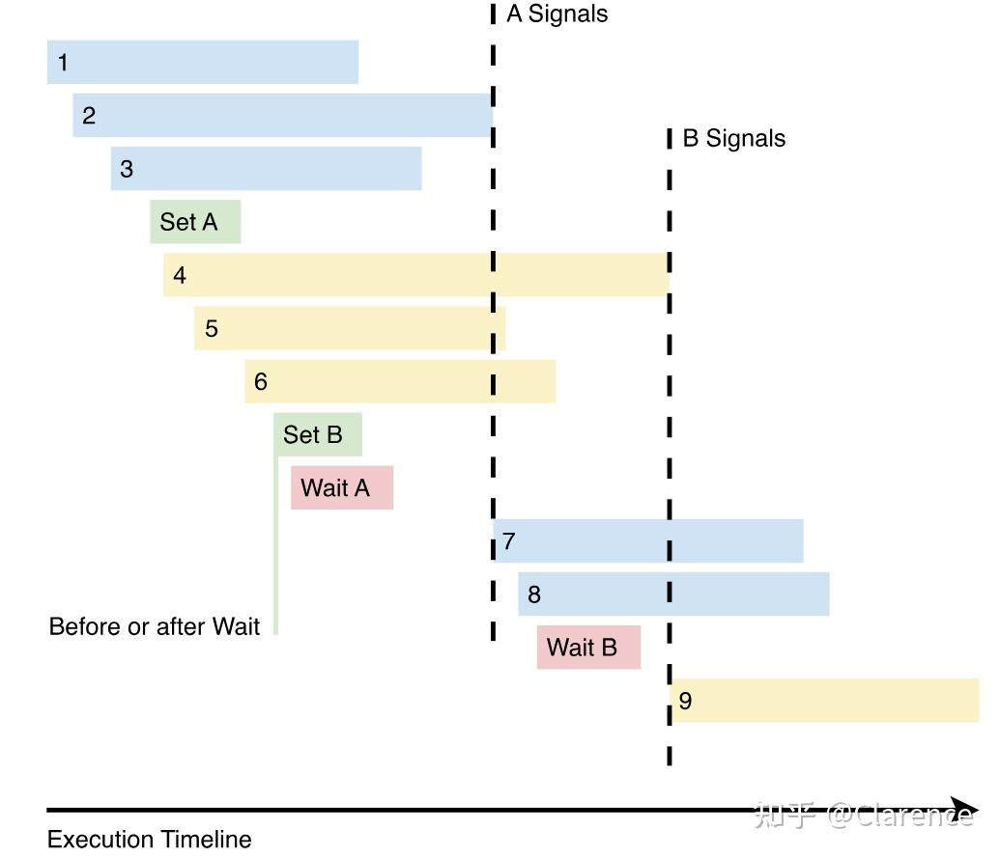

# Vulkan:理解同步的作用

## 理解同步的作用

如果图形开发者之前有接触过DirectX或者OGL，那么将会对low level的图形API vulkan的一些概念会很熟悉。OGL和DirectX在驱动层做了很多不利于提高性能的事情，但是vulkan不会，因为他是较低层级的API，开发者可以显著的控制同步相关的操作，以此达到提高性能的目的。

举例说明，Vulkan能让开发者在开发应用的时候，更加精确的控制和协调多个图形任务以及[内存管理](https://zhida.zhihu.com/search?content_id=233942058&content_type=Article&match_order=1&q=内存管理&zhida_source=entity)。这些工作任何一个熟悉C/C++的开发者都可以完成，但是需要额外学习一些新的知识。

这篇文章的目的是帮助开发者更加轻松的理解和掌握Vulkan Synchronization的概念。我们将会讲解一些重要的同步概念，以及告知读者如何正确的使用这些功能。

## 为什么同步非常重要

Vulkan给开发者提供了更加全面的渲染控制能力，这样可以增强CPU和GPU的运行性能，最大化的保证CPU和GPU的[并行处理](https://zhida.zhihu.com/search?content_id=233942058&content_type=Article&match_order=1&q=并行处理&zhida_source=entity)能力。上一代图形APIS几乎都是以顺序运行的方式呈现的，但是Vulkan在设计之初，就非常明确他是并行运行的，并且是为多线程而构建的。

举例说明，GPU和CPU可以分别独立的运行fragment shader，以及输入顶点的操作。这样可以做到，GPU在运行上一帧的fragment shader的同时CPU开始配置和输入下一帧vertex shader的顶点数据。因为这两个任务是几乎独立的，因此完全可以并行的做这两件事。如果两个任务存在依赖关系，我们也可以设置相应的等待条件，以此来最大化并行的程度，最终提高性能。

通过CPU和GPU的合理的协调工作，我们可以保证资源不会保持过长的闲置时间(idling)，最大限度的利用user's system的性能。想达到这样的效果，关键在于开发者要正确的配置[并行任务](https://zhida.zhihu.com/search?content_id=233942058&content_type=Article&match_order=1&q=并行任务&zhida_source=entity)，让每个并行任务只会去等待他的确依赖的其他任务。

举个例子，存在两个draw，第一个draw会去绘制深度纹理（光照算法的前置操作），第二个draw会使用上一个draw绘制的深度纹理，对场景进行光照计算。那么这里就会出现两个draw task的依赖关系，如果draw2，在draw1之前完成，则会出现错误。Vulkan的同步机制让我们可以很好的去定义这些依赖关系。

接下来就是去理清楚，同步机制是如何工作的。我们会把同步分为两个等级

1. 在同一个queue中的同步
2. 在不同queue之间的同步

首先，先去看在同一个queue之间的同步。

## 在同一个Device Queue中的同步

Vulkan要求我们发送command buffer到某一个queue，以这种方式来触发graphics operation。这样的[机制设计](https://zhida.zhihu.com/search?content_id=233942058&content_type=Article&match_order=1&q=机制设计&zhida_source=entity)是为了更见兼容多线程的情况，任何一个CPU 线程，只需要创建相应的command buffer然后submit到同一个queue，这样GPU也就可以知道，这是同一个queue需要执行的[graphics](https://zhida.zhihu.com/search?content_id=233942058&content_type=Article&match_order=2&q=graphics&zhida_source=entity) operation。这样做的好处是，CPU的多个线程，可以一个去计算顶点，另外一个去读取texture，然后将对应的command submit到同一个queue，最大化的利用CPU多线程/多核心的特性，提升CPU的并行能力。

在同一个queue中不同的command之间可以建立执行的依赖关系，例如commandA的执行条件是commandB执行完成，这样的依赖关系并不要求这两个command在同一个command buffer中。注意，command是可以保证按照插入的顺序去**开始运行，**但是由于多个command是并行运行的，并且他们之间存在运行的依赖关系，因此**不能保证**会按照插入的顺序**完成运行**。简而言之，[cmd](https://zhida.zhihu.com/search?content_id=233942058&content_type=Article&match_order=1&q=cmd&zhida_source=entity)是按照插入顺序开始运行，但是每个cmd的结束顺序不一定。

在同一个queue中去完成同步，我们有三个工具去设定同一个queue中不同cmd的依赖关系。分别是 pipeline barriers，events，subpass depencies。我们一个一个看。

### Pipeline Barriers

pipeline barriers指定了 [渲染管线](https://zhida.zhihu.com/search?content_id=233942058&content_type=Article&match_order=1&q=渲染管线&zhida_source=entity)(rendering pipline) 哪些数据 / stages 需要被等待，哪些数据/stage将会卡死command直到前一个command完成。

> Pipeline barriers specify **what data or which stages** of the rendering pipeline to wait for and which stages to block until other specified stages in previous commands are completed.

笔者意译理解如下，在vulkan下，每个command都会经历部分pipeline stage，例如draw cmd，典型的，如果存在两个draw，DRAW1 和 DRAW2，想定义这两个draw的执行关系，则需要指定DRAW2将会卡死在哪个stage一直等到DRAW1达到某个stage。

注意pipeline barrier是GPU独有的同步工具，CPU无权访问。

在给出的作用中，command会等待stage或者data，作为同步的消息，因此pipeline barrier理所当然的分为了以下两类

1. Execution [barrier](https://zhida.zhihu.com/search?content_id=233942058&content_type=Article&match_order=6&q=barrier&zhida_source=entity) (block in stage and wait another task's stage )
2. Memory barrier (block in data and wait another task's data)

这两个机制可以同时使用。

Here is the pipeline barrier function for reference as we discuss parts of it below:

```as3
void vkCmdPipelineBarrier(
   VkCommandBuffer                             commandBuffer,
   VkPipelineStageFlags                        srcStageMask,
   VkPipelineStageFlags                        dstStageMask,
   VkDependencyFlags                           dependencyFlags,
   uint32_t                                    memoryBarrierCount,
   const VkMemoryBarrier*                      pMemoryBarriers,
   uint32_t                                    bufferMemoryBarrierCount,
   const VkBufferMemoryBarrier*                pBufferMemoryBarriers,
   uint32_t                                    imageMemoryBarrierCount,
   const VkImageMemoryBarrier*                 pImageMemoryBarriers);
```

### Execution Barriers

如果我们想要使用pipeline barrier去控制command之间的执行顺序，我们可以在两个command之间插入一个Pipeline barrier命令，并且设定barrier之后的command继续运行的先决条件，是barrier之前的command达到哪个stage，并且设置barrier之后的command等待于什么stage之上。

这些选项是使用vkCmdPipelineBarrier的srcStageMask和dstStageMask参数设置的。因为它们是位标志，我们可以在这些掩码中指定多个阶段。在允许dstStageMask中给出的阶段在后续命令中执行之前，srcStageMask标记了在前面命令中等待的阶段。对于pipeline barrier，扩展srcStageMask以包含逻辑上较早的阶段。同样，**扩展**了dstStageMask以包含逻辑上较晚的阶段。在srcStageMask(及更早)中的阶段完成之前，dstStageMask(及更早)中的阶段不会启动。这足以保护srcStageMask中的分阶段读访问和dstStageMask中的分阶段写访问。

关于扩展的问题，译者理解如下

command1和command2，假设都会去执行A B C D四个阶段，我指定command2会停止在C阶段，一直等到command1执行到B阶段。那么实际上，我这样说也没错，command2会停止在D阶段，一直等到command1执行到A阶段。因为停在C等B，是临界的stage，因此src往前扩展以及dst往后扩展逻辑上并无问题。这样的扩展是不适用于[memory barrier](https://zhida.zhihu.com/search?content_id=233942058&content_type=Article&match_order=1&q=memory+barrier&zhida_source=entity)的。

To avoid a common pitfall, note that stage mask expansion is not applied to memory barriers defined below.

### Memory Barriers

为了增加性能，vulkan使用了一系列的Cache[缓存机制](https://zhida.zhihu.com/search?content_id=233942058&content_type=Article&match_order=1&q=缓存机制&zhida_source=entity)，用来链接快速缓存内存L1/L2 Cache以及读写速度较慢的主要RAM 内存。

当一个计算单元core去写memory的时候，这一次写操作还只是停留在cache中，对于其他的core来说并不是visible或者avaliable，这意味着其他的core无法和产生这笔写的core同步资源。

memory barrier的作用就是保证在barrier之前的command写入内存的操作，能正常flush下去，不影响barrier之后的command对同一片内存的访问，保证能读到前一次的写结果。想达成memory同步的效果需要做到如下两点。

1.core1写的时候，core只会写到自己对应的cache，做一次flush操作，使得写操作写到RAM中而不是cache，做完此操作之后，则认为这一段内存available。

2.core2读的时候，core只会去读自己对应的cache，需要做一次invalidate操作，使得其对应的cache被标记为dirty，下一次read的时候，cache产生miss，从而到RAM中更新数据到cache中。做了这个事情之后，认为此段内存visible。

execute barrier规范了两个command的运行顺序，memory barrier则会去规定等待的内存访问类型，以及在指定阻塞Pipeline stage的内存访问类型。主要由两个参数来控制srcAccessMask以及dstAccessMask。用来指定barrier之前的cmd对资源的访问（通常是写操作），使得其能保证对于barrier之后的cmd是avalibale和visible的。

和execute barrier不同，access mask只会作用于特定的stageMask，不会进行扩展。

简单的例子，如下，假设由两个draw，draw1和draw2，draw2会使用draw1的绘制结果作为输入，那么必然产生了依赖和数据同步的需求。此时

```text
srcAccessMask = VK_ACCESS_COLOR_ATTACHMENT_WRITE_BIT
dstAccessMask = VK_ACCESS_SHADER_READ_BIT
```

意味着draw2在shader阶段的时候读操作 和 draw1在输出颜色阶段的写操作，驱动会保证这两个阶段的数据同步。draw1的写结果，能正常的被draw2的读看到。

### 经典的使用pipeline barrier示例

一个经典的示例就是使用compute pipline将计算结果放到texture image中，然后接下来将会在graphics pipeline中去使用它。那么将会这样做配置

```text
vkCmdDispatch(...);

VkImageMemoryBarrier imageMemoryBarrier = {
 ...
 .srcAccessMask = VK_ACCESS_SHADER_WRITE_BIT,
 .dstAccessMask = VK_ACCESS_SHADER_READ_BIT,
 .oldLayout = VK_IMAGE_LAYOUT_GENERAL,
 .newLayout = VK_IMAGE_LAYOUT_SHADER_READ_ONLY_OPTIMAL
 /* .image and .subresourceRange should identify image subresource accessed */};

vkCmdPipelineBarrier(
   ...
   VK_PIPELINE_STAGE_COMPUTE_SHADER_BIT,  // srcStageMask
   VK_PIPELINE_STAGE_FRAGMENT_SHADER_BIT, // dstStageMask
   ...
   1,                                     // imageMemoryBarrierCount
   &imageMemoryBarrier,                   // pImageMemoryBarriers
   ...);
   

... // Render pass setup etc.

vkCmdDraw(...);
```

## Event

Vulkan中的另一个同步工具是event，它使用source stage masks和destination stage masks掩码，就像pipeline barrier一样，当我们需要指定和运行[并行计算](https://zhida.zhihu.com/search?content_id=233942058&content_type=Article&match_order=1&q=并行计算&zhida_source=entity)时，它会非常有用。与pipeline barrier相比，event最大的不同是event会使用两个部分。

第一部分是setting event，使用**vkCmdSetEvent**

第二部分是waiting event，使用**vkCmdWaitEvents**

event将vkCmdSetEvent调用之前发生的执行和内存访问与vkCmdWaitEvents调用之后发生的执行和内存访问同步;在vkCmdSetEvent和vkCmdWaitEvents之间发生的命令不受该事件的影响。注意与pipeline barrier不同，event可以由cpu来配置，也可以由GPU来设置。

event由vkCmdSetEvent传入stageMask来创建，指明了在setEvent之前的cmd的stageMask,在wait的时候，必须等到set之前的cmd运行到stageMask的状态，也就是指明了wait之后的cmd继续运行的条件。

event的作用和pipeline barrier很类似，也就是wait之后的cmd，会卡死在dstStageMask，一直等到set之前的cmd运行到srcStageMask。当set 之前的cmd运行到srcStageMask也就是这个event signal。waitEvent里面也有srcAccessMask以及dstAccessMask，作用和pipeline barrier完全相同。

举个例子来说明event的作用



```text
// Three dispatches that don’t have conflicting resource accesses

vkCmdDispatch( 1 );
vkCmdDispatch( 2 );
vkCmdDispatch( 3 );

// 4, 5, and 6 don’t share resources with 1, 2, and 3
// No reason for them to be blocked, so set an event to wait for later

vkCmdSetEvent( A, srcStageMask = COMPUTE );
vkCmdDispatch( 4 );
vkCmdDispatch( 5 );
vkCmdDispatch( 6 );

// 7 and 8 don’t use the same resources as 4, 5, and 6.  So use an event
vkCmdSetEvent( B, srcStageMask = COMPUTE );

// 7 and 8 need the results of 1, 2, and 3

// So we’ll wait for them by waiting on A
vkCmdWaitEvents( A, dstStageMask = COMPUTE );
vkCmdDispatch( 7 );

vkCmdDispatch( 8 );
// 9 uses the same resources as 4, 5, and 6 so we wait.

// Also assumed is that 9 needs nothing from 7 and 8
vkCmdWaitEvents( B, dstStageMask = COMPUTE );

vkCmdDispatch( 9 );
```

注意 event的set/wait只会影响 set之前和 wait之后的，至于他们中间的cmd不会受影响。123 和 456 因为没有依赖关系，因此放在setA waitA之间，78依赖123的结束，因此产生了waitA,也就是 78会等待在COMPUTE state直到123完成COMPUTE stage。

### Subpass Dependencies

在同一个[renderpass](https://zhida.zhihu.com/search?content_id=233942058&content_type=Article&match_order=1&q=renderpass&zhida_source=entity)的subpass可以设定同步机制，功能几乎是与pipeline barrier一致的，需要注意以下几点

- They contain only a single memory barrier for attachments specified with **srcAccessMask** and **dstAccessMask**.
- Subpasses can wait to complete using pipeline stage flags **srcStageMask** and **dstStageMask**.
- They can only make forward progress, meaning a subpass can wait on earlier stages or the same stage, but cannot depend on later stages in the same render pass.

## 在不同的queue中完成同步

如下几个工具可以用来完成在不同queue中进行task 同步的功能

### Semaphores

[信号量](https://zhida.zhihu.com/search?content_id=233942058&content_type=Article&match_order=1&q=信号量&zhida_source=entity)是简单的信号标识符，用于指示何时处理一批命令。当使用vkqueuessubmit提交队列时，我们可以传入多个信号量作为参数。

理解和使用信号量的关键是认识到它们仅用于GPU任务之间的同步，特别是跨多个队列，而不是用于GPU和CPU任务之间的同步。

如果多个命令正忙着跨内核和线程处理它们的任务，那么信号量就像是一组命令已经完成的公告。只有在[批处理](https://zhida.zhihu.com/search?content_id=233942058&content_type=Article&match_order=1&q=批处理&zhida_source=entity)中的所有命令都完成后才会发出信号量。它们提供隐式内存保证，因此我们可以访问信号量后面的任何内存，而无需考虑在它们之间添加[内存屏障](https://zhida.zhihu.com/search?content_id=233942058&content_type=Article&match_order=1&q=内存屏障&zhida_source=entity)。

关键点在于，所有的command执行完成之后，也就是submit结束，才会将传入submit函数的semaphores置起。

### Fences

Fences are pretty straightforward: while semaphores were built for synchronizing GPU tasks, fences are designed for GPU-to-CPU synchronization

Fences can attach to a queue submission and allow the application to check a fence status using**vkGetFenceStatus**or to wait for queues to complete using**vkWaitForFences**.

Fences make the same implicit memory guarantee as semaphores, and if we want to present the next frame in a swap buffer, we can use fences to know when to swap and start the render of the next frame.

## 小结

“子曰：温故而知新，可以为师也”再次拜读[Khronos Blog - The Khronos Group Inc](https://link.zhihu.com/?target=https%3A//www.khronos.org/blog/understanding-vulkan-synchronization) 这篇文章，我更加能熟悉pipeline barrier以及event等基本的的vulkan同步工具。GPU是多并行处理的，这也是提性能卓越的重要原因之一，运行在GPU上的多个task之间如何确定其运行的先后顺序，是性能提升的重要议题。

我作为驱动开发者，深入理解这些同步的[设计理念](https://zhida.zhihu.com/search?content_id=233942058&content_type=Article&match_order=1&q=设计理念&zhida_source=entity)和哲学，可以更加提升对实现代码的掌握，从而增强最终的GPU产品性能~