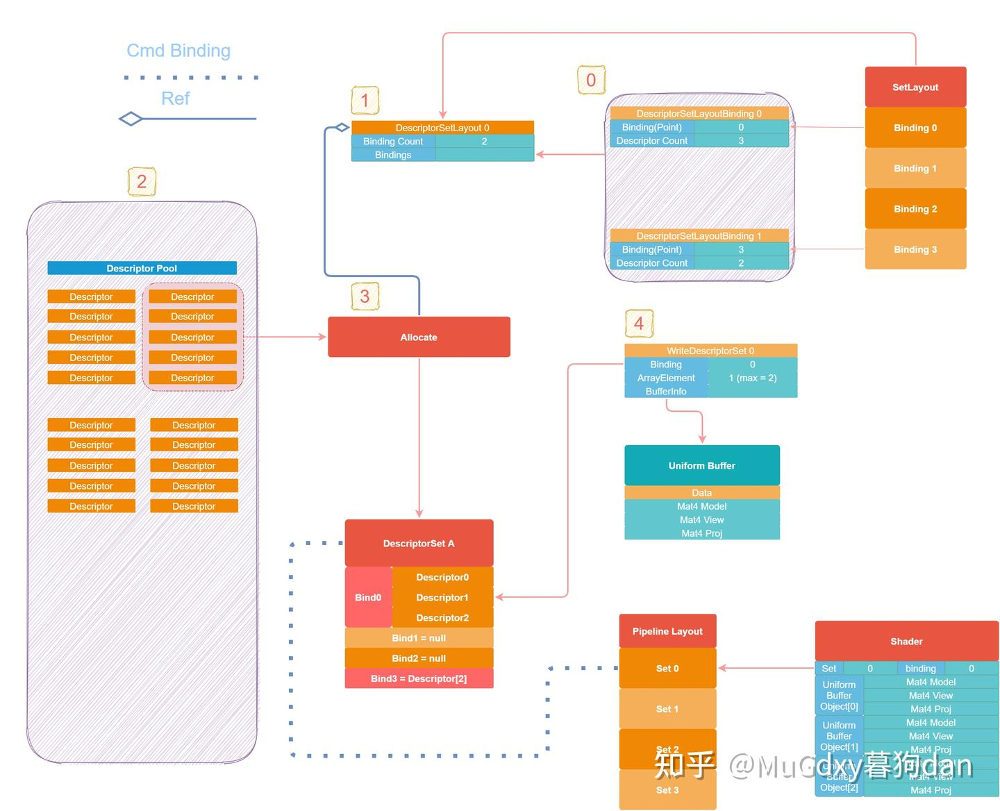
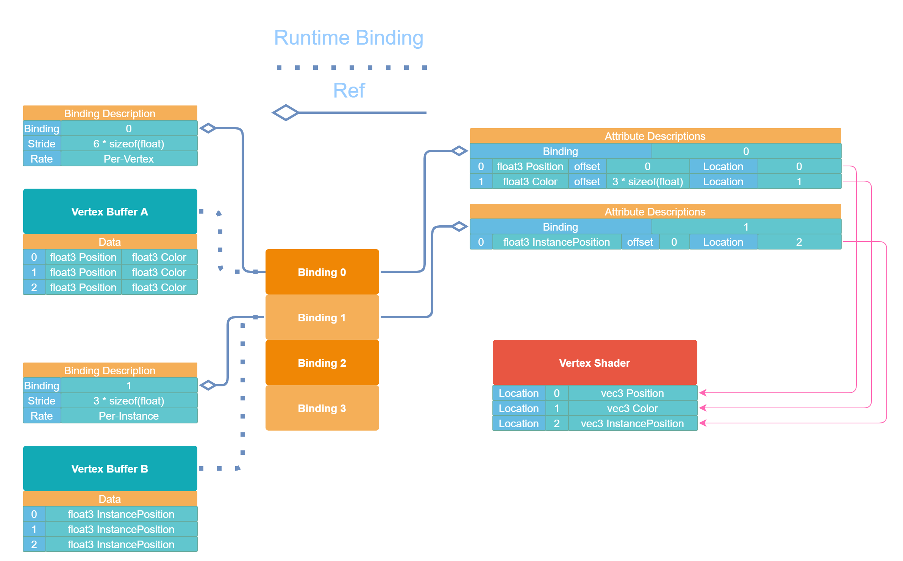

# 一张图形象理解Vulkan DescriptorSet

在理解Vulkan Descriptor时，会遇到以下几个对象：

- Descriptor
- Descriptor Set
- Descriptor Set Layout
- Descriptor Pool
- Pipeline Layout
- Set and Binding in Shader

下图用最简单的Uniform Buffer Object来描述整个过程（大图会更加清晰）。



首先我们先确定层级关系，Set 高于Descriptor。

一个Set下有若干个Binding Point，Binding Point下有一个Descriptor Array，Descriptor Array中含有一个或多个Descriptor，更为准确的表达如下方公式所示。

D:=DescriptorArr:={D0,D1,...,Dn}Bind:=ArrSet:={Bind0,Bind1,...,Bindm}

最终利用Command绑定的单位是Set，正如大图中Pipeline Layout所示。

根据 Vulkan Tutorial [Descriptor layout and buffer](https://link.zhihu.com/?target=https%3A//vulkan-tutorial.com/Uniform_buffers/Descriptor_layout_and_buffer), 我们首先建立DescriptorSetLayoutBindings（图中第0步），这个部分由多个DescriptorSetLayoutBinding组成，描述了一个Set的数据组织。比如图中：

- DescriptorSetLayoutBinding0 描述Binding=0中有三个Descriptor，他们以Array的形式存在，在glsl shader中会这样描述：

```glsl
layout(set = 0, binding = 0) uniform MyBuffer 
{    
    mat4 model;
    mat4 view;
    mat4 proj; 
} ubo[]; // <- 一个bind point上可以存在一个descriptor array
```

- DescriptorSetLayoutBinding1 描述在Binding=3处有两个Descriptor，他们以Array的形式存在，在后文中DescriptorSetLayoutBinding1将不会展开说明。

他们共同构成了一个DescriptorSetLayout的描述。

建立对应的Descriptor Pool后，我们需要依据DescriptorSetLayout从中分配（Allocate）一些Descriptors。正如图中所示，红色的“Allocate”引用了DescriptorSetLayout。

用直白的语言描述就是：在DescriptorSetLayout的指导下，利用Descriptor Pool提供的Descriptors，组装成一个符合DescriptorSetLayout的Set（即图中红色的DescriptorSet A）。

此时，DescriptorSet A中不包含任何的数据，只是一个空框架。接下来，我们根据WriteDescriptorSet来写入信息。其中：

- binding和DescriptorSetLayoutBinding0.binding相对应
- 0 <= ArrayElement < DescriptorSetLayoutBinding0.Count，表示写入Array中的第几个对象，这里我们只想写入index=1位置（对应DescriptorSetA.Bind0.DescriptorArray[1]），图中只写入了一个，理论上可以写入连续的多个Descriptor。

完成此五步，DescriptorSet的建立便完成了。

接下来需要做的就只有在运行时绑定DescriptorSet了。这里对应的Command就是vkCmdBindDescriptorSets。至于为什么是BindDescriptorSets而不是BindDescriptorSet，显然，在图中也有所体现，Pipeline Layout的Set不止一个，允许一次绑定多个也是合情合理。

而在Shader中，我们最终通过:

```glsl
layout(set = 0, binding = 0) uniform MyBuffer 
{    
    mat4 model;
    mat4 view;
    mat4 proj; 
} ubo[]; 
void main()
{
    mat4 trans = ubo[1].proj * ubo[1].view * ubo[1].model;
    //...
}
```

来获取我们写入的对应数据。

这里有一个很有意思的表达习惯差异：

在Vertex Input中有：

[一张图形象理解Vulkan Vertex Input Description50 赞同 · 1 评论文章](https://zhuanlan.zhihu.com/p/450157594)

- Binding Description
- Attribute Description

同样是描述和解释数据块，本节中却使用的是Descriptor。可以从中感受到，Description是抽象的描述，真正绑定到Pipeline Vertex Input Stage的是Vertex Buffer本身，而Descriptor是[描述器](https://zhida.zhihu.com/search?content_id=188226932&content_type=Article&match_order=1&q=描述器&zhida_source=entity)，可以认为他对数据进行了一层封装，连同自己一起参与到了数据解析的全过程中，使得真正绑定到Pipeline的是Descriptor而不再是Buffer。

------

## Q&A

问：为什么我在Vulkan中找不到VkDescriptor这样一个Handle？为什么文章中要特别提到Descriptor这个概念呢？

答：Vulkan并不单独处理一个Descriptor，所有的操作都以Descriptor Set为单位，不论是Bind到Pipeline还是，更新Set中的一个Descriptor。所以Vk并没有给出一个Descriptor的Handle，而是以WriteDescriptorSet的形式来完成一个Buffer和Descriptor的binding工作，示例代码为：

```cpp
VkDescriptorBufferInfo bufferInfo;
bufferInfo.buffer = storageBuffer;
bufferInfo.offset = 0;
bufferInfo.range = bufferSize;
VkWriteDescriptorSet write{};
descriptorWrite.sType = VK_STRUCTURE_TYPE_WRITE_DESCRIPTOR_SET;
write.descriptorCount = 1;
write.descriptorType = VK_DESCRIPTOR_TYPE_STORAGE_BUFFER;
write.dstBinding = 0;
write.dstArrayElement = 0;
write.dstSet = descriptorSet;
write.pBufferInfo = &bufferInfo;
vkUpdateDescriptorSets(device, 1, &write, 0, nullptr);
```

文中提到Descriptor的概念是为了层级清晰。