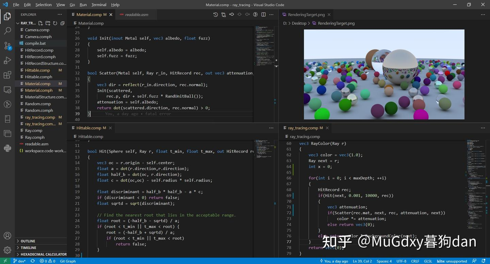
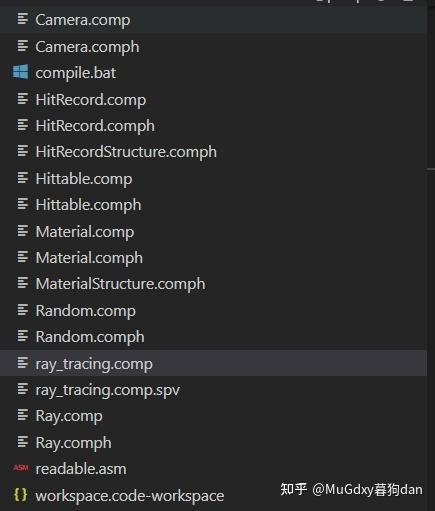
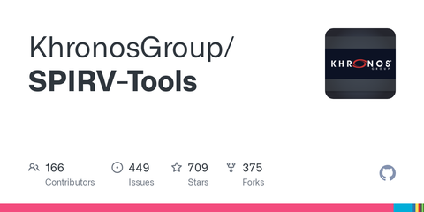
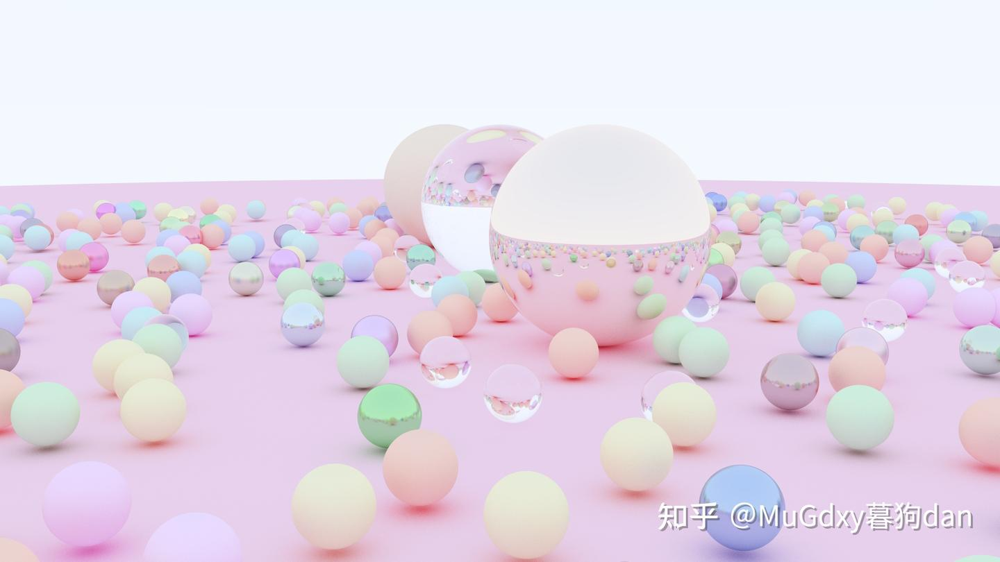

# Ray Tracing In One Weekend: Vulkan Compute Shader

## Intro

最近在折腾Vulkan Compute Shader正巧赶上狗蛋实验室电脑的GTX1650没办法跑硬件光追，那只能用Compute Shader实现一下了。

这次挑选的是广受好评的Ray Tracing[三部曲](https://zhida.zhihu.com/search?content_id=191041421&content_type=Article&match_order=1&q=三部曲&zhida_source=entity)中的

[Ray Tracing in One Weekendraytracing.github.io/](https://link.zhihu.com/?target=https%3A//raytracing.github.io/)

作为参考。

本篇中将涉及：

- Shader分离式编译与复用
- GLSL 伪面向对象（pseudo-OOP）
- Material与Hittable Object表示
- Compute Shader Based Ray Tracing 与 Ray Tracing In One Weekend 中 CPU based Ray Tracing的实现区别。

本篇中不涉及：

- Hand by Hand Tutorial
- GPU [TDR (Timeout Detection and Recovery)](https://link.zhihu.com/?target=https%3A//docs.microsoft.com/en-us/windows-hardware/drivers/display/timeout-detection-and-recovery)

[It’s time we talk about TDRwww.yosoygames.com.ar/wp/2020/04/its-time-we-talk-about-tdr/](https://link.zhihu.com/?target=https%3A//www.yosoygames.com.ar/wp/2020/04/its-time-we-talk-about-tdr/)

实际上，因为TDR的问题，我的GPU做这个时候经常Crash（当求解时间较长时）。解决方案倒是比较简单，拆分一下[shader](https://zhida.zhihu.com/search?content_id=191041421&content_type=Article&match_order=1&q=shader&zhida_source=entity)的任务即可。最粗暴的手段就是直接WaitQueueIdle然后再Submit，将结果累加。



Preview

## Data Transfer

长度固定的数据可以使用Uniform Buffer传入，比如Camera的参数。

```glsl
struct Camera
{
    //:0
    vec3    origin;
    vec3    horizontal;
    vec3    vertical;
    vec3    lowerLeftCorner;
    ...
};
layout(set = 1, binding = 0) uniform CameraBuffer
{
    Camera camera;
};
```

长度不固定的参数则可以全部选择Storage Buffer传入，包括：

- Rendering Target: vec4[ ]
- Material Heads: Material[ ]
- Material Dumps: vec4[ ]
- Hittable Heads: Hittable[ ]
- Hittable Dumps: vec4[ ]

Rendering Target是我们最终需要写入颜色的Buffer，当做Image对待，索引方式的是vec4[y*imageWidth+x]。

Head和Dumps在GLSL伪面向对象中会详细讲。

## Shader Separately Compile



由于我们在实现Compute Shader Ray Tracing时，会涉及大量的结构化的代码，放在一个Shader文件中，管理不方便，利用glslangValidator的分离编译选项，可以让我们像C/C++一样进行分离式编译。但是，到目前为止虽然spvlink已经支持多个spv link together，但glslangValidator依然还没有支持输出“无entry point的spv”

[GitHub - KhronosGroup/SPIRV-Toolsgithub.com/KhronosGroup/SPIRV-Tools#linker](https://link.zhihu.com/?target=https%3A//github.com/KhronosGroup/SPIRV-Tools%23linker)

但是依然可以这样做：

```console
glslangValidator -V ^
ray_tracing.comp ^
Random.comp Material.comp Ray.comp Hittable.comp HitRecord.comp ^
Camera.comp ^
-o ray_tracing.comp.spv
pause
```

直接使用源码来构建（对于[makefile](https://zhida.zhihu.com/search?content_id=191041421&content_type=Article&match_order=1&q=makefile&zhida_source=entity)非常不友好），理论上构建过程应该是:

- main.comp -> main.spv
- other.comp -> other.spv
- main.spv + other.spv -> linked.spv

不过，不久的将来就能够享受了。

## GLSL Pseudo-OOP

虽然OOP不是万能的，但是他在建模阶段确实非常好用。众所周知：

- GLSL不支持指针，我们需要用数组（Array）+索引（Index）的方式来模拟指针。
- GLSL支持函数重载。
- GLSL不支持[函数指针](https://zhida.zhihu.com/search?content_id=191041421&content_type=Article&match_order=1&q=函数指针&zhida_source=entity)或者任何意义上的可传递的函数参数，我们需要自己分发函数。

### Constructor & Member Function

由于GLSL支持函数重载，我们统一将所有的构造函数称为`Init()`

```glsl
struct Ray
{
    vec3 origin;
    vec3 direction;
};

void Init(inout Ray self, vec3 origin, vec3 direction)
{
    self.origin = origin;
    self.direction = normalize(direction);
}

vec3 At(Ray self, float t) { return self.origin + self.direction * t; }
```

这是一个`Ray`的实现，我们可以看到，`Init`函数返回值为`void`，第一个参数为`inout Ray`，如果采用返回值为Ray的构造函数，那么会因为无法重载（返回值类型不同无法构成重载）而需要命名多个构造函数`InitRay`,`InitMaterial`等，不方便。

同样的，成员函数，第一个参数为`Ray`。

### Polymorphism

[运行时多态](https://zhida.zhihu.com/search?content_id=191041421&content_type=Article&match_order=1&q=运行时多态&zhida_source=entity)在没有函数指针的情况下是没有办法实现的，这里只能利用函数分发来实现多态，总的流程为：

- 定义Head：包含类型Enum+一个数组索引（理解为ptr）+共有数据
- 根据Enum识别类型，通过数组索引从DataDump中获取对应的data，并构造子类型。
- 调用子类型函数。

首先，定义类型Enum，由于GLSL不支持Enum，但我们希望有一个Scoped Enum来防止重名，于是，使用const struct（const 类型会在编译阶段优化掉，不需要担心）

```glsl
const struct
{
    uint None;
    uint Lambertian;
    uint Metal;
    uint Dielectrics;
} MaterialEnum = {0,1,2,3};
```


构造Head：

```glsl
struct Material 
{ 
    //MaterialEnum 
    uint type;
    uint ptr; 
};
struct Lambertian{ vec3 albedo; };
struct Metal{ vec3 albedo; float fuzz; };
struct Dielectrics{ float ir; };
```


接下来我们需要两个Buffer，第一个用于放置Head（因为用户会定义任意多的Material），第二个用于放置Dumped Data。所谓Dumped Data就是把数据打散了放在一块内存区域中。这里我们用一个vec4数组作为一个堆，所有的Material的数据都放在这个Dump中，我们需要用Head(Material)中的ptr来获取数据起始位置。

```glsl
layout(set = 0, binding = 1, std430) readonly buffer MaterialBuffer
{ Material materials[]; };

layout(set = 0, binding = 2, std430) readonly buffer MaterialDumpBuffer
{ vec4 data[]; } materialData;
```

完成这些以后，我们就可以进行函数分发了：

```glsl
void Init(inout Lambertian self, vec3 albedo);
bool Scatter(Lambertian self, Ray r_in, HitRecord rec, out vec3 attenuation, out Ray scattered);
void Init(inout Metal self, vec3 albedo, float fuzz);
bool Scatter(Metal self, Ray r_in, HitRecord rec, out vec3 attenuation, out Ray scattered);
void Init(inout Dielectrics self, float ir);
bool Scatter(Dielectrics self, Ray r_in, HitRecord rec, out vec3 attenuation, out Ray scattered);

//dispatcher
bool Scatter(Material self, Ray r, HitRecord rec, out vec3 attenuation, out Ray scattered)
{
    switch(self.type)
    {
    case MaterialEnum.Lambertian:
        Lambertian lam;
        Init(lam, materialData.data[self.ptr].xyz);
        return Scatter(lam, r, rec, attenuation, scattered);
    case MaterialEnum.Metal:
        Metal met;
        vec4 d = materialData.data[self.ptr];
        Init(met, d.xyz, d.w);
        return Scatter(met, r, rec, attenuation, scattered);
    case MaterialEnum.Dielectrics:
        Dielectrics dlt;
        Init(dlt,materialData.data[self.ptr].x);
        return Scatter(dlt, r, rec, attenuation, scattered);
    }
    return false;
}
```

暂时我们的各种Material（Lambertian/Metal/Dielectrics）包含的数据量都没有超过一个vec4，所以不需要偏移指针(self.ptr)，当某个Material数据量超出vec4时，我们只需要使用(self.ptr+1)就可访问到下一个vec4数据。

获取完数据后，利用`Init` 构造函数构造出子类，并调用[子类函数](https://zhida.zhihu.com/search?content_id=191041421&content_type=Article&match_order=1&q=子类函数&zhida_source=entity)（完全可以不构造子类，而直接用获得的数据调用函数，这里构造的原因是提高可读性）

最后，作为Application一侧，我们需要编写一套自动生成指针和相应Data Dump的代码。例如，以MaterialPool的形式提供给用户，当用户在Allocate的时候，自动完成指针生成和完成对应布局。


与Material类似的，Hittable Object也需要这样的机制。在细节上的区别在于，Hittable还引用了Material，这时候，我们直接记录Material Array中的索引。

```glsl
const struct
{
    uint None;
    uint TriangleMesh;//unsupported yet
    uint Sphere;
} HittableEnum = {0,1,2};

struct Hittable { uint type; uint ptr; uint mat;};

struct Sphere { vec3 center; float radius;};
```

分发：

```glsl
layout(set = 0, binding = 3, std430) readonly buffer HittableBuffer
{ Hittable hittables[]; };

layout(set = 0, binding = 4, std430) readonly buffer HittableDumpBuffer
{ vec4 data[]; } hittableData;

void Init(inout Sphere self, vec3 center, float radius);
bool Hit(Sphere self, Ray r, float t_min, float t_max, out HitRecord rec);

bool Hit(Hittable hittable, Ray r, float t_min, float t_max, out HitRecord rec)
{
    switch(hittable.type)//dispatch
    {
    case HittableEnum.Sphere:
        Sphere s;
        vec3 center =  hittableData.data[hittable.ptr].xyz;
        float radius =  hittableData.data[hittable.ptr].w;
        Init(s, center, radius);
        return Hit(s, r, t_min, t_max, rec);
    default:
        return false;
    }
}

bool Hit(Ray r, float t_min, float t_max, out HitRecord rec)
{
    HitRecord temp_rec;
    bool hit_anything = false;
    float closest_so_far = t_max;

    for (int i = 0; i < hittableCount; ++i) 
    {
        Hittable obj = hittables[i];
        if(Hit(obj, r, t_min, closest_so_far, temp_rec))
        {
            hit_anything = true;
            closest_so_far = temp_rec.t;
            //set material
            temp_rec.mat = materials[obj.mat];
            rec = temp_rec;
        }
    }
    return hit_anything;
}
```

这样做在效率上来说可能不是特别高，但从结构化和可读性的角度上来说还是相对不错的。

### More Details

用数组（Array）+索引（Index）的方式来模拟指针还有一个问题。

对于支持指针的语言来说，解引用操作是如此的平凡（trivial），但对于用数组和索引来模拟指针的方式而言，解引用并不那么的简单和直观，试想一下这样一种情况：

[分离式编译](https://zhida.zhihu.com/search?content_id=191041421&content_type=Article&match_order=3&q=分离式编译&zhida_source=entity)时：带有entry point的main shader中定义了buffer，而不带entry point的tool shader（或者说具有可复用性的shader）并不能直接访问到这块buffer，那么也就没有办法用`Buffer[index]` 的方法来解引用了。

这里可以利用一个小trick，还是以Material的为例：

```glsl
//file: Material.comph
#define Interface
const struct
{
    uint None;
    uint Lambertian;
    uint Metal;
    uint Dielectrics;
} MaterialEnum = {0,1,2,3};

struct Material 
{ 
    //MaterialEnum 
    uint type;
    uint ptr; 
};
...
Interface void Deref(out Material mat, uint ptr);
//file: Main.comp
...
#include "Material.comph"
layout(set = 0, binding = 1, std430) readonly buffer MaterialBuffer
{ Material materials[]; };
Interface void Deref(out Material mat, uint ptr) { mat = materials[ptr]; }
```

可以看到，在`Material.comph` 中我们只声明了`void Deref(out Material mat, uint ptr)`，这个函数的实现交由管理实际Buffer的Shader来完成，所以我们冠以一个宏`Interface`用于说明他需要由外部来完成实现。

这样，任意的shader，不论是main shader，还是其他tool shader，只要包含了 `Material.comph`，都可以享受到解引用的快乐。 并且，编译器会将那些没用调用的函数自动排除，如果不需要解引用操作，那么即便不实现`Deref`函数，编译链接依然可以通过。

这样，如果我们对Data Dump也做类似的Deref，我们的函数分发也可以放到Tool Shader之中去了，代码的结构更加清晰易读了。

不在前面的小节中使用这个方法的原因：

- 我们讲述的就是指针的模拟，所以希望暴露[array](https://zhida.zhihu.com/search?content_id=191041421&content_type=Article&match_order=1&q=array&zhida_source=entity)和index这两个内容给大家，以方便直观理解。
- 防止丢失重点，Deref存在与否都与我们的核心目标关系不大。

> 核心目标是指：从Data Dump中还原出子类的数据。

## Remove Recursion

在Ray Tracing In One Weekend中，有这样一段代码，用于确定Camera Ray的最终颜色。

```cpp
color ray_color(const ray& r, const hittable& world, int depth) {
    hit_record rec;
    // If we've exceeded the ray bounce limit, no more light is gathered.
    if (depth <= 0) return color(0,0,0);

    if (world.hit(r, 0, infinity, rec)) {
        point3 target = rec.p + rec.normal + random_in_unit_sphere();
        return 0.5 * ray_color(ray(rec.p, target - rec.p), world, depth-1);
    }
    vec3 unit_direction = unit_vector(r.direction());
    auto t = 0.5*(unit_direction.y() + 1.0);
    return (1.0-t)*color(1.0, 1.0, 1.0) + t*color(0.5, 0.7, 1.0);
}
```

由于GLSL不支持递归，所以我们需要将递归转化为非递归。非树/图结构的递归一般都很好处理成循环结构。再不济，我们可以用数组模拟一个栈。好在`ray_color`函数的有着比较好的性质（满足结合律），我们可以直接展开成循环结构，并且不需要任何的模拟数据结构。

```glsl
vec3 BackgroundColor(Ray r) 
{
    vec3 dir = r.direction;
    float t = 0.5*(dir.y + 1.0);
    return mix(vec3(1.0,1.0,1.0),vec3(0.5, 0.7, 1.0), t);
}

vec3 RayColor(Ray r)
{
    vec3 color = vec3(1.0);
    Ray next = r;
    int x = 0;

    for(int i = 0; i < maxDepth; ++i)
    {
        HitRecord rec;
        if(Hit(next, 0.001, 10000, rec))
        {
            vec3 attenuation;   
            if(Scatter(materials[rec.mat], next, rec, attenuation, next))
                color *= attenuation;
            else return vec3(0);
        }
        else return color * BackgroundColor(next);
    }
    return vec3(0);
}
```

可以看到，所谓的性质好、满足结合律是指，对于递归版本来说，最终颜色是不断左乘attenuation得到的，对于循环版本来说最终颜色是不断右乘attenuation得到的，这两个方式是等价的，因为数乘具有一律和结合律。


最后，放出这张粉色系封面图，谁还不是个可爱的小猛男呢0.0



测试数据：

```text
image = 1920x1080
maxDepth = 50
samples = 200
spheres = 485
materials = 485
BVH: off
GPU: NVIDIA GeForce RTX 2070 with Max-Q Design
Work Group: 32x32x1
GPU Process Time:24.3545s
```

## Appendix

用Open/Close List消除递归：

[Using Open/Close List to Remove Recursionstackoverflow.com/questions/45577114/a-star-algorithm-open-and-closed-lists#:~:text=The%20open%20list%20is%20a%20collection%20of%20all,dequeue%20the%20next%20best%20%28i.e.%2C%20highest%20priority%29%20node](https://link.zhihu.com/?target=https%3A//stackoverflow.com/questions/45577114/a-star-algorithm-open-and-closed-lists%23%3A~%3Atext%3DThe%20open%20list%20is%20a%20collection%20of%20all%2Cdequeue%20the%20next%20best%20%28i.e.%2C%20highest%20priority%29%20node)

用Buffer Device Address 方式更加方便的读取Buffer：

[New Game Changing Vulkan Extensions for Mobile: Buffer Device Addressdeveloper.samsung.com/galaxy-gamedev/blog/en-us/2021/07/06/new-game-changing-vulkan-extensions-for-mobile-buffer-device-address](https://link.zhihu.com/?target=https%3A//developer.samsung.com/galaxy-gamedev/blog/en-us/2021/07/06/new-game-changing-vulkan-extensions-for-mobile-buffer-device-address)

[vkGetBufferDeviceAddress(3)www.khronos.org/registry/vulkan/specs/1.3-extensions/man/html/vkGetBufferDeviceAddress.html](https://link.zhihu.com/?target=https%3A//www.khronos.org/registry/vulkan/specs/1.3-extensions/man/html/vkGetBufferDeviceAddress.html)

std430布局：

[https://www.oreilly.com/library/view/opengl-programming-guide/9780132748445/app09lev1sec3.htmlwww.oreilly.com/library/view/opengl-programming-guide/9780132748445/app09lev1sec3.html](https://link.zhihu.com/?target=https%3A//www.oreilly.com/library/view/opengl-programming-guide/9780132748445/app09lev1sec3.html)

[OpenGL Programming Guide: The Official Guide to Learning OpenGL, Version 4.3, Eighth Edition](https://link.zhihu.com/?target=https%3A//www.oreilly.com/library/view/opengl-programming-guide/9780132748445/app09lev1sec3.html)

[https://www.oreilly.com/library/view/opengl-programming-guide/9780132748445/app09lev1sec3.htmlwww.oreilly.com/library/view/opengl-programming-guide/9780132748445/app09lev1sec3.html](https://link.zhihu.com/?target=https%3A//www.oreilly.com/library/view/opengl-programming-guide/9780132748445/app09lev1sec3.html)

