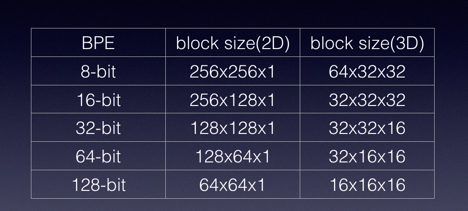

# vulkan中的sparse resource支持

之前一篇谈到了vulkan中的buffer和image对象，以及两者是如何绑定到一个memory对象上的。一般而言，这种绑定具有以下几个约束：

- 绑定必须是完全绑定，即一个buffer/image对象必须完全绑定到memory对象上。反之则不需要，即memory对象上不必只绑定一个buffer/image对象
- 绑定是连续的，这点很容易理解，buffer/image实际需要的存储空间在memory中以一个offset加上size来指定，这样的话实际上只能是一个连续的range才可以
- buffer/image对象只能绑定到一个memory对象上
- 绑定关系是不可变的，不存在所谓的“解除绑定”和“再次绑定”的概念

这样的设计虽然保证了硬件和driver实现的简单，却牺牲了app的灵活性。因此，vulkan同时提供了一个可选的sparse的概念，来一一破除上述限制条件。vulkan中的sparse特性包括如下三点：

1. sparse binding，除了必须遵守“完全绑定”这一条之外，放宽了其他三个限制条件，因此，与其说这是一个“稀疏绑定”，不如说是“离散绑定”（discrete binding）更加合适
2. sparse residency，同时放宽了所有的四项约束条件，这才是真正意义上的“稀疏绑定“
3. sparse aliased，稀疏绑定时候可能存在的memory混叠

sparse binding是后边两项的基础，指定sparse residency或者sparse aliased的时候，必须同时指定sparse binding。

需要特别注明一点的是，sparse特性是以（可能）牺牲性能为代价来（潜在地）提高灵活性的，使用的时候需要认真评估一下，是否有必要。

## Sparse Binding

sparse binding，如前所说，允许将一个buffer/image对象的区域绑定到多个memory对象上，并且绑定可以被修改。只是sparse binding的资源在使用之前必须被完全绑定，故而实在谈不上什么“稀疏”，更准确的描述应该是“离散”吧。

buffer和image都可以使用sparse binding，并且所有格式的image，不管是linear tiling的，还是optimal tiling的，也都支持sparse binding。从这一点来看，sparse binding的资源和普通的资源除了在和memory对象上的映射关系之外，使用上基本没什么差别。

当绑定一个buffer或者image对象的时候，必须满足对齐以及粒度条件。对齐以及粒度，都是通过[VkMemoryRequirements(3)](https://link.zhihu.com/?target=https%3A//www.khronos.org/registry/vulkan/specs/1.0/man/html/VkMemoryRequirements.html)中的alignment参数给出的。一般来说，对于sparse的资源，对齐和粒度都是页面本身的大小，典型情况下，就是4kB。

我们都知道，buffer对象的线性存储方式是高度地host可预测的。故而，当一个[buffer对象](https://zhida.zhihu.com/search?content_id=2528800&content_type=Article&match_order=2&q=buffer对象&zhida_source=entity)终端一段，例如，开始的4kB，被绑定到一个memory对象mem0上的4kB，而接下来的4-8kB，被绑定到另一个memory对象mem1上的4kB的时候，host可以预测到，当host访问buffer对象前4kB的内容的时候，一定会落在mem0上绑定的4kB，而不会落在mem1上。当然，规范中指明至于前4kB和mem0中的内存空间的映射关系是由实现自行决定的，但最普遍的做法，其实还是一一映射。

上述一段话看起来似乎是理所应当的。对于buffer而言的确如此，但是对于image而言，这种[对象空间](https://zhida.zhihu.com/search?content_id=2528800&content_type=Article&match_order=1&q=对象空间&zhida_source=entity)和存储空间的映射关系是无法保证的。整个image对象，都作为一整块opaque的东西，映射到绑定到memory(s)上，host是无法预知它访问memory哪一部分的时候会落到实际的哪个memory上。对于image而言，无论是linear tiling，还是optimal tiling，都是如此。

引入sparse binding的概念，一定程度上允许资源在创建的时候就预留好所需要的虚拟地址空间，而不用等到实际绑定到memory对象的时候才能够获取[虚拟地址空间](https://zhida.zhihu.com/search?content_id=2528800&content_type=Article&match_order=2&q=虚拟地址空间&zhida_source=entity)。

是否支持sparse binding可以通过[VkPhysicalDeviceFeatures(3)](https://link.zhihu.com/?target=https%3A//www.khronos.org/registry/vulkan/specs/1.0/man/html/VkPhysicalDeviceFeatures.html)中的sparseBinding成员来查询到。

## Sparse Residency

sparse residency特性需要sparse binding的支持，即创建buffer/image资源的时候应当同时指定sparse residency和sparse binding。sparse residency相比于sparse binding的提升点，就是不再要求资源在使用之前必须全部绑定（即全部拥有back memory空间）。那么，一个很显然的问题就出现了：如果device恰好访问到没有绑定memory部分的资源内容怎么办？

物理设备的限制，被保存在一个叫做[VkPhysicalDeviceProperties(3)](https://link.zhihu.com/?target=https%3A//www.khronos.org/registry/vulkan/specs/1.0/man/html/VkPhysicalDeviceProperties.html)的数据结构中，有一个成员类型是[VkPhysicalDeviceSparseProperties(3)](https://link.zhihu.com/?target=https%3A//www.khronos.org/registry/vulkan/specs/1.0/man/html/VkPhysicalDeviceSparseProperties.html)，在这个数据结构中，有一个bool值residencyNonResidentStrict指明了当device访问到没有绑定memory，即术语non-residency部分资源的行为。如果这个值为true，则读返回全零的数据，写被丢弃。如果这个值为false，则读返回未定义的数据，写同样被丢弃。我们可以看到，这个值主要控制读返回的数据究竟是定义好的全零，还是未定义的数据。由于cache本身的存在，严格地返回全零很可能是不现实的。例如，如果向non-residency写入一笔数据，然而这笔数据还没有真正抵达地址翻译部分，从而没有真正地被发现应当被丢弃，那么随后的读很可能直接命中写入数据的cache，从而提前返回。这一点在报feature的时候需要额外考虑到。

说回sparse residency，sparse residency的buffer除了不需要全部驻留外，与仅仅sparse binding的buffer别无二致。绑定时候的对齐和粒度条件也一模一样，由alignment决定。buffer是否支持sparse residency可以通过[VkPhysicalDeviceFeatures(3)](https://link.zhihu.com/?target=https%3A//www.khronos.org/registry/vulkan/specs/1.0/man/html/VkPhysicalDeviceFeatures.html)中的sparseResidencyBuffer来查询到。

但是，sparse residency的image就和仅仅sparse binding的image大不一样了。首先是格式上的支持，sparse residency仅支持optimal-tiling，并且format是color的那些非压缩的格式。format是depth/stencil，或者压缩格式的那些，是否支持sparse residency可以由实现自行决定，并且通过[vkGetPhysicalDeviceSparseImageFormatProperties(3)](https://link.zhihu.com/?target=https%3A//www.khronos.org/registry/vulkan/specs/1.0/man/html/vkGetPhysicalDeviceSparseImageFormatProperties.html)来查询。其次，仅仅是sparse binding的image因为使用之前必须全部绑定，所以我们不必去区分image本身哪一块区域需要绑定哪一块不需要。然而，sparse residency的image，要求必须提供一种机制，来指明image的layout和memory的[footprint](https://zhida.zhihu.com/search?content_id=2528800&content_type=Article&match_order=1&q=footprint&zhida_source=entity)之间的对应关系。因此，vulkan中设计了一套比较复杂的机制来实现这一点，并且在其中引入了诸如mip-tail region，meta-data aspect等新的概念，我们随后会讲到。

sparse residency的image的支持是通过[VkPhysicalDeviceFeatures(3)](https://link.zhihu.com/?target=https%3A//www.khronos.org/registry/vulkan/specs/1.0/man/html/VkPhysicalDeviceFeatures.html)中的sparseResidencyImage2D/sparseResidencyImage3D/sparseResidency2Samples/sparseResidency4Samples/sparseResidency8Samples/sparseResidency16Samples 来体现的，其中需要特别强调一点的是，sparseResidencyImage2D仅仅指明对于单采样的2D image的支持，多采样（2/4/8/16）由随后的一系列值指定。

sparse residency的image做绑定的时候同样要满足对齐和粒度的条件，只不过这次决定对齐和粒度的并非都是alignment，alignment只决定对其对齐条件，一个叫做image sparse block的新的概念决定了粒度。所谓的image sparse block，可以认为是一个sparse residency的image的一个最小的绑定单位，不仅有形状，还有对应的内存空间的要求。事实上，此时的[alignment](https://zhida.zhihu.com/search?content_id=2528800&content_type=Article&match_order=5&q=alignment&zhida_source=entity)的值就是image sparse block的size大小。

注意，image sparse block内部的对象和[内存映射](https://zhida.zhihu.com/search?content_id=2528800&content_type=Article&match_order=1&q=内存映射&zhida_source=entity)关系由实现自行决定。

vulkan中建议的image sparse block的内存空间是64kB，并且在不同的情况下，这么大空间能够放得下的image子区域的形状有：




并且，对于多采样的情况下，有：


如果一个实现决定遵从vulkan的建议，将其所支持的sparse residency的image sparse block的大小和形状设置为上述值，则我们认为这个实现遵从“标准”的sparse residency。这里的“标准”并非强制要求，只是建议的标准。在[VkPhysicalDeviceSparseProperties(3)](https://link.zhihu.com/?target=https%3A//www.khronos.org/registry/vulkan/specs/1.0/man/html/VkPhysicalDeviceSparseProperties.html)中，使用residencyStandard2DBlockShape/residencyStandard2DMultisampleBlockShape/residencyStandard3DBlockShape分别表示不同类型的image对“标准”image sparse block的支持。


对于特定条件的image，我们可以通过查询[VkSparseImageFormatProperties(3)](https://link.zhihu.com/?target=https%3A//www.khronos.org/registry/vulkan/specs/1.0/man/html/VkSparseImageFormatProperties.html)中，flags位是否包含掩码位K_SPARSE_IMAGE_FORMAT_NONSTANDARD_BLOCK_SIZE_BIT来获取是否支持“标准” image sparse block设定。如果实现支持标准image sparse block的话，[VkSparseImageFormatProperties(3)](https://link.zhihu.com/?target=https%3A//www.khronos.org/registry/vulkan/specs/1.0/man/html/VkSparseImageFormatProperties.html)中的imageGranularity必须和上述的[形状匹配](https://zhida.zhihu.com/search?content_id=2528800&content_type=Article&match_order=1&q=形状匹配&zhida_source=entity)。当然，如果实现不支持标准image sparse block的话，imageGranularity将给出这个时候的image sparse block的形状。

对于同一个image，实现不能同时支持“标准”和“非标准”image sparse block，并且，如果支持“标准”的话，必须优先使用“标准”image sparse block。

现在，我们已经有了一个image中最小的绑定单位，不仅有大小，还有形状。例如，如果我们有一个512x512的2d image，bpe为8-bit，并且我们手上的显卡恰好支持标准的image sparse block。我们就可以将其拆成4个256x256的image sparse block，然后分别将这4个image sparse block任意地绑定到memory对象上，全部绑定，或者只绑定一部分，按顺序或者乱序，绑定到一个memory对象，或者分别绑定到多个上。只要我们满足绑定到最小粒度是一个image sparse block，我们就可以随心所欲。

当然，事情到这里还没有结束。还是以上边的数据为例，假如我们的2d image很不幸，是一个[mip-map](https://zhida.zhihu.com/search?content_id=2528800&content_type=Article&match_order=1&q=mip-map&zhida_source=entity)的texture，lod 0的image大小是512x512，这个没问题，4个image sparse block就可以搞定了。lod 1的是256x256，一个image sparse block刚好放得下。lod 2的image大小变成了128x128，放到一个image sparse block中似乎有点儿浪费资源，不过还好，也不算浪费太多。接下来是lod 3的64x64，lod 4的32x32，lod 5的16x16，一直到最后的1x1。从这里可以看出，假如为每个mip level都至少分配一个image sparse block的话，内存空间的浪费将是不可避免的，这与本来就致力于解决存储空间不足的sparse特性相矛盾。故而，这里又提出了一个mip-tail region的概念。那么，什么叫做mip-tail region呢？所谓的mip-tail region，就是将一个完整的mip-map资源中，从某些mip-level开始，往下所有的mip层都搜集到一个区域，叫做mip-tail区域。这个mip-tail区域的大小是image sparse block大小的整数倍，但是显然不应该有形状的约束，毕竟是多个mip-level的集合。并且，memory的foot print在mip-tail区域内部是由实现自行决定的。当绑定mip-map的image时，mip-tail区域必须被全部绑定。

在mip-tail的定义中，我提到了“某些mip-level开始”，那么究竟从哪一个mip-level开始呢？对于上述的例子，显然从lod 2开始是最合适的。然而，如果image sparse本身是768*768的呢？这样lod 1开始就是384*384，一个image sparse block放不下，四个image sparse block又有点儿多余。故而，vulkan在这里提到了一个aligned-mip-size的概念。如果设定为aligned-mip-size的话，那么mip-tail region就从第一个不对齐于image sparse block开始。如果没有设定aligned-mip-size的话，那么mip-tail region就从第一个小于image sparse block的mip-level开始。

aligned-mip-size体现在哪里呢？第一个体现就是在[VkPhysicalDeviceSparseProperties(3)](https://link.zhihu.com/?target=https%3A//www.khronos.org/registry/vulkan/specs/1.0/man/html/VkPhysicalDeviceSparseProperties.html)最后一个我们还没有提到的residencyAlignedMipSize部分，它决定了是否可能是aligned-mip-size的。如果这个值是false，则所有的mip-tail region都从第一个小于image sparse block的mip-level开始，没得商量。如果这个值是true，则要具体到每一个资源，来看看是不是从不对齐的那一个开始，这个类似于[总控开关](https://zhida.zhihu.com/search?content_id=2528800&content_type=Article&match_order=1&q=总控开关&zhida_source=entity)。具体到每一个资源的时候，资源查出来的[VkSparseImageFormatProperties(3)](https://link.zhihu.com/?target=https%3A//www.khronos.org/registry/vulkan/specs/1.0/man/html/VkSparseImageFormatProperties.html)中的flags位不仅仅有表示是否采用“标准”image sparse block的掩码位，还有一个叫做VK_SPARSE_IMAGE_FORMAT_ALIGNED_MIP_SIZE_BIT的掩码位，表示这个资源采用哪一种策略来组织mip-tail区域。

[VkSparseImageFormatProperties(3)](https://link.zhihu.com/?target=https%3A//www.khronos.org/registry/vulkan/specs/1.0/man/html/VkSparseImageFormatProperties.html)中的flags总共有三个掩码位，目前我们已经讲过其中的两个了，还有最后一个，VK_SPARSE_IMAGE_FORMAT_SINGLE_MIPTAIL_BIT，这个又是干什么的呢？这个实际上是为了array的resource做的优化。在array的resource中，如果每一个array都有自己单独的mip-tail region，很可能同样造成资源的浪费，我们可以将所有array slice的mip-tail region组织在一起，形成一个单独的mip-tail region，这就是名字里的single-miptail的含义了。

之前我们提过，sparse residency的image只要求支持color format。如果实现同时决定支持depth/stencil的format的话，还会带来一点儿麻烦的地方。这个麻烦就在于，depth/stencil的layout可以是seperate的，也可以是interleaved的。我们都知道，depth和stencil很多时候都是作为整体出现，例如D24S8格式，depth用24位，剩下的8位当作stencil，刚刚好32位。然而，具体实现的时候，可能由于某些原因，有些实现宁愿浪费一些资源，也要将depth和stencil分开放，depth用32位保存，只用到其中的24位，剩下的8位不要了。此外，stencil单独保存。如果大家都这么做的话也还好，麻烦就麻烦在某些实现还是将depth和stencil交织地摆放在一起。在支持sparse residency的时候，vulkan同时也要考虑到对这些支持的可能性，因此提出了aspect的概念。

[aspect](https://zhida.zhihu.com/search?content_id=2528800&content_type=Article&match_order=3&q=aspect&zhida_source=entity)，就是指format中的一个方面。这个并不是说一个R8G8B8A8就分别有RGBA四个aspect，而是这个作为一个color的format，只有一个aspect，叫做color aspect。D24S8显然拥有两个aspect，叫做depth aspect和stencil aspect。此外，image可能有一些meta信息要保留在memory中，这些在作partial residency的时候也要全部绑定的，所以还有一个叫做[metadata](https://zhida.zhihu.com/search?content_id=2528800&content_type=Article&match_order=1&q=metadata&zhida_source=entity)的aspect。在我们使用[vkGetImageSparseMemoryRequirements(3)](https://link.zhihu.com/?target=https%3A//www.khronos.org/registry/vulkan/specs/1.0/man/html/vkGetImageSparseMemoryRequirements.html)来查询一个具体的image对于[memory layout](https://zhida.zhihu.com/search?content_id=2528800&content_type=Article&match_order=1&q=memory+layout&zhida_source=entity)的要求的时候，这些aspect可能会被分别报出来，故而app需要认真对待这些细节，做到正确地绑定。

## Sparse Aliased

sparse aliased就是多个buffer/image，或者一个buffer/image内部的不同区域，映射到同一个物理存储区域上。sparse aliased限制了aliasing只能发生在buffer和[buffer](https://zhida.zhihu.com/search?content_id=2528800&content_type=Article&match_order=20&q=buffer&zhida_source=entity)之间，image和image之间。并且，如果image和image之间alias，则要保证format兼容，并且要使用同样的image sparse block形状。此外，由于mip-tail region和metadata aspect是opaque的，这两个部分是不能alias的，否则会出现为定义的行为。

## API

到目前为止，我们已经讲完了所有sparse resource相关的概念了。然而如何使用sparse resource，如何做binding，我们还没有提及。在这里，我们将会接触到这一部分，真正地把一个sparse resource和memory(s)绑定到一起。

不同于普通的[vkBindBufferMemory(3)](https://link.zhihu.com/?target=https%3A//www.khronos.org/registry/vulkan/specs/1.0/man/html/vkBindBufferMemory.html)和[vkBindImageMemory(3)](https://link.zhihu.com/?target=https%3A//www.khronos.org/registry/vulkan/specs/1.0/man/html/vkBindImageMemory.html)，将sparse的buffer/image绑定到memory(s)上是通过queue来执行的。而且这个queue于普通的 graphic/compute/transfer queue不一样，必须支持sparse。此外，往sparse queue上提交任务也并不是像graphic queue一样，录制命令到command buffer再提交，而是通过一个[vkQueueBindSparse(3)](https://link.zhihu.com/?target=https%3A//www.khronos.org/registry/vulkan/specs/1.0/man/html/vkQueueBindSparse.html) 的命令。这个命令的核心是一个[VkBindSparseInfo(3)](https://link.zhihu.com/?target=https%3A//www.khronos.org/registry/vulkan/specs/1.0/man/html/VkBindSparseInfo.html)的数组，其摘要如下：

```text
typedef struct VkBindSparseInfo {
    VkStructureType                             sType;
    const void*                                 pNext;
    uint32_t                                    waitSemaphoreCount;
    const VkSemaphore*                          pWaitSemaphores;
    uint32_t                                    bufferBindCount;
    const VkSparseBufferMemoryBindInfo*         pBufferBinds;
    uint32_t                                    imageOpaqueBindCount;
    const VkSparseImageOpaqueMemoryBindInfo*    pImageOpaqueBinds;
    uint32_t                                    imageBindCount;
    const VkSparseImageMemoryBindInfo*          pImageBinds;
    uint32_t                                    signalSemaphoreCount;
    const VkSemaphore*                          pSignalSemaphores;
} VkBindSparseInfo;
```

除了分别定义等待的[semaphore](https://zhida.zhihu.com/search?content_id=2528800&content_type=Article&match_order=1&q=semaphore&zhida_source=entity)，以及完成后的semaphore外，核心部分是三个数组，数组类型分别是[VkSparseBufferMemoryBindInfo(3)](https://link.zhihu.com/?target=https%3A//www.khronos.org/registry/vulkan/specs/1.0/man/html/VkSparseBufferMemoryBindInfo.html)，[VkSparseImageOpaqueMemoryBindInfo(3)](https://link.zhihu.com/?target=https%3A//www.khronos.org/registry/vulkan/specs/1.0/man/html/VkSparseImageOpaqueMemoryBindInfo.html)和[VkSparseImageMemoryBindInfo(3)](https://link.zhihu.com/?target=https%3A//www.khronos.org/registry/vulkan/specs/1.0/man/html/VkSparseImageMemoryBindInfo.html)。

[VkSparseBufferMemoryBindInfo(3)](https://link.zhihu.com/?target=https%3A//www.khronos.org/registry/vulkan/specs/1.0/man/html/VkSparseBufferMemoryBindInfo.html)用于绑定[sparse](https://zhida.zhihu.com/search?content_id=2528800&content_type=Article&match_order=90&q=sparse&zhida_source=entity)的buffer，无论是fully-resident还是partial-resident的都是用这个数据结构来实现的。数据结构本身来说也很简单，不再多说。

[VkSparseImageOpaqueMemoryBindInfo(3)](https://link.zhihu.com/?target=https%3A//www.khronos.org/registry/vulkan/specs/1.0/man/html/VkSparseImageOpaqueMemoryBindInfo.html)用于绑定[opaque](https://zhida.zhihu.com/search?content_id=2528800&content_type=Article&match_order=3&q=opaque&zhida_source=entity)的image，主要用于绑定fully-resident的image，或者partial-resident的image中的mip-tail region和meta-data aspect。其特点是所需要绑定的部分由于没有一个well-defined的mapping关系，故而需要全部绑定。这也是名字中的opaque的含义所在。除此之外，如果一个partial-residency的image，某一个mip-level的image需要全部绑定，也可以用这个来实现。

[VkSparseImageMemoryBindInfo(3)](https://link.zhihu.com/?target=https%3A//www.khronos.org/registry/vulkan/specs/1.0/man/html/VkSparseImageMemoryBindInfo.html)用于绑定partial-resident的image的子区域，因此这里定义了比较多的参数用于指定绑定的[子区域](https://zhida.zhihu.com/search?content_id=2528800&content_type=Article&match_order=3&q=子区域&zhida_source=entity)位置以及其他信息。

在[vkQueueBindSparse(3)](https://link.zhihu.com/?target=https%3A//www.khronos.org/registry/vulkan/specs/1.0/man/html/vkQueueBindSparse.html) 中，实际提交了一系列的绑定操作。这些绑定操作按照数组中的顺序开始执行，但是可能会乱序结束。如果要保证顺序，需要使用[同步原语](https://zhida.zhihu.com/search?content_id=2528800&content_type=Article&match_order=1&q=同步原语&zhida_source=entity)。