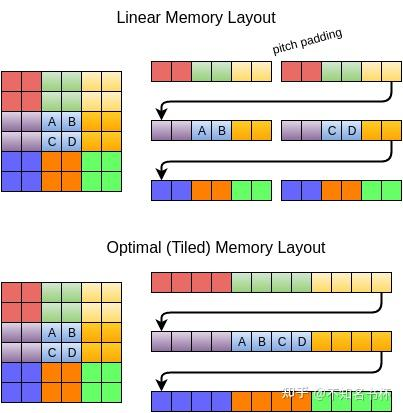

# Vulkan 三角形之旅-3

> 参照该教程[vulkan-tutorial](https://link.zhihu.com/?target=https%3A//vulkan-tutorial.com/)这里是记录笔者Vulkan的学习记录。如果你想识别Vulkan相比于之前的传统图形API有什么区别和优势的话，欢迎看我的另外一篇文章[初探Vulkan](https://zhuanlan.zhihu.com/p/554631289)。相信应该能够帮助你识别Vulkan的优势所在。

在Vulkan当中绘制一个三角形流程可以分为如下

- 创建一个 VkInstance
- 选择支持的硬件设备（VkPhysicalDevice）
- 创建用于Draw和Presentation的VkDevice 和 VkQueue
- 创建窗口(window)、窗口表面(window surface)和交换链 (Swap Chain)
- 将Swap Chain Image 包装到 VkImageView
- 创建一个指定Render Target和用途的RenderPass
- 为RenderPass创建FrameBuffer
- 设置PipeLine
- 为每个可能的Swap Chain Image分配并记录带有绘制命令的Command Buffer
- 通过从Swap Chain获取的图像并在上面绘制，提交正确的Commander Buffer，并将绘制完的图像返回到Swap Chain去显示。

在上面两篇当中，我们已经完成了将近一半。那么就下来就到了RenderPass的创建了。但是在这里还有一些前置的条件，比如Shader。那我们接着往下看吧。

## Shader Modules

与传统图形API 不同，Vulkan 中的Shader代码必须以字节码格式指定，而不是像 GLSL 和 HLSL 这种让人可读语法。这种字节码格式称为 SPIR-V，旨在与 Vulkan 和 OpenCL（均为 Khronos API）一起使用。它是一种可用于编写图形和计算Shader的格式，在这里将编写Vulkan 图形管线的Shader。

使用字节码格式的优势在于 GPU 供应商编写的将Shader代码转换为本机代码的编译器的复杂性要低得多。过去表明，对于像 GLSL 这样的人类可读语法，一些 GPU 供应商对标准的解释相当灵活。如果您碰巧使用这些供应商之一的 GPU 编写了重要的Shader，那么您可能会冒其他供应商的驱动程序由于语法错误而拒绝您的代码的风险，或者更糟糕的是，您的Shader由于编译器错误而运行不同。使用像 SPIR-V 这样的简单字节码格式，有望避免。

然而，这并不意味着我们需要手动编写这个字节码。 Khronos 发布了他们自己的独立于供应商的编译器，可将 GLSL 编译为 SPIR-V。此编译器旨在验证您的Shader代码是否完全符合标准，并生成一个可以随程序一起提供的 SPIR-V 二进制文件。您还可以将此编译器作为库包含在运行时生成 SPIR-V，但我们不会在本教程中这样做。虽然我们可以通过 glslangValidator 直接使用此编译器，它们都已包含在 Vulkan SDK 中，因此您无需下载任何额外内容。

在这里我们需要编写一个vertex shader和一个fragment shader用于在屏幕中绘制三角形。下面两个小节会探讨与之相关的GLSL代码，并展示如何生成两个SPIR-V二进制文件，最后加载到程序中。

关于[顶点着色器](https://zhida.zhihu.com/search?content_id=211663920&content_type=Article&match_order=1&q=顶点着色器&zhida_source=entity)的作用，我在这里就不过多赘述了。如果不懂的话，可以先回去看看[渲染管线](https://zhida.zhihu.com/search?content_id=211663920&content_type=Article&match_order=1&q=渲染管线&zhida_source=entity)是什么。直接上代码。

### Vertex Shader

```cpp
#version 450

// 在这里想传递相应的变量传递到像素着色器阶段
layout(location = 0) out vec3 fragColor;

// 顶点数据数组
vec2 positions[3] = vec2[](
    vec2(0.0, -0.5),
    vec2(0.5, 0.5),
    vec2(-0.5, 0.5)
);

// 并且在这里我们添加了一个顶点Color
vec3 colors[3] = vec3[](
    vec3(1.0, 0.0, 0.0),
    vec3(0.0, 1.0, 0.0),
    vec3(0.0, 0.0, 1.0)
);

// 为每个顶点调用main函数。内置 gl_VertexIndex 变量包含当前顶点的索引。
void main() {
    // 内置变量gl_Position 用于标示输出的坐标
    // 内置 gl_VertexIndex 变量包含当前顶点的索引，这通常是顶点缓冲区的索引。
        // 但在我们的例子中，它将是上面顶点数据硬编码数组的索引。每个顶点的位置从着色器中的常量数组访问，并与虚拟 z 和 w 分量组合以产生剪辑坐标中的位置。
    gl_Position = vec4(positions[gl_VertexIndex], 0.0, 1.0);
        // 设置顶点色。并且传入像素着色器
    fragColor = colors[gl_VertexIndex];
}
```

### Fragment Shader

```cpp
#version 450

// 接受从顶点着色器传入的颜色值
// fragColor 的值将自动为三个顶点之间的片段进行插值，从而产生平滑的渐变。
layout(location = 0) in vec3 fragColor;

// 与顶点着色器中的 gl_Position 不同，没有内置变量来输出当前Fragment的颜色。
// 您必须为每个指定自己的输出变量，layout(location = 0)修饰符明确framebuffer的索引。
// 它被链接到索引为0的第一个（也是唯一的）FrameBuffer。
layout(location = 0) out vec4 outColor;

void main() {
    outColor = vec4(fragColor, 1.0);
}
```

### **Compiling the shaders**

并将顶点着色器存储在名为 shader.vert 的文件中，将片段着色器存储在该目录中名为 shader.frag 的文件中。 GLSL Shader没有官方的扩展名，但这两个通常用来区分它们。

在这个编译器还有很多可以挖掘的地方。这两个命令告诉编译器读取 GLSL [源文件](https://zhida.zhihu.com/search?content_id=211663920&content_type=Article&match_order=1&q=源文件&zhida_source=entity)并使用 -o（输出）标志输出一个 SPIR-V 字节码文件。 如果您的Shader包含语法错误，那么编译器会按照您的预期告诉您行号和问题。例如，尝试省略分号并再次运行[编译脚本](https://zhida.zhihu.com/search?content_id=211663920&content_type=Article&match_order=1&q=编译脚本&zhida_source=entity)。还可以尝试不带任何参数运行编译器，以查看它支持哪些类型的标志。例如，它还可以将字节码输出为人类可读的格式，这样您就可以准确地看到Shader正在做什么以及在此阶段应用的任何优化。 在命令行上编译Shader是最直接的选项之一，也是我们将在本教程中使用的选项，但也可以直接从您自己的代码编译Shader。

```cpp
// 可以通过如下两个命令，将顶点着色器和像素着色器编译为.spv格式。
glslangValidator -V shader.vert
glslangValidator -V shader.frag
```

### Loading Shader

现在我们有了一种生成 SPIR-V 格式Shader的方法，是时候将它们加载到我们的程序中，以便在某个时候将它们插入到图形管道中。我们将首先编写一个简单的辅助函数来从文件中加载二进制数据。

```cpp
// readFile函数将从指定的文件中读取所有的字节，并在一个由std::vector管理的字节数组中返回这些字节。
static std::vector<char> readFile(const std::string& filename) {
        // ate: 从文件的末端开始读取
        // binary。将文件作为二进制文件读取（避免文本转换）
        // 在文件末尾开始读取的好处是，我们可以使用读取位置来确定文件的大小并分配一个缓冲区。
    std::ifstream file(filename, std::ios::ate | std::ios::binary);
    std::cout<< filename << std::endl;
    if (!file.is_open()) {
        throw std::runtime_error("failed to open file!");
    }
        // tellg()返回当前定位指针的位置，也代表着输入流的大小。
    size_t fileSize = (size_t) file.tellg();
    std::cout<< fileSize << std::endl;
    std::vector<char> buffer(fileSize);
        // seekg()是对输入流的操作 g是get缩写，0是代表从开头读起。
    file.seekg(0);
        // 读入到Buffer当中
    file.read(buffer.data(), fileSize);
    file.close();
    return buffer;
}
```

在我们可以将Shader传递给PipeLine之前，我们必须将它包装在一个 VkShaderModule 对象中。让我们创建一个辅助函数 createShaderModule 来做到这一点。

```cpp
VkShaderModule createShaderModule(const std::vector<char>& code) {
        // 经典Vulkan，创建VkShaderModule很简单只需要字节码长度和一个指向该Buffer的指针。
    VkShaderModuleCreateInfo createInfo{};
    createInfo.sType = VK_STRUCTURE_TYPE_SHADER_MODULE_CREATE_INFO;
    createInfo.codeSize = code.size();
    // 在这里还需要做一个转换，字节码的指针是uint32_t类型的。而code对象的指针类型是char。在这里需要做一个转换。
    createInfo.pCode = reinterpret_cast<const uint32_t*>(code.data());
    VkShaderModule shaderModule;
        // 创建VkShaderModule
    if (vkCreateShaderModule(device, &createInfo, nullptr, &shaderModule) != VK_SUCCESS) {
        throw std::runtime_error("failed to create shader module!");
    }
    return shaderModule;
}
```

我们关于这个用法，如下所示。

```cpp
void createGraphicsPipeline() {
    auto vertShaderCode = readFile("shaders/vert.spv");
    auto fragShaderCode = readFile("shaders/frag.spv");
        // 着色器模块只是我们之前从文件中加载的着色器字节码和其中定义的函数的一个包装器。
        // 在创建图形管道之前，不会发生 SPIR-V 字节码到机器代码的编译和链接以供 GPU 执行。
      // 这意味着一旦管道创建完成，我们就可以再次销毁ShaderModule，
        // 这就是为什么我们将其是设置为局部变量的原因
    VkShaderModule vertShaderModule = createShaderModule(vertShaderCode);
    VkShaderModule fragShaderModule = createShaderModule(fragShaderCode);
        ...
        ...
        // 调用vkDestroyShaderModule清理ShaderModule
    vkDestroyShaderModule(device, fragShaderModule, nullptr);
    vkDestroyShaderModule(device, vertShaderModule, nullptr);
}
```

要实际使用Shader，我们需要通过 VkPipelineShaderStageCreateInfo 结构将它们分配给特定的管道阶段，作为实际管道创建过程的一部分。 我们将首先在 createGraphicsPipeline 函数中填充顶点着色器的结构。

```cpp
VkPipelineShaderStageCreateInfo vertShaderStageInfo{};
vertShaderStageInfo.sType = VK_STRUCTURE_TYPE_PIPELINE_SHADER_STAGE_CREATE_INFO;
// VK_SHADER_STAGE_VERTEX_BIT代表是顶点着色器
vertShaderStageInfo.stage = VK_SHADER_STAGE_VERTEX_BIT;
// 指定想要包含的着色器模块
vertShaderStageInfo.module = vertShaderModule;
// 指定想调用什么函数。这意味着可以将多个片段着色器组合到一个着色器模块中，并使用不同的入口点来区分它们的行为。
vertShaderStageInfo.pName = "main";

VkPipelineShaderStageCreateInfo fragShaderStageInfo{};
fragShaderStageInfo.sType = VK_STRUCTURE_TYPE_PIPELINE_SHADER_STAGE_CREATE_INFO;
// VK_SHADER_STAGE_FRAGMENT_BIT代表是像素着色器
fragShaderStageInfo.stage = VK_SHADER_STAGE_FRAGMENT_BIT;
fragShaderStageInfo.module = fragShaderModule;
fragShaderStageInfo.pName = "main";
// 最后定义一个包含这两个结构的数组，稍后我们将在实际的管道创建步骤中使用它来引用它们。
VkPipelineShaderStageCreateInfo shaderStages[] = {vertShaderStageInfo, fragShaderStageInfo};
```

在这里关于ShaderModule的设置就完成啦。接下来是关于渲染管线当中Fixed function的设置。

## Fixed Function

传统图形 API 为PipeLine的大多数阶段提供了默认状态。在 Vulkan 中，您必须明确大多数管道状态，因为它将被预编译到PSO当中，可以提高性能。在这里我们将填写所有结构来配置这些固定功能操作。

虽然大部分管道状态需要进行预编译，但实际上可以更改有限数量的状态，而无需在绘制时重新创建管道。比如ViewPort的大小、线宽和Blend参数。如果您想使用动态状态(**Dynamic state**)并将这些属性排除在外，那么您必须填写一个 VkPipelineDynamicStateCreateInfo 结构。动态参数的出现，使得管线状态更加的灵活。但是性能也不会降低。如下所示，同样是在createGraphicsPipeline函数当中添加

```cpp
std::vector<VkDynamicState> dynamicStates = {
    VK_DYNAMIC_STATE_VIEWPORT,
    VK_DYNAMIC_STATE_SCISSOR
};

// Vulkan传统，填充相应的结构体
VkPipelineDynamicStateCreateInfo dynamicState{};
dynamicState.sType = VK_STRUCTURE_TYPE_PIPELINE_DYNAMIC_STATE_CREATE_INFO;
// 指定我们想开启什么动态状态。
dynamicState.dynamicStateCount = static_cast<uint32_t>(dynamicStates.size());
dynamicState.pDynamicStates = dynamicStates.data();
```

### **Vertex input**

VkPipelineVertexInputStateCreateInfo 结构描述了将被传递给顶点着色器的顶点数据的格式。它大致以两种方式描述:

- binding：数据之间的间距以及确定数据是每个顶点或者是每个instance(**instancing**)
- 属性描述(AttributeDescription)：述将要进行绑定及加载属性的顶点着色器中的相关属性类型。

因为我们直接在顶点着色器中对顶点数据进行硬编码，所以我们将填写此结构以指定暂时没有要加载的顶点数据。我们将在顶点缓冲区一章中回到它。

```cpp
// VkPipelineVertexInputStateCreateInfo 结构被用于描述了将被传递给顶点着色器的顶点数据的格式
VkPipelineVertexInputStateCreateInfo vertexInputInfo{};
vertexInputInfo.sType = VK_STRUCTURE_TYPE_PIPELINE_VERTEX_INPUT_STATE_CREATE_INFO;
//bind:主要描述数据之间的间距以及数据是逐顶点还是逐实例
vertexInputInfo.vertexBindingDescriptionCount = 0;
vertexInputInfo.pVertexBindingDescriptions = nullptr; // Optional
// vertexAttribute: 传递给顶点着色器的属性的类型，从哪个bind加载它们以及在哪个偏移量
vertexInputInfo.vertexAttributeDescriptionCount = 0;
vertexInputInfo.pVertexAttributeDescriptions = nullptr; // Optional
```

### **Input assembly**

VkPipelineInputAssemblyStateCreateInfo结构描述了两件事：将从顶点绘制什么样的几何图形，以及是否应启用图元复用。前者是在[拓扑结构](https://zhida.zhihu.com/search?content_id=211663920&content_type=Article&match_order=1&q=拓扑结构&zhida_source=entity)成员中指定的，可以有如下值。

- VK_PRIMITIVE_TOPOLOGY_POINT_LIST：来自顶点的点
- VK_PRIMITIVE_TOPOLOGY_LINE_LIST：每2个顶点的线，顶点不共用
- VK_PRIMITIVE_TOPOLOGY_LINE_STRIP：每条线的结束顶点被用作下一条线的起始顶点。
- VK_PRIMITIVE_TOPOLOGY_TRIANGLE_LIST：每3个顶点组成一个三角形，顶点不共用。
- VK_PRIMITIVE_TOPOLOGY_TRIANGLE_STRIP：每个三角形的第二和第三个顶点被用作下一个三角形的前两个顶点。

通常情况下，顶点是按索引顺序从顶点缓冲区加载的，但对于元素缓冲区，你可以自己指定要使用的索引。这允许你进行优化，比如重复使用顶点。如果你将primitiveRestartEnable成员设置为VK_TRUE，那么就有可能通过使用0xFFFF或0xFFFFFFFF的特殊索引，在_STRIP拓扑模式中分解线和三角形。

我们打算在中一直画三角形，所以我们将坚持使用以下结构的数据。

```cpp
VkPipelineInputAssemblyStateCreateInfo inputAssembly{};
inputAssembly.sType = VK_STRUCTURE_TYPE_PIPELINE_INPUT_ASSEMBLY_STATE_CREATE_INFO;
inputAssembly.topology = VK_PRIMITIVE_TOPOLOGY_TRIANGLE_LIST;
inputAssembly.primitiveRestartEnable = VK_FALSE;
```

### **Viewports and scissors**

下面是关于ViewPort以及Scissors的相关配置。ViewPort的大小和Window的分辨率大小应该是一样的。

```cpp
// ViewPort基本上描述了输出将被渲染到的帧缓冲区区域。这几乎总是 (0, 0) 到 (width, height)
VkViewport viewport{};
// 设置ViewPort 原点位置
viewport.x = 0.0f;
viewport.y = 0.0f;
// 设置viewport的宽高
viewport.width = (float) swapChainExtent.width;
viewport.height = (float) swapChainExtent.height;
// minDepth 和 maxDepth 值指定用于帧缓冲区的深度值范围。
// 一般设置为[0,1]即可。
viewport.minDepth = 0.0f;
viewport.maxDepth = 1.0f;

// ViewPort定义了从图像到Frame Buffer的转换，而scissors矩形定义了实际存储像素的区域。
// scissors矩形之外的任何像素都将被光栅化器丢弃。它们的功能类似于过滤器而不是转换。
VkRect2D scissor{};
scissor.offset = {0, 0};
// 在这里我们设置为和Swap Chain Image的大小一致。
scissor.extent = swapChainExtent;

// 然后您只需要在管道创建时指定它们的计数，在这里都是1.然后将上面的参数传入。
VkPipelineViewportStateCreateInfo viewportState{};
viewportState.sType = VK_STRUCTURE_TYPE_PIPELINE_VIEWPORT_STATE_CREATE_INFO;
viewportState.viewportCount = 1;
viewportState.pViewports = &viewport;
viewportState.scissorCount = 1;
viewportState.pScissors = &scissor;
```

### **Rasterizer**

光栅化器获取由顶点着色器中的顶点形成的几何图形，并将其转换为片段以由片段着色器着色。它还执行深度测试、面部剔除和Scissorsc测试，并且可以配置为输出填充整个多边形或仅边缘的片段（线框渲染）。所有这些都是使用 VkPipelineRasterizationStateCreateInfo 结构配置的。接下来看看我们需要怎么配置吧。

注意一提的关于polygonMode的设置，polygonMode 是确定如何为几何体生成Fragment，可以使用以下模式：

- VK_POLYGON_MODE_FILL：用Fragment填充多边形区域 。
- VK_POLYGON_MODE_LINE：多边形边缘被绘制为线 (线框渲染)。
- VK_POLYGON_MODE_POINT：多边形顶点绘制为点 。

使用FILL以外的任何模式都需要启用 GPU 功能。

```cpp
VkPipelineRasterizationStateCreateInfo rasterizer{};
rasterizer.sType = VK_STRUCTURE_TYPE_PIPELINE_RASTERIZATION_STATE_CREATE_INFO;
// 如果 depthClampEnable 设置为 VK_TRUE，则超出近平面和远平面的片段将被截断到它们而不是丢弃它们。
// 这在一些特殊情况下很有用，比如阴影贴图。使用它需要启用 GPU 功能。
rasterizer.depthClampEnable = VK_FALSE;
// 如果 rasterizerDiscardEnable 设置为 VK_TRUE，则几何图形永远不会通过 rasterizer 阶段。
// 这基本上禁用了FrameBuffer的任何输出。
rasterizer.rasterizerDiscardEnable = VK_FALSE;
// polygonMode 确定如何为几何体生成片段。我们在这里选择的是VK_POLYGON_MODE_FILL，会使用片段填充多边形区。
rasterizer.polygonMode = VK_POLYGON_MODE_FILL;
// lineWidth根据片段的数量来描述线条的粗细。支持的最大线宽取决于硬件，
// 任何超过 1.0f 的线都需要您启用 wideLines GPU 功能。
rasterizer.lineWidth = 1.0f;
// cullMode 变量确定要使用的面剔除类型。您可以禁用剔除、剔除正面、剔除背面或两者。 
// frontFace 变量指定被视为正面的面的顶点顺序，可以是顺时针或逆时针。
rasterizer.cullMode = VK_CULL_MODE_BACK_BIT;
rasterizer.frontFace = VK_FRONT_FACE_CLOCKWISE;

// 光栅化可以通过添加一个常数值或根据Fragment的斜率对它们进行偏置来改变深度值。
// 这有时用于Shadow Map，但现在还不需要。只需将 depthBiasEnable 设置为 VK_FALSE。
rasterizer.depthBiasEnable = VK_FALSE;
rasterizer.depthBiasConstantFactor = 0.0f; // Optional
rasterizer.depthBiasClamp = 0.0f; // Optional
rasterizer.depthBiasSlopeFactor = 0.0f; // Optional
```

### **Multisampling**

Multisampling是关于硬件[抗锯齿](https://zhida.zhihu.com/search?content_id=211663920&content_type=Article&match_order=1&q=抗锯齿&zhida_source=entity)的一些设置。它通过将光栅化到同一像素的多个多边形的片段着色器结果组合在一起来工作。这主要发生在边缘，这也是最明显的锯齿伪影发生的地方。因为如果只有一个多边形映射到一个像素，它不需要多次运行片段着色器，所以它比简单地渲染到更高分辨率然后缩小比例要便宜得多。启用它需要启用 GPU 功能。

```cpp
//
VkPipelineMultisampleStateCreateInfo multisampling{};
multisampling.sType = VK_STRUCTURE_TYPE_PIPELINE_MULTISAMPLE_STATE_CREATE_INFO;
multisampling.sampleShadingEnable = VK_FALSE;
multisampling.rasterizationSamples = VK_SAMPLE_COUNT_1_BIT;
multisampling.minSampleShading = 1.0f; // Optional
multisampling.pSampleMask = nullptr; // Optional
multisampling.alphaToCoverageEnable = VK_FALSE; // Optional
multisampling.alphaToOneEnable = VK_FALSE; // Optional
```

### **Depth and stencil testing**

如果您使用深度和/或模板缓冲，则还需要使用 VkPipelineDepthStencilStateCreateInfo 配置深度和模板测试。我们现在没有，所以我们可以简单地传递一个 nullptr 而不是指向这样一个结构的指针。现在画一个三角形还用不到这些。

### **Color blending**

在片段着色器返回颜色后，它需要与Frame Buffer中已经存在的颜色进行组合。这种转换称为color Blend，有两种方法可以做到:混合旧值和新值以产生最终颜色 使用按位运算组合旧值和新值 有两种类型的结构来配置Blend。第一个结构 VkPipelineColorBlendAttachmentState 包含每个附加帧缓冲区的配置，第二个结构 VkPipelineColorBlendStateCreateInfo 包含全局Blend设置。在我们的例子中，我们只有一个Frame Buffer：

```cpp
// VkPipelineColorBlendAttachmentState 包含每个附加帧缓冲区的配置
VkPipelineColorBlendAttachmentState colorBlendAttachment{};
// 控制Blend过后的颜色可以写入到哪些通道当中，在这里设置为RGBA都可以写入
colorBlendAttachment.colorWriteMask = VK_COLOR_COMPONENT_R_BIT | VK_COLOR_COMPONENT_G_BIT | VK_COLOR_COMPONENT_B_BIT | VK_COLOR_COMPONENT_A_BIT;
// 控制是否开启Blend
colorBlendAttachment.blendEnable = VK_FALSE;
colorBlendAttachment.srcColorBlendFactor = VK_BLEND_FACTOR_ONE; // Optional
colorBlendAttachment.dstColorBlendFactor = VK_BLEND_FACTOR_ZERO; // Optional
colorBlendAttachment.colorBlendOp = VK_BLEND_OP_ADD; // Optional
colorBlendAttachment.srcAlphaBlendFactor = VK_BLEND_FACTOR_ONE; // Optional
colorBlendAttachment.dstAlphaBlendFactor = VK_BLEND_FACTOR_ZERO; // Optional
colorBlendAttachment.alphaBlendOp = VK_BLEND_OP_ADD; // Optional

// VkPipelineColorBlendStateCreateInfo 包含全局颜色混合设置。 如果开启这个混合，将自动禁用上面的Blend设置
VkPipelineColorBlendStateCreateInfo colorBlending{};
colorBlending.sType = VK_STRUCTURE_TYPE_PIPELINE_COLOR_BLEND_STATE_CREATE_INFO;
colorBlending.logicOpEnable = VK_FALSE;
colorBlending.logicOp = VK_LOGIC_OP_COPY; // Optional
colorBlending.attachmentCount = 1;
colorBlending.pAttachments = &colorBlendAttachment;
colorBlending.blendConstants[0] = 0.0f; // Optional
colorBlending.blendConstants[1] = 0.0f; // Optional
colorBlending.blendConstants[2] = 0.0f; // Optional
colorBlending.blendConstants[3] = 0.0f; // Optional
```

### **Pipeline layout**

您可以在Shader中使用Uniform值，它们是类似于动态状态变量的全局变量，可以在绘制时更改以改变着色器的行为，而无需重新编译Shader。它们通常用于将矩阵传递给顶点着色器，或在片段着色器中创建纹理采样器。 这些Uniform值需要在管道创建期间通过创建 VkPipelineLayout 对象来指定。即使不需要使用它们，我们仍然需要创建一个空的管道布局。 创建一个类成员来保存这个对象。

```cpp
VkPipelineLayout pipelineLayout;

VkPipelineLayoutCreateInfo pipelineLayoutInfo{};
pipelineLayoutInfo.sType = VK_STRUCTURE_TYPE_PIPELINE_LAYOUT_CREATE_INFO;
pipelineLayoutInfo.setLayoutCount = 0; // Optional
pipelineLayoutInfo.pSetLayouts = nullptr; // Optional
// 该结构还指定了pushConstant，这是将动态值传递给着色器的另一种方式
pipelineLayoutInfo.pushConstantRangeCount = 0; // Optional
pipelineLayoutInfo.pPushConstantRanges = nullptr; // Optional

if (vkCreatePipelineLayout(device, &pipelineLayoutInfo, nullptr, &pipelineLayout) != VK_SUCCESS) {
    throw std::runtime_error("failed to create pipeline layout!");
}
```

这就是所有的FIxed Function设置！从头开始设置所有这些需要大量工作，但优点是我们现在几乎完全了解图形管道中发生的一切！接下来还需要创建一个对象，那就是RenderPass。通过这里就可以看出Vulkan对于开发者放出了多少的细节。你基本你能够掌控一切。但是随着而来是沉重的负担。只能说有利有弊。

## 创建Render Pass

在我们完成创建PipeLine之前，我们需要告诉Vulkan渲染时将使用的Frame Buffer。我们需要指定有多少个颜色和深度缓冲区，每个缓冲区要使用多少个样本，以及在整个渲染操作中如何处理它们的内容。所有这些信息都被包裹在一个RenderPass对象中，我们将为其创建一个新的createRenderPass函数。在createGraphicsPipeline之前从initVulkan调用这个函数。

在我们这里首先需要一个Color Attachment。由Swap Chain中的一个图像表示。

```cpp
void createRenderPass() {
    VkAttachmentDescription colorAttachment{};
    colorAttachment.format = swapChainImageFormat;
    colorAttachment.samples = VK_SAMPLE_COUNT_1_BIT;
        colorAttachment.loadOp = VK_ATTACHMENT_LOAD_OP_CLEAR;
        colorAttachment.storeOp = VK_ATTACHMENT_STORE_OP_STORE;
        colorAttachment.stencilLoadOp = VK_ATTACHMENT_LOAD_OP_DONT_CARE;
        colorAttachment.stencilStoreOp = VK_ATTACHMENT_STORE_OP_DONT_CARE;
        colorAttachment.initialLayout = VK_IMAGE_LAYOUT_UNDEFINED;
        colorAttachment.finalLayout = VK_IMAGE_LAYOUT_PRESENT_SRC_KHR;
}
```

让我们来看看这个参数都代表了什么。关于这个colorAttachment的Format应该与Swap Chain Image 的格式一致。并且在这里我们没有开启[反走样](https://zhida.zhihu.com/search?content_id=211663920&content_type=Article&match_order=1&q=反走样&zhida_source=entity)之类的。于是将采样数保持为1。

loadOp 和 storeOp 确定在渲染之前和渲染之后如何处理Attachment中的数据。对于 loadOp，我们有以下选择：

- VK_ATTACHMENT_LOAD_OP_LOAD：保留附件的现有内容。
- VK_ATTACHMENT_LOAD_OP_CLEAR：在开始时将值清除为常量。
- VK_ATTACHMENT_LOAD_OP_DONT_CARE：现有内容未定义。

我们将在绘制新帧之前使用清除操作将Frame Buffer清除为黑色。 storeOp只有两种可能：

- VK_ATTACHMENT_STORE_OP_STORE：渲染的内容将存储在内存中，以后可以读取。
- VK_ATTACHMENT_STORE_OP_DONT_CARE：渲染操作后Frame Buffer的内容将不确定 。

我们有兴趣在屏幕上看到渲染的三角形，所以我们在这里进行Store操作。

loadOp 和 storeOp 适用于Color和Depth数据，stencilLoadOp / stencilStoreOp 适用于stencil值。我们的应用程序不会对模板缓冲做任何事情，因此加载和存储的结果是无关紧要的。

Vulkan 中的Texture和Frame Buffer由具有特定像素格式的 VkImage 表示，但是内存中像素的Layout可能会根据您尝试对图像执行的操作而改变。 一些最常见的布局是：

- VK_IMAGE_LAYOUT_COLOR_ATTACHMENT_OPTIMAL：用作Color AttachMent的Image 。
- VK_IMAGE_LAYOUT_PRESENT_SRC_KHR：要在Swap Chain中 用于Persent的Image。
- VK_IMAGE_LAYOUT_TRANSFER_DST_OPTIMAL：用作内存复制操作目标的Image。

但现在重要的是要知道图像需要转换为适合它们接下来将涉及的操作的特定布局。 initialLayout 指定在渲染过程开始之前图像将具有的布局。 finalLayout 指定RenderPass完成时自动转换到的布局。对 initialLayout 使用 VK_IMAGE_LAYOUT_UNDEFINED 意味着我们不关心图像之前的布局。这个特殊值的警告是图像的内容不能保证被保留，但这并不重要，因为我们要去无论如何都要清除它。我们希望图像在渲染后使用Swap Chain准备好用于Persent，这就是我们使用 VK_IMAGE_LAYOUT_PRESENT_SRC_KHR 作为 finalLayout 的原因。

关于这个Layout的问题，可以看下面这张图。



一般意义上，我们理解CPU进行内存中的数据读写往往都是线性排序的linear memory layout，可以看到AB与CD作为来个连续的行来进行读取。但是在很多时候对于像素纹理数据的操作是非线性连续的，这种情景更多发生在GPU操作中，所以GPU硬件更多的支持基于Tiled的或者成为最佳的内存布局结构，来提降低GPU处理数据的开销。所以从CPU linear layout 内存数据 到 GPU optimal layout 显存数据的读写 往返之间存在数据存储格式的优化转变步骤。

### **Subpasses and attachment references**

一个Render Pass 可以包含多个SubPass。SubPass是后续渲染操作，它依赖于先前SubPass中Frame Buffer的内容，例如一系列后处理效果，这些效果一个接一个地应用。如果您将这些渲染操作分组到一个RenderPass中，那么 Vulkan 能够重新排序并节省内存带宽以获得更好的性能。然而，对于我们的第一个三角形，我们将坚持使用单个SubPass。 每个SubPass都引用一个或多个我们使用前面描述的Attachment。这些引用本身就是 VkAttachmentReference 结构，如下所示：

```cpp
VkAttachmentReference colorAttachmentRef{};
// 我们这里指使用第一个Attachment所以Index是0
colorAttachmentRef.attachment = 0;
// layout指定了我们希望Attachment在使用此引用的SubPass期间具有的Layout。
// 当 subpass 启动时，Vulkan 会自动将Attachment转换到此Layout。
// 我们打算将Attachment用作Color Buf，正如其名称所暗示的那样，
// VK_IMAGE_LAYOUT_COLOR_ATTACHMENT_OPTIMAL 布局将为我们提供最佳性能。
colorAttachmentRef.layout = VK_IMAGE_LAYOUT_COLOR_ATTACHMENT_OPTIMAL;

// Vulkan 将来也可能支持Computer SubPass，
// 因此我们必须明确说明这是一个Graphics SubPass。接下来，我们指定对ColorAttachment的Ref：
VkSubpassDescription subpass{};
subpass.pipelineBindPoint = VK_PIPELINE_BIND_POINT_GRAPHICS;

subpass.colorAttachmentCount = 1;
// 在这里我们是设置colorAttachment，片段着色器的结果会写入这里。
subpass.pColorAttachments = &colorAttachmentRef;
```

此数组中Attachment的索引直接从片段着色器引用，比如在上面的像素着色器当中 带有 layout(location = 0) out vec4 outColor 指令！

SubPass可以引用以下其他类型的Attachment：

- pInputAttachments：从着色器中读取的Attachment
- pResolveAttachments：用于对ColorAttachment进行多重采样的Attachment
- pDepthStencilAttachment：深度和模板数据的Attachment
- pPreserveAttachments：此SubPass未使用但必须为其保留数据的Attachment

### **Render pass**

现在已经描述了Attachment和引用它的基本SubPass，我们可以自己创建RenderPass。创建一个新的类成员变量以在 pipelineLayout 变量的正上方保存 VkRenderPass 对象：

```cpp
VkRenderPass renderPass;
VkPipelineLayout pipelineLayout;

VkRenderPassCreateInfo renderPassInfo{};
renderPassInfo.sType = VK_STRUCTURE_TYPE_RENDER_PASS_CREATE_INFO;
// 分别填充Attachment 以及相应的SubPass
renderPassInfo.attachmentCount = 1;
renderPassInfo.pAttachments = &colorAttachment;
renderPassInfo.subpassCount = 1;
renderPassInfo.pSubpasses = &subpass;

// 创建RenderPass
if (vkCreateRenderPass(device, &renderPassInfo, nullptr, &renderPass) != VK_SUCCESS) {
    throw std::runtime_error("failed to create render pass!");
}
```

## Finally 创建PipeLine

终于可以来创建属于自己的PipeLine了，到这一步可谓是历经了千辛万苦。这些显式的配置对于Vulkan的启用几乎是必不可少的。Vulkan真好玩.jpg。

```cpp
// Vulkan老传统，开始填充Struct。
VkGraphicsPipelineCreateInfo pipelineInfo{};
pipelineInfo.sType = VK_STRUCTURE_TYPE_GRAPHICS_PIPELINE_CREATE_INFO;
// 设置我们的Shader。
pipelineInfo.stageCount = 2;
pipelineInfo.pStages = shaderStages;

// 在这里引入我们在上面设置的关于Fixed Functon的那些设置。
pipelineInfo.pVertexInputState = &vertexInputInfo;
pipelineInfo.pInputAssemblyState = &inputAssembly;
pipelineInfo.pViewportState = &viewportState;
pipelineInfo.pRasterizationState = &rasterizer;
pipelineInfo.pMultisampleState = &multisampling;
pipelineInfo.pDepthStencilState = nullptr; // Optional
pipelineInfo.pColorBlendState = &colorBlending;
pipelineInfo.pDynamicState = &dynamicState;

// 引入PipeLineLayout
pipelineInfo.layout = pipelineLayout;

// 设置RenderPass以及 SubPass
pipelineInfo.renderPass = renderPass;
pipelineInfo.subpass = 0;

// Vulkan 允许您通过从现有管道派生来创建新的图形管道。管道派生的想法是，当管道与现有管道有很多共同的功能时，
// 建立管道的成本更低，并且来自同一父级的管道之间的切换也可以更快地完成。
// 您可以使用 basePipelineHandle 指定现有管道的句柄，
// 也可以使用 basePipelineIndex 引用即将由索引创建的另一个管道，现在只有一个管道，
// 所以我们只需指定一个空句柄和一个无效索引。
///只有在 VkGraphicsPipelineCreateInfo 的标志字段中也指定了 VK_PIPELINE_CREATE_DERIVATIVE_BIT 标志时，
// 才使用这些值。
pipelineInfo.basePipelineHandle = VK_NULL_HANDLE; // Optional
pipelineInfo.basePipelineIndex = -1; // Optional

// 最终创建PipeLine
if (vkCreateGraphicsPipelines(device, VK_NULL_HANDLE, 1, &pipelineInfo, nullptr, &graphicsPipeline) != VK_SUCCESS) {
    throw std::runtime_error("failed to create graphics pipeline!");
}

// 记得在CleanUp中清理哦，调用如下函数
vkDestroyPipeline(device, graphicsPipeline, nullptr);
vkDestroyPipelineLayout(device, pipelineLayout, nullptr);
```

PIpeLine创建完毕，距离咱们渲染出第一个三角形又进一步。三角形之旅遥遥无期(狗头)。