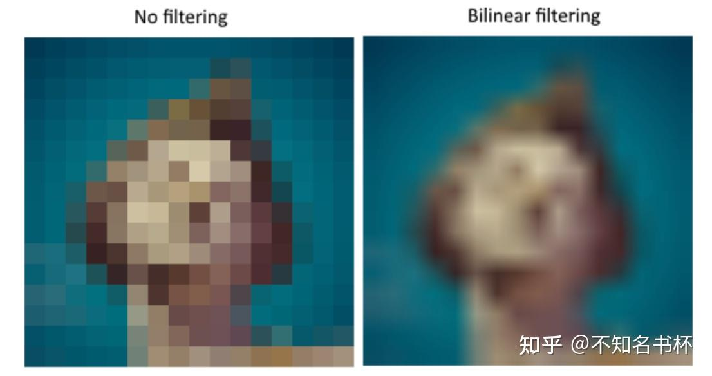
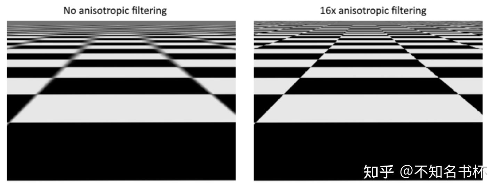
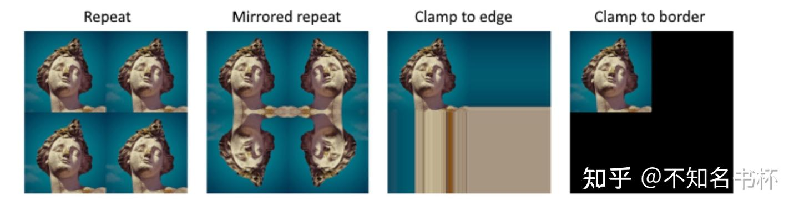
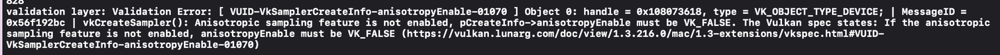
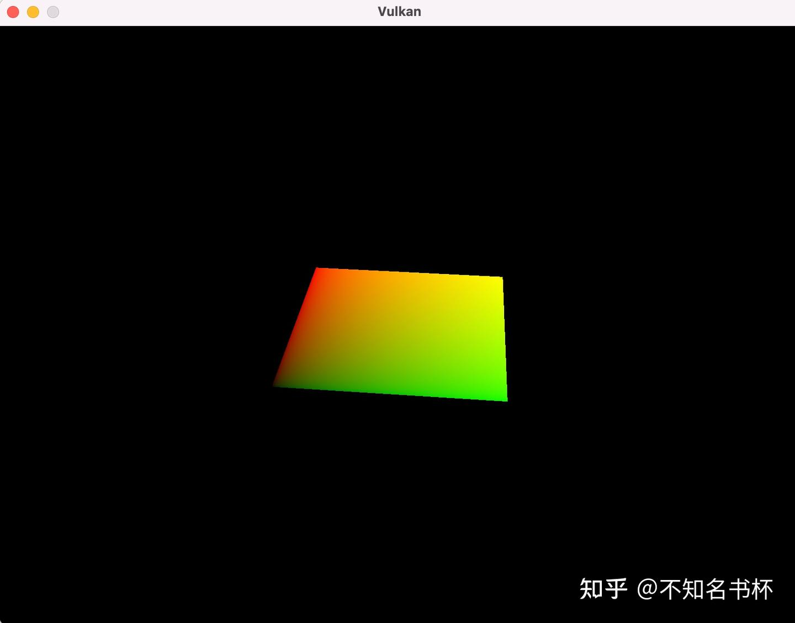
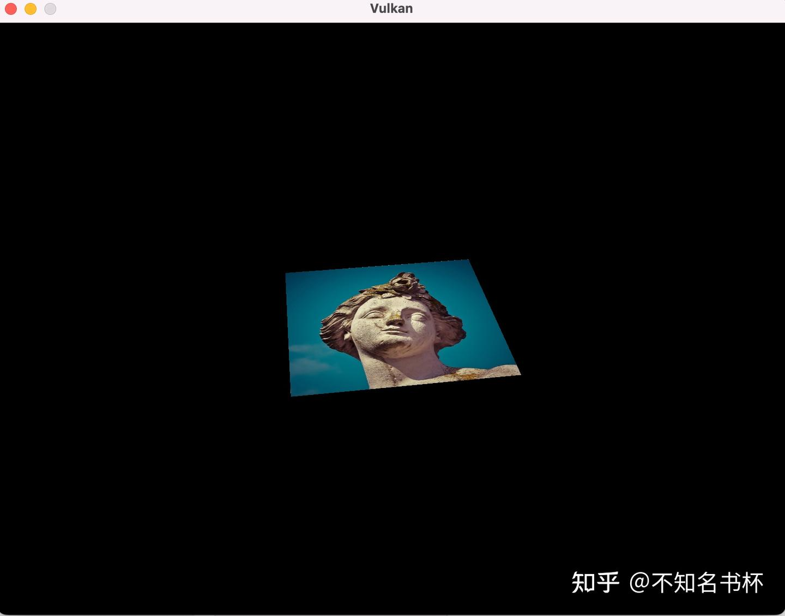
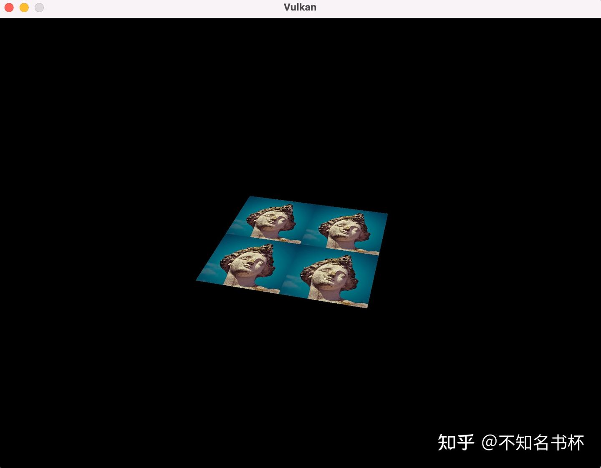

# Vulkan Texture mapping

> 这里是记录笔者Vulkan的学习记录，参照该教程[vulkan-tutorial.com](https://link.zhihu.com/?target=https%3A//vulkan-tutorial.com/Drawing_a_triangle/Drawing/Command_buffers)这里是记录笔者Vulkan的学习记录，如果你想识别Vulkan相比于之前的传统图形API有什么区别和优势的话，欢迎看我的另外一篇文章[初探Vulkan](https://zhuanlan.zhihu.com/p/554631289)。相信应该能够帮助你识别Vulkan的优势所在。

## Images

到目前为止，几何体都是使用顶点色，这是一个相当局限的方法。在下面的过程中，我们将实现[纹理映射](https://zhida.zhihu.com/search?content_id=212163049&content_type=Article&match_order=1&q=纹理映射&zhida_source=entity)(Texture Mapping)，使几何体看起来更有趣。这也将使我们能够在后续内容中加载和绘制基本的三维模型。

在我们的应用程序中添加纹理将涉及以下步骤:

- 创建设备内存支持的图像对象。
- 从[图像文件](https://zhida.zhihu.com/search?content_id=212163049&content_type=Article&match_order=1&q=图像文件&zhida_source=entity)填充像素。
- 创建一个纹理采样器。
- 添加一个纹理采样器Descriptors，在像素着色器当中从纹理中提取颜色。

我们以前已经使用过Image Object，但那些对象是由Swap Chain Extension自动创建的。这次我们必须自己创建一个。创建图像并向其填充数据与创建Vertex Buffer类似。我们将首先创建一个Staging Buffer，并在其中填充像素数据，然后将其复制到我们将用于渲染的最终Image Object中。虽然可以为此目的创建一个Staging Image，但Vulkan也允许你将像素从VkBuffer复制到Image中，而且这样做的API在某些硬件上实际上更快。我们将首先创建这个Buffer，用像素值填充它，然后我们将创建一个图像来复制像素。创建一个图像与创建缓冲区没有什么不同。它涉及到查询内存需求、分配设备内存和绑定内存，就像我们之前看到的那样。

然而在处理图像时，有一些额外的东西是我们必须要注意的。图像可以有不同的布局，影响到像素在内存中的组织方式。由于图形硬件的工作方式，简单地逐行存储像素可能不会带来最佳性能，例如。当对图像进行任何操作时，你必须确保它们具有在该操作中使用的最佳Layout。实际上，我们在指定RenderPass时已经看到了其中的一些Layout操作。

- **VK_IMAGE_LAYOUT_PRESENT_SRC_KHR**: 最适合Present的Layout。
- **VK_IMAGE_LAYOUT_TRANSFER_SRC_OPTIMAL**: 作为传送源操作的时候，使用最佳，如vkCmdCopyImageToBuffer。
- **VK_IMAGE_LAYOUT_COLOR_ATTACHMENT_OPTIMAL**: 当使用附件从片段着色器进行写入时候，使用最佳。
- **VK_IMAGE_LAYOUT_TRANSFER_DST_OPTIMAL**: 作为传输目的地的时候，使用最佳，就像vkCmdCopyBufferToImage。
- **VK_IMAGE_LAYOUT_SHADER_READ_ONLY_OPTIMAL**: 最适合于从着色器中采样。

最常见的转换Image Layout的方法之一是**管线屏障(Pipeline Barrier)**。Pipeline Barrier主要用于同步访问资源，比如确保图像在被读取之前已经被写入，但它们也可以用来Layout变换。在后续的内容中，我们将看到Pipeline Barrier是如何用于这一目的的。Pipeline Barrier还可以在VK_SHARING_MODE_EXCLUSIVE模式下用来转移QueueFamily的所有权来使用。 我们将使用stb集合中的stb_image库。它的优点是所有的代码都在一个文件中，所以它不需要任何棘手的构建配置。下载stb_image.h并把它存放在一个方便的位置。然后引入你的main.cpp即可。

### **Loading an image**

```cpp
// 引入加载纹理所需要的库
#define STB_IMAGE_IMPLEMENTATION
#include <stb_image.h>
```

创建一个新的函数createTextureImage，在这里我们将加载一个图像并将其上传到一个VulkanImage Object中。我们将使用Command Buffer，所以它应该在createCommandPool之后被调用。并且在Shader目录旁边创建一个新的目录textures来存储纹理图像。我们将从该目录中加载一张名为texture.jpg的图片。自己想用什么图就可以哦

```cpp
void createTextureImage() {
    int texWidth, texHeight, texChannels;
    stbi_uc* pixels = stbi_load("textures/texture.jpg", &texWidth, &texHeight, &texChannels, STBI_rgb_alpha);
    VkDeviceSize imageSize = texWidth * texHeight * 4;

    if (!pixels) {
        throw std::runtime_error("failed to load texture image!");
    }
}
```

**stbi_load**函数使用文件的路径和通道的数量作为参数加载图片。STBI_rgb_alpha则代表值强制图像加载一个alpha通道，即使它本身没有alpha通道，但是这样做对于将来加载其他的纹理的一致性非常友好。中间的三个参数是图像的宽度、高度和实际的图片通道数量。返回的指针是一个像素数组中的第一个元素。在STBI_rgb_alpha的情况下，像素是逐行排列的，每个像素有4个字节，总共有texWidth * texHeight * 4个值。

### **Staging buffer**

我们现在要在host visible内存中创建一个Buffer，以便我们可以使用**vkMapMemory**并将像素复制给它。在**createTextureImage**函数中添加Staging Buffer。

```cpp
VkBuffer stagingBuffer;
VkDeviceMemory stagingBufferMemory;

// 创建stageBuffer 在这里使用VK_MEMORY_PROPERTY_HOST_VISIBLE_BIT
// VK_MEMORY_PROPERTY_HOST_COHERENT_BIT 保证为host visible
createBuffer(imageSize, VK_BUFFER_USAGE_TRANSFER_SRC_BIT, VK_MEMORY_PROPERTY_HOST_VISIBLE_BIT | VK_MEMORY_PROPERTY_HOST_COHERENT_BIT, stagingBuffer, stagingBufferMemory);
void* data;
// 建立映射
vkMapMemory(device, stagingBufferMemory, 0, imageSize, 0, &data);
// 进行拷贝
memcpy(data, pixels, static_cast<size_t>(imageSize));
// 解除映射
vkUnmapMemory(device, stagingBufferMemory);
// 清理原始像素阵列
stbi_image_free(pixels);
```

### **Texture Image**

虽然我们可以设置着色器来访问Buffer中的像素值，但为此目的最好在Vulkan中使用Image Object。Image Object将使我们更容易和更快地检索颜色，因为我们可以使用二维坐标，这是其一。Image Object中的像素被称为texels，从这一点上我们将使用这个名字。添加以下新的类成员。

```cpp
VkImage textureImage;
VkDeviceMemory textureImageMemory;

// 填充VkImageCreateInfo结构体
VkImageCreateInfo imageInfo{};
imageInfo.sType = VK_STRUCTURE_TYPE_IMAGE_CREATE_INFO;
imageInfo.imageType = VK_IMAGE_TYPE_2D;
imageInfo.extent.width = static_cast<uint32_t>(texWidth);
imageInfo.extent.height = static_cast<uint32_t>(texHeight);
imageInfo.extent.depth = 1;
imageInfo.mipLevels = 1;
imageInfo.arrayLayers = 1;
```

在上面的imageType字段中指定的Image类型，告诉Vulkan Image中的纹理将被处理成什么样的坐标系。可以创建一维、二维和三维图像。一维图像可用于存储数据阵列或者[灰度图](https://zhida.zhihu.com/search?content_id=212163049&content_type=Article&match_order=1&q=灰度图&zhida_source=entity)，二维图像主要用于纹理，而三维图像可用于存储立体纹素，例如extent字段指定了图像的尺寸，基本上每个轴上有多少个texel。

```cpp
imageInfo.format = VK_FORMAT_R8G8B8A8_SRGB;
imageInfo.tiling = VK_IMAGE_TILING_OPTIMAL;
imageInfo.initialLayout = VK_IMAGE_LAYOUT_UNDEFINED;
```

Vulkan支持许多可能的Image Format，但我们应该使用与缓冲区内像素相同的文本格式，否则拷贝操作会失败。在这里我们通过format字段选择VK_FORMAT_R8G8B8A8_SRGB格式。

tiling字段可以有两个值:

- **VK_IMAGE_TILING_LINEAR**: 纹理是以行为主的顺序排列的，就像我们的像素阵列一样。
- **VK_IMAGE_TILING_OPTIMAL**: Texel基于具体的实现来定义布局，以达到最佳访问效果。

与图像的布局不同，tiling属性不能在之后进行改变。如果你希望能够直接访问图像内存中的Texel，那么你必须使用VK_IMAGE_TILING_LINEAR。我们将使用一个Staging Buffer 而不是Staging Image，所以这没有必要。我们将使用VK_IMAGE_TILING_OPTIMAL来实现着色器的有效访问。

一个Image的initiaLayout只有两个可能的值:

- **vk_image_layout_undefined**。不能被GPU使用，第一次转换会丢弃Texels。
- **vk_image_layout_preinitialized**: 不能被GPU使用，但第一次转换将保留Texels。

很少有情况下需要在第一次转换时保留texels。然而一个例子是如果你想把一个图像作为与VK_IMAGE_TILING_LINEAR布局结合使用的Staging Image。在这种情况下，你想把Texel数据上传到它那里，然后在不丢失数据的情况下将图像转换为传输源。然而在我们的例子中，我们首先要将图像转换为传输目标，然后从Buffer复制纹理数据，所以我们不需要这个属性，可以安全地使用VK_IMAGE_LAYOUT_UNDEFINED。

```cpp
imageInfo.usage = VK_IMAGE_USAGE_TRANSFER_DST_BIT | VK_IMAGE_USAGE_SAMPLED_BIT;
imageInfo.sharingMode = VK_SHARING_MODE_EXCLUSIVE;
imageInfo.samples = VK_SAMPLE_COUNT_1_BIT;
imageInfo.flags = 0; // Optional

if (vkCreateImage(device, &imageInfo, nullptr, &textureImage) != VK_SUCCESS) {
    throw std::runtime_error("failed to create image!");
}
```

usage字段的语义与创建Buffer时的语义相同。该图像将被用作Buffer拷贝的目标，所以它应该被设置为一个传输目标。我们还希望能够从着色器中访问Image来为我们的网格着色，所以应该包括VK_IMAGE_USAGE_SAMPLED_BIT。

sharingMode为VK_SHARING_MODE_EXCLUSIVE，则代表该图像将只被一个QueueFamily：支持图形(因此也是)传输操作的队列。

samples字段与多重采样有关有关。这只与将被用作Attachment的图像有关，所以坚持使用一个样本。还有一个稀疏图像有关的图像的flag字段。稀疏图像(Sparse image)是指只有某些区域实际被内存支持的图像。比如说，如果你使用3D纹理的立体地形，那么你可以用它来避免分配内存来存储大量的 "空气 "值。我们不会使用这个功能所以让它的默认值为0。

该图像是用vkCreateImage创建的，它没有任何特别值得注意的参数。VK_FORMAT_R8G8B8A8_SRGB格式有可能不被图形硬件所支持。你应该有一个可接受的替代方案的清单，并选择被支持的最佳方案。然而，对这种特定格式的支持非常普遍，我们将跳过这一步。使用不同的格式也需要进行烦人的转换。

```cpp
VkMemoryRequirements memRequirements;
vkGetImageMemoryRequirements(device, textureImage, &memRequirements);

VkMemoryAllocateInfo allocInfo{};
allocInfo.sType = VK_STRUCTURE_TYPE_MEMORY_ALLOCATE_INFO;
allocInfo.allocationSize = memRequirements.size;
allocInfo.memoryTypeIndex = findMemoryType(memRequirements.memoryTypeBits, VK_MEMORY_PROPERTY_DEVICE_LOCAL_BIT);

if (vkAllocateMemory(device, &allocInfo, nullptr, &textureImageMemory) != VK_SUCCESS) {
    throw std::runtime_error("failed to allocate image memory!");
}

vkBindImageMemory(device, textureImage, textureImageMemory, 0);
```

为图像分配内存的方法与为缓冲区分配内存的方法完全相同。使用vkGetImageMemoryRequirements代替vkGetBufferMemoryRequirements，使用vkBindImageMemory代替vkBindBufferMemory。这个函数已经变得相当大了，而且在后面内容中还需要创建更多的Image，所以我们应该把Image创建抽象为一个createImage函数，就像我们对Buffer创建所做的那样。创建这个函数并将图像对象的创建和内存分配移到它上面。

```cpp
void createImage(uint32_t width, uint32_t height, VkFormat format, VkImageTiling tiling, VkImageUsageFlags usage, VkMemoryPropertyFlags properties, VkImage& image, VkDeviceMemory& imageMemory) {
    VkImageCreateInfo imageInfo{};
    imageInfo.sType = VK_STRUCTURE_TYPE_IMAGE_CREATE_INFO;
    imageInfo.imageType = VK_IMAGE_TYPE_2D;
    imageInfo.extent.width = width;
    imageInfo.extent.height = height;
    imageInfo.extent.depth = 1;
    imageInfo.mipLevels = 1;
    imageInfo.arrayLayers = 1;
    imageInfo.format = format;
    imageInfo.tiling = tiling;
    imageInfo.initialLayout = VK_IMAGE_LAYOUT_UNDEFINED;
    imageInfo.usage = usage;
    imageInfo.samples = VK_SAMPLE_COUNT_1_BIT;
    imageInfo.sharingMode = VK_SHARING_MODE_EXCLUSIVE;

    if (vkCreateImage(device, &imageInfo, nullptr, &image) != VK_SUCCESS) {
        throw std::runtime_error("failed to create image!");
    }

    VkMemoryRequirements memRequirements;
    vkGetImageMemoryRequirements(device, image, &memRequirements);

    VkMemoryAllocateInfo allocInfo{};
    allocInfo.sType = VK_STRUCTURE_TYPE_MEMORY_ALLOCATE_INFO;
    allocInfo.allocationSize = memRequirements.size;
    allocInfo.memoryTypeIndex = findMemoryType(memRequirements.memoryTypeBits, properties);

    if (vkAllocateMemory(device, &allocInfo, nullptr, &imageMemory) != VK_SUCCESS) {
        throw std::runtime_error("failed to allocate image memory!");
    }

    vkBindImageMemory(device, image, imageMemory, 0);
}
```

我把width、height、format、tiling、usage和memory properties作为参数，因为在这里我们要创建的Image的这些参数都会有所不同。

```cpp
void createTextureImage() {
    int texWidth, texHeight, texChannels;
    stbi_uc* pixels = stbi_load("textures/texture.jpg", &texWidth, &texHeight, &texChannels, STBI_rgb_alpha);
    VkDeviceSize imageSize = texWidth * texHeight * 4;

    if (!pixels) {
        throw std::runtime_error("failed to load texture image!");
    }

    VkBuffer stagingBuffer;
    VkDeviceMemory stagingBufferMemory;
    createBuffer(imageSize, VK_BUFFER_USAGE_TRANSFER_SRC_BIT, VK_MEMORY_PROPERTY_HOST_VISIBLE_BIT | VK_MEMORY_PROPERTY_HOST_COHERENT_BIT, stagingBuffer, stagingBufferMemory);

    void* data;
    vkMapMemory(device, stagingBufferMemory, 0, imageSize, 0, &data);
        memcpy(data, pixels, static_cast<size_t>(imageSize));
    vkUnmapMemory(device, stagingBufferMemory);

    stbi_image_free(pixels);

    createImage(texWidth, texHeight, VK_FORMAT_R8G8B8A8_SRGB, VK_IMAGE_TILING_OPTIMAL, VK_IMAGE_USAGE_TRANSFER_DST_BIT | VK_IMAGE_USAGE_SAMPLED_BIT, VK_MEMORY_PROPERTY_DEVICE_LOCAL_BIT, textureImage, textureImageMemory);
}
```

### **Layout transitions**

我们现在要写的函数涉及到再次记录和执行一个Command Buffer，所以现在是把这个逻辑移到辅助函数中的好机会。

```cpp
VkCommandBuffer beginSingleTimeCommands() {
    VkCommandBufferAllocateInfo allocInfo{};
    allocInfo.sType = VK_STRUCTURE_TYPE_COMMAND_BUFFER_ALLOCATE_INFO;
    allocInfo.level = VK_COMMAND_BUFFER_LEVEL_PRIMARY;
    allocInfo.commandPool = commandPool;
    allocInfo.commandBufferCount = 1;

    VkCommandBuffer commandBuffer;
    vkAllocateCommandBuffers(device, &allocInfo, &commandBuffer);

    VkCommandBufferBeginInfo beginInfo{};
    beginInfo.sType = VK_STRUCTURE_TYPE_COMMAND_BUFFER_BEGIN_INFO;
    beginInfo.flags = VK_COMMAND_BUFFER_USAGE_ONE_TIME_SUBMIT_BIT;

    vkBeginCommandBuffer(commandBuffer, &beginInfo);

    return commandBuffer;
}

void endSingleTimeCommands(VkCommandBuffer commandBuffer) {
    vkEndCommandBuffer(commandBuffer);
    VkSubmitInfo submitInfo{};
    submitInfo.sType = VK_STRUCTURE_TYPE_SUBMIT_INFO;
    submitInfo.commandBufferCount = 1;
    submitInfo.pCommandBuffers = &commandBuffer;
    vkQueueSubmit(graphicsQueue, 1, &submitInfo, VK_NULL_HANDLE);
    vkQueueWaitIdle(graphicsQueue);
    vkFreeCommandBuffers(device, commandPool, 1, &commandBuffer);
}

// 将单独执行command Buffer 的流程拆分开来
void copyBuffer(VkBuffer srcBuffer, VkBuffer dstBuffer, VkDeviceSize size) {
    VkCommandBuffer commandBuffer = beginSingleTimeCommands();
    VkBufferCopy copyRegion{};
    copyRegion.size = size;
    vkCmdCopyBuffer(commandBuffer, srcBuffer, dstBuffer, 1, &copyRegion);
    endSingleTimeCommands(commandBuffer);
}
```

如果我们仍然使用BUffer，那么我们现在可以写一个函数来记录并执行vkCmdCopyBufferToImage来完成工作，但这个命令要求图像首先处于正确的Layout中。创建一个新的函数来处理布局转换。

```cpp
void transitionImageLayout(VkImage image, VkFormat format, VkImageLayout oldLayout, VkImageLayout newLayout) {
    VkCommandBuffer commandBuffer = beginSingleTimeCommands();

    endSingleTimeCommands(commandBuffer);
}
```

执行布局转换的最常见方法之一是使用Image Memory barrier。像这样的PipeLine Barrier通常用于同步访问资源，比如确保在从Buffer读取之前完成对Buffer的写入，但是当使用VK_SHARING_MODE_EXCLUSIVE时，它也可以用于转换图像布局和转移QueueFamily所有权。有一个相等的buffer memory barrier来为缓冲区做这件事。

```cpp
VkImageMemoryBarrier barrier{};
barrier.sType = VK_STRUCTURE_TYPE_IMAGE_MEMORY_BARRIER;
barrier.oldLayout = oldLayout;
barrier.newLayout = newLayout;

barrier.srcQueueFamilyIndex = VK_QUEUE_FAMILY_IGNORED;
barrier.dstQueueFamilyIndex = VK_QUEUE_FAMILY_IGNORED;
```

前两个字段指定布局转换，从oldLayout转换到newLayout。如果你不关心图像的现有内容，可以使用VK_IMAGE_LAYOUT_UNDEFINED作为oldLayout。

如果你使用barrier来转移QueueFamily的所有权，那么这两个字段应该是QueueFamily的索引。如果你不想这样做，它们必须被设置为VK_QUEUE_FAMILY_IGNORED（不是默认值！）。

```cpp
barrier.image = image;
barrier.subresourceRange.aspectMask = VK_IMAGE_ASPECT_COLOR_BIT;
barrier.subresourceRange.baseMipLevel = 0;
barrier.subresourceRange.levelCount = 1;
barrier.subresourceRange.baseArrayLayer = 0;
barrier.subresourceRange.layerCount = 1;
```

image和subresourceRange字段指定受影响的图像和图像的具体部分。我们的Image不是一个数组，并没有开启mipmapping层，所以只指定了一个level为1和layer也为1。

```cpp
barrier.srcAccessMask = 0; // TODO
barrier.dstAccessMask = 0; // TODO
```

barrier主要用于同步目的，所以你必须指定哪些涉及资源的操作类型必须在barrier之前发生，同时要指定哪一种操作及资源必须等待barrier。尽管已经使用vkQueueWaitIdle来手动同步，我们还是需要这样做。正确的值取决于旧的和新的布局，所以我们一旦我们知道了要使用的变换，就可以回到布局部分。

```cpp
vkCmdPipelineBarrier(
    commandBuffer,
    0 /* TODO */, 0 /* TODO */,
    0,
    0, nullptr,
    0, nullptr,
    1, &barrier
);
```

所有类型的Pipeline barriers都使用相同的函数提交。在Command Buffer之后的第一个参数指定在哪个管线阶段发生的操作应该发生在barriers之前。第二个参数指定在哪个管线阶段发生的操作将在barriers上等待。例如，如果你要在barriers之后从一个uniform中读取，你会指定VK_ACCESS_UNIFORM_READ_BIT的用法，以及将从uniform中读取的最早的着色器作为管线阶段，例如VK_PIPELINE_STAGE_FRAGMENT_SHADER_BIT。为这种类型的使用指定一个非着色器管线阶段是没有意义的，当你指定一个与使用类型不匹配的管线阶段时，验证层会警告你。

第三个参数可以设置为**0**或者**VK_DEPENDENCY_BY_REGION_BIT**。后者将barrier变换为每个区域的状态。这意味着，例如，允许已经写完资源的区域开始读的操作，更加细的粒度。

最后三对参数引用了三种可用类型的Pipeline barriers数组：**内存屏障(memory barriers)**、**缓冲区内存屏障(buffer memory barriers)**和**图像内存屏障(image memory barriers)**，就像我们在这里使用的那样。注意，我们还没有使用VkFormat参数，但我们将在深度缓冲中使用该参数进行特殊转换。

### **Copying buffer to image**

在我们回到createTextureImage之前，我们要再写一个辅助函数：copyBufferToImage。

```cpp
void copyBufferToImage(VkBuffer buffer, VkImage image, uint32_t width, uint32_t height) {
    VkCommandBuffer commandBuffer = beginSingleTimeCommands();

    endSingleTimeCommands(commandBuffer);
}
```

就像Buffer拷贝一样，你需要指定Buffer的哪一部分将被拷贝到Image的哪一部分。这是通过VkBufferImageCopy结构实现的。

```cpp
VkBufferImageCopy region{};
region.bufferOffset = 0;
region.bufferRowLength = 0;
region.bufferImageHeight = 0;

region.imageSubresource.aspectMask = VK_IMAGE_ASPECT_COLOR_BIT;
region.imageSubresource.mipLevel = 0;
region.imageSubresource.baseArrayLayer = 0;
region.imageSubresource.layerCount = 1;

region.imageOffset = {0, 0, 0};
region.imageExtent = {
    width,
    height,
    1
};
```

这些字段中的大多数都是不言自明的。bufferOffset指定了像素值开始在Buffer中的偏移量。bufferRowLength和bufferImageHeight字段指定像素在内存中的排列方式。例如，你可以在Image的行与行之间有一些填充字节。指定这两个字段为0，表示像素就像我们案例中那样被紧紧包裹。imageSubresource、imageOffset和imageExtent字段表示我们要将像素复制到Image的哪一部分。

缓冲区到图像的复制操作是使用vkCmdCopyBufferToImage函数完成的。

```cpp
vkCmdCopyBufferToImage(
    commandBuffer,
    buffer,
    image,
    VK_IMAGE_LAYOUT_TRANSFER_DST_OPTIMAL,
    1,
    &region
);
```

第四个参数表示该图像目前使用的布局。我在这里假设，图像已经过渡到最适合复制像素的布局。现在，我们只是把一大块像素复制到整个图像上，但也可以指定一个VkBufferImageCopy数组，在一次操作中从这个缓冲区向图像执行许多不同的复制。

### **Preparing the texture image**

我们现在有了完成设置纹理图像所需的所有工作，所以我们要回到 createTextureImage 函数。我们在那里做的最后一件事是创建纹理图像。下一步是将Staging Buffer拷贝到纹理图像上。这包括两个步骤。

- 将纹理图像布局转化到 VK_IMAGE_LAYOUT_TRANSFER_DST_OPTIMAL。
- 执行缓冲区到图像的拷贝操作。

用我们刚刚创建的函数很容易做到这一点。

```cpp
transitionImageLayout(textureImage, VK_FORMAT_R8G8B8A8_SRGB, VK_IMAGE_LAYOUT_UNDEFINED, VK_IMAGE_LAYOUT_TRANSFER_DST_OPTIMAL);
copyBufferToImage(stagingBuffer, textureImage, static_cast<uint32_t>(texWidth), static_cast<uint32_t>(texHeight));
```

该图像是用 VK_IMAGE_LAYOUT_UNDEFINED 布局创建的，所以在转换 textureImage 时应该指定一个旧的布局。记住，我们可以这样做，因为在执行拷贝操作之前，我们并不关心它的内容。

为了能够从着色器中的纹理图像开始取样，我们需要最后一个布局变换来为着色器访问做准备。

```cpp
transitionImageLayout(textureImage, VK_FORMAT_R8G8B8A8_SRGB, VK_IMAGE_LAYOUT_TRANSFER_DST_OPTIMAL, VK_IMAGE_LAYOUT_SHADER_READ_ONLY_OPTIMAL);
```

### **Transition barrier masks**

如果你现在启用了validation Layers来运行你的应用程序，那么你会看到它抱怨transitionImageLayout中的访问掩码(access masks)和管线阶段(pipeline stages)是无效的。我们仍然需要根据转换中的布局来设置这些。

有两个过渡我们需要处理。

- **Undefined→transfer destination**：传输写入操作不需要等待任何事情。
- **Transfer destination→shader reading:**着色器读取操作应该等待传输写入，特别是 fragment shader进行读取，因为这是我们要使用纹理的地方。

这些规则是用以下访问掩码(access masks)和管线阶段指定(pipeline stages)的。

```cpp
VkPipelineStageFlags sourceStage;
VkPipelineStageFlags destinationStage;
if (oldLayout == VK_IMAGE_LAYOUT_UNDEFINED && newLayout == VK_IMAGE_LAYOUT_TRANSFER_DST_OPTIMAL) {
    barrier.srcAccessMask = 0;
    barrier.dstAccessMask = VK_ACCESS_TRANSFER_WRITE_BIT;
    sourceStage = VK_PIPELINE_STAGE_TOP_OF_PIPE_BIT;
    destinationStage = VK_PIPELINE_STAGE_TRANSFER_BIT;
} else if (oldLayout == VK_IMAGE_LAYOUT_TRANSFER_DST_OPTIMAL && newLayout == VK_IMAGE_LAYOUT_SHADER_READ_ONLY_OPTIMAL) {
    barrier.srcAccessMask = VK_ACCESS_TRANSFER_WRITE_BIT;
    barrier.dstAccessMask = VK_ACCESS_SHADER_READ_BIT;
    sourceStage = VK_PIPELINE_STAGE_TRANSFER_BIT;
    destinationStage = VK_PIPELINE_STAGE_FRAGMENT_SHADER_BIT;
} else {
    throw std::invalid_argument("unsupported layout transition!");
}

vkCmdPipelineBarrier(
    commandBuffer,
    sourceStage, destinationStage,
    0,
    0, nullptr,
    0, nullptr,
    1, &barrier
);
```

如上所示，转移写操作必须发生在管线转移阶段。由于写操作不需要等待任何东西，你可以指定一个空的访问掩码和最早的管线阶段VK_PIPELINE_STAGE_TOP_OF_PIPE_BIT来进行barrier操作。应该注意的是，VK_PIPELINE_STAGE_TRANSFER_BIT并不是图形和计算管道中的一个真实阶段。它更像是一个发生传输的伪阶段。

图像将在同一管线阶段写入，随后由片段着色器读取，这就是为什么我们在片段着色器管线阶段指定着色器读取访问。如果我们将来需要做更多的转换，那么我们将扩展这个函数。现在应用程序应该可以成功运行，当然还没有视觉上的变化。

有一点需要注意的是，Command Buffer的提交会在开始时导致隐式的VK_ACCESS_HOST_WRITE_BIT同步。由于 transitionImageLayout 函数执行的命令缓冲区只有一条命令，如果你在布局转换中需要 VK_ACCESS_HOST_WRITE_BIT 的依赖，你可以使用这种隐式同步并将 srcAccessMask 设置为 0。你可以自己决定是否要明确这一点。

实际上，有一种特殊类型的图像布局支持所有操作，即VK_IMAGE_LAYOUT_GENERAL。当然，它的问题是，它不一定为任何操作提供最佳性能。在一些特殊情况下，比如将图像同时作为输入和输出，或者在图像离开预初始化的布局后读取图像，都需要它。

最后还是不要忘了清理的操作哦

```cpp
vkDestroyBuffer(device, stagingBuffer, nullptr);
vkFreeMemory(device, stagingBufferMemory, nullptr);

void cleanup() {
    cleanupSwapChain();

    vkDestroyImage(device, textureImage, nullptr);
    vkFreeMemory(device, textureImageMemory, nullptr);

    ...
}
```

## Image View and Sampler

在这里我们将为图形管线创建另外两个资源来对图像进行采样。第一个资源我们之前已经接触过了就是Swap Chain当中也就是图像视图(image view)，但是第二个资源比较新，它涉及着色器如何从图像中读取纹素。

### **Texture image view**

我们之前已经看到，在Swap Chain Image 和Frame Buffer中，Image是通过Image View而不是直接访问。我们也需要为纹理图像创建这样一个Image View。

添加一个类成员来保存纹理图像的VkImageView，并创建一个新的函数createTextureImageView，我们将在这里创建它。并且在这里我们将之前的Image View创建也抽离出来，做成一个辅助函数来使用。

```cpp
VkImageView textureImageView;
VkImageView createImageView(VkImage image, VkFormat format) {
        // 省略了明确的viewInfo.component初始化，因为VK_COMPONENT_SWIZZLE_IDENTITY反正是定义为0。
    VkImageViewCreateInfo viewInfo{};
    viewInfo.sType = VK_STRUCTURE_TYPE_IMAGE_VIEW_CREATE_INFO;
    viewInfo.image = image;
    viewInfo.viewType = VK_IMAGE_VIEW_TYPE_2D;
    viewInfo.format = format;
    viewInfo.subresourceRange.aspectMask = VK_IMAGE_ASPECT_COLOR_BIT;
    viewInfo.subresourceRange.baseMipLevel = 0;
    viewInfo.subresourceRange.levelCount = 1;
    viewInfo.subresourceRange.baseArrayLayer = 0;
    viewInfo.subresourceRange.layerCount = 1;
    VkImageView imageView;
    if (vkCreateImageView(device, &viewInfo, nullptr, &imageView) != VK_SUCCESS) {
        throw std::runtime_error("failed to create texture image view!");
    }
    return imageView;
}

void createTextureImageView() {
        textureImageView = createImageView(textureImage, VK_FORMAT_R8G8B8A8_SRGB);
}

// 在为Swap Chain中的image 创建ImageView 也需要进行修改。
void createImageViews() {
    swapChainImageViews.resize(swapChainImages.size());
    for (uint32_t i = 0; i < swapChainImages.size(); i++) {
        swapChainImageViews[i] = createImageView(swapChainImages[i], swapChainImageFormat);
    }
}
```

### **Samplers**

着色器有可能直接从图像中读取纹理，但当它们被用作纹理时，这并不是很常见。纹理通常是通过采样器访问的，它将应用滤波和变换来计算被检索的最终颜色。

这些过滤器有助于处理诸如超采样的问题。考虑一个被映射到几何体上的纹理，它的像素多于纹理。如果你只是简单地在每个片段的纹理坐标中选择最接近的texel，那么你会得到一个像第一张图片一样的结果。



如果你通过线性插值将4个最接近的texels结合起来，那么你会得到一个更平滑的结果，就像右边的那个。当然，你的应用程序可能有艺术风格的要求，更适合左边的风格（想想Minecraft），但在传统的图形应用程序中，右边的是首选。当从纹理中读取颜色时，采样器对象会自动为你应用这种过滤。

[欠采样](https://zhida.zhihu.com/search?content_id=212163049&content_type=Article&match_order=1&q=欠采样&zhida_source=entity)是一个相反的问题，即你的纹理比片段多。这将导致在对高频图案进行采样时出现伪影，比如在一个尖锐的角度对棋盘纹理进行采样。



如左图所示，纹理在远处变成了模糊的一团。解决这个问题的办法是[各向异性过滤](https://zhida.zhihu.com/search?content_id=212163049&content_type=Article&match_order=1&q=各向异性过滤&zhida_source=entity)，这也可以由采样器自动应用。

除了这些过滤之外，采样器还可以处理变换问题。它决定了当你试图通过其[寻址模式](https://zhida.zhihu.com/search?content_id=212163049&content_type=Article&match_order=1&q=寻址模式&zhida_source=entity)(addressing mode)读取图像外的文本时，会发生什么。下面的图片显示了一些可能性。



接下来让我们开始创建一个采样器吧。

```cpp
void createTextureSampler() {
    VkSamplerCreateInfo samplerInfo{};
    samplerInfo.sType = VK_STRUCTURE_TYPE_SAMPLER_CREATE_INFO;
    samplerInfo.magFilter = VK_FILTER_LINEAR;
    samplerInfo.minFilter = VK_FILTER_LINEAR;
}
```

magFilter和minFilter字段指定如何插值被放大或缩小的Texel。放大涉及到上面描述的超采样问题，而缩小涉及到降度采样。选择是VK_FILTER_NEAREST和VK_FILTER_LINEAR，对应于上面图片中展示的模式。

```cpp
samplerInfo.addressModeU = VK_SAMPLER_ADDRESS_MODE_REPEAT;
samplerInfo.addressModeV = VK_SAMPLER_ADDRESS_MODE_REPEAT;
samplerInfo.addressModeW = VK_SAMPLER_ADDRESS_MODE_REPEAT;
```

可以使用**addressMode**字段指定每个轴向使用的寻址模式。有效的值列在下方。大多数在图像中已经解释说明过了。需要注意的是轴向在这里称为 U，V 和 W 代替 X，Y 和 Z。这是纹理空间坐标的约定。

- **VK_SAMPLER_ADDRESS_MODE_REPEAT**：当超过图像尺寸的时候采用循环填充。
- **VK_SAMPLER_ADDRESS_MODE_MIRRORED_REPEAT**：与循环模式类似，但是当超过图像尺寸的时候，它采用反向镜像效果。
- **VK_SAMPLER_ADDRESS_MODE_CLAMP_TO_EDGE**：当超过图像尺寸的时候，采用边缘最近的颜色进行填充。
- **VK_SAMPLER_ADDRESS_MODE_MIRROR_CLAMP_TOEDGE**：与边缘模式类似，但是使用与最近边缘相反的边缘进行填充。
- **VK_SAMPLER_ADDRESS_MODE_CLAMP_TO_BORDER**：当采样超过图像的尺寸时，返回一个纯色填充。

在这里使用什么样的寻址模式并不重要，因为我们不会在图像之外进行采样。但是Repeat模式是普遍使用的一种模式，因为它可以用来实现诸如瓦片地面和墙面的纹理效果。

```cpp
samplerInfo.anisotropyEnable = VK_TRUE;
VkPhysicalDeviceProperties properties{};
vkGetPhysicalDeviceProperties(physicalDevice, &properties);
samplerInfo.maxAnisotropy = properties.limits.maxSamplerAnisotropy;
```

这两个字段anisotropyEnable和maxAnisotropy指定是否应该使用各向异性过滤。没有理由不使用这个，除非性能是一个问题。maxAnisotropy字段限制了可用于计算最终颜色的texel样本的数量。一个较低的值会导致更好的性能，但质量较低的结果。为了弄清我们可以使用哪个值，我们最好需要像上面一样检索物理设备的属性。

```cpp
samplerInfo.borderColor = VK_BORDER_COLOR_INT_OPAQUE_BLACK;
samplerInfo.unnormalizedCoordinates = VK_FALSE;
```

borderColor字段指定了在以Border寻址模式对图像进行采样时返回哪种颜色。可以返回黑色、白色或透明，格式可以是float或int。你不能指定一个任意的颜色。

unnormalizedCoordinates字段指定了你想用哪种坐标系统来处理图像中的纹理。如果这个字段是VK_TRUE，那么你可以简单地使用[0, texWidth]和[0, texHeight]范围内的坐标。如果是VK_FALSE，则在所有轴上使用[0, 1]范围来处理texels。一般的应用几乎总是使用归一化的坐标，因为这样就有可能用完全相同的坐标来使用不同分辨率的纹理。

```cpp
samplerInfo.compareEnable = VK_FALSE;
samplerInfo.compareOp = VK_COMPARE_OP_ALWAYS;
```

如果启用了比较功能，那么texels将首先与一个值进行比较，而比较的结果将用于过滤操作。这主要用于Shadow Map的PCF。在这里把这个功能关闭了。

```cpp
samplerInfo.mipmapMode = VK_SAMPLER_MIPMAP_MODE_LINEAR;
samplerInfo.mipLodBias = 0.0f;
samplerInfo.minLod = 0.0f;
samplerInfo.maxLod = 0.0f;
```

上面这些字段都适用于mipmap。我们将在后面的内容中研究mipmap，但基本上它是另一种类型的过滤器，应该是被广泛应用。

```cpp
VkImageView textureImageView;
VkSampler textureSampler;
...
void createTextureSampler() {
    ...
        // 创建采样器。
    if (vkCreateSampler(device, &samplerInfo, nullptr, &textureSampler) != VK_SUCCESS) {
        throw std::runtime_error("failed to create texture sampler!");
    }
}
```

请注意，采样器并没有在任何地方引用VkImage。采样器是一个独特的对象，它提供了一个从纹理中提取颜色的接口。它可以应用于任何你想要的图像，无论它是一维、二维还是三维。这与许多旧的API不同，旧的API将纹理图像和过滤合并到一个状态。

### **Anisotropy device feature**

如果你现在运行你的程序，你会看到一个像这样的validation layer信息。



这是因为各向异性过滤实际上是一个可选的Device Feature。我们需要更新createLogicalDevice函数来请求它。

```cpp
VkPhysicalDeviceFeatures deviceFeatures{};
deviceFeatures.samplerAnisotropy = VK_TRUE;
```

而且，即使现代显卡不支持它的可能性很小，我们也应该更新isDeviceSuitable来检查它是否可用。

```cpp
bool isDeviceSuitable(VkPhysicalDevice device) {
    ...

    VkPhysicalDeviceFeatures supportedFeatures;
    vkGetPhysicalDeviceFeatures(device, &supportedFeatures);

    return indices.isComplete() && extensionsSupported && swapChainAdequate && supportedFeatures.samplerAnisotropy;
}
```

vkGetPhysicalDeviceFeatures重新利用了VkPhysicalDeviceFeatures结构，通过设置布尔值来指示支持哪些功能，而不是要求哪些功能。

## **Combined image sampler**

我们在之前的的Uniform Buffer Object部分第一次看了Descriptor。在下面内容中，我们将研究一种新的Descriptor类型：组合上图像采样器。这种Descriptor使得着色器可以通过采样器对象访问图像资源。

我们将首先修改Descriptor Layout 、Descriptor Pool和Descriptor Set，以包括这样一个组合图像采样器Descriptor。之后，我们将把纹理坐标添加到Vertex中，并修改片段着色器以从纹理中读取颜色，而不仅仅是插值顶点的颜色。

### **Updating the descriptors**

浏览createDescriptorSetLayout函数，为组合图像采样器描述符添加一个VkDescriptorSetLayoutBinding。我们将简单地把它放在Uniform Buffer之后的binging中。

```cpp
VkDescriptorSetLayoutBinding samplerLayoutBinding{};
samplerLayoutBinding.binding = 1;
samplerLayoutBinding.descriptorCount = 1;
samplerLayoutBinding.descriptorType = VK_DESCRIPTOR_TYPE_COMBINED_IMAGE_SAMPLER;
samplerLayoutBinding.pImmutableSamplers = nullptr;
samplerLayoutBinding.stageFlags = VK_SHADER_STAGE_FRAGMENT_BIT;

std::array<VkDescriptorSetLayoutBinding, 2> bindings = {uboLayoutBinding, samplerLayoutBinding};
VkDescriptorSetLayoutCreateInfo layoutInfo{};
layoutInfo.sType = VK_STRUCTURE_TYPE_DESCRIPTOR_SET_LAYOUT_CREATE_INFO;
layoutInfo.bindingCount = static_cast<uint32_t>(bindings.size());
layoutInfo.pBindings = bindings.data();
```

stageFlags 设置为VK_SHADER_STAGE_FRAGMENT_BIT表明我们打算在片段着色器中使用该Descriptor。这就是片段的颜色要被确定的地方。在[顶点着色器](https://zhida.zhihu.com/search?content_id=212163049&content_type=Article&match_order=1&q=顶点着色器&zhida_source=entity)中使用纹理采样是可能的，例如通过高度图对顶点的网格进行动态变形。

我们还必须创建一个更大的Descriptor Pool，为新的Descriptor分配腾出空间，在VkDescriptorPoolCreateInfo中增加一个VkPoolSize类型的VK_DESCRIPTOR_TYPE_COMBINED_IMAGE_SAMPLER。转到createDescriptorPool函数，修改它以包括这个Descriptor的VkDescriptorPoolSize。

```cpp
std::array<VkDescriptorPoolSize, 2> poolSizes{};
poolSizes[0].type = VK_DESCRIPTOR_TYPE_UNIFORM_BUFFER;
poolSizes[0].descriptorCount = static_cast<uint32_t>(MAX_FRAMES_IN_FLIGHT);
poolSizes[1].type = VK_DESCRIPTOR_TYPE_COMBINED_IMAGE_SAMPLER;
poolSizes[1].descriptorCount = static_cast<uint32_t>(MAX_FRAMES_IN_FLIGHT);

VkDescriptorPoolCreateInfo poolInfo{};
poolInfo.sType = VK_STRUCTURE_TYPE_DESCRIPTOR_POOL_CREATE_INFO;
poolInfo.poolSizeCount = static_cast<uint32_t>(poolSizes.size());
poolInfo.pPoolSizes = poolSizes.data();
poolInfo.maxSets = static_cast<uint32_t>(MAX_FRAMES_IN_FLIGHT);
```

Descriptor Pool不足是一个很好的例子，验证层不会抓住这个问题。从Vulkan 1.1开始，如果Descriptor Pool不够大，vkAllocateDescriptorSets可能会以错误代码VK_ERROR_POOL_OUT_OF_MEMORY失败，但[驱动程序](https://zhida.zhihu.com/search?content_id=212163049&content_type=Article&match_order=1&q=驱动程序&zhida_source=entity)也可能会尝试在内部解决这个问题。这意味着，有时（取决于硬件、池的大小和分配的大小）驱动程序会让我们的分配超过Descriptor Pool的限制。其他时候，vkAllocateDescriptorSets会失败并返回VK_ERROR_POOL_OUT_OF_MEMORY。如果在某些机器上分配成功，但在其他机器上分配失败，这可能会让人特别沮丧。

由于Vulkan将分配的责任转移给了驱动程序，因此不再严格要求只分配某种类型的Descriptor(VK_DESCRIPTOR_TYPE_COMBINED_IMAGE_SAMPLER等)的数量，这些Descriptor是在创建Descriptor Pool时由相应的descriptorCount成员指定。然而，这样做仍然是最好的做法，在未来，如果你启用[最佳实践](https://zhida.zhihu.com/search?content_id=212163049&content_type=Article&match_order=1&q=最佳实践&zhida_source=entity)验证，VK_LAYER_KHRONOS_validation会对这种类型的问题发出警告。

最后一步是将实际图像和采样器资源与Descriptor Set中的Descriptor绑定。转到createDescriptorSets函数。

```cpp
for (size_t i = 0; i < MAX_FRAMES_IN_FLIGHT; i++) {
    VkDescriptorBufferInfo bufferInfo{};
    bufferInfo.buffer = uniformBuffers[i];
    bufferInfo.offset = 0;
    bufferInfo.range = sizeof(UniformBufferObject);

        // 绑定相应的Image和Sampler
    VkDescriptorImageInfo imageInfo{};
    imageInfo.imageLayout = VK_IMAGE_LAYOUT_SHADER_READ_ONLY_OPTIMAL;
    imageInfo.imageView = textureImageView;
    imageInfo.sampler = textureSampler;
    ...
}
```

组合图像采样器结构的资源必须在VkDescriptorImageInfo结构中指定，就像Uniform Buffer Descriptor的Buffer在VkDescriptorBufferInfo结构中指定。

```cpp
std::array<VkWriteDescriptorSet, 2> descriptorWrites{};

descriptorWrites[0].sType = VK_STRUCTURE_TYPE_WRITE_DESCRIPTOR_SET;
descriptorWrites[0].dstSet = descriptorSets[i];
descriptorWrites[0].dstBinding = 0;
descriptorWrites[0].dstArrayElement = 0;
descriptorWrites[0].descriptorType = VK_DESCRIPTOR_TYPE_UNIFORM_BUFFER;
descriptorWrites[0].descriptorCount = 1;
descriptorWrites[0].pBufferInfo = &bufferInfo;

descriptorWrites[1].sType = VK_STRUCTURE_TYPE_WRITE_DESCRIPTOR_SET;
descriptorWrites[1].dstSet = descriptorSets[i];
descriptorWrites[1].dstBinding = 1;
descriptorWrites[1].dstArrayElement = 0;
descriptorWrites[1].descriptorType = VK_DESCRIPTOR_TYPE_COMBINED_IMAGE_SAMPLER;
descriptorWrites[1].descriptorCount = 1;
descriptorWrites[1].pImageInfo = &imageInfo;

vkUpdateDescriptorSets(device, static_cast<uint32_t>(descriptorWrites.size()), descriptorWrites.data(), 0, nullptr);
```

Descriptor必须用这些Image信息进行更新，就像Buffer一样。这一次我们使用pImageInfo数组而不是pBufferInfo。现在Descriptor已经准备好被着色器使用了!

### **Texture coordinates**

纹理映射还缺少一个重要成分，那就是每个顶点的实际纹理坐标也就是uv坐标。uv坐标决定了图像是如何实际映射到几何体上的。

```cpp
struct Vertex {
    glm::vec2 pos;
    glm::vec3 color;
    glm::vec2 texCoord;
    static VkVertexInputBindingDescription getBindingDescription() {
        VkVertexInputBindingDescription bindingDescription{};
        bindingDescription.binding = 0;
        bindingDescription.stride = sizeof(Vertex);
        bindingDescription.inputRate = VK_VERTEX_INPUT_RATE_VERTEX;
        return bindingDescription;
    }

    static std::array<VkVertexInputAttributeDescription, 3> getAttributeDescriptions() {
        std::array<VkVertexInputAttributeDescription, 3> attributeDescriptions{};

        attributeDescriptions[0].binding = 0;
        attributeDescriptions[0].location = 0;
        attributeDescriptions[0].format = VK_FORMAT_R32G32_SFLOAT;
        attributeDescriptions[0].offset = offsetof(Vertex, pos);

        attributeDescriptions[1].binding = 0;
        attributeDescriptions[1].location = 1;
        attributeDescriptions[1].format = VK_FORMAT_R32G32B32_SFLOAT;
        attributeDescriptions[1].offset = offsetof(Vertex, color);

        attributeDescriptions[2].binding = 0;
        attributeDescriptions[2].location = 2;
        attributeDescriptions[2].format = VK_FORMAT_R32G32_SFLOAT;
        attributeDescriptions[2].offset = offsetof(Vertex, texCoord);

        return attributeDescriptions;
    }
};
```

修改Vertex数据结构以包括一个用于纹理坐标的vec2。确保同时添加一个VkVertexInputAttributeDescription，这样我们就可以使用纹理坐标作为顶点着色器的输入。这是必要的，因为我们可以将它们传递给片段着色器，以便在正方形的表面进行插值。

```cpp
const std::vector<Vertex> vertices = {
    {{-0.5f, -0.5f}, {1.0f, 0.0f, 0.0f}, {1.0f, 0.0f}},
    {{0.5f, -0.5f}, {0.0f, 1.0f, 0.0f}, {0.0f, 0.0f}},
    {{0.5f, 0.5f}, {0.0f, 0.0f, 1.0f}, {0.0f, 1.0f}},
    {{-0.5f, 0.5f}, {1.0f, 1.0f, 1.0f}, {1.0f, 1.0f}}
};
```

在这里中，我将通过使用左上角的0，0到右下角的1，1的坐标来简单地用纹理填充正方形。请随意尝试不同的坐标。试着使用低于0或高于1的坐标来看看寻址模式的作用吧

### **Shaders**

最后一步是修改着色器以从纹理中提取颜色。我们首先需要修改顶点着色器，将纹理坐标传递给片段着色器。

```cpp
layout(location = 0) in vec2 inPosition;
layout(location = 1) in vec3 inColor;
layout(location = 2) in vec2 inTexCoord;

layout(location = 0) out vec3 fragColor;
layout(location = 1) out vec2 fragTexCoord;

void main() {
    gl_Position = ubo.proj * ubo.view * ubo.model * vec4(inPosition, 0.0, 1.0);
    fragColor = inColor;
    fragTexCoord = inTexCoord;
}
```

就像每个顶点的颜色一样，fragTexCoord值将被光栅化器平滑地插值到整个矩形的区域。我们可以通过让fragment shader将纹理坐标输出为颜色来直观地看到这一点。

```cpp
layout(location = 0) in vec3 fragColor;
layout(location = 1) in vec2 fragTexCoord;

layout(location = 0) out vec4 outColor;

void main() {
    outColor = vec4(fragTexCoord, 0.0, 1.0);
}
```



绿色通道代表水平坐标，红色通道代表垂直坐标。黑角和黄角确认了纹理坐标在整个广场上从0、0到1、1的正确插值。使用颜色来可视化数据相当于shader编程中的printf调试，这几乎是唯一的方式。

一个组合的图像采样器Descriptor在GLSL中由一个采样器统一表示。在片段着色器中添加一个对它的引用。

```cpp
// 对于其他类型的图像，有同等的sampler1D和sampler3D类型。
layout(binding = 1) uniform sampler2D texSampler;

void main() {
    outColor = texture(texSampler, fragTexCoord);
}
```

纹理是使用内置的纹理函数进行采样的。它需要一个采样器和坐标作为参数。采样器会在后台自动处理过滤和转换的问题。现在当你运行应用程序时，你应该看到矩形上的纹理了。结果如下：



试着通过将纹理坐标缩放到大于1的值来看看寻址模式是怎么运作的。 例如，当使用VK_SAMPLER_ADDRESS_MODE_REPEAT时，下面的片段着色器产生的结果如下图所示。



