# Vulkan Sample 源码随笔记录

## 前言

本文主要是针对K组官网的Vulkan Sample中有关Vulkan代码的框架源码随笔记录，希望可以帮助大家理解整个框架，如果有讲的不对的地方也多多指正。

Vulkan Sample 仓库地址如下所示：

[https://github.com/KhronosGroup/Vulkan-Samples](https://link.zhihu.com/?target=https%3A//github.com/KhronosGroup/Vulkan-Samples)

如果大家对于Vulkan的基础概念不是很理解，可以参考笔者其他的Vulkan文章。

[不知名书杯：Vulkan文章汇总169 赞同 · 7 评论文章](https://zhuanlan.zhihu.com/p/616082929)

## 框架结构

```cpp
├── common
├── core
├── geometry
├── graphing
├── platform
│   ├── android
│   ├── parsers
│   ├── plugins
│   ├── unix
│   └── windows
├── rendering
│   └── subpasses
├── scene_graph
│   ├── components
│   │   └── image
│   └── scripts
└── stats
```

- common: 主要就是一些工具类和Vulkan创建对象的一些辅助函数(填充各类Vulkan结构体)，还包括一些头文件引入(比如volk和glm)。
- core：Vulkan各个对象的封装(Physical Device/Instance/Device/Command Buffer/Pipeline/Buffer/Image/Sampler等等)。
- geometry：简单几何(现在里面只有一个frustum的封装)。
- graphing： Scene Graph简单封装。
- platform： 处理平台相关(Mac/Linux/Window/Android)。
- rendering： 各类Subpass以及RenderContext封装。
- scene_graph: Scene Graph中各类对象封装。
- stats： 通过Vulkan本身的GPU Query和HwcPipeline对于性能数据进行采样。
- 其他杂项: Shader编译和反射，加载gltf资源，Resource管理封装，[同步原语](https://zhida.zhihu.com/search?content_id=228251159&content_type=Article&match_order=1&q=同步原语&zhida_source=entity)封装等等。

## 主循环

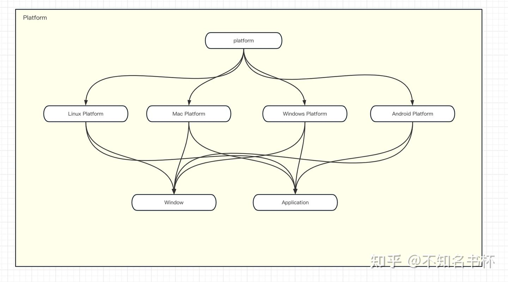

框架中是通过从platform中扩展出多个不同的平台来处理多平台问题，主要是分为Linux/Mac/Window/Android Platform，并且不同的Platfrom会选择不同的Window(比如SDL或者GLFW等等)。关于平台适配的问题在这Window层和Platform层都会处理完毕。整体主循环是在Platform中的main_loop函数中驱动的。调用链如下所示：

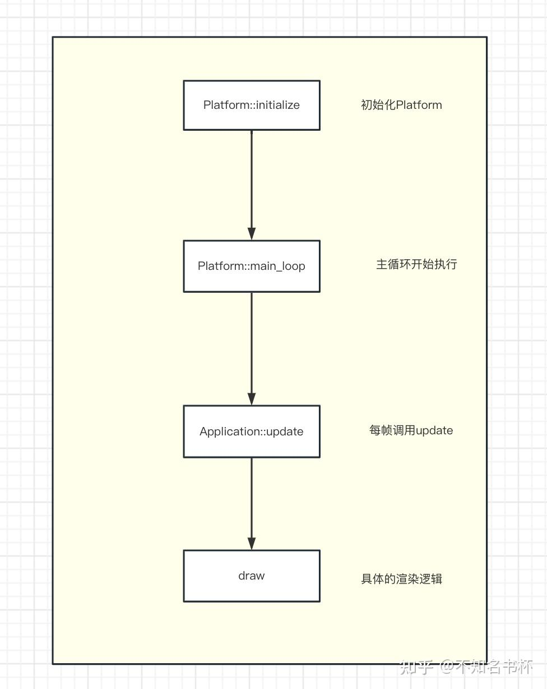

## RenderContext


RenderContext是框架当中的帧管理器，其生命周期与Application本身相同。在RenderContext中会包含多个RenderFrame。并且会在多个帧之间进行交换(调用begin_frame, end_frame)，并将对Vulkan资源的请求转发给到当前正在运行的RenderFrame。运行中会保证总是有一个处于运行的RenderFrame。并且可以有多个帧同时运行，所以需要每个帧的资源都是相互的独立的，各自都持有一份资源避免相互影响。

RenderContext需要Device和Surface以及Window这些对象来构造，这些对象主要用来创建一个SwapChain，Swapchain可以用于构造RenderTarget。每个RenderFrame都需要一个RenderTarget，将RenderFrame本次操作渲染到指定的RenderTarget直到最后被展示。还有一个active_frame_index字段被用来指示现在具体在运行的是哪个RenderFrame，还有一个thread_count字段被用于当前的RenderFrame指定用来多少个线程来完成Record Command。

RenderContext的整体调用流程如下所示：

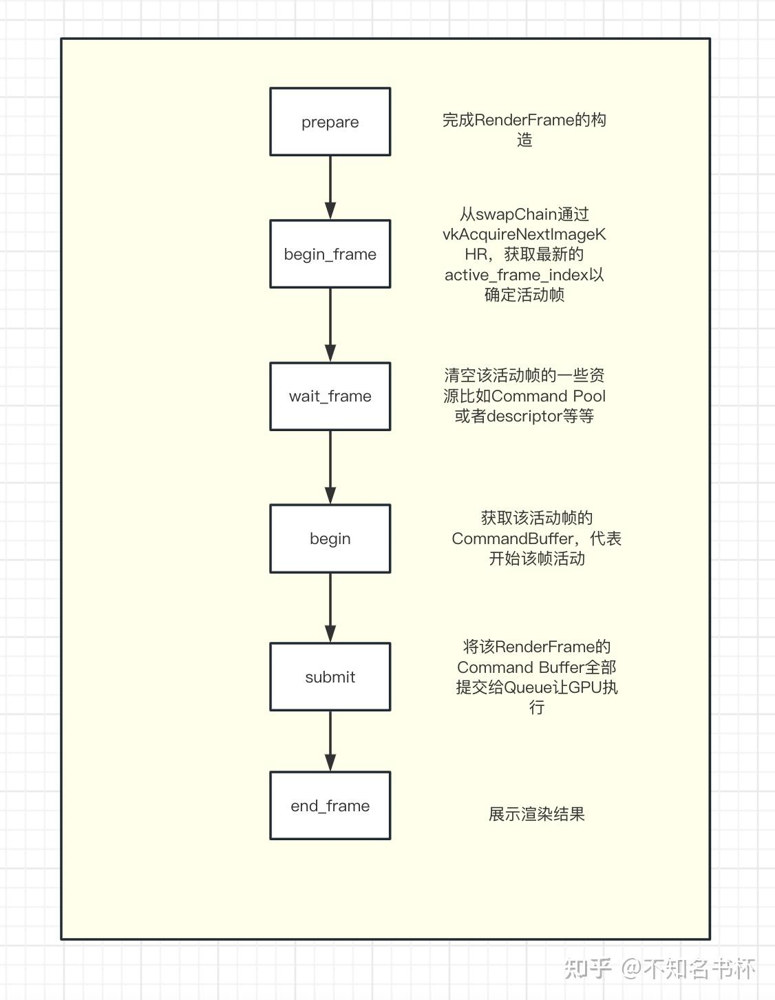

## RenderFrame

接下来介绍RenderFrame，RenderFrame是一个单帧数据的容器，包括BufferPool，RenderTarget，Fence，Semaphore，CommandPool，DescriptorPool等等对象。

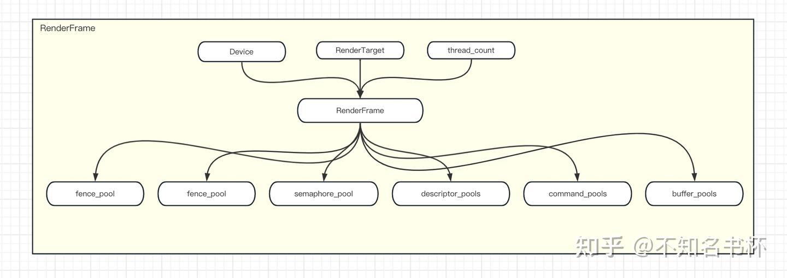

每个RenderFrame都会持有单独Command Pool以及DescriptorPool等等。如果是使用多个线程的话这些对象还需要增加(N个线程就需要N个对应的Pool)，因为每一个线程都会需要各自单独的Command Pool/DescriptorPool/Buffer Pool等等，首先Command Buffer是无法多线程共用一个的并且单个DescriptorPool被用来单个线程使用来分配DescriptorSet，因为在没有锁的情况下多线程使用同一个DescriptorPool是不可能的因为这很快就会造成浪费。这里还有一个问题是BufferPool对象也和上面两个Pool一样，但是这个主要被用来分配Buffer。其实完全没必要完全可以使用现成的Vma(AMD开源 Vulkan内存分配器)来替代，性能应该更优。

RenderFrame主要是被用来处理一些资源的分配，比如Command Buffer/DescriptorSet/Buffer/Fence/Semaphore等等，可以处理好各自线程之间的数据保证互不影响。每一帧单独持有各自的资源。

## RenderTarget

来看看RenderTarget中包含了什么吧，RenderTarget主要就是包含三个部分分别是Image/ImageView/Attachment。RenderPass的创建只需要一个Attachment数组(可以通过传入的Image/ImageView获取到相应的Attachment信息)，其实并不需要实际的Image或者ImageView，这样可以让创建RenderTarget尽量保持简单。因为调用者可以只要求一些Attachment信息就可以用于创建RenderPass，而不需要创建具体的Image或者ImageView，这些对象会从FrameBuffer中获取。Attachment的结构如下所示：

```cpp
struct Attachment
{
    VkFormat format{VK_FORMAT_UNDEFINED};
    VkSampleCountFlagBits samples{VK_SAMPLE_COUNT_1_BIT};
    VkImageUsageFlags usage{VK_IMAGE_USAGE_SAMPLED_BIT};
    VkImageLayout initial_layout{VK_IMAGE_LAYOUT_UNDEFINED};
    Attachment() = default;
    Attachment(VkFormat format, VkSampleCountFlagBits samples, VkImageUsageFlags usage);
};
```

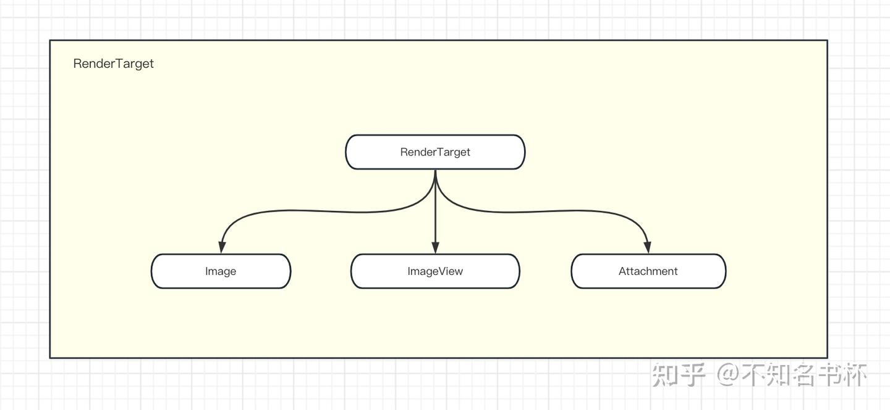

## Command Buffer

接着来看看Command Buffer，在Vulkan中的Command Buffer会存储所有的Command，并且被提交到Queue中被GPU执行。在该框架中的Command Buffer包含所有的关于Command Buffer的调用函数封装，比如是状态设置/同步/Draw的Command相关。

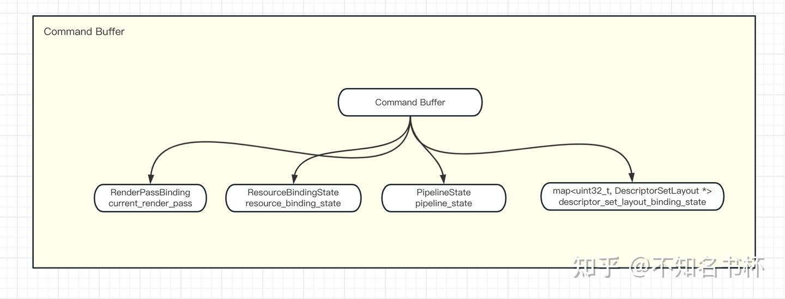

- current_render_pass： 用于存放本次对应的的RenderPass和Framebuffer对象。
- pipeline_state: 需要绑定的Pipeline State，并且包含了构造Pipeline所需的所有状态，其中的数据最后用于构造Pipeline对象。
- resource_binding_state：各种Buffer的资源绑定状态。会跟踪所有被Command Buffer绑定的资源。
- descriptor_set_layout_binding_state: 存储相应的DescriptorSetLayout。

其中还包含了很多其他对象，在这里就不一一介绍了。

整体流程如下图所示：

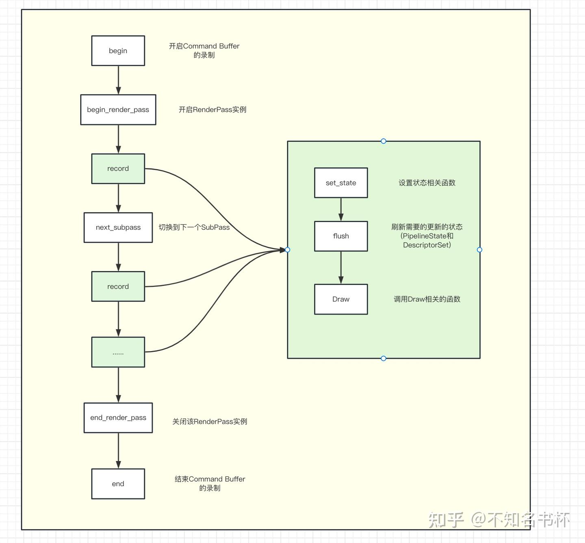

## Descriptor

在框架中关于Descriptor的封装主要是在DescriptorPool,DescriptorSet,DescriptorSetLayout三个文件中。

### DescriptorSetLayout

从DescriptorSetLayout开始。首先要明确DescriptorSet的创建需要一个DescriptorSetLayout和DescriptorPool，也就是说一个DescriptorSetLayout是单独对应一种DescriptorSet的。比如下面这个在Shader表示所需要的字段对应到第0个DescriptorSet以及对应到第一个binding。

```cpp
layout(set = 0, binding = 1) uniform GlobalUniform {
    mat4 model;
    mat4 view_proj;
    vec3 camera_position;
} global_uniform;
```

而DescriptorSetLayout主要是用来表示Shader中所需的所有资源， 在这里的做法是通过Shader反射来获取到所有的所需资源来构造DescriptorSetLayout。主要对象如下图所示：

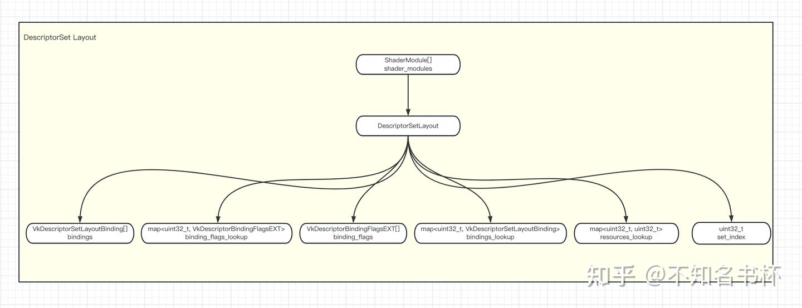

通过Shader的反射信息不断地填充VkDescriptorSetLayoutBinding。这些数据将会填充在VkDescriptorSetLayoutCreateInfo中。这里有一个特殊点是关于VkDescriptorSetLayoutCreateInfo的flag设置，假如Shader的反射信息中有资源是UpdateAfterBind状态(也就是VK_DESCRIPTOR_BINDING_UPDATE_AFTER_BIND_BIT_EXT)的话，需要给flag设置为VK_DESCRIPTOR_SET_LAYOUT_CREATE_UPDATE_AFTER_BIND_POOL_BIT_EXT，VK_DESCRIPTOR_BINDING_UPDATE_AFTER_BIND_BIT可以实现即使将 DescriptorSet 绑定到了具体的Pipeline上，且在提交渲染队列之前依然可以更新Descriptor，从而使资源保持最新的功能(这个是为了Bindless准备的)。

### DescriptorPool

DescriptorPool主要管理一个的VkDescriptorPool数组，VkDescriptorPool能够分配DescriptorSet。DescriptorPool需要传入DescriptorSetLayout结构，DescriptorPool会根据DescriptorSetLayout其中的所需Descriptor的类型和数量来创建对应类型的VkDescriptorPool。

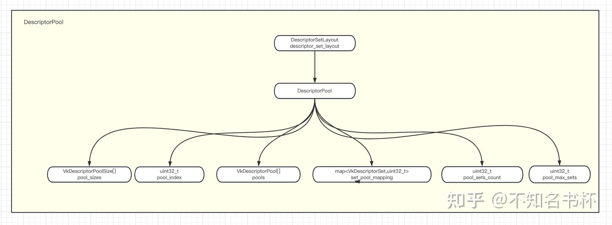

首先pool_sizes代表在DescriptorSetLayout中所需Descriptor类型和数量，DescriptorPool会根据pool_sizes创建相应的VkDescriptorPool。在框架中相当于一个DescriptorSetLayout单独对应到一个DescriptorPool。如果假如需要分配较多的DescriptorSet，DescriptorPool会自动重新创建VkDescriptorPool并且还是根据pool_sizes来创建相同类型的VkDescriptorPool。并且DescriptorPool还提供了对于DescriptorSet释放的不同策略，可以单独释放某个DescriptorSet或者重置整个DescriptorPool中所有的VkDescriptorPool。一般来说是选择后面一种方案对于内存来说更优，如果需要使用前一个方案则需要在VkDescriptorPoolCreateInfo::flags设置为FREE_DESCRIPTOR_SET_BIT。

整体流程如下所示：

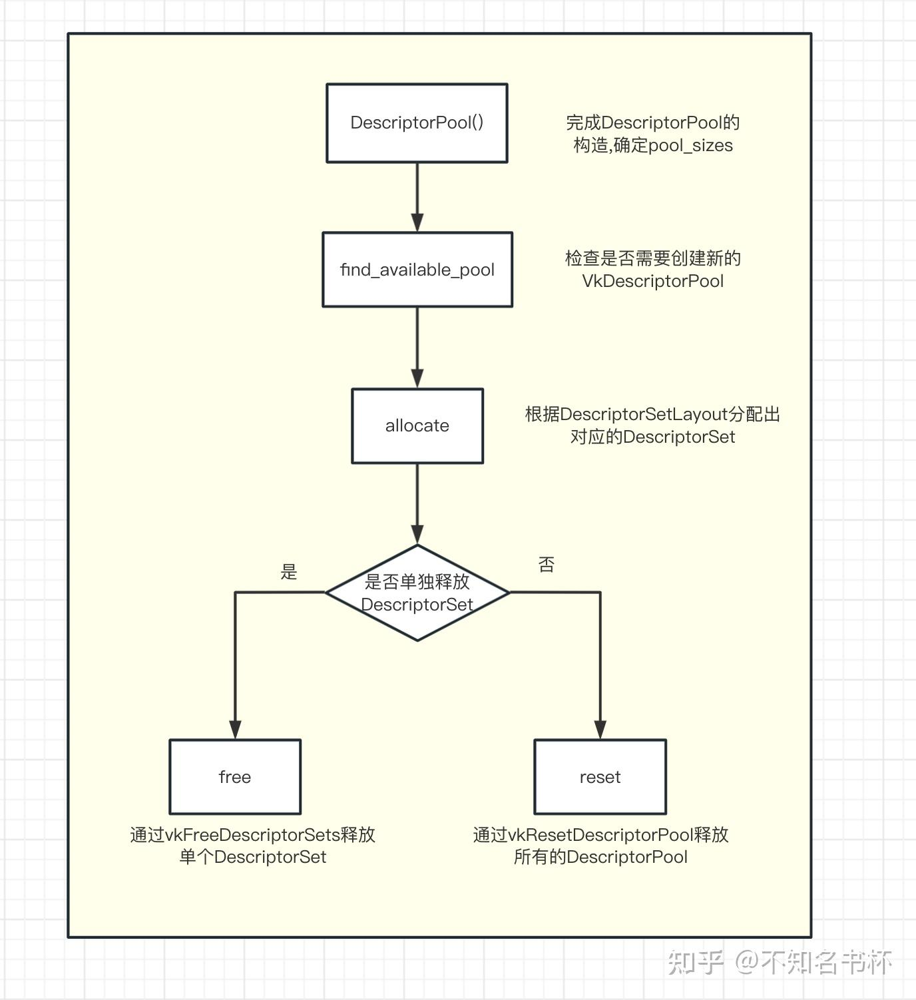

### DescriptorSet

接下来是DescriptorSet，已经可以通过DescriptorSetLayout和DescriptorPool已经可以做到分配一个DescriptorSet。接下来需要往DescriptorSet填入真正的数据。在这里需要填入所有的VkDescriptorBufferInfo和VkDescriptorImageInfo用于构造VkWriteDescriptorSet最后便可通过vkUpdateDescriptorSets更新该DescriptorSet指向的数据。

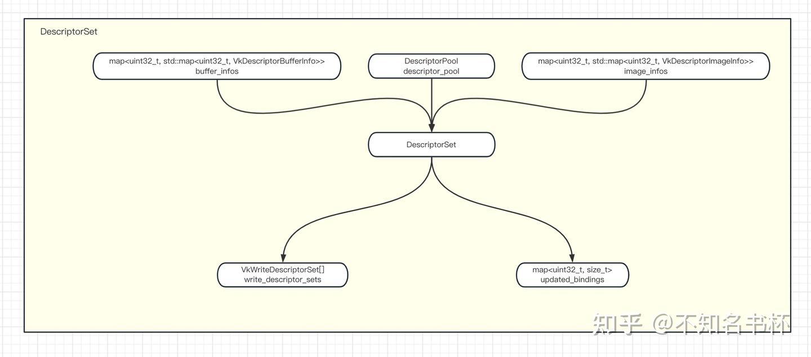

write_descriptor_sets用来存储从buffer_infos和image_infos中构建中的所有VkWriteDescriptorSet。updated_bindings用于存储中VkWriteDescriptorSet的对应hash值。避免重复更新DescriptorSet的某一个Binding中的数据。

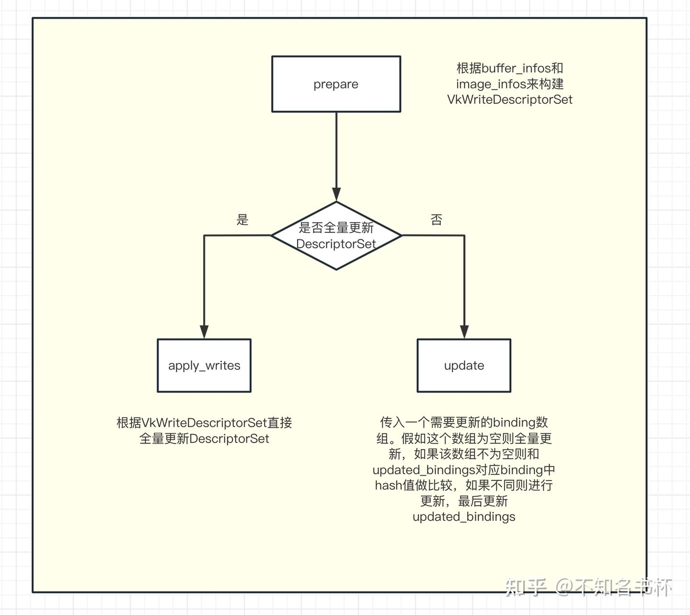

## Resource

在Vulkan大多是使用提前编译的对象用于减少运行时的各种状态组合的检验以减少CPU侧的负载，所以在 Vulkan 会将一些Vulkan对象序列化到本地的操作，然后在Vulkan程序开始运行时进行预热(Warm Up)便可以提前生成一些Vulkan对象。这样在后续运行时就无需要重新创建。可以很好的避免卡顿(Pipeline的创建还是挺耗时的)。可以具体关注resource_record/resource_cache/resource_replay/resource_caching这些文件。接下来解释一下各自的作用。如下图所示：

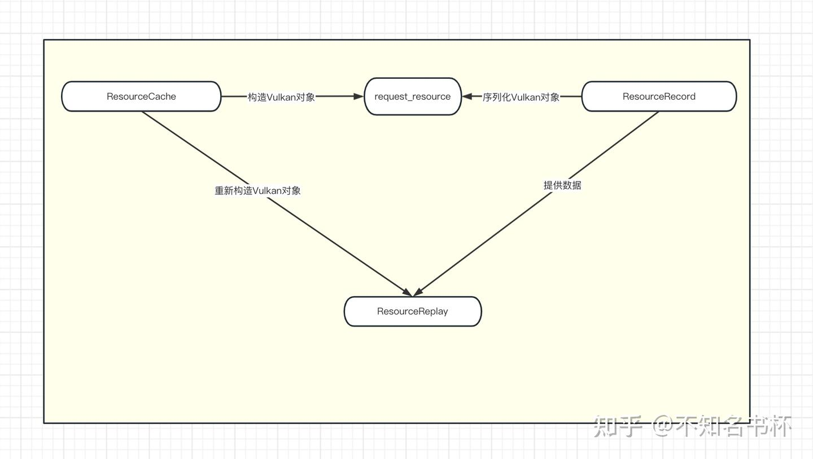

### ResourceCache

每一个Device单独持有一个ResourceCache。有需要被序列后存入本地的Vulkan对象都需要通过ResourceCache来创建。在这里可能存在多线程同时加载同一个资源的情况，所以在从ResourceCache中获取Vulkan对象则需要一个锁来保证不会重复缓存同一个Vulkan对象。在ResourceCache内部还有一个ResourceCacheState用来存储所有的之前通过ResourceCache创建的所有Vulkan对象。

```cpp
struct ResourceCacheState
{
    std::unordered_map<std::size_t, ShaderModule> shader_modules;

    std::unordered_map<std::size_t, PipelineLayout> pipeline_layouts;

    std::unordered_map<std::size_t, XXXX> XXXX;
    ........
};

class ResourceCache
{
  public:
    ResourceCache(Device &device);
    void warmup(const std::vector<uint8_t> &data);
    std::vector<uint8_t> serialize();
    ShaderModule &request_shader_module(VkShaderStageFlagBits stage, const ShaderSource &glsl_source, const ShaderVariant &shader_variant = {});

    XXXX request_XXXXX();
    .......
  private:
    Device &device;

    ResourceRecord recorder;
    ResourceReplay replayer;
    VkPipelineCache pipeline_cache{VK_NULL_HANDLE};
    ResourceCacheState state;
    std::mutex pipeline_layout_mutex;
    std::mutex shader_module_mutex;
    std::mutex XXX_mutex;
    .......

};
```

- request_XXXXX：通过request_XXXXX加载的Vulkan对象会被存入ResourceRecord中，并且会在ResourceCacheState缓存一份。
- warmup：开始预热在ResourceRecord存储的Vulkan对象。
- serialize：获取到序列化的Vulkan对象数据。

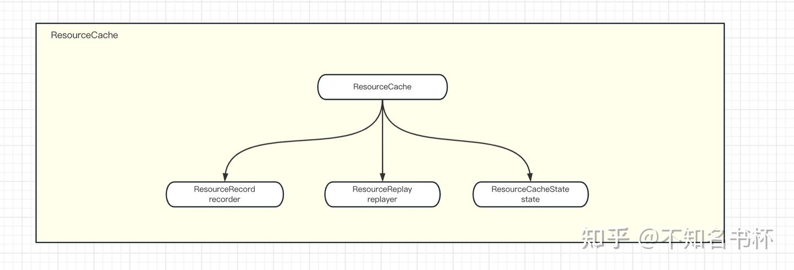

具体的调用流程如下所示：

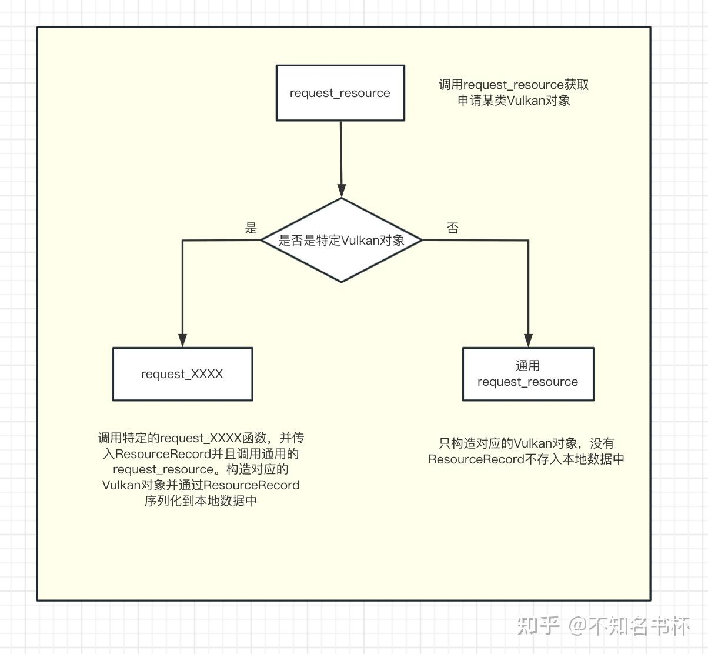

关于如何筛选出需要被持久化的Vulkan对象类型，在框架中通过下面这个方式得到：

```cpp
template <class T, class... A>
struct RecordHelper
{
    size_t record(ResourceRecord & /*recorder*/, A &... /*args*/)
    {
        return 0;
    }
    void index(ResourceRecord & /*recorder*/, size_t /*index*/, T & /*resource*/)
    {
    }
};

template <class... A>
struct RecordHelper<XXXX, A...>
{
    size_t record(ResourceRecord &recorder, A &... args)
    {
        return recorder.register_XXXX(args...);
    }
    void index(ResourceRecord &recorder, size_t index, ShaderModule &shader_module)
    {
        recorder.set_XXXX(index, shader_module);
    }
};
```

在request_resource调用中会构造一个RecordHelper对象。只需要在[模板特化](https://zhida.zhihu.com/search?content_id=228251159&content_type=Article&match_order=1&q=模板特化&zhida_source=entity)需要被ResourceRecord被持久化的类型即可，碰到对应的类型只需要调用request_resource中便会构造对应的RecordHelper即可调用record()和index()完成对于该Vulkan对象的存入字符串中。

### ResourceRecord

ResourceRecord被用于将其特定类型Vulkan对象全部写入字符串中。

```cpp
class ResourceRecord
{
  public:
    void set_data(const std::vector<uint8_t> &data);
    std::vector<uint8_t> get_data();
    const std::ostringstream &get_stream();

    size_t register_shader_module(VkShaderStageFlagBits stage,
                                  const ShaderSource &  glsl_source,
                                  const std::string &   entry_point,
                                  const ShaderVariant & shader_variant);
    size_t register_pipeline_layout(const std::vector<ShaderModule *> &shader_modules);
    size_t register_XXXX():
    ......

    void set_shader_module(size_t index, const ShaderModule &shader_module);
    void set_pipeline_layout(size_t index, const PipelineLayout &pipeline_layout);
    void set_XXXX();
    .....
  private:
    std::ostringstream stream;
    std::vector<size_t> shader_module_indices;
    std::vector<size_t> pipeline_layout_indices;
    std::vector<size_t> render_pass_indices;
    std::vector<size_t> graphics_pipeline_indices;
    std::unordered_map<const ShaderModule *, size_t> shader_module_to_index;
    std::unordered_map<const PipelineLayout *, size_t> pipeline_layout_to_index;
    std::unordered_map<const RenderPass *, size_t> render_pass_to_index;
    std::unordered_map<const GraphicsPipeline *, size_t> graphics_pipeline_to_index;
};
```

正如在上面提到的RecordHelper会调用Record和Index函数，其实也就是调用了set_XXXX和register_XXXX函数，它们的作用如下所示：

- register_XXXX：完成将Vulkan对象写入ostringstream的操作，并且返回一个索引。
- set_XXXX: 将具体的Vulkan对象指针和register_XXXX返回的索引做一个映射。

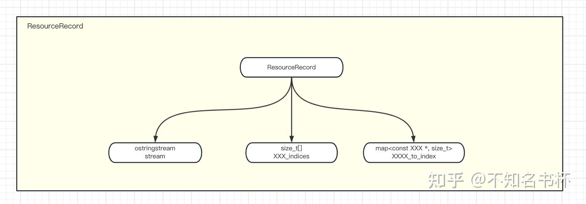

### ResourceReplay

ResourceReplay的作用就是从内存流数据中读取Vulkan对象并在中创建它们并存储到ResourceCache中。

```cpp
class ResourceReplay
{
  public:
    ResourceReplay();
    void play(ResourceCache &resource_cache, ResourceRecord &recorder);
  protected:
    void create_shader_module(ResourceCache &resource_cache, std::istringstream &stream);
    void create_pipeline_layout(ResourceCache &resource_cache, std::istringstream &stream);
    void create_render_pass(ResourceCache &resource_cache, std::istringstream &stream);
    void create_graphics_pipeline(ResourceCache &resource_cache, std::istringstream &stream);

  private:
    using ResourceFunc = std::function<void(ResourceCache &, std::istringstream &)>;
    std::unordered_map<ResourceType, ResourceFunc> stream_resources;
    std::vector<ShaderModule *> shader_modules;
    std::vector<PipelineLayout *> pipeline_layouts;
    std::vector<const RenderPass *> render_passes;
    std::vector<const GraphicsPipeline *> graphics_pipelines;
};
```

- play: 通过istringstream读取出对应的ResourceType，再调用具体的create_XXX函数通过数据来创建Vulkan对象。
- create_XXX：从istringstream中读取出数据，通过ResourceCache调用具体的request_XXXX创建Vulkan对象，并保存其指针。

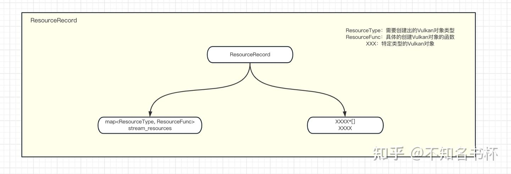

具体的调用流程所示：

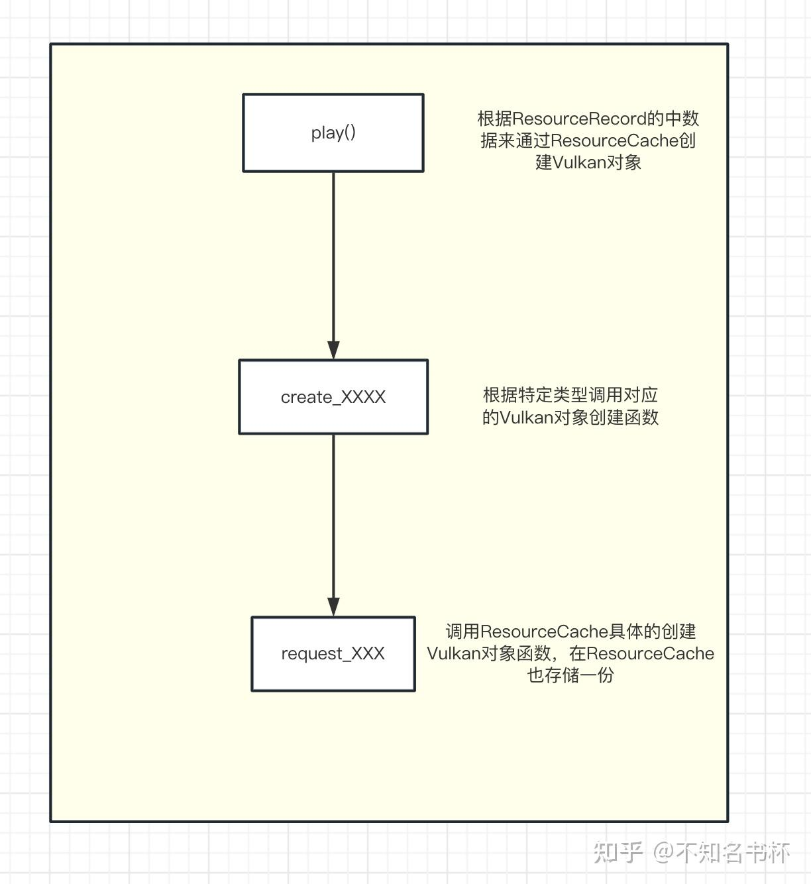

## 组织多Pass渲染

在这个框架中是如何组织多Pass之间的渲染(比如ShadowPass和MainScene Pass亦或者是GBufferPass和lightingPass)等等，框架中封装出RenderPipeline用于代表一个完整的渲染Pass。一个RenderPipeline中会包含多个Subpass，这些Subpass会被用于构造一个RenderPass对象。这也对应了一个RenderPass会包含多个Subpass。

### Subpass

Subpass主要是定义了一些重要的接口比如draw接口以及包含了被用于后续构造RenderPass的数据(也就是各种Attachment信息)，并且SubPass也被用于构建一个RenderPipeline。

```cpp
Class Subpass{
    Subpass(RenderContext &render_context, ShaderSource &&vertex_shader, ShaderSource &&fragment_shader);
    virtual void prepare() = 0;
    void update_render_target_attachments(RenderTarget &render_target);
    virtual void draw(CommandBuffer &command_buffer) = 0;
protected:
    RenderContext &render_context;
    VkSampleCountFlagBits sample_count{VK_SAMPLE_COUNT_1_BIT};
    std::unordered_map<std::string, ShaderResourceMode> resource_mode_map;
private:
    ShaderSource vertex_shader;
    ShaderSource fragment_shader;
    DepthStencilState depth_stencil_state{};
    bool disable_depth_stencil_attachment{false};
    VkResolveModeFlagBits depth_stencil_resolve_mode{VK_RESOLVE_MODE_NONE};
    std::vector<uint32_t> input_attachments = {};
    std::vector<uint32_t> output_attachments = {0};
    std::vector<uint32_t> color_resolve_attachments = {};
    uint32_t depth_stencil_resolve_attachment{VK_ATTACHMENT_UNUSED};
}
```

SubPass其中包含了单独的顶点和像素着色器以及包含的对应的Attachment索引以及是否开启Depth/Stencil测试还有是否需要Resolve操作等等。为什么每个SubPass都需要包含各自的顶点和像素着色器呢？一旦说需要一个新的Subpass出现都会对应到需要不同的着色器实现不同的逻辑，如果不是这样完全没有必要新建一个Subpass。

- prepare是被用作对于ShaderSource做进一步的处理用于处理Shader变体等等。
- draw就是实际调用各种Draw Command的地方。实际上在RenderPipeline中实际调用DrawCommand是其中包含的Subpass。
- update_render_target_attachments通过Subpass的Attachemnt信息来更新RenderTarget的Attachment信息。可以被用于创建RenderPass和Framebuffer。

在这里Subpass只是作为一个基类存在，在框架内部通过Subpass延伸出了forward_subpass/geometry_subpass便于使用。

### RenderPipeline

接下来看看RenderPipeline怎么组织这些Subpass的吧，RenderPipe如下所示：

```cpp
class RenderPipeline
{
  public:
    RenderPipeline(std::vector<std::unique_ptr<Subpass>> &&subpasses = {});
    void prepare();
    void add_subpass(std::unique_ptr<Subpass> &&subpass);
    std::vector<std::unique_ptr<Subpass>> &get_subpasses();
    void draw(CommandBuffer &command_buffer, RenderTarget &render_target, VkSubpassContents contents = VK_SUBPASS_CONTENTS_INLINE);
    std::unique_ptr<Subpass> &get_active_subpass();
  private:
    std::vector<std::unique_ptr<Subpass>> subpasses;
    /// Default to two load store
    std::vector<LoadStoreInfo> load_store = std::vector<LoadStoreInfo>(2);
    /// Default to two clear values
    std::vector<VkClearValue> clear_value = std::vector<VkClearValue>(2);
    size_t active_subpass_index{0};
};
```

在这里可以看到RenderPipeline持有多个Subpass，接下来看看RenderPipeline是怎么运作的吧。

- add_subpass: 往RenderPipeline添加Subpass。
- prepare: 调用所有的Subpass的perpare函数，准备好对应的ShaderModule。
- draw: 调用所有的Subpass的draw函数以执行具体的Draw Command。

### 使用流程


## Shader

接下来是框架中的Shader相关的封装，在这里主要抽象出ShaderResource/ShaderVariant/ShaderSource/ShaderModule这些对象，接下来看看分别都代表了什么吧。

### ShaderResource

ShaderResource被用来存储Shader中使用的资源信息以便后续被用于ShaderModule的构造。是通过从SPIRV反射代码和提供的ShaderVariant生成。具体结构如下所示：

```cpp
struct ShaderResource
{
    VkShaderStageFlags stages;
    ShaderResourceType type;
    ShaderResourceMode mode;
    uint32_t set;
    uint32_t binding;
    uint32_t location;
    uint32_t input_attachment_index;
    uint32_t vec_size;
    uint32_t columns;
    uint32_t array_size;
    uint32_t offset;
    uint32_t size;
    uint32_t constant_id;
    uint32_t qualifiers;
    std::string name;
};
```

### ShaderVariant

ShaderVariant在这里为Shader增加了对C风格预处理器宏的支持，可以让你能够定义或取消定义某些符号。

```cpp
class ShaderVariant
{
  public:
    ShaderVariant(std::string &&preamble, std::vector<std::string> &&processes);
    size_t get_id() const;
    void add_definitions(const std::vector<std::string> &definitions);
    void add_define(const std::string &def);
    void add_undefine(const std::string &undef);
    void add_runtime_array_size(const std::string &runtime_array_name, size_t size);
    void set_runtime_array_sizes(const std::unordered_map<std::string, size_t> &sizes);
    const std::string &get_preamble() const;
    const std::vector<std::string> &get_processes() const;
    const std::unordered_map<std::string, size_t> &get_runtime_array_sizes() const;
    void clear();
  private:
    size_t id;
    std::string preamble;
    std::vector<std::string> processes;
    std::unordered_map<std::string, size_t> runtime_array_sizes;
    void update_id();
};
```

- update_id： 对于preamble这个字符串进行哈希处理，保证其唯一性。
- add_define：在Shader中添加一个宏定义，添加`("#define " + def + "\n")`形式的字符串。并调用update_id刷新。
- add_undefine：为着色器添加一个undef宏，添加`("#undef " + undef + "\n")`形式的字符串。并调用update_id刷新。
- add_runtime_array_size：是为反射指定一个名为runtime_array_name的运行时数组(其实也就是SSBO)的大小。如果已经指定，则覆盖该原来的值。

### ShaderSource

ShaderSource主要是通过传入的filename去加载对应的Shader文件并且将其作为字符串读入。主要作用是存储原始Shader后续用于ShaderModuler的构建。

```cpp
class ShaderSource
{
  public:
    ShaderSource(const std::string &filename);
    size_t get_id() const;
    const std::string &get_filename() const;
    void set_source(const std::string &source);
    const std::string &get_source() const;
  private:
    size_t id;
    std::string filename;
    std::string source;
};
```

在构造ShaderSource是会通过filename调用read_shader读取Shader文件。

### ShaderModule

ShaderModule用于表示指定这个Shader中的哪个函数作为入口函数以及将被在什么阶段被调用，ShaderModule将会用于构建PipelineLayout以及DescriptSetLayout。同时也会处理该所有的Shader变体(生成好对应的ShaderResource信息)。ShaderModule会将glsl以及在glsl中引用到的其他glsl文件，全部编译成为spirv(用于后续在Pipleine创建过程中创建VkShaderModule)。并且通过反射获取到所有的ShaderResource。也就是Shader中会用到的所有资源信息。

```cpp
class ShaderModule
{
  public:
    ShaderModule(Device &              device,
                 VkShaderStageFlagBits stage,
                 const ShaderSource &  glsl_source,
                 const std::string &   entry_point,
                 const ShaderVariant & shader_variant);
    size_t get_id() const;
    VkShaderStageFlagBits get_stage() const;
    const std::string &get_entry_point() const;
    const std::vector<ShaderResource> &get_resources() const;
    const std::string &get_info_log() const;
    const std::vector<uint32_t> &get_binary() const;
    void set_resource_mode(const std::string &resource_name, const ShaderResourceMode &resource_mode);
  private:
    Device &device;
    /// Shader unique id
    size_t id;
    /// Stage of the shader (vertex, fragment, etc)
    VkShaderStageFlagBits stage{};
    /// Name of the main function
    std::string entry_point;
    /// Human-readable name for the shader
    std::string debug_name;
    /// Compiled source
    std::vector<uint32_t> spirv;
    std::vector<ShaderResource> resources;
    std::string info_log;
};
```

ShaderModule具体构造流程如下所示：

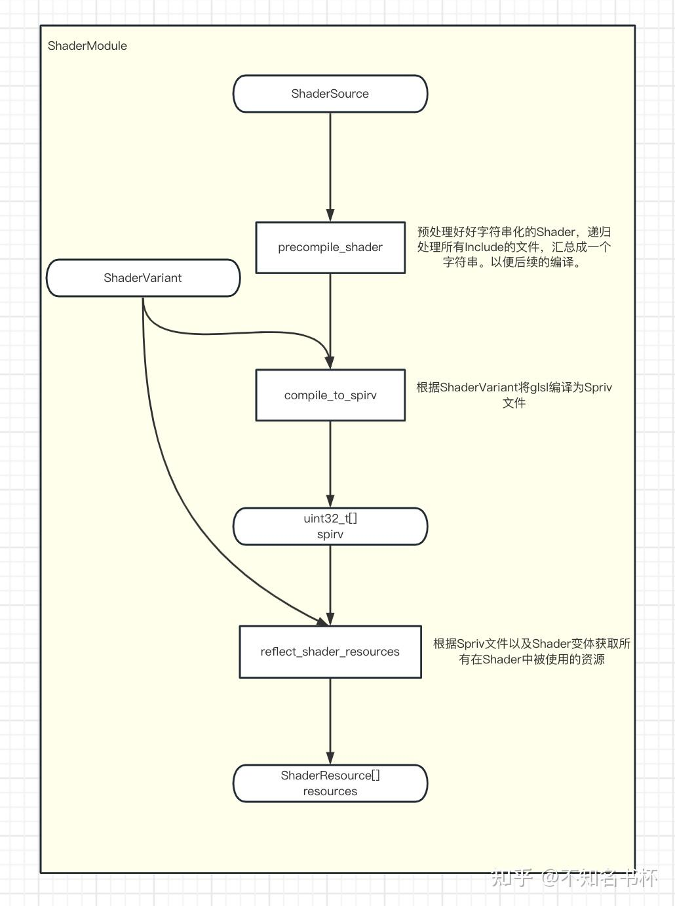

## Vulkan Stat

那么框架中如何统计各种性能信息的？部分能力是通过Vulkan本身的 GPU Query提供，部分能力是通过Hwcpipeline提供的。在这里主要是介绍Vulkan通过GPU Query统计性能的能力。

在框架当中通过一个Stat对象来管理所有的性能数据统计，在Stat中会包含有很多的不同的StatsProvider对象，StatsProvider是一个基类，它有着不同的子类分别支撑了不同的功能。比如有专门计算帧时间的FrameTimeStatsProvider和统计GPU性能数据的VulkanStatsProvider等等后续会详细讲到，首先来看看StatsProvider是怎么设计的。

### 整体流程

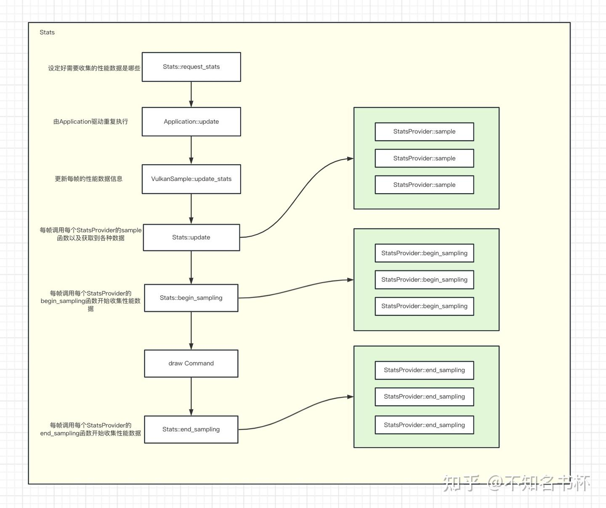

### StatsProvider

```cpp
class StatsProvider
{
  public:
    struct Counter
    {
        double result;
    };

    using Counters = std::unordered_map<StatIndex, Counter, StatIndexHash>;
    virtual ~StatsProvider() {}
    virtual bool is_available(StatIndex index) const = 0;
    virtual const StatGraphData &get_graph_data(StatIndex index) const
    {
        return default_graph_map.at(index);
    }
    static const StatGraphData &default_graph_data(StatIndex index);
    virtual Counters sample(float delta_time) = 0;
    virtual Counters continuous_sample(float delta_time)
    {
        return Counters();
    }
    virtual void begin_sampling(CommandBuffer &cb) {}
    virtual void end_sampling(CommandBuffer &cb) {}
  protected:
    static std::map<StatIndex, StatGraphData> default_graph_map;
};

std::map<StatIndex, StatGraphData> StatsProvider::default_graph_map{
    // StatIndex                        Name shown in graph                            Format           Scale                         Fixed_max Max_value
    {StatIndex::frame_times,           {"Frame Times",                                 "{:3.1f} ms",    1000.0f}},
    {StatIndex::cpu_cycles,            {"CPU Cycles",                                  "{:4.1f} M/s",   static_cast<float>(1e-6)}},
    {StatIndex::cpu_instructions,      {"CPU Instructions",                            "{:4.1f} M/s",   static_cast<float>(1e-6)}},
    {StatIndex::cpu_cache_miss_ratio,  {"Cache Miss Ratio",                            "{:3.1f}%",      100.0f,                       true,     100.0f}},
    {StatIndex::cpu_branch_miss_ratio, {"Branch Miss Ratio",                           "{:3.1f}%",      100.0f,                       true,     100.0f}},
    {StatIndex::cpu_l1_accesses,       {"CPU L1 Accesses",                             "{:4.1f} M/s",   static_cast<float>(1e-6)}},
    {StatIndex::cpu_instr_retired,     {"CPU Instructions Retired",                    "{:4.1f} M/s",   static_cast<float>(1e-6)}},
    {StatIndex::cpu_l2_accesses,       {"CPU L2 Accesses",                             "{:4.1f} M/s",   static_cast<float>(1e-6)}},
    {StatIndex::cpu_l3_accesses,       {"CPU L3 Accesses",                             "{:4.1f} M/s",   static_cast<float>(1e-6)}},
    {StatIndex::cpu_bus_reads,         {"CPU Bus Read Beats",                          "{:4.1f} M/s",   static_cast<float>(1e-6)}},
    {StatIndex::cpu_bus_writes,        {"CPU Bus Write Beats",                         "{:4.1f} M/s",   static_cast<float>(1e-6)}},
    {StatIndex::cpu_mem_reads,         {"CPU Memory Read Instructions",                "{:4.1f} M/s",   static_cast<float>(1e-6)}},
    {StatIndex::cpu_mem_writes,        {"CPU Memory Write Instructions",               "{:4.1f} M/s",   static_cast<float>(1e-6)}},
    {StatIndex::cpu_ase_spec,          {"CPU Speculatively Exec. SIMD Instructions",   "{:4.1f} M/s",   static_cast<float>(1e-6)}},
    {StatIndex::cpu_vfp_spec,          {"CPU Speculatively Exec. FP Instructions",     "{:4.1f} M/s",   static_cast<float>(1e-6)}},
    {StatIndex::cpu_crypto_spec,       {"CPU Speculatively Exec. Crypto Instructions", "{:4.1f} M/s",   static_cast<float>(1e-6)}},

    {StatIndex::gpu_cycles,            {"GPU Cycles",                                  "{:4.1f} M/s",   static_cast<float>(1e-6)}},
    {StatIndex::gpu_vertex_cycles,     {"Vertex Cycles",                               "{:4.1f} M/s",   static_cast<float>(1e-6)}},
    {StatIndex::gpu_load_store_cycles, {"Load Store Cycles",                           "{:4.0f} k/s",   static_cast<float>(1e-6)}},
    {StatIndex::gpu_tiles,             {"Tiles",                                       "{:4.1f} k/s",   static_cast<float>(1e-3)}},
    {StatIndex::gpu_killed_tiles,      {"Tiles killed by CRC match",                   "{:4.1f} k/s",   static_cast<float>(1e-3)}},
    {StatIndex::gpu_fragment_jobs,     {"Fragment Jobs",                               "{:4.0f}/s"}},
    {StatIndex::gpu_fragment_cycles,   {"Fragment Cycles",                             "{:4.1f} M/s",   static_cast<float>(1e-6)}},
    {StatIndex::gpu_tex_cycles,        {"Shader Texture Cycles",                       "{:4.0f} k/s",   static_cast<float>(1e-3)}},
    {StatIndex::gpu_ext_reads,         {"External Reads",                              "{:4.1f} M/s",   static_cast<float>(1e-6)}},
    {StatIndex::gpu_ext_writes,        {"External Writes",                             "{:4.1f} M/s",   static_cast<float>(1e-6)}},
    {StatIndex::gpu_ext_read_stalls,   {"External Read Stalls",                        "{:4.1f} M/s",   static_cast<float>(1e-6)}},
    {StatIndex::gpu_ext_write_stalls,  {"External Write Stalls",                       "{:4.1f} M/s",   static_cast<float>(1e-6)}},
    {StatIndex::gpu_ext_read_bytes,    {"External Read Bytes",                         "{:4.1f} MiB/s", 1.0f / (1024.0f * 1024.0f)}},
    {StatIndex::gpu_ext_write_bytes,   {"External Write Bytes",                        "{:4.1f} MiB/s", 1.0f / (1024.0f * 1024.0f)}},
};
```

- is_available：用于检测该StatsProvider是否支持某种性能数据的收集。
- begin_sampling：开始采样对应的性能数据。
- end_sampling：结束采样对应的性能数据。
- get_graph_data： 从default_graph_map获取对应的数据。
- sample：获取本次性能采样的结果。

### FrameTimeStatsProvider

FrameTimeStatsProvider作为StatsProvider的子类主要被用来简单的统计一帧耗时多少。在这里需要注意一点是关于帧时间的统计是被这个FrameTimeStatsProvider全部处理，在FrameTimeStatsProvider的构造函数会将StatIndex::frame_times这一项删除掉，避免其他的StatsProvider来统计FrameTime。

```cpp
class FrameTimeStatsProvider : public StatsProvider
{
  public:
    FrameTimeStatsProvider(std::set<StatIndex> &requested_stats);
    bool is_available(StatIndex index) const override;
    Counters sample(float delta_time) override;
};
```

- is_available：检测是否支持FrameTime的统计。
- sample： 采样FrameTime数据。

### VulkanStatsProvider

VulkanStatsProvider主要是通过GPU Query中的Performance Query和TimeStamp Query来获取对应的性能数据。

```cpp
class VulkanStatsProvider : public StatsProvider
{
  public:
    VulkanStatsProvider(std::set<StatIndex> &requested_stats, const CounterSamplingConfig &sampling_config,
                        RenderContext &render_context)
    ~VulkanStatsProvider();
    bool is_available(StatIndex index) const override;
    const StatGraphData &get_graph_data(StatIndex index) const override;
    Counters sample(float delta_time) override;
    void begin_sampling(CommandBuffer &cb) override;
    void end_sampling(CommandBuffer &cb) override;
  private:
    bool is_supported(const CounterSamplingConfig &sampling_config) const;
    bool fill_vendor_data();
    bool create_query_pools(uint32_t queue_family_index);
    float get_best_delta_time(float sw_delta_time) const;
  private:
    RenderContext &render_context;
    std::unique_ptr<QueryPool> query_pool;
    bool has_timestamps{false};
    float timestamp_period{1.0f};
    std::unique_ptr<QueryPool> timestamp_pool;
    VendorStatMap vendor_data;
    StatDataMap stat_data;
    std::vector<uint32_t> counter_indices;  uint32_t queries_ready = 0;
};
```

- get_best_delta_time: 获取TimeStamp Query的结果并且计算出对应的deltaTime，后续供Performance Query结果做计算。
- is_supported：检查是否支持VK_KHR_performance_query以及VK_EXT_host_query_reset这些Extension。
- is_available： 是否支持检测某种类型的性能数据。
- fill_vendor_data：每个供应商都有一套不同的Perfomance Counters，每个Counters都有不同的名称。在可用的情况下将它们与想要的统计数据相匹配。
- create_query_pools：创建对应的TimeStamp Query和Performance Query的QueryPool。
- begin_sampling：写入首个TimeStamp并且开启本次Performance Query。
- end_sampling：写入第二个TimeStamp并且结束本次Performance Query。
- sample：从TimeStamp Query和Performance Query的QueryPool获取结果并解析这些数据。

### 整体流程图

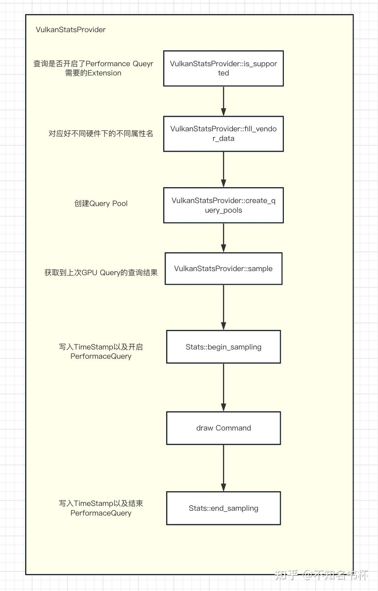

## 总结

在这里记录了一些关于Vulkan Sample中的一些框架封装的[基础结构](https://zhida.zhihu.com/search?content_id=228251159&content_type=Article&match_order=1&q=基础结构&zhida_source=entity)，希望可以帮助其他同学理解到如何更好的去封装一个Vulkan框架，能够学习到关于Vulkan的一些编程经验。