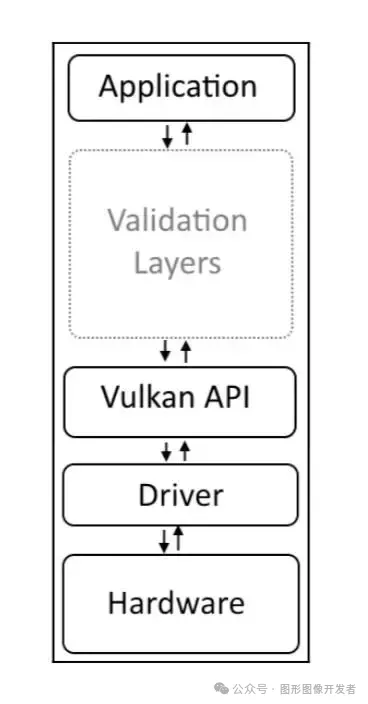

# Vulkan 实例（Instance）

## 实例（Instance）

**Vulkan 实例 是 Vulkan API中的一个基本概念，它是连接 Vulkan 库和应用程序之间的桥梁，用于初始化Vulkan 库。**创建 Vulkan 实例涉及到向驱动程序提供应用程序的一些细节，如应用程序信息和引擎信息等。


**在Vulkan中，实例（VkInstance）是存储所有每个应用状态的对象，应用程序必须在执行任何其他 Vulkan 操作之前创建一个 Vulkan 实例。**


这个**类似于 OpenGL 的上下文概念**，一个实例代表一整 Vulkan 环境（或上下文）。不同的 Vulkan环境能够获取到不同的 Vulkan 功能特性。

## 创建 VkInstance

Vulkan 编程中**，创建一个 Vulkan 组件有一个固定的规则，首先需要设置一个创建组件信息的结构体 VkxxxCreateInfo，然后调用创建组件的 API VkCreatexxx 。**

## VkInstanceCreateInfo

```
typedef struct VkInstanceCreateInfo {
    VkStructureType             sType;
    const void*                 pNext;
    VkInstanceCreateFlags       flags;
    const VkApplicationInfo*    pApplicationInfo;
    uint32_t                    enabledLayerCount;
    const char* const*          ppEnabledLayerNames;
    uint32_t                    enabledExtensionCount;
    const char* const*          ppEnabledExtensionNames;
} VkInstanceCreateInfo;
```


- **sType** 是该结构体的类型枚举值， 必须 是 VkStructureType::VK_STRUCTURE_TYPE_INSTANCE_CREATE_INFO 。

- pNext 要么是 nullptr 要么指向其他结构体来扩展该结构体。

- flags 是 VkInstanceCreateFlagBits 所表示的位域值，用于设置 VkInstance 的行为。

- **pApplicationInfo** 要么是 nullptr， 要么指向应用信息结构体，用于应用细节设置。

- **enabledLayerCount** 激活的 layer 数量。

- **ppEnabledLayerNames** 指向数量为 enabledLayerCount 的 layer 字符串数组，用于设置要激活的 layer。

- **enabledExtensionCount** 激活 instance 扩展的数量。

- **ppEnabledExtensionNames** 指向数量为 enabledExtensionCount 的扩展字符串数组，用于设置要激活的 instance 扩展。

  

重点讲下 **VkApplicationInfo、Layer 和 Extension**。

**VkApplicationInfo**

```
  VkApplicationInfo appInfo = {
      .sType = VK_STRUCTURE_TYPE_APPLICATION_INFO,
      .pNext = nullptr,
      .pApplicationName = "my_vulkan_app",
      .applicationVersion = VK_MAKE_VERSION(1, 0, 0),
      .pEngineName = "vulkan_tutorial",
      .engineVersion = VK_MAKE_VERSION(1, 0, 0),
      .apiVersion = VK_MAKE_VERSION(1, 0, 0),
  };
```


- sType 是该结构体的类型枚举值， 必须 是 VkStructureType::VK_STRUCTURE_TYPE_APPLICATION_INFO 。

- pNext 要么是 NULL 要么指向其他结构体来扩展该结构体。

- pApplicationName 要么是 NULL 要么指向一个以空字符为结尾的 UTF-8 字符串，用于表示用户自定义应用名称。

- applicationVersion 一个无符号整型，用于用户自定义应用版本。

- pEngineName 要么是 nullptr 要么指向一个以空字符为结尾的 UTF-8 字符串，用于表示用户自定义引擎名称。

- engineVersion 一个无符号整型，用于用户自定义引擎版本。

- **apiVersion 是应用打算使用的 Vulkan 的最高 核心 版本，并且忽略 apiVersion 的 patch 版本**。

  

其中 pApplicationName 、 applicationVersion 、 pEngineName 和 engineVersion 这几个值随便设置，甚至可以不设置，赋为空都可以，这些参数不影响实例的创建。


而 apiVersion 参数是最为重要的核心参数 ，当创建实例时，该参数用于指定此实例环境中 Vulkan 的 核心 版本 。


**如果你 Vulkan 版本设置错了，可能没法使用一些特性。**


Vulkan API 的最新版本是 1.3，目前 Vulkan 有 4 个版本：

- Vulkan 1.0 主要提供光栅化图形和并行计算的功能。对应 VK_API_VERSION_1_0 。
- Vulkan 1.1 主要为 Vulkan 1.0 不完善的地方进行补全。对应 VK_API_VERSION_1_1 。
- Vulkan 1.2 主要提供硬件光追的功能。对应 VK_API_VERSION_1_2 。
- Vulkan 1.3 主要提供动态光栅化图形的功能。对应 VK_API_VERSION_1_3 。

每个 Vulkan 新版本的发布不单单提供基本功能，还会提供一系列扩展功能，并且会将之前版本中的一些扩展功能提升囊括至核心版本中。

## Layer

Vulkan 的 Layer（层）是一种重要的机制，允许开发者在 Vulkan API 的核心功能上插入额外的功能和工具。



**Layer 主要的特点是模块化，可以根据需要加载和卸载，开发者可以选择在应用程序初始化时启用哪些层。**


**常用作正确性验证检查。**比如你添加了验证层 VK_LAYER_KHRONOS_validation ，如果在执行阶段发生了使用错误， Layer 会输出错误信息，帮助开发者定位错误。

目前 Vulkan 支持的 层 如下：

- **VK_LAYER_KHRON****OS_validation Vulkan API 验证和错误检查。**
- VK_LAYER_LUNARG_gfxreconstruct 使用 GFXReconstruct 捕获应用的 Vulkan 指令。
- VK_LAYER_LUNARG_api_dump 输出调用的 API 和传入的参数。
- VK_LAYER_KHRONOS_profiles 帮助测试硬件的性能，而不需要物理接触每个设备。该 层 将会覆盖从 GPU 查询到的数据。
- VK_LAYER_LUNARG_monitor 在应用界面的标题处显示帧率。
- VK_LAYER_LUNARG_screenshot 将显示的画面帧输出到一个图片文件中。
- VK_LAYER_KHRONOS_synchronization2 使用系统实现的 VK_KHR_synchronization2 扩展，而不是驱动实现的。
- VK_LAYER_KHRONOS_shader_object 使用系统实现的 VK_EXT_shader_object 扩展，而不是驱动实现的。

可以通过 vkEnumerateInstanceLayerProperties函数获取系统中 Vulkan 支持的 Layer ：

```
uint32_t layer_property_count = 0;
vkEnumerateInstanceLayerProperties(&layer_property_count, nullptr);

std::vector<VkLayerProperties> layer_properties(layer_property_count);
vkEnumerateInstanceLayerProperties(&layer_property_count, layer_properties.data());
```

思考：vkEnumerateInstanceLayerProperties 这个函数为什么调用了 2 次？
其中 VkLayerProperties 定义如下：

```
// 由 VK_VERSION_1_0 提供
typedef struct VkLayerProperties {
    char        layerName[VK_MAX_EXTENSION_NAME_SIZE];
    uint32_t    specVersion;
    uint32_t    implementationVersion;
    char        description[VK_MAX_DESCRIPTION_SIZE];
} VkLayerProperties;
```

## Extension

**Vulkan Extensions（扩展）是对 Vulkan API 的功能扩展，它们允许硬件制造商、平台开发者和第三方提供额外的功能和特性，这些功能和特性不包含在核心 Vulkan 规范中。**


在 Vulkan 中有两类扩展：

- **Instance 扩展 与使用哪一个 GPU 设备无关，与 Vulkan 环境有关。**VkInstanceCreateInfo 中的 enabledExtensionCount 和 ppEnabledExtensionNames 就是用于配置此类 Instance 扩展 。
- Device 扩展 与使用哪一个 GPU 设备有关。不同厂家的 GPU 设备会支持不同的设备扩展。这将会在之后的章节展开。

VkInstance 支持的实例扩展可以通过 vkEnumerateInstanceExtensionProperties 函数获取：

```
// 由 VK_VERSION_1_0 提供
VkResult vkEnumerateInstanceExtensionProperties(
    const char*                                 pLayerName,
    uint32_t*                                   pPropertyCount,
    VkExtensionProperties*                      pProperties);
```


要想获取全部的扩展，该函数的调用与 vkEnumerateInstanceLayerProperties(...) 类似，调用两遍，第一遍 pProperties 为 nullptr ，第二遍为有效值即可：


```
uint32_t extension_property_count = 0;
vkEnumerateInstanceExtensionProperties(nullptr, &extension_property_count, nullptr);

std::vector<VkExtensionProperties> extension_properties(extension_property_count);
vkEnumerateInstanceExtensionProperties(nullptr, &extension_property_count, extension_properties.data());
```

其中 VkExtensionProperties 定义如下：

```
// 由 VK_VERSION_1_0 提供
typedef struct VkExtensionProperties {
    char        extensionName[VK_MAX_EXTENSION_NAME_SIZE];//扩展名称
    uint32_t    specVersion;//版本
} VkExtensionProperties;
```


有一些实例扩展我们需要重点关注一下

- **VK_KHR_surface 代表窗口通用平面扩展。**
- VK_{vender}_{platform}_surface 代表各个平台各自的窗口平面（各自平台适配到通用平面）。

**比如**

- **VK_KHR_win32_surface** 为 Windows 平台，供应商为 Khronos 。
- VK_OHOS_surface 为 OpenHarmony 平台，供应商为 华为 。
- **VK_KHR_android_surface** 为 Android 平台，供应商为 Khronos 。
- VK_KHR_[wayland/xcb/xlib]_surface 为 Linux 平台（其中 [wayland/xcb/xlib] 表示三者其一），供应商为 Khronos 。

**创建 Instance 示例：**

```
VkInstance instance = nullptr;

std::vector<const char*> instance_extensions;
instance_extensions.push_back("VK_KHR_surface");
instance_extensions.push_back("VK_KHR_android_surface");//Android
//如果是 WIndow 平台使用 VK_KHR_win32_surface

std::vector<const char *> instance_layers;
instance_layers.push_back("VK_LAYER_KHRONOS_validation");//添加验证层

VkApplicationInfo appInfo = {
      .sType = VK_STRUCTURE_TYPE_APPLICATION_INFO,
      .pNext = nullptr,
      .pApplicationName = "my_vulkan_app",
      .applicationVersion = VK_MAKE_VERSION(1, 0, 0),
      .pEngineName = "example",
      .engineVersion = VK_MAKE_VERSION(1, 0, 0),
      .apiVersion = VK_MAKE_VERSION(1, 0, 0),
  };

VkInstanceCreateInfo instanceCreateInfo{
      .sType = VK_STRUCTURE_TYPE_INSTANCE_CREATE_INFO,
      .pNext = nullptr,
      .pApplicationInfo = &appInfo,
      .enabledLayerCount = 
          static_cast<uint32_t>(instance_layers.size()),
      .ppEnabledLayerNames = instance_layers.data(),
      .enabledExtensionCount =
          static_cast<uint32_t>(instance_extensions.size()),
      .ppEnabledExtensionNames = instance_extensions.data(),
  };

VkResult result = vkCreateInstance(&instanceCreateInfo, nullptr, &instance);
if (result != VK_SUCCESS)
{
   //VkInstance 创建失败
}

// 开启 Vulkan 编程 ...

vkDestroyInstance(instance, nullptr);//通过 vkDestroyInstance 函数销毁 instance
```