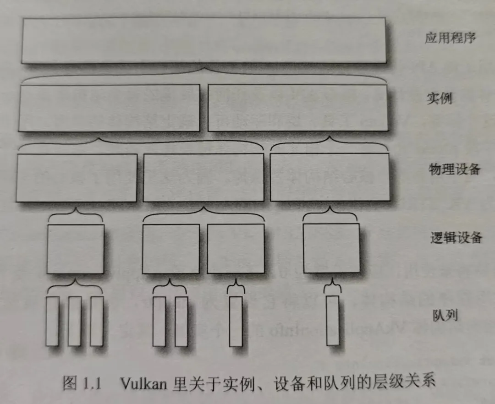

# Vulkan 物理设备



图片来自《 Vulkan 应用开发指南》

上一节了解了 Vulkan 实例，一旦有了实例，就可以查找系统里安装的与 Vulkan 兼容的物理设备。

**Vulkan 物理设备（PhysicalDevice）一般是指支持 Vulkan 的物理硬件**，通常是系统的一部分--显卡、加速器、数字信号处理器或者其他的组件。系统里有固定数量的物理设备，每个物理设备都有自己的一组固定的功能。

**一台主机上可能连接着多个支持 Vulkan 的物理设备**，为此 Vulkan 提供列举出系统中支持 Vulkan 的所有物理设备功能，开发者可通过 vkEnumeratePhysicalDevices() 函数枚举支持 Vulkan 的物理设备。

vkEnumeratePhysicalDevices 函数其定义如下：

```
VkResult vkEnumeratePhysicalDevices(
    VkInstance                                  instance,
    uint32_t*                                   pPhysicalDeviceCount,
    VkPhysicalDevice*                           pPhysicalDevices);
```


- instance 是之前使用 vkCreateInstance 创建的 VkInstance 句柄。
- pPhysicalDeviceCount 是用于指定或获取的物理设备数量。
- pPhysicalDevices 要么是 nullptr 要么是数量不小于 pPhysicalDeviceCount 的 VkPhysicalDevice 数组。

当 pPhysicalDevices 为 nullptr 时，该函数会将系统中支持 Vulkan 的设备数量写入 pPhysicalDeviceCount 中。

如果 pPhysicalDevices 为一个有效指针，则其指向一个 VkPhysicalDevice 数组，并且该数组长度不能小于 pPhysicalDeviceCount 。

如果 pPhysicalDeviceCount 中指定的数量小于系统中的物理设备数量，则 pPhysicalDevices 中写入的物理设备不是所有，则 vkEnumeratePhysicalDevices() 函数将会写入 pPhysicalDeviceCount 个物理设备到 pPhysicalDevices 数组中，并返回 VkResult::VK_INCOMPLET 。

**如果所有物理设备成功写入，则会返回 VkResult::VK_SUCCESS 。**

因此，枚举所有物理设备需要调用 vkEnumeratePhysicalDevices() 两次：

1.将 pPhysicalDevices 设置为 nullptr ，并通过 pPhysicalDeviceCount 获取支持系统中支持 Vulkan 的物理设备数量。


2.创建 pPhysicalDevices 数量的 VkPhysicalDevice 数组，并传入 pPhysicalDevices 中以获取系统中支持的 VkPhysicalDevice 物理设备。


```
VkInstance instance;

uint32_t physicalDeviceCount = 0;
vkEnumeratePhysicalDevices(instance, &physicalDeviceCount, nullptr);

std::vector<VkPhysicalDevice> physicalDevices(physical_device_count);
vkEnumeratePhysicalDevices(instance, &physicalDeviceCount, physicalDevices.data());
```

**枚举的 VkPhysicalDevice 句柄是在调用 vkCreateInstance() 创建 VkInstance 时驱动内部创建的。**

**即VkInstance 被销毁时， VkPhysicalDevice 句柄们也会销毁。**

## 物理设备属性

在通过 vkEnumeratePhysicalDevices() 获取系统中支持的物理设备句柄后，我们需要筛选出我们需要的物理设备，**比如，移动设备使用集成显卡，PC 上使用性能更强悍的独立显卡。**

我们可以通过 vkGetPhysicalDeviceProperties() 函数获取物理设备信息：

```
void vkGetPhysicalDeviceProperties(
    VkPhysicalDevice                            physicalDevice,
    VkPhysicalDeviceProperties*                 pProperties);
```


- physicalDevice 对应要获取属性的物理设备的句柄。
- pProperties 对应返回的物理设备属性。

其中 VkPhysicalDeviceProperties 定义如下：

```
typedef struct VkPhysicalDeviceProperties {
    uint32_t                            apiVersion;
    uint32_t                            driverVersion;
    uint32_t                            vendorID;
    uint32_t                            deviceID;
    VkPhysicalDeviceType                deviceType;
    char                                deviceName[VK_MAX_PHYSICAL_DEVICE_NAME_SIZE];
    uint8_t                             pipelineCacheUUID[VK_UUID_SIZE];
    VkPhysicalDeviceLimits              limits;
    VkPhysicalDeviceSparseProperties    sparseProperties;
} VkPhysicalDeviceProperties;
```

- apiVersion 该设备驱动支持的 Vulkan 版本。
- driverVersion 该设备驱动版本。
- vendorID 设备供应商的 ID 。
- deviceID 设备的 ID 。
- deviceType 设备类型。
- deviceName 设备名称。
- pipelineCacheUUID 设备的通用唯一识别码（ universally unique identifier ）。
- limits 设备的限制信息。
- sparseProperties 稀疏数据属性。

**其中 apiVersion 是最为重要的参数，该参数表明该设备支持的 Vulkan 最高版本。**

其中 VkPhysicalDeviceType 定义如下：

```
typedef enum VkPhysicalDeviceType {
    VK_PHYSICAL_DEVICE_TYPE_OTHER = 0,
    VK_PHYSICAL_DEVICE_TYPE_INTEGRATED_GPU = 1,
    VK_PHYSICAL_DEVICE_TYPE_DISCRETE_GPU = 2,
    VK_PHYSICAL_DEVICE_TYPE_VIRTUAL_GPU = 3,
    VK_PHYSICAL_DEVICE_TYPE_CPU = 4,
} VkPhysicalDeviceType;
```


- VK_PHYSICAL_DEVICE_TYPE_OTHER 该设备类型不与任何其他类型匹配， Vulkan 中未定义的设备类型。
- VK_PHYSICAL_DEVICE_TYPE_INTEGRATED_GPU 集成显卡。
- VK_PHYSICAL_DEVICE_TYPE_DISCRETE_GPU 独立显卡。
- VK_PHYSICAL_DEVICE_TYPE_VIRTUAL_GPU 虚拟环境中的虚拟显卡。
- VK_PHYSICAL_DEVICE_TYPE_CPU 中央处理器（ CPU ）。

一般首选使用 *`VK_PHYSICAL_DEVICE_TYPE_DISCRETE_GPU`* 独立显卡，之后再考虑使用 `VK_PHYSICAL_DEVICE_TYPE_INTEGRATED_GPU` 集成显卡。

不过在移动设备（Android 、iOS 系统）上一般只有集成显卡 **VK_PHYSICAL_DEVICE_TYPE_INTEGRATED_GPU 。**

其中 VkPhysicalDeviceLimits 用于表述该设备的一些限制，比如最大支持的图片像素大小。


## 物理设备内存属性

**单一的物理设备可能有多种不同的内存类型，它们的属性之间可能还存在着更多的差异。**

因此应用程序非常有必要查询和获取内存的特性，然后根据程序逻辑以及资源类型的不同，执行更好的资源分配策略。

vkGetPhysicalDeviceMemoryProperties 函数用于获取物理设备的内存属性。这些属性包括内存类型和内存堆的详细信息，这对于在 Vulkan 中分配和管理内存非常重要。

```
void vkGetPhysicalDeviceMemoryProperties(
    VkPhysicalDevice physicalDevice,
    VkPhysicalDeviceMemoryProperties* pMemoryProperties
);
```

**参数**

- physicalDevice: 需要查询内存属性的物理设备的句柄。
- pMemoryProperties: 指向 VkPhysicalDeviceMemoryProperties 结构体的指针，用于接收物理设备的内存属性。

物理设备的内存属性这里就不展开讲了，避免陷入全篇都在讲结构体的陷阱，后面讲设备内存的时候还涉及。


## 示例代码

```
// 创建 Vulkan 实例
VkInstance instance;
VkInstanceCreateInfo createInfo = {};
createInfo.sType = VK_STRUCTURE_TYPE_INSTANCE_CREATE_INFO;
createInfo.pApplicationInfo = &appInfo;
vkCreateInstance(&createInfo, nullptr, &instance);

uint32_t physicalDeviceCount = 0;
vkEnumeratePhysicalDevices(instance, &physicalDeviceCount, nullptr);

//枚举物理设备
std::vector<VkPhysicalDevice> physicalDevices(physical_device_count);
vkEnumeratePhysicalDevices(instance, &physicalDeviceCount, physicalDevices.data());

VkPhysicalDevice targetPhysicalDevice = VK_NULL_HANDLE;

// 选择物理设备并查询特性
for (const auto& device : physicalDevices) {
    VkPhysicalDeviceProperties deviceProperties;
    vkGetPhysicalDeviceProperties(device, &deviceProperties);

    // 这里可以根据应用程序的需求选择合适的设备
    if (deviceProperties.deviceType == VK_PHYSICAL_DEVICE_TYPE_INTEGRATED_GPU) {
        // 选择该设备
        targetPhysicalDevice = device;
        break;
    }
}

if(targetPhysicalDevice == VK_NULL_HANDLE)
{
   //没有找到合适的物理设备
}

// 开启 Vulkan 编程 ...

vkDestroyInstance(instance, nullptr);//通过 vkDestroyInstance 函数销毁 instance
```

## 参考

- ## 《Vulkan 应用开发指南》

- ## 《Vulkan 学习指南》

- ## https://fuxiii.github.io/Essentials.of.Vulkan/PhysicalDevice.html