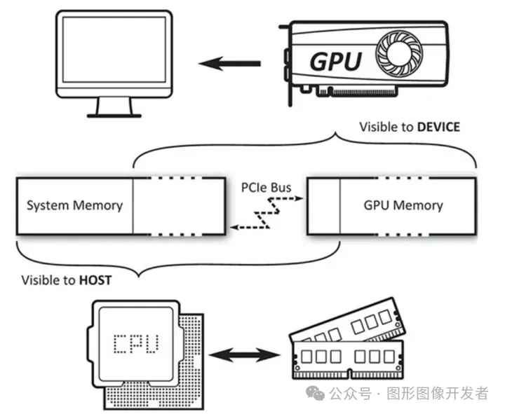

# Vulkan 内存管理

**众所周知，Vulkan 编程的代码量相对于 OpenGL 多了一个数量级（不用害怕，后面Vulkan封装一下，用起来也会非常简洁）**，本文避免一上去就讲一大堆代码，奉行概念先行。

概念掌握的差不多了，再去看代码,  这样思路不容易卡住，大致就可以把握住整体代码逻辑，知道这一块代码是干嘛的，那一块是什么目的。

# Vulkan 内存管理

**Vulkan 将内存管理的工作交给了开发者自己负责**，如何分配释放内存，怎样制定内存策略都由开发者自己决定，当然出了问题也是由开发者自己负责。

Vulkan 将内存划分为两大类：**主机内存 Host Memory 和 设备内存 Device Memory。**

在移动设备上，主机内存就是 CPU 内存，设备内存就是 GPU 内存，显存。在此基础上，每种内存类型还可以单独按照属性进一步划分。

Vulkan提供了一种透明的机制来显示内部内存的细节以及相关属性。这样的做法在OpenGL中是完全不可能的，后者不允许应用程序显示地控制内存区域和布局。

Vulkan 系统中的内存有四种类型（并不是所有设备都支持这四种类型）：

- Host Local Memory，只对 Host 可见的内存，通常称之为普通内存
- Device Local Memory，只对 Device 可见的内存，通常称之为显存
- Host Local Device Memory，由 Host 管理的，对 Device 可见的内存
- Device Local Host Memory，由 Device 管理的，对 Host 可见的内存



对比这两种内存类型的话，主机内存比设备内存更慢，但是宿主机内存的容量通常更大。

**设备内存，它对于物理设备是直接可见的。物理设备可以直接读取其中的内存区块。设备内存与物理设备之间的关系非常紧密，因此它的性能比宿主机内存更高。**

图像对象（VkImage） 、缓存对象（VkBuffer），以及一致变量的缓存对象（Uniform Buffer）都是在设备内存端分配的。

单一的物理设备可能有多种类型的内存；根据它们的堆类型以及属性的不同还可能进一步细分。

函数vkGetPhysicalDeviceMemoryProperties（）负责查询物理设备上可用的内存堆和内存属性。

## VkPhysicalDeviceMemoryProperties

```
1typedef struct VkPhysicalDeviceMemoryProperties {
2    uint32_t        memoryTypeCount;//支持的内存类型数量
3    VkMemoryType    memoryTypes[VK_MAX_MEMORY_TYPES];
4    uint32_t        memoryHeapCount;//支持的内存类型数量
5    VkMemoryHeap    memoryHeaps[VK_MAX_MEMORY_HEAPS];
6} VkPhysicalDeviceMemoryProperties;
```

其中 memoryHeaps 中就是用于获取具体内存堆是哪一种。其中 VkMemoryHeap 定义如下：

## VkMemoryHeap

```
1// 由 VK_VERSION_1_0 提供
2typedef struct VkMemoryHeap {
3    VkDeviceSize         size;//该堆大小。单位为字节。
4    VkMemoryHeapFlags    flags;//该堆类型标志位。
5} VkMemoryHeap;
```

其中 flags 就是用于指示该堆的类型。其有效值定义于 VkMemoryHeapFlagBits 中，如下：

#### VkMemoryHeapFlagBits

```
1typedef enum VkMemoryHeapFlagBits {
2    VK_MEMORY_HEAP_DEVICE_LOCAL_BIT = 0x00000001,// 表示内存堆是设备本地的。这种内存通常是最快的，因为它与 GPU 紧密集成，适合存储需要频繁访问的数据。
3    VK_MEMORY_HEAP_MULTI_INSTANCE_BIT = 0x00000002,//用于多 GPU 配置，表示内存堆在多个物理设备实例中是独立的。
4    VK_MEMORY_HEAP_MULTI_INSTANCE_BIT_KHR = VK_MEMORY_HEAP_MULTI_INSTANCE_BIT,//这是 VK_MEMORY_HEAP_MULTI_INSTANCE_BIT 的一个别名，为了兼容性而定义。KHR 后缀表示这是一个 Khronos 扩展（Khronos 是 Vulkan 标准的管理机构）。
5    VK_MEMORY_HEAP_FLAG_BITS_MAX_ENUM = 0x7FFFFFFF//用于强制枚举类型为 32 位整数。这个值不实际使用，仅作为枚举类型的大小限制。
6} VkMemoryHeapFlagBits;
```

其中每个堆自身可以包含一到多个类型的内存，堆上的内存类型信息被定义在 memoryTypes 中，其 VkMemoryType 定义如下：

## VkMemoryType

```
1typedef struct VkMemoryType {
2VkMemoryPropertyFlags    propertyFlags;//内存类型标志位。
3uint32_t                 heapIndex;//对应的 memoryHeaps 堆索引。
4} VkMemoryType;
```

其中 propertyFlags 有效值被定义在了 VkMemoryPropertyFlagBits 枚举中，其定义如下：

#### VkMemoryPropertyFlagBits（重点关注）

```
1typedef enum VkMemoryPropertyFlagBits {
2VK_MEMORY_PROPERTY_DEVICE_LOCAL_BIT = 0x00000001,
3VK_MEMORY_PROPERTY_HOST_VISIBLE_BIT = 0x00000002,
4VK_MEMORY_PROPERTY_HOST_COHERENT_BIT = 0x00000004,
5VK_MEMORY_PROPERTY_HOST_CACHED_BIT = 0x00000008,
6VK_MEMORY_PROPERTY_LAZILY_ALLOCATED_BIT = 0x00000010,
7} VkMemoryPropertyFlagBits;
```

- VK_MEMORY_PROPERTY_DEVICE_LOCAL_BIT 表示在此内存类型上分配的内存可被物理设备高效访问。只有对应的堆为 VK_MEMORY_HEAP_DEVICE_LOCAL_BIT 才会有该内存类型。
- **VK_MEMORY_PROPERTY_HOST_VISIBLE_BIT** 表示在此内存类型上分配的内存可被 Host 端通过 vkMapMemory() 函数进行映射，进而进行访问。
- **VK_MEMORY_PROPERTY_HOST_COHERENT_BIT** 表示在此内存类型上分配的内存将会自动进行同步，不需要手动调用 vkFlushMappedMemoryRanges() 和 vkInvalidateMappedMemoryRanges() 来进行内存同步。
- VK_MEMORY_PROPERTY_HOST_CACHED_BIT 表示在此内存类型上分配的内存为 缓存 （高速缓存）内存， Host 端访问 非缓存 内存要比访问 缓存 内存慢。但是 非缓存 内存总是 同步内存 ( VK_MEMORY_PROPERTY_HOST_COHERENT_BIT )。
- VK_MEMORY_PROPERTY_LAZILY_ALLOCATED_BIT 表示在此内存类型上分配的内存只有物理设备可访问。内存类型不能同时为 VK_MEMORY_PROPERTY_LAZILY_ALLOCATED_BIT 和 VK_MEMORY_PROPERTY_HOST_VISIBLE_BIT 。此外其底层内存将会用于 惰性内存 。

# 内存分配

**使用 vkAllocateMemory 函数分配的设备内存只能在设备端进行访问，它对于宿主机来说是不可见的。**

**宿主机只能访问那些支持映射的设备内存类型，即内存属性包含了VK_MEMORY_PROPERTY_HOST_VISIBLE_BIT标识量的内存对象。**

通过之前 vkGetPhysicalDeviceMemoryProperties() 函数我们可以获取到设备的内存信息，现在我们就可以通过这些信息进行内存分配了。

为此 Vulkan 为我们提供了 vkAllocateMemory() 函数进行内存分配。该函数定义如下：

#### vkAllocateMemory

```
1VkResult vkAllocateMemory(
2    VkDevice                                    device,
3    const VkMemoryAllocateInfo*                 pAllocateInfo,
4    const VkAllocationCallbacks*                pAllocator,
5    VkDeviceMemory*                             pMemory);
```

其中主要的内存分配信息被定义在了 pAllocateInfo ，对应的 VkMemoryAllocateInfo 定义如下：

#### VkMemoryAllocateInfo

```
1typedef struct VkMemoryAllocateInfo {
2    VkStructureType    sType;//必须 是 VkStructureType::VK_STRUCTURE_TYPE_MEMORY_ALLOCATE_INFO 。
3    const void*        pNext;
4    VkDeviceSize       allocationSize;//要分配的内存大小。单位为 字节 。
5    uint32_t           memoryTypeIndex;//分配内存的目标内存类型索引。
6} VkMemoryAllocateInfo;
```

其中 memoryTypeIndex 尤为重要，用于指定在 memoryTypes[memoryTypeIndex] 对应的内存类型上进行内存分配，对应分配的堆为 memoryHeaps[memoryTypes[memoryTypeIndex].heapIndex] 。

由于每个 memoryTypes 都有着不同的属性，所以一般会根据功能需求在某个内存类型上进行分配。

```
 1VkDevice device; 
 2VkPhysicalDevice physicalDevice;
 3VkDeviceSize size = 1024;
 4VkDeviceMemory* memory = nullptr;
 5
 6// 获取物理设备内存属性
 7vkGetPhysicalDeviceMemoryProperties(physicalDevice, &memoryProperties);
 8
 9// 查找一个主机可见的内存类型
10uint32_t memoryTypeIndex = VK_MAX_MEMORY_TYPES;
11for (uint32_t i = 0; i < memoryProperties.memoryTypeCount; i++) {
12    if ((memoryProperties.memoryTypes[i].propertyFlags & VK_MEMORY_PROPERTY_HOST_VISIBLE_BIT) &&
13        (memoryProperties.memoryTypes[i].propertyFlags & VK_MEMORY_PROPERTY_HOST_COHERENT_BIT)) {
14        memoryTypeIndex = i;
15        break;
16    }
17}
18
19if (memoryTypeIndex == VK_MAX_MEMORY_TYPES) {
20    fprintf(stderr, "Could not find a suitable memory type!\n");
21    exit(EXIT_FAILURE);
22}
23
24// 准备内存分配信息
25VkMemoryAllocateInfo allocInfo = {};
26allocInfo.sType = VK_STRUCTURE_TYPE_MEMORY_ALLOCATE_INFO;
27allocInfo.allocationSize = size;
28allocInfo.memoryTypeIndex = memoryTypeIndex;
29
30// 分配内存
31VK_CHECK_RESULT(vkAllocateMemory(device, &allocInfo, nullptr, memory));
32
33printf("Memory allocated successfully!\n");
```

# 内存映射

**我们通过API函数 vkMapMemory 来实现宿主机对设备内存的映射访问。这个函数会返回一个虚拟地址的指针，指向映射后的设备内存区域。**

如果内存分配时指定的内存类型支持 VkMemoryPropertyFlagBits::VK_MEMORY_PROPERTY_HOST_VISIBLE_BIT 的话，说明该内存可映射 。

**原则上所有的设备内存对于 CPU 来说并不像 new/malloc 分配出来的内存那样能够直接进行读写。**

为了 CPU 能够读写设备内存，硬件供应商都会提供一部分带有 VkMemoryPropertyFlagBits::VK_MEMORY_PROPERTY_HOST_VISIBLE_BIT 属性的内存用于 CPU 访问。

而在 Vulkan 中分配的内存最终只会对应一个 VkDeviceMemory 句柄，为了能够获得VkMemoryPropertyFlagBits::VK_MEMORY_PROPERTY_HOST_VISIBLE_BIT 内存类型分配的内存句柄底层的内存地址，可以通过 vkMapMemory() 函数将分配的设备内存底层的 虚拟 （说明见下文）地址返回给 CPU （也就是 Host 端）。

#### vkMapMemory

```
1VkResult vkMapMemory(
2    VkDevice                                    device,
3    VkDeviceMemory                              memory,//要映射的目标内存
4    VkDeviceSize                                offset,//从内存首地址开始的偏移量。从 0 开始,单位为 字节 。
5    VkDeviceSize                                size,//要映射的内存大小。单位为 字节 。
6    VkMemoryMapFlags                            flags,
7    void**                                      ppData//内存映射结果。为 void* 的指针。
8);
```

其中 memory 必须 在 VkMemoryPropertyFlagBits::VK_MEMORY_PROPERTY_HOST_VISIBLE_BIT 类型的内存上分配。

**当该函数成功返回后， memory 就被认为在Host 端进行了内存映射 ，并处于映射态 。**

**当内存映射并使用结束后，可进行解除映射，进而释放系统的虚拟内存。可通过 vkUnmapMemory() 函数将映射过的内存进行解映射 。**

内存映射代码示例：

```
 1// 映射内存
 2void* data;
 3VK_CHECK_RESULT(vkMapMemory(device, *memory, 0, size, 0, &data));
 4printf("Memory mapped successfully!\n");
 5
 6// 写入数据到内存
 7int* intData = (int*)data;
 8for (size_t i = 0; i < size / sizeof(int); i++) {
 9    intData[i] = i;
10}
11printf("Data written to memory successfully!\n");
12
13// 解除内存映射
14vkUnmapMemory(device, *memory);
15printf("Memory unmapped successfully!\n");
```

# 内存同步

所谓内存同步是指：**虚拟内存中的数据与对应的 VkDeviceMemory 设备内存底层数据保持一致。**

当分配的设备内存所对应的内存类型 包含 VkMemoryPropertyFlagBits::VK_MEMORY_PROPERTY_HOST_COHERENT_BIT 时，内存同步将会自动进行。

其同步规则如下：

- **当向映射的虚拟内存中写入时，写入虚拟内存中的数据也会同步到对应的 VkDeviceMemory 底层设备内存中。**
- **如果 GPU 向 VkDeviceMemory 底层设备内存中写入数据时，这部分修改的设备内存也会同步到映射的虚拟内存中。**

如果分配的设备内存所对应的内存类型 不包含 VkMemoryPropertyFlagBits::VK_MEMORY_PROPERTY_HOST_COHERENT_BIT 的话，内存同步将不会自动进行，需要手动进行内存同步。

换句话说就是，映射的虚拟内存和对应的 VkDeviceMemory 设备内存是两个独立的内存，如果分配的设备内存 包含 VkMemoryPropertyFlagBits::VK_MEMORY_PROPERTY_HOST_COHERENT_BIT 则无论对虚拟内存做修改，还是对设备内存做修改，双方数据将会自动保持一致。否则需要手动进行内存同步。

#### 虚拟内存同步到设备内存

当对映射的虚拟内存中的数据修改时，如果设备内存类型 不包含 VkMemoryPropertyFlagBits::VK_MEMORY_PROPERTY_HOST_COHERENT_BIT 的话，则需要通过调用 vkFlushMappedMemoryRanges() 函数手动将虚拟内存中的数据同步（拷贝）到设备内存中。也就是将虚拟内存中的内容 冲刷 到设备内存中。其定义如下：

##### vkFlushMappedMemoryRanges

```
1VkResult vkFlushMappedMemoryRanges(
2    VkDevice                                    device,
3    uint32_t                                    memoryRangeCount,//指定 pMemoryRanges 数组长度
4    const VkMappedMemoryRange*                  pMemoryRanges);//指向 VkMappedMemoryRange 数组。用于配置虚拟内存到设备内存的同步。
```

#### 设备内存同步到虚拟内存

当对设备内存数据修改时，如果设备内存类型 不包含 VkMemoryPropertyFlagBits::VK_MEMORY_PROPERTY_HOST_COHERENT_BIT 的话，则需要通过调用 vkInvalidateMappedMemoryRanges() 函数手动将设备内存中的数据同步（拷贝）到虚拟内存中。也就是 放弃 当前虚拟内存中的内容。


**设备内存数据修改**

对于设备内存数据的修改一般都是通过执行 GPU 的指令将数据写入到设备内存中，详细说明将会在之后的章节进行讲解。

##### vkInvalidateMappedMemoryRanges

```
1VkResult vkInvalidateMappedMemoryRanges(
2    VkDevice                                    device,
3    uint32_t                                    memoryRangeCount,
4    const VkMappedMemoryRange*                  pMemoryRanges
5);
```

其中 VkMappedMemoryRange 定义如下：

#### VkMappedMemoryRange

```
1typedef struct VkMappedMemoryRange {
2    VkStructureType    sType;//必须 是 VkStructureType::VK_STRUCTURE_TYPE_MAPPED_MEMORY_RANGE 。
3    const void*        pNext;
4    VkDeviceMemory     memory;//同步的目标设备内存。
5    VkDeviceSize       offset;//要同步的目标设备内存的偏移。单位为 字节 。
6    VkDeviceSize       size;//要同步的目标设备内存的大小。单位为 字节 。
7} VkMappedMemoryRange;
```

其中 VkMappedMemoryRange::memory 在手动同步时必须处在映射态 。

也就是 VkMappedMemoryRange::memory 必须已经通过 vkMapMemory() 将设备内存进行映射，并且没有解映射 。当内存同步结束之后，就可以进行解映射了。

# 内存释放

当内存成功分配之后，一般会对该内存进行一些列写入和读取操作，当该内存不再被需要时，就可以将该内存通过调用 vkFreeMemory() 进行回收了。

#### vkFreeMemory

```
1void vkFreeMemory(
2VkDevice                                    device,
3VkDeviceMemory                              memory,
4const VkAllocationCallbacks*                pAllocator)
5;
```

# 参考

- https://zhuanlan.zhihu.com/p/166387973
- [https://mp.weixin.qq.com/s/wCqRYpOBWbJSQqncqgXhBA](https://mp.weixin.qq.com/s?__biz=MzIwNTIwMzAzNg==&mid=2654173984&idx=1&sn=59593877466c3f1d267b7e9751c741d5&scene=21#wechat_redirect)
- 《Vulkan学习指南》 — [新加坡] 帕敏德·辛格（Parminder Singh）