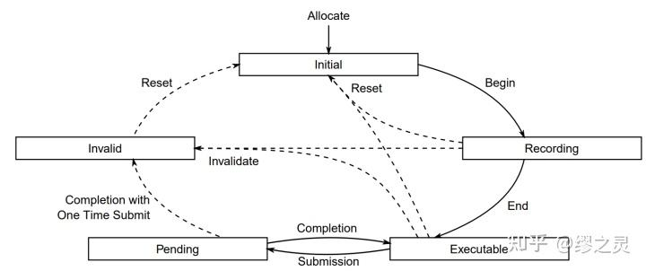

# 从零开始的Vulkan（二）:交换链与命令缓冲区

## 一切为了渲染：[交换链](https://zhida.zhihu.com/search?content_id=207143516&content_type=Article&match_order=1&q=交换链&zhida_source=entity)的创建

在此，我们将完成以下三件事：

1. 为Win32平台上的Vulkan应用创建一个前置对象表面（Surface）。
2. 创建一个符合我们需求的用于渲染和呈递图像的交换链。
3. 创建交换链图像视图，它将用于对应我们在交换链上设置的图像。

### 前置对象表面surface

一般情况，不同平台开发的应用程序都有其各自的执行逻辑，例如在Win32下，一个窗口程序的创建和运行就需要窗口进程，[窗口句柄](https://zhida.zhihu.com/search?content_id=207143516&content_type=Article&match_order=1&q=窗口句柄&zhida_source=entity)，实例句柄和各种消息循环。为了标记一个Win32程序，我们需要得到对应的hWnd和hInstance，然后就可以将Vulkan和Win32程序系绑在一起。

以下宏确保了Vulkan对于Win32平台的正确识别：

```cpp
#define VK_USE_PLATFORM_WIN32_KHR
```

Khronos为了实现跨平台的目标，为不同平台创造了一个统一的抽象层，名为surface，它是将Vulkan和具体设备显示连接起来的一个桥梁，这里我展示了在win32平台下创建surface的方法，其它平台也是类似的。

```cpp
const auto surfaceInfo = vk::Win32SurfaceCreateInfoKHR()
		.setHwnd(hWnd)
		.setHinstance(hInstance);
if (vkInfo.instance.createWin32SurfaceKHR(&surfaceInfo, 0, &vkInfo.surface) != vk::Result::eSuccess) {
	//Error
}
```

得到surface之后，我们需要获取相关信息，方便接下来交换链的创建：

```cpp
//查询surface支持的格式
uint32_t formatCount = 0;
vkInfo.gpu.getSurfaceFormatsKHR(vkInfo.surface, &formatCount, static_cast<vk::SurfaceFormatKHR*>(nullptr));
if (formatCount == 0) {
	//Error
}
std::vector<vk::SurfaceFormatKHR> surfaceFormats(formatCount);
vkInfo.gpu.getSurfaceFormatsKHR(vkInfo.surface, &formatCount, surfaceFormats.data());

//查询surface支持的呈递渲染图像模式
uint32_t presentModeCount = 0;
vkInfo.gpu.getSurfacePresentModesKHR(vkInfo.surface, &presentModeCount, static_cast<vk::PresentModeKHR*>(nullptr));
if (presentModeCount == 0) {
	//Error
}
std::vector<vk::PresentModeKHR> presentModes(presentModeCount);
vkInfo.gpu.getSurfacePresentModesKHR(vkInfo.surface, &presentModeCount, presentModes.data());

//获得surface的相关参数信息
vk::SurfaceCapabilitiesKHR surfaceCapabilities;
vkInfo.gpu.getSurfaceCapabilitiesKHR(vkInfo.surface, &surfaceCapabilities);
```

之后我们需要找到该surface下用于呈递渲染图像的图形队列族，使用VkPhysicalDevice的getSurfaceSupportKHR方法来实现，这里的做法类似第一节中找到图形队列族的方法：

```cpp
std::vector<vk::Bool32> supportPresents(queueFamilyCount);
for (size_t i = 0; i < queueFamilyCount; i++)
	vkInfo.gpu.getSurfaceSupportKHR(i, vkInfo.surface, &supportPresents[i])

bool found = false;
for (size_t i = 0; i < queueFamilyCount; i++) {
	if (vkInfo.queueProp[i].queueFlags & vk::QueueFlagBits::eGraphics) {
		if (supportPresents[i] == VK_TRUE) {
			vkInfo.graphicsQueueFamilyIndex = i;
			found = true;
			break;
		}
	}
}
if (!found)
	//Cannot find queue family
```

大部分情况下，呈递队列和图形队列会是同一个（不排除会有特殊情况，需要将它们分开），这个队列将会用于我们后续记录和提交命令，用以下方法从逻辑设备中获取这个队列。

```cpp
vkInfo.device.getQueue(vkInfo.graphicsQueueFamilyIndex, 0, &vkInfo.queue);
```

### 创建交换链

终于到了踏入渲染领域的时候了，接下来我们的工作就是填满一个庞大的结构体VkSwapchainCreateInfoKHR并藉此创建Swapchain：

```cpp
auto swapchainInfo = vk::SwapchainCreateInfoKHR()
		.setSurface(vkInfo.surface)
		.setImageFormat(vkInfo.format)
		.setMinImageCount(vkInfo.frameCount)
		.setImageExtent(vk::Extent2D(vkInfo.width, vkInfo.height))
		.setPreTransform(surfaceCapabilities.currentTransform)
		.setPresentMode(vk::PresentModeKHR::eFifo)
		.setImageSharingMode(vk::SharingMode::eExclusive)
		.setCompositeAlpha(vk::CompositeAlphaFlagBitsKHR::eOpaque)
		.setImageColorSpace(surfaceFormats[0].colorSpace)
		.setImageUsage(vk::ImageUsageFlagBits::eColorAttachment)
		.setImageArrayLayers(1)
		.setClipped(true);
```

一些必要的交换链信息都会在这里被填上，下面我将一个个解释这边每个参量的意思。

- setSurface指向了刚刚创建的前置对象表面surface，将surface和交换链绑在一起。
- setPresentMode指明了交换链上图像的呈递模式，这里我选择fifo模式，即通常意义上的[垂直同步](https://zhida.zhihu.com/search?content_id=207143516&content_type=Article&match_order=1&q=垂直同步&zhida_source=entity)，选择的呈递模式必须被surface所支持。
- setImageFormat指明了交换链上的渲染图像保存的格式，对于大部分的SRGB显示屏，我们选择32位UnormRGBA格式，选择错误或surface不支持的格式会导致显示屏上的画面和色彩错误：

```cpp
vkInfo.format = vk::Format::eR8G8B8A8Unorm;
```

- setMinImageCount指明了交换链中用与交换的图像个数，如果presentMode是SharedContinuousRefresh或SharedDemandRefresh，则必须设为1，否则必须大于等于surface支持的最小图像个数，这里直接设置相等：

```cpp
vkInfo.frameCount = surfaceCapabilities.minImageCount;
```

- setImageExtent指明了用于渲染的图像的宽高属性，必须在surface支持的minImageExtent和maxImageExtent之间，一般直接指定surfaceCapabilities.currentExtent。
- setPreTransform指明了图像的预变换，与surface的变换保持一致，一般为默认（即无变换）。
- setImageSharingMode指明了交换链上图像和队列的从属模式，若图像队列和呈递队列为相同队列，则填入exclusive，若不相同，则填入concurrent模式。
- setCompositeAlpha指明了图像的Alpha通道将如何处置，这里我不想要渲染出的图像具有透明属性，所以填入opaque，除了这个选项以外还有inherit（继承），PostMultiplied（后乘法），PreMultiplied（前乘法）。
- setImageColorSpace指明了图像的色彩空间，这里与surface保持一致，通常是SRGB[非线性空间](https://zhida.zhihu.com/search?content_id=207143516&content_type=Article&match_order=1&q=非线性空间&zhida_source=entity)。
- setImageUsage指明了交换链上图像的使用方式，这里当然是作颜色附件（ColorAttachment），不同的Attachment将在后文提到。
- setImageArrayLayers指明了每个图像所包含的层次，通常来说它的值为1，但对于VR相关的应用程序来说，会使用更多的层次，但这里我们不会提及。
- setClipped指明了是否开启剔除，开启后表示不关心图像中被遮挡的像素，这会让程序得到一些优化，但可能会影响像素的回读。

之后，我们终于可以将交换链创建出来了：

```cpp
if (vkInfo.device.createSwapchainKHR(&swapchainInfo, 0, &vkInfo.swapchain) != vk::Result::eSuccess) {
	//Error
}
```

### 交换链图像视图Swapchain Image View

在创建交换链的同时，我们也创建了交换链上的图像，这些图像将在被渲染之后由交换链不断地向显示器循环呈递。图像资源在Vulkan中以VkImage的形式存在，但若要让这些图像资源可以被GPU访问，我们必须为其创建对应的**图像视图（Image View）**来规定图像资源具体的用法，简单来说就是一个图像对应一个图像视图，因此接下来我们必须创建交换链图像视图。

用以下方法从交换链中获取对应图像：

```cpp
vkInfo.swapchainImages.resize(vkInfo.frameCount);
vkInfo.device.getSwapchainImagesKHR(vkInfo.swapchain, &vkInfo.frameCount, vkInfo.swapchainImages.data());
```

接着为交换链上的每一个图像创建一个图像视图：

```cpp
vkInfo.swapchainImageViews.resize(vkInfo.frameCount);

for (size_t i = 0; i < vkInfo.frameCount; i++) {
	auto createInfo = vk::ImageViewCreateInfo()
		.setViewType(vk::ImageViewType::e2D)
		.setSubresourceRange(vk::ImageSubresourceRange(vk::ImageAspectFlagBits::eColor, 0, 1, 0, 1))
		.setFormat(vkInfo.format)
		.setImage(vkInfo.swapchainImages[i])
		.setComponents(vk::ComponentMapping(vk::ComponentSwizzle::eIdentity, vk::ComponentSwizzle::eIdentity, vk::ComponentSwizzle::eIdentity, vk::ComponentSwizzle::eIdentity));
	if (vkInfo.device.createImageView(&createInfo, 0, &vkInfo.swapchainImageViews[i]) != vk::Result::eSuccess) {
		//Error
	}
}
```

VkImageViewCreateInfo难理解的部分并不多，接下来就稍作讲解：

- setViewType指明了图像的种类，有2D贴图，3D贴图，贴图数组，正方体贴图，正方体贴图数组等，这里只需简单的2D贴图。
- setFormat指明了图像的格式，这里需要与交换链的图像格式相同。
- setImage指明了图像视图对应图像，这里填之前获取的交换链图像。
- setComponents指明了图像的四个[色彩通道](https://zhida.zhihu.com/search?content_id=207143516&content_type=Article&match_order=1&q=色彩通道&zhida_source=entity)的映射方式，这里只需让它们的映射方式与原来保持一致，这里填错虽不会对画面有什么影响，但会让验证层疯狂报错。
- setSubresourceRange指明了访问图像时的子资源范围，它的定义如下：

```cpp
typedef struct VkImageSubresourceRange {
    VkImageAspectFlags    aspectMask;
    uint32_t              baseMipLevel;
    uint32_t              levelCount;
    uint32_t              baseArrayLayer;
    uint32_t              layerCount;
} VkImageSubresourceRange;
```

aspectMask位掩码指定视图中包含图像的哪些方面，包括颜色，深度，模板等，这里指明为颜色。后面的baseMipLevel和levelCount指明了对图像Mipmap的访问范围，baseArrayLayer和layerCount指明了对贴图数组的读写范围，在这里既没有Mipmap也没有贴图数组，所以都是（0，1）即可。

### 提交交换链

在渲染的最后，我们需要用以下方法去提交交换链，之后就可以在显示器上显示出图像：

```cpp
auto presentInfo = vk::PresentInfoKHR()
		.setPImageIndices(&currentImage)
		.setSwapchainCount(1)
		.setPSwapchains(&vkInfo.swapchain);

if (vkInfo.queue.presentKHR(&presentInfo) != vk::Result::eSuccess) {
	//Error
}
```

ImageIndices指定了提交交换链上的哪一个图像，在实际使用时我们需要将交换链上的帧缓冲循环提交，以实现**多重缓冲**技术。

到此，我们的帧缓冲图像视图已经全部创建完毕，关于交换链的事也告一段落。

## 从CPU走向GPU：命令缓冲区

现在，我们必须想办法去控制GPU做一些事情了，用术语来讲，便是向GPU提交**命令**，这样的命令有很多种，有的负责让GPU去绘制，查询，清除，转移，有的负责让GPU担当起状态管理的功用，有的则充当GPU和CPU间的[同步助手](https://zhida.zhihu.com/search?content_id=207143516&content_type=Article&match_order=1&q=同步助手&zhida_source=entity)，这些命令在渲染时缺一不可，会全部用到。但目前，我们需要一个存储命令的区域，这便是**命令缓冲区（Command Buffer）**，命令缓冲区是若干命令的集合，它会被提交给适当的硬件队列（Queue）供 GPU 进行处理。

### 创建命令池和分配命令缓冲区

首先，我们使用VkCreateCommandPool()函数创建命令池。通过填写VkCommandPoolCreateInfo结构体来指导要从这个缓冲池中分配的命令缓冲区的相关特性，同时它还可以指明这个命令缓冲区属于哪个队列族，具体实现如下：

```cpp
vk::CommandPoolCreateInfo commandPoolInfo;
commandPoolInfo.setQueueFamilyIndex(vkInfo.graphicsQueueFamilyIndex);
commandPoolInfo.setFlags(vk::CommandPoolCreateFlagBits::eResetCommandBuffer);
if (vkInfo.device.createCommandPool(&commandPoolInfo, 0, &vkInfo.cmdPool) != vk::Result::eSuccess) {
	//Error
}
```

VkCommandPoolFlag用于指示命令池的使用情况以及从中分配命令缓冲区的行为：ResetCommandBuffer表示从这个池中分配的命令缓冲区可以通过VkResetCommandBuffer显式重置或VkBeginCommandBuffer隐式重置，而若不设置该标志，则命令缓冲区只能通过重置命令池的方式进行重置；transient标志则表示从该池分配的命令缓冲区会被经常更改并且寿命较短，这意味着缓冲区会在相对较短的时间内被重置或释放。

有了命令池之后，便可以轻易地从命令池中分配命令缓冲区：

```cpp
vkInfo.cmd.resize(vkInfo.frameCount);
vk::CommandBufferAllocateInfo cmdBufferAlloc;
cmdBufferAlloc.setCommandPool(vkInfo.cmdPool);
cmdBufferAlloc.setLevel(vk::CommandBufferLevel::ePrimary);
cmdBufferAlloc.setCommandBufferCount(vkInfo.frameCount);
if (vkInfo.device.allocateCommandBuffers(&cmdBufferAlloc, vkInfo.cmd.data()) != vk::Result::eSuccess) {
	//Error
}
```

值得一提的是，这里分配了和帧缓冲数量相同的命令缓冲区，目的便是为了让一个命令缓冲区处理一个帧缓冲，避免造成冲突。setLevel指明了该命令缓冲区是处于主级还是次级，这里我们只需要让它处于主级。

> 主级命令缓冲区可以直接被提交给队列进行执行，而次级命令缓冲区不能直接提交给队列，必须通过主级命令缓冲区来间接执行。每个命令缓冲区之间的执行都是**互相独立**的，不存在主级和次级之间的继承关系，但它们所处的的生命周期会进行绑定，通过释放主级命令缓冲区可以解除该绑定。
> 位于不同命令缓冲区之中的命令的执行顺序是任意且不可知的，想要对它们进行排序，则需要**同步命令**，在之后我们会更详细的用到同步相关的内容。

用以下方法重置命令池（同时重置分配的命令缓冲区）：

```cpp
VkResult vkResetCommandPool(VkDevice device, VkCommandPool commandPool, VkCommandPoolResetFlags flags);
```

ResetReleaseResources标志会使重置命令池时回收命令池中的所有资源。

命令池同样也有对应的Destroy函数，别忘记了。

### 命令缓冲区行为

根据VkSpec的描述，每一个命令缓冲区将会拥有以下的生命周期：

1. 起始状态，命令缓冲区刚被分配或重置时就是这个状态，在这个状态下命令缓冲区可以转向记录状态或用vkFreeCommandBuffers方法释放。
2. 记录状态，vkBeginCommandBuffer方法开始了这个状态，在这个状态下，vkCmd*命令将被记录在命令缓冲区中。
3. 可执行状态，vkEndCommandBuffer方法结束了命令的记录，在这个状态下，命令缓冲区可以被提交，重置或记录到另一个命令缓冲区内。
4. 待定状态，命令缓冲区被提交到队列中会使它处于这个状态。在这个状态下，设备正在处理该命令缓冲区，因此不可以尝试任何试图改变该命令缓冲区的方法。此状态结束后，命令缓冲区将恢复到可执行状态，但UsageOnceTimeSubmit标志会使命令缓冲区转向不可用状态。同步命令必须被用于侦测该状态。
5. 不可用状态，一些操作（例如删除或修改命令缓冲区被命令使用的资源）会使命令缓冲区转向这个状态。在这个状态下，命令缓冲区只能被重置或释放。



命令缓冲区的生命周期

以下代码演示了如何完成记录命令到命令缓冲区中：

```cpp
auto cmdBeginInfo = vk::CommandBufferBeginInfo()
			.setFlags(vk::CommandBufferUsageFlagBits::eOneTimeSubmit);

vkInfo.cmd[currentBuffer].begin(&cmdBeginInfo);

//用vkCmd*函数记录命令

vkInfo.cmd[currentBuffer].end();
```

- OneTimeSubmit标志指明命令缓冲区中记录的命令只会被提交一次，且在两次提交之间会被重置和重新记录
- RenderPassContinue标志次级命令缓冲区是完全包含在一个渲染过程（RenderPass）中的，该标志对主级缓冲区无效。
- SimultaneousUse标志指明命令缓冲区在待定阶段中可以被重复提交，且可以被记录到多个主级命令缓冲区中。

以下代码演示了如何提交命令缓冲区到队列中：

```cpp
vk::PipelineStageFlags dstStageMask[] = {
	vk::PipelineStageFlagBits::eBottomOfPipe
};

vkInfo.device.resetFences(1, &vkInfo.fence);

auto submitInfo = vk::SubmitInfo()
	.setCommandBufferCount(1)
	.setPCommandBuffers(&vkInfo.cmd[currentBuffer])
	.setWaitSemaphoreCount(1)
	.setPWaitSemaphores(&vkInfo.imageAcquiredSemaphore)
	.setPWaitDstStageMask(dstStageMask);
vkInfo.queue.submit(1, &submitInfo, vkInfo.fence);
```

这里用到了Vulkan中特有的Fence和Semaphore功能实现了提交命令缓冲区的同步，关于它们的详细解释会在同步一节中说明。dstStageMask是一个用于标记管线阶段的掩码，在之后讲解图形管线时会再次提到。

在queue.submit函数中有一个类型为vk::ArrayProxy的参数，它是一个作用方式类似于数组的模板类，作用与（count， pointer）相同，我一般用后者这样的写法。

Vulkan1.3中提供了一个新的方法来实现提交，这里不再过多赘述：

```cpp
// Provided by VK_VERSION_1_3
typedef struct VkSubmitInfo2 {
  VkStructureType sType;
  const void* pNext;
  VkSubmitFlags flags;
  uint32_t waitSemaphoreInfoCount;
  const VkSemaphoreSubmitInfo* pWaitSemaphoreInfos;
  uint32_t commandBufferInfoCount;
  const VkCommandBufferSubmitInfo* pCommandBufferInfos;
  uint32_t signalSemaphoreInfoCount;
  const VkSemaphoreSubmitInfo* pSignalSemaphoreInfos;
} VkSubmitInfo2;

// Provided by VK_VERSION_1_3
VkResult vkQueueSubmit2(
  VkQueue queue,
  uint32_t submitCount,
  const VkSubmitInfo2* pSubmits,
  VkFence fence);
```

在完成命令缓冲区的使用后，可以用以下方法释放命令缓冲区：

```cpp
vkInfo.device.freeCommandBuffers(vkInfo.cmdPool, 1, &vkInfo.cmd[currentBuffer]);
```

### 次级命令缓冲区

由于次级命令缓冲区无法直接被提交到队列中，所以必须用以下方法将其绑定到主级命令缓冲区：

```cpp
vkInfo.cmd[currentBuffer].executeCommands(1, &secondaryCmd);
```

VkSpec中指出填写VkCommandBufferInheritanceRenderingInfo（Vulkan1.3）并使用VkCommandBufferInheritanceRenderingInfoKHR方法可以实现次级命令缓冲区对于主级命令缓冲区的继承，大致了解即可，这里不会过多赘述：

```cpp
// Provided by VK_VERSION_1_0
typedef struct VkCommandBufferInheritanceInfo {
  VkStructureType sType;
  const void* pNext;
  VkRenderPass renderPass;
  uint32_t subpass;
  VkFramebuffer framebuffer;
  VkBool32 occlusionQueryEnable;
  VkQueryControlFlags queryFlags;
  VkQueryPipelineStatisticFlags pipelineStatistics;
} VkCommandBufferInheritanceInfo;

// Provided by VK_VERSION_1_3
typedef struct VkCommandBufferInheritanceRenderingInfo {
  VkStructureType sType;
  const void* pNext;
  VkRenderingFlags flags;
  uint32_t viewMask;
  uint32_t colorAttachmentCount;
  const VkFormat* pColorAttachmentFormats;
  VkFormat depthAttachmentFormat;
  VkFormat stencilAttachmentFormat;
  VkSampleCountFlagBits rasterizationSamples;
} VkCommandBufferInheritanceRenderingInfo;
```

### 设备掩码

我们可以通过给命令缓冲区设置设备掩码的方式来决定随后的命令将允许在哪一个物理设备（GPU）上，它可以直接在vkBeginCommandBuffer指定，也可以单独用命令指定。

用vkBeginCommandBuffer方法指定：

```cpp
auto deviceMask = vk::DeviceGroupCommandBufferBeginInfo().setDeviceMask(0);
auto cmdBeginInfo = vk::CommandBufferBeginInfo()
			.setPNext(&deviceMask)
			.setFlags(vk::CommandBufferUsageFlagBits::eOneTimeSubmit);
vkInfo.cmd[currentBuffer].begin(&cmdBeginInfo);
```

用命令指定：

```cpp
vkInfo.cmd[currentBuffer].setDeviceMask(1);
```

设备掩码主要是用来给不同的物理设备分派不同的任务，从而提高运行效率，具体关于设备掩码的使用方法可以查阅VkSpec。

至此，我们已经了解了命令缓冲区的基本用法，之后我们就可以在绘制时更加如鱼得水地使用它了。

