# Vulkan 从入门到精通

**OpenGL特点和设计哲学**

作为一个超过25年的开放API接口，OpenGL功能相当成熟，能满足各种大中小型二三维程序的开发，并支持从网页、手机到笔记本以及[图形工作站](https://zhida.zhihu.com/search?content_id=192311255&content_type=Article&match_order=1&q=图形工作站&zhida_source=entity)等各种硬件设备。

1. **[状态机](https://zhida.zhihu.com/search?content_id=192311255&content_type=Article&match_order=1&q=状态机&zhida_source=entity)和OpenGL上下文** - 谈及OpenGL很多人都能想到一个***状态\***。 比如用glEnable打开一个状态，在以后的绘图中将一直保留并应用这个状态，除非你调用 glDisable 及同类函数来改变该状态。这是一个优点也是一个缺点。优点体现在设置完状态就不需要再次设置，即可保持此状态，方便好用；作为缺点，意味着在OpenGL框架内部存在一个[状态管理机制](https://zhida.zhihu.com/search?content_id=192311255&content_type=Article&match_order=1&q=状态管理机制&zhida_source=entity)且此状态上下文必须是以单例形态出现。对于程序来说，渲染过程难以以多线程方式展开。
2. **API包办一切** - OpenGL的另外一个特点是API内部承担检验输入参数合法性工作，如果参数不合法则直接返回。 这种设计哲学对用户来说容易上手，简单好用，即使调用函数方式错误，也不会导致程序退出；第二个包办一切体现在 - 不论是纹理数据的加载， 早期对光照等对象的处理，都是通过一组API来处理的。可以使用几个API[开发程序](https://zhida.zhihu.com/search?content_id=192311255&content_type=Article&match_order=1&q=开发程序&zhida_source=entity)，但是其执行效率较低、显示效果较差或难以完成一些超过OpenGL[渲染机制](https://zhida.zhihu.com/search?content_id=192311255&content_type=Article&match_order=1&q=渲染机制&zhida_source=entity)的效果；对高阶用户来说可操控性变差，OpenGL渲染过程通常需要干预其中某些环节。固定[渲染管线](https://zhida.zhihu.com/search?content_id=192311255&content_type=Article&match_order=1&q=渲染管线&zhida_source=entity)的OpenGL无需用户去定义[顶点渲染](https://zhida.zhihu.com/search?content_id=192311255&content_type=Article&match_order=1&q=顶点渲染&zhida_source=entity)和像素渲染的具体逻辑，只需要开发者在程序中设置渲染所需参数并打开或关闭特定开关。高版本的[可编程渲染管线](https://zhida.zhihu.com/search?content_id=192311255&content_type=Article&match_order=1&q=可编程渲染管线&zhida_source=entity)须由开发者自行实现渲染流程，否则无法绘制出最终的画面。开发者可以根据自己的具体需要来编写顶点渲染和像素渲染中的具体逻辑，可最大程度的简化渲染管线的逻辑以提高渲染效率，也可自己实现特定的算法和逻辑来渲染出固定管线无法渲染的效果。下图是OpenGL ES2 渲染流程如下


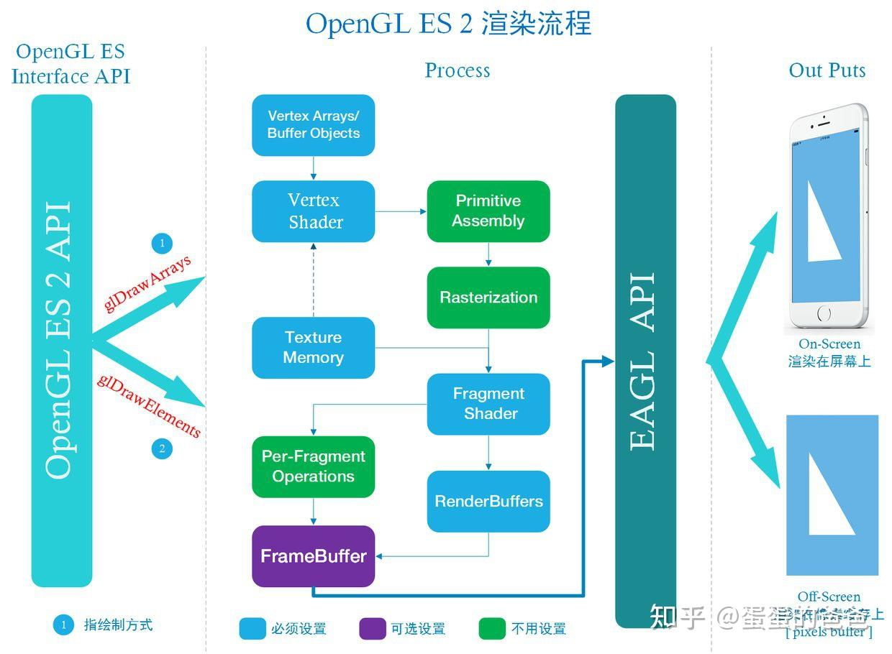

现代流水管线较早期固定管线的OpenGL来说，需要程序本身显式指定的设置参数较多，上手相对难了一些。但是可以实现之前固定管线中难以渲染出的效果，同时渲染效果也有提升。大体上讲高版本的OpenGL比低版本的OpenGL需要设置的参数更多，对OpenGL的控制力度更细一些。

------

**Vulkan简介**


Vulkan脱胎于Mantle；2013年，AMD开发了Mantle。他是面向3D游戏的新一代图形渲染 API， 可以让开发人员直接操作GPU硬件底层，从而提高硬件利用率和游戏性能，效果显著。微软参考AMD Mantle的思路开发了DirectX 12， 苹果则提出了Metal。 但是因为AMD行业影响力和领导力不足， Mantle并没有成为全行业的标准。2015年，AMD宣布不在维护Mantle，Mantle功成身退。Khronos接过AMD手中的接力棒，在Mantle的基础上推出了Vulkan。他提供高性能和低CPU管理负担，这也是D3D12和AMD的Mantle的目标。Vulkan旨在提供更低的CPU开销与更直接的GPU控制，其理念大致与Direct3D 12和Mantle类似。

Vulkan是全新的API设计，没有历史包袱，可以完全按照现代图形[架构设计](https://zhida.zhihu.com/search?content_id=192311255&content_type=Article&match_order=1&q=架构设计&zhida_source=entity)，提供更为精细的API给开发者，支持以多线程并行创建和提交指令，同时使用标准化的着色器字节码，提供统一图形和计算功能。借助Vulkan，可以尽可能的发挥现在GPU多核多线程潜能。

Vulkan的开发者来自图形领域的各行各业，有GPU厂商，有系统厂商，有[游戏引擎](https://zhida.zhihu.com/search?content_id=192311255&content_type=Article&match_order=1&q=游戏引擎&zhida_source=entity)厂商


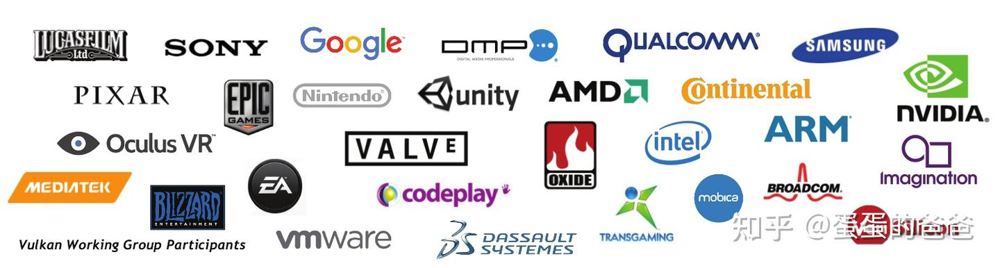

------

**Vulkan哲学**

如果 OpenGL 是图形学中的[脚本语言](https://zhida.zhihu.com/search?content_id=192311255&content_type=Article&match_order=1&q=脚本语言&zhida_source=entity)，那么 Vulkan 就是 C++

Vulkan-新一代GPU API的特性

- Explicit（明确、透明）- GPU driver做更少的事情，把更多的控制权交给开发者
- Streamlined（精简）- 更快的性能，更低的开销，更少的延迟
- Portable（可移植 ）- Cloud, desktop, console, mobile and embedded
- Extensible （可扩展）- 支持新功能的扩展，推动行业技术进步

------

**Vulkan优势**

**1.显式GPU控制**

在OpenGL驱动中，驱动会帮你做API验证，[内存管理](https://zhida.zhihu.com/search?content_id=192311255&content_type=Article&match_order=1&q=内存管理&zhida_source=entity)，线程管理等大部分工作。OpenGL驱动大包大揽什么事情都管，即使应用使用API出错，也会帮忙解决处理，保证应用正常运行。开发者使用起来非常简单。但是OpenGL为了这些事情，牺牲了大量的性能。在一些复杂的应用场景，依然会遇到无法解决的问题，很多时候经常是驱动的一厢情愿，应用并不为此买单。

Vulkan则不然。Vulkan把API验证、内存管理、多线程管理等工作交由开发者负责。一旦API使用出错，***应用就会出现crash\***。没人帮应用兜底，所有事情都交由应用打理。这种方式无疑增加了API使用的复杂度和困难度，但换来的是性能上巨大的提升。单单是在驱动中去掉API验证，就把性能提升了9倍。


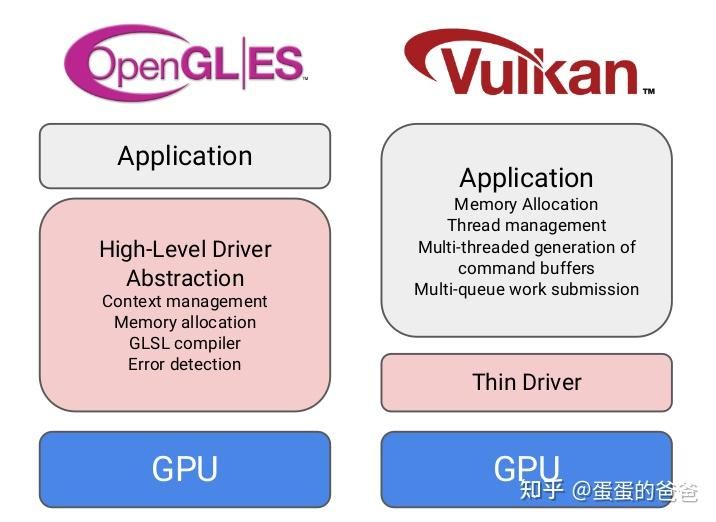


对UMD组来说是个大利好:)

**2.CPU多线程的效率提升**

在OpenGL中，所有的渲染操作都放在一个线程，其他线程就算处于空闲状态，也只能围观。

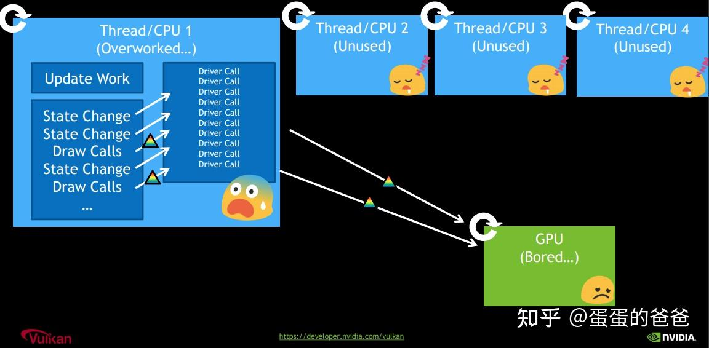


Vulkan中引入了 Command Buffer 的概念，每个线程都可以往Command Buffer 提交渲染命令，给开发者提供了充分发挥CPU多核多线程的优势。在复杂场景下，性能的提升非常客观！


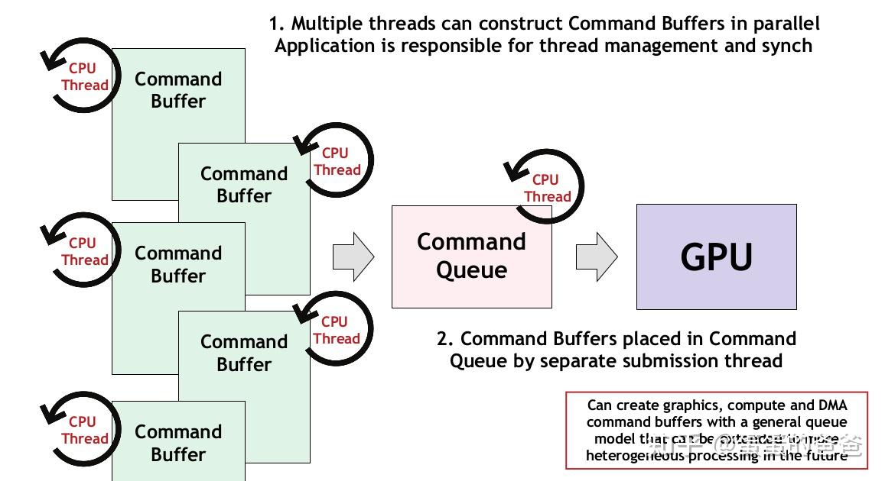

------

**Vulkan和OpenGL性能对比**

Khronos给出了一张各个图形API理论性能对比：

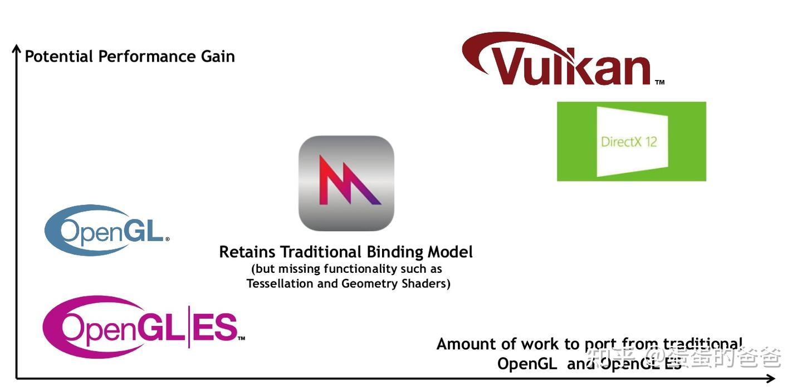


PowerVR做了一个视频做了Vulkan和OpenGL的性能对比：


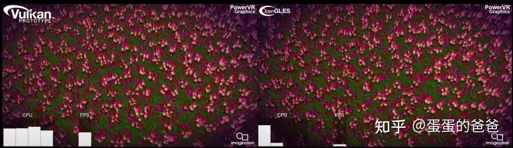


视频地址：PowerVR Rogue GPUs running Gnome Horde demo [https://www.youtube.com/watch?time_continue=26&v=P_I8an8jXuM&feature=emb_l](https://www.youtube.com/watch?time_continue=26&v=P_I8an8jXuM&feature=emb_logo)ogo

------

**Vulkan 适用范围**

行业内一致认为Vulkan是未来的趋势。但是具体到应用开发者，是否需要将所有的OpenGL应用移植到Vulkan？

要弄清这个问题，我们要知道Vulkan的优势是什么，它可以解决什么问题。

前文说了，Vulkan的优势在于显式控制、精细化API和天然多线程支持，这些功能使我们能够在更少的CPU时间内将更多命令推送到GPU。但是，OpenGL继续提供了更易于使用的硬件访问方式。

决定是使用OpenGL还是Vulkan，你需要平衡两者的优势和缺点，针对不同情况选择最合适的API。

**1.性能上的考虑**

如果你想通过Vulkan获得性能上的收益，你首先要搞清楚你的应用的[性能瓶颈](https://zhida.zhihu.com/search?content_id=192311255&content_type=Article&match_order=1&q=性能瓶颈&zhida_source=entity)在哪里？Vulkan并非是解决性能问题的万能灵药！

**2.非[渲染流程](https://zhida.zhihu.com/search?content_id=192311255&content_type=Article&match_order=3&q=渲染流程&zhida_source=entity)导致的性能问题**

*Vulkan提升的是驱动的性能*。如果你的应用本身性能存在问题，并非渲染流程导致，把OpenGL替换为Vulkan并不会对你带来巨大的收益。


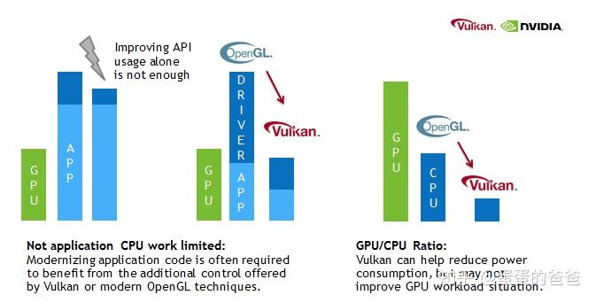


**3.GPU过载**

Vulkan和OpenGL在GPU的使用上没有质的差距，如果你应用的性能瓶颈在于GPU，如果GPU负荷过重，把OpenGL换成Vulkan也未必有多大的提升。

**4.对卡顿非常在意**

如果你的应用对微小的卡顿或者帧率抖动比较在意，Vulkan可以显式控制场景渲染期间何时发生耗时的操作。这比OpenGL通过[启发式](https://zhida.zhihu.com/search?content_id=192311255&content_type=Article&match_order=1&q=启发式&zhida_source=entity)（推断的方式）管理状态和资源更加有优势。


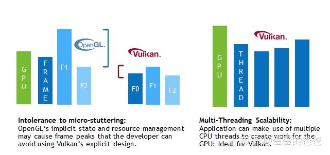


**5.希望进行多线程渲染**

如果OpenGL的单线程渲染让你的应用陷入了的性能瓶颈，你希望通过多线程充分发挥CPU能力，Vulkan非常适合。

**6.[离屏渲染](https://zhida.zhihu.com/search?content_id=192311255&content_type=Article&match_order=1&q=离屏渲染&zhida_source=entity)**

如果有离屏渲染的需求，Vulkan也可以胜任。

**7.复杂度的考虑**

使用Vulkan画一个三角形就需要上千行代码。Vulkan复杂繁琐的API对开发者提出了挑战。

如果只是为了解决实际问题，建议还是使用OpenGL，而不用编写大量的Vulkan代码。


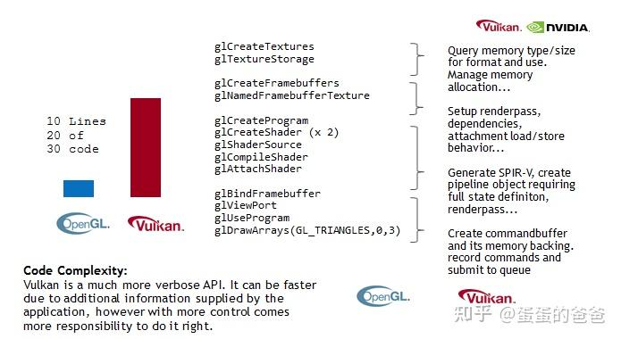

**8.开发者水准和更多的工作量**

OpenGL驱动会帮开发者做API验证、资源管理等操作，但是Vulkan的驱动把这些交给开发者。这对开发者提出了更高的要求。在开发过程中，你需要考虑内存管理、[线程同步](https://zhida.zhihu.com/search?content_id=192311255&content_type=Article&match_order=1&q=线程同步&zhida_source=entity)，一个不小心就会导致[crash](https://zhida.zhihu.com/search?content_id=192311255&content_type=Article&match_order=2&q=crash&zhida_source=entity)或者花屏，没人帮你处理，一切只能靠自己。

------

**程序小样**

先放一个vulkan小例子，框架本身对vulkan调用已做了大量简化

```text
#include <iostream>
#include <chrono>
#include <cstring>
#include <glm/mat4x4.hpp>
#include <glm/gtx/transform.hpp>
#include "VK_UniformBuffer.h"
#include "VK_Context.h"
#include "VK_Pipeline.h"
#include "VK_DynamicState.h"

using namespace std;

const std::vector<float> vertices = {
    0.0f, -0.5f, 0.0f, 1.0f, 0.0f, 0.0f, 0.5f,
    0.5f, 0.5f, 0.0f, 0.0f, 1.0f, 0.0f, 0.5f,
    -0.5f, 0.5f, 0.0f, 0.0f, 0.0f, 1.0f, 0.5
};

const std::vector<uint32_t> indices = {
    0, 1, 2
};

VK_Context *context = nullptr;
VK_Pipeline *pipeline = nullptr;

uint32_t updateUniformBufferData(char *&data, uint32_t size)
{
    static auto startTime = std::chrono::high_resolution_clock::now();
    auto currentTime = std::chrono::high_resolution_clock::now();
    float time = std::chrono::duration<float, std::chrono::seconds::period>
                 (currentTime - startTime).count();
    glm::mat4 model = glm::rotate(glm::mat4(1.0f), time * glm::radians(30.0f), glm::vec3(0.0f, 0.0f,
                                                                                         1.0f));
    memcpy(data, &model[0][0], size);
    return sizeof(model);
}

void onFrameSizeChanged(int width, int height)
{
    pipeline->getDynamicState()->applyDynamicViewport({0, 0, (float)width, (float)height, 0, 1});
}

int main()
{
    VK_ContextConfig config;
    config.debug = true;
    config.name = "Uniform Demo";

    context = createVkContext(config);
    context->createWindow(480, 480, true);
    context->setOnFrameSizeChanged(onFrameSizeChanged);

    VK_Context::VK_Config vkConfig;
    context->initVulkanDevice(vkConfig);

    auto shaderSet = context->createShaderSet();
    shaderSet->addShader("../shader/mvp/vert.spv", VK_SHADER_STAGE_VERTEX_BIT);
    shaderSet->addShader("../shader/mvp/frag.spv", VK_SHADER_STAGE_FRAGMENT_BIT);

    shaderSet->appendAttributeDescription(0, sizeof (float) * 3, VK_FORMAT_R32G32B32_SFLOAT, 0);
    shaderSet->appendAttributeDescription(1, sizeof (float) * 4, VK_FORMAT_R32G32B32A32_SFLOAT,
                                          sizeof(float) * 3);

    shaderSet->appendVertexInputBindingDescription(7 * sizeof(float), 0, VK_VERTEX_INPUT_RATE_VERTEX);

    VkDescriptorSetLayoutBinding uniformBinding = VK_ShaderSet::createDescriptorSetLayoutBinding(0,
                                                                                                 VK_DESCRIPTOR_TYPE_UNIFORM_BUFFER, VK_SHADER_STAGE_VERTEX_BIT);
    shaderSet->addDescriptorSetLayoutBinding(uniformBinding);

    if (!shaderSet->isValid()) {
        std::cerr << "invalid shaderSet" << std::endl;
        shaderSet->release();
        context->release();
        return -1;
    }

    auto ubo = shaderSet->addUniformBuffer(0, sizeof(float) * 16);
    ubo->setWriteDataCallback(updateUniformBufferData);

    context->initVulkanContext();
    pipeline = context->createPipeline(shaderSet);
    pipeline->getDynamicState()->addDynamicState(VK_DYNAMIC_STATE_VIEWPORT);
    pipeline->create();
    pipeline->getDynamicState()->applyDynamicViewport({0, 0, 480, 480, 0, 1});

    auto buffer = context->createVertexBuffer(vertices, 3 + 4, indices);
    pipeline->addRenderBuffer(buffer);

    context->createCommandBuffers();

    context->run();
    context->release();

    return 0;
}
```

[顶点着色器](https://zhida.zhihu.com/search?content_id=192311255&content_type=Article&match_order=1&q=顶点着色器&zhida_source=entity)

```text
#version 450
layout(location = 0) in vec3 position;
layout(location = 1) in vec4 color;
layout(location = 0) out vec4 fragColor;

layout(binding = 0) uniform UniformBufferObject {
    mat4 model;
} mvp;

void main() {
    gl_Position = mvp.model * vec4(position, 1.0);
    fragColor = color;
}
```

[片段着色器](https://zhida.zhihu.com/search?content_id=192311255&content_type=Article&match_order=1&q=片段着色器&zhida_source=entity)

```text
#version 450
layout(location = 0) in vec4 fragColor;
layout(location = 0) out vec4 outColor;

void main() {
    outColor = fragColor;
}
```

程序绘制的是一个三角形，每个定点使用不同的颜色。以笔者使用的Intel(R) UHD Graphics (Comet Lake 3x8 GT2) 配合统信操作系统，实时最高帧率接近50000帧/每秒

实际效果如下

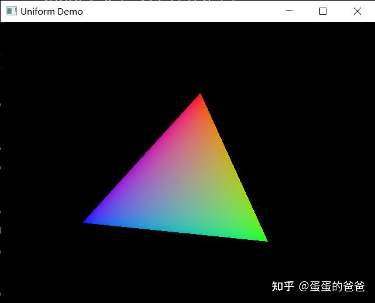


下面来[分析程序](https://zhida.zhihu.com/search?content_id=192311255&content_type=Article&match_order=1&q=分析程序&zhida_source=entity)。 程序中定义了二个回调，updateUniformBufferData用于实时更新uniform值，当程序窗口大小改变时通过onFrameSizeChanged重设视口

能看出的使用要点有

1. shader加载的是spv字节码，同时指定[字节码](https://zhida.zhihu.com/search?content_id=192311255&content_type=Article&match_order=3&q=字节码&zhida_source=entity)对应的是管线的那个阶段
2. 同时需要指定shader中各属性的location编号和尺寸
3. 需要显式指定Uniform在shader中的binding 值并指出其阶段

[管中窥豹](https://zhida.zhihu.com/search?content_id=192311255&content_type=Article&match_order=1&q=管中窥豹&zhida_source=entity)，能看出vulkan是用啰嗦程度换取了程序性能的提升

------

**Vulkan StateCreateInfo和函数说明**

Vulkan中对象创建函数大都有一个匹配的StateCreateInfo

```text
typedef struct VkDescriptorSetLayoutCreateInfo {
    VkStructureType                        sType;
    const void*                            pNext;
    VkDescriptorSetLayoutCreateFlags       flags;
    uint32_t                               bindingCount;
    const VkDescriptorSetLayoutBinding*    pBindings;
} VkDescriptorSetLayoutCreateInfo;
```

上面的是描述符集布局CreateInfo，其中sType是指定的类型枚举，固定且唯一；pNext指针为扩展接口使用，通常设置为0；flags为标识位；最后二个设置数据格式和内容

Vulkan有二类对象，通常看到的类如vkCreateDescriptorPool形式的为核心对象；以KHR结束的为扩展对象；最常用的扩展对象是VkSurfaceKHR - 渲染表面，因为并不是所有的vulkan程序都需展示出来。

------

**Vulkan初始化过程**

以创建图形程序为例，以下是一种可能的初始化过程 1. 创建程序窗口 2. 初始化Vulkan实例 - 完成对vulkan库的初始化 3. 初始化输出表面 - 指明渲染显示目的地 4. 枚举vulkan支持的物理设备并选择满足要求的物理设备（需要查询其是否支持指定特性以及支持程度，可能存在多个vulkan支持的设备。对于渲染程序，通常需要物理设备支持图形队列以及表面呈现队列） 5. 创建逻辑设备 - 根据指定物理设备即可创建逻辑设备（逻辑设备和物理设备相对应，但并不唯一。需要指出的是在创建[逻辑设备](https://zhida.zhihu.com/search?content_id=192311255&content_type=Article&match_order=4&q=逻辑设备&zhida_source=entity)时需要指定开启那些特性。如果需要使用[细分着色器](https://zhida.zhihu.com/search?content_id=192311255&content_type=Article&match_order=1&q=细分着色器&zhida_source=entity)则在这个步骤需要开启之。逻辑设备可能是vulkan中最常用的对象了，大部分vulkan对象都需要使用逻辑设备来完成创建工作） 6. 创建指令池对象 - vulkan中指令提交和传输需要通过指令缓冲来操作，对于指令缓冲需要构建指令池对象 7. 创建交换链 - vulkan中不存在默认帧缓冲的概念，需要一个缓存渲染缓冲的组件，这就是交换链。交换链本质上一个包含了若干等待呈现的图像的队列 8. 创建交换队列图像视图 - 有了交换链还不够，需要一组图形来保存渲染数据 9. 创建渲染通道 - 渲染通道用于表示[帧缓冲](https://zhida.zhihu.com/search?content_id=192311255&content_type=Article&match_order=2&q=帧缓冲&zhida_source=entity)，他是[子通道](https://zhida.zhihu.com/search?content_id=192311255&content_type=Article&match_order=1&q=子通道&zhida_source=entity)以及子通道关系的集合。[深度模板](https://zhida.zhihu.com/search?content_id=192311255&content_type=Article&match_order=1&q=深度模板&zhida_source=entity)附件、颜色附件、帧附件都是在此阶段被创建的 10. 创建描述符设置布局 - 描述符是一个特殊的不透明的[着色器变量](https://zhida.zhihu.com/search?content_id=192311255&content_type=Article&match_order=1&q=着色器变量&zhida_source=entity)，着色器使用它以间接的方式访问缓冲区和图像资源。[描述符集合](https://zhida.zhihu.com/search?content_id=192311255&content_type=Article&match_order=1&q=描述符集合&zhida_source=entity)是描述一个管线使用到的描述符集合。描述符布局则用于刻画其布局。 11. 创建管线布局 - 管道布局包含一个描述符集合布局的列表。推送常量在这个阶段被设置。 12. 创建帧缓冲 - 作为附件的图像依赖交换链用于呈现时返回的图像。这意味着我们必须为交换链中的所有图像创建一个帧缓冲区，并在绘制的时候使用对应的图像。其附件必须和渲染通道中使用的附件相匹配。 13. 创建描述符池 -描述符不能直接创建，需要从池中分配 14. 创建[描述符集](https://zhida.zhihu.com/search?content_id=192311255&content_type=Article&match_order=5&q=描述符集&zhida_source=entity) - 描述符池是根据交换链帧个数以及具体Shader中描述符数量和数据来创建的，着色器属性类型和其中涉及的uninform、location等信息是在这个阶段被传入的 15. 分配和更行描述符集 - 根据交换链帧个数、uniform数据以及图形视图是在这个阶段被处理的 16. 创建管线 - 根据Shader、管线布局、渲染通道以及其他相关信息即可构造管线 17. 创建命令缓冲 - 根据命令池、渲染通道、交换链帧个数即可分配并使用命令缓冲，其中对管线的绑定、描述符集的绑定以及开始和结束渲染通道是在这个阶段完成的。从某种意义上讲，这块类似早期OpenGL中的显示列表，决定了最终的渲染效果

------

**管线构建**

vulkan是使用以下结构体来描述管线信息的

```text
typedef struct VkGraphicsPipelineCreateInfo {
    VkStructureType                                  sType;
    const void*                                      pNext;
    VkPipelineCreateFlags                            flags;
    uint32_t                                         stageCount;
    const VkPipelineShaderStageCreateInfo*           pStages;
    const VkPipelineVertexInputStateCreateInfo*      pVertexInputState;
    const VkPipelineInputAssemblyStateCreateInfo*    pInputAssemblyState;
    const VkPipelineTessellationStateCreateInfo*     pTessellationState;
    const VkPipelineViewportStateCreateInfo*         pViewportState;
    const VkPipelineRasterizationStateCreateInfo*    pRasterizationState;
    const VkPipelineMultisampleStateCreateInfo*      pMultisampleState;
    const VkPipelineDepthStencilStateCreateInfo*     pDepthStencilState;
    const VkPipelineColorBlendStateCreateInfo*       pColorBlendState;
    const VkPipelineDynamicStateCreateInfo*          pDynamicState;
    VkPipelineLayout                                 layout;
    VkRenderPass                                     renderPass;
    uint32_t                                         subpass;
    VkPipeline                                       basePipelineHandle;
    int32_t                                          basePipelineIndex;
} VkGraphicsPipelineCreateInfo;
```

要创建管线，需要设置以下属性

1. 关联的Shader
2. 顶点输入格式 - 用于指定Shader Attribute属性格式和索引
3. 输入装配状态 - 使用细分着色器时需要指定[拓扑结构](https://zhida.zhihu.com/search?content_id=192311255&content_type=Article&match_order=1&q=拓扑结构&zhida_source=entity)为 - VK_PRIMITIVE_TOPOLOGY_PATCH_LIST
4. 细分状态 - 需要指定细分级别和控制点个数，后者需要和shader中控制点相等，可选
5. 视口状态 - 设置视口和裁剪
6. [光栅化](https://zhida.zhihu.com/search?content_id=192311255&content_type=Article&match_order=1&q=光栅化&zhida_source=entity) - 指定填充模式、线宽、渲染方向、剔除等
7. 多重采样 - 可选
8. [深度测试](https://zhida.zhihu.com/search?content_id=192311255&content_type=Article&match_order=1&q=深度测试&zhida_source=entity)和模板测试 - 可选
9. 颜色混合 - 可选
10. 动态状态 - 可选

------

**渲染循环**

大致渲染步骤如下

1. 从交换链中取出一张图像 - 通过使用 vkAcquireNextImageKHR
2. 更新uniform数据- vkMapMemory、vkUnmapMemory
3. 提交[指令缓冲](https://zhida.zhihu.com/search?content_id=192311255&content_type=Article&match_order=3&q=指令缓冲&zhida_source=entity) - 通过使用 vkQueueSubmit
4. 把要渲染的图像传给交换链以做呈现 - 通过调用vkQueuePresentKHR

看上去是不是很简单？ 真实场景下比这个要复杂很多，一个是涉及[交换链](https://zhida.zhihu.com/search?content_id=192311255&content_type=Article&match_order=12&q=交换链&zhida_source=entity)和管线重建、二是由于vulkan天然支持多线程，因此在实际场景中需要处理同步、等待等类多线程问题。

真实的渲染流程大致如下

```text
for (auto pipeline : pipelines) {
        if (pipeline->needRecreate() || needUpdateSwapChain) {
            recreateSwapChain();
            needUpdateSwapChain = false;
        }
    }

    vkWaitForFences(device, 1, &inFlightFences[currentFrame], VK_TRUE, UINT64_MAX);

    uint32_t imageIndex;
    VkResult result = vkAcquireNextImageKHR(device, swapChain, UINT64_MAX,
                                            imageAvailableSemaphores[currentFrame],
                                            VK_NULL_HANDLE, &imageIndex);

    if (result == VK_ERROR_OUT_OF_DATE_KHR) {
        recreateSwapChain();
        return;
    } else if (result != VK_SUCCESS && result != VK_SUBOPTIMAL_KHR) {
        std::cerr << "failed to acquire swap chain image!" << std::endl;
    }

    vkBaseShaderSet->update(imageIndex);

    if (imagesInFlight[imageIndex] != VK_NULL_HANDLE) {
        vkWaitForFences(device, 1, &imagesInFlight[imageIndex], VK_TRUE, UINT64_MAX);
    }
    imagesInFlight[imageIndex] = inFlightFences[currentFrame];

    VkSubmitInfo submitInfo{};
    submitInfo.sType = VK_STRUCTURE_TYPE_SUBMIT_INFO;

    VkSemaphore waitSemaphores[] = {imageAvailableSemaphores[currentFrame]};
    VkPipelineStageFlags waitStages[] = {VK_PIPELINE_STAGE_COLOR_ATTACHMENT_OUTPUT_BIT};
    submitInfo.waitSemaphoreCount = 1;
    submitInfo.pWaitSemaphores = waitSemaphores;
    submitInfo.pWaitDstStageMask = waitStages;

    submitInfo.commandBufferCount = 1;
    submitInfo.pCommandBuffers = &commandBuffers[imageIndex];

    VkSemaphore signalSemaphores[] = {renderFinishedSemaphores[currentFrame]};
    submitInfo.signalSemaphoreCount = 1;
    submitInfo.pSignalSemaphores = signalSemaphores;

    vkResetFences(device, 1, &inFlightFences[currentFrame]);

    if (vkQueueSubmit(graphicsQueue, 1, &submitInfo, inFlightFences[currentFrame]) != VK_SUCCESS) {
        std::cerr << "failed to submit draw command buffer!" << std::endl;
    }

    VkPresentInfoKHR presentInfo{};
    presentInfo.sType = VK_STRUCTURE_TYPE_PRESENT_INFO_KHR;

    presentInfo.waitSemaphoreCount = 1;
    presentInfo.pWaitSemaphores = signalSemaphores;

    VkSwapchainKHR swapChains[] = {swapChain};
    presentInfo.swapchainCount = 1;
    presentInfo.pSwapchains = swapChains;

    presentInfo.pImageIndices = &imageIndex;

    result = vkQueuePresentKHR(presentQueue, &presentInfo);

    if (result == VK_ERROR_OUT_OF_DATE_KHR ||
            result == VK_SUBOPTIMAL_KHR ||
            framebufferResized) {
        framebufferResized = false;
        recreateSwapChain();
    } else if (result != VK_SUCCESS) {
        std::cerr << "failed to present swap chain image!" << std::endl;
    }

    currentFrame = (currentFrame + 1) % vkConfig.maxFramsInFlight;
```

------

**交换链和管线重建**

创建完管线，管线并不意味着始终有效，如果渲染呈现丢失，或者窗口大小发生变化时，或者管线配置发生变化时都需要重新构造交换链和管线。

交换链和管线的重建，意味着需要以下相关对象都要重新创建

1. 交换链
2. 交换链视图
3. 渲染通道
4. 描述符设置布局
5. 管线布局
6. 管线
7. 帧缓冲
8. 描述符池
9. [命令缓冲](https://zhida.zhihu.com/search?content_id=192311255&content_type=Article&match_order=3&q=命令缓冲&zhida_source=entity)

------

**延伸概念**

以上讨论了Vulkan基本流程，下面讨论一些常见的衍生概念

***1.验证层\***

从以上环节可以看出，Vulkan API设计宗旨是围绕最小化[驱动程序](https://zhida.zhihu.com/search?content_id=192311255&content_type=Article&match_order=1&q=驱动程序&zhida_source=entity)开销进行的，所以，默认情况下，Vulkan API提供的错误检查功能非常有限。很多很基本的错误都没有被 Vulkan 显式地处理 ，遇到错误程序 则会 直接崩溃或者发生未被明确定义的行为。 Vukan需要我们***显式地定义\***每一个操作，所以就很容易在使用过程中产生一些小错误，比如使用了一个新的 GPU 特性，却忘记在逻辑设备创建时请求这一特性。Vulkan 引入 了校验层来优雅地解决这个问题。校验层是一个可选的可以用来在 Vulkan API 函数调用上进行附加操作的组件。校验层常被用来做下面的工作：

1. 检测参数值是否合法
2. 追踪对象的创建和清除操作，发现资源泄漏问题
3. 追踪调用来自的线程，检测是否[线程安全](https://zhida.zhihu.com/search?content_id=192311255&content_type=Article&match_order=1&q=线程安全&zhida_source=entity)。
4. 将 API 调用和调用的参数写入日志
5. 追踪 API 调用进行分析和回放

***2.管线缓存和管线动态状态\***

管线构建是相当复杂的，在程序中需要尽可能的少重建管线，或者创建管线时希望创建的快一些。这二个是不同的思路，在vulkan中对应二个不同的对象，一是管线缓冲 - vkPiplelineCache，在创建管线时先从已有管线池中查阅是否已有对应特征的管线，存在则直接使用、否则再创建之，退出程序时把管线缓冲保存为文件。看上去不错，不过管线缓冲和具体硬件强相关，在加载管线缓存文件时需要做校验工作；二是对诸如视口、裁剪、线宽、深度测试范围等一些修改可能很频繁的属性做[特殊处理](https://zhida.zhihu.com/search?content_id=192311255&content_type=Article&match_order=1&q=特殊处理&zhida_source=entity)，让这些状态在发生改变时无需重新创建管线 - 这种思路实现方式叫管线动态状态。使用时需要在创建逻辑设备时指定开启动态状态

***3.自定义内存配置器\***

一些特定的场合可能需要使用手动分配内存货使用程序自定义的[内存分配](https://zhida.zhihu.com/search?content_id=192311255&content_type=Article&match_order=1&q=内存分配&zhida_source=entity)，因此又引入了一个概念 - VkAllocationCallbacks，不论何种内存分配器，都需要提供基本的[malloc](https://zhida.zhihu.com/search?content_id=192311255&content_type=Article&match_order=1&q=malloc&zhida_source=entity)、free以及relloc功能

***4.推送常量\***

vulkan除了提供OpenGL中uniform量外，还提供了一种性能更高的手段 - 推送常量。 他使用指令缓存的方式， 而不是非资源的写入或者复制描述符来完成更新的操作，适合更新管线流水中的常量数据。推送常量设置于管线布局，因此关联管线只能有一个推送常量

**5.栅栏、管线屏障、事件和信号**

由于vulkan涉及主机、设备；同时对提交函数的执行不是同步的，所以需要一系列同步对象；栅栏用于CPU内同步、管线屏障则用来保证设备内[命令缓存](https://zhida.zhihu.com/search?content_id=192311255&content_type=Article&match_order=1&q=命令缓存&zhida_source=entity)的执行次序保持不变。

**6.缓存和图像**

缓存是一段主机内存，可以是uniform也可以是图像，没有显著格式；图像则是一种有明确格式的资源，位于设备端

------

**Vulkan进阶**

**派生管线**

如果一帧要渲染多个对象，或者使用不同参数渲染同一对象，比如在同一帧下使用填充模式渲染一个茶壶，使用线框模式显示一个AABB；这种场景下使用一个管线是不够的，因此需要同期使用多个管线。Vulkan是支持多个管线的。如果有多个管线，且管线之间有明显相同之处，比如都是基于一组Shader，则可以考虑使用派生管线。创建父管线时指定其可派生，创建子管线时指定其父管线。同时使用父管线管线CreateInfo然后修改需要调整的部分即可。然后在创建命令缓冲过程中绑定管线、管线布局然后渲染数据即可。

***多管线\*** 如果管线之前没有明显相同处，或者不想使用派生管线，则可以单独创建几个独立管线。如果程序有多组Shader则需要使用多管线

------

**Vulkan高级话题**

**推送描述符**

除了推送常量，Vulkan还提供推送描述符的功能。推送描述符需要提供写描述符的数据即可，然后在提交命令缓冲阶段提交给GPU即可。推送描述符是一个扩展函数，不一定所有显卡都支持此扩展，至少早期vulkan如此

**多实例渲染**

要同时渲染多次统一物体，OpenGL中是使用glDrawArraysInstanced来完成的。在Vulkan中要达到此目标，需要在创建逻辑设备时显式开启此功能。然后创建对应的多实例Buffer，指定每个实例位置等不同信息；再创建一组VkDrawIndirectCommand用于记录实例个数、开始实例位置、顶点数据等相关信息。然后在提交命令缓冲阶段调用vkCmdDrawIndirect；需要注意的是在创建管线时需要设置对应的VertexInputBindingDescription类型是VK_VERTEX_INPUT_RATE_INSTANCE而不是VK_VERTEX_INPUT_RATE_VERTEX，同时需要设置其尺寸大小和binding

**几何着色器**

要使用[几何着色器](https://zhida.zhihu.com/search?content_id=192311255&content_type=Article&match_order=2&q=几何着色器&zhida_source=entity)，需要在创建逻辑设备时启动此功能。其他和OpenGL的并无区别。笔者使用几何着色器来模拟实现了细分着色器的效果。

**细分着色器**

要使用细分着色器，在创建逻辑设备前需要开启细分着色器和fillModeNonSolid。然后在创建管线前修改其输入状态设置的拓扑结构为VK_PRIMITIVE_TOPOLOGY_PATCH_LIST。Shader这块和OpenGL类似。另外别忘了修改细分状态CreateInfo中的控制点个数。此值需要和Shader中的个数保持一致

------

**未完待续**

- 多线程命令提交
- 次级命令缓冲
- 计算管线
- 查询
- [光线追踪](https://zhida.zhihu.com/search?content_id=192311255&content_type=Article&match_order=1&q=光线追踪&zhida_source=entity)
- 球面纹理
- 阴影映射
- GLFT
- ...

------

没看vulkan之前感觉OpenGL是个牛夫人，看完vulkan后觉得是个[小甜甜](https://zhida.zhihu.com/search?content_id=192311255&content_type=Article&match_order=1&q=小甜甜&zhida_source=entity)~

**参考资料**

1. https://zhuanlan.zhihu.com/p/165141740
2. https://zhuanlan.zhihu.com/p/430397192
3. [https://github.com/Overv/VulkanTutorial](https://github.com/Overv/VulkanTutorial)
4. [https://github.com/LunarG/VulkanSamples](https://github.com/LunarG/VulkanSamples)
5. [https://github.com/SaschaWillems/Vulkan](https://github.com/SaschaWillems/Vulkan)
6. [https://github.com/ccsdu2004/vulkan-cpp-demo](https://github.com/ccsdu2004/vulkan-cpp-demo)