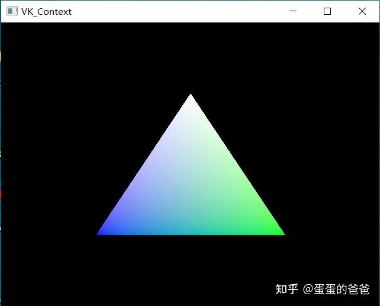
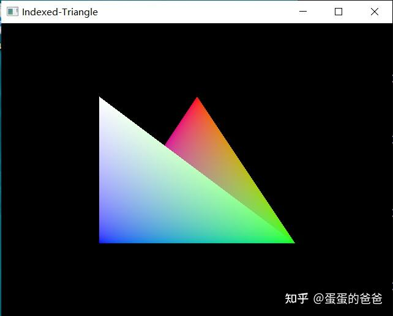

# Vulkan从入门到精通2-绘制三角形

从这篇起，我们正式上手Vulkan。从三角形绘制讲起。

早期OpenGL是使用glBegin/glEnd块绘制的三角形的，最大的问题是数据是一个点一个点传输的，效率极低

```text
    glBegin(GL_TRIANGLES);
        glVertex3f(0.0f, -0.5f, 0.0f);
	glVertex3f(0.5f, 0.5f,0.0f);
	glVertex3f(-0.5f, 0.5f,0.0f);
    glEnd();
```

3.0以后对的版本是使用glBufferData加载数据，glVertexPointer设置数据格式和长度，使用glDrawArrays来绘制数据。通常是在CPU端设置数据，之后传输到显存（当然也可以通过glMapBuffer直接从显存映射内存）

在Vulkan中，顶点的类型是在初始化管线的时候指定，比如笔者设置的顶点结构如下

```c-objdump
struct VK_Vertex
{
    vmath::vec3 position;
    vmath::vec4 color;
    vmath::vec3 normal;
    vmath::vec2 texCoord;

    static VkVertexInputBindingDescription getBindingDescription();
    static std::array<VkVertexInputAttributeDescription, 4> getAttributeDescriptions();
};
```

一次性提供位置，颜色，法线和纹理坐标，二个[静态函数](https://zhida.zhihu.com/search?content_id=184278792&content_type=Article&match_order=1&q=静态函数&zhida_source=entity)分别是获取顶点绑定描述符以及属性描述符号

实现如下

```text
VkVertexInputBindingDescription VK_Vertex::getBindingDescription()
{
    VkVertexInputBindingDescription bindingDescription{};
    bindingDescription.binding = 0;
    bindingDescription.stride = sizeof(VK_Vertex);
    bindingDescription.inputRate = VK_VERTEX_INPUT_RATE_VERTEX;

    return bindingDescription;
}

std::array<VkVertexInputAttributeDescription, 4> VK_Vertex::getAttributeDescriptions()
{
    std::array<VkVertexInputAttributeDescription, 4> attributeDescriptions{};

    attributeDescriptions[0].binding = 0;
    attributeDescriptions[0].location = 0;
    attributeDescriptions[0].format = VK_FORMAT_R32G32B32_SFLOAT;
    attributeDescriptions[0].offset = offsetof(VK_Vertex, position);

    attributeDescriptions[1].binding = 0;
    attributeDescriptions[1].location = 1;
    attributeDescriptions[1].format = VK_FORMAT_R32G32B32A32_SFLOAT;
    attributeDescriptions[1].offset = offsetof(VK_Vertex, color);

    attributeDescriptions[2].binding = 0;
    attributeDescriptions[2].location = 2;
    attributeDescriptions[2].format = VK_FORMAT_R32G32B32_SFLOAT;
    attributeDescriptions[2].offset = offsetof(VK_Vertex, normal);

    attributeDescriptions[3].binding = 0;
    attributeDescriptions[3].location = 3;
    attributeDescriptions[3].format = VK_FORMAT_R32G32_SFLOAT;
    attributeDescriptions[3].offset = offsetof(VK_Vertex, texCoord);

    return attributeDescriptions;
}
```

第一个函数stride指定数据间隔，这里数据是紧密排列的，第二个函数中location是数据索引，和shader[中数据](https://zhida.zhihu.com/search?content_id=184278792&content_type=Article&match_order=1&q=中数据&zhida_source=entity)索引必须一致。此顶点匹配的vert shader如下

```text
#version 450
layout(location = 0) in vec3 inPosition;
layout(location = 1) in vec4 inColor;
layout(location = 0) out vec4 fragColor;

void main() {
    gl_Position = vec4(inPosition, 1.0);
    fragColor = inColor;
}
```

注意，只用了顶点和颜色二个属性

之后在初始化管线的时候，首先构造一个VertexInputStateCreateInfo，设置二个[描述符](https://zhida.zhihu.com/search?content_id=184278792&content_type=Article&match_order=3&q=描述符&zhida_source=entity)，由于顶点描述符号只有一个，所以描述符个数就是1

```text
    VkPipelineVertexInputStateCreateInfo vertexInputInfo{};
    vertexInputInfo.sType = VK_STRUCTURE_TYPE_PIPELINE_VERTEX_INPUT_STATE_CREATE_INFO;

    vertexInputInfo.vertexBindingDescriptionCount = 1;
    vertexInputInfo.vertexAttributeDescriptionCount = static_cast<uint32_t>(attributeDescriptions.size());
    vertexInputInfo.pVertexBindingDescriptions = &bindingDescription;
    vertexInputInfo.pVertexAttributeDescriptions = attributeDescriptions.data();
```

随后把这个createinfo 传给管线CreateInfo的pVertexInputState即可

```text
    VkGraphicsPipelineCreateInfo pipelineInfo{};
    pipelineInfo.sType = VK_STRUCTURE_TYPE_GRAPHICS_PIPELINE_CREATE_INFO;
    pipelineInfo.stageCount = vkShaderSet->getCreateInfoCount();
    pipelineInfo.pStages = vkShaderSet->getCreateInfoData();
    pipelineInfo.pVertexInputState = &vertexInputInfo;
```

Vulkan对象构造的一大特点是首先有个对象的CreateInfo，填好后传给对象的对象Create函数即可。

顶点数据的传输则是由VkBuffer、VkDeviceMemory配合完成。

笔者封装的数据提交模板函数如下

```c-objdump
    template<class T>
    inline void createBufferData(const std::vector<T>& input, VkBuffer& inputBuffer, VkDeviceMemory& deviceMemory)
    {
        auto bufferSize = sizeof(T) * input.size();

        VkBuffer stagingBuffer;
        VkDeviceMemory stagingBufferMemory;
        context->createBuffer(bufferSize, VK_BUFFER_USAGE_TRANSFER_SRC_BIT, VK_MEMORY_PROPERTY_HOST_VISIBLE_BIT | VK_MEMORY_PROPERTY_HOST_COHERENT_BIT, stagingBuffer, stagingBufferMemory);

        void* data;
        vkMapMemory(device, stagingBufferMemory, 0, bufferSize, 0, &data);
        memcpy(data, input.data(), (size_t) bufferSize);
        vkUnmapMemory(device, stagingBufferMemory);

        context->createBuffer(bufferSize, VK_BUFFER_USAGE_TRANSFER_DST_BIT | VK_BUFFER_USAGE_VERTEX_BUFFER_BIT, VK_MEMORY_PROPERTY_DEVICE_LOCAL_BIT, inputBuffer, deviceMemory);
        context->copyBuffer(stagingBuffer, inputBuffer, bufferSize);

        vkDestroyBuffer(device, stagingBuffer, nullptr);
        vkFreeMemory(device, stagingBufferMemory, nullptr);
    }
```

这里T = VK_Vertex， input是传入顶点数据列表，另外二个参数是待构建VkBuffer和VkDeviceMemory。

函数 vkMapMemory作用是映射显存数据到程序地址，之后用户可以把数据传输到显存，完事后使用vkUnmapMemory结束映射 - 这二个函数功能和glMapBuffer/glUnmapBuffer接近。注意Vulkan中没有类似VAO/VBO等概念

在绘制的时候，首先使用 vkCmdBindVertexBuffers 绑定数据，然后使用vkCmdDraw或者vkCmdBindIndexBuffer+vkCmdDrawIndexed绘制（后面的绘制方式是基于顶点索引绘制）

在Demo里，笔者是把的顶点绘制封装为VK_VertexBuffer类的，具体绘制函数如下

```text
void VK_VertexBuffer::render(VkCommandBuffer command)
{
    VkBuffer vertexBuffers[] = {buffer};
    VkDeviceSize offsets[] = {0};
    vkCmdBindVertexBuffers(command, 0, 1, vertexBuffers, offsets);
    if(!indexedVertex) {
        vkCmdDraw(command, count, 1, 0, 0);
    } else {
        vkCmdBindIndexBuffer(command, indexedBuffer, 0, VK_INDEX_TYPE_UINT16);
        vkCmdDrawIndexed(command, static_cast<uint32_t>(count), 1, 0, 0, 0);
    }
}
```

在程序中并没有通过循环调用这里的[render函数](https://zhida.zhihu.com/search?content_id=184278792&content_type=Article&match_order=1&q=render函数&zhida_source=entity)渲染，而是使用类似OpenGL中显示列表的方式。

构建一系列的Command Buffer，然后使用vkBeginCommandBuffer 记录，使用vkEndCommandBuffer结束渲染命令。

最终的绘制截图如下



当然可以构造二组三角形顶点并渲染，结果如下




代码仓库地址 -

[https://github.com/ccsdu2004/vulkan-cpp-demogithub.com/ccsdu2004/vulkan-cpp-demo](https://github.com/ccsdu2004/vulkan-cpp-demo)


本文涉及Vulkan函数有

- vkMapMemory
- vkUnmapMemory
- vkDestroyBuffer
- vkFreeMemory
- vkCreateBuffer
- vkBindBufferMemory
- vkAllocateCommandBuffers
- vkBeginCommandBuffer
- vkEndCommandBuffer
- vkCmdCopyBuffer
- vkCmdBindVertexBuffers
- vkCmdDraw
- vkCmdBindIndexBuffer
- vkCmdDrawIndexed

