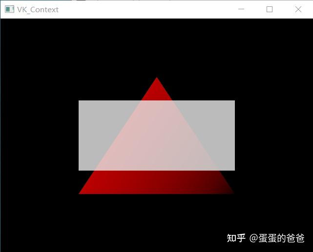
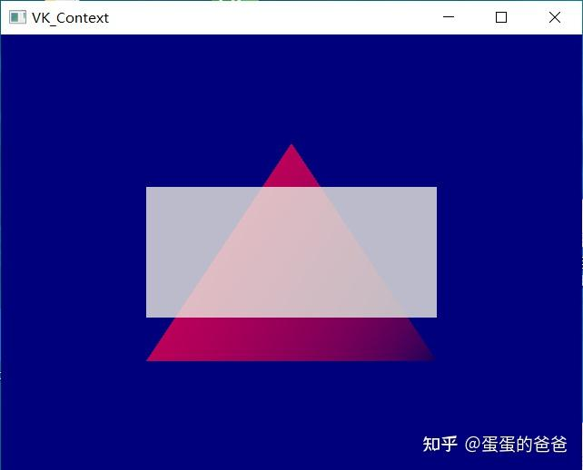

# Vulkan从入门到精通4-颜色混合和清屏

上篇讲的是管线缓存和验校，这篇讲讲颜色混合和清屏。

Vulkan中大部分管线参数发生变化的时候都需要重新创建管线。比如我们打开或者关闭颜色混合，修改清屏色，都需要创建一个对应的管线。为方便期间，引入一个dirty变量，在渲染更新的时候判断此变量，如果需要更新管线，则重新创建之。代码见写

```cpp
void VK_ContextImpl::recreateSwapChain()
{
    int width = 0, height = 0;
    glfwGetFramebufferSize(window, &width, &height);
    while (width == 0 || height == 0) {
        glfwGetFramebufferSize(window, &width, &height);
        glfwWaitEvents();
    }

    vkDeviceWaitIdle(device);

    cleanupSwapChain();

    createSwapChain();
    createImageViews();
    createRenderPass();
    createGraphicsPipeline();
    createFramebuffers();

    createDescriptorPool();

    if(vkUniformBuffer)
        vkUniformBuffer->initDescriptorSets(descriptorSetLayout, swapChainImages.size(), descriptorPool);

    createCommandBuffers();

    imagesInFlight.resize(swapChainImages.size(), VK_NULL_HANDLE);
}
```

清屏颜色在vkBeginCommandBuffer调用后被设置

```text
        VkRenderPassBeginInfo renderPassInfo{};
        renderPassInfo.sType = VK_STRUCTURE_TYPE_RENDER_PASS_BEGIN_INFO;
        renderPassInfo.renderPass = renderPass;
        renderPassInfo.framebuffer = swapChainFramebuffers[i];
        renderPassInfo.renderArea.offset = {0, 0};
        renderPassInfo.renderArea.extent = swapChainExtent;

        renderPassInfo.clearValueCount = 1;
        renderPassInfo.pClearValues = &vkClearValue;
```

颜色混合附件状态结构体如下

```text
typedef struct VkPipelineColorBlendAttachmentState {
    VkBool32                 blendEnable;
    VkBlendFactor            srcColorBlendFactor;
    VkBlendFactor            dstColorBlendFactor;
    VkBlendOp                colorBlendOp;
    VkBlendFactor            srcAlphaBlendFactor;
    VkBlendFactor            dstAlphaBlendFactor;
    VkBlendOp                alphaBlendOp;
    VkColorComponentFlags    colorWriteMask;
} VkPipelineColorBlendAttachmentState;
```

详细介绍在这里 - [VkPipelineColorBlendAttachmentState(3)](https://link.zhihu.com/?target=https%3A//www.khronos.org/registry/vulkan/specs/1.2-extensions/man/html/VkPipelineColorBlendAttachmentState.html) 。其实和OpenGL颜色混合方程是一样的，只是结构不同。

此结构体被设置在VkGraphicsPipelineCreateInfo中的pColorBlendState字段，之后即可重新创建管线。

笔者写的测试代码如下

```text
#include <iostream>
#include "VK_Context.h"

using namespace std;

const std::vector<VK_Vertex> vertices1 = {
    {{0.0f, -0.5f, 0.0f}, {1.0f, 0.0f, 0.0f, 0.5f}, {0.0f, 0.0f, 0.0f}, {0.0f, 0.0f}},
    {{0.5f, 0.5f, 0.0f}, {0.0f, 0.0f, 0.0f, 0.5f}, {0.0f, 0.0f, 0.0f}, {0.0f, 0.0f}},
    {{-0.5f, 0.5f, 0.0f}, {1.0f, 0.0f, 0.0f, 0.5f}, {0.0f, 0.0f, 0.0f}, {0.0f, 0.0f}}
};

const std::vector<VK_Vertex> vertices2 = {
    {{-0.5f, -0.3f, 0.0f}, {1.0f, 1.0f, 1.0f, 0.5f}, {0.0f, 0.0f, 0.0f}, {0.0f, 0.0f}},
    {{0.5f, -0.3f, 0.0f}, {1.0f, 1.0f, 1.0f, 0.5f}, {0.0f, 0.0f, 0.0f}, {0.0f, 0.0f}},
    {{0.5f, 0.3f, 0.0f}, {1.0f, 1.0f, 1.0f, 0.5f}, {0.0f, 0.0f, 0.0f}, {0.0f, 0.0f}},
    {{0.5f, 0.3f, 0.0f}, {1.0f, 1.0f, 1.0f, 0.5f}, {0.0f, 0.0f, 0.0f}, {0.0f, 0.0f}},
    {{-0.5f, 0.3f, 0.0f}, {1.0f, 1.0f, 1.0f, 0.5f}, {0.0f, 0.0f, 0.0f}, {0.0f, 0.0f}},
    {{-0.5f, -0.3f, 0.0f}, {1.0f, 1.0f, 1.0f, 0.5f}, {0.0f, 0.0f, 0.0f}, {0.0f, 0.0f}},
};

VK_Context* context = nullptr;

void onMouseButtonCallback(int button, int action, int mods)
{
    auto blend = context->getColorBlendAttachmentState();
    if(action) {
        blend.blendEnable = VK_TRUE;
        blend.srcColorBlendFactor = VK_BLEND_FACTOR_SRC_ALPHA;
        blend.dstColorBlendFactor = VK_BLEND_FACTOR_ONE_MINUS_SRC_ALPHA;
        blend.colorBlendOp = VK_BLEND_OP_ADD;
        blend.srcAlphaBlendFactor = VK_BLEND_FACTOR_ONE;
        blend.dstAlphaBlendFactor = VK_BLEND_FACTOR_ZERO;
        blend.alphaBlendOp = VK_BLEND_OP_ADD;
        context->setColorBlendAttachmentState(blend);
        context->setClearColor(0, 0, 0.2, 0.3);
    } else {
        blend.blendEnable = VK_FALSE;
        context->setColorBlendAttachmentState(blend);
        context->setClearColor(0, 0.2, 0.2, 0.3);
    }
}

int main()
{
    VK_ContextConfig config;
    config.debug = false;
    config.mouseCallback = &onMouseButtonCallback;

    context = createVkContext(config);
    context->createWindow(640, 480, true);

    VK_Context::VK_Config vkConfig;
    context->initVulkan(vkConfig);

    auto shaderSet = context->createShaderSet();
    shaderSet->addShader("shader/vertex/vert.spv", VK_SHADER_STAGE_VERTEX_BIT);
    shaderSet->addShader("shader/vertex/frag.spv", VK_SHADER_STAGE_FRAGMENT_BIT);

    if(!shaderSet->isValid()) {
        std::cerr << "invalid shaderSet" << std::endl;
        shaderSet->release();
        context->release();
        return -1;
    }

    context->initPipeline(shaderSet);

    auto buffer = context->createVertexBuffer(vertices1);
    context->addBuffer(buffer);

    buffer = context->createVertexBuffer(vertices2);
    context->addBuffer(buffer);

    context->createCommandBuffers();

    context->run();
    context->release();

    return 0;
}
```

点击鼠标放开鼠标即可切换[混合模式](https://zhida.zhihu.com/search?content_id=184689694&content_type=Article&match_order=1&q=混合模式&zhida_source=entity)和背景色

截图如下






代码仓库在这里

[https://github.com/ccsdu2004/vulkan-cpp-demogithub.com/ccsdu2004/vulkan-cpp-demo](https://link.zhihu.com/?target=https%3A//github.com/ccsdu2004/vulkan-cpp-demo)

